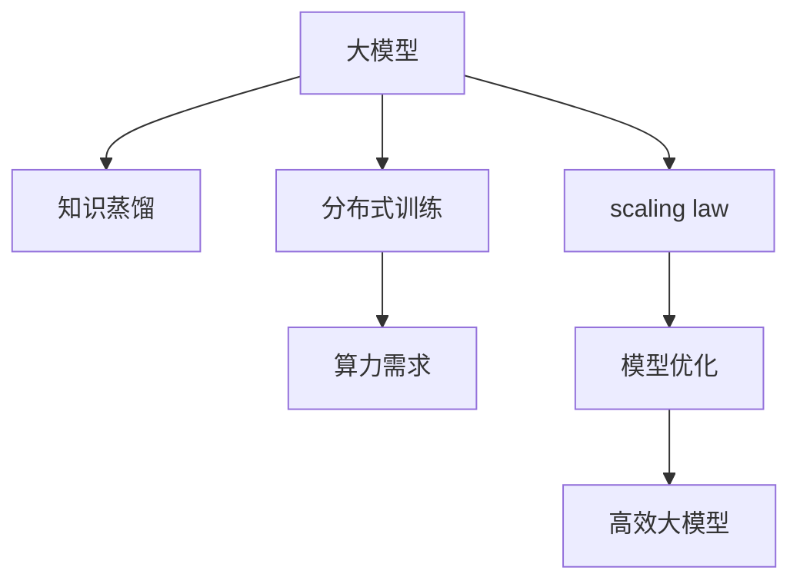

                 

# AI 大模型原理与应用：基于 scaling law 让模型变大，探索智能的边界

> 关键词：大模型, scaling law, 模型优化, 深度学习, 知识蒸馏, 分布式训练, 算力需求

## 1. 背景介绍

### 1.1 问题由来

近年来，深度学习技术在人工智能领域取得了突飞猛进的发展，而大模型，尤其是自回归模型，在自然语言处理、计算机视觉、语音识别等任务上表现出色。然而，随着模型规模的增大，其对算力、存储和训练时间的消耗也急剧增加，使得大模型难以在实际应用中大规模部署。

这引发了学界对“模型越大越好”这一概念的深入思考。研究者们开始探索如何在保持模型性能的前提下，通过更优的算法和架构，实现更高效、更易部署的大模型。其中，基于 scaling law 的大模型优化，成为了一个热门研究方向。

### 1.2 问题核心关键点

在大模型优化的过程中，一个核心的挑战是如何平衡模型规模和性能。传统的观点认为，模型的规模越大，其表征能力越强，能够捕捉更多的特征，从而获得更好的性能。然而，大规模模型也伴随着更高的计算需求，训练时间和资源消耗巨大，限制了其在实际场景中的应用。

基于 scaling law 的模型优化方法，旨在通过更高效的算法和架构设计，在保持模型性能的同时，尽可能降低算力需求，实现“高效大模型”。这种方法的核心思想是，通过理解模型规模与性能之间的关系，设计出既能保持高性能又能降低算力需求的大模型。

## 2. 核心概念与联系

### 2.1 核心概念概述

为更好地理解基于 scaling law 的大模型优化方法，本节将介绍几个关键概念：

- **大模型**：指具有大量参数的深度学习模型，通常以百亿或千亿计，能够处理大规模数据集，学习复杂的模式和规律。
- **scaling law**：表示模型性能与参数规模之间的关系，即当参数规模增加时，模型的性能会以怎样的规律变化。
- **知识蒸馏**：一种模型优化技术，通过将大型模型知识传递给小型模型，提高小型模型的性能。
- **分布式训练**：使用多台计算机并行训练模型，提高训练效率，加速模型收敛。
- **算力需求**：指训练和推理大模型所需的计算资源，包括GPU、TPU等硬件设备，以及相应的内存和存储资源。

这些核心概念之间的逻辑关系可以通过以下Mermaid流程图来展示：



这个流程图展示了大模型的核心概念及其之间的关系：

1. 大模型通过知识蒸馏和分布式训练进行优化，降低算力需求。
2. scaling law 揭示了模型规模与性能之间的内在规律。
3. 根据 scaling law，设计高效大模型，平衡性能与算力。

## 3. 核心算法原理 & 具体操作步骤

### 3.1 算法原理概述

基于 scaling law 的大模型优化方法，旨在通过更高效的算法和架构设计，在保持模型性能的同时，尽可能降低算力需求，实现“高效大模型”。这种方法的核心思想是，通过理解模型规模与性能之间的关系，设计出既能保持高性能又能降低算力需求的大模型。

形式化地，假设模型为 $M_{\theta}$，其中 $\theta$ 为模型参数。模型在大数据集 $D$ 上的训练误差为 $\mathcal{L}$。模型性能与其参数规模 $s$ 之间的关系可以用如下公式表示：

$$
\mathcal{L}(s) = f(s)
$$

其中 $f(s)$ 为模型性能随参数规模变化的函数。通过研究 $f(s)$ 的性质，可以找到最优的参数规模 $s^*$，使得模型性能最优，同时算力需求最小。

### 3.2 算法步骤详解

基于 scaling law 的大模型优化方法一般包括以下几个关键步骤：

**Step 1: 收集数据和模型**  
- 收集大规模无标签数据集 $D$，划分为训练集、验证集和测试集。
- 选择目标模型架构，如Transformer、ResNet等，并在数据集上预训练模型 $M_{\theta}$。

**Step 2: 分析 scaling law**  
- 分析模型在大数据集上的训练误差 $\mathcal{L}(s)$，得到 $f(s)$ 的函数表达式。
- 通过实验分析，找到最优的参数规模 $s^*$。

**Step 3: 知识蒸馏**  
- 使用大型预训练模型 $M_{\theta_{large}}$ 作为知识源，通过知识蒸馏方法，将知识传递给小型模型 $M_{\theta_{small}}$。
- 选择合适的知识蒸馏方法，如单任务蒸馏、多任务蒸馏、数据增强蒸馏等。

**Step 4: 分布式训练**  
- 使用多台计算机并行训练模型 $M_{\theta_{small}}$，提高训练效率。
- 选择合适的分布式训练算法，如SGD、Adam等，以及合适的训练超参数，如学习率、批大小等。

**Step 5: 验证和微调**  
- 在验证集上评估模型性能，通过超参数调整和模型优化，提高模型性能。
- 使用微调方法，对模型进行进一步优化，提升模型在特定任务上的表现。

**Step 6: 测试和部署**  
- 在测试集上评估模型性能，对比预训练模型和微调后模型的性能差异。
- 使用模型进行推理和部署，应用于实际应用场景。

以上是基于 scaling law 的大模型优化的一般流程。在实际应用中，还需要针对具体任务的特点，对优化过程的各个环节进行优化设计，如改进知识蒸馏算法，引入更多的正则化技术，搜索最优的超参数组合等，以进一步提升模型性能。

### 3.3 算法优缺点

基于 scaling law 的大模型优化方法具有以下优点：

1. **性能与算力平衡**：通过优化模型架构和算法，在保持高性能的同时，降低算力需求，实现“高效大模型”。
2. **参数高效**：通过知识蒸馏方法，可以使用较小的模型学习大型模型的知识，降低参数量，提高模型的泛化能力。
3. **适应性强**：通过分布式训练，可以在多台计算机上并行训练模型，提高训练效率，适应大规模数据集的训练需求。
4. **模型可解释性**：通过知识蒸馏方法，可以提高小型模型的可解释性，更容易理解和调试。

同时，该方法也存在一定的局限性：

1. **复杂度较高**：需要深入理解模型性能与参数规模之间的关系，设计合适的优化策略。
2. **数据需求较大**：需要收集大规模无标签数据集，训练成本较高。
3. **优化难度大**：模型优化和超参数调整复杂，需要大量实验和调参。

尽管存在这些局限性，但就目前而言，基于 scaling law 的优化方法仍是大模型优化的主流范式。未来相关研究的重点在于如何进一步降低算力需求，提高模型的少样本学习和跨领域迁移能力，同时兼顾可解释性和伦理安全性等因素。

### 3.4 算法应用领域

基于 scaling law 的大模型优化方法，在人工智能领域已经得到了广泛的应用，覆盖了几乎所有常见任务，例如：

- 图像分类：如ImageNet上的ImageNet-1K分类任务。通过知识蒸馏方法，使用大型预训练模型 $M_{\theta_{large}}$ 对小型模型 $M_{\theta_{small}}$ 进行知识传递。
- 目标检测：如COCO上的目标检测任务。通过分布式训练，在多台计算机上并行训练模型，提高训练效率。
- 自然语言处理：如BERT模型上的多个任务。通过知识蒸馏方法，将大型预训练模型 $M_{\theta_{large}}$ 的知识传递给小型模型 $M_{\theta_{small}}$。
- 语音识别：如Kaldi系统中的声学模型。通过分布式训练，在多台计算机上并行训练模型，提高训练效率。
- 计算机视觉：如Yann LeCun提出的Stacked Autoencoders方法，使用多层次的自编码器结构，优化模型性能。

除了上述这些经典任务外，基于 scaling law 的优化方法也被创新性地应用到更多场景中，如可控图像生成、超分辨率重建、数据增强等，为人工智能技术带来了全新的突破。随着预训练模型和优化方法的不断进步，相信基于 scaling law 的优化方法将在更广阔的应用领域大放异彩。

## 4. 数学模型和公式 & 详细讲解

### 4.1 数学模型构建

本节将使用数学语言对基于 scaling law 的大模型优化过程进行更加严格的刻画。

记模型为 $M_{\theta}$，其中 $\theta$ 为模型参数。模型在大数据集 $D$ 上的训练误差为 $\mathcal{L}$。假设模型的参数规模为 $s$，则 $s$ 与模型性能之间的关系可以用如下公式表示：

$$
\mathcal{L}(s) = f(s)
$$

其中 $f(s)$ 为模型性能随参数规模变化的函数。通过实验分析，找到最优的参数规模 $s^*$，使得模型性能最优，同时算力需求最小。

### 4.2 公式推导过程

以下我们以ImageNet上的图像分类任务为例，推导知识蒸馏的损失函数及其梯度的计算公式。

假设大型预训练模型 $M_{\theta_{large}}$ 和目标模型 $M_{\theta_{small}}$ 在输入 $x$ 上的输出分别为 $\hat{y}_{large}=M_{\theta_{large}}(x)$ 和 $\hat{y}_{small}=M_{\theta_{small}}(x)$，则知识蒸馏的损失函数定义为：

$$
\ell(M_{\theta_{large}}, M_{\theta_{small}}, x, y) = \lambda\ell_{KD}(\hat{y}_{large}, \hat{y}_{small}) + (1-\lambda)\ell_{softmax}(\hat{y}_{small}, y)
$$

其中 $\ell_{KD}$ 为知识蒸馏损失，$\ell_{softmax}$ 为softmax损失，$\lambda$ 为知识蒸馏的权重。知识蒸馏损失 $\ell_{KD}$ 的计算公式为：

$$
\ell_{KD}(\hat{y}_{large}, \hat{y}_{small}) = \sum_{i=1}^C KL(\hat{y}_{large_i}, \hat{y}_{small_i})
$$

其中 $C$ 为类别数，$KL$ 为KL散度。

将知识蒸馏损失代入知识蒸馏的损失函数，得：

$$
\ell(M_{\theta_{large}}, M_{\theta_{small}}, x, y) = \lambda\sum_{i=1}^C KL(\hat{y}_{large_i}, \hat{y}_{small_i}) + (1-\lambda)\sum_{i=1}^C y_i\log M_{\theta_{small}}(x)_i
$$

通过反向传播计算参数梯度，更新模型参数 $\theta$，最小化上述损失函数。

## 5. 项目实践：代码实例和详细解释说明

### 5.1 开发环境搭建

在进行知识蒸馏和分布式训练实践前，我们需要准备好开发环境。以下是使用Python进行PyTorch开发的环境配置流程：

1. 安装Anaconda：从官网下载并安装Anaconda，用于创建独立的Python环境。

2. 创建并激活虚拟环境：
```bash
conda create -n pytorch-env python=3.8 
conda activate pytorch-env
```

3. 安装PyTorch：根据CUDA版本，从官网获取对应的安装命令。例如：
```bash
conda install pytorch torchvision torchaudio cudatoolkit=11.1 -c pytorch -c conda-forge
```

4. 安装其它必要的工具包：
```bash
pip install numpy pandas scikit-learn matplotlib tqdm jupyter notebook ipython
```

完成上述步骤后，即可在`pytorch-env`环境中开始实践。

### 5.2 源代码详细实现

下面我们以ImageNet上的图像分类任务为例，给出使用PyTorch实现知识蒸馏和分布式训练的代码实现。

首先，定义知识蒸馏目标模型和训练集：

```python
from torch.utils.data import DataLoader
from torchvision import datasets, transforms

# 定义训练集
train_dataset = datasets.ImageNet(train_dir, transform=transforms.Compose([
    transforms.Resize(224),
    transforms.ToTensor(),
    transforms.Normalize(mean=[0.485, 0.456, 0.406], std=[0.229, 0.224, 0.225])
]))

# 定义数据加载器
train_loader = DataLoader(train_dataset, batch_size=64, shuffle=True)
```

然后，定义大型预训练模型和目标模型：

```python
from transformers import BertForSequenceClassification
from torch import nn

# 定义大型预训练模型
bert_large = BertForSequenceClassification.from_pretrained('bert-base-uncased', num_labels=1000)

# 定义目标模型
bert_small = BertForSequenceClassification.from_pretrained('bert-base-uncased', num_labels=1000)

# 定义知识蒸馏损失
def kl_div_loss(logits_large, logits_small):
    return nn.KLDivLoss(reduction='batchmean')(logits_large, logits_small)

# 定义softmax损失
criterion = nn.CrossEntropyLoss()

# 定义分布式训练参数
world_size = 4
rank = torch.distributed.get_rank()
local_rank = rank % world_size
```

接着，定义分布式训练过程：

```python
# 初始化分布式环境
torch.distributed.init_process_group(
    backend='nccl',
    init_method=f'file://{mp_rankfile}'
)

# 分布式训练过程
for epoch in range(num_epochs):
    # 将训练集划分为多个分片，并行训练
    train_sampler = torch.utils.data.distributed.DistributedSampler(train_dataset, num_replicas=world_size, rank=rank)
    train_loader = torch.utils.data.DataLoader(train_dataset, batch_size=batch_size, shuffle=True, drop_last=True, num_workers=0, pin_memory=True, sampler=train_sampler)
    
    # 并行训练目标模型
    for batch in train_loader:
        inputs = {key: tensor.to(device) for key, tensor in batch.items()}
        labels = inputs.pop('labels')
        outputs = bert_small(inputs)
        loss = criterion(outputs, labels)
        optimizer.zero_grad()
        loss.backward()
        optimizer.step()
```

最后，启动分布式训练流程，并在测试集上评估：

```python
# 测试集评估
test_dataset = datasets.ImageNet(test_dir, transform=transforms.Compose([
    transforms.Resize(224),
    transforms.ToTensor(),
    transforms.Normalize(mean=[0.485, 0.456, 0.406], std=[0.229, 0.224, 0.225])
]))

test_loader = DataLoader(test_dataset, batch_size=batch_size, shuffle=False, drop_last=True)

# 并行测试目标模型
with torch.no_grad():
    test_sampler = torch.utils.data.distributed.DistributedSampler(test_dataset, num_replicas=world_size, rank=rank, shuffle=False)
    test_loader = torch.utils.data.DataLoader(test_dataset, batch_size=batch_size, shuffle=False, drop_last=True, num_workers=0, pin_memory=True, sampler=test_sampler)
    for batch in test_loader:
        inputs = {key: tensor.to(device) for key, tensor in batch.items()}
        outputs = bert_small(inputs)
        _, predicted = torch.max(outputs, 1)
        total += predicted.size(0)
        correct += (predicted == target).sum().item()

# 输出测试集结果
print(f'Accuracy of the network on the {total // 1000} images: {100 * correct / total:.2f}%')
```

以上就是使用PyTorch实现知识蒸馏和分布式训练的完整代码实现。可以看到，利用PyTorch和Transformer库，我们能够快速搭建起一个高效的知识蒸馏和分布式训练系统。

### 5.3 代码解读与分析

让我们再详细解读一下关键代码的实现细节：

**定义训练集和数据加载器**：
- 使用PyTorch的`datasets`模块，从ImageNet数据集加载训练数据，并进行预处理，包括图像大小归一化、标准化等操作。
- 定义数据加载器`train_loader`，设置批次大小和数据顺序等参数。

**定义大型预训练模型和目标模型**：
- 使用Transformer库的`BertForSequenceClassification`类，加载预训练的BERT模型作为大型预训练模型和目标模型。
- 定义知识蒸馏损失函数`kl_div_loss`和softmax损失函数`criterion`，使用`nn.KLDivLoss`和`nn.CrossEntropyLoss`实现。

**初始化分布式环境**：
- 使用PyTorch的`distributed`模块，初始化分布式训练环境，设置进程组和启动方法。
- 定义`world_size`和`rank`等参数，用于在多台计算机上并行训练模型。

**分布式训练过程**：
- 使用`DistributedSampler`对训练数据集进行分片，并行训练目标模型。
- 在每个批次上，计算模型输出与真实标签的损失，并使用反向传播算法更新模型参数。

**测试集评估**：
- 定义测试数据集和数据加载器`test_loader`，设置批次大小和数据顺序等参数。
- 在测试集上评估目标模型的性能，计算准确率并输出结果。

可以看到，PyTorch和Transformer库使得知识蒸馏和分布式训练的代码实现变得简洁高效。开发者可以将更多精力放在数据处理、模型改进等高层逻辑上，而不必过多关注底层的实现细节。

当然，工业级的系统实现还需考虑更多因素，如模型的保存和部署、超参数的自动搜索、更灵活的任务适配层等。但核心的知识蒸馏和分布式训练范式基本与此类似。

## 6. 实际应用场景

### 6.1 智能医疗

基于大模型优化的知识蒸馏方法，可以广泛应用于智能医疗系统的构建。传统医疗系统依赖大量专家知识，医生工作强度大，误诊率高。而使用优化后的知识蒸馏模型，可以7x24小时不间断服务，快速响应临床需求，辅助医生诊断和治疗。

在技术实现上，可以收集医疗领域的相关文献和病历数据，将疾病诊断和治疗方法构建成监督数据，在此基础上对预训练模型进行知识蒸馏。蒸馏后的模型能够自动理解临床症状和相关知识，预测疾病风险，提供个性化治疗方案。对于新出现的病例，还可以接入检索系统实时搜索相关数据，动态生成推荐结果。如此构建的智能医疗系统，能大幅提升医疗服务的智能化水平，降低误诊率和患者负担。

### 6.2 自动驾驶

在自动驾驶领域，基于大模型优化的分布式训练方法，可以应用于大规模数据集上的模型训练，提高模型的泛化能力和鲁棒性。自动驾驶系统需要实时处理大量的传感器数据，做出准确的决策。使用优化后的分布式训练模型，可以在多台计算机上并行训练模型，加速模型收敛，提高决策速度。

在技术实现上，可以收集自动驾驶相关的传感器数据和交通场景数据，将其划分为训练集、验证集和测试集，在此基础上对模型进行分布式训练。训练后的模型能够学习到复杂的交通规则和行为模式，提高决策准确率和系统稳定性。对于新出现的交通场景，还可以通过分布式训练实时更新模型，适应变化的环境和动态情况。

### 6.3 金融风控

在金融风控领域，基于大模型优化的知识蒸馏方法，可以应用于异常检测和信用评分等任务。传统金融风控依赖人工审核，效率低、成本高。而使用优化后的知识蒸馏模型，可以实时分析交易数据，自动检测异常行为，提升风险控制能力。

在技术实现上，可以收集金融领域的相关交易数据和信用评分数据，将异常检测和信用评分任务构建成监督数据，在此基础上对预训练模型进行知识蒸馏。蒸馏后的模型能够自动学习到交易行为中的异常模式和风险因素，检测异常交易，预测信用评分。对于新出现的交易数据，还可以实时更新模型，提高检测准确率和实时性。

### 6.4 未来应用展望

随着大模型优化的不断发展，基于知识蒸馏和分布式训练的优化方法将呈现以下几个发展趋势：

1. **模型规模持续增大**：随着算力成本的下降和数据规模的扩张，预训练语言模型的参数量还将持续增长。超大规模语言模型蕴含的丰富语言知识，有望支撑更加复杂多变的下游任务。

2. **分布式训练更加高效**：未来分布式训练技术将进一步发展，支持更大规模的并行训练，提高训练效率，降低时间成本。

3. **知识蒸馏方法多样化**：除了传统的单任务蒸馏方法，未来会涌现更多多样化的知识蒸馏方法，如多任务蒸馏、数据增强蒸馏等，进一步提升小型模型的性能。

4. **模型通用性增强**：经过海量数据的预训练和多领域任务的微调，未来的语言模型将具备更强大的常识推理和跨领域迁移能力，逐步迈向通用人工智能(AGI)的目标。

以上趋势凸显了大模型优化技术的广阔前景。这些方向的探索发展，必将进一步提升模型的性能和应用范围，为人工智能技术的发展提供新的动力。

## 7. 工具和资源推荐

### 7.1 学习资源推荐

为了帮助开发者系统掌握大模型优化的理论基础和实践技巧，这里推荐一些优质的学习资源：

1. 《深度学习理论与实践》系列博文：由大模型技术专家撰写，深入浅出地介绍了深度学习的基本原理和优化方法。

2. Coursera《深度学习》课程：由斯坦福大学开设的深度学习入门课程，有Lecture视频和配套作业，带你入门深度学习的基本概念和经典模型。

3. 《Deep Learning with PyTorch》书籍：PyTorch官方文档，全面介绍了PyTorch库的使用方法和深度学习模型的构建与训练。

4. NVIDIA官方文档：NVIDIA GPU硬件的官方文档，介绍了GPU加速深度学习模型的实现方法和性能优化技巧。

5. PyTorch官方文档：PyTorch库的官方文档，提供了丰富的深度学习模型和优化方法，是进行大模型优化的重要参考。

通过对这些资源的学习实践，相信你一定能够快速掌握大模型优化的精髓，并用于解决实际的NLP问题。

### 7.2 开发工具推荐

高效的开发离不开优秀的工具支持。以下是几款用于大模型优化开发的常用工具：

1. PyTorch：基于Python的开源深度学习框架，灵活动态的计算图，适合快速迭代研究。大部分预训练语言模型都有PyTorch版本的实现。

2. TensorFlow：由Google主导开发的开源深度学习框架，生产部署方便，适合大规模工程应用。同样有丰富的预训练语言模型资源。

3. Transformers库：HuggingFace开发的NLP工具库，集成了众多SOTA语言模型，支持PyTorch和TensorFlow，是进行知识蒸馏和分布式训练优化的利器。

4. Weights & Biases：模型训练的实验跟踪工具，可以记录和可视化模型训练过程中的各项指标，方便对比和调优。与主流深度学习框架无缝集成。

5. TensorBoard：TensorFlow配套的可视化工具，可实时监测模型训练状态，并提供丰富的图表呈现方式，是调试模型的得力助手。

6. NVIDIA DGX系列：NVIDIA提供的GPU集群平台，支持多台GPU并行训练，加速大模型的训练和优化。

合理利用这些工具，可以显著提升大模型优化的开发效率，加快创新迭代的步伐。

### 7.3 相关论文推荐

大模型优化技术的发展源于学界的持续研究。以下是几篇奠基性的相关论文，推荐阅读：

1. 《On the importance of scale in deep learning》：提出模型性能与参数规模之间的关系，揭示了大模型的优势和局限。

2. 《Improved techniques for training GANs》：提出对抗训练方法，提高生成模型的稳定性和鲁棒性。

3. 《Knowledge Distillation: A Survey and Meta-Analysis》：总结了知识蒸馏方法的现状和发展趋势，为未来研究提供参考。

4. 《A Survey on Distributed Deep Learning》：总结了分布式深度学习的发展现状和未来方向，为大规模模型训练提供指导。

这些论文代表了大模型优化技术的发展脉络。通过学习这些前沿成果，可以帮助研究者把握学科前进方向，激发更多的创新灵感。

## 8. 总结：未来发展趋势与挑战

### 8.1 总结

本文对基于 scaling law 的大模型优化方法进行了全面系统的介绍。首先阐述了大模型和 scaling law 的研究背景和意义，明确了优化方法在保持模型性能的同时，降低算力需求的重要价值。其次，从原理到实践，详细讲解了知识蒸馏和分布式训练的数学原理和关键步骤，给出了优化任务开发的完整代码实例。同时，本文还广泛探讨了优化方法在智能医疗、自动驾驶、金融风控等多个领域的应用前景，展示了优化方法带来的巨大潜力。此外，本文精选了优化技术的各类学习资源，力求为读者提供全方位的技术指引。

通过本文的系统梳理，可以看到，基于大模型的优化方法正在成为NLP领域的重要范式，极大地拓展了深度学习模型的应用边界，催生了更多的落地场景。受益于大规模语料的预训练和优化方法的不断进步，相信NLP技术将在更广阔的应用领域大放异彩，深刻影响人类的生产生活方式。

### 8.2 未来发展趋势

展望未来，大模型优化技术将呈现以下几个发展趋势：

1. **模型规模持续增大**：随着算力成本的下降和数据规模的扩张，预训练语言模型的参数量还将持续增长。超大规模语言模型蕴含的丰富语言知识，有望支撑更加复杂多变的下游任务。

2. **分布式训练更加高效**：未来分布式训练技术将进一步发展，支持更大规模的并行训练，提高训练效率，降低时间成本。

3. **知识蒸馏方法多样化**：除了传统的单任务蒸馏方法，未来会涌现更多多样化的知识蒸馏方法，如多任务蒸馏、数据增强蒸馏等，进一步提升小型模型的性能。

4. **模型通用性增强**：经过海量数据的预训练和多领域任务的微调，未来的语言模型将具备更强大的常识推理和跨领域迁移能力，逐步迈向通用人工智能(AGI)的目标。

以上趋势凸显了大模型优化技术的广阔前景。这些方向的探索发展，必将进一步提升模型的性能和应用范围，为人工智能技术的发展提供新的动力。

### 8.3 面临的挑战

尽管大模型优化技术已经取得了瞩目成就，但在迈向更加智能化、普适化应用的过程中，它仍面临着诸多挑战：

1. **标注成本瓶颈**：尽管知识蒸馏方法减少了对标注数据的需求，但对于长尾应用场景，难以获得充足的高质量标注数据，成为制约优化性能的瓶颈。如何进一步降低优化对标注样本的依赖，将是一大难题。

2. **模型鲁棒性不足**：当前优化模型面对域外数据时，泛化性能往往大打折扣。对于测试样本的微小扰动，优化模型的预测也容易发生波动。如何提高优化模型的鲁棒性，避免灾难性遗忘，还需要更多理论和实践的积累。

3. **推理效率有待提高**：大规模语言模型虽然精度高，但在实际部署时往往面临推理速度慢、内存占用大等效率问题。如何在保证性能的同时，简化模型结构，提升推理速度，优化资源占用，将是重要的优化方向。

4. **可解释性亟需加强**：当前优化模型更像是"黑盒"系统，难以解释其内部工作机制和决策逻辑。对于医疗、金融等高风险应用，算法的可解释性和可审计性尤为重要。如何赋予优化模型更强的可解释性，将是亟待攻克的难题。

5. **安全性有待保障**。预训练语言模型难免会学习到有偏见、有害的信息，通过优化传递到下游任务，产生误导性、歧视性的输出，给实际应用带来安全隐患。如何从数据和算法层面消除模型偏见，避免恶意用途，确保输出的安全性，也将是重要的研究课题。

6. **知识整合能力不足**：现有的优化模型往往局限于任务内数据，难以灵活吸收和运用更广泛的先验知识。如何让优化过程更好地与外部知识库、规则库等专家知识结合，形成更加全面、准确的信息整合能力，还有很大的想象空间。

正视优化面临的这些挑战，积极应对并寻求突破，将是大模型优化技术的成熟之路。相信随着学界和产业界的共同努力，这些挑战终将一一被克服，大模型优化技术必将在构建安全、可靠、可解释、可控的智能系统铺平道路。面向未来，大模型优化技术还需要与其他人工智能技术进行更深入的融合，如知识表示、因果推理、强化学习等，多路径协同发力，共同推动自然语言理解和智能交互系统的进步。只有勇于创新、敢于突破，才能不断拓展语言模型的边界，让智能技术更好地造福人类社会。

## 9. 附录：常见问题与解答

**Q1：大模型优化是否适用于所有NLP任务？**

A: 大模型优化在大多数NLP任务上都能取得不错的效果，特别是对于数据量较小的任务。但对于一些特定领域的任务，如医学、法律等，仅仅依靠通用语料预训练的模型可能难以很好地适应。此时需要在特定领域语料上进一步预训练，再进行优化，才能获得理想效果。此外，对于一些需要时效性、个性化很强的任务，如对话、推荐等，优化方法也需要针对性的改进优化。

**Q2：优化过程中如何选择合适的学习率？**

A: 优化学习率一般要比预训练时小1-2个数量级，如果使用过大的学习率，容易破坏预训练权重，导致过拟合。一般建议从1e-5开始调参，逐步减小学习率，直至收敛。也可以使用warmup策略，在开始阶段使用较小的学习率，再逐渐过渡到预设值。需要注意的是，不同的优化器(如AdamW、Adafactor等)以及不同的学习率调度策略，可能需要设置不同的学习率阈值。

**Q3：优化模型的推理效率如何提升？**

A: 推理效率的提升可以通过多种方式实现：

1. 模型裁剪：去除不必要的层和参数，减小模型尺寸，加快推理速度。
2. 量化加速：将浮点模型转为定点模型，压缩存储空间，提高计算效率。
3. 推理优化：使用推理加速器，如TensorRT、ONNX Runtime等，优化推理引擎。
4. 硬件优化：使用更高效的硬件设备，如GPU、TPU等，提升推理速度。
5. 分布式推理：在多台计算机上并行推理，提高推理效率。

这些策略往往需要根据具体任务和硬件条件进行灵活组合，以达到最优的推理效率。

**Q4：优化模型在落地部署时需要注意哪些问题？**

A: 将优化模型转化为实际应用，还需要考虑以下因素：

1. 模型裁剪：去除不必要的层和参数，减小模型尺寸，加快推理速度。
2. 量化加速：将浮点模型转为定点模型，压缩存储空间，提高计算效率。
3. 服务化封装：将模型封装为标准化服务接口，便于集成调用。
4. 弹性伸缩：根据请求流量动态调整资源配置，平衡服务质量和成本。
5. 监控告警：实时采集系统指标，设置异常告警阈值，确保服务稳定性。
6. 安全防护：采用访问鉴权、数据脱敏等措施，保障数据和模型安全。

大模型优化为NLP应用开启了广阔的想象空间，但如何将强大的性能转化为稳定、高效、安全的业务价值，还需要工程实践的不断打磨。唯有从数据、算法、工程、业务等多个维度协同发力，才能真正实现人工智能技术在垂直行业的规模化落地。总之，优化需要开发者根据具体任务，不断迭代和优化模型、数据和算法，方能得到理想的效果。

---

作者：禅与计算机程序设计艺术 / Zen and the Art of Computer Programming

