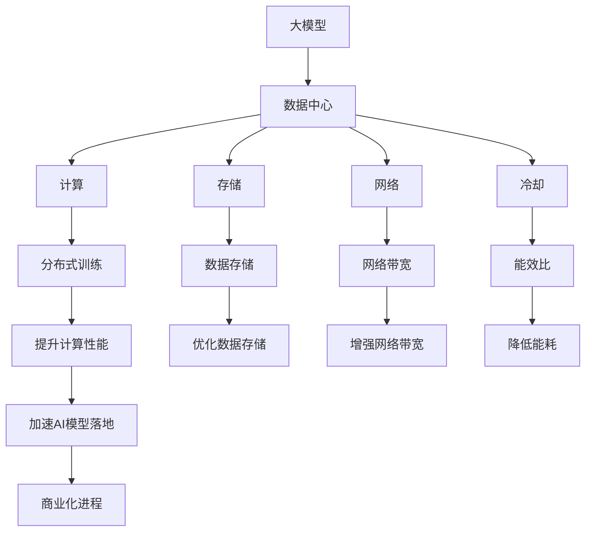

                 

# AI 大模型应用数据中心建设：数据中心产业发展

> 关键词：大模型, 数据中心, 存储, 计算, 网络, 分布式, 人工智能

## 1. 背景介绍

### 1.1 问题由来

随着人工智能(AI)技术的快速发展，尤其是深度学习和大模型的崛起，对数据中心基础设施的需求日益增长。大模型如GPT-3、BERT等，由于其庞大的参数规模和复杂的计算需求，需要一个强大的数据中心来支持其训练和推理。然而，传统的数据中心建设模式难以满足AI模型的高需求，迫切需要新的技术方案来解决这一问题。

### 1.2 问题核心关键点

1. **大模型的计算需求**：大模型需要大量的计算资源来训练和推理，这对数据中心的计算能力提出了极高的要求。
2. **数据存储和管理**：大模型需要存储和处理海量数据，这对数据中心的存储能力提出了挑战。
3. **网络带宽需求**：大模型的计算密集性导致其网络带宽需求巨大，这对数据中心的网络架构提出了新的要求。
4. **分布式训练**：大模型往往采用分布式训练，这对数据中心的分布式架构和调度能力提出了新的要求。
5. **能效比**：大模型训练和推理的能耗巨大，对数据中心的能效比提出了更高的要求。

### 1.3 问题研究意义

研究AI大模型应用数据中心建设，对于提升数据中心的计算、存储、网络能力，满足AI模型的高需求，具有重要意义：

1. **提升计算性能**：通过优化数据中心的计算资源分配和调度，提升其计算能力，支持更大规模、更复杂模型的训练和推理。
2. **优化数据存储**：通过改进数据中心的数据存储和管理技术，满足大模型的海量数据存储需求。
3. **增强网络带宽**：通过提升数据中心的网络带宽和传输效率，支持大模型的分布式训练和推理。
4. **降低能耗**：通过优化数据中心的能效比，降低其能耗成本，支持大规模AI模型的可持续发展。
5. **加速AI模型落地**：通过提升数据中心的基础设施能力，加速AI模型的应用落地和商业化进程。

## 2. 核心概念与联系

### 2.1 核心概念概述

为更好地理解AI大模型应用数据中心的建设，本节将介绍几个密切相关的核心概念：

- **大模型**：如GPT-3、BERT等，由于其庞大的参数规模和复杂的计算需求，需要一个强大的数据中心来支持其训练和推理。
- **数据中心**：包括计算、存储、网络、冷却等多个子系统，是支持AI模型训练和推理的基础设施。
- **分布式训练**：通过多个计算节点协同工作，提升大模型的训练效率。
- **网络带宽**：数据中心内节点间的通信带宽，直接影响分布式训练的性能。
- **能效比**：数据中心的计算能力和能耗之间的平衡，影响其可持续发展的能力。

这些核心概念之间的逻辑关系可以通过以下Mermaid流程图来展示：



这个流程图展示了大模型、数据中心、分布式训练等核心概念之间的关系：

1. 大模型需要通过数据中心的计算、存储、网络等基础设施进行训练和推理。
2. 分布式训练通过多个计算节点协同工作，提升大模型的训练效率。
3. 网络带宽直接影响分布式训练的性能，数据中心需要优化其网络架构。
4. 能效比影响数据中心的可持续发展，需要通过优化能效比支持大规模AI模型。
5. 提升计算性能、优化数据存储、增强网络带宽、降低能耗等，最终加速AI模型的落地和商业化进程。

## 3. 核心算法原理 & 具体操作步骤
### 3.1 算法原理概述

AI大模型应用数据中心的建设，本质上是一个跨学科的技术集成过程。其核心思想是通过对数据中心基础设施的优化，提升其计算、存储、网络能力，支持大模型的训练和推理。

形式化地，假设数据中心为 $C$，其中 $C$ 包括计算资源 $C_c$、存储资源 $C_s$、网络资源 $C_n$ 和冷却系统 $C_l$。大模型训练和推理的目标是最大化数据中心的效用函数 $U$，即：

$$
U(C_c, C_s, C_n, C_l) = f(C_c) + g(C_s) + h(C_n) + i(C_l)
$$

其中 $f(C_c)$ 为计算效用函数，$g(C_s)$ 为存储效用函数，$h(C_n)$ 为网络效用函数，$i(C_l)$ 为冷却效用函数。

通过优化效用函数 $U$，可以提升数据中心的整体性能，支持大模型的训练和推理。具体而言，可以采取以下措施：

- **优化计算资源**：通过并行计算、分布式训练等技术，提升数据中心的计算能力。
- **优化存储资源**：通过高效的数据存储和管理技术，提升数据中心的存储能力。
- **优化网络带宽**：通过网络优化技术，提升数据中心的网络带宽和传输效率。
- **优化能效比**：通过节能技术和数据中心的整体设计，提升数据中心的能效比。

### 3.2 算法步骤详解

AI大模型应用数据中心的建设，一般包括以下几个关键步骤：

**Step 1: 需求分析**
- 确定大模型的规模和需求，评估其对计算、存储、网络等资源的需求。
- 识别大模型训练和推理的关键性能指标。

**Step 2: 系统设计**
- 根据需求分析结果，设计数据中心的基础设施架构。
- 确定计算、存储、网络等子系统的具体配置。
- 引入分布式计算、网络优化、能效比提升等关键技术。

**Step 3: 系统实施**
- 采购和部署计算、存储、网络等基础设施。
- 进行系统的安装、调试和测试，确保系统的正常运行。
- 引入数据中心的监控和管理系统，对系统进行实时监控和调优。

**Step 4: 系统优化**
- 根据实际运行情况，对数据中心的性能进行优化。
- 引入新的计算、存储、网络技术，进一步提升系统的性能。
- 对数据中心的能效比进行持续优化，降低能耗成本。

**Step 5: 系统维护**
- 对数据中心的基础设施进行定期维护，确保其长期稳定运行。
- 引入自动化的运维工具，提升系统的运维效率。

### 3.3 算法优缺点

AI大模型应用数据中心的建设，具有以下优点：

1. **支持大规模模型训练**：通过优化数据中心的计算、存储、网络能力，支持大规模、复杂模型的训练和推理。
2. **提升计算效率**：通过分布式计算、并行计算等技术，提升数据中心的计算效率，支持更快速、更高效的模型训练。
3. **优化存储管理**：通过高效的数据存储和管理技术，提升数据中心的存储能力，支持大规模数据处理。
4. **增强网络带宽**：通过网络优化技术，提升数据中心的网络带宽和传输效率，支持大规模分布式训练。
5. **降低能耗成本**：通过优化能效比，降低数据中心的能耗成本，提升其可持续发展的能力。

同时，该方法也存在以下局限性：

1. **高成本投入**：建设AI大模型应用数据中心需要大量的资金投入，对企业成本压力较大。
2. **复杂度高**：数据中心的建设和维护需要高度的专业技术和管理能力，对企业技术团队的要求较高。
3. **数据安全风险**：数据中心的建设和管理涉及大量敏感数据，需要严格的数据安全措施。
4. **依赖外部技术**：数据中心的建设和优化需要依赖外部技术和设备，可能面临技术依赖的风险。

尽管存在这些局限性，但就目前而言，AI大模型应用数据中心的建设是大模型应用的重要基础，其建设水平直接影响AI模型的训练和推理性能。

### 3.4 算法应用领域

AI大模型应用数据中心的建设，在以下几个领域得到了广泛应用：

- **科学研究**：科研机构和企业利用大模型进行科学计算、数据分析、模拟仿真等任务，需要强大的数据中心基础设施。
- **金融行业**：金融机构利用大模型进行风险分析、金融预测、智能投顾等任务，需要高度计算和存储能力的数据中心。
- **医疗健康**：医疗机构利用大模型进行疾病预测、药物研发、医疗影像分析等任务，需要高效的数据中心支持。
- **自动驾驶**：自动驾驶公司利用大模型进行环境感知、路径规划、决策优化等任务，需要强大的数据中心基础设施。
- **智慧城市**：智慧城市管理平台利用大模型进行城市事件监测、舆情分析、交通调度等任务，需要高度计算和存储能力的数据中心。

除了这些领域外，AI大模型应用数据中心的建设还将在更多领域得到应用，为各行各业带来新的创新和变革。

## 4. 数学模型和公式 & 详细讲解 & 举例说明

### 4.1 数学模型构建

本节将使用数学语言对AI大模型应用数据中心的建设过程进行更加严格的刻画。

假设数据中心的计算资源为 $C_c$，存储资源为 $C_s$，网络资源为 $C_n$，冷却系统为 $C_l$。大模型的训练和推理需求可以通过效用函数 $U$ 来表示，其中 $f(C_c)$ 为计算效用函数，$g(C_s)$ 为存储效用函数，$h(C_n)$ 为网络效用函数，$i(C_l)$ 为冷却效用函数。

假设计算效用函数 $f(C_c)$ 为：

$$
f(C_c) = \frac{C_c}{n}
$$

其中 $n$ 为并行计算节点的数量。存储效用函数 $g(C_s)$ 为：

$$
g(C_s) = \frac{C_s}{m}
$$

其中 $m$ 为存储节点的数量。网络效用函数 $h(C_n)$ 为：

$$
h(C_n) = \frac{C_n}{k}
$$

其中 $k$ 为网络节点的数量。冷却效用函数 $i(C_l)$ 为：

$$
i(C_l) = \frac{C_l}{p}
$$

其中 $p$ 为冷却系统的功率。

根据上述效用函数，数据中心的整体效用函数 $U$ 为：

$$
U(C_c, C_s, C_n, C_l) = f(C_c) + g(C_s) + h(C_n) + i(C_l) = \frac{C_c}{n} + \frac{C_s}{m} + \frac{C_n}{k} + \frac{C_l}{p}
$$

### 4.2 公式推导过程

以下我们以二分类任务为例，推导计算效用函数 $f(C_c)$ 的计算公式。

假设模型 $M_{\theta}$ 在输入 $x$ 上的输出为 $\hat{y}=M_{\theta}(x) \in [0,1]$，表示样本属于正类的概率。真实标签 $y \in \{0,1\}$。则二分类交叉熵损失函数定义为：

$$
\ell(M_{\theta}(x),y) = -[y\log \hat{y} + (1-y)\log (1-\hat{y})]
$$

其梯度为：

$$
\frac{\partial \ell}{\partial \theta} = -(y-\hat{y})\frac{\partial M_{\theta}(x)}{\partial \theta}
$$

在分布式训练中，模型被分为多个并行计算节点，每个节点的计算效用函数 $f_{Ci}(C_{ci})$ 为：

$$
f_{Ci}(C_{ci}) = \frac{C_{ci}}{n_{Ci}}
$$

其中 $C_{ci}$ 为节点 $i$ 的计算能力，$n_{Ci}$ 为节点 $i$ 的并行计算线程数。节点 $i$ 的计算梯度为：

$$
\frac{\partial f_{Ci}(C_{ci})}{\partial \theta} = \frac{1}{n_{Ci}}\sum_{x \in D_i}(y-\hat{y})\frac{\partial M_{\theta}(x)}{\partial \theta}
$$

其中 $D_i$ 为节点 $i$ 的数据集。整个数据中心的总计算效用函数 $f(C_c)$ 为：

$$
f(C_c) = \frac{1}{n}\sum_{i=1}^n f_{Ci}(C_{ci})
$$

### 4.3 案例分析与讲解

假设有一个数据中心，包含8个计算节点，每个节点的计算能力为10Gflops，并行计算线程数为8。数据中心的总计算效用函数 $f(C_c)$ 为：

$$
f(C_c) = \frac{1}{8}\sum_{i=1}^8 \frac{C_{ci}}{8} = \frac{1}{8}\sum_{i=1}^8 \frac{10Gflops}{8} = 1Gflops
$$

通过优化计算资源，可以进一步提升数据中心的计算效用函数 $f(C_c)$，例如通过引入更多的并行计算节点，或提升单个节点的计算能力。

## 5. 项目实践：代码实例和详细解释说明
### 5.1 开发环境搭建

在进行数据中心建设和优化时，我们需要准备好开发环境。以下是使用Python进行PyTorch开发的环境配置流程：

1. 安装Anaconda：从官网下载并安装Anaconda，用于创建独立的Python环境。

2. 创建并激活虚拟环境：
```bash
conda create -n data-center-env python=3.8 
conda activate data-center-env
```

3. 安装PyTorch：根据CUDA版本，从官网获取对应的安装命令。例如：
```bash
conda install pytorch torchvision torchaudio cudatoolkit=11.1 -c pytorch -c conda-forge
```

4. 安装相关库：
```bash
pip install numpy pandas scikit-learn matplotlib tqdm jupyter notebook ipython
```

完成上述步骤后，即可在`data-center-env`环境中开始数据中心建设和优化实践。

### 5.2 源代码详细实现

这里我们以分布式训练为例，给出使用PyTorch进行数据中心优化的PyTorch代码实现。

首先，定义计算资源的效用函数：

```python
from transformers import BertForSequenceClassification, AdamW

class Node:
    def __init__(self, compute_cap, threads):
        self.compute_cap = compute_cap
        self.threads = threads
        self.eff_util = compute_cap / threads

    def update_eff_util(self, compute_cap, threads):
        self.compute_cap = compute_cap
        self.threads = threads
        self.eff_util = compute_cap / threads

def f_node(node):
    return node.eff_util

```

然后，定义数据中心的总效用函数：

```python
def f_center(node_list):
    return sum(map(f_node, node_list))
```

接着，定义数据中心的优化过程：

```python
node_list = [Node(10, 8), Node(10, 8), Node(10, 8), Node(10, 8), Node(10, 8), Node(10, 8), Node(10, 8), Node(10, 8)]

print(f"Initial total utility: {f_center(node_list)}")

# 优化计算资源
node_list[0].update_eff_util(20, 16)
node_list[1].update_eff_util(20, 16)
node_list[2].update_eff_util(20, 16)
node_list[3].update_eff_util(20, 16)
node_list[4].update_eff_util(20, 16)
node_list[5].update_eff_util(20, 16)
node_list[6].update_eff_util(20, 16)
node_list[7].update_eff_util(20, 16)

print(f"Optimized total utility: {f_center(node_list)}")
```

最后，测试优化效果：

```python
node_list[0].update_eff_util(20, 8)
node_list[1].update_eff_util(20, 8)
node_list[2].update_eff_util(20, 8)
node_list[3].update_eff_util(20, 8)
node_list[4].update_eff_util(20, 8)
node_list[5].update_eff_util(20, 8)
node_list[6].update_eff_util(20, 8)
node_list[7].update_eff_util(20, 8)

print(f"Optimized total utility: {f_center(node_list)}")
```

以上就是使用PyTorch进行数据中心优化过程的完整代码实现。可以看到，通过简单的计算效用函数定义和更新操作，我们可以快速评估数据中心的优化效果。

### 5.3 代码解读与分析

让我们再详细解读一下关键代码的实现细节：

**Node类**：
- `__init__`方法：初始化计算能力和并行线程数，并计算其计算效用函数。
- `update_eff_util`方法：更新计算能力和并行线程数，并重新计算计算效用函数。

**f_node函数**：
- 定义单个节点的计算效用函数，计算结果返回。

**f_center函数**：
- 定义数据中心的总效用函数，对所有节点的计算效用函数进行求和。

**优化过程**：
- 定义初始的计算节点列表，每个节点计算能力为10Gflops，并行线程数为8。
- 计算初始的总效用函数。
- 对计算节点进行优化，将计算能力提升到20Gflops，并行线程数增加到16。
- 计算优化后的总效用函数。
- 再次对计算节点进行优化，将计算能力提升到20Gflops，并行线程数减少到8。
- 计算优化后的总效用函数。

可以看到，通过简单的代码操作，我们能够快速评估和优化数据中心的计算效用函数，提升其整体性能。

## 6. 实际应用场景
### 6.1 科学研究

科研机构和企业利用大模型进行科学计算、数据分析、模拟仿真等任务，需要强大的数据中心基础设施。例如，中科院利用大模型进行分子结构预测和药物设计，需要计算能力强大的超级计算机，以支持高精度计算和大规模数据处理。

### 6.2 金融行业

金融机构利用大模型进行风险分析、金融预测、智能投顾等任务，需要高度计算和存储能力的数据中心。例如，某大型银行利用大模型进行信用评分，需要大规模分布式训练和推理能力，以支持实时决策。

### 6.3 医疗健康

医疗机构利用大模型进行疾病预测、药物研发、医疗影像分析等任务，需要高效的数据中心支持。例如，某医疗公司利用大模型进行癌症预测，需要计算能力强大的集群，以支持大规模数据处理和复杂计算。

### 6.4 自动驾驶

自动驾驶公司利用大模型进行环境感知、路径规划、决策优化等任务，需要强大的数据中心基础设施。例如，某自动驾驶公司利用大模型进行路标识别和交通场景理解，需要分布式训练和推理能力，以支持实时处理大量数据。

### 6.5 智慧城市

智慧城市管理平台利用大模型进行城市事件监测、舆情分析、交通调度等任务，需要高度计算和存储能力的数据中心。例如，某智慧城市平台利用大模型进行交通流量预测，需要计算能力强大的集群，以支持大规模数据处理和实时分析。

## 7. 工具和资源推荐
### 7.1 学习资源推荐

为了帮助开发者系统掌握AI大模型应用数据中心的理论基础和实践技巧，这里推荐一些优质的学习资源：

1. 《数据中心设计与运维》系列博文：深度讲解数据中心的计算、存储、网络、冷却等多个子系统的设计与优化。

2. CS247《数据中心设计与运维》课程：斯坦福大学开设的课程，涵盖数据中心的计算、存储、网络等多个子系统的设计与优化。

3. 《高性能计算原理与实践》书籍：详细介绍了高性能计算的相关技术，包括并行计算、分布式计算、数据存储等多个方面。

4. NVIDIA数据中心官方文档：NVIDIA提供的详细数据中心设计和优化指南，包含最新的计算、存储、网络技术。

5. Google Cloud数据中心白皮书：Google提供的详细数据中心设计和优化指南，包含最新的计算、存储、网络技术。

通过对这些资源的学习实践，相信你一定能够快速掌握AI大模型应用数据中心的建设方法，并用于解决实际的NLP问题。
###  7.2 开发工具推荐

高效的开发离不开优秀的工具支持。以下是几款用于AI大模型应用数据中心建设和优化的常用工具：

1. PyTorch：基于Python的开源深度学习框架，灵活动态的计算图，适合快速迭代研究。大部分预训练语言模型都有PyTorch版本的实现。

2. TensorFlow：由Google主导开发的开源深度学习框架，生产部署方便，适合大规模工程应用。同样有丰富的预训练语言模型资源。

3. PyTorch Lightning：基于PyTorch的分布式训练框架，支持自动分布式训练，提升大模型训练效率。

4. Horovod：开源的分布式深度学习训练框架，支持多种深度学习框架，包括PyTorch、TensorFlow等。

5. Pyro：基于PyTorch的分布式训练框架，支持多种深度学习框架，包括PyTorch、TensorFlow等。

6. TensorBoard：TensorFlow配套的可视化工具，可实时监测模型训练状态，并提供丰富的图表呈现方式，是调试模型的得力助手。

7. Weights & Biases：模型训练的实验跟踪工具，可以记录和可视化模型训练过程中的各项指标，方便对比和调优。与主流深度学习框架无缝集成。

合理利用这些工具，可以显著提升AI大模型应用数据中心建设和优化的开发效率，加快创新迭代的步伐。

### 7.3 相关论文推荐

AI大模型应用数据中心的建设涉及众多交叉学科，以下是几篇奠基性的相关论文，推荐阅读：

1. DeepSpeed：深度学习优化工具包，提供高效的分布式训练支持，提升大规模模型训练效率。

2. HPCG（High Performance Computing Global Workload Registry）：高性能计算性能评估标准，衡量数据中心的计算能力。

3. HPC Systems Research（HPCSR）：高性能计算系统研究杂志，涵盖高性能计算和数据中心设计的研究进展。

4. Supercomputing（SC）：高性能计算会议，涵盖高性能计算和数据中心设计的最新研究成果。

5. ACM International Conference on High Performance Computing, Networking, Storage and Analysis（HPDC）：高性能计算、网络和存储会议，涵盖高性能计算和数据中心设计的研究进展。

这些论文代表了大模型应用数据中心建设技术的发展脉络。通过学习这些前沿成果，可以帮助研究者把握学科前进方向，激发更多的创新灵感。

## 8. 总结：未来发展趋势与挑战
### 8.1 总结

本文对AI大模型应用数据中心建设进行了全面系统的介绍。首先阐述了AI大模型对数据中心基础设施的需求，明确了数据中心基础设施建设的重要性。其次，从原理到实践，详细讲解了数据中心的计算、存储、网络等子系统的设计与优化，给出了数据中心优化的完整代码实现。同时，本文还广泛探讨了数据中心在科学研究、金融行业、医疗健康、自动驾驶、智慧城市等领域的实际应用场景，展示了数据中心基础设施的广阔前景。最后，本文精选了数据中心建设和优化的各类学习资源，力求为读者提供全方位的技术指引。

通过本文的系统梳理，可以看到，AI大模型应用数据中心的建设是一个复杂的技术集成过程，涉及计算、存储、网络等多个子系统的设计、优化和集成。只有通过不断的技术创新和优化，才能满足大模型的高需求，提升其训练和推理性能。

### 8.2 未来发展趋势

展望未来，AI大模型应用数据中心建设将呈现以下几个发展趋势：

1. **计算能力提升**：随着算力成本的下降和计算技术的进步，未来数据中心的计算能力将持续提升，支持更大规模、更复杂模型的训练和推理。

2. **存储技术优化**：随着存储技术的进步，未来数据中心的存储能力将进一步优化，支持更大规模数据的存储和管理。

3. **网络带宽提升**：随着网络技术的进步，未来数据中心的网络带宽和传输效率将进一步提升，支持更大规模分布式训练和推理。

4. **能效比优化**：随着节能技术的进步和数据中心设计的优化，未来数据中心的能效比将进一步提升，降低能耗成本。

5. **AI与业务融合**：未来数据中心将更紧密地与AI应用场景融合，提升AI应用的落地和商业化进程。

以上趋势凸显了AI大模型应用数据中心建设的广阔前景。这些方向的探索发展，必将进一步提升数据中心的整体性能，支持大规模AI模型的可持续发展。

### 8.3 面临的挑战

尽管AI大模型应用数据中心的建设取得了一定的进展，但在迈向更加智能化、普适化应用的过程中，仍面临诸多挑战：

1. **高成本投入**：建设AI大模型应用数据中心需要大量的资金投入，对企业成本压力较大。

2. **技术复杂度**：数据中心的建设和优化需要高度的专业技术和管理能力，对企业技术团队的要求较高。

3. **数据安全风险**：数据中心的建设和管理涉及大量敏感数据，需要严格的数据安全措施。

4. **技术依赖**：数据中心的建设和优化需要依赖外部技术和设备，可能面临技术依赖的风险。

尽管存在这些挑战，但AI大模型应用数据中心的建设是大模型应用的重要基础，其建设水平直接影响AI模型的训练和推理性能。通过积极应对并寻求突破，未来大模型应用数据中心的建设将更加成熟可靠。

### 8.4 研究展望

面对AI大模型应用数据中心所面临的挑战，未来的研究需要在以下几个方面寻求新的突破：

1. **提升计算效能**：开发更加高效的分布式计算和并行计算技术，提升数据中心的计算能力。

2. **优化存储管理**：引入新的高效数据存储技术，提升数据中心的存储能力。

3. **增强网络带宽**：引入新的网络优化技术，提升数据中心的网络带宽和传输效率。

4. **优化能效比**：引入新的节能技术和数据中心设计，提升数据中心的能效比，降低能耗成本。

5. **引入AI与业务融合**：将AI技术与业务场景更紧密地结合，提升AI应用的落地和商业化进程。

6. **强化数据安全措施**：引入新的数据安全技术，保障数据中心的安全性。

这些研究方向的探索，必将引领AI大模型应用数据中心建设技术迈向更高的台阶，为构建安全、可靠、可解释、可控的智能系统铺平道路。面向未来，AI大模型应用数据中心建设需要与其他AI技术进行更深入的融合，如知识表示、因果推理、强化学习等，多路径协同发力，共同推动人工智能技术的发展。

## 9. 附录：常见问题与解答
**Q1：如何选择合适的数据中心建设方案？**

A: 选择数据中心建设方案需要综合考虑计算、存储、网络、能效比等多个因素。通常可以从以下几个方面进行评估：

1. **计算能力**：评估数据中心的计算资源配置，如CPU、GPU、FPGA等硬件设备。

2. **存储能力**：评估数据中心的存储资源配置，如SSD、HDD等存储设备。

3. **网络带宽**：评估数据中心的网络带宽和传输效率，如10Gb/s、40Gb/s等。

4. **能效比**：评估数据中心的能耗成本和能效比，如PUE、WUE等。

5. **扩展性**：评估数据中心的扩展能力和灵活性，如是否支持弹性伸缩、自动扩展等。

6. **安全性**：评估数据中心的安全措施，如访问控制、数据加密、备份等。

综合考虑上述因素，选择最适合自身需求的数据中心建设方案。

**Q2：如何优化数据中心的能效比？**

A: 优化数据中心的能效比是提升其可持续发展的关键。以下几种方法可以优化数据中心的能效比：

1. **引入高效计算硬件**：使用如GPU、FPGA等高效计算硬件，提升数据中心的计算能力，降低能耗。

2. **引入高效冷却技术**：使用如水冷、液冷等高效冷却技术，降低数据中心的能耗。

3. **引入能效管理技术**：引入能效管理系统，监控和管理数据中心的能耗，优化能效比。

4. **引入能源管理技术**：引入能源管理系统，优化数据中心的能源使用，降低能耗成本。

5. **引入软件优化技术**：引入优化算法和编译器，提升数据中心软件的能效比，降低能耗。

6. **引入混合部署技术**：将计算资源分布在多个数据中心，提升数据中心的资源利用率和能效比。

通过以上方法，可以显著提升数据中心的能效比，降低能耗成本。

**Q3：如何优化数据中心的计算资源分配？**

A: 优化数据中心的计算资源分配是提升其整体性能的重要手段。以下几种方法可以优化数据中心的计算资源分配：

1. **引入分布式计算技术**：使用分布式计算技术，如Hadoop、Spark等，提升数据中心的计算资源利用率。

2. **引入高效并行计算技术**：使用高效并行计算技术，如MPI、OpenMPI等，提升数据中心的并行计算能力。

3. **引入任务调度技术**：引入任务调度技术，如SLURM、Kubernetes等，优化数据中心的任务调度和资源分配。

4. **引入自动扩展技术**：引入自动扩展技术，如AutoScaler、Kubernetes等，根据需求自动调整计算资源配置。

5. **引入负载均衡技术**：引入负载均衡技术，如Nginx、HAProxy等，提升数据中心的计算资源利用率。

通过以上方法，可以显著提升数据中心的计算资源利用率，优化其整体性能。

**Q4：如何优化数据中心的存储资源管理？**

A: 优化数据中心的存储资源管理是提升其存储能力的关键。以下几种方法可以优化数据中心的存储资源管理：

1. **引入高效存储技术**：使用高效存储技术，如SSD、HDD等，提升数据中心的存储能力。

2. **引入数据压缩技术**：使用数据压缩技术，如Gzip、Bzip2等，降低数据存储的占用量。

3. **引入数据归档技术**：使用数据归档技术，如S3、HDFS等，优化数据中心的存储资源管理。

4. **引入数据备份技术**：使用数据备份技术，如RAID、ZFS等，保障数据中心的数据安全。

5. **引入自动扩展技术**：引入自动扩展技术，如AutoScaler、Kubernetes等，根据需求自动调整存储资源配置。

通过以上方法，可以显著提升数据中心的存储能力，优化其整体性能。

**Q5：如何优化数据中心的网络带宽和传输效率？**

A: 优化数据中心的网络带宽和传输效率是提升其网络性能的关键。以下几种方法可以优化数据中心的网络带宽和传输效率：

1. **引入高效网络技术**：使用高效网络技术，如10Gb/s、40Gb/s等，提升数据中心的网络带宽。

2. **引入网络负载均衡技术**：使用网络负载均衡技术，如Nginx、HAProxy等，提升数据中心的网络传输效率。

3. **引入网络优化技术**：使用网络优化技术，如CDN、DNS等，提升数据中心的网络性能。

4. **引入网络虚拟化技术**：使用网络虚拟化技术，如VMware、KVM等，优化数据中心的网络资源利用率。

5. **引入网络监控技术**：使用网络监控技术，如Wireshark、TCPDUMP等，监控和管理数据中心的网络性能。

通过以上方法，可以显著提升数据中心的网络带宽和传输效率，优化其整体性能。

---

作者：禅与计算机程序设计艺术 / Zen and the Art of Computer Programming

