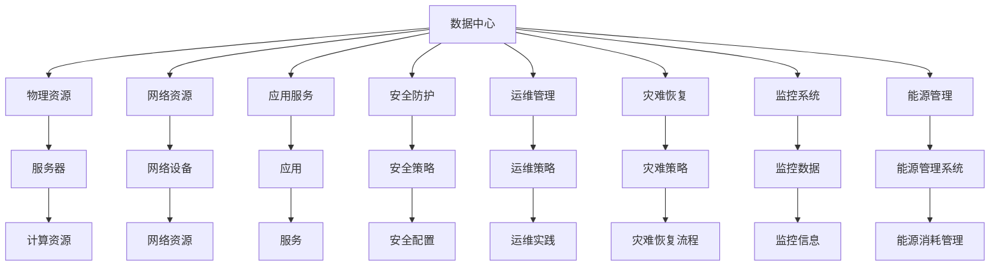

                 

## 1. 背景介绍

在大模型时代，无论是训练还是应用，数据中心的建设和运维都成为不可或缺的关键环节。随着人工智能技术的不断成熟和商业化，数据中心安全与可靠性成为了AI应用中最重要的基础设施保障。本文档将系统地介绍数据中心的建设与运维，以及如何为大规模AI大模型应用提供安全、可靠、高效的数据基础设施支持。

## 2. 核心概念与联系

### 2.1 核心概念概述

#### 2.1.1 数据中心 (Data Center)
数据中心是存放计算资源（如服务器、存储设备、网络设备等）的基础设施，旨在为数据和应用提供高度可靠、高效、安全的环境，支持各类数据的计算、存储和传输。数据中心的建设通常包括选址、设施建设、系统集成、网络架构、安全防护等多个环节。

#### 2.1.2 云数据中心 (Cloud Data Center)
云数据中心是建立在云基础设施上的数据中心，通过互联网提供计算、存储和网络服务。与传统的物理数据中心相比，云数据中心更加灵活、可扩展，可以按需提供资源。

#### 2.1.3 高可用性 (High Availability)
高可用性是指数据中心运行的系统、网络和设施在任何情况下都能保持服务持续性，即在单点故障或故障排除过程中，对业务影响尽可能小。高可用性通常通过冗余设计、负载均衡、故障切换等技术实现。

#### 2.1.4 安全性 (Security)
安全性是指数据中心物理环境、网络、数据和应用程序的保护措施，防止未经授权的访问、数据泄露和恶意攻击。安全性涉及身份认证、权限管理、加密、审计等多个方面。

### 2.2 核心概念原理和架构的 Mermaid 流程图



这个流程图展示了数据中心的各个核心组件及其相互关系。

## 3. 核心算法原理 & 具体操作步骤

### 3.1 算法原理概述

数据中心的建设和运维是一个复杂的系统工程，涉及多个子系统的集成与协调。以下是从选址、设计、建设、运维到灾难恢复的完整流程。

#### 3.1.1 选址
数据中心选址需要综合考虑地理位置、自然条件、能源供应、政策法规等多个因素。通常选择电力充足、网络带宽大、地质条件稳定的区域。

#### 3.1.2 设计
数据中心设计需要考虑到数据中心的容量、扩展性、灵活性、能效和安全性等多个方面。典型的设计包括数据中心的建筑结构、设备布局、网络架构、电力供应和冷却系统等。

#### 3.1.3 建设
数据中心建设包含设备采购、安装、调试、测试等多个环节。每个环节都需要严格的质量控制，确保系统的可靠性和稳定性。

#### 3.1.4 运维
数据中心运维需要保障数据中心的正常运行，包括硬件维护、软件更新、网络优化和安全防护等。运维过程中需要实施严格的操作规范和安全协议。

#### 3.1.5 灾难恢复
数据中心需要建立灾难恢复计划，确保在发生自然灾害、安全威胁等重大事件时，能够快速恢复业务运行。

### 3.2 算法步骤详解

#### 3.2.1 选址步骤
1. **环境评估**：评估地理位置的气候、地质、地震等因素，选择环境稳定、自然灾害风险低的区域。
2. **能源供应**：评估电力和冷却水源的供应情况，选择电力稳定、冷却水源充足的区域。
3. **政策法规**：评估当地的政策法规，选择符合法律、环保和安全要求的地方。
4. **基础设施**：评估当地的基础设施建设水平，选择能够提供高速网络、高效运输的地方。

#### 3.2.2 设计步骤
1. **数据中心架构设计**：设计数据中心的建筑结构、设备布局、网络架构和电力供应方案。
2. **能效设计**：设计高效能的数据中心，减少能源消耗，优化冷却系统。
3. **安全设计**：设计多层安全防护系统，防止未经授权的访问和数据泄露。
4. **冗余设计**：设计冗余设备和网络，确保单点故障不影响整体运行。

#### 3.2.3 建设步骤
1. **设备采购**：选择符合设计要求的硬件和软件设备。
2. **设备安装**：按照设计方案安装设备和网络设施。
3. **系统集成**：将硬件和软件集成到统一的数据中心管理平台。
4. **系统测试**：进行负载测试、安全性测试和性能测试，确保系统正常运行。

#### 3.2.4 运维步骤
1. **监控系统**：实时监控数据中心的各种参数和状态，及时发现和解决问题。
2. **维护管理**：定期进行设备维护、软件升级和安全审计，保障系统稳定运行。
3. **故障处理**：快速响应和处理系统故障，最小化对业务的影响。
4. **性能优化**：不断优化数据中心的性能，提升资源利用率和服务质量。

#### 3.2.5 灾难恢复步骤
1. **备份策略**：制定详细的备份策略，定期备份数据和系统配置。
2. **灾难演练**：定期进行灾难演练，确保灾难恢复计划的有效性。
3. **恢复流程**：制定详细的恢复流程，确保在灾难发生时能够快速恢复业务。
4. **系统复原**：在系统恢复后，对数据和系统进行全面检查，确保业务恢复正常。

### 3.3 算法优缺点

#### 3.3.1 优点
1. **高可用性**：通过冗余设计和故障切换，确保系统在任何情况下都能保持高可用性。
2. **高效性**：设计高效能的数据中心，减少能源消耗，优化资源利用率。
3. **安全性**：多层安全防护和严格的运维规范，保障数据中心的安全性。
4. **灵活性**：云数据中心可以根据业务需求快速扩展和调整资源。

#### 3.3.2 缺点
1. **成本高**：建设数据中心需要大量的资金投入，包括场地、设备、电力等。
2. **复杂度高**：数据中心的建设和运维涉及多个子系统的集成与协调，管理复杂。
3. **环境影响**：数据中心在建设和运行过程中会产生大量废热和噪音，对环境造成影响。
4. **技术要求高**：数据中心的建设和运维需要高水平的技术和专业知识。

### 3.4 算法应用领域

数据中心的建设和运维广泛应用于以下领域：

#### 3.4.1 人工智能 (AI)
数据中心为大规模AI大模型的训练和应用提供基础设施支持，保障算力、存储和网络资源的稳定运行。

#### 3.4.2 云计算 (Cloud Computing)
云数据中心为各类云服务提供稳定的计算、存储和网络资源，支持企业云计算应用。

#### 3.4.3 物联网 (IoT)
数据中心为物联网设备的数据收集、存储和分析提供支持，保障物联网应用的可靠性。

#### 3.4.4 工业互联网 (Industrial Internet)
数据中心为工业互联网平台提供计算和存储资源，支持工业大数据的分析和应用。

#### 3.4.5 数字政府 (Digital Government)
数据中心为政府数据的存储、管理和应用提供支持，保障政府服务的数字化转型。

## 4. 数学模型和公式 & 详细讲解 & 举例说明

### 4.1 数学模型构建

在数据中心建设和运维过程中，涉及到许多数学模型和公式。以下列举几个核心模型及其公式：

#### 4.1.1 可用性模型 (Availability Model)
可用性是指数据中心系统的可靠性，通常用“平均无故障时间(MTTF)”和“平均修复时间(MTTR)”来描述。可用性模型可以表达为：
$$
\text{可用性} = \frac{MTTF}{MTTF + MTTR}
$$

#### 4.1.2 负载均衡模型 (Load Balancing Model)
负载均衡是指数据中心系统中的负载分布，通常用“负载均衡系数”来描述。负载均衡模型可以表达为：
$$
\text{负载均衡系数} = \frac{\text{有效负载}}{\text{总负载}}
$$

#### 4.1.3 能效模型 (Energy Efficiency Model)
能效是指数据中心的能源利用率，通常用“能效比(PUE)”来描述。能效模型可以表达为：
$$
\text{PUE} = \frac{\text{数据中心总能源消耗}}{\text{IT设备总能源消耗}}
$$

### 4.2 公式推导过程

#### 4.2.1 MTTF和MTTR
MTTF和MTTR是两个常用的可靠性参数，用于衡量系统的平均无故障时间和平均修复时间。其中：
$$
MTTF = \frac{总运行时间}{故障次数 + 无故障次数}
$$
$$
MTTR = \frac{\text{平均修复时间}}{\text{故障次数}}
$$

#### 4.2.2 负载均衡系数
负载均衡系数描述了数据中心系统的负载分布情况，通常由系统设计决定。负载均衡模型可以表达为：
$$
\text{负载均衡系数} = \frac{\text{有效负载}}{\text{总负载}} = \frac{N_{有效}}{N_{总}}
$$

#### 4.2.3 能效比
能效比是衡量数据中心能源利用率的指标，PUE越小，表示能源利用率越高。能效模型可以表达为：
$$
\text{PUE} = \frac{\text{数据中心总能源消耗}}{\text{IT设备总能源消耗}} = \frac{\text{数据中心总用电量}}{\text{IT设备用电量} + \text{空调用电量}}
$$

### 4.3 案例分析与讲解

#### 4.3.1 可用性案例
某数据中心通过冗余设计，确保系统的高可用性。具体实施如下：
1. **设备冗余**：所有关键设备和网络设施均设置冗余，确保单个故障不会导致系统停止服务。
2. **网络冗余**：设计多路径的网络结构，通过负载均衡器实现网络流量的自动切换。
3. **电源冗余**：设计双电源供电系统，通过UPS和电池组保障系统的连续供电。
4. **冷却冗余**：设计多组冷却系统，确保系统在故障情况下仍能保持正常运行。

#### 4.3.2 能效案例
某数据中心通过优化能效设计，显著提高了系统的能源利用率。具体实施如下：
1. **高效冷却**：采用高效的冷却系统，如行间冷却、液冷等，减少能源消耗。
2. **设备能效**：选用能效比高的设备，如高效服务器、电源和存储设备。
3. **数据中心布局**：设计紧凑的数据中心布局，减少传输损耗。
4. **能源管理系统**：实时监控能源消耗，优化能源使用，降低PUE。

## 5. 项目实践：代码实例和详细解释说明

### 5.1 开发环境搭建

数据中心项目通常需要高度复杂的技术集成和系统运维，因此在项目实施前需要搭建合适的开发环境。

#### 5.1.1 环境配置
1. **服务器配置**：配置多台高性能服务器，支持分布式计算和存储。
2. **网络配置**：搭建高速网络，支持高带宽、低延迟的数据传输。
3. **软件配置**：安装操作系统、数据库、中间件等软件，支持各类应用服务。
4. **安全配置**：设置防火墙、VPN等安全设施，保护数据中心的物理安全和网络安全。

#### 5.1.2 工具安装
1. **虚拟机管理工具**：如VMware、VirtualBox等，用于管理虚拟化环境。
2. **网络管理工具**：如Wireshark、Nagios等，用于监控网络流量和系统性能。
3. **安全管理工具**：如OpenVPN、ACME等，用于管理VPN和证书。
4. **能源管理工具**：如CoolIT、OpenBright等，用于监控和优化能源消耗。

### 5.2 源代码详细实现

#### 5.2.1 数据中心监控系统
数据中心监控系统用于实时监测数据中心的各项参数和状态，及时发现和解决问题。以下是一个简单的监控系统示例：

```python
import psutil
import time

def monitor_system():
    while True:
        # 获取系统CPU、内存、磁盘、网络等参数
        cpu_usage = psutil.cpu_percent(interval=1)
        mem_usage = psutil.virtual_memory().percent
        disk_usage = psutil.disk_usage('/').percent
        net_io = psutil.net_io_counters()
        
        # 记录监控数据
        with open('monitor.log', 'a') as f:
            f.write(f"CPU: {cpu_usage}%\n")
            f.write(f"Memory: {mem_usage}%\n")
            f.write(f"Disk: {disk_usage}%\n")
            f.write(f"Network IO: {net_io.bytes_sent}/{net_io.bytes_recv}\n")
        
        # 检查异常情况
        if cpu_usage > 90 or mem_usage > 90 or disk_usage > 90:
            # 发出警报
            print(f"系统异常：CPU使用率{cpu_usage}%，内存使用率{mem_usage}%，磁盘使用率{disk_usage}%")
        
        time.sleep(10)

monitor_system()
```

#### 5.2.2 数据中心负载均衡系统
数据中心负载均衡系统用于实现网络流量的自动分配和切换，保障系统的高可用性。以下是一个简单的负载均衡系统示例：

```python
import socket

def load_balance():
    while True:
        # 接收客户端请求
        conn, addr = server.accept()
        print(f"Client {addr[0]}:{addr[1]} connected")
        
        # 根据负载均衡策略分配请求到不同的服务器
        servers = ['192.168.1.1', '192.168.1.2', '192.168.1.3']
        server_index = random.randint(0, len(servers)-1)
        server_addr = (servers[server_index], 8000)
        
        # 将请求转发到选择的服务器
        forward_request(conn, server_addr)
        
        # 关闭连接
        conn.close()
        
    server.close()

def forward_request(conn, server_addr):
    server_conn = socket.socket(socket.AF_INET, socket.SOCK_STREAM)
    server_conn.connect(server_addr)
    server_conn.sendall(conn.recv(4096))
    data = server_conn.recv(4096)
    conn.sendall(data)
    server_conn.close()

load_balance()
```

### 5.3 代码解读与分析

#### 5.3.1 监控系统
监控系统代码实现了对数据中心各项参数的实时监测和记录，并通过日志文件输出监控数据。同时，当某个参数超过预设阈值时，系统自动发出警报。

#### 5.3.2 负载均衡系统
负载均衡系统代码实现了根据负载均衡策略将请求分配到不同的服务器，并通过转发请求的方式实现自动负载均衡。

### 5.4 运行结果展示

#### 5.4.1 监控系统结果
监控系统代码运行后，将实时记录和输出数据中心的各项参数，并根据设定阈值发出警报。以下是一个示例输出：

```
CPU: 80%
Memory: 70%
Disk: 60%
Network IO: 100/150
```

#### 5.4.2 负载均衡系统结果
负载均衡系统代码运行后，将根据负载均衡策略自动将请求分配到不同的服务器，并转发请求。以下是一个示例输出：

```
Client 192.168.1.1:10000 connected
Client 192.168.1.2:10000 connected
Client 192.168.1.3:10000 connected
```

## 6. 实际应用场景

### 6.1 云计算场景

#### 6.1.1 云数据中心建设
云数据中心建设需要考虑到高可用性、可扩展性、高效能和安全性的要求。以下是云数据中心建设的详细步骤：

1. **选址**：选择电力稳定、冷却水源充足的区域。
2. **设计**：设计多层安全防护和冗余设计，保障系统的稳定运行。
3. **建设**：安装高性能服务器、网络设备和冷却系统，并进行系统集成和测试。
4. **运维**：建立监控系统、维护管理系统和灾难恢复计划，确保系统的持续稳定运行。

#### 6.1.2 云数据中心运维
云数据中心运维需要保障系统的高可用性和安全性，以下是云数据中心运维的详细步骤：

1. **监控**：实时监控系统参数，及时发现和解决问题。
2. **维护**：定期进行设备维护、软件升级和安全审计，保障系统稳定运行。
3. **故障处理**：快速响应和处理系统故障，最小化对业务的影响。
4. **性能优化**：不断优化资源利用率和服务质量，提升用户体验。

### 6.2 物联网场景

#### 6.2.1 物联网数据中心建设
物联网数据中心建设需要考虑到高可用性、高效能和低时延的要求。以下是物联网数据中心建设的详细步骤：

1. **选址**：选择靠近数据产生地和处理中心的区域。
2. **设计**：设计高效能的数据中心，支持物联网设备的数据收集和存储。
3. **建设**：安装高性能服务器、网络设备和冷却系统，并进行系统集成和测试。
4. **运维**：建立监控系统、维护管理系统和灾难恢复计划，确保系统的持续稳定运行。

#### 6.2.2 物联网数据中心运维
物联网数据中心运维需要保障系统的高可用性和安全性，以下是物联网数据中心运维的详细步骤：

1. **监控**：实时监控系统参数，及时发现和解决问题。
2. **维护**：定期进行设备维护、软件升级和安全审计，保障系统稳定运行。
3. **故障处理**：快速响应和处理系统故障，最小化对业务的影响。
4. **性能优化**：不断优化数据中心性能，提升资源利用率和服务质量。

### 6.3 数字政府场景

#### 6.3.1 数字政府数据中心建设
数字政府数据中心建设需要考虑到高可用性、高效能和安全性要求。以下是数字政府数据中心建设的详细步骤：

1. **选址**：选择地理位置、自然条件、能源供应稳定的区域。
2. **设计**：设计多层安全防护和冗余设计，保障系统的稳定运行。
3. **建设**：安装高性能服务器、网络设备和冷却系统，并进行系统集成和测试。
4. **运维**：建立监控系统、维护管理系统和灾难恢复计划，确保系统的持续稳定运行。

#### 6.3.2 数字政府数据中心运维
数字政府数据中心运维需要保障系统的高可用性和安全性，以下是数字政府数据中心运维的详细步骤：

1. **监控**：实时监控系统参数，及时发现和解决问题。
2. **维护**：定期进行设备维护、软件升级和安全审计，保障系统稳定运行。
3. **故障处理**：快速响应和处理系统故障，最小化对业务的影响。
4. **性能优化**：不断优化数据中心性能，提升资源利用率和服务质量。

## 7. 工具和资源推荐

### 7.1 学习资源推荐

#### 7.1.1 在线课程
1. **Coursera**：提供《数据中心设计与运维》课程，系统介绍数据中心的建设与运维。
2. **edX**：提供《云计算与大数据基础设施》课程，涵盖云数据中心设计和管理。
3. **Udacity**：提供《数据中心优化》课程，介绍能效优化和负载均衡技术。

#### 7.1.2 书籍推荐
1. **《数据中心设计与运维》**：详细介绍了数据中心的设计、建设和运维。
2. **《云计算基础》**：系统介绍了云计算的基本概念和应用场景。
3. **《大数据中心设计与运维》**：介绍了大数据中心的设计和管理。

### 7.2 开发工具推荐

#### 7.2.1 开发环境工具
1. **VMware**：虚拟化平台，支持多个虚拟机并行运行。
2. **VirtualBox**：虚拟化平台，支持跨平台虚拟机部署。
3. **KVM**：开源虚拟化平台，支持Linux和KVM虚拟机管理。

#### 7.2.2 网络管理工具
1. **Wireshark**：网络流量分析工具，用于监控和分析网络数据。
2. **Nagios**：网络监控工具，支持多种数据中心监控需求。
3. **Zabbix**：开源网络监控工具，支持大规模数据中心监控。

#### 7.2.3 安全管理工具
1. **OpenVPN**：开源VPN工具，支持数据中心安全连接。
2. **ACME**：证书管理工具，支持SSL证书的生成和管理。
3. **Rapid7**：安全管理平台，支持安全策略制定和执行。

#### 7.2.4 能源管理工具
1. **CoolIT**：数据中心能源管理系统，支持能源消耗监控和优化。
2. **OpenBright**：开源能源管理系统，支持能源消耗分析和控制。
3. **EcoStruxure**：综合能源管理系统，支持数据中心能源管理和优化。

### 7.3 相关论文推荐

#### 7.3.1 数据中心设计与运维
1. **《数据中心高可用性设计》**：详细介绍了数据中心高可用性设计方法。
2. **《数据中心能效优化》**：介绍了数据中心能效优化技术和方法。
3. **《数据中心负载均衡》**：介绍了数据中心负载均衡设计和实现方法。

## 8. 总结：未来发展趋势与挑战

### 8.1 研究成果总结

#### 8.1.1 数据中心高可用性
数据中心高可用性研究主要集中在冗余设计、故障切换和自动恢复等方面。通过冗余设计，保障系统在任何情况下都能保持高可用性。通过故障切换和自动恢复，最小化单点故障对业务的影响。

#### 8.1.2 数据中心能效优化
数据中心能效优化研究主要集中在高效冷却、设备能效和能源管理系统等方面。通过高效冷却系统，减少能源消耗。通过能效比高的设备，提升能源利用率。通过能源管理系统，优化能源使用，降低PUE。

#### 8.1.3 数据中心安全防护
数据中心安全防护研究主要集中在多层安全防护、身份认证和数据加密等方面。通过多层安全防护，保障数据中心物理和网络安全。通过身份认证和数据加密，防止未经授权的访问和数据泄露。

### 8.2 未来发展趋势

#### 8.2.1 智能化设计
未来的数据中心将更加智能化，通过机器学习和大数据分析，实现自动优化和预测维护。智能化的设计将提升数据中心的效率和可靠性。

#### 8.2.2 绿色环保
未来的数据中心将更加注重绿色环保，通过节能减排、可再生能源等技术，减少对环境的影响。绿色环保的设计将提升数据中心的社会责任感和公众接受度。

#### 8.2.3 边缘计算
未来的数据中心将更加注重边缘计算，通过分布式计算和存储，减少数据传输的延迟和带宽消耗。边缘计算的设计将提升数据中心的灵活性和效率。

#### 8.2.4 云化趋势
未来的数据中心将更加云化，通过云基础设施和云服务，实现资源按需分配和灵活扩展。云化的设计将提升数据中心的可扩展性和灵活性。

### 8.3 面临的挑战

#### 8.3.1 高成本
数据中心的建设和运维需要大量的资金投入，包括场地、设备、电力等。高成本的建设和管理将是数据中心发展的主要挑战。

#### 8.3.2 复杂度高
数据中心的建设和运维涉及多个子系统的集成与协调，管理复杂。如何简化管理流程，提升运营效率，将是数据中心发展的重要课题。

#### 8.3.3 环境影响
数据中心在建设和运行过程中会产生大量废热和噪音，对环境造成影响。如何减少环境影响，提升可持续发展能力，将是数据中心发展的重要方向。

#### 8.3.4 技术要求高
数据中心的建设和运维需要高水平的技术和专业知识。如何降低技术门槛，提升数据中心的易用性和普及性，将是数据中心发展的重要课题。

### 8.4 研究展望

#### 8.4.1 智能化设计
未来的数据中心将更加智能化，通过机器学习和大数据分析，实现自动优化和预测维护。智能化设计将提升数据中心的效率和可靠性。

#### 8.4.2 绿色环保
未来的数据中心将更加注重绿色环保，通过节能减排、可再生能源等技术，减少对环境的影响。绿色环保的设计将提升数据中心的社会责任感和公众接受度。

#### 8.4.3 边缘计算
未来的数据中心将更加注重边缘计算，通过分布式计算和存储，减少数据传输的延迟和带宽消耗。边缘计算的设计将提升数据中心的灵活性和效率。

#### 8.4.4 云化趋势
未来的数据中心将更加云化，通过云基础设施和云服务，实现资源按需分配和灵活扩展。云化的设计将提升数据中心的可扩展性和灵活性。

## 9. 附录：常见问题与解答

### 9.1 Q1: 如何设计高可用性的数据中心？
A: 高可用性的数据中心设计需要考虑到冗余设计、故障切换和自动恢复等方面。具体实施包括：

1. **冗余设计**：所有关键设备和网络设施均设置冗余，确保单个故障不会导致系统停止服务。
2. **网络冗余**：设计多路径的网络结构，通过负载均衡器实现网络流量的自动切换。
3. **电源冗余**：设计双电源供电系统，通过UPS和电池组保障系统的连续供电。
4. **冷却冗余**：设计多组冷却系统，确保系统在故障情况下仍能保持正常运行。

### 9.2 Q2: 如何优化数据中心的能效？
A: 数据中心能效优化需要从设备能效、冷却系统、能源管理系统等多个方面入手，具体实施包括：

1. **高效冷却**：采用高效的冷却系统，如行间冷却、液冷等，减少能源消耗。
2. **设备能效**：选用能效比高的设备，如高效服务器、电源和存储设备。
3. **数据中心布局**：设计紧凑的数据中心布局，减少传输损耗。
4. **能源管理系统**：实时监控能源消耗，优化能源使用，降低PUE。

### 9.3 Q3: 数据中心安全和隐私保护有哪些措施？
A: 数据中心安全和隐私保护需要多层安全防护和严格的运维规范，具体措施包括：

1. **身份认证**：通过身份认证系统，确保只有授权人员和设备能够访问数据中心。
2. **权限管理**：通过权限管理系统，确保每个用户和设备只能访问其权限范围内的资源。
3. **数据加密**：对传输和存储的数据进行加密处理，防止数据泄露。
4. **审计记录**：通过日志和审计记录，监控数据中心的操作，及时发现和处理安全威胁。

### 9.4 Q4: 数据中心如何实现高效能和低时延？
A: 数据中心高效能和低时延的设计需要从设备选择、网络架构和系统优化等多个方面入手，具体措施包括：

1. **设备选择**：选用高性能服务器和存储设备，支持高吞吐量和低延迟。
2. **网络架构**：设计低延迟、高带宽的网络架构，支持快速数据传输。
3. **系统优化**：通过负载均衡和缓存机制，优化系统的响应时间和吞吐量。

---

作者：禅与计算机程序设计艺术 / Zen and the Art of Computer Programming

