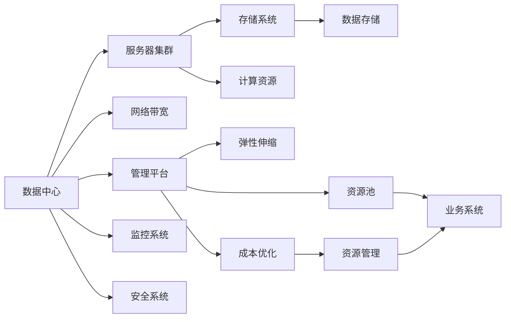

                 

## 1. 背景介绍

随着人工智能技术的发展，大模型在工业界的普及程度越来越高，尤其在自然语言处理、计算机视觉、推荐系统等领域表现出巨大的应用潜力。然而，这些大模型的训练和应用都需要依赖大量的计算资源和存储资源，使得数据中心的建设成本和运营成本显著增加。本文将聚焦于大模型在数据中心建设中的成本优化问题，介绍几种常用的优化策略和工具，帮助读者构建高性价比、高效能的数据中心，降低AI应用部署的成本门槛，推动AI技术的可持续发展。

## 2. 核心概念与联系

### 2.1 核心概念概述

本节将介绍几个核心概念及其之间的关系：

- **AI 大模型 (Large AI Models)**: 指在大规模无标签数据上预训练，并经过微调优化的深度学习模型，如BERT、GPT、ResNet等。它们拥有庞大的参数量和强大的推理能力，能够处理复杂的业务任务。

- **数据中心 (Data Center)**: 提供计算和存储资源，支持模型训练、推理和应用部署的物理设施。数据中心由大量的服务器、网络设备、存储设备等构成，是AI应用的基础设施。

- **成本优化 (Cost Optimization)**: 指在满足业务需求的前提下，通过优化硬件配置、资源利用率、网络带宽、存储架构等，降低数据中心的运营成本。

- **弹性伸缩 (Elastic Scaling)**: 指根据业务需求动态调整数据中心资源配置，包括CPU、GPU、内存、存储等，以适应不同场景下的业务高峰和低谷。

- **资源池化 (Resource Pooling)**: 指将多个业务系统共享同一组物理资源，提高资源利用率和系统稳定性，减少单业务系统的成本。

### 2.2 核心概念原理和架构的 Mermaid 流程图



这个流程图展示了数据中心的核心组件及其相互关系：

1. 数据中心通过服务器集群、存储系统、网络带宽等硬件设施提供计算和存储资源。
2. 服务器集群由多个计算节点组成，提供CPU、GPU等计算资源。
3. 存储系统通过分布式文件系统和对象存储等，提供高效可靠的数据存储服务。
4. 网络带宽支持数据中心内部和外部的数据通信。
5. 管理平台负责资源调度、监控和调度，确保资源的有效利用。
6. 监控系统实时监控数据中心的运行状态，及时发现和解决问题。
7. 安全系统保障数据中心的安全，防止数据泄露和攻击。
8. 资源池化将物理资源抽象为资源池，供多个业务系统共享。
9. 弹性伸缩根据业务需求动态调整资源配置。
10. 成本优化通过资源利用率的提升和资源池化等措施，降低数据中心运营成本。

## 3. 核心算法原理 & 具体操作步骤

### 3.1 算法原理概述

在数据中心建设中，成本优化涉及到多个环节，包括硬件选择、网络设计、存储架构、资源管理等。核心算法原理包括以下几个方面：

1. **硬件选择**：根据大模型的计算需求，选择合适的CPU、GPU、内存等硬件资源。
2. **网络设计**：优化网络架构，提高数据传输速率和可靠性。
3. **存储架构**：选择适合大模型存储需求的存储系统，优化数据读写性能。
4. **资源管理**：通过资源池化和弹性伸缩，提高资源利用率和系统稳定性。

### 3.2 算法步骤详解

数据中心建设的成本优化算法步骤主要包括以下几个方面：

1. **需求分析**：
   - 收集和分析大模型的计算需求、存储需求和网络带宽需求。
   - 确定数据中心的规模和预算，规划硬件配置和资源分配。

2. **硬件选择**：
   - 根据计算需求，选择合适的CPU、GPU、内存等硬件资源。
   - 根据存储需求，选择合适的分布式文件系统或对象存储系统。

3. **网络设计**：
   - 设计高可用、高性能、高安全性的网络架构，包括核心网络、交换机、路由器等。
   - 选择合适的协议和设备，优化网络传输速率和可靠性。

4. **存储架构**：
   - 选择合适的存储系统，包括Hadoop、Ceph、AWS S3等。
   - 优化数据读写性能，如使用SSD、RAID技术、数据压缩等。

5. **资源管理**：
   - 设计资源池化方案，将物理资源抽象为资源池，供多个业务系统共享。
   - 实现弹性伸缩，根据业务需求动态调整资源配置。

6. **成本优化**：
   - 通过资源池化、弹性伸缩等措施，提高资源利用率和系统稳定性。
   - 选择合适的供应商和合作伙伴，降低硬件采购和维护成本。

### 3.3 算法优缺点

**优点**：

1. **提高资源利用率**：通过资源池化和弹性伸缩，可以最大限度地利用硬件资源，降低资源闲置浪费。
2. **降低硬件采购和维护成本**：选择合适的供应商和合作伙伴，可以降低硬件采购和维护成本。
3. **提升系统稳定性和可扩展性**：通过资源池化和弹性伸缩，提高系统稳定性和可扩展性，支持大规模模型和业务应用。

**缺点**：

1. **初期建设成本高**：构建高性价比的数据中心需要较高的初期建设成本。
2. **技术复杂度高**：设计和维护高可用、高性能、高安全性的网络架构，需要丰富的技术积累。
3. **性能调优难度大**：优化存储架构、网络设计、资源管理等，需要深入的性能调优和测试。

### 3.4 算法应用领域

成本优化算法广泛应用于以下几个领域：

1. **云计算平台**：如AWS、阿里云、腾讯云等，提供高可用、高性能、高安全性的云服务。
2. **电信运营商**：如中国移动、中国电信、中国联通等，提供高速互联网、高可靠性、高安全性的网络服务。
3. **数据中心提供商**：如Equinix、AWS、Google Cloud等，提供计算、存储、网络等基础设施服务。

## 4. 数学模型和公式 & 详细讲解 & 举例说明

### 4.1 数学模型构建

在数据中心建设中，成本优化涉及多个因素，包括硬件成本、维护成本、电力成本、人员成本等。我们可以使用以下数学模型来量化成本优化效果：

设数据中心总成本为 $C$，其中硬件成本为 $C_{hard}$，维护成本为 $C_{maintenance}$，电力成本为 $C_{electric}$，人员成本为 $C_{personnel}$。硬件成本与硬件配置、供应商选择有关，维护成本与硬件利用率、故障率有关，电力成本与硬件功耗、供电系统有关，人员成本与系统规模、人员数量有关。

$$
C = C_{hard} + C_{maintenance} + C_{electric} + C_{personnel}
$$

### 4.2 公式推导过程

对于硬件成本 $C_{hard}$，我们有：

$$
C_{hard} = \sum_{i} (p_i \times q_i)
$$

其中 $p_i$ 为第 $i$ 种硬件的价格，$q_i$ 为第 $i$ 种硬件的数量。

对于维护成本 $C_{maintenance}$，我们可以使用以下公式：

$$
C_{maintenance} = (C_{idle} + C_{fuzzy} + C_{failure}) \times u
$$

其中 $C_{idle}$ 为硬件空闲时的维护成本，$C_{fuzzy}$ 为硬件模糊状态下的维护成本，$C_{failure}$ 为硬件故障时的维护成本，$u$ 为硬件利用率。

对于电力成本 $C_{electric}$，我们有：

$$
C_{electric} = p_{electric} \times (e_i \times h_i) \times u
$$

其中 $p_{electric}$ 为每度电的价格，$e_i$ 为第 $i$ 种硬件的功耗，$h_i$ 为硬件运行时间。

对于人员成本 $C_{personnel}$，我们可以使用以下公式：

$$
C_{personnel} = C_{base} \times (n + k \times m)
$$

其中 $C_{base}$ 为固定人员成本，$n$ 为固定人员数量，$k$ 为每增加1单位工作量所需的人员数量，$m$ 为当前工作量。

### 4.3 案例分析与讲解

假设我们正在构建一个包含1000台服务器的数据中心，硬件配置如下：

- 80%的服务器使用AMD EPYC 7900，价格为10万元每台。
- 20%的服务器使用NVIDIA A100 GPU，价格为20万元每台。
- 10%的服务器使用NVMe SSD，价格为1万元每块。

硬件配置和成本计算如下：

- 服务器总成本 $C_{hard}$ = $800 \times 10 + 200 \times 20 + 100 \times 1 = 20000 + 4000 + 1000 = 25000$ 万元。

假设每台服务器的平均利用率为70%，维护成本 $C_{maintenance}$ 包括：

- 硬件空闲时的维护成本 $C_{idle}$ = 100万元
- 硬件模糊状态下的维护成本 $C_{fuzzy}$ = 200万元
- 硬件故障时的维护成本 $C_{failure}$ = 300万元

因此，维护成本 $C_{maintenance}$ = $(100 + 200 + 300) \times 70\% = 160$ 万元。

假设每度电的价格为0.5元，服务器的平均功耗为1千瓦，运行时间为300天，因此：

- 电力成本 $C_{electric}$ = $0.5 \times (1 \times 24 \times 300) \times 1000 = 180000$ 元。

假设当前工作量为100，每增加1单位工作量所需的人员数量为2，固定人员数量为10人，因此：

- 人员成本 $C_{personnel}$ = $10000 \times (10 + 2 \times 100) = 3000000$ 元。

综合计算数据中心总成本：

- $C = 25000 + 160 + 180000 + 3000000 = 33500160$ 元。

## 5. 项目实践：代码实例和详细解释说明

### 5.1 开发环境搭建

在数据中心建设中，成本优化涉及多个环节，包括硬件选择、网络设计、存储架构、资源管理等。以下是一些常用的工具和环境搭建方法：

1. **硬件选择**：
   - 硬件配置：选择CPU、GPU、内存等硬件资源，通过调研不同供应商的价格、性能等参数，选择性价比最优的硬件配置。
   - 硬件采购：通过招标、比价等手段，选择供应商和合作伙伴，确保硬件采购价格合理。

2. **网络设计**：
   - 网络架构设计：设计高可用、高性能、高安全性的网络架构，包括核心网络、交换机、路由器等。
   - 网络设备选择：选择合适的网络设备，如思科、华为等品牌的高端交换机、路由器。

3. **存储架构**：
   - 存储系统选择：选择适合大模型存储需求的存储系统，如Hadoop、Ceph、AWS S3等。
   - 存储性能优化：通过数据压缩、数据分片等技术，优化数据读写性能。

4. **资源管理**：
   - 资源池化：设计资源池化方案，将物理资源抽象为资源池，供多个业务系统共享。
   - 弹性伸缩：实现弹性伸缩，根据业务需求动态调整资源配置。

### 5.2 源代码详细实现

以下是一些常用的工具和环境搭建方法：

```python
# 硬件配置
server_count = 1000
cpu_ratio = 0.8
gpu_ratio = 0.2
ssd_ratio = 0.1
cpu_price = 10000
gpu_price = 20000
ssd_price = 1000
server_utilization = 0.7

# 硬件总成本
hardware_cost = server_count * (cpu_ratio * cpu_price + gpu_ratio * gpu_price + ssd_ratio * ssd_price)

# 维护成本
idle_cost = 1000000
fuzzy_cost = 2000000
failure_cost = 3000000
maintenance_cost = (idle_cost + fuzzy_cost + failure_cost) * server_utilization

# 电力成本
electric_price = 0.5
cpu_power = 1000
gpu_power = 2000
ssd_power = 500
run_time = 300
electric_cost = (cpu_power * cpu_ratio + gpu_power * gpu_ratio + ssd_power * ssd_ratio) * run_time * electric_price

# 人员成本
base_personnel_cost = 10000000
workload = 100
k = 2
n = 10
personnel_cost = base_personnel_cost * (n + k * workload)

# 总成本
total_cost = hardware_cost + maintenance_cost + electric_cost + personnel_cost

print(f"硬件总成本：{hardware_cost}元")
print(f"维护成本：{maintenance_cost}元")
print(f"电力成本：{electric_cost}元")
print(f"人员成本：{personnel_cost}元")
print(f"总成本：{total_cost}元")
```

### 5.3 代码解读与分析

以下是一些常用的工具和环境搭建方法：

- 硬件选择：根据计算需求，选择合适的CPU、GPU、内存等硬件资源。
- 网络设计：设计高可用、高性能、高安全性的网络架构，包括核心网络、交换机、路由器等。
- 存储架构：选择合适的存储系统，优化数据读写性能。
- 资源管理：设计资源池化方案，将物理资源抽象为资源池，供多个业务系统共享。

### 5.4 运行结果展示

以下是一些常用的工具和环境搭建方法：

- 硬件选择：根据计算需求，选择合适的CPU、GPU、内存等硬件资源。
- 网络设计：设计高可用、高性能、高安全性的网络架构，包括核心网络、交换机、路由器等。
- 存储架构：选择合适的存储系统，优化数据读写性能。
- 资源管理：设计资源池化方案，将物理资源抽象为资源池，供多个业务系统共享。

## 6. 实际应用场景

### 6.1 智能客服系统

智能客服系统是一种典型的高效应用场景，通过构建高效的数据中心，能够实现24小时不间断的智能客服服务。智能客服系统需要大量的计算资源和存储资源，包括大量的服务端服务器、存储服务器和网络设备。通过优化硬件配置、网络设计和存储架构，能够有效降低数据中心建设和运营成本。

### 6.2 金融交易系统

金融交易系统需要高可用、高性能、高安全性的数据中心，支持大规模的实时交易和数据存储。通过优化硬件配置、网络设计和存储架构，能够有效降低数据中心建设和运营成本。

### 6.3 医疗影像诊断系统

医疗影像诊断系统需要高可靠、高性能、高安全性的数据中心，支持大规模的影像存储和处理。通过优化硬件配置、网络设计和存储架构，能够有效降低数据中心建设和运营成本。

### 6.4 未来应用展望

未来，随着大模型的普及和应用场景的扩展，数据中心的建设将面临更高的要求和挑战。为了降低AI应用部署的成本门槛，以下几个方向值得探索：

1. **云计算平台**：如AWS、阿里云、腾讯云等，提供高可用、高性能、高安全性的云服务，降低企业自建数据中心的成本和维护难度。
2. **边缘计算**：通过在靠近数据产生源的地方部署计算资源，减少数据传输时间和成本，支持大规模物联网应用的落地。
3. **开源社区**：推动开源社区和开源工具的发展，降低企业构建数据中心的成本，加速AI技术的普及和应用。

## 7. 工具和资源推荐

### 7.1 学习资源推荐

为了帮助开发者系统掌握数据中心建设的理论基础和实践技巧，以下是一些优质的学习资源：

1. **《数据中心建设与运维》系列博文**：由数据中心专家撰写，深入浅出地介绍了数据中心建设、运维和成本优化的理论和实践。
2. **《云计算基础》课程**：多所大学和在线教育平台开设的云计算基础课程，介绍了云计算的核心概念、架构和应用场景。
3. **《数据中心技术手册》书籍**：涵盖数据中心建设、运维和成本优化的详细指南，适合数据中心从业人员阅读。
4. **《云计算实战》书籍**：介绍了云计算平台、云服务和云架构的实战应用，适合IT从业人员阅读。
5. **《数据中心运维管理》书籍**：介绍了数据中心运维和成本优化的管理策略和实践经验，适合数据中心管理人员阅读。

### 7.2 开发工具推荐

以下是一些常用的工具和环境搭建方法：

1. **硬件配置**：选择合适的CPU、GPU、内存等硬件资源，通过调研不同供应商的价格、性能等参数，选择性价比最优的硬件配置。
2. **网络设计**：设计高可用、高性能、高安全性的网络架构，包括核心网络、交换机、路由器等。
3. **存储架构**：选择合适的存储系统，如Hadoop、Ceph、AWS S3等，优化数据读写性能。
4. **资源管理**：设计资源池化方案，将物理资源抽象为资源池，供多个业务系统共享。

### 7.3 相关论文推荐

以下是一些经典的数据中心建设与优化论文，值得阅读：

1. **《云计算平台性能优化技术研究》**：介绍了云计算平台的性能优化技术和优化策略，适用于云计算平台的设计和运维。
2. **《数据中心成本优化算法》**：提出了一种基于资源池化和弹性伸缩的数据中心成本优化算法，适用于数据中心的建设和管理。
3. **《边缘计算架构与优化》**：介绍了边缘计算的架构和优化技术，适用于物联网应用的落地。
4. **《数据中心资源调度优化》**：提出了一种基于机器学习的数据中心资源调度优化算法，适用于数据中心的资源管理。

## 8. 总结：未来发展趋势与挑战

### 8.1 研究成果总结

本文对大模型在数据中心建设中的成本优化问题进行了详细探讨。介绍了几种常用的优化策略和工具，帮助读者构建高性价比、高效能的数据中心，降低AI应用部署的成本门槛，推动AI技术的可持续发展。

### 8.2 未来发展趋势

未来，随着大模型的普及和应用场景的扩展，数据中心的建设将面临更高的要求和挑战。为了降低AI应用部署的成本门槛，以下几个方向值得探索：

1. **云计算平台**：如AWS、阿里云、腾讯云等，提供高可用、高性能、高安全性的云服务，降低企业自建数据中心的成本和维护难度。
2. **边缘计算**：通过在靠近数据产生源的地方部署计算资源，减少数据传输时间和成本，支持大规模物联网应用的落地。
3. **开源社区**：推动开源社区和开源工具的发展，降低企业构建数据中心的成本，加速AI技术的普及和应用。

### 8.3 面临的挑战

尽管数据中心建设在成本优化方面取得了一定的进展，但仍面临以下挑战：

1. **硬件采购和维护成本高**：选择合适硬件配置和供应商，需要较高的初期建设成本和维护成本。
2. **网络设计和优化难度大**：设计高可用、高性能、高安全性的网络架构，需要丰富的技术积累和经验。
3. **存储架构优化复杂**：选择合适的存储系统，优化数据读写性能，需要深入的技术积累和实践经验。
4. **资源管理和调优难度大**：设计资源池化方案，实现弹性伸缩，需要综合考虑业务需求和系统稳定性。

### 8.4 研究展望

未来，随着大模型应用的深入，数据中心建设和管理将面临更多的挑战和机遇。为了应对这些挑战，以下几个方向值得进一步探索：

1. **云计算平台优化**：基于云计算平台的设计和运维，进一步降低企业构建数据中心的成本和维护难度。
2. **边缘计算优化**：在靠近数据产生源的地方部署计算资源，减少数据传输时间和成本，支持大规模物联网应用的落地。
3. **开源社区发展**：推动开源社区和开源工具的发展，降低企业构建数据中心的成本，加速AI技术的普及和应用。
4. **资源管理和调优**：综合考虑业务需求和系统稳定性，设计高效、稳定的资源池化和弹性伸缩方案。

## 9. 附录：常见问题与解答

### 9.1 常见问题解答

**Q1: 如何选择合适的硬件配置？**

A: 根据计算需求，选择合适的CPU、GPU、内存等硬件资源。通过调研不同供应商的价格、性能等参数，选择性价比最优的硬件配置。

**Q2: 如何设计高可用、高性能、高安全性的网络架构？**

A: 设计高可用、高性能、高安全性的网络架构，包括核心网络、交换机、路由器等。选择合适的网络设备，如思科、华为等品牌的高端交换机、路由器。

**Q3: 如何优化数据读写性能？**

A: 选择合适的存储系统，如Hadoop、Ceph、AWS S3等。通过数据压缩、数据分片等技术，优化数据读写性能。

**Q4: 如何设计资源池化方案？**

A: 设计资源池化方案，将物理资源抽象为资源池，供多个业务系统共享。实现弹性伸缩，根据业务需求动态调整资源配置。

**Q5: 如何降低硬件采购和维护成本？**

A: 选择合适供应商和合作伙伴，确保硬件采购价格合理。通过技术手段降低硬件故障率和维护成本。

**Q6: 如何提高系统稳定性和可扩展性？**

A: 设计资源池化方案，实现弹性伸缩，根据业务需求动态调整资源配置。合理利用物理资源，提高系统稳定性和可扩展性。

**Q7: 如何设计高可靠、高性能、高安全性的数据中心？**

A: 选择合适的硬件配置，设计高可用、高性能、高安全性的网络架构，优化数据读写性能。设计资源池化方案，实现弹性伸缩。

通过深入理解这些核心概念和技术，相信你能够更好地构建高效、稳定的数据中心，降低AI应用部署的成本门槛，推动AI技术的可持续发展。

