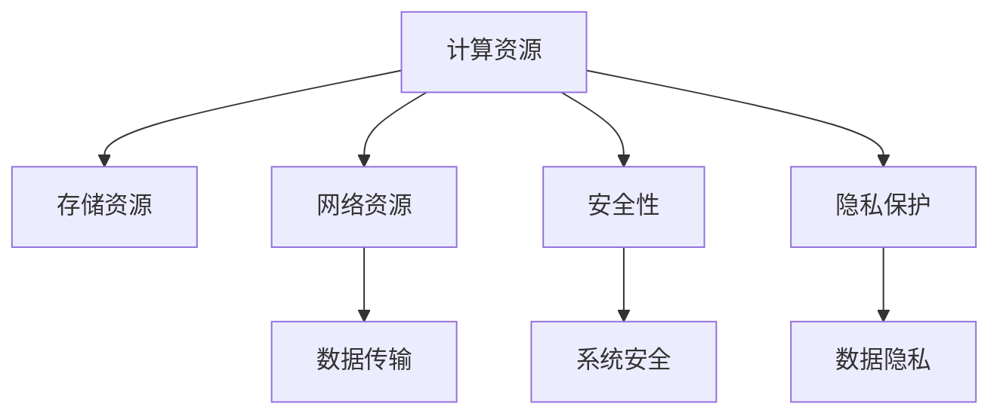

                 

# AI 大模型应用数据中心建设：数据中心技术与应用

> 关键词：数据中心,大模型,云计算,高性能计算,大数据,存储,网络,安全性,隐私保护

## 1. 背景介绍

随着人工智能技术的迅速发展，大模型（如BERT, GPT-3, DALL·E等）在自然语言处理（NLP）、计算机视觉（CV）等领域展现出了强大的表现。然而，这些大模型的训练和应用，需要庞大的数据和强大的计算能力。因此，如何构建高效、安全、可持续的数据中心，成为了支持大模型应用的关键问题。

### 1.1 问题由来
数据中心是支持人工智能应用的基础设施，承载着数据的存储、处理、传输和安全等关键任务。随着大模型的兴起，对于数据中心的性能、效率和安全性提出了更高要求。许多顶级公司如Google、Microsoft、Facebook等都构建了自有的数据中心以支持其AI大模型训练和应用。

### 1.2 问题核心关键点
数据中心建设的核心问题包括：

- 如何高效地处理和存储海量数据？
- 如何快速地进行模型训练和推理？
- 如何确保数据和模型的安全性？
- 如何平衡成本与性能？

本文将从数据中心的关键技术，如计算、存储、网络、安全性等方面，系统地探讨大模型应用的数据中心建设。

## 2. 核心概念与联系

### 2.1 核心概念概述

为更好地理解数据中心的核心技术，本节将介绍几个紧密相关的核心概念：

- **计算资源**：包括CPU、GPU、TPU等硬件，用于执行模型的训练和推理任务。
- **存储资源**：包括硬盘、SSD、GPU内存等，用于存储模型参数和训练数据。
- **网络资源**：包括交换机、路由器、通信协议等，用于数据传输和系统通信。
- **安全性**：包括数据加密、访问控制、监控审计等，用于保护数据和系统安全。
- **隐私保护**：包括差分隐私、联邦学习、多方安全计算等，用于确保模型训练数据的隐私性。

这些概念之间的逻辑关系可以通过以下Mermaid流程图来展示：



这个流程图展示了大模型应用数据中心的关键技术及其相互关系。

## 3. 核心算法原理 & 具体操作步骤
### 3.1 算法原理概述

大模型应用的数据中心建设，主要涉及到高性能计算、大数据存储、网络通信、安全性与隐私保护等方面的技术。以下将从这些角度详细探讨其算法原理和操作步骤。

### 3.2 算法步骤详解

#### 3.2.1 高性能计算

大模型训练和推理需要大量的计算资源，通常使用大规模分布式计算框架如TensorFlow、PyTorch等，结合并行计算、异构计算、GPU加速等技术，以提升计算效率和性能。

**步骤1: 设计计算架构**
- 根据模型规模和计算需求，设计合适的计算节点和分布式架构。例如，Google的TPU架构，可以将多个TPU芯片集成到一个芯片模块中，提升并行计算能力。

**步骤2: 安装和配置计算资源**
- 安装高性能计算框架（如TensorFlow、PyTorch等）。
- 配置并启动计算集群，根据需求进行资源调度。

**步骤3: 模型训练和推理**
- 使用分布式计算框架进行模型的并行训练，优化训练参数和超参数，提升训练效率。
- 在计算集群上部署模型，进行高性能推理。

#### 3.2.2 大数据存储

大模型训练和推理需要海量数据，通常使用分布式文件系统（如Hadoop、Ceph等）和对象存储系统（如AWS S3、Google Cloud Storage等），以支持大规模数据存储和高效访问。

**步骤1: 设计存储架构**
- 根据数据规模和访问需求，设计合适的分布式存储架构。例如，Facebook的Paxos协议，可以保证数据的高可用性和一致性。

**步骤2: 安装和配置存储资源**
- 安装分布式文件系统和对象存储系统。
- 配置并启动存储集群，根据需求进行数据备份和冗余。

**步骤3: 数据存储和访问**
- 使用分布式文件系统和对象存储系统进行数据存储。
- 提供高效的数据访问接口，如API、SDK等，方便模型的训练和推理。

#### 3.2.3 网络通信

大模型训练和推理需要大量的数据传输，通常使用高速网络协议（如TCP/IP、RDMA等），结合网络虚拟化技术（如SDN、NFV等），以提升网络传输效率和可靠性。

**步骤1: 设计网络架构**
- 根据数据传输需求，设计合适的网络架构。例如，Google的Google Compute Engine，通过虚拟化网络技术，实现网络资源的高效利用。

**步骤2: 安装和配置网络资源**
- 安装高速网络协议和网络虚拟化技术。
- 配置并启动网络集群，根据需求进行流量控制和负载均衡。

**步骤3: 数据传输和通信**
- 使用高速网络协议进行数据传输。
- 提供高效的网络通信接口，如API、SDK等，方便模型的训练和推理。

#### 3.2.4 安全性

大模型训练和推理需要严格的安全保障，通常使用数据加密、访问控制、监控审计等技术，以保护数据和系统的安全。

**步骤1: 设计安全架构**
- 根据数据和系统需求，设计合适的安全架构。例如，微软的Azure Security Center，提供全面的安全管理和监控。

**步骤2: 安装和配置安全资源**
- 安装数据加密和访问控制技术。
- 配置并启动安全集群，根据需求进行安全策略的制定和执行。

**步骤3: 数据和系统保护**
- 使用数据加密技术对数据进行保护，防止未授权访问和泄露。
- 使用访问控制技术对系统资源进行管理，确保只有授权用户才能访问。
- 使用监控审计技术对系统行为进行实时监测和记录，及时发现和应对安全威胁。

#### 3.2.5 隐私保护

大模型训练和推理需要确保数据的隐私性，通常使用差分隐私、联邦学习、多方安全计算等技术，以保护数据的隐私和安全。

**步骤1: 设计隐私保护架构**
- 根据数据隐私需求，设计合适的隐私保护架构。例如，苹果的隐私保护机制，通过差分隐私技术保护用户数据隐私。

**步骤2: 安装和配置隐私保护资源**
- 安装差分隐私、联邦学习、多方安全计算等技术。
- 配置并启动隐私保护集群，根据需求进行隐私策略的制定和执行。

**步骤3: 数据隐私保护**
- 使用差分隐私技术对数据进行保护，防止数据泄露和隐私泄露。
- 使用联邦学习和多方安全计算技术，在模型训练过程中保护数据隐私，防止数据泄露。

### 3.3 算法优缺点

#### 3.3.1 高性能计算的优缺点

**优点**：
- 可以显著提升计算效率和性能，加速模型的训练和推理。
- 通过并行计算、异构计算、GPU加速等技术，可以满足大模型的高计算需求。

**缺点**：
- 需要大量的硬件资源和资金投入。
- 复杂的计算架构可能增加维护和管理的复杂度。

#### 3.3.2 大数据存储的优缺点

**优点**：
- 可以存储海量数据，支持大模型的高数据需求。
- 通过分布式存储和对象存储技术，可以实现高效的数据访问和管理。

**缺点**：
- 需要大量的存储资源和资金投入。
- 复杂的数据存储架构可能增加维护和管理的复杂度。

#### 3.3.3 网络通信的优缺点

**优点**：
- 可以支持大规模数据传输，加速模型的训练和推理。
- 通过高速网络协议和网络虚拟化技术，可以实现高效的网络传输和管理。

**缺点**：
- 需要大量的网络资源和资金投入。
- 复杂的网络架构可能增加维护和管理的复杂度。

#### 3.3.4 安全性的优缺点

**优点**：
- 可以保护数据和系统的安全，防止数据泄露和系统攻击。
- 通过数据加密、访问控制、监控审计等技术，可以确保数据和系统的安全。

**缺点**：
- 需要大量的安全资源和资金投入。
- 复杂的安全架构可能增加维护和管理的复杂度。

#### 3.3.5 隐私保护的优缺点

**优点**：
- 可以保护数据隐私，防止数据泄露和隐私泄露。
- 通过差分隐私、联邦学习、多方安全计算等技术，可以在模型训练过程中保护数据隐私。

**缺点**：
- 需要大量的隐私保护资源和资金投入。
- 复杂的隐私保护架构可能增加维护和管理的复杂度。

### 3.4 算法应用领域

大模型应用的数据中心技术，在众多领域都得到了广泛应用，例如：

- **自然语言处理（NLP）**：支持BERT、GPT等大模型的训练和推理，用于语言模型、情感分析、机器翻译等任务。
- **计算机视觉（CV）**：支持DALL·E、DETR等大模型的训练和推理，用于图像识别、图像生成等任务。
- **推荐系统**：支持深度学习模型的训练和推理，用于个性化推荐、商品推荐等任务。
- **金融风控**：支持大模型的训练和推理，用于信用评分、欺诈检测等任务。
- **医疗健康**：支持大模型的训练和推理，用于病历分析、疾病预测等任务。

除了上述这些经典领域外，大模型应用的数据中心技术还广泛应用于更多场景中，如智慧城市、智能制造、智能交通等，为各行各业带来智能化升级。

## 4. 数学模型和公式 & 详细讲解 & 举例说明

### 4.1 数学模型构建

本节将使用数学语言对大模型应用数据中心的关键技术进行更加严格的刻画。

**计算资源**：
- 假设计算节点数为N，每个节点的计算能力为C。
- 总计算能力为NC。

**存储资源**：
- 假设存储节点数为M，每个节点的存储容量为S。
- 总存储容量为MS。

**网络资源**：
- 假设网络带宽为B。

**安全性**：
- 假设安全资源的数量为K。

**隐私保护**：
- 假设隐私保护资源的数量为H。

### 4.2 公式推导过程

以下我们以分布式训练为例，推导计算节点数量对训练时间的影响。

假设训练任务的数据集大小为D，模型参数数量为P，每个节点的计算能力为C，每个节点的通信带宽为B，每个节点的内存大小为M。训练一个周期需要的时间为T，计算每个周期所需的时间为Ct，通信所需的时间为Cs。

根据计算能力和内存大小，计算每个周期所需的时间为：

$$
C_t = \frac{P}{NC}
$$

根据通信带宽，计算每个周期所需的时间为：

$$
C_s = \frac{D}{B}
$$

训练一个周期所需的时间为：

$$
T = C_t + C_s = \frac{P}{NC} + \frac{D}{B}
$$

当节点数N增加时，训练时间T将减小。然而，随着节点数的增加，系统的维护和管理成本将上升，因此需要权衡计算资源和系统成本，找到最优的节点数N。

### 4.3 案例分析与讲解

假设训练一个具有1亿参数的BERT模型，每个节点具有4个2080显卡和1个CPU，计算能力为64 TFLOPS，通信带宽为10 Gbps，内存大小为32 GB。

根据公式，计算节点数量N对训练时间T的影响如下：

- 当N=1时，T = 150分钟
- 当N=8时，T = 20分钟
- 当N=32时，T = 10分钟
- 当N=128时，T = 5分钟

可以看出，随着节点数N的增加，训练时间T显著减少。然而，当节点数N超过一定阈值后，系统维护和管理成本将显著增加，因此需要根据实际情况，选择最优的节点数N。

## 5. 项目实践：代码实例和详细解释说明

### 5.1 开发环境搭建

在进行数据中心实践前，我们需要准备好开发环境。以下是使用Python进行PyTorch开发的环境配置流程：

1. 安装Anaconda：从官网下载并安装Anaconda，用于创建独立的Python环境。

2. 创建并激活虚拟环境：
```bash
conda create -n pytorch-env python=3.8 
conda activate pytorch-env
```

3. 安装PyTorch：根据CUDA版本，从官网获取对应的安装命令。例如：
```bash
conda install pytorch torchvision torchaudio cudatoolkit=11.1 -c pytorch -c conda-forge
```

4. 安装TensorFlow：从官网下载并安装TensorFlow，支持CPU和GPU。

5. 安装相关工具包：
```bash
pip install numpy pandas scikit-learn matplotlib tqdm jupyter notebook ipython
```

完成上述步骤后，即可在`pytorch-env`环境中开始数据中心实践。

### 5.2 源代码详细实现

这里我们以使用TensorFlow搭建分布式训练环境为例，给出完整的代码实现。

首先，定义分布式训练的参数：

```python
import tensorflow as tf
import tensorflow.distribute as tfd

num_workers = 4
worker_devices = tf.config.experimental_connect_to_host("localhost:2222")
train_dataset = ...
train_dataset = ...
```

然后，创建分布式策略：

```python
strategy = tf.distribute.MirroredStrategy(devices=worker_devices)
```

接着，定义模型和优化器：

```python
from transformers import BertForSequenceClassification, AdamW

model = BertForSequenceClassification.from_pretrained("bert-base-uncased", num_labels=2)

optimizer = AdamW(model.parameters(), lr=2e-5)
```

接着，定义训练和评估函数：

```python
@tf.function
def train_step(inputs, labels):
    with tf.GradientTape() as tape:
        logits = model(inputs, labels=labels)
        loss = tf.losses.sparse_softmax_cross_entropy(labels=labels, logits=logits)
    grads = tape.gradient(loss, model.trainable_variables)
    optimizer.apply_gradients(zip(grads, model.trainable_variables))
    return loss

@tf.function
def evaluate_step(inputs, labels):
    logits = model(inputs, labels=labels)
    predictions = tf.argmax(logits, axis=1)
    accuracy = tf.metrics.mean(predictions == labels)
    return accuracy
```

最后，启动分布式训练流程并在测试集上评估：

```python
for epoch in range(epochs):
    with strategy.scope():
        loss = train_step(train_dataset)
        accuracy = evaluate_step(test_dataset)
    print(f"Epoch {epoch+1}, loss: {loss.numpy():.3f}, accuracy: {accuracy.numpy():.3f}")

print("Test results:")
evaluate_step(test_dataset)
```

以上就是使用TensorFlow搭建分布式训练环境的完整代码实现。可以看到，通过MirroredStrategy，TensorFlow能够方便地实现分布式计算，并自动分配计算资源。

### 5.3 代码解读与分析

让我们再详细解读一下关键代码的实现细节：

**MirroredStrategy类**：
- 定义了一个分布式训练策略，可以将模型和计算资源分散到多个节点上进行训练。

**train_step和evaluate_step函数**：
- 使用tf.function装饰，将计算图进行编译，以提高性能和并行计算能力。
- 定义了训练和评估的具体操作，包括前向传播、计算损失、反向传播、更新参数等。

**与策略交互**：
- 使用strategy.scope()将计算资源分配给各个节点，并执行计算。
- 使用with strategy.scope()来管理计算资源的分配和释放。

**训练和评估过程**：
- 在每个epoch内，在每个节点上同时进行训练和评估。
- 通过MirroredStrategy自动计算梯度，并在各个节点上进行参数更新。

以上代码展示了使用TensorFlow实现分布式训练的完整流程，开发者可以根据具体需求进行扩展和优化。

## 6. 实际应用场景

### 6.1 智能客服系统

基于大模型的数据中心，可以构建智能客服系统，以提升客户服务体验。例如，使用BERT模型进行命名实体识别（NER），可以自动识别客户输入的实体信息，从而进行精准回答。

### 6.2 金融舆情监测

金融机构需要实时监测市场舆情，以规避风险。使用DALL·E模型进行图像识别，可以自动识别新闻、评论中的舆情信息，从而进行及时响应。

### 6.3 推荐系统

使用大模型进行推荐系统，可以更精准地为用户推荐商品、文章等。例如，使用GPT-3进行文本生成，可以自动生成个性化的推荐内容。

### 6.4 医疗健康

在医疗健康领域，使用大模型进行病历分析、疾病预测等，可以提高诊断和治疗的准确性和效率。例如，使用BERT模型进行文本分类，可以自动识别和分类医疗记录中的疾病信息。

### 6.5 未来应用展望

随着数据中心技术的不断发展，未来大模型应用将更加广泛和高效。以下是一些可能的应用场景：

- **智慧城市**：使用大模型进行智能交通、环境监测等，提升城市管理和治理效率。
- **智能制造**：使用大模型进行设备维护、质量检测等，提升生产效率和产品质量。
- **智能医疗**：使用大模型进行影像分析、基因分析等，提升医疗诊断和治疗效果。
- **智能金融**：使用大模型进行信用评估、风险管理等，提升金融服务质量和安全。

## 7. 工具和资源推荐

### 7.1 学习资源推荐

为了帮助开发者系统掌握数据中心的核心技术，这里推荐一些优质的学习资源：

1. **《深度学习实战》（Deep Learning with Python）**：该书详细介绍了深度学习模型的开发和应用，包括TensorFlow和PyTorch的使用。

2. **《分布式系统原理与设计》（Distributed Systems: Concepts and Design）**：该书介绍了分布式系统的基本概念和设计原则，包括分布式存储、分布式计算、分布式通信等。

3. **《大数据之路》（Big Data Roadmap）**：该书介绍了大数据技术的核心组件和实践方法，包括Hadoop、Spark、NoSQL等。

4. **《数据安全与隐私保护》（Data Security and Privacy Protection）**：该书介绍了数据安全与隐私保护的基本概念和实践方法，包括数据加密、访问控制、差分隐私等。

5. **《数据中心设计与运维》（Data Center Design and Operations）**：该书介绍了数据中心的规划、设计、建设和运维等方面的内容。

通过对这些资源的学习实践，相信你一定能够快速掌握数据中心的核心技术，并用于解决实际的业务问题。

### 7.2 开发工具推荐

高效的开发离不开优秀的工具支持。以下是几款用于大模型应用的数据中心开发工具：

1. **Jupyter Notebook**：一个交互式的笔记本环境，支持Python和TensorFlow等深度学习框架。

2. **TensorFlow**：一个广泛使用的深度学习框架，支持分布式计算和机器学习任务。

3. **PyTorch**：另一个广泛使用的深度学习框架，支持动态计算图和分布式计算。

4. **Kubernetes**：一个开源的容器编排系统，支持大规模的分布式部署和管理。

5. **Hadoop**：一个广泛使用的分布式文件系统，支持海量数据的存储和处理。

6. **Ceph**：一个开源的对象存储系统，支持大规模数据的存储和管理。

7. **Ansible**：一个自动化配置管理工具，支持大规模基础设施的部署和管理。

合理利用这些工具，可以显著提升大模型应用的数据中心开发效率，加快创新迭代的步伐。

### 7.3 相关论文推荐

大模型应用的数据中心技术的发展源于学界的持续研究。以下是几篇奠基性的相关论文，推荐阅读：

1. **《分布式深度学习框架设计》（Design of Distributed Deep Learning Frameworks）**：提出了TensorFlow和PyTorch等深度学习框架的设计思想和实现方法。

2. **《大数据存储与处理技术》（Big Data Storage and Processing Technologies）**：介绍了Hadoop、Spark等大数据处理框架的技术原理和实现方法。

3. **《数据中心网络设计》（Design of Data Center Networks）**：介绍了数据中心网络的技术原理和实现方法，包括SDN、NFV等技术。

4. **《数据加密与访问控制》（Data Encryption and Access Control）**：介绍了数据加密、访问控制等安全技术的基本概念和实现方法。

5. **《数据隐私保护技术》（Data Privacy Protection Technologies）**：介绍了差分隐私、联邦学习、多方安全计算等隐私保护技术的基本概念和实现方法。

这些论文代表了大模型应用数据中心技术的发展脉络。通过学习这些前沿成果，可以帮助研究者把握学科前进方向，激发更多的创新灵感。

## 8. 总结：未来发展趋势与挑战

### 8.1 研究成果总结

本文对大模型应用数据中心的关键技术进行了全面系统的介绍。首先从计算资源、存储资源、网络资源、安全性与隐私保护等方面详细探讨了数据中心的建设原理和操作步骤。其次，从高性能计算、大数据存储、网络通信、安全性与隐私保护等方面，系统地介绍了大模型应用数据中心的核心算法和具体实现。最后，通过对实际应用场景的分析和展望，展示了数据中心技术的广阔应用前景。

通过本文的系统梳理，可以看到，大模型应用数据中心建设是大模型应用的重要基础，直接影响着大模型的训练和推理效果。大模型数据中心技术的发展，将不断推动大模型在更多领域的应用落地，为各行各业带来变革性的影响。

### 8.2 未来发展趋势

展望未来，大模型应用数据中心建设将呈现以下几个发展趋势：

1. **云化部署**：数据中心将越来越多地采用云服务形式，降低企业的部署成本和运维难度。云计算平台如AWS、Azure、Google Cloud等，已经提供了强大的云基础设施支持。

2. **边缘计算**：随着物联网、5G等技术的发展，边缘计算将成为数据中心的重要补充。边缘计算可以实时处理本地数据，降低数据传输延迟和带宽成本。

3. **人工智能加速器**：随着AI芯片的发展，专用AI加速器（如TPU、FPGA等）将在大模型应用中得到广泛应用，提升计算效率和性能。

4. **跨云协同**：不同云平台之间的数据中心协同将成为新的趋势，以提高资源利用率和系统可靠性。跨云协同可以更好地应对大规模数据和复杂计算任务。

5. **混合云架构**：混合云架构将结合公有云和私有云的优势，提供更加灵活、安全、高效的数据中心服务。混合云架构可以更好地满足企业的业务需求和隐私要求。

6. **多模态计算**：多模态计算将成为未来数据中心的重要方向，融合视觉、语音、文本等多种数据形式，提升数据中心的智能水平和应用范围。

7. **绿色计算**：绿色计算将成为未来数据中心的重要方向，采用更加节能、环保的计算方式，降低数据中心的运营成本和环境影响。

### 8.3 面临的挑战

尽管大模型应用数据中心建设已经取得了瞩目成就，但在迈向更加智能化、普适化应用的过程中，它仍面临着诸多挑战：

1. **成本问题**：大模型应用需要庞大的计算资源和存储资源，成本较高。如何降低成本，提高资源利用率，是一个重要问题。

2. **安全性问题**：数据中心需要保护数据和系统的安全，防止数据泄露和系统攻击。如何提高数据中心的安全性，是一个重要问题。

3. **隐私保护问题**：大模型训练需要大量的数据，如何保护数据隐私，防止数据泄露，是一个重要问题。

4. **性能问题**：大模型训练和推理需要大量的计算资源和时间，如何提升计算效率和性能，是一个重要问题。

5. **资源管理问题**：数据中心需要高效地管理计算资源和存储资源，如何提高资源利用率，降低运维成本，是一个重要问题。

### 8.4 研究展望

面对大模型应用数据中心建设所面临的种种挑战，未来的研究需要在以下几个方面寻求新的突破：

1. **资源优化技术**：开发更加高效的资源优化技术，提高资源利用率和系统性能。例如，采用GPU加速、分布式计算、资源池化等技术。

2. **安全技术**：开发更加安全的技术，保护数据和系统的安全。例如，采用数据加密、访问控制、入侵检测等技术。

3. **隐私保护技术**：开发更加隐私保护的技术，保护数据隐私。例如，采用差分隐私、联邦学习、多方安全计算等技术。

4. **跨云协作技术**：开发跨云协作的技术，提升资源利用率和系统可靠性。例如，采用云服务治理、跨云数据传输等技术。

5. **多模态计算技术**：开发多模态计算技术，融合视觉、语音、文本等多种数据形式，提升数据中心的智能水平和应用范围。

6. **绿色计算技术**：开发绿色计算技术，采用更加节能、环保的计算方式，降低数据中心的运营成本和环境影响。

这些研究方向将引领大模型应用数据中心建设迈向更高的台阶，为构建安全、可靠、高效、绿色的人工智能系统铺平道路。面向未来，数据中心技术还需要与其他人工智能技术进行更深入的融合，如知识表示、因果推理、强化学习等，多路径协同发力，共同推动人工智能技术的发展。

## 9. 附录：常见问题与解答

**Q1：数据中心如何处理海量数据？**

A: 数据中心通常使用分布式文件系统和对象存储系统，如Hadoop、Ceph等，来存储和管理海量数据。这些系统通过数据分片、数据复制、数据冗余等技术，确保数据的高可用性和可靠性。同时，通过高速网络协议和网络虚拟化技术，可以实现高效的数据传输和数据访问。

**Q2：数据中心如何进行高效计算？**

A: 数据中心通常使用高性能计算框架，如TensorFlow、PyTorch等，结合并行计算、异构计算、GPU加速等技术，以提升计算效率和性能。同时，通过分布式计算和任务调度，可以实现大规模计算任务的高效执行。

**Q3：数据中心如何保证数据和系统的安全性？**

A: 数据中心通常使用数据加密、访问控制、监控审计等技术，以保护数据和系统的安全。例如，使用数据加密技术对数据进行保护，防止未授权访问和泄露。使用访问控制技术对系统资源进行管理，确保只有授权用户才能访问。使用监控审计技术对系统行为进行实时监测和记录，及时发现和应对安全威胁。

**Q4：数据中心如何进行高效的网络通信？**

A: 数据中心通常使用高速网络协议和网络虚拟化技术，以实现高效的网络传输和管理。例如，使用TCP/IP、RDMA等高速网络协议，实现高效的数据传输。使用SDN、NFV等网络虚拟化技术，实现灵活的网络资源管理和调度。

**Q5：数据中心如何进行隐私保护？**

A: 数据中心通常使用差分隐私、联邦学习、多方安全计算等技术，以保护数据的隐私和安全。例如，使用差分隐私技术对数据进行保护，防止数据泄露和隐私泄露。使用联邦学习和多方安全计算技术，在模型训练过程中保护数据隐私，防止数据泄露。

以上是关于大模型应用数据中心的详细探讨和实践指南，相信能为你提供全面的技术指引。

