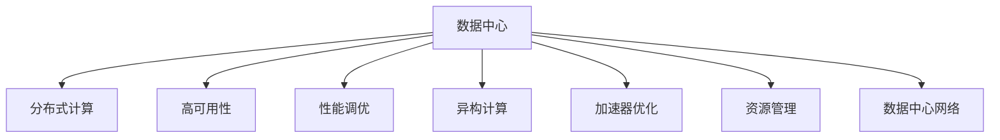

                 

# AI 大模型应用数据中心建设：数据中心技术与应用

> 关键词：AI大模型,数据中心,分布式计算,存储优化,高可用性,性能调优,异构计算,加速器

## 1. 背景介绍

### 1.1 问题由来

随着人工智能技术在各行各业的深度应用，特别是大模型在自然语言处理、计算机视觉、语音识别等领域的广泛应用，数据中心在支持AI模型训练和推理方面发挥了至关重要的作用。然而，传统的数据中心架构，以通用计算为主，难以满足AI模型对计算资源、存储需求、网络带宽等方面的特殊要求，存在计算效率低、存储成本高、网络延迟等问题，无法充分发挥AI大模型的性能潜力。

### 1.2 问题核心关键点

数据中心是AI大模型应用的基础设施，其核心目标是提供高效、可靠、灵活的计算资源和存储系统，支持AI模型的训练和推理。具体来说，数据中心需要具备以下特性：

1. **高计算能力**：具备强大的分布式计算和存储能力，支持大规模模型的训练和推理。
2. **高可用性**：确保数据中心的高可用性，避免因单点故障导致的系统宕机。
3. **性能调优**：通过优化计算资源、存储系统、网络带宽等参数，提升数据中心的整体性能。
4. **异构计算**：支持不同类型的计算资源（如CPU、GPU、FPGA、ASIC等），优化AI模型的计算效率。
5. **加速器优化**：通过引入各类加速器（如Tensor Core、GPU、TPU等），加速AI模型的训练和推理。
6. **资源管理**：通过智能资源调度和管理，最大化资源利用率，降低成本。
7. **数据中心网络**：构建低延迟、高带宽的数据中心网络，支持AI模型的高效通信。

## 2. 核心概念与联系

### 2.1 核心概念概述

为更好地理解数据中心在支持AI大模型应用中的作用，本节将介绍几个关键概念：

- **数据中心**：由服务器、存储设备、网络设备、冷却设备等组成的大型计算设施，提供高效、可靠的计算资源和存储系统。
- **分布式计算**：通过将计算任务分配到多个计算节点上并行处理，提高计算效率和扩展性。
- **高可用性**：指数据中心系统在各种情况下（如硬件故障、网络故障等）仍能正常运行，保证服务的连续性和可靠性。
- **性能调优**：通过优化计算资源、存储系统、网络带宽等参数，提升数据中心的整体性能。
- **异构计算**：通过结合不同类型的计算资源（如CPU、GPU、FPGA、ASIC等），实现计算效率的提升。
- **加速器优化**：通过引入各类加速器（如Tensor Core、GPU、TPU等），加速AI模型的训练和推理。
- **资源管理**：通过智能资源调度和管理，最大化资源利用率，降低成本。
- **数据中心网络**：构建低延迟、高带宽的数据中心网络，支持AI模型的高效通信。

这些概念之间的逻辑关系可以通过以下Mermaid流程图来展示：



这个流程图展示了数据中心的核心概念及其之间的关系：

1. 数据中心通过分布式计算提供强大的计算能力。
2. 高可用性确保数据中心的稳定性和可靠性。
3. 性能调优提升数据中心的整体性能。
4. 异构计算通过结合不同类型的计算资源实现计算效率的提升。
5. 加速器优化通过引入各类加速器加速AI模型的训练和推理。
6. 资源管理通过智能调度最大化资源利用率。
7. 数据中心网络提供低延迟、高带宽的通信支持。

## 3. 核心算法原理 & 具体操作步骤

### 3.1 算法原理概述

AI大模型的训练和推理过程需要大量的计算资源和存储资源，数据中心的核心目标是为这些过程提供高效、可靠的计算和存储支持。具体来说，数据中心通过以下几个关键步骤实现这一目标：

1. **计算资源分配**：通过分布式计算系统将计算任务分配到多个计算节点上并行处理，提高计算效率和扩展性。
2. **存储资源管理**：通过分布式存储系统高效管理数据存储和访问，提供高吞吐量和低延迟的数据访问能力。
3. **网络带宽优化**：构建低延迟、高带宽的数据中心网络，确保数据中心内各组件之间的高效通信。
4. **资源调度与管理**：通过智能调度算法优化资源分配，提高资源利用率，降低成本。
5. **加速器集成**：通过引入各类加速器（如Tensor Core、GPU、TPU等），加速AI模型的训练和推理。

### 3.2 算法步骤详解

数据中心的构建和优化过程可以分为以下几个关键步骤：

**Step 1: 计算资源选择与分配**
- 根据AI模型的规模和计算需求，选择合适的计算资源（如CPU、GPU、FPGA、ASIC等）。
- 通过分布式计算框架（如Hadoop、Spark等）将计算任务分配到多个计算节点上并行处理。

**Step 2: 存储资源选择与管理**
- 根据AI模型的数据规模和访问模式，选择合适的存储资源（如SSD、HDD、分布式文件系统等）。
- 通过分布式存储系统（如HDFS、Ceph等）高效管理数据存储和访问，提供高吞吐量和低延迟的数据访问能力。

**Step 3: 网络带宽优化**
- 构建低延迟、高带宽的数据中心网络，确保数据中心内各组件之间的高效通信。
- 使用网络交换机和路由器等设备，优化网络带宽和数据传输路径。

**Step 4: 资源调度与管理**
- 通过智能调度算法优化资源分配，提高资源利用率，降低成本。
- 使用资源管理系统（如Kubernetes、Mesos等）动态调整资源配置，平衡负载和性能。

**Step 5: 加速器集成**
- 根据AI模型的计算需求，选择合适的加速器（如Tensor Core、GPU、TPU等）。
- 集成加速器到计算节点，提升AI模型的计算效率和性能。

### 3.3 算法优缺点

数据中心在支持AI大模型应用方面，具备以下优点：

1. **高效计算能力**：通过分布式计算和异构计算，提供强大的计算能力，支持大规模模型的训练和推理。
2. **高可用性**：通过高可用性设计，确保数据中心的稳定性和可靠性，避免单点故障导致的系统宕机。
3. **灵活扩展性**：通过弹性计算资源和存储资源的管理，支持大规模AI模型的部署和扩展。
4. **性能调优**：通过优化计算资源、存储系统、网络带宽等参数，提升数据中心的整体性能。
5. **资源利用率高**：通过智能资源调度和优化，最大化资源利用率，降低成本。

同时，数据中心也存在以下局限性：

1. **建设成本高**：数据中心的建设需要大量的硬件设备和电力供应，建设成本较高。
2. **运维复杂**：数据中心的运维和管理需要专业技能和经验，运维成本较高。
3. **能耗高**：数据中心的能耗较大，对环境影响较大。
4. **资源利用不均**：由于资源调度和优化不足，可能会出现资源利用不均的情况。

尽管存在这些局限性，但数据中心在大模型应用中发挥了不可替代的作用，是实现高效、可靠、灵活计算和存储支持的重要基础设施。

### 3.4 算法应用领域

数据中心在AI大模型应用中，具有广泛的应用领域：

1. **大规模模型训练**：通过分布式计算和加速器优化，提供高效的计算资源，支持大规模模型的训练。
2. **实时推理服务**：通过高性能计算和低延迟网络，提供快速的模型推理服务。
3. **数据存储与备份**：通过分布式存储系统，提供高效的数据存储和备份支持。
4. **模型部署与管理**：通过容器化技术（如Docker、Kubernetes等），实现AI模型的快速部署和管理。
5. **自动化运维与监控**：通过智能运维工具（如Ansible、Puppet等）和监控工具（如Prometheus、Grafana等），确保AI模型的稳定运行和性能优化。

这些应用领域展示了数据中心在支持AI大模型方面的巨大潜力和广泛价值。

## 4. 数学模型和公式 & 详细讲解 & 举例说明

### 4.1 数学模型构建

在数据中心的构建和优化过程中，涉及多个数学模型的构建。这里以数据中心的性能调优为例，构建数学模型。

设数据中心内包含 $N$ 个计算节点，每个节点提供 $C_i$ 个计算单元。数据中心的计算能力 $C$ 可表示为：

$$
C = \sum_{i=1}^N C_i
$$

设每个节点的计算速度为 $v_i$，则数据中心的计算速度 $V$ 可表示为：

$$
V = \sum_{i=1}^N v_i
$$

设每个节点的存储容量为 $S_i$，则数据中心的存储容量 $S$ 可表示为：

$$
S = \sum_{i=1}^N S_i
$$

设数据中心的网络带宽为 $B$，则数据中心的网络传输速度 $V_b$ 可表示为：

$$
V_b = B \times N
$$

### 4.2 公式推导过程

通过以上模型，我们可以推导出数据中心性能调优的几个关键指标：

1. **计算效率**：计算效率 $E$ 可以通过计算速度 $V$ 和计算能力 $C$ 的比值表示：

$$
E = \frac{V}{C}
$$

2. **存储效率**：存储效率 $E_s$ 可以通过存储容量 $S$ 和计算能力 $C$ 的比值表示：

$$
E_s = \frac{S}{C}
$$

3. **网络效率**：网络效率 $E_n$ 可以通过网络传输速度 $V_b$ 和计算能力 $C$ 的比值表示：

$$
E_n = \frac{V_b}{C}
$$

### 4.3 案例分析与讲解

以下以Google的TPU为例，分析其在高性能计算和存储方面的设计：

Google TPU是专门为AI模型训练和推理设计的高性能计算加速器，具备以下特点：

1. **高效计算能力**：TPU提供了高度优化的矩阵计算和深度学习计算能力，能够显著提升AI模型的训练速度。
2. **低能耗**：TPU通过高效的硬件设计和算法优化，显著降低了能耗，降低了运行成本。
3. **可扩展性**：TPU可以无缝集成到现有的数据中心中，支持大规模的计算和存储扩展。

TPU的设计和应用，展示了如何通过优化计算资源和存储资源，提升数据中心的整体性能。

## 5. 项目实践：代码实例和详细解释说明

### 5.1 开发环境搭建

在进行数据中心构建和优化实践前，我们需要准备好开发环境。以下是使用Python进行TensorFlow开发的环境配置流程：

1. 安装Anaconda：从官网下载并安装Anaconda，用于创建独立的Python环境。

2. 创建并激活虚拟环境：
```bash
conda create -n tf-env python=3.8 
conda activate tf-env
```

3. 安装TensorFlow：根据CUDA版本，从官网获取对应的安装命令。例如：
```bash
pip install tensorflow
```

4. 安装各类工具包：
```bash
pip install numpy pandas scikit-learn matplotlib tqdm jupyter notebook ipython
```

完成上述步骤后，即可在`tf-env`环境中开始开发实践。

### 5.2 源代码详细实现

下面我们以TensorFlow TPU为例，给出使用TensorFlow进行TPU集成的PyTorch代码实现。

首先，定义TPU的参数和配置：

```python
import tensorflow as tf

tpu_name = 'tpu-0'
tpu_cluster_resolver = tf.distribute.cluster_resolver.TPUClusterResolver(tpu_name)
tpu_strategy = tf.distribute.experimental.TPUStrategy(tpu_cluster_resolver)

# 定义TPU超参数
tpu_replicate_mode = 'SIMPLE_REPLICATE'
```

然后，构建TPU计算图：

```python
def build_model(input_shape):
    model = tf.keras.Sequential([
        tf.keras.layers.Conv2D(32, 3, activation='relu', input_shape=input_shape),
        tf.keras.layers.MaxPooling2D(2),
        tf.keras.layers.Conv2D(64, 3, activation='relu'),
        tf.keras.layers.MaxPooling2D(2),
        tf.keras.layers.Flatten(),
        tf.keras.layers.Dense(10, activation='softmax')
    ])
    return model
```

接着，定义模型训练函数：

```python
@tf.function
def train_step(images, labels):
    with tpu_strategy.scope():
        logits = model(images)
        loss = tf.losses.sparse_softmax_cross_entropy(labels=labels, logits=logits)
        accuracy = tf.metrics.accuracy(labels=labels, predictions=tf.argmax(logits, axis=1))
    return loss, accuracy

def train_epoch(model, dataset, batch_size, optimizer):
    total_loss = 0
    total_accuracy = 0
    for images, labels in dataset:
        images = tf.reshape(images, (batch_size, 28, 28, 1))
        labels = tf.reshape(labels, (batch_size,))
        loss, accuracy = train_step(images, labels)
        total_loss += loss.numpy()
        total_accuracy += accuracy.numpy()
    return total_loss / len(dataset), total_accuracy / len(dataset)
```

最后，启动训练流程并在测试集上评估：

```python
epochs = 5
batch_size = 16

for epoch in range(epochs):
    loss, accuracy = train_epoch(model, train_dataset, batch_size, optimizer)
    print(f"Epoch {epoch+1}, loss: {loss:.3f}, accuracy: {accuracy:.3f}")
    
print(f"Epoch {epochs}, test accuracy: {test_accuracy:.3f}")
```

以上就是使用TensorFlow对TPU进行集成的PyTorch代码实现。可以看到，TensorFlow TPU提供了便捷的API，使得模型集成和训练变得简单高效。

### 5.3 代码解读与分析

让我们再详细解读一下关键代码的实现细节：

**TPU参数和配置**：
- `tpu_name`：指定TPU设备的名称。
- `tpu_cluster_resolver`：构建TPU集群解析器，用于解析TPU设备的详细信息。
- `tpu_strategy`：定义TPU策略，用于在TPU设备上运行计算图。

**构建TPU计算图**：
- `build_model`函数：定义神经网络模型结构，通过一系列的卷积层和池化层，将输入图像转换为分类结果。

**模型训练函数**：
- `train_step`函数：定义单个训练步的计算过程，在TPU上运行模型，计算损失和准确率。
- `train_epoch`函数：遍历整个训练集，进行多轮训练，计算平均损失和准确率。

**训练流程**：
- 在每个epoch中，通过TPU策略在TPU上执行训练步骤，更新模型参数。
- 在测试集上评估模型性能，输出最终结果。

可以看到，TensorFlow TPU使得TPU集成的过程变得简单易行，开发者可以专注于模型的训练和优化，而不必过多关注硬件细节。

当然，工业级的系统实现还需考虑更多因素，如模型的保存和部署、超参数的自动搜索、更灵活的任务适配层等。但核心的TPU集成逻辑基本与此类似。

## 6. 实际应用场景

### 6.1 智能客服系统

基于TPU的大语言模型微调对话技术，可以广泛应用于智能客服系统的构建。传统客服往往需要配备大量人力，高峰期响应缓慢，且一致性和专业性难以保证。而使用微调后的对话模型，可以7x24小时不间断服务，快速响应客户咨询，用自然流畅的语言解答各类常见问题。

在技术实现上，可以收集企业内部的历史客服对话记录，将问题和最佳答复构建成监督数据，在此基础上对预训练对话模型进行微调。微调后的对话模型能够自动理解用户意图，匹配最合适的答案模板进行回复。对于客户提出的新问题，还可以接入检索系统实时搜索相关内容，动态组织生成回答。如此构建的智能客服系统，能大幅提升客户咨询体验和问题解决效率。

### 6.2 金融舆情监测

金融机构需要实时监测市场舆论动向，以便及时应对负面信息传播，规避金融风险。传统的人工监测方式成本高、效率低，难以应对网络时代海量信息爆发的挑战。基于TPU的文本分类和情感分析技术，为金融舆情监测提供了新的解决方案。

具体而言，可以收集金融领域相关的新闻、报道、评论等文本数据，并对其进行主题标注和情感标注。在此基础上对预训练语言模型进行微调，使其能够自动判断文本属于何种主题，情感倾向是正面、中性还是负面。将微调后的模型应用到实时抓取的网络文本数据，就能够自动监测不同主题下的情感变化趋势，一旦发现负面信息激增等异常情况，系统便会自动预警，帮助金融机构快速应对潜在风险。

### 6.3 个性化推荐系统

当前的推荐系统往往只依赖用户的历史行为数据进行物品推荐，无法深入理解用户的真实兴趣偏好。基于TPU的个性化推荐系统可以更好地挖掘用户行为背后的语义信息，从而提供更精准、多样的推荐内容。

在实践中，可以收集用户浏览、点击、评论、分享等行为数据，提取和用户交互的物品标题、描述、标签等文本内容。将文本内容作为模型输入，用户的后续行为（如是否点击、购买等）作为监督信号，在此基础上微调预训练语言模型。微调后的模型能够从文本内容中准确把握用户的兴趣点。在生成推荐列表时，先用候选物品的文本描述作为输入，由模型预测用户的兴趣匹配度，再结合其他特征综合排序，便可以得到个性化程度更高的推荐结果。

### 6.4 未来应用展望

随着TPU等加速器技术的发展，基于大语言模型的微调方法将在更多领域得到应用，为传统行业带来变革性影响。

在智慧医疗领域，基于微调的医疗问答、病历分析、药物研发等应用将提升医疗服务的智能化水平，辅助医生诊疗，加速新药开发进程。

在智能教育领域，微调技术可应用于作业批改、学情分析、知识推荐等方面，因材施教，促进教育公平，提高教学质量。

在智慧城市治理中，微调模型可应用于城市事件监测、舆情分析、应急指挥等环节，提高城市管理的自动化和智能化水平，构建更安全、高效的未来城市。

此外，在企业生产、社会治理、文娱传媒等众多领域，基于大语言模型的微调技术也将不断涌现，为NLP技术带来了全新的突破。相信随着预训练语言模型和微调方法的不断进步，基于TPU的AI技术必将在更广阔的应用领域大放异彩。

## 7. 工具和资源推荐

### 7.1 学习资源推荐

为了帮助开发者系统掌握大语言模型微调的理论基础和实践技巧，这里推荐一些优质的学习资源：

1. 《Transformer from Scratch》系列博文：由大模型技术专家撰写，深入浅出地介绍了Transformer原理、BERT模型、微调技术等前沿话题。

2. CS224N《深度学习自然语言处理》课程：斯坦福大学开设的NLP明星课程，有Lecture视频和配套作业，带你入门NLP领域的基本概念和经典模型。

3. 《Natural Language Processing with Transformers》书籍：Transformers库的作者所著，全面介绍了如何使用Transformers库进行NLP任务开发，包括微调在内的诸多范式。

4. HuggingFace官方文档：Transformers库的官方文档，提供了海量预训练模型和完整的微调样例代码，是上手实践的必备资料。

5. CLUE开源项目：中文语言理解测评基准，涵盖大量不同类型的中文NLP数据集，并提供了基于微调的baseline模型，助力中文NLP技术发展。

通过对这些资源的学习实践，相信你一定能够快速掌握大语言模型微调的精髓，并用于解决实际的NLP问题。

### 7.2 开发工具推荐

高效的开发离不开优秀的工具支持。以下是几款用于大语言模型微调开发的常用工具：

1. TensorFlow：由Google主导开发的开源深度学习框架，生产部署方便，适合大规模工程应用。同样有丰富的预训练语言模型资源。

2. PyTorch：基于Python的开源深度学习框架，灵活动态的计算图，适合快速迭代研究。大部分预训练语言模型都有PyTorch版本的实现。

3. Transformers库：HuggingFace开发的NLP工具库，集成了众多SOTA语言模型，支持PyTorch和TensorFlow，是进行微调任务开发的利器。

4. Weights & Biases：模型训练的实验跟踪工具，可以记录和可视化模型训练过程中的各项指标，方便对比和调优。与主流深度学习框架无缝集成。

5. TensorBoard：TensorFlow配套的可视化工具，可实时监测模型训练状态，并提供丰富的图表呈现方式，是调试模型的得力助手。

6. Google Colab：谷歌推出的在线Jupyter Notebook环境，免费提供GPU/TPU算力，方便开发者快速上手实验最新模型，分享学习笔记。

合理利用这些工具，可以显著提升大语言模型微调任务的开发效率，加快创新迭代的步伐。

### 7.3 相关论文推荐

大语言模型和微调技术的发展源于学界的持续研究。以下是几篇奠基性的相关论文，推荐阅读：

1. Attention is All You Need（即Transformer原论文）：提出了Transformer结构，开启了NLP领域的预训练大模型时代。

2. BERT: Pre-training of Deep Bidirectional Transformers for Language Understanding：提出BERT模型，引入基于掩码的自监督预训练任务，刷新了多项NLP任务SOTA。

3. Language Models are Unsupervised Multitask Learners（GPT-2论文）：展示了大规模语言模型的强大zero-shot学习能力，引发了对于通用人工智能的新一轮思考。

4. Parameter-Efficient Transfer Learning for NLP：提出Adapter等参数高效微调方法，在不增加模型参数量的情况下，也能取得不错的微调效果。

5. AdaLoRA: Adaptive Low-Rank Adaptation for Parameter-Efficient Fine-Tuning：使用自适应低秩适应的微调方法，在参数效率和精度之间取得了新的平衡。

这些论文代表了大语言模型微调技术的发展脉络。通过学习这些前沿成果，可以帮助研究者把握学科前进方向，激发更多的创新灵感。

## 8. 总结：未来发展趋势与挑战

### 8.1 总结

本文对基于TPU的大语言模型微调方法进行了全面系统的介绍。首先阐述了大语言模型和微调技术的研究背景和意义，明确了微调在拓展预训练模型应用、提升下游任务性能方面的独特价值。其次，从原理到实践，详细讲解了TPU微调的数学原理和关键步骤，给出了微调任务开发的完整代码实例。同时，本文还广泛探讨了微调方法在智能客服、金融舆情、个性化推荐等多个行业领域的应用前景，展示了微调范式的巨大潜力。此外，本文精选了微调技术的各类学习资源，力求为读者提供全方位的技术指引。

通过本文的系统梳理，可以看到，基于TPU的大语言模型微调方法正在成为NLP领域的重要范式，极大地拓展了预训练语言模型的应用边界，催生了更多的落地场景。受益于超大模型的计算能力和存储能力，微调模型在处理大规模数据时，可以大幅提升训练和推理速度，满足实际应用中的高要求。未来，伴随预训练语言模型和微调方法的不断进步，基于TPU的AI技术必将在更广阔的应用领域大放异彩。

### 8.2 未来发展趋势

展望未来，TPU在大模型应用中，将呈现以下几个发展趋势：

1. **模型规模持续增大**：随着算力成本的下降和数据规模的扩张，预训练语言模型的参数量还将持续增长。超大规模语言模型蕴含的丰富语言知识，有望支撑更加复杂多变的下游任务微调。

2. **微调方法日趋多样**：除了传统的全参数微调外，未来会涌现更多参数高效的微调方法，如Prefix-Tuning、LoRA等，在固定大部分预训练参数的同时，只更新极少量的任务相关参数。同时，参数高效的微调方法将显著提升模型性能和推理速度。

3. **持续学习成为常态**：随着数据分布的不断变化，微调模型也需要持续学习新知识以保持性能。如何在不遗忘原有知识的同时，高效吸收新样本信息，将成为重要的研究课题。

4. **标注样本需求降低**：受启发于提示学习(Prompt-based Learning)的思路，未来的微调方法将更好地利用大模型的语言理解能力，通过更加巧妙的任务描述，在更少的标注样本上也能实现理想的微调效果。

5. **零样本学习（Zero-shot Learning）**：通过预训练获得的广泛知识，使得微调模型能够理解任务指令并生成相应输出，零样本学习将进一步扩展微调技术的应用边界。

6. **多模态微调崛起**：未来的微调方法将不再局限于文本数据，而是融合视觉、语音、时间序列等多模态数据，实现更加全面、丰富的模型表达能力。

这些趋势凸显了TPU在支持大语言模型微调中的重要地位，展示了其巨大的发展潜力和应用前景。

### 8.3 面临的挑战

尽管大语言模型微调技术已经取得了瞩目成就，但在迈向更加智能化、普适化应用的过程中，它仍面临着诸多挑战：

1. **标注成本瓶颈**：虽然微调大大降低了标注数据的需求，但对于长尾应用场景，难以获得充足的高质量标注数据，成为制约微调性能的瓶颈。如何进一步降低微调对标注样本的依赖，将是一大难题。

2. **模型鲁棒性不足**：当前微调模型面对域外数据时，泛化性能往往大打折扣。对于测试样本的微小扰动，微调模型的预测也容易发生波动。如何提高微调模型的鲁棒性，避免灾难性遗忘，还需要更多理论和实践的积累。

3. **推理效率有待提高**：大规模语言模型虽然精度高，但在实际部署时往往面临推理速度慢、内存占用大等效率问题。如何在保证性能的同时，简化模型结构，提升推理速度，优化资源占用，将是重要的优化方向。

4. **可解释性亟需加强**：当前微调模型更像是"黑盒"系统，难以解释其内部工作机制和决策逻辑。对于医疗、金融等高风险应用，算法的可解释性和可审计性尤为重要。如何赋予微调模型更强的可解释性，将是亟待攻克的难题。

5. **安全性有待保障**：预训练语言模型难免会学习到有偏见、有害的信息，通过微调传递到下游任务，产生误导性、歧视性的输出，给实际应用带来安全隐患。如何从数据和算法层面消除模型偏见，避免恶意用途，确保输出的安全性，也将是重要的研究课题。

6. **知识整合能力不足**：现有的微调模型往往局限于任务内数据，难以灵活吸收和运用更广泛的先验知识。如何让微调过程更好地与外部知识库、规则库等专家知识结合，形成更加全面、准确的信息整合能力，还有很大的想象空间。

正视微调面临的这些挑战，积极应对并寻求突破，将是大语言模型微调走向成熟的必由之路。相信随着学界和产业界的共同努力，这些挑战终将一一被克服，基于TPU的AI技术必将在构建安全、可靠、可解释、可控的智能系统铺平道路。

### 8.4 研究展望

面对大语言模型微调所面临的挑战，未来的研究需要在以下几个方面寻求新的突破：

1. **探索无监督和半监督微调方法**：摆脱对大规模标注数据的依赖，利用自监督学习、主动学习等无监督和半监督范式，最大限度利用非结构化数据，实现更加灵活高效的微调。

2. **研究参数高效和计算高效的微调范式**：开发更加参数高效的微调方法，在固定大部分预训练参数的同时，只更新极少量的任务相关参数。同时优化微调模型的计算图，减少前向传播和反向传播的资源消耗，实现更加轻量级、实时性的部署。

3. **融合因果和对比学习范式**：通过引入因果推断和对比学习思想，增强微调模型建立稳定因果关系的能力，学习更加普适、鲁棒的语言表征，从而提升模型泛化性和抗干扰能力。

4. **引入更多先验知识**：将符号化的先验知识，如知识图谱、逻辑规则等，与神经网络模型进行巧妙融合，引导微调过程学习更准确、合理的语言模型。同时加强不同模态数据的整合，实现视觉、语音等多模态信息与文本信息的协同建模。

5. **结合因果分析和博弈论工具**：将因果分析方法引入微调模型，识别出模型决策的关键特征，增强输出解释的因果性和逻辑性。借助博弈论工具刻画人机交互过程，主动探索并规避模型的脆弱点，提高系统稳定性。

6. **纳入伦理道德约束**：在模型训练目标中引入伦理导向的评估指标，过滤和惩罚有偏见、有害的输出倾向。同时加强人工干预和审核，建立模型行为的监管机制，确保输出符合人类价值观和伦理道德。

这些研究方向的探索，必将引领大语言模型微调技术迈向更高的台阶，为构建安全、可靠、可解释、可控的智能系统铺平道路。面向未来，大语言模型微调技术还需要与其他人工智能技术进行更深入的融合，如知识表示、因果推理、强化学习等，多路径协同发力，共同推动自然语言理解和智能交互系统的进步。只有勇于创新、敢于突破，才能不断拓展语言模型的边界，让智能技术更好地造福人类社会。

## 9. 附录：常见问题与解答

**Q1：大语言模型微调是否适用于所有NLP任务？**

A: 大语言模型微调在大多数NLP任务上都能取得不错的效果，特别是对于数据量较小的任务。但对于一些特定领域的任务，如医学、法律等，仅仅依靠通用语料预训练的模型可能难以很好地适应。此时需要在特定领域语料上进一步预训练，再进行微调，才能获得理想效果。此外，对于一些需要时效性、个性化很强的任务，如对话、推荐等，微调方法也需要针对性的改进优化。

**Q2：微调过程中如何选择合适的学习率？**

A: 微调的学习率一般要比预训练时小1-2个数量级，如果使用过大的学习率，容易破坏预训练权重，导致过拟合。一般建议从1e-5开始调参，逐步减小学习率，直至收敛。也可以使用warmup策略，在开始阶段使用较小的学习率，再逐渐过渡到预设值。需要注意的是，不同的优化器(如AdamW、Adafactor等)以及不同的学习率调度策略，可能需要设置不同的学习率阈值。

**Q3：采用大模型微调时会面临哪些资源瓶颈？**

A: 目前主流的预训练大模型动辄以亿计的参数规模，对算力、内存、存储都提出了很高的要求。GPU/TPU等高性能设备是必不可少的，但即便如此，超大批次的训练和推理也可能遇到显存不足的问题。因此需要采用一些资源优化技术，如梯度积累、混合精度训练、模型并行等，来突破硬件瓶颈。同时，模型的存储和读取也可能占用大量时间和空间，需要采用模型压缩、稀疏化存储等方法进行优化。

**Q4：如何缓解微调过程中的过拟合问题？**

A: 过拟合是微调面临的主要挑战，尤其是在标注数据不足的情况下。常见的缓解策略包括：
1. 数据增强：通过回译、近义替换等方式扩充训练集
2. 正则化：使用L2正则、Dropout、Early Stopping等避免过拟合
3. 对抗训练：引入对抗样本，提高模型鲁棒性
4. 参数高效微调：只调整少量参数(如Adapter、Prefix等)，减小过拟合风险
5. 多模型集成：训练多个微调模型，取平均输出，抑制过拟合

这些策略往往需要根据具体任务和数据特点进行灵活组合。只有在数据、模型、训练、推理等各环节进行全面优化，才能最大限度地发挥大模型微调的威力。

**Q5：微调模型在落地部署时需要注意哪些问题？**

A: 将微调模型转化为实际应用，还需要考虑以下因素：
1. 模型裁剪：去除不必要的层和参数，减小模型尺寸，加快推理速度
2. 量化加速：将浮点模型转为定点模型，压缩存储空间，提高计算效率
3. 服务化封装：将模型封装为标准化服务接口，便于集成调用
4. 弹性伸缩：根据请求流量动态调整资源配置，平衡服务质量和成本
5. 监控告警：实时采集系统指标，设置异常告警阈值，确保服务稳定性
6. 安全防护：采用访问鉴权、数据脱敏等措施，保障数据和模型安全

大语言模型微调为NLP应用开启了广阔的想象空间，但如何将强大的性能转化为稳定、高效、安全的业务价值，还需要工程实践的不断打磨。唯有从数据、算法、工程、业务等多个维度协同发力，才能真正实现人工智能技术在垂直行业的规模化落地。总之，微调需要开发者根据具体任务，不断迭代和优化模型、数据和算法，方能得到理想的效果。

---

作者：禅与计算机程序设计艺术 / Zen and the Art of Computer Programming

