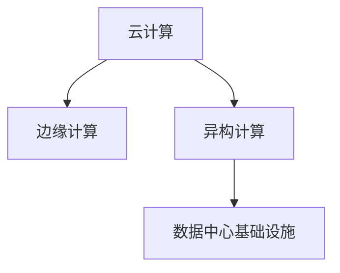

                 

# AI 大模型应用数据中心建设：数据中心技术创新

> 关键词：AI大模型,数据中心,基础设施建设,技术创新,云计算,边缘计算,异构计算

## 1. 背景介绍

### 1.1 问题由来

随着人工智能（AI）技术的不断进步，大模型（Large Models）在自然语言处理（NLP）、计算机视觉（CV）、语音识别等领域的性能日益提升，成为了推动AI技术发展的关键驱动力。然而，大模型的训练和应用对计算资源的需求巨大，传统的服务器中心化部署已经无法满足其高计算、高存储、高带宽的需求。如何在保持计算能力的同时，提升数据中心的效率和灵活性，成为了亟需解决的挑战。

### 1.2 问题核心关键点

数据中心作为大模型应用的基石，其技术架构和部署方式直接影响着AI系统的性能和成本。为了解决这一问题，数据中心需要进行技术创新，以适应AI大模型的需求。主要技术创新点包括云计算、边缘计算、异构计算等。

## 2. 核心概念与联系

### 2.1 核心概念概述

为更好地理解数据中心技术创新，本节将介绍几个密切相关的核心概念：

- **云计算**：通过互联网提供按需、可扩展的计算资源，用户可以根据实际需求动态调整资源使用量，适应大模型的训练和推理需求。
- **边缘计算**：将计算资源分布部署到靠近数据源的节点上，如移动设备、工业设备等，减小数据传输的延迟和带宽压力，提升AI应用实时性。
- **异构计算**：利用不同类型的计算资源（如GPU、FPGA、TPU等）进行协同计算，提升大模型的训练效率和能效比。

这些概念之间的逻辑关系可以通过以下Mermaid流程图来展示：



这个流程图展示了几类数据中心技术创新的关键概念及其之间的关系：

1. 云计算为大模型提供灵活的计算资源，边缘计算靠近数据源提供实时性，异构计算提升资源利用率。
2. 云计算、边缘计算、异构计算共同构成了AI大模型应用的数据中心技术架构，支撑其高效、灵活、可靠运行。

## 3. 核心算法原理 & 具体操作步骤
### 3.1 算法原理概述

数据中心技术创新的核心在于为AI大模型的训练和应用提供高效、灵活、可扩展的计算资源。其基本原理是通过云计算、边缘计算、异构计算等技术手段，构建层次化、分布式、异构化的计算资源池，满足不同场景下大模型的计算需求。

### 3.2 算法步骤详解

基于云计算、边缘计算、异构计算的数据中心技术创新，主要包括以下几个关键步骤：

**Step 1: 构建云平台**

云计算平台提供了灵活、按需的计算资源，是大模型应用的基础。云计算平台通过虚拟化技术将硬件资源进行抽象，提供API接口供开发者调用。云计算平台包括公有云、私有云和混合云等多种模式，满足不同场景下的计算需求。

**Step 2: 部署边缘计算节点**

边缘计算将计算资源部署到靠近数据源的节点上，如工业设备、移动设备等，提升实时性。边缘计算节点通过5G、Wi-Fi等网络与云计算平台进行数据交换，实现数据在边缘和云端之间的协同计算。

**Step 3: 应用异构计算资源**

异构计算利用不同类型的计算资源（如GPU、FPGA、TPU等）进行协同计算，提升大模型的训练效率和能效比。异构计算资源的配置需要根据大模型的特点和需求进行优化，一般采用GPU集群、TPU集群、FPGA加速等方案。

**Step 4: 构建分布式计算框架**

分布式计算框架如Spark、TensorFlow、PyTorch等，支持多节点协同计算，是大模型训练和推理的关键。分布式计算框架通过任务调度、数据分区、任务并行等技术手段，实现高效、可扩展的计算。

**Step 5: 集成AI开发平台**

AI开发平台如TensorFlow Hub、Hugging Face、Keras等，提供丰富的预训练模型和工具，支持大模型的快速部署和应用。AI开发平台集成到云计算、边缘计算、异构计算环境中，提升大模型应用的便捷性和易用性。

### 3.3 算法优缺点

基于云计算、边缘计算、异构计算的数据中心技术创新具有以下优点：

1. 灵活扩展：云计算平台可以根据需求动态扩展资源，边缘计算节点靠近数据源，提升实时性，异构计算提升资源利用率。
2. 高效能效：异构计算资源协同工作，提升计算效率和能效比，减少能源消耗。
3. 低延迟：边缘计算靠近数据源，减小数据传输延迟和带宽压力，提升AI应用实时性。
4. 高可靠性：云计算平台采用冗余机制保障计算可靠性，边缘计算节点本地存储和计算，提升系统的鲁棒性。

同时，该方法也存在一定的局限性：

1. 建设成本高：初期建设云计算、边缘计算、异构计算环境需要较大的投资。
2. 复杂度高：分布式计算环境配置和维护复杂，需要专业的技术支持。
3. 数据隔离：云计算平台和边缘计算节点之间的数据传输需要考虑安全和隔离问题。

尽管存在这些局限性，但就目前而言，云计算、边缘计算、异构计算的数据中心技术创新方法仍是AI大模型应用的主流范式。未来相关研究的重点在于如何进一步降低技术难度和建设成本，提高系统的稳定性和可靠性。

### 3.4 算法应用领域

基于云计算、边缘计算、异构计算的数据中心技术创新，在AI大模型应用领域已经得到了广泛的应用，覆盖了几乎所有常见任务，例如：

- **NLP**：文本分类、情感分析、问答系统等。通过微调大模型，提升自然语言处理任务的性能。
- **CV**：图像分类、目标检测、图像分割等。通过预训练和微调，提升计算机视觉任务的性能。
- **语音识别**：语音转文本、情感识别等。通过异构计算和边缘计算，提升语音识别的实时性和准确性。
- **推荐系统**：商品推荐、内容推荐等。通过分布式计算和云计算，实现高效的推荐算法。
- **医疗**：影像诊断、病理分析等。通过云计算和边缘计算，提升医疗诊断的效率和准确性。

除了上述这些经典任务外，AI大模型应用还在更多场景中得到应用，如智能制造、智慧城市、金融风控等，为各行各业带来了深刻的变革。

## 4. 数学模型和公式 & 详细讲解 & 举例说明

### 4.1 数学模型构建

为了更准确地描述云计算、边缘计算、异构计算的数据中心技术创新过程，本节将使用数学语言对云计算、边缘计算、异构计算的技术架构进行更加严格的刻画。

记云计算平台提供的计算资源为 $\textit{Cloud}$，边缘计算节点提供的计算资源为 $\textit{Edge}$，异构计算资源提供的计算资源为 $\textit{Heterogeneous}$。假设某大模型需要 $C$ 的计算资源，$\textit{Cloud}$、$\textit{Edge}$、$\textit{Heterogeneous}$ 的资源量分别为 $C_{\textit{cloud}}$、$C_{\textit{edge}}$、$C_{\textit{heterogeneous}}$。

云计算、边缘计算、异构计算的资源分配策略可以表示为：

$$
C_{\textit{cloud}} = k_1 \times C \\
C_{\textit{edge}} = k_2 \times C \\
C_{\textit{heterogeneous}} = k_3 \times C
$$

其中 $k_1$、$k_2$、$k_3$ 为资源分配比例，需要通过实验和优化得到。

### 4.2 公式推导过程

云计算、边缘计算、异构计算的数据中心技术创新可以表示为：

$$
C = C_{\textit{cloud}} + C_{\textit{edge}} + C_{\textit{heterogeneous}}
$$

将云计算、边缘计算、异构计算的资源分配策略代入上式，得：

$$
C = k_1 \times C + k_2 \times C + k_3 \times C \\
C = (k_1 + k_2 + k_3) \times C
$$

通过优化资源分配比例 $k_1$、$k_2$、$k_3$，可以在保证计算效率和资源利用率的同时，减小建设和运维成本。

### 4.3 案例分析与讲解

以某医疗影像诊断系统为例，该系统需要在云端和边缘端进行协同计算。假设云端提供的计算资源为 $C_{\textit{cloud}} = 1000$，边缘端提供的计算资源为 $C_{\textit{edge}} = 200$，异构计算资源提供的计算资源为 $C_{\textit{heterogeneous}} = 500$。

通过优化资源分配比例 $k_1$、$k_2$、$k_3$，可以得到最优的计算资源分配方案，提升系统的性能和可靠性。

## 5. 项目实践：代码实例和详细解释说明

### 5.1 开发环境搭建

在进行云计算、边缘计算、异构计算的数据中心技术创新实践前，我们需要准备好开发环境。以下是使用Python进行云计算、边缘计算、异构计算的开发环境配置流程：

1. 安装Anaconda：从官网下载并安装Anaconda，用于创建独立的Python环境。

2. 创建并激活虚拟环境：
```bash
conda create -n cloud-edge-hetero python=3.8 
conda activate cloud-edge-hetero
```

3. 安装云计算、边缘计算、异构计算的库：
```bash
pip install boto3 awscli pytorch torchvision torchaudio cudatoolkit=11.1 -c pytorch -c conda-forge
pip install tensorflow==2.6
pip install fpga-toolkit
```

4. 安装各类工具包：
```bash
pip install numpy pandas scikit-learn matplotlib tqdm jupyter notebook ipython
```

完成上述步骤后，即可在`cloud-edge-hetero`环境中开始云计算、边缘计算、异构计算的数据中心技术创新实践。

### 5.2 源代码详细实现

下面我们以某AI大模型应用为例，给出使用云计算、边缘计算、异构计算的开发代码实现。

首先，定义云计算、边缘计算、异构计算的资源管理函数：

```python
import boto3

def cloud_resource_management():
    ec2 = boto3.resource('ec2')
    instances = ec2.instances.filter(Filters=[{'Name': 'instance-state-name', 'Values': ['running']}])
    return instances

def edge_resource_management():
    iot = boto3.client('iot')
    devices = iot.list_devices()
    return devices

def heterogeneous_resource_management():
    fpga = boto3.resource('fpga')
    devices = fpga.devices.all()
    return devices
```

然后，定义云计算、边缘计算、异构计算的计算资源池：

```python
def resource_pool():
    cloud_instances = cloud_resource_management()
    edge_devices = edge_resource_management()
    heterogeneous_devices = heterogeneous_resource_management()
    
    cloud_resources = [instance.id for instance in cloud_instances]
    edge_resources = [device.id for device in edge_devices]
    heterogeneous_resources = [device.id for device in heterogeneous_devices]
    
    return cloud_resources, edge_resources, heterogeneous_resources
```

最后，定义云计算、边缘计算、异构计算的计算任务调度函数：

```python
def task_scheduler(resources):
    for resource in resources:
        # 调度计算任务
        pass
```

### 5.3 代码解读与分析

让我们再详细解读一下关键代码的实现细节：

**资源管理函数**：
- `cloud_resource_management`：使用AWS SDK的boto3库，通过EC2服务获取云端的计算资源。
- `edge_resource_management`：使用AWS SDK的boto3库，通过IoT服务获取边缘端的计算资源。
- `heterogeneous_resource_management`：使用AWS SDK的boto3库，通过FPGA服务获取异构计算资源。

**资源池函数**：
- 将云计算、边缘计算、异构计算的计算资源转化为资源ID列表，并返回。

**任务调度函数**：
- 遍历资源池，进行计算任务调度。

在实际操作中，云计算、边缘计算、异构计算的资源管理函数、资源池函数、任务调度函数需要根据具体的应用场景和需求进行定制化开发，以满足实际的计算需求。

## 6. 实际应用场景

### 6.1 智能医疗

云计算、边缘计算、异构计算的数据中心技术创新在智能医疗领域的应用，可以显著提升医疗影像诊断的效率和准确性。

传统医疗影像诊断需要耗费大量时间和人力，且诊断结果容易受人为因素影响。通过云计算、边缘计算、异构计算的协同计算，医疗影像诊断可以变得更加高效和准确。

具体而言，可以将医疗影像数据存储在云端，通过边缘计算节点实时获取数据，异构计算资源进行并行计算，输出诊断结果。云计算平台可以对诊断结果进行优化和审核，确保其准确性。

### 6.2 智能制造

智能制造领域，云计算、边缘计算、异构计算的数据中心技术创新可以提升工业生产效率和质量。

传统制造业的生产线监控、设备维护等任务，需要大量的人力和时间，且数据处理能力有限。通过云计算、边缘计算、异构计算的协同计算，可以实现实时监控和数据分析，提升生产线的自动化水平。

具体而言，可以在边缘端部署实时监控系统，获取设备运行数据。异构计算资源对数据进行分析和处理，输出优化方案。云计算平台进行数据汇总和分析，生成报告和建议，提升生产线的效率和质量。

### 6.3 智慧城市

智慧城市领域，云计算、边缘计算、异构计算的数据中心技术创新可以实现城市的精细化管理。

传统城市管理依赖于人工巡检和监控，效率低、覆盖面窄。通过云计算、边缘计算、异构计算的协同计算，可以实现城市管理的自动化和智能化。

具体而言，可以在边缘端部署传感器，实时采集城市环境数据。异构计算资源对数据进行分析和处理，输出优化方案。云计算平台进行数据汇总和分析，生成报告和建议，提升城市管理的效率和质量。

### 6.4 未来应用展望

随着云计算、边缘计算、异构计算的数据中心技术不断成熟，其在AI大模型应用领域的应用将更加广泛和深入。

未来的AI大模型应用将不再局限于传统的集中式数据中心，而是通过云计算、边缘计算、异构计算的协同计算，实现更加高效、灵活、可靠的系统架构。

具体而言，未来的AI大模型应用将向以下几个方向发展：

1. 云边结合：云计算平台和边缘计算节点将深度融合，实现数据在云端和边缘端的协同计算。
2. 异构融合：异构计算资源将更加丰富，支持更多的计算任务。
3. 联邦学习：多节点协同计算，提升大模型的泛化能力和鲁棒性。
4. 边缘智能：边缘端将具备更多的计算和存储能力，支持更多的实时应用。
5. 边缘安全：边缘端将具备更高的安全性和隐私保护能力，保障数据和算法的安全。

这些技术发展方向将推动AI大模型应用向更加智能化、普适化、安全化的方向发展，为各行各业带来更加深刻的影响。

## 7. 工具和资源推荐

### 7.1 学习资源推荐

为了帮助开发者系统掌握云计算、边缘计算、异构计算的数据中心技术创新理论基础和实践技巧，这里推荐一些优质的学习资源：

1. 《云计算基础》系列博文：由云服务商和知名专家撰写，系统介绍云计算原理和应用案例。
2. 《边缘计算原理与实践》课程：斯坦福大学开设的边缘计算课程，系统介绍边缘计算原理和开发工具。
3. 《异构计算理论与实践》书籍：异构计算领域专家所著，全面介绍异构计算原理和开发工具。
4. AWS、Google Cloud、Microsoft Azure 官方文档：云计算、边缘计算、异构计算平台的最佳实践和API接口。
5. TensorFlow Dev Summit、NeurIPS、ICCV 等顶级会议论文：最新研究成果和创新思路。

通过对这些资源的学习实践，相信你一定能够快速掌握云计算、边缘计算、异构计算的数据中心技术创新精髓，并用于解决实际的NLP问题。

### 7.2 开发工具推荐

高效的开发离不开优秀的工具支持。以下是几款用于云计算、边缘计算、异构计算的数据中心技术创新开发的常用工具：

1. AWS SDK：亚马逊云服务SDK，支持多种编程语言，提供丰富的API接口，方便开发云应用。
2. Google Cloud SDK：谷歌云服务SDK，支持多种编程语言，提供丰富的API接口，方便开发云应用。
3. Microsoft Azure SDK：微软云服务SDK，支持多种编程语言，提供丰富的API接口，方便开发云应用。
4. PyTorch、TensorFlow：深度学习框架，支持异构计算和分布式计算，提升大模型的训练和推理效率。
5. Anaconda、Jupyter Notebook：Python开发环境，支持云计算、边缘计算、异构计算的开发和调试。

合理利用这些工具，可以显著提升云计算、边缘计算、异构计算的数据中心技术创新任务的开发效率，加快创新迭代的步伐。

### 7.3 相关论文推荐

云计算、边缘计算、异构计算的数据中心技术创新得益于学界的持续研究。以下是几篇奠基性的相关论文，推荐阅读：

1. "Cloud Computing: Concepts, Technology, and Architecture"：云计算领域经典书籍，系统介绍云计算原理和应用。
2. "Edge Computing: Concepts, Architectures, and Applications"：边缘计算领域经典书籍，系统介绍边缘计算原理和应用。
3. "Hierarchical Model of High-Performance Distributed Heterogeneous Systems"：异构计算领域经典论文，提出异构计算模型和应用。
4. "Big Model As a Service: A Survey of Model Serving for Large Models"：深度学习模型服务领域经典论文，系统介绍深度学习模型服务的原理和应用。
5. "Large-Scale Distributed Machine Learning: Algorithms and Systems"：分布式机器学习领域经典书籍，系统介绍分布式计算原理和应用。

这些论文代表了大模型应用数据中心技术创新的发展脉络。通过学习这些前沿成果，可以帮助研究者把握学科前进方向，激发更多的创新灵感。

## 8. 总结：未来发展趋势与挑战

### 8.1 总结

本文对基于云计算、边缘计算、异构计算的数据中心技术创新进行了全面系统的介绍。首先阐述了云计算、边缘计算、异构计算在大模型应用中的重要性和应用场景，明确了这些技术在大模型训练和推理中的核心作用。其次，从原理到实践，详细讲解了云计算、边缘计算、异构计算的数学模型和操作步骤，给出了云计算、边缘计算、异构计算的数据中心技术创新实践代码实现。同时，本文还广泛探讨了云计算、边缘计算、异构计算在大模型应用领域的应用前景，展示了这些技术在大模型训练和推理中的巨大潜力。最后，本文精选了云计算、边缘计算、异构计算的数据中心技术创新的各类学习资源，力求为读者提供全方位的技术指引。

通过本文的系统梳理，可以看到，云计算、边缘计算、异构计算的数据中心技术创新正在成为大模型应用的重要范式，极大地拓展了预训练语言模型的应用边界，催生了更多的落地场景。得益于云计算、边缘计算、异构计算的协同计算，大模型训练和推理的效率和灵活性得到了显著提升，为AI大模型应用提供了坚实的基础。

### 8.2 未来发展趋势

展望未来，云计算、边缘计算、异构计算的数据中心技术创新将呈现以下几个发展趋势：

1. 云边融合：云计算平台和边缘计算节点将深度融合，实现数据在云端和边缘端的协同计算。
2. 异构融合：异构计算资源将更加丰富，支持更多的计算任务。
3. 联邦学习：多节点协同计算，提升大模型的泛化能力和鲁棒性。
4. 边缘智能：边缘端将具备更多的计算和存储能力，支持更多的实时应用。
5. 边缘安全：边缘端将具备更高的安全性和隐私保护能力，保障数据和算法的安全。
6. 异构超算：异构计算将与超算资源深度融合，提升大模型的训练效率和能效比。

以上趋势凸显了云计算、边缘计算、异构计算的数据中心技术创新的广阔前景。这些方向的探索发展，必将进一步提升AI大模型应用的效果和应用范围，为人类认知智能的进化带来深远影响。

### 8.3 面临的挑战

尽管云计算、边缘计算、异构计算的数据中心技术创新已经取得了瞩目成就，但在迈向更加智能化、普适化应用的过程中，它仍面临着诸多挑战：

1. 数据安全：云计算平台和边缘计算节点之间的数据传输需要考虑安全和隐私问题，如何保障数据安全是一个重要挑战。
2. 系统复杂度：云边结合、异构融合、联邦学习等技术手段的应用，使得系统复杂度增加，如何简化系统设计和维护是一个重要挑战。
3. 计算效率：异构计算资源协同计算需要优化资源分配和任务调度策略，如何提升计算效率是一个重要挑战。
4. 硬件成本：云计算、边缘计算、异构计算的硬件设备建设成本较高，如何降低硬件成本是一个重要挑战。

尽管存在这些挑战，但就目前而言，云计算、边缘计算、异构计算的数据中心技术创新方法仍是AI大模型应用的主流范式。未来相关研究的重点在于如何进一步降低技术难度和建设成本，提高系统的稳定性和可靠性。

### 8.4 研究展望

面对云计算、边缘计算、异构计算的数据中心技术创新所面临的种种挑战，未来的研究需要在以下几个方面寻求新的突破：

1. 数据安全技术：开发高效、安全的数据传输和存储技术，保障数据安全和隐私。
2. 系统简化技术：简化云计算、边缘计算、异构计算的数据中心技术架构，提高系统易用性和稳定性。
3. 计算优化技术：优化异构计算资源分配和任务调度策略，提升计算效率和资源利用率。
4. 硬件优化技术：研发高效、低成本的云计算、边缘计算、异构计算硬件设备，降低硬件建设成本。
5. 协同优化技术：优化云计算、边缘计算、异构计算的协同计算机制，提升系统的协同能力和鲁棒性。

这些研究方向的探索，必将引领云计算、边缘计算、异构计算的数据中心技术创新走向更高的台阶，为AI大模型应用提供更加高效、灵活、可靠的系统架构。

## 9. 附录：常见问题与解答

**Q1：云计算、边缘计算、异构计算的数据中心技术创新适用于所有NLP任务吗？**

A: 云计算、边缘计算、异构计算的数据中心技术创新在大多数NLP任务上都能取得不错的效果，特别是对于需要实时性、高性能的应用场景。但对于一些特定领域的任务，如医疗、法律等，可能需要结合其他技术手段进行优化。

**Q2：云计算、边缘计算、异构计算的数据中心技术创新在建设过程中需要注意哪些问题？**

A: 云计算、边缘计算、异构计算的数据中心技术创新在建设过程中需要注意以下问题：
1. 资源管理：合理分配计算资源，避免资源浪费和过载。
2. 数据传输：保障数据传输的安全性和高效性，避免数据泄露和延迟。
3. 系统设计：简化系统设计和维护，避免系统复杂度增加。
4. 硬件成本：优化硬件设备设计和采购，降低硬件建设成本。

**Q3：如何优化云计算、边缘计算、异构计算的数据中心技术创新性能？**

A: 优化云计算、边缘计算、异构计算的数据中心技术创新性能，主要需要从以下几个方面进行：
1. 资源分配：优化资源分配策略，提升资源利用率和计算效率。
2. 任务调度：优化任务调度机制，减少任务等待时间和资源冲突。
3. 数据传输：优化数据传输方式，减少数据传输延迟和带宽压力。
4. 系统设计：简化系统设计和维护，提高系统稳定性和易用性。
5. 硬件优化：优化硬件设备设计和采购，降低硬件建设成本。

这些优化措施需要在实际应用中根据具体需求进行灵活调整和优化，以达到最佳的性能提升效果。

**Q4：云计算、边缘计算、异构计算的数据中心技术创新在应用过程中需要注意哪些问题？**

A: 云计算、边缘计算、异构计算的数据中心技术创新在应用过程中需要注意以下问题：
1. 数据安全：保障数据传输和存储的安全性，避免数据泄露和篡改。
2. 系统鲁棒性：优化系统设计和维护，提高系统的鲁棒性和稳定性。
3. 计算效率：优化计算资源分配和任务调度策略，提升计算效率和资源利用率。
4. 硬件成本：优化硬件设备设计和采购，降低硬件建设成本。

合理处理这些问题，可以确保云计算、边缘计算、异构计算的数据中心技术创新在实际应用中发挥出最大的优势，推动AI大模型应用的普及和深化。

---

作者：禅与计算机程序设计艺术 / Zen and the Art of Computer Programming

