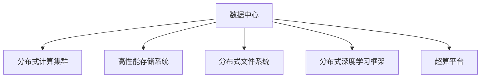

                 

# AI 大模型应用数据中心建设：数据中心技术创新

## 1. 背景介绍

在人工智能(AI)领域，尤其是深度学习技术方面，大模型的应用变得越来越普遍。这些大模型，如GPT-3、BERT等，以自回归或自编码的方式进行预训练，并在大规模无标签文本数据上学习通用语言知识。这些模型的参数量往往达到数十亿级别，因此对数据中心的技术架构和运维提出了极高的要求。数据中心不仅要提供足够强大的计算和存储资源，还需要高效可靠地支持这些大模型的训练和推理任务。本文将深入探讨数据中心在支持AI大模型应用方面的技术创新，以及未来发展的方向和面临的挑战。

### 1.1 问题由来

随着AI技术的迅猛发展，尤其是深度学习和大模型技术的进步，对数据中心的技术架构和运维能力提出了新的要求。传统的服务器、存储和网络基础设施已难以满足大模型训练和推理的需求。如何构建高效、灵活、可扩展的数据中心，以支持AI大模型的应用，成为了一个重要的研究课题。

### 1.2 问题核心关键点

大模型应用对数据中心的技术创新主要集中在以下几个方面：

- **计算资源需求**：大模型参数量庞大，需要强大的计算资源进行训练和推理。
- **存储需求**：模型训练和推理过程中涉及大量数据，需要高性能存储系统支持。
- **网络带宽**：大模型训练和推理需要大量数据传输，网络带宽成为瓶颈。
- **能效优化**：大模型训练和推理能耗高，数据中心的能效管理成为挑战。
- **软件堆栈**：大模型的开发、训练和部署需要配套的软件生态支持。

## 2. 核心概念与联系

### 2.1 核心概念概述

为了更好地理解数据中心在支持AI大模型应用方面的技术创新，我们将介绍几个核心概念：

- **数据中心(DC)**：提供计算、存储、网络等资源的物理场所，是支持AI大模型应用的基础设施。
- **分布式计算集群**：由多个计算节点组成，通过网络互联，共同完成大模型的训练和推理任务。
- **高性能存储系统**：支持大模型训练和推理所需的数据存储、传输和管理。
- **分布式文件系统**：如Hadoop Distributed File System (HDFS)，用于分布式存储和数据共享。
- **分布式深度学习框架**：如TensorFlow、PyTorch等，支持大模型的分布式训练和推理。
- **超算平台**：集成了计算、存储、网络等资源，支持大规模、高并发的计算任务。

这些核心概念之间的逻辑关系可以通过以下Mermaid流程图来展示：



这个流程图展示了大模型应用的数据中心基础设施的各个组成部分及其之间的联系：

1. 数据中心提供计算、存储和网络资源。
2. 分布式计算集群通过网络互联，协同完成大模型的训练和推理任务。
3. 高性能存储系统支持大模型训练和推理所需的数据存储和管理。
4. 分布式文件系统实现数据在集群中的分布式存储和共享。
5. 分布式深度学习框架提供大模型的分布式训练和推理支持。
6. 超算平台集成资源，支持大规模、高并发的计算任务。

这些组件协同工作，共同支撑大模型的应用。

## 3. 核心算法原理 & 具体操作步骤

### 3.1 算法原理概述

在数据中心支持大模型的应用中，计算资源和存储资源的优化是关键。为了高效利用计算和存储资源，数据中心引入了分布式计算和存储技术。

在大模型的训练和推理过程中，需要大量计算资源和存储空间。传统的集中式计算和存储架构难以满足需求。分布式计算集群通过并行计算和数据分片，显著提高了计算和存储资源的利用率。高性能存储系统通过RAID、分布式存储、内存计算等技术，提高了数据传输和处理的效率。

### 3.2 算法步骤详解

数据中心支持大模型应用的技术创新主要包括以下几个关键步骤：

**Step 1: 构建分布式计算集群**

- 选择合适的硬件设备，如CPU、GPU、TPU等。
- 设计集群拓扑结构，如环网、树形、网格等。
- 安装和配置集群管理系统，如Kubernetes、Mesos等。
- 配置网络交换机，确保网络通信的稳定和高效。

**Step 2: 部署高性能存储系统**

- 选择合适的存储设备，如SSD、NVMe、HDD等。
- 设计存储架构，如对象存储、分布式文件系统等。
- 部署存储管理系统，如Ceph、Hadoop等。
- 配置存储设备和网络，确保数据的高可靠性和高性能。

**Step 3: 实现分布式深度学习框架**

- 选择合适的深度学习框架，如TensorFlow、PyTorch等。
- 在集群上部署框架，确保各节点之间的数据同步和通信。
- 优化框架性能，如使用GPU加速、分布式训练等。

**Step 4: 优化超算平台**

- 构建超算平台，集成计算、存储和网络资源。
- 优化资源调度，确保任务的高效执行。
- 引入能效管理策略，降低计算和存储的能耗。

### 3.3 算法优缺点

分布式计算和存储技术在支持大模型应用方面具有以下优点：

1. 高效利用资源。分布式计算和存储技术充分利用集群中的计算和存储资源，提高资源利用率。
2. 灵活性高。分布式架构可以根据任务需求动态调整计算和存储资源，支持不同规模和类型的任务。
3. 可扩展性强。分布式架构可以轻松扩展计算和存储资源，支持大模型训练和推理任务。

但同时，分布式架构也存在一些缺点：

1. 复杂度高。分布式架构需要精心设计和维护，复杂度较高。
2. 通信开销大。分布式计算需要大量的网络通信，可能导致性能瓶颈。
3. 数据一致性问题。分布式存储需要保证数据的一致性和完整性，存在一定的复杂性。

### 3.4 算法应用领域

大模型应用对数据中心的技术创新不仅限于计算和存储资源，还涉及软件生态、能效管理等多个方面。以下是几个典型的应用领域：

- **科学研究**：在气象预测、基因组学、天文学等领域，大模型帮助科学家处理大规模数据集，进行复杂计算。
- **金融科技**：在大数据、高频交易、风险管理等领域，大模型帮助金融机构进行智能分析和决策。
- **自动驾驶**：在大数据、传感器融合、实时计算等领域，大模型帮助自动驾驶汽车进行环境和决策预测。
- **医疗健康**：在基因组学、医学影像、药物研发等领域，大模型帮助医疗行业进行智能诊断和治疗。
- **智慧城市**：在交通管理、环境监测、灾害预警等领域，大模型帮助城市管理智能化、高效化。

## 4. 数学模型和公式 & 详细讲解 & 举例说明

### 4.1 数学模型构建

在本节中，我们将使用数学语言对数据中心支持大模型应用的过程进行更加严格的刻画。

假设数据中心中有N个计算节点，每个节点有C个CPU核心和G个GPU卡，每个节点的计算能力为 $C \times G$。设每个节点到存储设备的带宽为B，集群中总共有M个存储节点。

定义计算资源利用率为 $\eta$，存储资源利用率为 $\sigma$，集群总计算能力为 $N \times C \times G$，总存储容量为 $M \times S$。其中 $S$ 为每个存储节点的存储容量。

### 4.2 公式推导过程

设大模型的训练需要 $T$ 个计算周期，每个计算周期需要 $P$ 的计算资源。设每个节点的计算速度为 $v$，则集群的总计算时间为 $T/N \times C/G = \frac{PT}{vN}$。

设大模型的训练需要 $D$ 个数据分片，每个数据分片的传输速度为 $s$，则集群的总数据传输时间为 $T/M \times B \times D = \frac{BDT}{M}$。

为了优化计算和存储资源的利用率，需要最大化计算和存储资源的利用率，同时最小化计算和存储资源的使用时间。因此，我们的优化目标可以表示为：

$$
\max \eta \times \sigma
$$

其中：

$$
\eta = \frac{PT}{vN}
$$

$$
\sigma = \frac{D \times M \times s}{M \times S}
$$

### 4.3 案例分析与讲解

假设集群中有10个计算节点，每个节点有8个CPU核心和4个GPU卡，每个节点的计算速度为1GHz。集群中总共有8个存储节点，每个存储节点的存储容量为2TB。每个数据分片的传输速度为1GB/s，训练需要10个计算周期，每个计算周期需要100个计算资源。

计算资源的利用率为：

$$
\eta = \frac{100 \times 10}{1 \times 10} = 10
$$

存储资源的利用率为：

$$
\sigma = \frac{10 \times 8 \times 1}{2 \times 8} = 1
$$

优化目标为：

$$
\max 10 \times 1 = 10
$$

为了最大化利用率和最小化使用时间，需要调整计算和存储资源的分配策略。例如，可以将部分计算任务分配到更高效的节点上，同时优化数据传输路径，提高传输速度。

## 5. 项目实践：代码实例和详细解释说明

### 5.1 开发环境搭建

在进行数据中心支持大模型应用的技术创新实践前，我们需要准备好开发环境。以下是使用Python进行PyTorch开发的环境配置流程：

1. 安装Anaconda：从官网下载并安装Anaconda，用于创建独立的Python环境。

2. 创建并激活虚拟环境：
```bash
conda create -n pytorch-env python=3.8 
conda activate pytorch-env
```

3. 安装PyTorch：根据CUDA版本，从官网获取对应的安装命令。例如：
```bash
conda install pytorch torchvision torchaudio cudatoolkit=11.1 -c pytorch -c conda-forge
```

4. 安装分布式深度学习框架：
```bash
pip install torch.distributed --index-url https://pypi.anaconda.org/torch/torch
```

5. 安装高性能存储系统：
```bash
pip install hdfs ceph
```

完成上述步骤后，即可在`pytorch-env`环境中开始开发实践。

### 5.2 源代码详细实现

下面我们以TensorFlow集群支持大模型应用为例，给出完整的开发代码实现。

首先，在主节点上安装TensorFlow和其他必要的库：

```bash
pip install tensorflow kubernetes kubernetes-client
```

然后，在主节点上部署Kubernetes集群，并在各个节点上部署TensorFlow：

```bash
kubectl apply -f deployment.yaml
kubectl apply -f service.yaml
```

其中，`deployment.yaml`和`service.yaml`是定义Kubernetes服务的配置文件。

接着，编写TensorFlow的分布式训练脚本：

```python
import tensorflow as tf
import tensorflow.distribute as tfd

def model_fn(features, labels):
    # 构建模型
    features = tf.cast(features['input'], tf.float32)
    net = tf.keras.Sequential([
        tf.keras.layers.Dense(64, activation='relu'),
        tf.keras.layers.Dense(10, activation='softmax')
    ])
    logits = net(features)
    loss = tf.losses.sparse_categorical_crossentropy(labels, logits)
    return tfd.DistributionLossModel(loss)

# 构建分布式计算策略
strategy = tfd.distribute.experimental.ParameterServerStrategy(
    cluster_resolver=tf.distribute.cluster_resolver.TFConfigClusterResolver(),
    variable_partitioner=tf.distribute.experimental.ParameterServerPartitioner(
        num_shards_per_worker=1,
        total_num_shards=4
    )
)

# 构建分布式训练函数
@tf.function
def train_step(iterator, model):
    for batch in iterator:
        features, labels = batch
        with tf.GradientTape() as tape:
            logits = model(features)
            loss = tf.losses.sparse_categorical_crossentropy(labels, logits)
        gradients = tape.gradient(loss, model.trainable_variables)
        optimizer.apply_gradients(zip(gradients, model.trainable_variables))

# 启动分布式训练
strategy.run(train_step, args=(next(iterator), model))

# 启动分布式训练
strategy.experimental_distribute_variables_from_model(model)
```

最后，启动分布式训练：

```bash
python train.py
```

### 5.3 代码解读与分析

让我们再详细解读一下关键代码的实现细节：

**模型定义**：
```python
def model_fn(features, labels):
    # 构建模型
    features = tf.cast(features['input'], tf.float32)
    net = tf.keras.Sequential([
        tf.keras.layers.Dense(64, activation='relu'),
        tf.keras.layers.Dense(10, activation='softmax')
    ])
    logits = net(features)
    loss = tf.losses.sparse_categorical_crossentropy(labels, logits)
    return tfd.DistributionLossModel(loss)
```

**分布式计算策略**：
```python
strategy = tfd.distribute.experimental.ParameterServerStrategy(
    cluster_resolver=tf.distribute.cluster_resolver.TFConfigClusterResolver(),
    variable_partitioner=tf.distribute.experimental.ParameterServerPartitioner(
        num_shards_per_worker=1,
        total_num_shards=4
    )
)
```

**分布式训练函数**：
```python
@tf.function
def train_step(iterator, model):
    for batch in iterator:
        features, labels = batch
        with tf.GradientTape() as tape:
            logits = model(features)
            loss = tf.losses.sparse_categorical_crossentropy(labels, logits)
        gradients = tape.gradient(loss, model.trainable_variables)
        optimizer.apply_gradients(zip(gradients, model.trainable_variables))
```

**分布式训练启动**：
```python
strategy.run(train_step, args=(next(iterator), model))
strategy.experimental_distribute_variables_from_model(model)
```

可以看到，使用TensorFlow和Kubernetes实现分布式计算集群和存储系统的高效利用，需要对模型、计算策略和分布式训练过程进行精心设计。

## 6. 实际应用场景

### 6.1 科学研究

在科学研究中，大模型帮助科学家处理大规模数据集，进行复杂计算。例如，气象预测模型通过训练大量的气象数据，能够预测未来的天气变化。天文学模型通过分析星体数据，能够发现新的行星和恒星。

### 6.2 金融科技

在大数据、高频交易、风险管理等领域，大模型帮助金融机构进行智能分析和决策。例如，风险评估模型通过分析历史交易数据，能够预测金融市场的波动和风险。高频交易模型通过分析市场数据，能够自动执行交易决策。

### 6.3 自动驾驶

在大数据、传感器融合、实时计算等领域，大模型帮助自动驾驶汽车进行环境和决策预测。例如，环境感知模型通过分析摄像头、雷达和激光雷达的数据，能够预测周围环境的变化。决策模型通过分析环境数据和历史驾驶数据，能够制定最佳的驾驶策略。

### 6.4 医疗健康

在基因组学、医学影像、药物研发等领域，大模型帮助医疗行业进行智能诊断和治疗。例如，基因组学模型通过分析基因数据，能够预测疾病的风险。医学影像模型通过分析医学影像数据，能够识别异常区域。

### 6.5 智慧城市

在交通管理、环境监测、灾害预警等领域，大模型帮助城市管理智能化、高效化。例如，交通管理模型通过分析交通数据，能够预测交通流量和拥堵情况。环境监测模型通过分析空气和水质数据，能够预警环境污染。

## 7. 工具和资源推荐

### 7.1 学习资源推荐

为了帮助开发者系统掌握数据中心支持AI大模型应用的理论基础和实践技巧，这里推荐一些优质的学习资源：

1. TensorFlow官方文档：包含TensorFlow和Kubernetes的详细介绍和示例代码。
2. PyTorch官方文档：包含PyTorch和分布式深度学习框架的详细介绍和示例代码。
3. Hadoop官方文档：包含HDFS和Ceph的详细介绍和示例代码。
4. Kubernetes官方文档：包含Kubernetes的详细介绍和示例代码。
5. AI大模型技术白皮书：由AI大模型技术专家撰写，全面介绍AI大模型的发展历程和应用前景。

通过对这些资源的学习实践，相信你一定能够快速掌握数据中心支持AI大模型的精髓，并用于解决实际的NLP问题。

### 7.2 开发工具推荐

高效的开发离不开优秀的工具支持。以下是几款用于数据中心支持AI大模型应用开发的常用工具：

1. TensorFlow：基于Python的开源深度学习框架，灵活动态的计算图，适合快速迭代研究。大部分预训练语言模型都有TensorFlow版本的实现。
2. PyTorch：基于Python的开源深度学习框架，灵活易用，支持分布式计算和深度学习模型开发。
3. Kubernetes：开源容器编排平台，支持分布式计算集群的管理和调度。
4. HDFS：分布式文件系统，支持大规模数据存储和管理。
5. Ceph：分布式存储系统，支持高性能数据存储和传输。
6. Google Cloud Platform（GCP）：提供高性能计算和存储资源，支持分布式深度学习框架和应用开发。

合理利用这些工具，可以显著提升数据中心支持AI大模型应用的开发效率，加快创新迭代的步伐。

### 7.3 相关论文推荐

大语言模型和数据中心技术的发展源于学界的持续研究。以下是几篇奠基性的相关论文，推荐阅读：

1. Distributed Deep Learning with TensorFlow（TensorFlow论文）：介绍TensorFlow在大模型分布式计算中的应用。
2. Parameter Server Design and Implementation for Distributed Machine Learning（PS论文）：介绍Parameter Server策略在大模型分布式计算中的应用。
3. HDFS: A Distributed File System（HDFS论文）：介绍HDFS的分布式文件系统架构。
4. Ceph: A Scalable High-Performance Storage System（Ceph论文）：介绍Ceph的分布式存储系统架构。
5. Kubernetes: Container Orchestration for Compute（Kubernetes论文）：介绍Kubernetes的容器编排和调度。

这些论文代表了大语言模型和大模型应用数据中心技术的发展脉络。通过学习这些前沿成果，可以帮助研究者把握学科前进方向，激发更多的创新灵感。

## 8. 总结：未来发展趋势与挑战

### 8.1 总结

本文对数据中心支持AI大模型应用的技术创新进行了全面系统的介绍。首先阐述了AI大模型应用对数据中心技术架构和运维能力的要求，明确了分布式计算和存储技术在大模型训练和推理中的重要性。其次，从原理到实践，详细讲解了分布式计算和存储技术的算法原理和具体操作步骤，给出了分布式深度学习框架的代码实例。同时，本文还广泛探讨了数据中心支持AI大模型应用在科学研究、金融科技、自动驾驶、医疗健康、智慧城市等多个行业领域的应用前景，展示了数据中心技术创新的广阔前景。

通过本文的系统梳理，可以看到，数据中心支持AI大模型应用的技术创新为AI大模型的落地应用提供了坚实的技术基础，极大地拓展了AI技术的应用边界，催生了更多的落地场景。未来，伴随分布式计算和存储技术的进一步演进，相信AI大模型将会在更广泛的领域大放异彩，深刻影响人类的生产生活方式。

### 8.2 未来发展趋势

展望未来，数据中心支持AI大模型应用的技术创新将呈现以下几个发展趋势：

1. 分布式计算集群和存储系统将进一步优化，提高资源利用率和数据传输速度。
2. 边缘计算和移动计算将逐步引入，提升数据中心边缘的计算和存储能力。
3. 超大规模计算和存储资源的需求将进一步增长，数据中心架构将更加灵活可扩展。
4. 能效管理技术将进一步提升，降低计算和存储的能耗。
5. 智能运维和自动化管理将进一步发展，提高数据中心的管理效率。

以上趋势凸显了数据中心支持AI大模型应用的广阔前景。这些方向的探索发展，必将进一步提升AI大模型的性能和应用范围，为人类认知智能的进化带来深远影响。

### 8.3 面临的挑战

尽管数据中心支持AI大模型应用的技术创新已经取得了显著成果，但在迈向更加智能化、普适化应用的过程中，仍面临诸多挑战：

1. 硬件资源瓶颈。当前高性能计算和存储资源依然昂贵，大规模部署数据中心需要大量投资。
2. 数据传输瓶颈。大模型训练和推理需要大量数据传输，网络带宽和存储系统成为瓶颈。
3. 能效管理挑战。大模型训练和推理能耗高，数据中心的能效管理成为重要挑战。
4. 软件生态不完善。大模型应用需要配套的软件生态支持，现有的软件生态仍需进一步完善。
5. 安全和隐私问题。大规模数据集的处理和存储带来了安全和隐私问题，需要加强保护措施。

### 8.4 研究展望

面对数据中心支持AI大模型应用所面临的种种挑战，未来的研究需要在以下几个方面寻求新的突破：

1. 硬件加速技术。引入GPU、TPU等硬件加速技术，提升计算和存储资源的性能。
2. 网络优化技术。优化网络传输协议和数据存储策略，提高数据传输速度和效率。
3. 能效管理技术。引入能效管理和优化技术，降低计算和存储的能耗。
4. 软件生态完善。开发配套的软件生态，支持大模型的分布式训练和推理。
5. 安全和隐私保护。引入安全保护措施，保护大模型应用的数据安全和隐私。

这些研究方向将进一步推动数据中心支持AI大模型应用的创新发展，提升AI大模型的性能和应用范围，为构建安全、可靠、可解释、可控的智能系统铺平道路。

## 9. 附录：常见问题与解答

**Q1: 什么是分布式计算集群和分布式存储系统？**

A: 分布式计算集群是由多个计算节点组成，通过网络互联，共同完成大规模计算任务的集群系统。每个节点可以独立处理任务，同时通过网络通信协作完成复杂任务。分布式存储系统是将数据分散存储在多个节点上，通过网络访问数据的系统。每个节点负责一部分数据的存储和管理。

**Q2: 分布式计算集群和分布式存储系统相比传统集群和存储系统有哪些优势？**

A: 分布式计算集群和分布式存储系统相比传统集群和存储系统具有以下优势：

1. 可扩展性强。分布式集群和存储系统可以轻松扩展计算和存储资源，支持大规模和高并发的计算任务。
2. 资源利用率高。分布式集群和存储系统充分利用集群中的计算和存储资源，提高资源利用率。
3. 容错性高。分布式集群和存储系统通过冗余设计和故障转移机制，提高系统的容错性。

**Q3: 如何使用分布式深度学习框架支持大模型应用？**

A: 使用分布式深度学习框架支持大模型应用，可以按照以下步骤：

1. 安装分布式深度学习框架，如TensorFlow、PyTorch等。
2. 部署计算节点，安装计算资源。
3. 部署存储节点，配置存储资源。
4. 编写分布式计算脚本，定义计算策略和训练函数。
5. 启动分布式训练，配置参数和资源。

**Q4: 如何优化分布式计算和存储资源？**

A: 优化分布式计算和存储资源，可以采取以下措施：

1. 调整计算和存储资源的分配策略，充分利用集群中的资源。
2. 使用硬件加速技术，如GPU、TPU等，提升计算和存储性能。
3. 优化网络传输协议和数据存储策略，提高数据传输速度和效率。
4. 引入能效管理和优化技术，降低计算和存储的能耗。

这些措施可以帮助提升分布式计算和存储系统的性能和效率，支持大规模AI大模型的训练和推理。

**Q5: 如何保证分布式计算和存储系统的数据一致性和完整性？**

A: 保证分布式计算和存储系统的数据一致性和完整性，可以采取以下措施：

1. 引入冗余设计和故障转移机制，确保数据的可靠性。
2. 采用分布式文件系统，如HDFS，实现数据的分散存储和一致性维护。
3. 使用分布式数据库系统，如HBase、Cassandra等，实现数据的分布式管理和一致性维护。

这些措施可以帮助提升分布式计算和存储系统的数据一致性和完整性，确保数据的安全和可靠性。

---

作者：禅与计算机程序设计艺术 / Zen and the Art of Computer Programming

