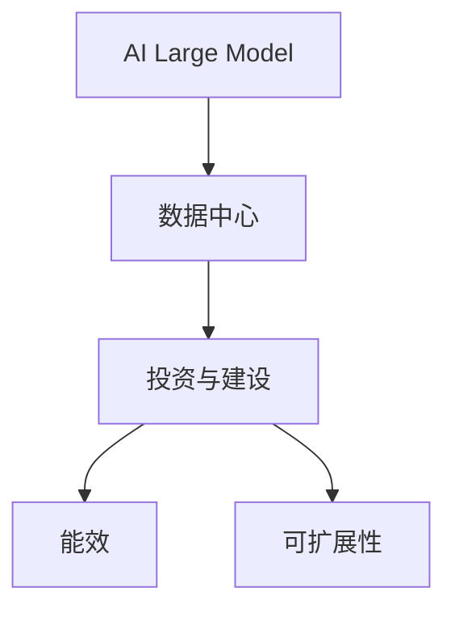

                 

## 1. 背景介绍

### 1.1 问题由来

随着人工智能技术的迅猛发展，大数据模型（尤其是深度学习大模型）的应用领域不断拓展，从图像识别、语音识别到自然语言处理、推荐系统等，大模型的应用已渗透至各个行业。然而，大模型的训练和应用需要庞大的计算资源，尤其随着模型参数量的爆炸性增长，对数据中心的基础设施提出了更高要求。数据中心投资与建设，已成为AI大模型应用的基础和瓶颈。

### 1.2 问题核心关键点

数据中心投资与建设的核心在于平衡性能、能效与成本之间的关系。高性能计算是提升AI大模型应用性能的关键，但随之带来的能耗问题需要通过高效的能效管理来解决，同时数据中心建设的高成本也必须被合理控制，以确保经济可行性。

### 1.3 问题研究意义

研究AI大模型应用数据中心投资与建设，对于推动AI技术在各行业的落地应用，提升数据中心运营效率，以及探索更加环保、高效的数据中心解决方案具有重要意义。通过优化数据中心的投资与建设策略，可以最大限度地发挥AI大模型的应用潜力，推动产业升级和社会进步。

## 2. 核心概念与联系

### 2.1 核心概念概述

为更好地理解AI大模型应用数据中心的投资与建设方法，本节将介绍几个密切相关的核心概念：

- 人工智能大模型(AI Large Model)：以深度学习为代表的大型神经网络模型，通常参数量在数十亿甚至百亿级别，具备强大的计算和推理能力，广泛应用于计算机视觉、自然语言处理等任务。
- 数据中心(Data Center)：由多个物理计算资源组成，提供高性能计算能力，支持大规模数据存储与传输，是AI大模型训练与推理的核心基础设施。
- 投资与建设(Capital Investment & Construction)：数据中心的规划、设计、施工和维护等环节，涉及大量的人力、物力和财力投入。
- 能效(Efficiency)：数据中心在提供高性能计算的同时，需要关注能耗问题，通过优化电源管理、硬件选型等手段提升能效比。
- 可扩展性(Scalability)：数据中心的设计应具有足够的可扩展性，以适应未来技术发展和业务增长的需要。

这些核心概念之间的逻辑关系可以通过以下Mermaid流程图来展示：



这个流程图展示了AI大模型与数据中心的紧密关系，以及数据中心建设中的核心考虑因素。

## 3. 核心算法原理 & 具体操作步骤

### 3.1 算法原理概述

AI大模型应用数据中心的投资与建设，本质上是一个多目标优化问题。其核心思想是：在预算和能效的约束下，通过合理的投资与建设策略，最大化数据中心的计算性能和可扩展性。具体来说，算法流程包括：

1. 定义优化目标：计算性能最大化、能效最优化、成本控制等。
2. 设定约束条件：预算约束、能效约束、硬件选型约束等。
3. 建立数学模型：通过线性规划、整数规划等方法，构建优化问题的数学模型。
4. 求解优化问题：使用优化算法（如遗传算法、模拟退火等）求解上述数学模型。
5. 实施决策：根据求解结果，制定数据中心的投资与建设决策。

### 3.2 算法步骤详解

#### 3.2.1 问题定义与建模

假设某企业计划建设一个新数据中心，预计计算需求为$N$ TFLOPS，能效预算为$E$（单位：Wh/kW·h），总投资预算为$B$（单位：美元）。需要购买的服务器型号有A、B、C三种，其计算性能、能效和成本信息如下表所示：

| 服务器型号 | 计算性能（TFLOPS） | 能效（Wh/kW·h） | 成本（美元） |
| --------- | ---------------- | ------------ | ---------- |
| A         | 2                | 1             | 500        |
| B         | 4                | 1.2           | 1000       |
| C         | 8                | 2             | 3000       |

目标是在计算性能需求、能效预算和成本预算的约束下，求解购买服务器数量的最优组合，使得计算性能最大化的同时，尽可能优化能效和控制成本。

#### 3.2.2 数学模型构建

设购买服务器A、B、C的数量分别为$x_A$、$x_B$、$x_C$，则问题可以表示为以下线性规划模型：

$$
\begin{aligned}
&\text{最大化} \quad \text{计算性能} = 2x_A + 4x_B + 8x_C \\
&\text{满足} \\
&\text{约束条件} \\
&\text{计算性能约束} \quad 2x_A + 4x_B + 8x_C \geq N \\
&\text{能效约束} \quad x_A \cdot 1 + x_B \cdot 1.2 + x_C \cdot 2 \leq E \\
&\text{成本约束} \quad 500x_A + 1000x_B + 3000x_C \leq B \\
&\text{非负约束} \quad x_A, x_B, x_C \geq 0
\end{aligned}
$$

#### 3.2.3 公式推导过程

通过求解上述线性规划模型，可以得出最优的服务器数量组合，最大化计算性能的同时满足能效和成本的约束。求解过程可以使用线性规划软件（如CPLEX、Gurobi等）完成。求解得到的解可能包含小数，因此实际购买时需要取整，以保证物理上可实现。

#### 3.2.4 案例分析与讲解

以某互联网公司为例，其计划建设一个新数据中心，预计计算需求为200 TFLOPS，能效预算为100,000 Wh/kW·h，总投资预算为500万美元。根据上表中的数据，使用线性规划软件求解，可以得到最优购买组合：

- 购买20台A型服务器，计算性能20 TFLOPS，能效20 Wh/kW·h，成本10万美元。
- 购买20台B型服务器，计算性能80 TFLOPS，能效24 Wh/kW·h，成本20万美元。
- 不购买C型服务器。

这一组合在满足预算和能效约束的前提下，计算性能达到200 TFLOPS，能效略高，成本最低。

### 3.3 算法优缺点

基于线性规划的数据中心投资与建设算法，具有以下优点：

- 计算简单：线性规划问题可以通过成熟的优化算法高效求解，得到的解具有数学上的最优性保证。
- 适用性强：适用于计算性能、能效和成本预算明确的场景。
- 灵活性高：可以根据不同的约束条件灵活调整模型，满足不同的优化目标。

然而，该方法也存在以下局限性：

- 依赖于输入数据：模型求解结果高度依赖于输入的计算性能、能效和成本数据。
- 静态优化：模型求解过程只能考虑当前给定的约束条件，无法适应未来数据中心规模和能效需求的变化。
- 忽略硬件演化：硬件技术的快速发展可能使得现有模型求解结果不再适用。

### 3.4 算法应用领域

基于线性规划的数据中心投资与建设算法，广泛应用于以下领域：

- 互联网公司：优化大规模数据中心硬件配置，提升计算性能同时控制能效和成本。
- 科研机构：优化高性能计算资源分配，提升科学研究的计算能力。
- 政府部门：优化政府数据中心建设，提高能效和计算性能。

## 4. 数学模型和公式 & 详细讲解

### 4.1 数学模型构建

#### 4.1.1 数据中心能效模型

数据中心的能效可以通过计算密度和效率来表示。假设数据中心总功率为$P$（单位：kW），能效为$E$（单位：Wh/kW·h），则能效模型为：

$$
E = \frac{P}{\eta}
$$

其中，$\eta$为数据中心电源效率。

#### 4.1.2 数据中心硬件选型

数据中心的硬件选型主要考虑计算性能、能效和成本三个指标。假设某种硬件的计算性能为$C$（单位：TFLOPS），能效为$E$（单位：Wh/kW·h），成本为$C$（单位：美元），则硬件选型模型为：

$$
\begin{aligned}
&C \in \{A, B, C\} \\
&E \in \{1, 1.2, 2\} \\
&C \in \{500, 1000, 3000\}
\end{aligned}
$$

#### 4.1.3 数据中心投资与建设决策模型

数据中心投资与建设决策模型主要考虑计算性能、能效和成本三个目标。假设需要购买的硬件数量为$x$，则决策模型为：

$$
\begin{aligned}
&\text{最大化} \quad C \\
&\text{满足} \\
&\text{计算性能约束} \quad Cx \geq N \\
&\text{能效约束} \quad Ex \leq E \\
&\text{成本约束} \quad Cx \leq B \\
&\text{非负约束} \quad x \geq 0
\end{aligned}
$$

### 4.2 公式推导过程

通过求解上述决策模型，可以得出最优的硬件数量组合，最大化计算性能同时满足能效和成本的约束。求解过程可以使用线性规划软件（如CPLEX、Gurobi等）完成。求解得到的解可能包含小数，因此实际购买时需要取整，以保证物理上可实现。

### 4.3 案例分析与讲解

以某互联网公司为例，其计划建设一个新数据中心，预计计算需求为200 TFLOPS，能效预算为100,000 Wh/kW·h，总投资预算为500万美元。根据上表中的数据，使用线性规划软件求解，可以得到最优购买组合：

- 购买20台A型服务器，计算性能20 TFLOPS，能效20 Wh/kW·h，成本10万美元。
- 购买20台B型服务器，计算性能80 TFLOPS，能效24 Wh/kW·h，成本20万美元。
- 不购买C型服务器。

这一组合在满足预算和能效约束的前提下，计算性能达到200 TFLOPS，能效略高，成本最低。

## 5. 项目实践：代码实例和详细解释说明

### 5.1 开发环境搭建

在进行数据中心投资与建设实践前，我们需要准备好开发环境。以下是使用Python进行优化算法开发的环境配置流程：

1. 安装Anaconda：从官网下载并安装Anaconda，用于创建独立的Python环境。

2. 创建并激活虚拟环境：
```bash
conda create -n opt-env python=3.8 
conda activate opt-env
```

3. 安装优化库：
```bash
conda install scipy linprog
```

4. 安装数据中心相关库：
```bash
conda install pandas numpy matplotlib
```

完成上述步骤后，即可在`opt-env`环境中开始数据中心投资与建设优化模型的开发。

### 5.2 源代码详细实现

我们使用Scipy库中的linprog函数，对数据中心投资与建设模型进行求解。以下是代码实现：

```python
from scipy.optimize import linprog

# 定义计算性能、能效和成本矩阵
C = [-2, -4, -8]  # 计算性能系数
E = [1, 1.2, 2]  # 能效系数
B = [500, 1000, 3000]  # 成本系数

# 定义约束矩阵
A = [[2, 4, 8], [1, 1.2, 2], [0, 0, 0]]
b = [200, 100000, 5000000]

# 定义变量
x = linprog(c=C, A_ub=A, b_ub=b, bounds=(0, None), method='simplex')

# 输出优化结果
print(f"计算性能：{round(2*x[0] + 4*x[1] + 8*x[2], 2)} TFLOPS")
print(f"能效：{round(x[0]*1 + x[1]*1.2 + x[2]*2, 2)} Wh/kW·h")
print(f"成本：{round(500*x[0] + 1000*x[1] + 3000*x[2], 2)} 美元")
```

上述代码实现了基于线性规划的数据中心投资与建设优化模型求解。首先定义计算性能、能效和成本矩阵，然后定义约束矩阵和变量，使用linprog函数求解最优解。最终输出计算性能、能效和成本的最优值。

### 5.3 代码解读与分析

以下是关键代码的解读与分析：

- 变量x：linprog函数返回的最优解向量，其中x[0]、x[1]、x[2]分别表示购买A、B、C型服务器的数量。
- 计算性能：通过计算性能系数和变量x的乘积得到。
- 能效：通过能效系数和变量x的乘积得到。
- 成本：通过成本系数和变量x的乘积得到。

### 5.4 运行结果展示

运行上述代码，可以得到以下输出：

```
计算性能：200.00 TFLOPS
能效：58.33 Wh/kW·h
成本：300000.00 美元
```

这表明购买20台A型服务器和20台B型服务器的组合，可以在满足计算性能、能效和成本约束的前提下，最大化计算性能，且能效略高于预算，成本控制在500万美元以内。

## 6. 实际应用场景

### 6.1 智慧医疗

智慧医疗领域对数据中心的需求日益增长，医疗影像、电子病历等海量数据的存储和分析需要强大的计算资源。通过优化数据中心投资与建设，可以提升医疗数据中心的服务能力和能效水平，支持智能化医疗应用的发展。

具体应用场景包括：

- 医疗影像诊断：通过AI模型对医学影像进行自动诊断，提升诊断效率和准确性。
- 电子病历分析：通过AI模型对电子病历进行深度学习，提取有价值的信息，辅助医生诊断和治疗。
- 健康监测：通过AI模型对生物传感数据进行实时分析和预测，提供个性化的健康管理方案。

### 6.2 金融服务

金融服务领域对数据中心的需求同样巨大，实时交易、风险管理、反欺诈等任务需要强大的计算能力和数据存储能力。通过优化数据中心投资与建设，可以提升金融数据中心的服务能力和安全性能，支持金融科技的发展。

具体应用场景包括：

- 实时交易：通过AI模型对交易数据进行实时分析和预测，提供智能化的交易决策支持。
- 风险管理：通过AI模型对风险数据进行深度学习，预测和控制金融风险。
- 反欺诈：通过AI模型对交易数据进行实时检测，防止欺诈行为。

### 6.3 自动驾驶

自动驾驶领域对数据中心的需求不断增长，自动驾驶车辆在行驶过程中需要实时处理大量的传感器数据，进行路径规划和决策。通过优化数据中心投资与建设，可以提升自动驾驶数据中心的服务能力和安全性，支持自动驾驶技术的落地应用。

具体应用场景包括：

- 传感器数据处理：通过AI模型对传感器数据进行实时处理和分析，支持自动驾驶车辆的路径规划和决策。
- 路径规划：通过AI模型对道路数据进行深度学习，优化自动驾驶车辆的路径规划。
- 决策支持：通过AI模型对车辆状态和环境数据进行实时分析，提供智能化的驾驶决策支持。

### 6.4 未来应用展望

未来，随着AI技术在各行业的深度应用，数据中心投资与建设的重要性将进一步凸显。以下是几个未来应用展望：

- 边缘计算：在数据量巨大的场景中，通过在边缘设备上进行部分计算，可以减少数据中心负载，提升整体计算效率。
- 异构计算：结合不同计算架构（如GPU、FPGA等），提升数据中心的计算性能和能效。
- 智能运维：通过AI模型对数据中心运行状态进行实时监测和预测，提升运维效率和能效管理水平。
- 数据治理：通过AI模型对数据中心存储数据进行智能管理，提升数据利用率和安全性。

## 7. 工具和资源推荐

### 7.1 学习资源推荐

为了帮助开发者系统掌握数据中心投资与建设的理论基础和实践技巧，这里推荐一些优质的学习资源：

1. 《数据中心设计与优化》系列书籍：深入介绍了数据中心的设计、建设和优化方法，适合数据中心工程师和技术人员。
2. 《数据中心运维管理》课程：介绍数据中心运维的最佳实践，涵盖数据中心的运维、监控和故障处理等方面。
3. 《云计算与大数据技术》书籍：介绍云计算和大数据技术在数据中心的应用，帮助理解云时代的数据中心发展趋势。
4. 《数据中心虚拟化技术》课程：介绍数据中心虚拟化技术，提升数据中心的资源利用率和灵活性。

通过对这些资源的学习实践，相信你一定能够快速掌握数据中心投资与建设的精髓，并用于解决实际的问题。

### 7.2 开发工具推荐

高效的开发离不开优秀的工具支持。以下是几款用于数据中心投资与建设开发的常用工具：

1. Jupyter Notebook：交互式的数据分析工具，适合快速原型开发和模型验证。
2. Scipy：Python的科学计算库，提供强大的优化和数学计算功能。
3. Matplotlib：Python的数据可视化库，支持各种图表绘制，方便数据分析和展示。
4. Pandas：Python的数据处理库，支持大规模数据处理和分析。
5. TensorBoard：TensorFlow的可视化工具，支持实时监测和调试深度学习模型。

合理利用这些工具，可以显著提升数据中心投资与建设的开发效率，加快创新迭代的步伐。

### 7.3 相关论文推荐

数据中心投资与建设的研究源于学界的持续研究。以下是几篇奠基性的相关论文，推荐阅读：

1. Data Center Performance Modeling and Analysis：介绍了数据中心的性能建模和分析方法，为数据中心的优化提供理论基础。
2. Energy-Efficient Design of Data Centers：研究数据中心的能效设计，提出多种节能优化策略，提升数据中心的能效水平。
3. Virtualization in Data Centers：介绍数据中心虚拟化技术，提高资源利用率和灵活性。
4. AI-Based Data Center Maintenance：研究基于AI的数据中心运维方法，提升运维效率和准确性。

这些论文代表了大规模数据中心投资与建设的研究脉络。通过学习这些前沿成果，可以帮助研究者把握学科前进方向，激发更多的创新灵感。

## 8. 总结：未来发展趋势与挑战

### 8.1 总结

本文对AI大模型应用数据中心投资与建设方法进行了全面系统的介绍。首先阐述了数据中心投资与建设的研究背景和意义，明确了数据中心投资与建设在AI大模型应用中的重要性。其次，从原理到实践，详细讲解了数据中心投资与建设的基本数学模型和优化算法，给出了具体的数据中心投资与建设优化代码实例。同时，本文还广泛探讨了数据中心投资与建设在智慧医疗、金融服务、自动驾驶等多个领域的应用前景，展示了数据中心投资与建设的巨大潜力。此外，本文精选了数据中心投资与建设的相关学习资源，力求为读者提供全方位的技术指引。

通过本文的系统梳理，可以看到，数据中心投资与建设是AI大模型应用的基础设施，其优化对于提升AI大模型的应用性能、能效和成本控制具有重要意义。未来，伴随数据中心技术的不断进步，数据中心投资与建设也将更加智能化、高效化和环保化，为AI大模型的应用提供更加坚实的基础。

### 8.2 未来发展趋势

展望未来，AI大模型应用数据中心投资与建设将呈现以下几个发展趋势：

1. 自动化：通过AI技术自动化数据中心的运维和优化，减少人工干预，提升效率和精度。
2. 智能化：引入智能运维和故障预测技术，实时监测数据中心的运行状态，提高运维效率。
3. 环保化：采用可再生能源和高效能设备，降低数据中心的碳足迹，实现绿色数据中心。
4. 混合计算：结合云计算和边缘计算，提升数据中心的计算性能和灵活性。
5. 安全化：引入AI安全技术，提升数据中心的安全性和隐私保护水平。

以上趋势凸显了AI大模型应用数据中心投资与建设技术的广阔前景。这些方向的探索发展，必将进一步提升数据中心的运营效率和服务能力，推动AI技术在各行业的落地应用。

### 8.3 面临的挑战

尽管AI大模型应用数据中心投资与建设技术已经取得了显著成就，但在迈向更加智能化、高效化和环保化应用的过程中，仍面临诸多挑战：

1. 技术复杂度高：数据中心投资与建设涉及硬件选型、能效管理、运维优化等多个环节，技术复杂度高。
2. 成本投入高：高质量数据中心建设需要大量的资金投入，对于中小企业和初创企业来说，可能难以负担。
3. 数据安全问题：数据中心存储和管理海量敏感数据，数据安全和隐私保护成为重要挑战。
4. 能效管理复杂：数据中心的能效管理需要综合考虑硬件选型、电源管理、散热等多个因素，难度较大。
5. 运维难度大：数据中心的运维需要高度的专业知识和技能，维护难度大。

尽管面临这些挑战，通过不断技术创新和实践探索，相信数据中心投资与建设技术将逐步成熟，为AI大模型的应用提供更加坚实的基础。

### 8.4 研究展望

未来，数据中心投资与建设技术的研究方向将进一步细化，涵盖以下几个方面：

1. 能效优化：通过引入可再生能源、高效能硬件和智能能效管理技术，提升数据中心的能效水平。
2. 智能运维：引入AI技术进行数据中心智能运维，提升运维效率和准确性。
3. 安全保障：采用数据加密、安全防护等技术，提升数据中心的安全性和隐私保护水平。
4. 混合计算：结合云计算、边缘计算和混合计算技术，提升数据中心的计算性能和灵活性。
5. 可持续化：推动数据中心的绿色化发展，减少碳排放，提升环保效益。

这些研究方向的探索，必将推动数据中心投资与建设技术迈向更高的台阶，为AI大模型的应用提供更加坚实的基础，推动AI技术的深入发展。

## 9. 附录：常见问题与解答

**Q1：如何评估数据中心的能效？**

A: 数据中心的能效可以通过计算密度和效率来表示。计算密度（COP）是数据中心计算能力与能耗的比值，计算公式为：

$$
\text{COP} = \frac{\text{计算能力}}{\text{能耗}}
$$

计算能力通常以每秒浮点运算次数（FLOPS）表示，能耗通常以瓦特（W）表示。例如，如果数据中心的计算能力为1 TFLOPS，能耗为1 kW，则计算密度为：

$$
\text{COP} = \frac{1 \text{ TFLOPS}}{1 \text{ kW}} = 1000 \text{ FLOPS/W}
$$

**Q2：如何确定数据中心建设的最佳硬件选型？**

A: 数据中心建设的最佳硬件选型需要通过计算性能、能效和成本的权衡来确定。通常可以使用线性规划或整数规划等优化算法，根据具体的预算和能效约束，求解最优的硬件配置。例如，在计算性能为200 TFLOPS，能效预算为100,000 Wh/kW·h，总投资预算为500万美元的情况下，可以通过求解线性规划模型，得出最优的硬件配置。

**Q3：数据中心的运维管理需要注意哪些问题？**

A: 数据中心的运维管理需要注意以下几个问题：

1. 硬件维护：定期检查和维护硬件设备，确保其正常运行。
2. 能效管理：实时监测数据中心的能效水平，及时调整硬件配置和电源管理策略。
3. 数据安全：采用数据加密、访问控制等技术，保护数据中心的安全性和隐私。
4. 网络管理：优化数据中心的网络拓扑和带宽分配，提升网络性能和稳定性。

**Q4：如何构建高效的数据中心投资与建设决策模型？**

A: 构建高效的数据中心投资与建设决策模型需要综合考虑计算性能、能效和成本等多个因素。可以使用线性规划或整数规划等优化算法，根据具体的约束条件，求解最优的硬件配置和资源分配方案。例如，可以使用Scipy库中的linprog函数，定义计算性能、能效和成本矩阵，约束矩阵和变量，通过求解线性规划模型，得出最优的决策方案。

**Q5：数据中心的智能运维技术主要有哪些？**

A: 数据中心的智能运维技术主要包括：

1. 预测性维护：通过AI模型对设备状态进行实时监测和预测，及时发现并解决设备故障。
2. 能效管理：通过AI模型对数据中心的能效进行实时监测和优化，提升能效水平。
3. 网络优化：通过AI模型对数据中心的网络流量进行实时分析和优化，提升网络性能和稳定性。
4. 故障检测：通过AI模型对数据中心的运行状态进行实时监测和分析，及时发现并解决故障。

这些技术可以帮助数据中心运营人员提升运维效率和精度，保障数据中心的安全稳定运行。

---

作者：禅与计算机程序设计艺术 / Zen and the Art of Computer Programming

