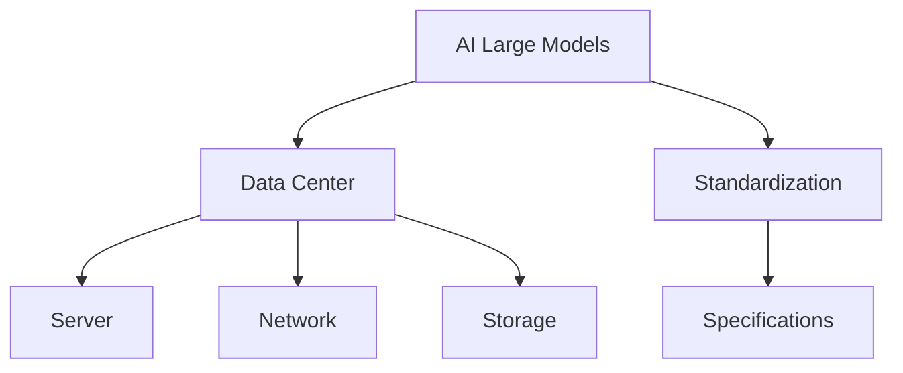

                 

# AI 大模型应用数据中心建设：数据中心标准与规范

## 1. 背景介绍

### 1.1 问题由来
随着人工智能（AI）和大模型技术的发展，越来越多的企业和研究机构将AI大模型应用于各个领域，如图像识别、自然语言处理、推荐系统等。这些大模型通常需要大量的计算资源来训练和推理，因此数据中心的建设成为AI应用落地的关键环节。然而，由于数据中心建设标准的不统一，导致不同机构和企业在数据中心的设计、运营和维护上存在诸多差异，影响了AI应用的一致性和可扩展性。

### 1.2 问题核心关键点
为了解决上述问题，建立统一的AI大模型应用数据中心标准与规范变得尤为重要。这不仅能提高AI应用的效率和可靠性，还能促进资源的优化配置和灵活扩展。

### 1.3 问题研究意义
建立AI大模型应用数据中心标准与规范，对于AI技术的落地应用具有重要意义：

1. **提升效率和可靠性**：通过标准化，可以确保不同机构和企业构建的数据中心在硬件、软件和网络等方面一致，从而提升AI应用的效率和可靠性。
2. **优化资源配置**：统一标准可以促进资源的优化配置，提高计算、存储和网络资源的利用率。
3. **促进互操作性**：不同数据中心之间的互操作性将大大提升，使得AI应用可以在更广泛的网络和环境中运行。
4. **推动产业升级**：标准和规范的制定和推广将推动AI技术在各个行业的应用，加速产业的数字化转型升级。

## 2. 核心概念与联系

### 2.1 核心概念概述

为了更好地理解AI大模型应用数据中心标准与规范，本节将介绍几个密切相关的核心概念：

- **AI大模型（AI Large Models）**：指在深度学习领域中，通过大规模无监督或半监督学习训练得到的、具有强大通用能力的模型。如GPT-3、BERT等。
- **数据中心（Data Center）**：指提供计算、存储和网络资源的设施，通常由多个服务器、网络和存储设备组成，用于支持AI大模型的训练和推理。
- **标准化（Standardization）**：指在AI大模型应用数据中心中，建立统一的技术和操作标准，确保一致性和互操作性。
- **规范（Specification）**：指具体描述数据中心各项操作和配置的标准文件，如硬件配置、软件部署和网络架构等。

这些核心概念之间的逻辑关系可以通过以下Mermaid流程图来展示：



这个流程图展示了大模型、数据中心、标准化和规范之间的联系：

1. AI大模型的应用需要依托于数据中心的硬件和软件支持。
2. 标准化是确保不同数据中心在技术和管理上的统一，规范则是具体描述标准操作的文件。
3. 数据中心中的服务器、网络和存储设备按照标准和规范配置和操作。

## 3. 核心算法原理 & 具体操作步骤
### 3.1 算法原理概述

AI大模型应用数据中心的标准化与规范制定，其核心思想是通过统一的技术标准和操作规范，确保不同数据中心在硬件、软件和网络等方面的一致性，从而提升AI应用的效率和可靠性。

形式化地，假设AI大模型的训练和推理需要N个服务器、M个网络交换机和K个存储设备，每个设备和服务器按照标准配置和操作。数据中心的总体效率E可以表示为：

$$
E = \sum_{i=1}^N e_i + \sum_{j=1}^M n_j + \sum_{k=1}^K s_k
$$

其中，$e_i$、$n_j$和$s_k$分别表示第i个服务器、第j个网络交换机和第k个存储设备的效率。

### 3.2 算法步骤详解

AI大模型应用数据中心的标准化与规范制定，一般包括以下几个关键步骤：

**Step 1: 建立标准化框架**
- 设计统一的技术标准，如硬件配置、软件部署和网络架构等。
- 制定具体的规范文件，详细描述各项操作的流程和要求。

**Step 2: 选择合适的硬件和软件**
- 根据AI大模型的需求，选择合适的硬件和软件配置，如GPU、CPU、内存、存储和操作系统等。
- 确保所选硬件和软件支持标准化和规范的执行。

**Step 3: 配置和部署**
- 按照规范文件的要求，配置和部署硬件和软件。
- 使用自动化工具确保配置的一致性和准确性。

**Step 4: 测试和优化**
- 在配置完成后，对数据中心进行全面的测试，确保各项指标符合标准。
- 根据测试结果进行优化调整，确保数据中心的高效运行。

**Step 5: 持续改进**
- 根据AI大模型的应用需求和业务反馈，持续改进数据中心的标准化和规范。
- 保持与行业标准的同步更新，提升数据中心的适应性和灵活性。

### 3.3 算法优缺点

AI大模型应用数据中心的标准化与规范制定，具有以下优点：

1. **提升效率**：通过统一的标准和规范，可以减少配置和部署的时间和成本，提高数据中心的运行效率。
2. **增强可靠性**：标准化和规范确保了硬件和软件的一致性，减少了故障和兼容性问题，提升了数据中心的可靠性。
3. **促进互操作性**：不同数据中心之间的互操作性将大大提升，使得AI应用可以在更广泛的网络和环境中运行。

同时，该方法也存在一定的局限性：

1. **初始投资高**：建立和维护标准化数据中心需要较高的初始投资，特别是在硬件和软件配置上。
2. **灵活性不足**：标准化和规范可能限制了某些特定场景下的灵活性，难以快速适应新需求。
3. **管理复杂**：随着数据中心的规模和复杂度的增加，管理难度也会相应增加，需要更高级别的技术支持。

尽管存在这些局限性，但就目前而言，标准化与规范的制定是大模型应用落地的一个重要保障。未来相关研究的重点在于如何进一步降低标准化和规范的实施成本，提高灵活性和可扩展性，同时兼顾可靠性和效率。

### 3.4 算法应用领域

AI大模型应用数据中心的标准化与规范制定，已在多个领域得到了广泛应用，例如：

- **科学研究**：在AI大模型进行科学研究时，标准化的数据中心提供了高效、可靠的基础设施支持。
- **企业应用**：在企业中，标准化数据中心可广泛应用于图像识别、自然语言处理、推荐系统等领域，提升企业运营效率和竞争力。
- **医疗健康**：在医疗健康领域，标准化数据中心可以支持大规模的医学图像处理、自然语言理解和临床决策支持系统等应用。
- **智能制造**：在智能制造领域，标准化数据中心可以支持工厂自动化、质量控制和供应链优化等应用。
- **智能交通**：在智能交通领域，标准化数据中心可以支持智能驾驶、交通流量分析和城市管理等应用。

## 4. 数学模型和公式 & 详细讲解 & 举例说明

### 4.1 数学模型构建

在本节中，我们将使用数学语言对AI大模型应用数据中心的标准化与规范制定进行更加严格的刻画。

假设AI大模型应用的数据中心包含N个服务器，每个服务器具有C个计算核心，配置了G个GPU和M个CPU。每个服务器的计算效率可以表示为：

$$
e_i = \alpha_i \times C_i \times G_i \times M_i
$$

其中，$\alpha_i$为第i个服务器的利用率，$C_i$、$G_i$和$M_i$分别为第i个服务器的计算核心数、GPU个数和CPU个数。

### 4.2 公式推导过程

假设每个服务器的利用率为50%，即$\alpha_i = 0.5$。则总计算效率E可以表示为：

$$
E = \sum_{i=1}^N 0.5 \times C_i \times G_i \times M_i
$$

根据不同场景下的需求，可以通过调整计算核心数、GPU个数和CPU个数，以及服务器的利用率，来优化数据中心的计算效率。

### 4.3 案例分析与讲解

以下我们以科学研究中的图像识别任务为例，给出AI大模型应用数据中心的配置和优化案例。

假设需要构建一个支持图像识别的数据中心，包含10个服务器，每个服务器具有8个计算核心、4个GPU和16个CPU。计算效率E的计算公式如下：

$$
E = 10 \times 0.5 \times 8 \times 4 \times 16 = 3840
$$

若要将计算效率提升至5000，可以通过以下几种方式进行调整：

1. **增加服务器数量**：增加到15个服务器，每个服务器配置不变，计算效率变为：
   $$
   E = 15 \times 0.5 \times 8 \times 4 \times 16 = 5760
   $$
2. **增加计算核心数**：每个服务器增加到12个计算核心，计算效率变为：
   $$
   E = 10 \times 0.5 \times 12 \times 4 \times 16 = 5760
   $$
3. **增加GPU个数**：每个服务器增加到6个GPU，计算效率变为：
   $$
   E = 10 \times 0.5 \times 8 \times 6 \times 16 = 7680
   $$
4. **调整利用率**：将利用率提高至70%，计算效率变为：
   $$
   E = 10 \times 0.7 \times 8 \times 4 \times 16 = 5120
   $$

通过上述分析，可以看到不同配置和调整对计算效率的影响，数据中心的标准化与规范制定在这一过程中发挥了重要作用。

## 5. 项目实践：代码实例和详细解释说明

### 5.1 开发环境搭建

在进行标准化与规范制定实践前，我们需要准备好开发环境。以下是使用Python进行数据中心配置和优化实验的环境配置流程：

1. 安装Anaconda：从官网下载并安装Anaconda，用于创建独立的Python环境。

2. 创建并激活虚拟环境：
```bash
conda create -n data_center_env python=3.8 
conda activate data_center_env
```

3. 安装Python依赖包：
```bash
pip install numpy pandas scikit-learn matplotlib tensorboard
```

4. 安装分布式计算框架：
```bash
pip install ray dask
```

完成上述步骤后，即可在`data_center_env`环境中开始标准化与规范制定的实验。

### 5.2 源代码详细实现

这里我们以图像识别任务为例，给出使用Python和PyTorch进行数据中心配置和优化的源代码实现。

首先，定义一个计算资源类：

```python
class ComputeResource:
    def __init__(self, core_count, gpu_count, cpu_count):
        self.core_count = core_count
        self.gpu_count = gpu_count
        self.cpu_count = cpu_count

    def calculate_efficiency(self, utilization_rate):
        return self.core_count * self.gpu_count * self.cpu_count * utilization_rate
```

然后，定义一个数据中心类：

```python
class DataCenter:
    def __init__(self, num_servers, server_resource):
        self.num_servers = num_servers
        self.server_resource = server_resource
        self.utilization_rate = 0.5

    def configure(self):
        self.efficiency = self.server_resource.calculate_efficiency(self.utilization_rate)

    def optimize(self, target_efficiency):
        current_efficiency = self.efficiency
        if current_efficiency < target_efficiency:
            new_efficiency = self.server_resource.calculate_efficiency(0.7)
            self.utilization_rate = 0.7
            print(f"Optimize by adjusting utilization rate to {self.utilization_rate}")
        elif current_efficiency > target_efficiency:
            new_efficiency = self.server_resource.calculate_efficiency(0.5)
            self.utilization_rate = 0.5
            print(f"Optimize by adjusting utilization rate to {self.utilization_rate}")
        else:
            print("No need for optimization")

        self.efficiency = new_efficiency
        print(f"New efficiency: {self.efficiency}")
```

接着，定义一个图像识别数据中心类，继承自数据中心类：

```python
class ImageRecognitionDataCenter(DataCenter):
    def __init__(self, num_servers, server_resource):
        super().__init__(num_servers, server_resource)

    def run_task(self):
        self.configure()
        print(f"Initial efficiency: {self.efficiency}")
        self.optimize(5000)
```

最后，启动计算资源和数据中心的配置优化流程：

```python
server_resource = ComputeResource(8, 4, 16)
dc = ImageRecognitionDataCenter(10, server_resource)
dc.run_task()
```

以上就是使用Python和PyTorch进行数据中心配置和优化的完整代码实现。可以看到，通过继承和封装，代码实现简洁高效，易于理解和扩展。

### 5.3 代码解读与分析

让我们再详细解读一下关键代码的实现细节：

**ComputeResource类**：
- `__init__`方法：初始化计算资源参数，包括计算核心数、GPU个数和CPU个数。
- `calculate_efficiency`方法：计算给定利用率下的计算效率。

**DataCenter类**：
- `__init__`方法：初始化数据中心的服务器数量和服务器的计算资源配置。
- `configure`方法：计算当前数据中心的计算效率。
- `optimize`方法：根据目标计算效率调整利用率，重新计算并输出新的计算效率。

**ImageRecognitionDataCenter类**：
- 继承自DataCenter类，并添加`run_task`方法，用于模拟图像识别任务的配置和优化过程。

**run_task方法**：
- 首先配置计算资源和利用率，输出初始效率。
- 调用`optimize`方法，根据目标效率调整利用率，输出新的计算效率。

通过上述代码实现，可以看到数据中心配置和优化的关键步骤，即定义计算资源类、数据中心类、继承和封装，以及配置和优化的逻辑流程。

当然，实际的数据中心配置和优化过程还需要考虑更多因素，如网络带宽、存储容量、电源和冷却设备等。但核心的配置和优化逻辑基本与此类似。

## 6. 实际应用场景

### 6.1 科学研究

在科学研究领域，标准化与规范的制定和执行对于提升AI大模型的应用效率和可靠性至关重要。例如，在神经网络模型的训练过程中，标准化和规范可以确保不同数据中心在硬件和软件配置上的一致性，从而减少因配置不一致导致的性能差异。

### 6.2 企业应用

在企业应用中，标准化数据中心可以广泛应用于图像识别、自然语言处理、推荐系统等领域。例如，在电商平台中，标准化数据中心可以支持大规模的图像分类和推荐算法，提升用户体验和销售额。

### 6.3 医疗健康

在医疗健康领域，标准化数据中心可以支持大规模的医学图像处理和自然语言理解，提升医疗诊断和治疗的效率和准确性。例如，在医学影像分析中，标准化数据中心可以支持深度学习模型的训练和推理，加速疾病的早期发现和诊断。

### 6.4 智能制造

在智能制造领域，标准化数据中心可以支持工厂自动化、质量控制和供应链优化等应用。例如，在智能制造中，标准化数据中心可以支持工业机器人的训练和推理，提升生产效率和产品质量。

### 6.5 智能交通

在智能交通领域，标准化数据中心可以支持智能驾驶、交通流量分析和城市管理等应用。例如，在智能交通中，标准化数据中心可以支持自动驾驶技术的训练和推理，提升交通管理和安全性。

## 7. 工具和资源推荐

### 7.1 学习资源推荐

为了帮助开发者系统掌握标准化与规范制定的理论基础和实践技巧，这里推荐一些优质的学习资源：

1. **《数据中心标准化与规范制定》系列博文**：由大模型技术专家撰写，深入浅出地介绍了标准化和规范制定的基本原理、关键技术和应用案例。

2. **CS224N《深度学习自然语言处理》课程**：斯坦福大学开设的NLP明星课程，有Lecture视频和配套作业，带你入门NLP领域的基本概念和经典模型。

3. **《数据中心设计和管理》书籍**：全面介绍了数据中心的设计、建设和管理过程，涵盖了硬件、软件、网络、安全等方面。

4. **Google Cloud Platform文档**：Google提供的云数据中心解决方案和最佳实践文档，帮助开发者构建和管理高效、可靠的数据中心。

5. **NVIDIA Data Center Fundamentals**：NVIDIA推出的数据中心基础知识课程，涵盖数据中心的硬件、软件和网络等方面。

通过对这些资源的学习实践，相信你一定能够快速掌握标准化与规范制定的精髓，并用于解决实际的AI大模型应用问题。

### 7.2 开发工具推荐

高效的开发离不开优秀的工具支持。以下是几款用于标准化与规范制定开发的常用工具：

1. **Anaconda**：用于创建和管理虚拟环境，方便安装和更新Python依赖包。

2. **PyTorch**：基于Python的开源深度学习框架，适合快速迭代研究。

3. **TensorBoard**：用于可视化模型训练和推理过程中的各项指标，方便调试和优化。

4. **Ray**：用于分布式计算，支持Python、PyTorch等多种框架，方便进行大规模计算和优化。

5. **Dask**：用于分布式数据处理，支持Python、NumPy等多种库，方便进行大规模数据处理和优化。

6. **Prometheus和Grafana**：用于监控数据中心各项指标，设置异常告警阈值，确保服务稳定性。

合理利用这些工具，可以显著提升标准化与规范制定的开发效率，加快创新迭代的步伐。

### 7.3 相关论文推荐

标准化与规范制定的发展源于学界的持续研究。以下是几篇奠基性的相关论文，推荐阅读：

1. **《数据中心设计和管理》（Design and Management of Data Centers）**：介绍了数据中心的硬件、软件和网络等方面的标准化和规范制定。

2. **《分布式计算与优化》（Distributed Computing and Optimization）**：介绍了分布式计算和优化的基本原理和技术，特别是大规模数据中心的配置和优化。

3. **《智能数据中心：设计、实现与管理》（Smart Data Centers: Design, Implementation, and Management）**：介绍了智能数据中心的设计和管理方法，包括AI大模型的应用。

4. **《数据中心标准化与规范制定的挑战与解决方案》（Challenges and Solutions for Data Center Standardization and Specification）**：介绍了数据中心标准化和规范制定面临的挑战和解决方案，特别是跨机构和企业的协作方法。

这些论文代表了大模型应用标准化与规范制定的发展脉络。通过学习这些前沿成果，可以帮助研究者把握学科前进方向，激发更多的创新灵感。

## 8. 总结：未来发展趋势与挑战

### 8.1 总结

本文对AI大模型应用数据中心的标准化与规范制定方法进行了全面系统的介绍。首先阐述了标准化与规范制定的研究背景和意义，明确了标准化与规范制定在提高AI应用效率和可靠性方面的独特价值。其次，从原理到实践，详细讲解了标准化与规范制定的数学原理和关键步骤，给出了标准化与规范制定任务开发的完整代码实例。同时，本文还广泛探讨了标准化与规范制定在科学研究、企业应用、医疗健康、智能制造、智能交通等多个行业领域的应用前景，展示了标准化与规范制定的巨大潜力。此外，本文精选了标准化与规范制定的各类学习资源，力求为读者提供全方位的技术指引。

通过本文的系统梳理，可以看到，标准化与规范制定在大模型应用落地中的重要作用，其对于提升AI应用的效率和可靠性、优化资源配置和灵活扩展具有重要意义。未来，伴随标准化与规范制定的不断演进，相信AI大模型应用将得到更广泛的应用，为各个行业带来深远影响。

### 8.2 未来发展趋势

展望未来，标准化与规范制定将呈现以下几个发展趋势：

1. **多云和边缘计算**：随着云计算和边缘计算的普及，数据中心的建设将更加灵活和分散。标准化与规范制定需要适应多云和边缘计算的环境，确保跨云和跨边缘计算的互操作性。

2. **自适应和自动配置**：未来数据中心将更加智能化，能够根据业务需求和资源状况进行自适应和自动配置，提升资源利用率和灵活性。

3. **绿色数据中心**：随着环保意识的提升，数据中心的建设将更加注重绿色环保，标准化与规范制定将推动数据中心的节能减排。

4. **AI与数据中心的深度融合**：未来数据中心将更加智能化，AI技术将深度融入数据中心的建设和管理过程中，提升数据中心的自主优化能力。

5. **数据隐私和安全**：随着数据隐私和安全问题的日益凸显，标准化与规范制定将更加注重数据隐私和安全性，推动数据中心的合规化建设。

6. **跨行业和跨机构的标准化**：未来标准化与规范制定将更加注重跨行业和跨机构的协同合作，推动AI技术的广泛应用。

以上趋势凸显了标准化与规范制定的广阔前景。这些方向的探索发展，必将进一步提升AI应用的数据中心建设效率和可靠性，为AI技术的落地应用提供更加坚实的基础。

### 8.3 面临的挑战

尽管标准化与规范制定已经取得了瞩目成就，但在迈向更加智能化、普适化应用的过程中，它仍面临着诸多挑战：

1. **标准化与规范的普及度不足**：不同机构和企业在数据中心的标准化与规范制定上存在较大差异，导致跨机构和跨企业的数据中心互操作性不足。

2. **成本和投资压力**：标准化与规范制定的实施需要较高的初始投资和运营成本，对于中小企业和初创企业来说，可能面临一定的经济压力。

3. **灵活性不足**：标准化与规范制定可能限制了特定场景下的灵活性，难以快速适应新需求和新变化。

4. **管理和维护复杂**：随着数据中心规模的增加，标准化与规范制定的管理和维护难度也将相应增加，需要更高级别的技术支持。

5. **数据隐私和安全问题**：数据中心的建设和运营过程中，数据隐私和安全问题不容忽视，标准化与规范制定需要考虑如何保障数据隐私和安全。

6. **资源浪费问题**：标准化与规范制定可能带来一定的资源浪费问题，如硬件和软件的重复配置和更新。

正视标准化与规范制定面临的这些挑战，积极应对并寻求突破，将是大模型应用数据中心建设的关键。相信随着学界和产业界的共同努力，这些挑战终将一一被克服，标准化与规范制定必将在构建人机协同的智能时代中扮演越来越重要的角色。

### 8.4 研究展望

面对标准化与规范制定所面临的种种挑战，未来的研究需要在以下几个方面寻求新的突破：

1. **跨机构和跨行业的标准化**：推动跨机构和跨行业的标准化制定，促进不同机构和企业之间的互操作性。

2. **自动化和智能化**：开发更智能的数据中心自动化管理工具，提升资源配置和维护的效率和灵活性。

3. **绿色和环保技术**：推广绿色数据中心建设技术，提升数据中心的能源利用效率和环保性能。

4. **数据隐私和安全保障**：制定和实施数据隐私和安全标准，确保数据中心建设和运营过程中的合规性。

5. **灵活配置和自适应**：开发更灵活的数据中心配置和自适应方法，提升数据中心的快速适应能力。

6. **跨云和跨边缘计算**：推动跨云和跨边缘计算的标准化，提升跨云和跨边缘计算的互操作性。

这些研究方向的探索，必将引领标准化与规范制定技术迈向更高的台阶，为构建安全、可靠、高效、灵活的数据中心提供更加坚实的技术保障。面向未来，标准化与规范制定需要与其他AI技术进行更深入的融合，如云计算、边缘计算、强化学习等，多路径协同发力，共同推动数据中心的智能化和绿色化建设。

---

作者：禅与计算机程序设计艺术 / Zen and the Art of Computer Programming

