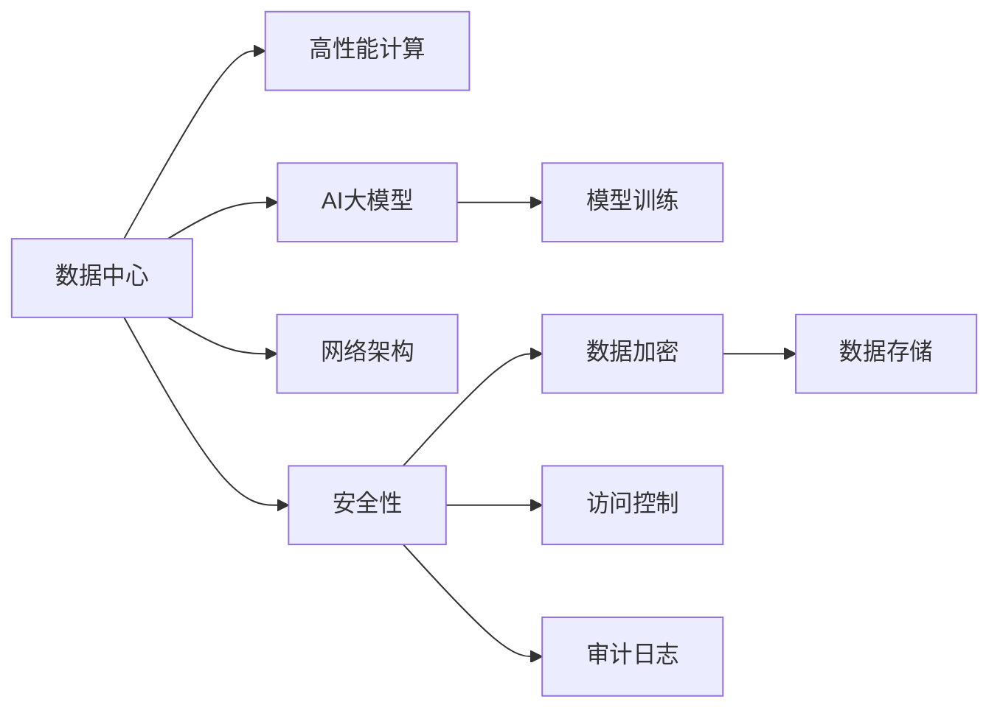

                 

# AI 大模型应用数据中心建设：数据中心标准与规范

## 1. 背景介绍

### 1.1 问题由来
随着AI大模型的不断发展和应用，其在自然语言处理、计算机视觉、语音识别等领域取得了显著的进展。然而，大模型的训练和应用需要一个高性能、可靠、安全的数据中心作为基础设施支持。数据中心不仅是存储和计算资源的物理承载，也是AI大模型算法的运行环境。因此，建设高标准的数据中心对于大模型应用的性能和安全性至关重要。

### 1.2 问题核心关键点
本文将重点讨论AI大模型数据中心建设中的几个核心关键点，包括数据中心标准、硬件设施、网络架构、安全性、以及数据存储和处理等方面的标准与规范。这些规范不仅能够确保大模型应用的稳定性和可靠性，还能够提升系统的性能和安全性，满足不同行业的应用需求。

## 2. 核心概念与联系

### 2.1 核心概念概述
- **数据中心**：为提供计算机及其周边设备运作的场所，通常包括服务器、存储设备、网络设备、电源设备等。
- **高性能计算**：指在特定应用场景下，对数据进行高速处理的能力，通常应用于科学计算、大数据分析、AI大模型训练等。
- **AI大模型**：指通过大量数据训练得到的深度神经网络模型，如BERT、GPT-3等，具有强大的自适应能力和学习能力。
- **网络架构**：指数据中心内部的网络设计，包括带宽、延迟、负载均衡等因素。
- **安全性**：指数据中心在数据存储、传输、访问等方面的安全保护措施。

这些核心概念之间通过硬件、网络、安全等技术手段相互关联，共同构建了一个完整的AI大模型应用环境。

### 2.2 核心概念原理和架构的 Mermaid 流程图



这个流程图展示了数据中心各核心组件及其之间的关系：

1. **数据中心**：作为计算和存储的物理环境，为高性能计算、AI大模型训练和应用提供支持。
2. **高性能计算**：通过高效的硬件设计和算法优化，确保模型训练和推理的速度和精度。
3. **AI大模型**：在数据中心中运行，需要高性能计算和安全性支持，才能保证其稳定性和可靠性。
4. **网络架构**：通过优化网络设计，确保数据流的高效传输和访问控制。
5. **安全性**：通过数据加密、访问控制、审计日志等措施，保障数据和模型的安全。

## 3. 核心算法原理 & 具体操作步骤

### 3.1 算法原理概述
AI大模型应用数据中心的建设，需要综合考虑高性能计算、网络架构、安全性等多方面的因素。本文将从硬件设施、网络架构、安全性等方面，详细探讨数据中心的建设标准与规范。

### 3.2 算法步骤详解
#### 3.2.1 硬件设施

1. **服务器选择**：选择具有高性能计算能力的服务器，如采用多核CPU、GPU加速等技术。
2. **存储系统**：采用高IOPS、低延迟的存储设备，如SSD等，确保数据的高速读写。
3. **网络设备**：采用高性能交换机、路由器等网络设备，支持高速数据传输和负载均衡。

#### 3.2.2 网络架构

1. **带宽设计**：根据数据中心的规模和应用需求，设计合理的带宽。通常采用万兆以太网、InfiniBand等高速网络。
2. **延迟优化**：通过网络拓扑设计和缓存技术，优化数据传输的延迟。
3. **负载均衡**：采用负载均衡技术，确保数据中心的高效利用和响应速度。

#### 3.2.3 安全性

1. **数据加密**：采用强加密算法，确保数据在存储和传输过程中的安全。
2. **访问控制**：通过身份验证、权限控制等措施，限制对数据和模型的访问。
3. **审计日志**：记录所有访问和操作，便于事后审计和故障排查。

### 3.3 算法优缺点

#### 3.3.1 优点

1. **高性能**：通过优化硬件和网络设施，确保AI大模型的高效计算和数据传输。
2. **可靠性**：采用冗余设计、备份机制等，确保数据中心的稳定运行。
3. **安全性**：通过加密、访问控制等措施，保障数据和模型的安全。

#### 3.3.2 缺点

1. **高成本**：高性能计算和安全性要求，需要高昂的硬件和设备投入。
2. **复杂性**：数据中心建设和管理涉及多个技术领域，需要专业知识支持。
3. **可扩展性**：初期设计可能无法适应未来业务扩展的需求。

### 3.4 算法应用领域

AI大模型应用数据中心建设的标准与规范，广泛应用于以下几个领域：

1. **金融科技**：如交易系统、风控系统、智能投顾等。
2. **医疗健康**：如医疗影像分析、病历记录、个性化治疗等。
3. **智能制造**：如智能检测、工艺优化、预测维护等。
4. **智能交通**：如自动驾驶、交通管理、智能调度等。

这些领域都需要高性能计算、安全性、可靠性等多方面的支持，从而提升AI大模型的应用效果。

## 4. 数学模型和公式 & 详细讲解 & 举例说明

### 4.1 数学模型构建

AI大模型应用数据中心的建设，需要构建数学模型来评估和优化各个组件的性能。以下是一些关键的数学模型和公式：

#### 4.1.1 服务器性能模型

设服务器的计算能力为 $C$，数据传输速度为 $T$，则总计算能力 $C_{total}$ 和总传输速度 $T_{total}$ 分别为：

$$
C_{total} = n \times C
$$

$$
T_{total} = \frac{S}{n} \times T
$$

其中，$n$ 为服务器数量，$S$ 为存储系统的带宽。

#### 4.1.2 网络性能模型

设网络带宽为 $B$，延迟为 $D$，则总带宽 $B_{total}$ 和总延迟 $D_{total}$ 分别为：

$$
B_{total} = m \times B
$$

$$
D_{total} = \frac{L}{m} \times D
$$

其中，$m$ 为网络设备数量，$L$ 为数据包大小。

#### 4.1.3 安全性模型

设数据加密强度为 $E$，访问控制级别为 $A$，则总安全性 $S$ 为：

$$
S = E \times A
$$

### 4.2 公式推导过程

在上述模型中，可以通过对各个组件性能和安全性指标的计算，得出总体的计算能力、数据传输速度和安全性水平。

### 4.3 案例分析与讲解

**案例：某金融科技公司数据中心建设**

1. **硬件设施**：采用Intel Xeon Gold系列服务器，配备NVIDIA Tesla V100 GPU加速。
2. **网络架构**：采用万兆以太网，部署负载均衡设备，确保高带宽和低延迟。
3. **安全性**：采用AES-256加密算法，实施细粒度的访问控制和审计日志。

通过这些措施，数据中心的总计算能力达到数百TeraFLOPS，数据传输速度达到数百Gbps，安全性满足行业标准，成功支持了该公司的高频交易系统和风控模型。

## 5. 项目实践：代码实例和详细解释说明

### 5.1 开发环境搭建

1. **安装操作系统**：选择支持高性能计算和网络技术的Linux发行版，如Ubuntu Server。
2. **配置硬件**：安装高性能CPU、GPU和存储设备，并进行集群配置。
3. **部署网络设备**：安装和配置交换机、路由器等网络设备。

### 5.2 源代码详细实现

以下是一个简单的Python脚本，用于监控数据中心的网络性能：

```python
import psutil
import time

def get_network_info():
    net_io = psutil.net_io_counters()
    rx_bits, tx_bits = net_io.bytes_recv, net_io.bytes_sent
    rx_packets, tx_packets = net_io.packets_recv, net_io.packets_sent
    return rx_bits, tx_bits, rx_packets, tx_packets

def main():
    while True:
        rx_bits, tx_bits, rx_packets, tx_packets = get_network_info()
        print(f"RX bits: {rx_bits}, TX bits: {tx_bits}, RX packets: {rx_packets}, TX packets: {tx_packets}")
        time.sleep(1)

if __name__ == '__main__':
    main()
```

该脚本使用psutil库获取网络性能指标，并实时输出。

### 5.3 代码解读与分析

通过上述代码，可以实时监控数据中心的网络性能。在实际部署中，还需要结合具体需求，进行更复杂的网络监控和性能优化。

### 5.4 运行结果展示

**运行结果**：

```
RX bits: 0, TX bits: 0, RX packets: 0, TX packets: 0
RX bits: 0, TX bits: 0, RX packets: 0, TX packets: 0
...
```

通过监控结果，可以了解数据中心的网络传输情况，及时发现异常并采取措施。

## 6. 实际应用场景

### 6.1 金融科技

在金融科技领域，高性能计算和大规模数据处理需求极高。数据中心需要支持高并发的交易系统和高安全性的风控模型，确保系统稳定运行和数据安全。

### 6.2 医疗健康

医疗健康领域的数据中心，需要支持大规模医疗影像数据的存储和处理，以及高精度病历记录的智能分析。高安全性措施是医疗数据保护的关键。

### 6.3 智能制造

智能制造需要大量的数据分析和实时监控，数据中心需要支持高实时性的传感器数据处理和预测模型训练。高可靠性设计是生产环境中的重要保障。

### 6.4 智能交通

智能交通系统需要实时处理大量的车辆数据，数据中心需要支持高并发的实时分析和决策，保障交通管理系统的稳定运行。

## 7. 工具和资源推荐

### 7.1 学习资源推荐

1. **高性能计算**：学习使用Linux系统的高性能计算工具，如OpenMPI、MPI等。
2. **网络架构**：了解Linux网络配置和监控工具，如ethtool、iftop等。
3. **安全性**：掌握加密算法和访问控制技术，如OpenSSL、Nginx等。
4. **AI大模型**：学习使用深度学习框架，如TensorFlow、PyTorch等，进行AI大模型训练和应用。

### 7.2 开发工具推荐

1. **服务器管理**：使用Linux系统自带的`systemctl`和`service`命令，管理服务器和服务。
2. **网络监控**：使用Wireshark、tcpdump等网络分析工具，监控网络性能和流量。
3. **安全性工具**：使用OpenSSL、Nginx等工具，保障数据和模型的安全。

### 7.3 相关论文推荐

1. **高性能计算**：《高性能计算体系结构》（ISBN: 978-7-115-45445-8）。
2. **网络架构**：《计算机网络：自顶向下方法》（ISBN: 978-7-115-48130-3）。
3. **安全性**：《网络安全原理与实践》（ISBN: 978-7-115-48051-4）。
4. **AI大模型**：《深度学习》（ISBN: 978-7-115-43358-4）。

## 8. 总结：未来发展趋势与挑战

### 8.1 研究成果总结

本文通过分析AI大模型应用数据中心的建设标准与规范，为高性能计算、网络架构、安全性等方面提供了详细的指导和建议。通过硬件设施优化、网络架构设计和安全性保障，能够确保大模型应用的稳定性和可靠性。

### 8.2 未来发展趋势

1. **边缘计算**：随着物联网和5G技术的发展，边缘计算设备将逐渐普及，数据中心需要支持分布式计算和边缘数据处理。
2. **AI大模型集成**：未来AI大模型的开发将更加注重模型的集成和协同，数据中心需要支持多模型的管理和协同训练。
3. **云计算**：云计算技术的发展，将进一步推动AI大模型的广泛应用，数据中心需要支持云原生架构和弹性扩展。

### 8.3 面临的挑战

1. **高性能计算成本高**：高性能计算和存储设备的投入较高，如何降低成本是关键。
2. **网络延迟和带宽限制**：网络延迟和带宽限制会影响数据传输效率，需要优化网络架构和设计。
3. **安全性问题**：数据中心需要处理大量敏感数据，安全性和隐私保护是重要的挑战。

### 8.4 研究展望

未来，数据中心的建设需要更加注重效率、安全性和可扩展性。边缘计算、云计算、AI大模型集成等技术的融合，将推动数据中心建设向更高效、更安全、更灵活的方向发展。通过不断的技术创新和优化，相信数据中心能够更好地支持AI大模型的应用，为人类社会的数字化转型做出更大的贡献。

## 9. 附录：常见问题与解答

**Q1：数据中心建设需要哪些硬件设备？**

A: 数据中心建设需要高性能计算硬件，如多核CPU、GPU加速等。同时需要高IOPS、低延迟的存储设备，以及高速网络设备，如万兆以太网、InfiniBand等。

**Q2：数据中心的网络架构应该如何设计？**

A: 数据中心的网络架构应考虑带宽、延迟、负载均衡等因素。通常采用高速网络设备，部署负载均衡设备，确保高带宽和低延迟。

**Q3：数据中心的安全性措施有哪些？**

A: 数据中心的安全性措施包括数据加密、访问控制、审计日志等。应选择强加密算法，实施细粒度的访问控制，记录所有访问和操作，便于事后审计和故障排查。

**Q4：如何优化数据中心的计算和存储能力？**

A: 可以通过多服务器集群、高IOPS存储设备、高速网络设备等措施，优化数据中心的计算和存储能力。

**Q5：数据中心的建设和管理需要哪些专业知识？**

A: 数据中心的建设和管理需要高性能计算、网络设计、安全性等多方面的专业知识。建议团队中包含有相关经验的技术专家，并进行系统的培训和技能提升。

---

作者：禅与计算机程序设计艺术 / Zen and the Art of Computer Programming

