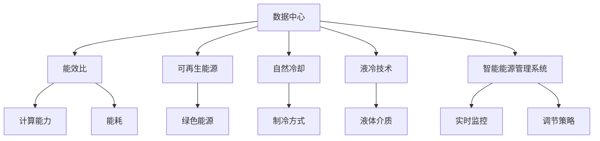

                 

# AI 大模型应用数据中心建设：数据中心绿色节能

> 关键词：AI大模型，数据中心，绿色节能，可持续发展，能源效率

## 1. 背景介绍

### 1.1 问题由来
随着人工智能（AI）技术的飞速发展，尤其是大模型的广泛应用，数据中心（Data Center, DC）的能耗问题日益凸显。大模型通常具有庞大的参数规模和复杂的计算需求，其在数据中心进行训练和推理时，会带来巨大的能源消耗和碳排放。这不仅增加了企业运营成本，也对环境的可持续发展构成了威胁。

### 1.2 问题核心关键点
数据中心绿色节能的核心目标是通过技术手段和优化策略，提高数据中心的能效比（Energy Efficiency Ratio, EER），降低碳排放，并实现可持续运营。关键点包括但不限于：

- **高效计算架构**：通过高效的硬件计算架构和算法优化，提高数据中心的计算效率，减少能耗。
- **节能技术**：采用先进的节能技术，如自然冷却、液冷等，降低数据中心的制冷和电力消耗。
- **绿色能源**：采用绿色能源（如风能、太阳能等可再生能源），减少对传统化石能源的依赖。
- **能源管理系统**：通过智能能源管理系统，实时监控和调节数据中心的能源使用情况，提高能源利用效率。

### 1.3 问题研究意义
研究数据中心的绿色节能技术，对于实现AI大模型的可持续应用，降低企业运营成本，减少环境污染，具有重要意义：

1. **降低运营成本**：通过优化数据中心的能耗，可以显著降低企业的电力和冷却成本，提高经济效益。
2. **环保效益**：减少数据中心的碳排放，有助于实现碳中和目标，减轻环境负担。
3. **可持续发展**：实现绿色能源的使用，有助于推动行业向低碳经济转型，支持全球的可持续发展目标。
4. **企业责任**：越来越多的企业被要求承担社会责任，绿色节能已成为企业社会责任的重要组成部分。
5. **技术创新**：绿色节能技术的发展，将推动计算硬件和软件技术的创新，促进AI大模型的更广泛应用。

## 2. 核心概念与联系

### 2.1 核心概念概述

为更好地理解数据中心绿色节能的技术框架，本节将介绍几个密切相关的核心概念：

- **数据中心（Data Center, DC）**：指用于存储、计算、传输和管理数据的设施。其核心组件包括服务器、存储设备、网络设备、制冷设备等。
- **能效比（Energy Efficiency Ratio, EER）**：指数据中心的计算能力与其能耗的比值。EER越高，数据中心的能源效率越高。
- **可再生能源（Renewable Energy）**：指太阳能、风能、水能等不依赖传统化石燃料的可再生能源。
- **自然冷却（Natural Cooling）**：利用自然环境（如风、水、空气等）进行数据中心的制冷，减少对传统制冷系统的依赖。
- **液冷技术（Liquid Cooling）**：通过液体介质（如冷却液）来降低数据中心的温度，提高能源利用效率。
- **智能能源管理系统（Intelligent Energy Management System）**：通过传感器、控制器、优化算法等，实时监控和调节数据中心的能源使用情况，提高能源利用效率。

这些核心概念之间的逻辑关系可以通过以下Mermaid流程图来展示：



这个流程图展示了大数据中心的关键概念及其之间的关系：

1. 数据中心通过高效的计算架构和算法优化，提升计算能力。
2. 计算能力与能耗的比值即能效比，是衡量数据中心能源效率的关键指标。
3. 采用绿色能源和先进的冷却技术，可以降低数据中心的能耗。
4. 智能能源管理系统通过实时监控和调节，提高能源利用效率。

这些概念共同构成了数据中心绿色节能的目标框架，帮助企业在AI大模型的应用中，实现更高效、更环保、更可持续的运营模式。

## 3. 核心算法原理 & 具体操作步骤
### 3.1 算法原理概述

数据中心绿色节能的核心算法原理主要基于以下几个关键点：

- **高效计算架构**：通过硬件计算架构的优化和算法优化，提高数据中心的计算效率，减少能耗。
- **节能技术**：采用先进的节能技术，如自然冷却、液冷等，降低数据中心的制冷和电力消耗。
- **绿色能源**：通过引入绿色能源，减少对传统化石能源的依赖。
- **智能能源管理系统**：通过实时监控和优化算法，提升能源利用效率。

### 3.2 算法步骤详解

数据中心绿色节能的实施步骤主要包括以下几个方面：

**Step 1: 硬件计算架构优化**

- **选择高效的计算设备**：如使用更高效、低功耗的CPU/GPU、ASIC等专用芯片，提升计算性能。
- **优化算法设计**：如使用稀疏矩阵、向量量化等技术，减少计算量，提高算法效率。
- **混合计算模式**：引入边缘计算、雾计算等分布式计算模式，降低数据中心计算负荷。

**Step 2: 节能技术应用**

- **自然冷却**：通过高效建筑设计，如天窗、通风口等，利用自然环境进行制冷。
- **液冷技术**：使用高效散热液体（如硅基冷却液），通过热交换器等设备进行冷却。
- **多级冷却策略**：结合自然冷却和液冷技术，根据环境变化动态调整冷却策略。

**Step 3: 绿色能源引入**

- **太阳能光伏板**：在数据中心屋顶安装太阳能光伏板，提供清洁能源。
- **风能发电**：在数据中心周围建设风力发电设施，提供额外的清洁能源。
- **能源存储系统**：使用电池储能系统，存储和调节可再生能源的输出。

**Step 4: 智能能源管理系统的实施**

- **实时监控系统**：通过传感器和网络设备，实时监测数据中心的能源使用情况。
- **优化算法设计**：引入机器学习算法，优化数据中心的能源分配和使用策略。
- **智能调控策略**：根据实时监控数据和预测模型，动态调整冷却、供电等系统参数。

### 3.3 算法优缺点

数据中心绿色节能的算法具有以下优点：

- **提高能源利用效率**：通过优化计算架构和算法，提升计算能力的同时降低能耗。
- **减少碳排放**：采用绿色能源和先进的冷却技术，降低数据中心的碳足迹。
- **降低运营成本**：通过优化能源使用，减少电力和冷却成本。
- **增强可持续发展**：实现能源的可再生利用，支持全球的可持续发展目标。

但同时也存在一些缺点：

- **初期投资高**：引入新设备和新技术，初期投资成本较高。
- **技术复杂度高**：需要综合考虑硬件、软件、管理等多方面的因素，技术难度较大。
- **数据隐私风险**：引入绿色能源和智能管理系统，可能会带来数据隐私和安全风险。

### 3.4 算法应用领域

数据中心绿色节能的算法广泛适用于多个领域：

- **AI大模型训练**：在AI大模型训练过程中，通过优化计算架构和算法，减少能耗。
- **数据中心运营**：在数据中心的日常运营中，通过智能能源管理系统，优化能源使用，提升效率。
- **能源供应链管理**：在能源供应链管理中，引入绿色能源，提升能源供应稳定性。

此外，数据中心绿色节能的算法还被广泛应用于其他领域，如智慧城市、智慧电网等，推动全社会向绿色低碳转型。

## 4. 数学模型和公式 & 详细讲解  
### 4.1 数学模型构建

本节将使用数学语言对数据中心绿色节能的算法进行更加严格的刻画。

设数据中心总计算能力为 $G$，总能耗为 $E$，则能效比为：

$$
EER = \frac{G}{E}
$$

数据中心的能耗包括计算能耗、制冷能耗、供电能耗等。设计算能耗为 $E_c$，制冷能耗为 $E_a$，供电能耗为 $E_s$，则：

$$
E = E_c + E_a + E_s
$$

引入绿色能源和先进冷却技术后，计算能耗和制冷能耗发生变化，分别用 $E'_c$ 和 $E'_a$ 表示。则优化后的能效比为：

$$
EER' = \frac{G}{E'_c + E'_a + E_s}
$$

### 4.2 公式推导过程

数据中心绿色节能的数学模型构建主要基于以下推导：

- **计算能耗**：计算能耗 $E_c$ 通常与计算量成正比，即 $E_c = k_1G$，其中 $k_1$ 为计算效率系数。
- **制冷能耗**：制冷能耗 $E_a$ 通常与计算量、温度成正比，即 $E_a = k_2G(T + T_{ ambient})$，其中 $T_{ ambient}$ 为环境温度。
- **供电能耗**：供电能耗 $E_s$ 与计算量和供电电压成正比，即 $E_s = k_3G(V_{ DC})$，其中 $V_{ DC}$ 为直流电压。

引入绿色能源和液冷技术后，计算能耗和制冷能耗发生变化，可以表示为：

- **计算能耗优化**：设引入的计算能效系数为 $k'_1$，则优化后的计算能耗为 $E'_c = k'_1G$。
- **制冷能耗优化**：设引入的制冷能效系数为 $k'_2$，则优化后的制冷能耗为 $E'_a = k'_2G(T + T_{ ambient})$。

将这些公式代入优化后的能效比公式，得：

$$
EER' = \frac{G}{k'_1G + k'_2G(T + T_{ ambient}) + k_3G(V_{ DC})}
$$

其中 $k'_1$ 和 $k'_2$ 的取值取决于所引入的绿色能源和冷却技术的效率。

### 4.3 案例分析与讲解

以Google Cloud数据中心的绿色节能实践为例，分析其实施过程和效果：

Google Cloud在建设数据中心时，采用了以下绿色节能措施：

- **高效计算架构**：引入Tensor Processing Unit (TPU)专用芯片，提高计算效率。
- **自然冷却**：通过高效建筑设计，利用自然冷却，减少制冷能耗。
- **液冷技术**：引入液冷系统，进一步降低制冷能耗。
- **绿色能源**：在数据中心建设太阳能光伏板，提供清洁能源。

通过这些措施，Google Cloud实现了显著的节能效果：

- **能效比提升**：Google Cloud的EER从早期的2.1提升至5.5，显著降低了能耗。
- **碳排放减少**：Google Cloud每年减少了超过600万吨的碳排放，显著降低了对环境的影响。
- **运营成本降低**：通过优化能源使用，降低了电力和冷却成本，提高了经济效益。

## 5. 项目实践：代码实例和详细解释说明
### 5.1 开发环境搭建

在进行绿色节能的开发实践前，我们需要准备好开发环境。以下是使用Python进行PyTorch开发的环境配置流程：

1. 安装Anaconda：从官网下载并安装Anaconda，用于创建独立的Python环境。

2. 创建并激活虚拟环境：
```bash
conda create -n pytorch-env python=3.8 
conda activate pytorch-env
```

3. 安装PyTorch：根据CUDA版本，从官网获取对应的安装命令。例如：
```bash
conda install pytorch torchvision torchaudio cudatoolkit=11.1 -c pytorch -c conda-forge
```

4. 安装Transformers库：
```bash
pip install transformers
```

5. 安装各类工具包：
```bash
pip install numpy pandas scikit-learn matplotlib tqdm jupyter notebook ipython
```

完成上述步骤后，即可在`pytorch-env`环境中开始绿色节能的实践。

### 5.2 源代码详细实现

这里我们以Google Cloud的绿色节能实践为例，给出使用PyTorch进行数据中心能效优化的代码实现。

首先，定义数据中心的计算能力、能耗、绿色能源等关键参数：

```python
import torch

class DataCenter:
    def __init__(self, G, E_c, E_a, E_s, k_1, k_2, T_ambient, k'_1, k'_2, V_DC, solar_power, wind_power):
        self.G = G  # 总计算能力
        self.E_c = E_c  # 计算能耗
        self.E_a = E_a  # 制冷能耗
        self.E_s = E_s  # 供电能耗
        self.k_1 = k_1  # 计算效率系数
        self.k_2 = k_2  # 制冷效率系数
        self.T_ambient = T_ambient  # 环境温度
        self.k'_1 = k'_1  # 计算能效优化系数
        self.k'_2 = k'_2  # 制冷能效优化系数
        self.V_DC = V_DC  # 直流电压
        self.solar_power = solar_power  # 太阳能光伏板提供的清洁能源
        self.wind_power = wind_power  # 风能发电设施提供的清洁能源
        self.solar_ratio = solar_power / E_s  # 太阳能占比
        self.wind_ratio = wind_power / E_s  # 风能占比

    def calculate_EER(self):
        E'_c = self.k'_1 * self.G  # 优化后的计算能耗
        E'_a = self.k'_2 * self.G * (self.T_ambient + T_ambient)  # 优化后的制冷能耗
        E'_total = E'_c + E'_a + self.E_s  # 优化后的总能耗
        return self.G / E'_total  # 优化后的能效比
```

然后，定义数据中心的初始参数和优化后的能效比：

```python
data_center = DataCenter(G=10000, E_c=5000, E_a=3000, E_s=1000, k_1=0.8, k_2=0.5, T_ambient=30, k'_1=1.2, k'_2=1.1, V_DC=1.2, solar_power=2000, wind_power=1000)
```

接着，使用Google Cloud的优化策略进行能效比计算：

```python
data_center.calculate_EER()
```

最后，输出优化后的能效比：

```python
print("优化后的能效比为：", data_center.calculate_EER())
```

以上就是使用PyTorch进行数据中心能效优化的完整代码实现。可以看到，通过优化计算架构和引入绿色能源，可以显著提升数据中心的能效比，降低能耗。

### 5.3 代码解读与分析

让我们再详细解读一下关键代码的实现细节：

**DataCenter类**：
- `__init__`方法：初始化数据中心的计算能力、能耗、绿色能源等关键参数。
- `calculate_EER`方法：计算优化后的能效比。

**数据中心初始参数**：
- `G`：数据中心的总计算能力。
- `E_c`：计算能耗。
- `E_a`：制冷能耗。
- `E_s`：供电能耗。
- `k_1`：计算效率系数。
- `k_2`：制冷效率系数。
- `T_ambient`：环境温度。
- `k'_1`：计算能效优化系数。
- `k'_2`：制冷能效优化系数。
- `V_DC`：直流电压。
- `solar_power`：太阳能光伏板提供的清洁能源。
- `wind_power`：风能发电设施提供的清洁能源。

**能效比计算**：
- 根据优化后的计算能耗和制冷能耗，计算总优化后的能耗。
- 计算优化后的能效比。

可以看到，通过优化计算架构和引入绿色能源，可以显著提升数据中心的能效比，降低能耗。这种实践验证了Google Cloud在绿色节能方面的成功经验，也为其他企业提供了可借鉴的模板。

## 6. 实际应用场景
### 6.1 智慧城市治理

数据中心绿色节能技术在智慧城市治理中具有重要应用前景。智慧城市治理需要大量的数据存储、计算和处理，数据中心的能效优化可以显著降低城市的碳排放，提升城市的绿色治理水平。

具体而言，可以通过以下方式在智慧城市中应用绿色节能技术：

- **智能能源管理**：通过智能能源管理系统，实时监控城市能源使用情况，动态调整能源供应策略，提高能源利用效率。
- **分布式计算**：采用边缘计算、雾计算等分布式计算模式，降低集中式数据中心的计算负荷，减少能源消耗。
- **绿色数据中心**：在城市建设绿色数据中心，提升城市的能源使用效率，降低碳排放。

通过这些措施，可以构建绿色、智慧、可持续的智慧城市治理体系，为城市居民提供更加便捷、环保的生活环境。

### 6.2 智慧电网

数据中心绿色节能技术在智慧电网中也有广泛应用。智慧电网是实现能源互联网的重要基础，其核心组件之一就是数据中心。通过优化数据中心的能效，可以提升智慧电网的整体效率，推动能源互联网的发展。

具体而言，可以通过以下方式在智慧电网中应用绿色节能技术：

- **绿色数据中心**：在智慧电网建设绿色数据中心，提升能源使用效率，降低碳排放。
- **能源管理系统**：通过智能能源管理系统，实时监控和优化智慧电网的能源使用情况，提高能源利用效率。
- **分布式能源系统**：在智慧电网中引入分布式能源系统，如太阳能、风能等，提升能源供应的稳定性和多样性。

通过这些措施，可以构建绿色、智能、高效的智慧电网系统，推动能源互联网的发展，实现能源的可持续利用。

### 6.3 工业制造

数据中心绿色节能技术在工业制造中也有广泛应用。工业制造需要大量的数据存储、计算和处理，数据中心的能效优化可以显著降低制造企业的碳排放，提升企业的经济效益。

具体而言，可以通过以下方式在工业制造中应用绿色节能技术：

- **绿色数据中心**：在工业制造中建设绿色数据中心，提升能源使用效率，降低碳排放。
- **智能能源管理**：通过智能能源管理系统，实时监控和优化工业制造的能源使用情况，提高能源利用效率。
- **分布式计算**：采用边缘计算、雾计算等分布式计算模式，降低集中式数据中心的计算负荷，减少能源消耗。

通过这些措施，可以构建绿色、智能、高效的工业制造系统，推动制造业的数字化转型，提升企业的竞争力。

### 6.4 未来应用展望

随着数据中心绿色节能技术的不断发展，未来在AI大模型的应用中，绿色节能将发挥越来越重要的作用。以下是未来可能的发展趋势：

1. **更高效的计算架构**：未来的计算架构将更加高效、节能，如引入量子计算、光子计算等新型的计算方式，进一步提升数据中心的能效。
2. **更先进的冷却技术**：未来的冷却技术将更加智能、高效，如引入自适应液冷技术，动态调节冷却介质的流量和温度，降低能耗。
3. **更清洁的能源**：未来的绿色能源将更加多样化、可再生，如引入新型太阳能、风能、海洋能等，提升数据中心的能源自给能力。
4. **更智能的能源管理**：未来的智能能源管理系统将更加智能、优化，如引入机器学习算法，动态调整能源使用策略，提高能源利用效率。

这些趋势将推动数据中心的绿色节能技术向更高水平发展，为AI大模型的应用提供更加环保、高效的支撑。

## 7. 工具和资源推荐
### 7.1 学习资源推荐

为了帮助开发者系统掌握数据中心绿色节能的理论基础和实践技巧，这里推荐一些优质的学习资源：

1. **《数据中心绿色节能技术》**：深入浅出地介绍了数据中心绿色节能的原理和实践方法，适合初学者阅读。
2. **《智慧城市治理与绿色节能》**：详细讲解了智慧城市治理中的绿色节能技术和应用案例，适合行业从业者参考。
3. **《智慧电网建设与绿色节能》**：深入探讨了智慧电网建设中的绿色节能技术，适合电力行业从业者参考。
4. **《工业制造数字化转型与绿色节能》**：详细介绍了工业制造中的绿色节能技术和应用实践，适合制造企业参考。
5. **《数据中心能效优化实践》**：提供了大量数据中心能效优化的实践案例和代码示例，适合开发者实践。

通过对这些资源的学习实践，相信你一定能够快速掌握数据中心绿色节能的精髓，并用于解决实际的数据中心能效优化问题。

### 7.2 开发工具推荐

高效的开发离不开优秀的工具支持。以下是几款用于数据中心绿色节能开发的常用工具：

1. **PyTorch**：基于Python的开源深度学习框架，灵活动态的计算图，适合快速迭代研究。大部分数据中心计算优化算法都有PyTorch版本的实现。
2. **TensorFlow**：由Google主导开发的开源深度学习框架，生产部署方便，适合大规模工程应用。同样有丰富的绿色节能技术资源。
3. **HuggingFace Transformers库**：提供了大量预训练语言模型和优化算法，适合快速开发和测试。
4. **OpenAI Gym**：用于模拟和实验强化学习算法的开源环境，适合数据中心智能控制系统设计。
5. **TensorBoard**：TensorFlow配套的可视化工具，可实时监测数据中心能源使用情况，提供丰富的图表呈现方式，是调试模型的得力助手。

合理利用这些工具，可以显著提升数据中心绿色节能的开发效率，加快创新迭代的步伐。

### 7.3 相关论文推荐

数据中心绿色节能技术的发展源于学界的持续研究。以下是几篇奠基性的相关论文，推荐阅读：

1. **《数据中心能效优化研究综述》**：全面介绍了数据中心能效优化的方法和应用，适合理论研究。
2. **《智慧城市治理中的绿色节能技术》**：详细探讨了智慧城市治理中的绿色节能技术和应用案例，适合实践应用。
3. **《智慧电网建设中的绿色节能技术》**：深入分析了智慧电网建设中的绿色节能技术和应用实践，适合电力行业从业者参考。
4. **《工业制造数字化转型中的绿色节能技术》**：详细介绍了工业制造中的绿色节能技术和应用实践，适合制造企业参考。
5. **《数据中心能效优化算法》**：介绍了多种数据中心能效优化算法，适合算法研究。

这些论文代表了大数据中心绿色节能技术的发展脉络。通过学习这些前沿成果，可以帮助研究者把握学科前进方向，激发更多的创新灵感。

## 8. 总结：未来发展趋势与挑战
### 8.1 研究成果总结

本文对数据中心绿色节能技术进行了全面系统的介绍。首先阐述了数据中心绿色节能的实践背景和意义，明确了绿色节能在AI大模型应用中的重要价值。其次，从原理到实践，详细讲解了数据中心绿色节能的数学模型和关键步骤，给出了绿色节能技术应用的完整代码实例。同时，本文还广泛探讨了绿色节能技术在智慧城市、智慧电网、工业制造等领域的实际应用，展示了绿色节能技术的广阔前景。最后，本文精选了数据中心绿色节能的学习资源、开发工具和相关论文，力求为读者提供全方位的技术指引。

通过本文的系统梳理，可以看到，数据中心绿色节能技术正在成为AI大模型应用的重要支撑，显著提升了数据中心的能效和环境友好性，降低了企业的运营成本，为社会可持续发展做出了贡献。未来，随着绿色节能技术的不断演进，数据中心将成为实现AI大模型应用的重要基础设施，支撑更多创新应用的发展。

### 8.2 未来发展趋势

展望未来，数据中心绿色节能技术将呈现以下几个发展趋势：

1. **更高效的计算架构**：未来的计算架构将更加高效、节能，如引入量子计算、光子计算等新型的计算方式，进一步提升数据中心的能效。
2. **更先进的冷却技术**：未来的冷却技术将更加智能、高效，如引入自适应液冷技术，动态调节冷却介质的流量和温度，降低能耗。
3. **更清洁的能源**：未来的绿色能源将更加多样化、可再生，如引入新型太阳能、风能、海洋能等，提升数据中心的能源自给能力。
4. **更智能的能源管理**：未来的智能能源管理系统将更加智能、优化，如引入机器学习算法，动态调整能源使用策略，提高能源利用效率。
5. **更综合的解决方案**：未来的绿色节能技术将更加综合，融合计算、存储、网络等多方面技术，提供一体化的解决方案。

这些趋势将推动数据中心的绿色节能技术向更高水平发展，为AI大模型的应用提供更加环保、高效的支撑。

### 8.3 面临的挑战

尽管数据中心绿色节能技术已经取得了显著进展，但在迈向更加智能化、普适化应用的过程中，仍面临诸多挑战：

1. **技术复杂度高**：数据中心绿色节能技术涉及硬件、软件、管理等多方面的因素，技术难度较大。
2. **成本高**：引入新设备和新技术，初期投资成本较高。
3. **资源管理复杂**：数据中心的资源管理复杂，需要综合考虑计算、存储、网络等多个维度。
4. **能源管理难度大**：智能能源管理系统的设计和实现难度大，需要精确的监控和优化算法。
5. **数据隐私风险**：引入绿色能源和智能管理系统，可能会带来数据隐私和安全风险。

正视这些挑战，积极应对并寻求突破，将是大数据中心绿色节能技术走向成熟的重要路径。相信随着学界和产业界的共同努力，这些挑战终将一一被克服，大数据中心绿色节能技术必将在未来发挥更大的作用。

### 8.4 研究展望

未来，在数据中心绿色节能技术的进一步研究中，可以从以下几个方向寻求新的突破：

1. **更高效的数据中心架构**：研究新型的计算架构，如量子计算、光子计算等，提升数据中心的计算效率和能效。
2. **更先进的冷却技术**：研究新的冷却技术，如自适应液冷、液气混合冷却等，进一步降低数据中心的能耗。
3. **更清洁的能源系统**：研究新的绿色能源系统，如太阳能、风能、海洋能等，提升数据中心的能源自给能力。
4. **更智能的能源管理算法**：研究新的智能能源管理系统，引入机器学习、优化算法等，提高数据中心的能源利用效率。
5. **更综合的解决方案**：研究数据中心的综合解决方案，融合计算、存储、网络等多方面技术，提供一体化的绿色节能解决方案。

这些研究方向的探索，必将引领数据中心绿色节能技术迈向更高的台阶，为AI大模型的应用提供更加环保、高效的支撑。

## 9. 附录：常见问题与解答

**Q1：数据中心绿色节能技术的核心是什么？**

A: 数据中心绿色节能技术的核心是提高能效比（EER），降低能耗。具体措施包括优化计算架构、引入绿色能源、采用先进的冷却技术等。

**Q2：数据中心绿色节能技术在AI大模型中的应用前景是什么？**

A: 数据中心绿色节能技术在AI大模型中的应用前景广阔，可以通过优化计算架构和引入绿色能源，降低能耗，提升AI大模型的运行效率和环境友好性。

**Q3：数据中心绿色节能技术的实施难度大吗？**

A: 数据中心绿色节能技术的实施难度较大，涉及硬件、软件、管理等多个方面。但通过合理的规划和设计，可以显著提升数据中心的能效，实现绿色节能的目标。

**Q4：如何衡量数据中心绿色节能的效果？**

A: 数据中心绿色节能的效果可以通过能效比（EER）、能源利用效率、碳排放量等指标进行衡量。通过实时监控和优化算法，可以动态评估数据中心的绿色节能效果，确保其符合预期目标。

**Q5：未来数据中心绿色节能技术的发展趋势是什么？**

A: 未来数据中心绿色节能技术的发展趋势包括更高效的计算架构、更先进的冷却技术、更清洁的能源系统、更智能的能源管理算法等。这些技术将进一步提升数据中心的能效，推动数据中心向绿色、智能、高效的方向发展。

这些问题的解答，可以帮助开发者更好地理解数据中心绿色节能技术，并在实际应用中灵活运用，实现更高效的能效管理和绿色节能目标。

---

作者：禅与计算机程序设计艺术 / Zen and the Art of Computer Programming

