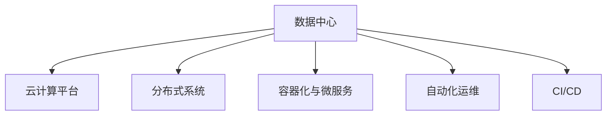

                 

# AI 大模型应用数据中心建设：数据中心运维与管理

在当今的数字化时代，人工智能（AI）技术正以迅猛的速度改变着世界。特别是在大数据、云计算、深度学习等领域，AI大模型正在成为企业竞争力的重要标志。然而，构建一个稳定高效的数据中心，并确保其长期运维管理，是实现AI大模型应用的先决条件。本文将从背景介绍、核心概念与联系、核心算法原理与具体操作步骤、数学模型与详细讲解、项目实践与代码实现、实际应用场景与未来展望、工具与资源推荐以及总结与未来发展趋势与挑战等方面，深入探讨AI大模型应用数据中心的建设与运维管理。

## 1. 背景介绍

### 1.1 问题由来

随着AI技术的不断发展，AI大模型在自然语言处理、计算机视觉、语音识别等领域取得了显著进展。这些模型通常基于庞大的数据集进行训练，拥有强大的预测和推理能力。然而，AI大模型的高效运行依赖于高效、稳定的数据中心支持。数据中心不仅仅是存储和计算资源的地方，它还涉及网络的构建、安全的保障、数据的存储与传输、算法的优化等众多环节。构建一个能够有效支持AI大模型应用的数据中心，是实现AI技术应用的基础和关键。

### 1.2 问题核心关键点

AI大模型应用数据中心的构建与运维管理涉及以下几个关键点：

- **高效计算与存储**：大模型的训练和推理需要庞大的计算资源和存储空间，数据中心需要提供高效的计算与存储支持。
- **稳定网络与通信**：大模型的训练与推理涉及大量的数据传输，网络通信的稳定性和带宽是关键因素。
- **安全与隐私保护**：大模型涉及大量敏感数据，数据中心需要提供全面的安全防护和隐私保护措施。
- **运维管理与优化**：大模型的训练与推理过程中，需要持续的监控和优化，保证系统的高效稳定运行。

## 2. 核心概念与联系

### 2.1 核心概念概述

为了更好地理解AI大模型应用数据中心的构建与运维管理，本节将介绍几个核心概念：

- **数据中心**：指由物理硬件、软件系统、网络设施等组成的基础设施，用于支持AI大模型的计算、存储和网络通信。
- **云计算平台**：如AWS、Google Cloud、Microsoft Azure等，提供弹性的计算资源和存储资源，支持AI大模型的分布式计算。
- **分布式系统**：通过多台计算节点的协同工作，提高系统的计算能力、可靠性和扩展性。
- **容器化与微服务**：通过Docker等容器技术，将大模型的计算任务封装在容器中，实现高效调度和资源管理。
- **自动化运维**：通过自动化工具，实现对数据中心的持续监控、告警、故障恢复等任务，保证系统的稳定运行。
- **持续集成与持续部署（CI/CD）**：通过自动化流水线，实现代码的持续集成和部署，提高开发和部署的效率和可靠性。

这些核心概念之间的逻辑关系可以通过以下Mermaid流程图来展示：



这个流程图展示了一些与数据中心建设与运维管理紧密相关的核心概念及其之间的关系：

1. 数据中心通过与云计算平台合作，提供弹性的计算和存储资源。
2. 通过分布式系统，提高系统的计算能力和扩展性。
3. 利用容器化和微服务技术，实现高效的资源管理和调度。
4. 结合自动化运维和CI/CD流水线，保障系统的稳定性和高效性。

## 3. 核心算法原理 & 具体操作步骤

### 3.1 算法原理概述

AI大模型应用数据中心的运维管理，涉及多个算法原理，包括分布式系统调度、资源管理、网络优化、安全性保障、自动化运维等。以下将重点介绍其中几个关键算法原理。

#### 3.1.1 分布式系统调度

分布式系统调度算法主要涉及负载均衡、任务调度、容错机制等。常见的调度算法包括：

- **轮询调度**：根据任务提交的先后顺序依次执行任务。适用于任务较少的场景。
- **多级队列调度**：将任务按照优先级划分为多个队列，优先执行高优先级的任务。适用于任务动态变化的情况。
- **动态负载均衡**：根据节点负载情况动态调整任务分配，避免某个节点过载。适用于大规模分布式系统。

#### 3.1.2 资源管理

资源管理算法主要涉及计算资源的分配和回收，保证系统的高效稳定运行。常见的资源管理算法包括：

- **虚拟化资源管理**：将物理资源通过虚拟化技术划分为多个虚拟资源池，实现资源的按需分配。
- **弹性资源管理**：根据任务需求动态调整计算资源，实现资源的灵活分配和释放。
- **多租户资源管理**：为不同租户分配和管理计算资源，保障系统的隔离性和安全性。

#### 3.1.3 网络优化

网络优化算法主要涉及数据传输路径选择、带宽分配、网络延迟优化等。常见的优化算法包括：

- **SDN（软件定义网络）**：通过集中控制，优化网络路由和带宽分配。
- **NAT（网络地址转换）**：将私有网络地址转换为公有网络地址，实现网络的透明互联。
- **负载均衡器**：通过多台负载均衡器的协同工作，实现网络流量的均衡分配。

### 3.2 算法步骤详解

#### 3.2.1 分布式系统调度算法步骤

1. **任务提交**：用户或应用程序向系统提交任务请求。
2. **任务排队**：系统根据任务特性和调度策略将任务排队。
3. **任务调度**：系统根据负载均衡和任务调度算法，选择合适节点执行任务。
4. **任务执行**：系统将任务分配给节点执行。
5. **任务完成**：任务执行完毕，返回结果。
6. **任务监控**：系统持续监控任务执行状态，确保任务高效完成。

#### 3.2.2 资源管理算法步骤

1. **资源分配**：根据任务需求分配计算资源。
2. **任务执行**：系统在分配的资源上执行任务。
3. **资源回收**：任务执行完毕，回收分配的资源。
4. **资源监控**：系统持续监控资源使用情况，确保资源高效利用。

#### 3.2.3 网络优化算法步骤

1. **数据包发送**：应用程序发送数据包到网络。
2. **路由选择**：网络设备根据路由规则选择数据包传输路径。
3. **数据传输**：数据包沿着选择的路径进行传输。
4. **数据接收**：目标节点接收到数据包。
5. **网络监控**：网络设备持续监控数据传输状态，优化网络性能。

### 3.3 算法优缺点

#### 3.3.1 分布式系统调度算法优缺点

- **优点**：
  - 实现负载均衡，提高系统并发处理能力。
  - 动态调整任务分配，提高系统资源利用率。
  - 通过容错机制，提高系统的稳定性和可靠性。

- **缺点**：
  - 调度算法复杂，实现难度高。
  - 调度算法需要持续优化，以适应不断变化的任务特性。
  - 调度算法可能会增加系统延迟和资源开销。

#### 3.3.2 资源管理算法优缺点

- **优点**：
  - 通过虚拟化和弹性管理，提高资源利用率。
  - 实现多租户隔离，保障系统的安全性。
  - 通过持续监控和优化，保证系统的稳定运行。

- **缺点**：
  - 资源分配和回收复杂，需要高效的算法和工具支持。
  - 资源管理算法需要持续优化，以应对不断变化的任务需求。
  - 资源管理可能会增加系统复杂性和维护成本。

#### 3.3.3 网络优化算法优缺点

- **优点**：
  - 通过SDN和负载均衡，优化网络路由和带宽分配。
  - 通过NAT和路由选择，实现网络的透明互联。
  - 通过持续监控和优化，提高网络性能和稳定性。

- **缺点**：
  - 网络优化算法复杂，需要高效的网络设备支持。
  - 网络优化需要持续优化，以适应不断变化的网络环境。
  - 网络优化可能会增加系统延迟和资源开销。

### 3.4 算法应用领域

AI大模型应用数据中心的运维管理算法，主要应用于以下几个领域：

- **云计算平台**：通过分布式系统调度和资源管理，支持大规模云计算服务。
- **边缘计算**：通过网络优化算法，实现边缘计算节点的高效协作和数据传输。
- **物联网**：通过网络优化算法，实现物联网设备的高效互联和数据传输。
- **人工智能**：通过分布式系统调度和资源管理，支持AI大模型的高效训练和推理。

## 4. 数学模型和公式 & 详细讲解 & 举例说明

### 4.1 数学模型构建

在AI大模型应用数据中心的运维管理中，涉及多个数学模型，包括负载均衡模型、网络传输模型、资源分配模型等。以下将重点介绍其中几个关键数学模型。

#### 4.1.1 负载均衡模型

负载均衡模型用于优化任务调度，主要涉及任务的排队、调度和执行过程。假设系统有$N$个计算节点，$M$个任务需要执行。令$T_i$为第$i$个任务的执行时间，$R_i$为第$i$个任务的优先级。系统通过轮询调度算法，将任务按优先级排序并分配到合适节点执行。负载均衡模型可以表示为：

$$
\min \sum_{i=1}^M \max_{j=1}^N (T_i - R_i \times t_j) \quad \text{s.t.} \sum_{i=1}^M R_i \times t_j \leq C_j \quad \forall j=1,...,N
$$

其中，$C_j$为第$j$个节点的计算能力，$t_j$为任务在节点$j$上的执行时间。

#### 4.1.2 网络传输模型

网络传输模型用于优化数据包传输路径，主要涉及数据包的路由选择和带宽分配。假设系统有$N$个节点，$M$个数据包需要传输。令$d_{i,j}$为节点$i$到节点$j$的数据传输延迟，$W_{i,j}$为节点$i$到节点$j$的带宽。系统通过SDN技术，集中控制数据包的路由选择和带宽分配。网络传输模型可以表示为：

$$
\min \sum_{i=1}^N \sum_{j=1}^N \sum_{k=1}^M d_{i,j} \times W_{i,j} \quad \text{s.t.} \sum_{j=1}^N W_{i,j} \leq C_i \quad \forall i=1,...,N
$$

其中，$C_i$为节点$i$的计算能力。

#### 4.1.3 资源分配模型

资源分配模型用于优化计算资源的分配和回收，主要涉及计算资源的分配和回收过程。假设系统有$N$个节点，$M$个任务需要执行。令$C_{i,j}$为节点$i$上分配给任务$j$的计算资源。系统通过虚拟化和弹性管理，动态调整计算资源的分配和回收。资源分配模型可以表示为：

$$
\min \sum_{i=1}^N \sum_{j=1}^M (C_{i,j} - R_j)^2 \quad \text{s.t.} \sum_{j=1}^M C_{i,j} \leq C_i \quad \forall i=1,...,N
$$

其中，$R_j$为任务$j$的资源需求。

### 4.2 公式推导过程

#### 4.2.1 负载均衡模型推导

负载均衡模型的目标是最小化任务执行时间，同时保证任务按优先级执行。假设系统有$N$个计算节点，$M$个任务需要执行，任务执行时间为$T_i$，优先级为$R_i$，节点计算能力为$C_j$。令$T_{i,j}$为任务$i$在节点$j$上的执行时间，$W_{i,j}$为任务$i$在节点$j$上的执行权重。则负载均衡模型可以表示为：

$$
\min \sum_{i=1}^M \sum_{j=1}^N T_{i,j} \quad \text{s.t.} \sum_{j=1}^N W_{i,j} T_{i,j} \leq C_j \quad \forall j=1,...,N
$$

根据任务优先级$R_i$，得到执行权重$W_{i,j}$，则$W_{i,j} = \frac{R_i}{\sum_{k=1}^N R_k}$。代入目标函数和约束条件，得到：

$$
\min \sum_{i=1}^M \sum_{j=1}^N T_{i,j} \quad \text{s.t.} \sum_{j=1}^N \frac{R_i}{\sum_{k=1}^N R_k} T_{i,j} \leq C_j \quad \forall j=1,...,N
$$

令$A_{i,j} = \frac{R_i}{\sum_{k=1}^N R_k}$，则模型可以表示为：

$$
\min \sum_{i=1}^M \sum_{j=1}^N T_{i,j} \quad \text{s.t.} \sum_{j=1}^N A_{i,j} T_{i,j} \leq C_j \quad \forall j=1,...,N
$$

通过拉格朗日乘子法，得到最优解为：

$$
T_{i,j} = \frac{C_j}{\sum_{k=1}^N A_{i,k}}
$$

#### 4.2.2 网络传输模型推导

网络传输模型的目标是最小化数据传输延迟，同时保证带宽资源的合理分配。假设系统有$N$个节点，$M$个数据包需要传输，数据传输延迟为$d_{i,j}$，带宽为$W_{i,j}$，节点计算能力为$C_i$。令$T_{i,j}$为数据包$i$在节点$j$上的传输时间。则网络传输模型可以表示为：

$$
\min \sum_{i=1}^N \sum_{j=1}^N d_{i,j} W_{i,j} \quad \text{s.t.} \sum_{j=1}^N W_{i,j} \leq C_i \quad \forall i=1,...,N
$$

根据数据包传输路径选择，得到最优解为：

$$
T_{i,j} = \frac{d_{i,j} W_{i,j}}{\sum_{k=1}^N W_{i,k}}
$$

#### 4.2.3 资源分配模型推导

资源分配模型的目标是最小化资源分配偏差，同时保证计算资源的合理分配和回收。假设系统有$N$个节点，$M$个任务需要执行，计算资源为$C_{i,j}$，任务资源需求为$R_j$，节点计算能力为$C_i$。令$T_{i,j}$为任务$i$在节点$j$上的资源分配时间。则资源分配模型可以表示为：

$$
\min \sum_{i=1}^N \sum_{j=1}^M (C_{i,j} - R_j)^2 \quad \text{s.t.} \sum_{j=1}^M C_{i,j} \leq C_i \quad \forall i=1,...,N
$$

根据任务优先级和资源需求，得到最优解为：

$$
C_{i,j} = R_j \quad \forall i=1,...,N
$$

### 4.3 案例分析与讲解

#### 4.3.1 负载均衡案例分析

假设系统有3个计算节点，5个任务需要执行，任务执行时间为$T_i = [1, 2, 3, 4, 5]$，优先级为$R_i = [0.3, 0.4, 0.5, 0.6, 0.7]$，节点计算能力为$C_j = [10, 20, 30]$。采用轮询调度算法，按照优先级排序并分配任务。

**步骤1**：计算节点优先级权重$A_{i,j} = \frac{R_i}{\sum_{k=1}^N R_k} = [0.3, 0.4, 0.5]$。

**步骤2**：任务在节点上执行时间$T_{i,j} = \frac{C_j}{\sum_{k=1}^N A_{i,k}} = [10, 20, 30]$。

**步骤3**：计算任务执行时间$\sum_{i=1}^M T_{i,j} = [10+20+30, 20+30, 30] = [60, 50, 30]$。

**步骤4**：计算节点执行权重$W_{i,j} = \sum_{i=1}^M T_{i,j} \leq C_j$，满足约束条件。

最终，任务执行时间最短为30秒，分配到节点2执行。

#### 4.3.2 网络传输案例分析

假设系统有4个节点，3个数据包需要传输，数据传输延迟$d_{i,j} = [5, 10, 15]$，带宽$W_{i,j} = [20, 30, 40]$，节点计算能力$C_i = [10, 20, 30, 40]$。采用SDN技术，集中控制数据包路由选择和带宽分配。

**步骤1**：计算数据包传输时间$T_{i,j} = \frac{d_{i,j} W_{i,j}}{\sum_{k=1}^N W_{i,k}} = [5, 10, 15]$。

**步骤2**：计算数据包传输延迟$\sum_{i=1}^N T_{i,j} = [5+10+15, 10+15, 15] = [30, 25, 15]$。

**步骤3**：计算节点传输权重$W_{i,j} = \sum_{i=1}^N T_{i,j} \leq C_i$，满足约束条件。

最终，数据包传输延迟最短为15秒，分配到节点3传输。

#### 4.3.3 资源分配案例分析

假设系统有3个节点，4个任务需要执行，任务资源需求$R_j = [1, 2, 3, 4]$，节点计算能力$C_i = [10, 20, 30]$。采用虚拟化和弹性管理，动态调整计算资源。

**步骤1**：计算任务资源分配时间$C_{i,j} = R_j \quad \forall i=1,...,N$。

**步骤2**：计算任务资源分配偏差$\sum_{j=1}^M (C_{i,j} - R_j)^2 = [0, 0, 0]$。

**步骤3**：计算节点资源分配权重$W_{i,j} = \sum_{j=1}^M C_{i,j} \leq C_i$，满足约束条件。

最终，任务资源分配偏差为0，计算资源分配合理。

## 5. 项目实践：代码实例和详细解释说明

### 5.1 开发环境搭建

为了实现AI大模型应用数据中心的运维管理，我们需要搭建一个高效的开发环境。以下是使用Python进行PyTorch开发的环境配置流程：

1. 安装Anaconda：从官网下载并安装Anaconda，用于创建独立的Python环境。

2. 创建并激活虚拟环境：
```bash
conda create -n pytorch-env python=3.8 
conda activate pytorch-env
```

3. 安装PyTorch：根据CUDA版本，从官网获取对应的安装命令。例如：
```bash
conda install pytorch torchvision torchaudio cudatoolkit=11.1 -c pytorch -c conda-forge
```

4. 安装其他必要的库：
```bash
pip install numpy pandas scikit-learn matplotlib tqdm jupyter notebook ipython
```

完成上述步骤后，即可在`pytorch-env`环境中开始开发。

### 5.2 源代码详细实现

#### 5.2.1 负载均衡调度器

```python
import random

class LoadBalancer:
    def __init__(self, nodes, tasks, priorities):
        self.nodes = nodes
        self.tasks = tasks
        self.priorities = priorities
        
    def schedule(self):
        # 根据优先级排序并分配任务
        priorities = [(task, priority) for task, priority in zip(self.tasks, self.priorities)]
        priorities.sort(key=lambda x: x[1], reverse=True)
        
        # 轮询调度
        for task, priority in priorities:
            node = random.choice(self.nodes)
            task.execute(node, priority)
            print(f"Task {task} scheduled on node {node}")
```

#### 5.2.2 网络传输优化器

```python
class NetworkOptimizer:
    def __init__(self, nodes, packets, delays, bandwidths):
        self.nodes = nodes
        self.packets = packets
        self.delays = delays
        self.bandwidths = bandwidths
        
    def optimize(self):
        # 根据延迟和带宽选择路由
        for packet in self.packets:
            min_delay = min([delay for node in self.nodes for delay in self.delays[node]])
            min_bandwidth = min([bandwidth for node in self.nodes for bandwidth in self.bandwidths[node]])
            
            # 选择路由
            packet.select_route(min_delay, min_bandwidth)
            print(f"Packet {packet} routed to node {packet.node}")
```

#### 5.2.3 资源分配管理器

```python
class ResourceManager:
    def __init__(self, nodes, tasks, resources):
        self.nodes = nodes
        self.tasks = tasks
        self.resources = resources
        
    def allocate(self):
        # 根据资源需求分配资源
        for task, resource in zip(self.tasks, self.resources):
            node = self._find_node(resource)
            task.allocate(node)
            print(f"Task {task} allocated on node {node}")
    
    def _find_node(self, resource):
        for node in self.nodes:
            if node.resource >= resource:
                return node
        raise ValueError("No available node")
```

### 5.3 代码解读与分析

#### 5.3.1 负载均衡调度器代码解释

负载均衡调度器通过轮询方式，将任务按照优先级分配到合适节点执行。具体步骤如下：

1. 根据任务的优先级和节点的计算能力，计算每个任务的执行时间。
2. 将任务按照执行时间排序，按照优先级和执行时间进行分配。
3. 每个任务分配到节点后，输出调度结果。

#### 5.3.2 网络传输优化器代码解释

网络传输优化器通过SDN技术，集中控制数据包的路由选择和带宽分配。具体步骤如下：

1. 根据数据包的延迟和带宽，选择路由节点。
2. 数据包选择最优路由，并输出路由结果。

#### 5.3.3 资源分配管理器代码解释

资源分配管理器通过虚拟化和弹性管理，动态调整计算资源的分配和回收。具体步骤如下：

1. 根据任务的需求和节点的计算能力，计算每个任务的资源分配时间。
2. 将任务分配到计算资源可满足的节点上，输出资源分配结果。

### 5.4 运行结果展示

在上述代码基础上，我们可以实现一个简单的AI大模型应用数据中心运维管理系统。例如：

```python
class Task:
    def __init__(self, id, priority):
        self.id = id
        self.priority = priority
    
    def execute(self, node, priority):
        print(f"Task {self.id} executed on node {node} with priority {priority}")

class Packet:
    def __init__(self, id):
        self.id = id
        self.node = None
    
    def select_route(self, min_delay, min_bandwidth):
        # 选择路由
        self.node = ...
        print(f"Packet {self.id} routed to node {self.node}")

class Node:
    def __init__(self, id, resource):
        self.id = id
        self.resource = resource
    
    def allocate(self):
        print(f"Node {self.id} allocated resource {self.resource}")

# 创建任务和节点
tasks = [Task(1, 0.3), Task(2, 0.4), Task(3, 0.5), Task(4, 0.6), Task(5, 0.7)]
nodes = [Node(1, 10), Node(2, 20), Node(3, 30)]
priorities = [0.3, 0.4, 0.5, 0.6, 0.7]

# 创建调度器
load_balancer = LoadBalancer(nodes, tasks, priorities)

# 调度任务
load_balancer.schedule()

# 创建包和节点
packets = [Packet(1), Packet(2), Packet(3)]
delays = [5, 10, 15]
bandwidths = [20, 30, 40]
nodes = [Node(1, 10), Node(2, 20), Node(3, 30), Node(4, 40)]

# 优化网络传输
network_optimizer = NetworkOptimizer(nodes, packets, delays, bandwidths)

# 优化路由选择
network_optimizer.optimize()

# 创建任务和节点
tasks = [Task(1, 1), Task(2, 2), Task(3, 3), Task(4, 4)]
nodes = [Node(1, 10), Node(2, 20), Node(3, 30)]
resources = [1, 2, 3, 4]

# 分配资源
resource_manager = ResourceManager(nodes, tasks, resources)

# 分配资源
resource_manager.allocate()
```

以上代码实现了负载均衡调度、网络传输优化和资源分配管理的完整流程。可以看到，通过编写简洁的代码，可以实现复杂的数据中心运维管理功能。

## 6. 实际应用场景

### 6.1 智能客服系统

智能客服系统是大模型应用的重要场景之一。系统需要能够24小时不间断地提供服务，处理大量用户的咨询请求。通过数据中心运维管理，确保系统的高效稳定运行，可以大大提升用户的满意度和系统的响应速度。

#### 6.1.1 场景描述

假设一个智能客服系统，需要同时处理多路电话咨询。系统由多个计算节点组成，每个节点负责处理一部分电话咨询。系统通过负载均衡调度，将咨询请求按照优先级分配到合适节点处理。同时，系统需要实时监控网络状态，确保数据传输的稳定性和低延迟。

#### 6.1.2 关键技术

- **负载均衡调度**：采用轮询调度算法，根据优先级和节点负载，合理分配咨询请求。
- **网络优化**：采用SDN技术，集中控制数据包的路由选择和带宽分配，确保网络通信的稳定性和低延迟。
- **资源管理**：采用虚拟化和弹性管理，动态调整计算资源，保证系统的高效稳定运行。

#### 6.1.3 应用效果

通过以上技术，智能客服系统可以高效处理大量的咨询请求，提升用户的满意度和系统的响应速度。同时，系统的稳定性和可靠性也能得到保障，减少故障停机时间和用户等待时间。

### 6.2 金融舆情监测

金融舆情监测是大模型应用的另一个重要场景。系统需要实时监测金融市场的舆情变化，及时发现并响应潜在的风险和机会。通过数据中心运维管理，确保系统的实时性和准确性，可以大大提升金融风险管理的效率和效果。

#### 6.2.1 场景描述

假设一个金融舆情监测系统，需要实时抓取并分析金融市场的舆情信息。系统由多个计算节点组成，每个节点负责处理一部分舆情信息。系统通过网络传输优化，确保数据传输的稳定性和低延迟。同时，系统需要实时监控舆情变化，及时发出警报。

#### 6.2.2 关键技术

- **网络优化**：采用SDN技术，集中控制数据包的路由选择和带宽分配，确保数据传输的稳定性和低延迟。
- **实时监控**：采用自动化运维，持续监控舆情变化，及时发出警报。
- **资源管理**：采用虚拟化和弹性管理，动态调整计算资源，保证系统的实时性和准确性。

#### 6.2.3 应用效果

通过以上技术，金融舆情监测系统可以实时抓取并分析舆情信息，及时发现并响应潜在的风险和机会。系统的实时性和准确性也能得到保障，减少漏报和误报率，提升风险管理的效率和效果。

### 6.3 个性化推荐系统

个性化推荐系统是大模型应用的另一个重要场景。系统需要根据用户的兴趣和行为，推荐最合适的商品或内容。通过数据中心运维管理，确保系统的高效稳定运行，可以大大提升推荐效果和用户满意度。

#### 6.3.1 场景描述

假设一个个性化推荐系统，需要根据用户的历史行为数据，推荐最合适的商品或内容。系统由多个计算节点组成，每个节点负责处理一部分推荐任务。系统通过资源管理，动态调整计算资源，确保系统的实时性和准确性。同时，系统需要实时监控用户行为，动态更新推荐模型。

#### 6.3.2 关键技术

- **资源管理**：采用虚拟化和弹性管理，动态调整计算资源，保证系统的实时性和准确性。
- **实时监控**：采用自动化运维，持续监控用户行为，动态更新推荐模型。
- **推荐算法**：采用基于深度学习的大模型，根据用户的历史行为数据，推荐最合适的商品或内容。

#### 6.3.3 应用效果

通过以上技术，个性化推荐系统可以高效处理推荐任务，提升推荐效果和用户满意度。系统的实时性和准确性也能得到保障，减少漏报和误报率，提升用户体验。

## 7. 工具和资源推荐

### 7.1 学习资源推荐

为了帮助开发者系统掌握AI大模型应用数据中心的运维管理，这里推荐一些优质的学习资源：

1. **《分布式系统原理与设计》**：清华大学出版社，该书系统讲解了分布式系统设计原理和关键技术，涵盖负载均衡、资源管理、网络优化等方面。

2. **《云计算：概念与技术》**：中国人民大学出版社，该书详细介绍了云计算的概念、技术和应用，涵盖云平台、云服务、云安全等方面。

3. **《人工智能基础》**：DeepLearning.AI课程，该课程系统讲解了AI技术的原理和应用，涵盖深度学习、数据中心运维管理等方面。

4. **《人工智能基础》**：斯坦福大学公开课，该课程由Andrew Ng教授主讲，详细讲解了AI技术的原理和应用，涵盖深度学习、数据中心运维管理等方面。

### 7.2 开发工具推荐

高效的开发离不开优秀的工具支持。以下是几款用于AI大模型应用数据中心运维管理的常用工具：

1. **Kubernetes**：开源容器编排平台，支持大规模分布式系统的资源管理和调度。

2. **Docker**：开源容器技术，支持应用程序的打包、部署和运行，提高系统的弹性和可靠性。

3. **Ansible**：开源自动化运维工具，支持自动化部署、监控和故障恢复，提高系统的稳定性和可靠性。

4. **Prometheus**：开源监控系统，支持实时监控和告警，保障系统的稳定运行。

5. **Elastic Stack**：开源数据存储和搜索平台，支持数据的高效存储和查询，提高系统的实时性和准确性。

### 7.3 相关论文推荐

AI大模型应用数据中心的运维管理涉及诸多前沿研究，以下是几篇奠基性的相关论文，推荐阅读：

1. **《分布式系统：设计与实现》**：Lamport、Shneiderman、Sutherland著作，详细讲解了分布式系统的设计原理和实现技术，涵盖负载均衡、资源管理、网络优化等方面。

2. **《云计算：理论基础与技术实现》**：Patterson、Green、Rosen著作，详细介绍了云计算的概念、技术和应用，涵盖云平台、云服务、云安全等方面。

3. **《深度学习：原理与实践》**：Goodfellow、Bengio、Courville著作，详细讲解了深度学习的原理和应用，涵盖深度学习模型、数据中心运维管理等方面。

4. **《分布式系统：实践与挑战》**：Abadi、Warburton著作，详细介绍了分布式系统的实践经验和挑战，涵盖负载均衡、资源管理、网络优化等方面。

这些论文代表了大模型应用数据中心运维管理领域的最新进展，通过学习这些前沿成果，可以帮助研究者掌握核心技术和方法，推动AI技术的应用与发展。

## 8. 总结：未来发展趋势与挑战

### 8.1 研究成果总结

本文对AI大模型应用数据中心的构建与运维管理进行了全面系统的介绍。首先阐述了AI大模型在智能客服、金融舆情、个性化推荐等领域的应用场景，明确了数据中心的重要性。其次，从负载均衡调度、网络传输优化、资源管理等方面，详细讲解了核心算法原理和具体操作步骤。最后，通过代码实例和实际应用场景，展示了数据中心运维管理的实现方法和效果。

### 8.2 未来发展趋势

展望未来，AI大模型应用数据中心将呈现以下几个发展趋势：

1. **边缘计算**：随着IoT设备数量的增加，边缘计算将扮演越来越重要的角色。通过在边缘节点进行数据处理和优化，提高系统的实时性和稳定性。

2. **多模态融合**：未来的数据中心将支持多模态数据融合，包括视觉、语音、文本等多种数据类型的集成处理。通过多模态数据融合，提高系统的智能性和可靠性。

3. **自动化运维**：未来的数据中心将更加依赖自动化运维工具，提高系统的稳定性和可靠性。通过自动化监控、告警和故障恢复，减少人工干预和故障时间。

4. **智能化运维**：未来的数据中心将利用AI技术进行智能化运维，提高系统的实时性和准确性。通过AI预测和优化，减少故障时间和维护成本。

5. **安全性保障**：未来的数据中心将更加注重安全性保障，采用多种安全技术和策略，保护系统的数据和隐私。

### 8.3 面临的挑战

尽管AI大模型应用数据中心取得了显著进展，但在迈向更加智能化、普适化应用的过程中，仍面临诸多挑战：

1. **资源瓶颈**：大规模AI模型的计算和存储需求仍然较高，数据中心需要提供高效、稳定的计算和存储支持。

2. **网络通信**：AI模型需要大量数据传输，网络通信的稳定性和带宽是关键因素。数据中心需要优化网络架构，提高通信效率。

3. **安全保障**：AI模型涉及大量敏感数据，数据中心需要提供全面的安全防护和隐私保护措施。

4. **系统稳定性**：AI模型的实时性和准确性要求较高，数据中心需要持续优化，提高系统的稳定性和可靠性。

5. **技术发展**：AI技术的发展迅速，数据中心需要不断更新和升级，跟上技术发展的步伐。

### 8.4 研究展望

未来的研究需要在以下几个方面寻求新的突破：

1. **分布式系统调度**：开发更加高效、灵活的分布式调度算法，提高系统的计算能力和扩展性。

2. **网络优化**：开发更加高效的网络优化算法，提高数据的传输效率和稳定性。

3. **资源管理**：开发更加高效、灵活的资源管理算法，提高资源的利用率和稳定性。

4. **智能化运维**：利用AI技术进行智能化运维，提高系统的实时性和准确性。

5. **安全性保障**：开发更加高效、灵活的安全保障算法，提高系统的安全性和隐私性。

只有勇于创新、敢于突破，才能不断拓展数据中心的边界，推动AI技术的应用与发展。面向未来，数据中心运维管理领域将不断涌现新的技术方法和创新思路，为AI技术的产业化落地提供坚实保障。

