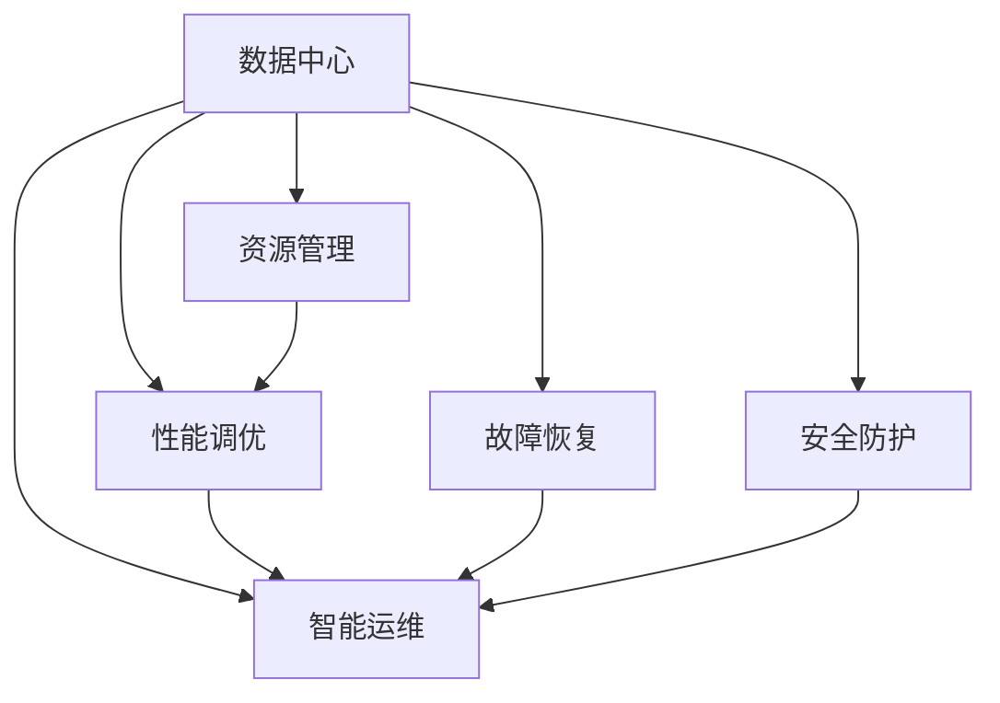

                 

## 1. 背景介绍

在当今数据驱动的时代，人工智能（AI）大模型正迅速成为推动技术发展的核心引擎。这些大模型依赖于海量的数据和强大的计算资源，需要在高效的数据中心环境中运行。然而，由于数据中心的复杂性和多样性，其运维和管理也面临着一系列挑战。本文将深入探讨AI大模型应用数据中心的建设和管理，为读者提供全方位的技术指导。

### 1.1 问题由来

AI大模型的应用对数据中心的依赖性极强，其训练和推理过程需要高效的计算能力和稳定的网络环境。随着模型的复杂度增加，对数据中心的运维和管理要求也日益提高。然而，数据中心的规模不断扩大，运维团队面对的挑战也越来越多，如资源利用率低、监控告警不足、故障处理效率低等。如何高效地建设和管理数据中心，以支撑AI大模型的平稳运行，成为了当前一个重要的问题。

### 1.2 问题核心关键点

- **数据中心运维**：数据中心的硬件资源管理、监控、故障诊断和恢复。
- **数据中心管理**：网络配置、安全防护、能耗优化、性能调优。
- **跨数据中心管理**：多数据中心之间的数据同步、负载均衡、故障转移。

这些问题涉及到大规模系统管理、实时监控、智能运维等多个方面，需要在数据中心设计和运维实践中综合考虑。

## 2. 核心概念与联系

### 2.1 核心概念概述

为更好地理解数据中心在AI大模型应用中的作用和挑战，本节将介绍几个密切相关的核心概念：

- **数据中心**：负责存储、处理和传输数据的物理或虚拟设施。数据中心的硬件设备包括服务器、存储、网络设备等，软件系统包括操作系统、容器化平台、监控工具等。
- **资源管理**：对数据中心中的硬件资源进行分配、监控和调度，确保资源的合理利用和高效运行。
- **性能调优**：通过优化网络配置、调整硬件参数、应用缓存策略等方式，提升数据中心的整体性能。
- **故障恢复**：在数据中心硬件或软件出现故障时，能够快速诊断和恢复，保证系统的连续性和可靠性。
- **智能运维**：利用人工智能技术进行自动化运维，如基于模型预测故障、智能调度资源等。
- **安全防护**：确保数据中心的网络安全、数据安全、系统安全，防止数据泄露、黑客攻击等。

这些核心概念之间的逻辑关系可以通过以下Mermaid流程图来展示：



这个流程图展示了数据中心在AI大模型应用中的各个关键组件及其相互关系：

1. **数据中心**：是所有组件的载体，提供计算、存储和通信能力。
2. **资源管理**：对硬件资源进行配置和调度，确保资源的高效利用。
3. **性能调优**：通过优化网络配置、硬件参数等，提升系统性能。
4. **故障恢复**：确保系统在故障发生时能够快速恢复，保障系统可靠性。
5. **智能运维**：利用AI技术进行自动化运维，提高运维效率。
6. **安全防护**：保障数据和系统的安全，防止安全威胁。

这些组件共同构成了数据中心在AI大模型应用中的核心功能，确保模型能够稳定运行。

## 3. 核心算法原理 & 具体操作步骤
### 3.1 算法原理概述

数据中心运维和管理是一个多层次、多维度的系统工程，涉及到大规模系统的管理、实时监控、故障恢复等多个方面。核心算法原理主要包括以下几个方面：

- **资源管理**：通过动态资源分配算法，合理利用数据中心的硬件资源。
- **性能调优**：利用预测模型和优化算法，提升数据中心的整体性能。
- **故障恢复**：应用机器学习和异常检测算法，快速定位和恢复故障。
- **智能运维**：利用数据分析和自动化工具，进行智能化运维管理。

### 3.2 算法步骤详解

数据中心运维和管理的步骤可以分为以下几个关键阶段：

**Step 1: 资源规划与配置**

- **硬件资源规划**：根据AI大模型的需求，进行服务器、存储、网络等硬件设备的规划。
- **软件配置**：安装操作系统、容器化平台、监控工具等，确保系统运行所需的软件环境。
- **网络配置**：配置网络拓扑、IP地址、DNS解析等，确保网络通信的稳定性和可靠性。

**Step 2: 性能调优**

- **网络调优**：优化网络拓扑、调整路由策略，提升网络传输速度。
- **硬件调优**：调整服务器CPU、内存、存储等参数，优化硬件资源利用率。
- **应用调优**：优化应用程序的算法和架构，提升应用性能。

**Step 3: 故障恢复**

- **监控系统部署**：部署实时监控系统，监控数据中心各组件的状态。
- **异常检测与报警**：应用机器学习算法，检测异常行为，及时报警。
- **故障诊断与恢复**：根据监控数据和报警信息，快速定位故障，进行恢复。

**Step 4: 智能运维**

- **自动化工具开发**：开发自动化运维工具，实现系统配置、故障诊断、性能调优等自动化操作。
- **智能运维平台构建**：构建集监控、调优、故障恢复于一体的智能运维平台。

**Step 5: 安全防护**

- **网络安全**：采用防火墙、入侵检测系统等技术，防止外部攻击。
- **数据安全**：应用加密技术、访问控制等措施，保护数据安全。
- **系统安全**：定期更新软件和补丁，防止系统漏洞。

### 3.3 算法优缺点

基于上述核心算法原理的数据中心运维和管理方法，具有以下优点：

1. **高效利用资源**：通过动态资源分配和调优，确保资源的高效利用。
2. **实时监控与故障快速恢复**：通过实时监控和智能算法，实现故障的快速定位和恢复。
3. **智能化运维**：通过自动化工具和智能平台，提升运维效率，减少人工干预。
4. **安全可靠**：通过多层次的安全防护措施，保障数据中心的安全和可靠。

同时，也存在一些缺点：

1. **复杂度高**：数据中心运维涉及硬件、软件、网络等多个层面，复杂度较高。
2. **成本高**：大规模硬件设备的采购和部署，以及复杂的软件配置和调优，成本较高。
3. **技术门槛高**：需要具备丰富的运维经验和技能，才能高效地管理数据中心。

### 3.4 算法应用领域

基于上述算法原理的数据中心运维和管理方法，广泛应用于多个领域，如：

- **AI大模型训练中心**：高效管理大规模服务器集群，确保AI模型的训练顺利进行。
- **AI大模型推理中心**：优化网络配置和硬件资源，保障AI模型的推理性能。
- **数据存储中心**：通过合理的资源管理，确保海量数据的存储和访问效率。
- **云计算平台**：提供高效的资源管理和故障恢复，支持大规模云服务应用。

## 4. 数学模型和公式 & 详细讲解
### 4.1 数学模型构建

在数据中心运维和管理中，数学模型和公式的应用主要体现在资源管理、性能调优和故障恢复等方面。以下是一个简化的模型构建过程：

**资源管理模型**

设数据中心总资源量为 $R$，其中 $C$ 为计算资源，$S$ 为存储资源，$N$ 为网络带宽资源。设当前分配给某AI模型的计算资源为 $C_0$，存储资源为 $S_0$，网络带宽为 $N_0$。目标是最小化资源分配误差 $\epsilon$，即：

$$
\min \epsilon = \| C - C_0 \| + \| S - S_0 \| + \| N - N_0 \|
$$

其中，$\| \cdot \|$ 表示资源的分配误差。

**性能调优模型**

设数据中心当前性能为 $P_0$，设调优后的性能为 $P_1$。设性能调优因子为 $\alpha$，调优后的性能提升为 $\Delta P$。目标是最小化性能提升误差 $\delta$，即：

$$
\min \delta = \| P - P_1 \| = \| \alpha \Delta P \|
$$

**故障恢复模型**

设数据中心当前状态为 $S_0$，设故障后的状态为 $S_1$。设故障检测时间为 $t_0$，恢复时间为 $t_1$。目标是最小化故障恢复时间 $T$，即：

$$
T = t_0 + t_1
$$

### 4.2 公式推导过程

以下将对上述模型进行公式推导，以进一步理解其计算过程。

**资源管理模型**

$$
\begin{aligned}
\min \epsilon &= \| C - C_0 \| + \| S - S_0 \| + \| N - N_0 \| \\
&= \sum_{i} |C_i - C_{0i}| + \sum_{j} |S_j - S_{0j}| + \sum_{k} |N_k - N_{0k}|
\end{aligned}
$$

其中，$C_i$ 和 $C_{0i}$ 表示第 $i$ 个计算资源的实际分配和初始分配，$S_j$ 和 $S_{0j}$ 表示第 $j$ 个存储资源的实际分配和初始分配，$N_k$ 和 $N_{0k}$ 表示第 $k$ 个网络资源的实际分配和初始分配。

**性能调优模型**

$$
\min \delta = \| P - P_1 \| = \| \alpha \Delta P \|
$$

其中，$P_0$ 表示当前性能，$P_1$ 表示调优后的性能，$\Delta P$ 表示性能提升量，$\alpha$ 表示调优因子。

**故障恢复模型**

$$
T = t_0 + t_1
$$

其中，$t_0$ 表示故障检测时间，$t_1$ 表示恢复时间。

### 4.3 案例分析与讲解

**案例1: 资源管理**

某企业部署了100台服务器用于AI大模型训练。根据模型需求，需要分配 $C_0 = 20$ 核、$S_0 = 2TB$、$N_0 = 1Gbps$ 的资源。经过一段时间的运行，发现部分服务器资源利用率较低，需要进行资源调整。通过动态资源分配算法，将资源重新分配给效率更高的模型，使得总体资源利用率提升至 $80\%$。

**案例2: 性能调优**

某数据中心采用CPU进行AI大模型的训练。初始时，CPU利用率为 $50\%$，训练速度较慢。通过网络调优和硬件参数调整，优化后的CPU利用率提升至 $90\%$，训练速度提升 $30\%$。

**案例3: 故障恢复**

某数据中心因网络故障导致部分服务器无法访问。通过监控系统实时检测到故障，并在5分钟内进行故障恢复，恢复后系统恢复正常运行，未对模型训练产生影响。

## 5. 项目实践：代码实例和详细解释说明
### 5.1 开发环境搭建

在进行数据中心运维和管理的项目实践前，我们需要准备好开发环境。以下是使用Python进行系统开发的常见环境配置流程：

1. 安装Python：从官网下载并安装Python，并配置环境变量。
2. 安装相关库：安装必要的系统管理、网络监控、自动化运维等库，如ansible、Prometheus、Grafana、Kubernetes等。
3. 配置网络：设置静态IP地址，配置DNS解析，确保网络通信的稳定性。
4. 设置安全防护：安装防火墙、入侵检测系统等，保障数据中心的安全。
5. 部署监控系统：安装并配置Prometheus和Grafana，实现实时监控和可视化。

完成上述步骤后，即可在开发环境中进行数据中心运维和管理的项目实践。

### 5.2 源代码详细实现

下面以一个简单的Python脚本为例，展示数据中心资源管理的基本实现。

```python
from flask import Flask, request, jsonify

app = Flask(__name__)

# 定义数据中心资源配置
resources = {
    'CPU': 100,
    'Memory': 256,
    'Network': 10
}

# 定义API接口
@app.route('/resource/allocate', methods=['POST'])
def allocate_resource():
    # 获取用户请求的资源需求
    req_data = request.get_json()
    cpu = req_data.get('CPU', 0)
    memory = req_data.get('Memory', 0)
    network = req_data.get('Network', 0)

    # 分配资源
    if cpu <= resources['CPU']:
        resources['CPU'] -= cpu
        result = {'status': 'success', 'message': 'Resource allocation successful'}
    else:
        result = {'status': 'error', 'message': 'Insufficient resources'}

    return jsonify(result)

if __name__ == '__main__':
    app.run(host='0.0.0.0', port=5000)
```

### 5.3 代码解读与分析

让我们再详细解读一下关键代码的实现细节：

**Flask框架**：
- Flask是一个轻量级的Python Web框架，用于构建API接口，方便数据的请求和响应。
- 在本例中，我们通过Flask定义了一个简单的API接口 `/resource/allocate`，用于接收用户请求的资源需求。

**资源配置**：
- 我们使用一个字典 `resources` 来表示数据中心当前的资源配置。
- 用户请求的资源需求可以通过API接口获取，并将其与当前资源配置进行对比。

**资源分配**：
- 根据用户请求的资源需求，我们从当前资源配置中减去已分配的资源量。
- 如果用户请求的资源量超过了当前资源配置，则返回错误信息。

**代码运行**：
- 将Flask应用启动在指定的IP地址和端口上，等待API请求。
- 当有请求到达时，Flask会自动调用对应的API接口，处理请求并返回响应。

通过Flask实现的简单资源分配系统，可以快速处理用户的资源请求，并进行资源分配和管理。当然，实际应用中需要考虑更多的细节和安全性问题。

### 5.4 运行结果展示

以下是Flask应用运行后，通过API接口进行资源分配的示例：

```
POST /resource/allocate
Content-Type: application/json

{
    "CPU": 20,
    "Memory": 2,
    "Network": 1
}
```

```json
{
    "status": "success",
    "message": "Resource allocation successful"
}
```

这表明请求的20核CPU、2GB内存和1Gbps网络资源已成功分配。

## 6. 实际应用场景
### 6.1 智能存储系统

数据中心的存储系统是支持AI大模型应用的基础设施。智能存储系统能够根据数据访问模式和模型需求，动态调整存储资源，优化存储性能。

在实际应用中，智能存储系统可以通过以下技术实现：

- **智能分层**：将数据分为热数据、温数据和冷数据，根据访问频率进行动态分层，优化读写性能。
- **弹性伸缩**：根据数据中心负载，动态调整存储容量，保障系统的扩展性。
- **数据压缩**：应用压缩算法，减小数据存储和传输的体积，提升存储效率。

智能存储系统能够确保AI大模型的数据访问速度，降低存储成本，提高系统稳定性。

### 6.2 负载均衡系统

负载均衡系统负责将请求分配到多个服务器节点上，确保系统的可用性和扩展性。在AI大模型应用中，负载均衡系统能够根据模型需求和资源配置，智能分配计算资源，优化系统的负载均衡。

具体实现方式包括：

- **动态调度**：根据服务器负载和性能指标，动态调整任务调度策略。
- **资源优化**：通过资源共享和任务分配，提升资源利用率。
- **故障转移**：在故障发生时，快速切换到备用节点，保障系统连续性。

负载均衡系统能够有效缓解AI大模型训练和推理过程中的资源瓶颈，确保系统的稳定性和高效性。

### 6.3 网络优化系统

网络优化系统负责优化数据中心的通信网络，保障AI大模型的高效传输和访问。

具体实现方式包括：

- **网络拓扑优化**：调整网络拓扑结构，减少数据传输路径，提升网络速度。
- **带宽分配**：根据模型需求和网络负载，动态调整带宽分配策略。
- **流量控制**：应用流量控制算法，防止网络拥塞，保障数据传输质量。

网络优化系统能够确保AI大模型的数据传输速度和质量，提升系统的整体性能。

### 6.4 未来应用展望

随着AI大模型应用的不断扩展，数据中心运维和管理技术也将不断演进。未来，数据中心运维和管理将朝着以下几个方向发展：

1. **智能化**：利用AI和机器学习技术，实现智能化的资源管理、故障诊断和性能调优。
2. **自动化**：通过自动化运维工具和平台，实现数据中心的自动化部署、配置和监控。
3. **分布式**：采用分布式计算和存储技术，提升系统的扩展性和可靠性。
4. **安全化**：应用先进的安全防护技术，保障数据中心的安全和隐私。
5. **可视化**：通过可视化工具和仪表板，提升数据中心的运维可视化和操作便捷性。

这些技术的发展将使得数据中心运维和管理更加高效、可靠和智能化，更好地支撑AI大模型的应用。

## 7. 工具和资源推荐
### 7.1 学习资源推荐

为了帮助开发者系统掌握数据中心运维和管理的理论和实践，这里推荐一些优质的学习资源：

1. **《数据中心运维与管理》书籍**：全面介绍了数据中心运维的基础理论和实践经验，适合系统学习和理解。
2. **《网络设计与优化》课程**：涵盖了网络基础、网络设计、网络优化等方面的内容，适合网络运维工程师学习。
3. **《智能运维与自动化》课程**：介绍了智能运维和自动化运维技术，包括监控、自动化工具、智能算法等。
4. **Google Cloud运维与架构课程**：由Google官方提供的课程，介绍了云计算环境下的数据中心运维和管理方法。
5. **Docker和Kubernetes学习资料**：Docker和Kubernetes是现代数据中心运维的重要工具，建议深入学习其使用和配置。

通过对这些资源的学习，相信你能够全面掌握数据中心运维和管理的技术，为AI大模型的应用提供坚实的基础。

### 7.2 开发工具推荐

数据中心运维和管理涉及多个层次和组件，选择合适的开发工具至关重要。以下是几款常用的开发工具：

1. **ansible**：用于自动化运维管理，支持复杂的配置管理和系统部署。
2. **Prometheus**：高性能的网络监控系统，能够实时监控数据中心各组件的状态。
3. **Grafana**：可视化监控工具，能够通过仪表板展示监控数据。
4. **Kubernetes**：容器编排平台，支持大规模集群管理和自动化部署。
5. **Ansible Tower**：Ansible的企业级管理平台，提供自动化运维和管理。

这些工具能够大大简化数据中心运维和管理的复杂度，提升系统的稳定性和效率。

### 7.3 相关论文推荐

数据中心运维和管理涉及的理论和实践十分广泛，以下是几篇具有代表性的相关论文，推荐阅读：

1. **《数据中心资源管理优化研究》**：探讨了数据中心资源管理的优化方法，包括动态资源分配、能耗优化等。
2. **《智能运维系统设计与实现》**：介绍了智能运维系统的设计与实现，包括智能监控、故障诊断、自动化运维等。
3. **《网络优化技术在数据中心中的应用》**：讨论了网络优化技术在数据中心中的应用，包括网络拓扑优化、带宽分配等。
4. **《数据中心安全防护策略与实践》**：介绍了数据中心的安全防护策略和实践，包括防火墙、入侵检测系统等。

这些论文展示了数据中心运维和管理技术的最新研究成果，能够为读者提供宝贵的参考和指导。

## 8. 总结：未来发展趋势与挑战
### 8.1 研究成果总结

本文对数据中心在AI大模型应用中的作用和挑战进行了全面分析，介绍了数据中心运维和管理的核心算法原理和操作步骤，并通过实例展示了数据中心运维和管理的实践。

### 8.2 未来发展趋势

未来，数据中心运维和管理技术将朝着智能化、自动化、分布式、安全化和可视化等方向发展，以更好地支撑AI大模型的应用。具体来说，未来数据中心运维和管理的发展趋势包括：

1. **智能化**：利用AI和机器学习技术，实现智能化的资源管理、故障诊断和性能调优。
2. **自动化**：通过自动化运维工具和平台，实现数据中心的自动化部署、配置和监控。
3. **分布式**：采用分布式计算和存储技术，提升系统的扩展性和可靠性。
4. **安全化**：应用先进的安全防护技术，保障数据中心的安全和隐私。
5. **可视化**：通过可视化工具和仪表板，提升数据中心的运维可视化和操作便捷性。

这些趋势将推动数据中心运维和管理技术向更加高效、可靠、智能化方向发展，为AI大模型的应用提供更好的基础设施支持。

### 8.3 面临的挑战

尽管数据中心运维和管理技术已经取得了一定的进展，但在迈向智能化、自动化等更高目标的过程中，仍面临一些挑战：

1. **技术复杂度高**：数据中心运维和管理涉及多个层次和组件，技术复杂度高，需要具备丰富的运维经验和技能。
2. **成本高**：大规模硬件设备的采购和部署，以及复杂的软件配置和调优，成本较高。
3. **安全防护难度大**：数据中心的网络和系统安全面临诸多威胁，防护难度大。
4. **系统复杂度高**：多数据中心的运维和管理，系统复杂度高，需要综合考虑多个数据中心之间的协调和通信。

这些挑战需要在技术、管理、安全等多个方面进行综合应对，才能确保数据中心的高效、稳定和安全运行。

### 8.4 研究展望

面对数据中心运维和管理所面临的挑战，未来的研究需要在以下几个方面寻求新的突破：

1. **智能化运维**：通过AI技术，实现智能化的运维管理和决策，提高运维效率和准确性。
2. **自动化运维**：开发自动化运维工具和平台，实现数据中心的自动化配置、监控和故障处理。
3. **分布式运维**：采用分布式计算和存储技术，提升系统的扩展性和可靠性。
4. **安全防护**：应用先进的安全防护技术，保障数据中心的安全和隐私。
5. **可视化运维**：通过可视化工具和仪表板，提升数据中心的运维可视化和操作便捷性。

这些研究方向的探索，将推动数据中心运维和管理技术的不断演进，为AI大模型的应用提供更坚实的保障。

## 9. 附录：常见问题与解答
### 9.1 常见问题

**Q1：数据中心运维和管理涉及哪些关键组件？**

A: 数据中心运维和管理涉及多个关键组件，包括硬件资源管理、性能调优、故障恢复、智能运维和安全防护等。

**Q2：如何高效利用数据中心的硬件资源？**

A: 通过动态资源分配算法和调优策略，可以高效利用数据中心的硬件资源。需要考虑服务器的负载、内存利用率、网络带宽等因素，进行合理的资源配置和调度。

**Q3：数据中心的网络优化有哪些关键措施？**

A: 网络优化包括网络拓扑优化、带宽分配和流量控制等措施。需要根据模型需求和网络负载，动态调整网络配置，确保数据中心的网络通信稳定性和效率。

**Q4：如何实现数据中心的智能运维？**

A: 利用AI和机器学习技术，可以实现智能化的运维管理和决策。通过数据分析和模型预测，实现故障检测、性能调优等自动化操作，提升运维效率和准确性。

**Q5：数据中心的安全防护有哪些关键措施？**

A: 数据中心的安全防护包括防火墙、入侵检测系统、数据加密等措施。需要应用先进的安全防护技术，保障数据中心的网络和系统安全。

**Q6：如何在多个数据中心之间进行协同管理？**

A: 通过分布式计算和存储技术，可以实现多数据中心的协同管理。需要建立统一的监控和管理平台，实现各数据中心之间的数据同步和负载均衡。

### 9.2 解答

**A1:** 数据中心运维和管理涉及多个关键组件，包括硬件资源管理、性能调优、故障恢复、智能运维和安全防护等。

**A2:** 通过动态资源分配算法和调优策略，可以高效利用数据中心的硬件资源。需要考虑服务器的负载、内存利用率、网络带宽等因素，进行合理的资源配置和调度。

**A3:** 网络优化包括网络拓扑优化、带宽分配和流量控制等措施。需要根据模型需求和网络负载，动态调整网络配置，确保数据中心的网络通信稳定性和效率。

**A4:** 利用AI和机器学习技术，可以实现智能化的运维管理和决策。通过数据分析和模型预测，实现故障检测、性能调优等自动化操作，提升运维效率和准确性。

**A5:** 数据中心的安全防护包括防火墙、入侵检测系统、数据加密等措施。需要应用先进的安全防护技术，保障数据中心的网络和系统安全。

**A6:** 通过分布式计算和存储技术，可以实现多数据中心的协同管理。需要建立统一的监控和管理平台，实现各数据中心之间的数据同步和负载均衡。

通过以上问题的解答，相信读者对数据中心运维和管理的核心概念、操作步骤和未来发展方向有了更全面的理解。希望本文对AI大模型应用数据中心的建设和管理提供了有益的指导，助力于AI技术的进一步落地和应用。

---

作者：禅与计算机程序设计艺术 / Zen and the Art of Computer Programming

