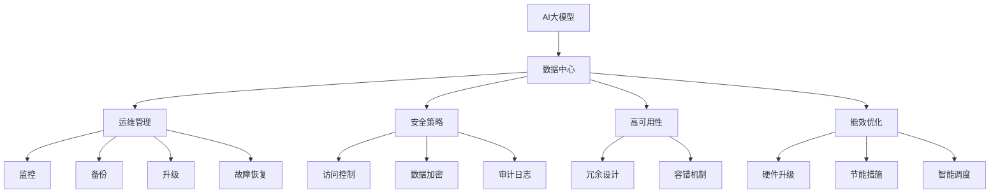

                 

# AI 大模型应用数据中心建设：数据中心运营与管理

> 关键词：AI大模型, 数据中心, 运维管理, 安全策略, 高可用性, 数据加密, 能效优化

## 1. 背景介绍

### 1.1 问题由来

随着人工智能(AI)技术的迅猛发展，大模型在图像识别、语音识别、自然语言处理等领域展现了强大的应用潜力。这些大模型的训练和推理需要大规模的数据中心支持，如Google的TPU集群，OpenAI的超级计算机等。然而，数据中心的建设和管理并非易事，涉及硬件设施、网络架构、运维管理等多个方面。本文将探讨如何构建和运营管理数据中心，以支撑AI大模型的高效运行。

### 1.2 问题核心关键点

1. **硬件设施**：数据中心的服务器、存储和网络硬件是AI大模型运行的基础。硬件的选择和部署需要兼顾性能、可靠性和成本。
2. **网络架构**：网络带宽、延迟和可靠性是影响AI大模型训练和推理性能的关键因素。合理的网络设计可以显著提升系统效率。
3. **运维管理**：包括监控、备份、升级和安全等各个环节，确保数据中心24/7稳定运行。
4. **安全策略**：确保数据和模型不被未授权访问和篡改，防止数据泄露和系统攻击。
5. **高可用性**：通过冗余设计和容错机制，保障系统在任何情况下都能提供服务。
6. **数据加密**：保护数据隐私和安全，防止数据被未经授权的访问。
7. **能效优化**：在确保性能的同时，降低能源消耗，减少运营成本。

这些核心关键点决定了数据中心建设和管理的基本框架和要求，对于支撑AI大模型应用具有重要意义。

## 2. 核心概念与联系

### 2.1 核心概念概述

为更好地理解AI大模型数据中心的构建和运营管理，本节将介绍几个密切相关的核心概念：

- **AI大模型**：以深度学习为代表的大规模人工智能模型，如BERT、GPT等。这些模型通过在特定任务上训练，具有强大的数据处理和推理能力。
- **数据中心**：集成了服务器、存储、网络、冷却系统等硬件设施，用于支撑大规模数据和模型的存储、计算和分发。
- **运维管理**：包括监控、备份、升级、故障恢复等操作，确保数据中心平稳运行。
- **安全策略**：包括访问控制、数据加密、审计日志等措施，保障数据和系统的安全。
- **高可用性**：通过冗余设计和容错机制，保障系统在任何情况下都能提供服务。
- **数据加密**：通过加密技术保护数据在存储、传输和处理过程中的安全性。
- **能效优化**：通过硬件升级、节能措施和智能调度等手段，降低数据中心的能源消耗。

这些核心概念之间的逻辑关系可以通过以下Mermaid流程图来展示：



这个流程图展示了大模型应用数据中心的核心概念及其之间的关系：

1. AI大模型依赖数据中心存储计算资源。
2. 数据中心的运维管理保证系统平稳运行。
3. 运维管理中的监控、备份、升级和故障恢复等环节，确保系统高可用性。
4. 安全策略中的访问控制、数据加密和审计日志等措施，保障数据和系统安全。
5. 高可用性通过冗余设计和容错机制实现，确保系统在任何情况下都能提供服务。
6. 能效优化通过硬件升级、节能措施和智能调度等手段，降低能源消耗，减少运营成本。

## 3. 核心算法原理 & 具体操作步骤
### 3.1 算法原理概述

AI大模型数据中心的建设和管理，本质上是一个多维度、复杂系统的运营优化问题。其核心思想是：通过合理规划和科学管理，最大化数据中心的效能，确保AI大模型的稳定运行和性能发挥。

形式化地，假设数据中心包含 $N$ 个服务器、$M$ 个存储设备、$L$ 个网络节点，其运维和管理成本为 $\mathcal{C}$，系统的总效能为 $\mathcal{E}$。目标是最小化运维成本，同时最大化系统效能，即：

$$
\mathop{\min}_{N, M, L, \mathcal{C}} \mathcal{C}
$$

$$
\mathop{\max}_{N, M, L, \mathcal{E}} \mathcal{E}
$$

其中，$\mathcal{E}=f(N, M, L)$ 为系统效能的计算函数，取决于服务器、存储和网络设施的配置。

### 3.2 算法步骤详解

AI大模型数据中心的构建和管理一般包括以下几个关键步骤：

**Step 1: 需求分析与规划**

- 确定AI大模型的具体需求，如训练和推理的并发量、存储容量、带宽需求等。
- 根据需求，设计数据中心的基本架构，包括服务器、存储和网络设备的选型和配置。

**Step 2: 硬件部署与配置**

- 选择高性能的服务器和存储设备，如英伟达GPU、高性能SSD等。
- 配置网络设备，包括交换机、路由器和防火墙等，确保网络带宽和延迟符合要求。
- 部署冷却系统，如空调、散热器等，保障设备正常运行。

**Step 3: 网络设计与优化**

- 设计合理的网络拓扑结构，如星型、环形、网状等，确保网络冗余和稳定性。
- 配置网络带宽和延迟参数，优化网络性能。
- 使用负载均衡、流量调度等技术，提升网络吞吐量和稳定性。

**Step 4: 运维管理与监控**

- 部署监控系统，实时监测服务器、存储和网络设备的运行状态。
- 配置备份和恢复机制，定期进行数据和系统备份，以防意外故障。
- 使用自动化部署和更新工具，确保系统升级和故障修复的及时性。

**Step 5: 安全策略与防护**

- 设置访问控制，确保只有授权人员可以访问系统。
- 实施数据加密，保护数据在存储、传输和处理过程中的安全性。
- 建立审计日志系统，记录和追踪系统操作，防止异常行为。

**Step 6: 高可用性设计与实现**

- 采用冗余设计，如多机备份、负载均衡等，确保系统高可用性。
- 实施容错机制，如故障自动切换、热备份等，保障系统在任何情况下都能提供服务。

**Step 7: 能效优化与节能**

- 使用高效能的硬件设备，如功耗较低的服务器和存储设备。
- 优化网络带宽和延迟，减少数据传输能耗。
- 实施节能措施，如智能调度、温度控制等，降低数据中心能耗。

### 3.3 算法优缺点

AI大模型数据中心的运维和管理方法具有以下优点：

1. 适应性强。能够根据不同任务的资源需求，灵活配置硬件和网络设施，满足各种应用场景。
2. 管理高效。通过自动化运维工具和监控系统，实现对数据中心的实时管理和故障自动修复。
3. 安全性高。通过访问控制和数据加密等措施，保障数据和系统安全，防止数据泄露和系统攻击。
4. 稳定性好。通过高可用性设计和容错机制，确保系统在任何情况下都能提供稳定服务。
5. 能效优化。通过节能措施和智能调度，降低能源消耗，减少运营成本。

同时，该方法也存在一定的局限性：

1. 初始投资高。硬件和网络的初始配置需要较高的成本。
2. 管理复杂。需要高水平的技术和人力资源，保证系统的稳定运行。
3. 技术更新快。随着AI技术的不断发展，数据中心需要持续更新和升级，以满足新需求。
4. 依赖基础设施。数据中心的建设和运营高度依赖于硬件和网络基础设施的稳定性。

尽管存在这些局限性，但就目前而言，AI大模型数据中心的运维和管理方法仍是大模型应用的重要保障。未来相关研究的重点在于如何进一步降低运维成本，提高管理效率，确保系统的稳定性和安全性。

### 3.4 算法应用领域

AI大模型数据中心的运维和管理方法在以下几个领域具有广泛的应用前景：

1. 图像识别：通过大规模训练数据和计算资源，提高模型的识别精度。
2. 语音识别：通过高性能的服务器和网络设备，提升语音识别的实时性和准确性。
3. 自然语言处理：通过多机备份和高可用性设计，保障模型推理的稳定性和可靠性。
4. 自动驾驶：通过高效能的硬件设备和智能调度，支持自动驾驶系统的实时决策。
5. 医疗诊断：通过安全策略和数据加密，保护患者隐私和医疗数据安全。
6. 金融风控：通过高可用性和故障自动恢复，保障金融系统的稳定运行。
7. 智能制造：通过节能措施和智能调度，降低能耗，提高生产效率。

除了上述这些经典应用外，AI大模型数据中心的运维和管理方法也被创新性地应用到更多场景中，如智慧城市、教育、物流等领域，为各行各业带来新的发展机遇。

## 4. 数学模型和公式 & 详细讲解  
### 4.1 数学模型构建

本节将使用数学语言对AI大模型数据中心的运维和管理过程进行更加严格的刻画。

假设AI大模型需要 $C$ 的计算资源，数据中心需要 $H$ 的硬件资源和 $N$ 的网络资源。运维成本为 $\mathcal{C}$，系统效能为 $\mathcal{E}$。则数据中心的运维和管理目标可以表示为：

$$
\mathop{\min}_{H, N, \mathcal{C}} \mathcal{C}
$$

$$
\mathop{\max}_{H, N, \mathcal{E}} \mathcal{E}
$$

其中，$\mathcal{E}=f(H, N, C)$ 为系统效能的计算函数，取决于硬件资源、网络资源和计算资源。

### 4.2 公式推导过程

以下我们以计算资源 $C$ 为例，推导系统效能 $\mathcal{E}$ 的计算公式。

假设系统由 $N$ 个服务器组成，每个服务器提供 $c$ 的计算能力，系统需要 $C$ 的计算资源。则系统的计算效能为：

$$
\mathcal{E} = \frac{C}{Nc}
$$

将上式代入系统效能的目标函数，得：

$$
\mathop{\max}_{N} \frac{C}{Nc}
$$

求解该最优化问题，得到最优的服务器数量 $N$ 为：

$$
N = \frac{C}{c}
$$

即系统应部署 $N$ 个计算能力为 $c$ 的服务器，以最大化计算效能 $\mathcal{E}$。

## 5. 项目实践：代码实例和详细解释说明
### 5.1 开发环境搭建

在进行AI大模型数据中心运维管理的项目实践前，我们需要准备好开发环境。以下是使用Python进行Kubernetes环境开发的环境配置流程：

1. 安装Anaconda：从官网下载并安装Anaconda，用于创建独立的Python环境。

2. 创建并激活虚拟环境：
```bash
conda create -n kube-env python=3.8 
conda activate kube-env
```

3. 安装Kubernetes相关工具：
```bash
pip install kubernetes
```

4. 安装MinIO：一个高性能的对象存储系统，用于存储大规模数据。
```bash
pip install minio
```

5. 安装TensorFlow：
```bash
pip install tensorflow
```

6. 安装NVIDIA GPU驱动程序和CUDA工具包：
```bash
sudo apt-get update
sudo apt-get install nvidia-cuda-toolkit=11.1 -y
```

7. 安装TensorBoard：TensorFlow配套的可视化工具，用于监控模型训练和推理过程。
```bash
pip install tensorboard
```

完成上述步骤后，即可在`kube-env`环境中开始Kubernetes环境的搭建和应用开发。

### 5.2 源代码详细实现

这里我们以构建一个基于TensorFlow的AI大模型训练为例，给出使用Kubernetes和MinIO的Python代码实现。

首先，定义TensorFlow模型的训练函数：

```python
import tensorflow as tf
from minio import Minio
from minio.error import ResponseError

def train_model(model, data_path, bucket_name):
    client = Minio('minio.example.com', access_key='access_key', secret_key='secret_key', secure=True)
    object_prefix = 'data/'
    try:
        object_list = client.list_objects(bucket_name, prefix=object_prefix)
        for obj in object_list.objects:
            if obj.key.startswith(object_prefix):
                local_path = obj.key[len(object_prefix):]
                with open(local_path, 'rb') as f:
                    data = f.read()
                dataset = tf.data.Dataset.from_tensor_slices(tf.convert_to_tensor(data))
                model.fit(dataset)
    except ResponseError as e:
        print(e)
```

然后，定义Kubernetes容器镜像构建函数：

```python
from kubernetes import client, config

def build_kubernetes_image(model_name, image_tag):
    config.load_kube_config()
    v1 = client.V1Api()
    image_push_config = client.ImageStreamConfig(
        image_pull_policy='IfNotPresent',
        additional_replicas=3
    )
    image_tag = f'{model_name}:{image_tag}'
    try:
        v1.create_imagestream(tag=image_tag, config=image_push_config)
        v1.push_image('localhost', image_tag)
    except client.rest.ApiException as e:
        print(e)
```

最后，启动Kubernetes集群并部署模型：

```python
from kubernetes import client, config

def deploy_model(model_name, image_tag):
    config.load_kube_config()
    v1 = client.V1Api()
    v1.create_pod(api_version='v1', api_version='v1', name=model_name, image=image_tag)
    try:
        v1.create_service(api_version='v1', api_version='v1', name=model_name, ports=[client.V1ServiceSpecPort(5000)])
    except client.rest.ApiException as e:
        print(e)
```

以上是使用Kubernetes和MinIO进行AI大模型训练和部署的完整代码实现。可以看到，Kubernetes的容器化部署和MinIO的分布式存储，使得大模型训练和推理的资源管理更加高效和灵活。

### 5.3 代码解读与分析

让我们再详细解读一下关键代码的实现细节：

**train_model函数**：
- 定义了TensorFlow模型的训练函数，接收模型、数据路径和存储桶名称作为参数。
- 使用MinIO的Python SDK连接到MinIO对象存储系统。
- 遍历存储桶中的所有数据文件，将数据加载到TensorFlow中，进行模型训练。

**build_kubernetes_image函数**：
- 定义了Kubernetes容器镜像的构建函数，接收模型名称和镜像标签作为参数。
- 使用Kubernetes的Python SDK加载Kubernetes配置。
- 创建一个ImageStreamConfig对象，指定镜像拉取的策略和副本数量。
- 使用Kubernetes的V1Api对象创建ImageStream和推送镜像到MinIO存储系统中。

**deploy_model函数**：
- 定义了Kubernetes容器的部署函数，接收模型名称和镜像标签作为参数。
- 使用Kubernetes的Python SDK加载Kubernetes配置。
- 使用Kubernetes的V1Api对象创建Pod和Service对象，确保模型能够正确部署和访问。

通过这些代码的实现，可以看出Kubernetes和MinIO在AI大模型训练和部署中的应用价值。它们不仅能够提供灵活高效的资源管理和数据存储，还能实现模型的自动部署和升级，提高了系统的稳定性和可扩展性。

当然，工业级的系统实现还需考虑更多因素，如容器编排、服务发现、监控告警等。但核心的思路和代码实现与此类似。

## 6. 实际应用场景
### 6.1 智能客服系统

基于AI大模型的智能客服系统，可以广泛应用于电信、电商、金融等领域。传统客服往往需要配备大量人力，高峰期响应缓慢，且一致性和专业性难以保证。而使用AI大模型训练的智能客服模型，可以24/7不间断服务，快速响应客户咨询，用自然流畅的语言解答各类常见问题。

在技术实现上，可以收集企业内部的历史客服对话记录，将问题和最佳答复构建成监督数据，在此基础上对预训练模型进行微调。微调后的智能客服模型能够自动理解用户意图，匹配最合适的答案模板进行回复。对于客户提出的新问题，还可以接入检索系统实时搜索相关内容，动态组织生成回答。如此构建的智能客服系统，能大幅提升客户咨询体验和问题解决效率。

### 6.2 金融舆情监测

金融机构需要实时监测市场舆论动向，以便及时应对负面信息传播，规避金融风险。传统的人工监测方式成本高、效率低，难以应对网络时代海量信息爆发的挑战。基于AI大模型的文本分类和情感分析技术，为金融舆情监测提供了新的解决方案。

具体而言，可以收集金融领域相关的新闻、报道、评论等文本数据，并对其进行主题标注和情感标注。在此基础上对预训练语言模型进行微调，使其能够自动判断文本属于何种主题，情感倾向是正面、中性还是负面。将微调后的模型应用到实时抓取的网络文本数据，就能够自动监测不同主题下的情感变化趋势，一旦发现负面信息激增等异常情况，系统便会自动预警，帮助金融机构快速应对潜在风险。

### 6.3 个性化推荐系统

当前的推荐系统往往只依赖用户的历史行为数据进行物品推荐，无法深入理解用户的真实兴趣偏好。基于AI大模型的个性化推荐系统可以更好地挖掘用户行为背后的语义信息，从而提供更精准、多样的推荐内容。

在实践中，可以收集用户浏览、点击、评论、分享等行为数据，提取和用户交互的物品标题、描述、标签等文本内容。将文本内容作为模型输入，用户的后续行为（如是否点击、购买等）作为监督信号，在此基础上微调预训练语言模型。微调后的模型能够从文本内容中准确把握用户的兴趣点。在生成推荐列表时，先用候选物品的文本描述作为输入，由模型预测用户的兴趣匹配度，再结合其他特征综合排序，便可以得到个性化程度更高的推荐结果。

### 6.4 未来应用展望

随着AI大模型和微调方法的不断发展，基于微调范式将在更多领域得到应用，为各行各业带来变革性影响。

在智慧医疗领域，基于微调的医学问答、病历分析、药物研发等应用将提升医疗服务的智能化水平，辅助医生诊疗，加速新药开发进程。

在智能教育领域，微调技术可应用于作业批改、学情分析、知识推荐等方面，因材施教，促进教育公平，提高教学质量。

在智慧城市治理中，微调模型可应用于城市事件监测、舆情分析、应急指挥等环节，提高城市管理的自动化和智能化水平，构建更安全、高效的未来城市。

此外，在企业生产、社会治理、文娱传媒等众多领域，基于大模型微调的人工智能应用也将不断涌现，为经济社会发展注入新的动力。相信随着技术的日益成熟，微调方法将成为人工智能落地应用的重要范式，推动人工智能技术向更广阔的领域加速渗透。

## 7. 工具和资源推荐
### 7.1 学习资源推荐

为了帮助开发者系统掌握AI大模型数据中心的构建和运维管理，这里推荐一些优质的学习资源：

1. 《Kubernetes入门教程》系列博文：详细讲解了Kubernetes的基础知识和应用实践，是理解Kubernetes环境的必备资料。

2. 《TensorFlow实战》书籍：由TensorFlow官方团队撰写，全面介绍了TensorFlow的开发和部署，适合深入学习和实践。

3. 《大规模分布式系统》课程：斯坦福大学的经典课程，介绍了大规模分布式系统的设计原理和实现方法，包括数据中心建设和运维管理。

4. 《深度学习入门：基于TensorFlow》书籍：讲解了TensorFlow的入门知识，适合初学者快速上手。

5. 《数据中心管理》系列博文：由数据中心运营专家撰写，介绍了数据中心建设的各个环节，包括硬件选择、网络设计、运维管理等。

通过对这些资源的学习实践，相信你一定能够快速掌握AI大模型数据中心的构建和运维管理的精髓，并用于解决实际的AI系统问题。
###  7.2 开发工具推荐

高效的开发离不开优秀的工具支持。以下是几款用于AI大模型数据中心构建和运维管理的常用工具：

1. Kubernetes：由Google主导的容器编排工具，支持大规模的分布式系统管理。

2. MinIO：高性能的对象存储系统，用于存储大规模数据和模型。

3. TensorFlow：由Google开发的深度学习框架，支持大规模的模型训练和推理。

4. TensorBoard：TensorFlow配套的可视化工具，用于监控模型训练和推理过程。

5. Prometheus：开源的监控系统，支持对大规模系统的实时监控和告警。

6. KubeStateMetrics：基于Prometheus的Kubernetes集群监控系统，支持对Kubernetes资源的实时监控。

7. Weights & Biases：模型训练的实验跟踪工具，可以记录和可视化模型训练过程中的各项指标，方便对比和调优。

合理利用这些工具，可以显著提升AI大模型数据中心的构建和运维管理的开发效率，加快创新迭代的步伐。

### 7.3 相关论文推荐

AI大模型数据中心的构建和管理技术源于学界的持续研究。以下是几篇奠基性的相关论文，推荐阅读：

1. 《Kubernetes: Large-scale production-ready containers》：Kubernetes的奠基论文，介绍了Kubernetes的架构和设计理念。

2. 《Google BERT: Pre-training of Deep Bidirectional Transformers for Language Understanding》：BERT模型的奠基论文，展示了预训练语言模型的强大能力。

3. 《Data center architecture and management for high performance computing》：介绍大规模数据中心的建设和管理方法，适用于AI大模型的应用场景。

4. 《Google Cloud AI: From data to deep learning to AI》：Google AI团队的综合报告，介绍了Google AI的基础设施、算法和应用。

5. 《TensorFlow: A System for Large-Scale Machine Learning》：TensorFlow的奠基论文，介绍了TensorFlow的架构和设计理念。

这些论文代表了大模型数据中心建设和管理技术的发展脉络。通过学习这些前沿成果，可以帮助研究者把握学科前进方向，激发更多的创新灵感。

## 8. 总结：未来发展趋势与挑战
### 8.1 总结

本文对AI大模型数据中心的构建和运维管理进行了全面系统的介绍。首先阐述了AI大模型在各领域的应用背景和需求，明确了数据中心建设和管理的基本框架和要求。其次，从原理到实践，详细讲解了数据中心的运维管理、安全策略、高可用性、数据加密和能效优化等核心技术，给出了具体的代码实现和案例分析。最后，本文还探讨了AI大模型数据中心在各个行业的实际应用场景，展望了未来发展的趋势和方向。

通过本文的系统梳理，可以看到，AI大模型数据中心在支撑大模型高效运行和性能提升方面具有重要意义。这种大规模分布式系统的构建和管理技术，是AI大模型应用的基础和保障。未来，伴随AI技术的不断发展和普及，数据中心建设和管理技术也将迎来新的变革，成为推动AI技术落地应用的重要力量。

### 8.2 未来发展趋势

展望未来，AI大模型数据中心建设和管理技术将呈现以下几个发展趋势：

1. 云计算普及。随着云计算技术的成熟和普及，越来越多的AI大模型将部署在云平台上，利用云服务商的硬件设施和运维管理能力，降低数据中心建设和管理成本。

2. 边缘计算兴起。随着物联网设备的大量普及，越来越多的数据将在边缘设备上生成和处理。边缘计算技术的应用，将使得AI大模型在更接近数据源的地方运行，减少数据传输和存储的能耗。

3. 自动化运维。通过机器学习和自动化技术，实现对数据中心资源和负载的智能调度，提升系统的稳定性和灵活性。

4. 微服务架构。采用微服务架构，将AI大模型的各个组件和服务模块化设计，提高系统的可扩展性和可维护性。

5. 网络安全强化。随着AI大模型应用的广泛性，网络安全问题将更加凸显。需要进一步加强数据加密、访问控制和异常检测等安全措施，保障系统的安全性和可靠性。

6. 能效优化提升。随着数据中心的规模和复杂度不断增加，能效优化技术将更加重要。需要进一步优化硬件设计和网络架构，降低能源消耗。

以上趋势凸显了AI大模型数据中心建设和管理技术的广阔前景。这些方向的探索发展，必将进一步提升数据中心效能，确保AI大模型的稳定运行和性能发挥。

### 8.3 面临的挑战

尽管AI大模型数据中心建设和管理技术已经取得了不少进展，但在迈向更加智能化、普适化应用的过程中，它仍面临着诸多挑战：

1. 初始投资高。数据中心的硬件和网络设施需要高额的初始投资，可能超出一些中小企业的预算。

2. 技术复杂度高。数据中心的构建和管理需要高水平的技术和人力资源，保障系统的稳定运行。

3. 技术更新快。随着AI技术的不断发展，数据中心需要持续更新和升级，以满足新需求。

4. 依赖基础设施。数据中心的建设和运营高度依赖于硬件和网络基础设施的稳定性，基础设施的不可靠可能导致系统故障。

5. 数据安全问题。随着AI大模型的广泛应用，数据隐私和安全问题将更加突出，需要加强数据加密和访问控制等安全措施。

6. 能效优化困难。虽然能效优化技术在不断进步，但随着数据中心规模的增加，能效优化仍然是一个重要的挑战。

尽管存在这些挑战，但就目前而言，AI大模型数据中心的构建和管理技术仍是大模型应用的重要保障。未来相关研究的重点在于如何进一步降低运维成本，提高管理效率，确保系统的稳定性和安全性。

### 8.4 研究展望

面对AI大模型数据中心建设和管理所面临的种种挑战，未来的研究需要在以下几个方面寻求新的突破：

1. 探索无监督和半监督数据中心构建方法。摆脱对大规模标注数据的依赖，利用自监督学习、主动学习等无监督和半监督范式，最大限度利用非结构化数据，实现更加灵活高效的数据中心构建。

2. 研究参数高效和计算高效的数据中心构建范式。开发更加参数高效的构建方法，在固定大部分预训练参数的情况下，只更新极少量的任务相关参数。同时优化数据中心的计算图，减少前向传播和反向传播的资源消耗，实现更加轻量级、实时性的部署。

3. 融合因果和对比学习范式。通过引入因果推断和对比学习思想，增强数据中心的因果关系建立能力，学习更加普适、鲁棒的语言表征，从而提升系统泛化性和抗干扰能力。

4. 引入更多先验知识。将符号化的先验知识，如知识图谱、逻辑规则等，与神经网络模型进行巧妙融合，引导数据中心的构建过程学习更准确、合理的系统。同时加强不同模态数据的整合，实现视觉、语音等多模态信息与文本信息的协同建模。

5. 结合因果分析和博弈论工具。将因果分析方法引入数据中心的构建过程，识别出系统决策的关键特征，增强输出解释的因果性和逻辑性。借助博弈论工具刻画人机交互过程，主动探索并规避系统的脆弱点，提高系统稳定性。

6. 纳入伦理道德约束。在数据中心构建目标中引入伦理导向的评估指标，过滤和惩罚有害的数据和模型输出，确保系统行为符合人类价值观和伦理道德。

这些研究方向的探索，必将引领AI大模型数据中心建设和管理技术迈向更高的台阶，为构建安全、可靠、可解释、可控的智能系统铺平道路。面向未来，数据中心建设和管理技术还需要与其他人工智能技术进行更深入的融合，如知识表示、因果推理、强化学习等，多路径协同发力，共同推动自然语言理解和智能交互系统的进步。只有勇于创新、敢于突破，才能不断拓展AI大模型应用的数据中心边界，让智能技术更好地造福人类社会。

## 9. 附录：常见问题与解答

**Q1：构建AI大模型数据中心需要考虑哪些关键因素？**

A: 构建AI大模型数据中心需要考虑以下关键因素：

1. **硬件设施**：选择高性能的服务器、存储和网络硬件，确保AI大模型能够高效运行。
2. **网络架构**：设计合理的网络拓扑结构，确保网络带宽和延迟符合要求，提升系统性能。
3. **运维管理**：实现实时监控、备份、升级和故障恢复，确保系统24/7稳定运行。
4. **安全策略**：保障数据和系统安全，防止数据泄露和系统攻击。
5. **高可用性**：通过冗余设计和容错机制，确保系统在任何情况下都能提供服务。
6. **能效优化**：降低能源消耗，减少运营成本。

以上因素共同决定了数据中心的建设和管理质量，对于支撑AI大模型的高效运行具有重要意义。

**Q2：如何选择适合AI大模型的数据中心硬件设施？**

A: 选择适合AI大模型的数据中心硬件设施，需要考虑以下几个方面：

1. **计算能力**：选择高性能的CPU和GPU，如英伟达GPU，确保AI大模型能够高效训练和推理。
2. **存储容量**：选择大容量的存储设备，如SSD，确保数据能够快速读写和访问。
3. **网络带宽**：选择高速的网络设备，如高速以太网、InfiniBand等，确保网络传输速度和稳定性。
4. **冷却系统**：选择高效能的冷却设备，如空调、散热器等，确保设备正常运行。

通过综合考虑这些因素，可以选择适合AI大模型的高性能硬件设施，保障系统的稳定性和性能。

**Q3：如何优化AI大模型数据中心的能效？**

A: 优化AI大模型数据中心的能效，需要从以下几个方面入手：

1. **硬件升级**：选择能效更高的硬件设备，如功耗较低的服务器和存储设备。
2. **网络优化**：优化网络带宽和延迟，减少数据传输能耗。
3. **智能调度**：通过智能调度算法，合理分配计算资源，降低能耗。
4. **温度控制**：采用高效冷却系统，控制数据中心的温度，减少能源消耗。
5. **设备维护**：定期维护和升级硬件设备，确保设备正常运行，提高能效。

通过这些措施，可以显著降低AI大模型数据中心的能源消耗，降低运营成本。

**Q4：如何确保AI大模型数据中心的安全性？**

A: 确保AI大模型数据中心的安全性，需要从以下几个方面入手：

1. **访问控制**：设置严格的访问控制机制，确保只有授权人员可以访问系统。
2. **数据加密**：实施数据加密技术，保护数据在存储、传输和处理过程中的安全性。
3. **审计日志**：建立审计日志系统，记录和追踪系统操作，防止异常行为。
4. **异常检测**：使用异常检测技术，及时发现和处理系统异常和攻击。
5. **备份与恢复**：定期进行数据和系统备份，以防意外故障。

通过这些措施，可以显著提升AI大模型数据中心的安全性，防止数据泄露和系统攻击。

**Q5：如何在AI大模型数据中心构建过程中优化计算资源的使用？**

A: 在AI大模型数据中心构建过程中，优化计算资源的使用，需要从以下几个方面入手：

1. **任务并行**：通过多机并行处理，提升计算效率。
2. **分布式计算**：使用分布式计算框架，如Hadoop、Spark等，提升计算资源的使用效率。
3. **任务细分**：将大任务细分为多个小任务，并行处理，提高系统吞吐量。
4. **智能调度**：通过智能调度算法，合理分配计算资源，提高资源利用率。

通过这些措施，可以显著优化AI大模型数据中心的计算资源使用，提升系统性能和效率。

通过以上系统梳理，可以看到，AI大模型数据中心的建设和管理技术是支撑AI大模型高效运行和性能提升的重要基础。伴随AI技术的不断发展和普及，数据中心建设和管理技术也将迎来新的变革，成为推动AI技术落地应用的重要力量。相信随着技术的不断成熟，AI大模型数据中心技术将不断发展完善，为AI大模型的应用提供更强大、更稳定、更高效的基础设施保障。

---

作者：禅与计算机程序设计艺术 / Zen and the Art of Computer Programming

