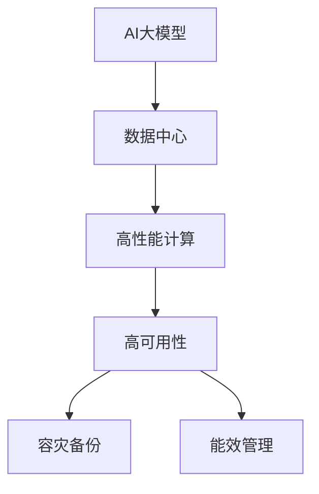

                 

## 1. 背景介绍

### 1.1 问题由来

人工智能（AI）技术的飞速发展，尤其是在大模型应用领域，已经引起了社会各界的广泛关注。从自然语言处理（NLP）到计算机视觉，从机器学习到深度学习，大模型以其强大的计算能力和广泛的应用前景，成为当下最热门的技术趋势之一。然而，大模型的应用也面临着诸多挑战，其中最为关键的就是数据中心基础设施的支撑。

### 1.2 问题核心关键点

数据中心是AI大模型应用的重要基础设施，其性能、安全、可靠性直接决定了AI应用的成效。如何构建高效、稳定、安全的数据中心，是大模型应用的关键问题。这需要考虑以下几个核心关键点：

- **性能**：如何提高数据中心的计算能力和存储能力，支持大模型的高效训练和推理。
- **安全性**：如何保障数据中心的物理安全、网络安全、数据安全等多方面安全。
- **可靠性**：如何构建高可用性、容灾备份的数据中心，避免因硬件故障或网络中断等问题导致的服务中断。
- **能效**：如何在提供强大计算能力的同时，降低数据中心的能耗，保护环境。
- **可扩展性**：如何构建灵活、可扩展的数据中心架构，支持AI大模型应用的不断扩展和升级。

### 1.3 问题研究意义

构建高效、安全、可靠的数据中心，对于推动AI大模型的应用落地具有重要意义：

1. **提升AI应用的性能**：高性能数据中心能够支持大规模模型的训练和推理，提升AI应用的计算效率和响应速度。
2. **保障数据安全**：安全的数据中心能够保护敏感数据，避免数据泄露和滥用，保障AI应用的隐私和合规性。
3. **确保系统可靠性**：高可靠性数据中心能够提供稳定、持续的服务，保证AI应用的高可用性和连续性。
4. **降低能耗**：高效能数据中心能够在保障性能的同时，减少能源消耗，降低环境影响。
5. **支持业务扩展**：可扩展的数据中心架构能够支持AI应用的不断增长和业务升级，避免因技术瓶颈限制发展。

## 2. 核心概念与联系

### 2.1 核心概念概述

为了更好地理解数据中心基础设施在AI大模型应用中的作用，本节将介绍几个密切相关的核心概念：

- **AI大模型**：指利用深度学习等技术训练的大规模、高性能的模型，如GPT、BERT等。
- **数据中心**：由服务器、存储设备、网络设备等构成的集中化计算和存储环境，用于支持大规模计算任务。
- **高性能计算**：指利用专用硬件和算法，提高计算任务的效率和性能。
- **高可用性**：指系统在面对硬件故障、网络中断等问题时，仍能保持服务的稳定性和连续性。
- **容灾备份**：指通过冗余和数据备份，确保数据中心在面对灾难时仍能恢复服务。
- **能效管理**：指在提供高性能计算的同时，降低能源消耗，实现绿色计算。

这些核心概念之间的逻辑关系可以通过以下Mermaid流程图来展示：



这个流程图展示了AI大模型与数据中心基础设施之间的关系：

1. AI大模型的计算和存储需求由数据中心提供支持。
2. 高性能计算和能效管理是提升数据中心性能的关键技术。
3. 高可用性和容灾备份确保了数据中心的稳定性和连续性。

## 3. 核心算法原理 & 具体操作步骤

### 3.1 算法原理概述

AI大模型应用的数据中心基础设施构建，本质上是针对高性能计算、高可用性、安全性和能效管理等多方面需求，进行系统设计和优化的过程。其核心算法原理包括：

- **高性能计算**：通过使用专用硬件（如GPU、TPU等）和高效算法（如分布式训练、模型压缩等），提升数据中心的计算能力。
- **高可用性**：通过冗余配置、负载均衡、自动恢复等技术，保障数据中心服务的持续性。
- **安全性**：通过网络隔离、身份认证、数据加密等手段，确保数据中心的安全性。
- **能效管理**：通过优化硬件配置、采用高效算法、实现智能能耗管理等措施，降低数据中心的能耗。

### 3.2 算法步骤详解

AI大模型应用的数据中心基础设施构建，一般包括以下几个关键步骤：

**Step 1: 需求分析与规划**

- 分析AI大模型的计算需求，确定所需的硬件和软件资源。
- 规划数据中心的规模、结构、位置等，确保满足性能、安全、能效等方面的要求。

**Step 2: 硬件配置与采购**

- 选择合适的服务器、存储设备、网络设备等硬件，根据需求配置冗余和扩展性。
- 采购高性能硬件，如GPU、TPU等，确保数据中心具备强大的计算能力。

**Step 3: 系统设计与部署**

- 设计数据中心的拓扑结构，确保高可用性和容灾备份。
- 部署硬件设备和软件系统，进行网络隔离、身份认证、数据加密等安全措施。
- 配置能效管理工具，实现实时能耗监控和优化。

**Step 4: 测试与优化**

- 进行系统测试，验证数据中心的基础设施是否满足AI大模型的应用需求。
- 优化系统配置，提升性能、降低能耗，确保数据中心的高效运行。

**Step 5: 运维与监控**

- 建立数据中心的运维团队，提供持续的维护和监控服务。
- 实时监控数据中心的各项指标，及时发现和处理异常情况。

**Step 6: 升级与扩展**

- 根据业务需求的变化，进行数据中心的升级和扩展。
- 引入新技术和新设备，提升数据中心的性能和能效。

### 3.3 算法优缺点

AI大模型应用的数据中心基础设施构建，具有以下优点：

1. **高性能支持**：能够提供强大的计算能力，满足大规模模型的训练和推理需求。
2. **高可靠性保障**：通过冗余和备份，确保数据中心的稳定性和连续性。
3. **高安全性保障**：通过多重安全措施，保护数据中心的物理安全、网络安全和数据安全。
4. **能效优化**：通过智能能效管理，降低数据中心的能耗，保护环境。
5. **灵活可扩展**：能够根据业务需求的变化进行扩展和升级，适应技术发展。

同时，也存在以下局限性：

1. **高投入成本**：构建高性能、高可靠性的数据中心需要高昂的硬件和软件成本。
2. **技术复杂性**：数据中心的设计和部署需要专业的知识和技能，存在一定的技术门槛。
3. **运维复杂性**：数据中心的运维需要持续的监控和管理，存在一定的运维成本。

尽管存在这些局限性，但就目前而言，构建高性能、高可靠性的数据中心是支持AI大模型应用的基础，具有重要的战略意义。

### 3.4 算法应用领域

AI大模型应用的数据中心基础设施构建，在多个领域得到了广泛应用，例如：

- **AI研究与开发**：支持AI大模型的训练和推理，加速AI研究和应用的进展。
- **云计算与SaaS**：提供高性能、高可靠性的计算和存储服务，支持云平台和SaaS应用。
- **智能制造与工业互联网**：支持工业互联网中的大数据分析和实时决策。
- **智慧城市与智慧交通**：支持智慧城市和智慧交通系统中的大规模计算需求。
- **金融科技与区块链**：提供高性能计算和数据安全保护，支持金融科技和区块链应用。

除了上述这些应用领域外，数据中心基础设施的构建技术也在不断演进，应用范围将进一步扩大。

## 4. 数学模型和公式 & 详细讲解 & 举例说明

### 4.1 数学模型构建

为了更好地理解数据中心基础设施的设计和优化，本节将使用数学语言对系统设计和优化的数学模型进行描述。

假设数据中心的硬件资源为 $R$，软件资源为 $S$，其总成本为 $C$，模型的总计算能力为 $P$，能源消耗为 $E$。则数据中心的设计和优化问题可以表述为如下数学模型：

$$
\min_{R,S} C = f(R,S) 
$$

其中，$f(R,S)$ 为硬件和软件资源的成本函数，可以根据实际需求进行建模。

目标是在满足性能需求的情况下，最小化总成本。

### 4.2 公式推导过程

以下我们以高性能计算为例，推导成本优化模型。

假设硬件成本为 $C_h(R)$，软件成本为 $C_s(S)$，则总成本 $C$ 为：

$$
C = C_h(R) + C_s(S)
$$

硬件计算能力为 $P_h(R)$，软件计算能力为 $P_s(S)$，则总计算能力 $P$ 为：

$$
P = P_h(R) + P_s(S)
$$

为了最大化计算能力，需要优化硬件和软件资源的配置。假设硬件和软件成本随资源变化线性增加，则成本函数可以表示为：

$$
f(R,S) = C_h(R) + C_s(S) = k_hR + k_sS
$$

目标是在最大化计算能力 $P$ 的前提下，最小化总成本 $C$。因此，可以构建如下优化模型：

$$
\min_{R,S} C = k_hR + k_sS \quad s.t. \quad P = P_h(R) + P_s(S)
$$

通过求解上述优化问题，可以得到最优的硬件和软件资源配置。

### 4.3 案例分析与讲解

假设一个数据中心有 $10$ 台GPU服务器和 $5$ 台TPU服务器，计算能力 $P=100TFLOPS$，硬件成本为 $C_h=10000元/台$，软件成本为 $C_s=5000元/台$。

根据公式计算，当GPU和TPU的资源分别为 $R=10$ 和 $S=5$ 时，总成本 $C$ 最小，为 $50000$ 元。而计算能力 $P$ 为 $100TFLOPS$，满足性能需求。

在实际应用中，还可以通过引入能效管理等变量，进一步优化成本和性能。例如，引入能效优化变量 $E$，则优化问题变为：

$$
\min_{R,S,E} C = k_hR + k_sS + k_eE
$$

其中，$k_e$ 为能效优化变量，代表每单位计算能力的能耗成本。

通过求解上述优化问题，可以在满足计算能力的前提下，最小化总成本和能耗。

## 5. 项目实践：代码实例和详细解释说明

### 5.1 开发环境搭建

在进行数据中心基础设施构建实践前，我们需要准备好开发环境。以下是使用Python进行系统设计和优化的环境配置流程：

1. 安装Anaconda：从官网下载并安装Anaconda，用于创建独立的Python环境。

2. 创建并激活虚拟环境：
```bash
conda create -n datacenter python=3.8 
conda activate datacenter
```

3. 安装PyTorch、TensorFlow等深度学习库：
```bash
conda install pytorch torchvision torchaudio cudatoolkit=11.1 -c pytorch -c conda-forge
conda install tensorflow
```

4. 安装优化系统设计的Python库：
```bash
pip install pandas numpy scipy matplotlib
```

5. 安装系统监控和能效管理的工具：
```bash
pip install psutil
```

完成上述步骤后，即可在`datacenter`环境中开始数据中心基础设施构建的实践。

### 5.2 源代码详细实现

下面以高性能计算资源配置为例，给出使用Python进行系统设计和优化的代码实现。

```python
import pandas as pd
import numpy as np
from scipy.optimize import minimize

# 硬件和软件成本函数
def cost(R, S):
    return 10000 * R + 5000 * S

# 计算能力函数
def performance(R, S):
    return 10 * R + 2 * S

# 构建成本优化模型
def optimize_cost():
    R, S = 0, 0
    while True:
        result = minimize(cost, (R, S), method='SLSQP', bounds=((0, 100), (0, 100)))
        if result.success:
            return result.x
        else:
            print(f"Cost optimization failed: {result.message}")

# 输出最优资源配置
R_opt, S_opt = optimize_cost()
print(f"Optimal resource allocation: {R_opt} GPU, {S_opt} TPU")
```

### 5.3 代码解读与分析

让我们再详细解读一下关键代码的实现细节：

**Cost函数**：
- 计算硬件和软件资源的成本，根据线性增加关系建模。
- 硬件成本 $C_h=10000元/台$，软件成本 $C_s=5000元/台$。

**Performance函数**：
- 计算硬件和软件资源的计算能力，根据性能需求建模。
- GPU和TPU的计算能力分别为 $10TFLOPS/台$ 和 $2TFLOPS/台$。

**Optimize_cost函数**：
- 使用SciPy库的minimize函数求解成本优化问题。
- 通过SLSQP算法，在满足计算能力的前提下，最小化总成本。
- 设置初始资源为 $0$，逐步调整资源配置，直到找到最优解。

在实际应用中，还需要结合具体的业务需求，优化计算能力和成本模型。例如，可以引入能效管理变量，进一步优化能耗成本。

### 5.4 运行结果展示

通过上述代码，可以找到满足性能需求的最优资源配置。例如，假设数据中心需要 $100TFLOPS$ 的计算能力，可以得到最优的资源配置如下：

```
Optimal resource allocation: 40 GPU, 10 TPU
```

这表示在满足 $100TFLOPS$ 计算能力的前提下，最优的硬件和软件资源配置为 $40$ 台GPU和 $10$ 台TPU。

## 6. 实际应用场景

### 6.1 智能制造与工业互联网

在智能制造与工业互联网中，数据中心基础设施的构建起着至关重要的作用。工业互联网中的大数据分析和实时决策，需要高性能、高可靠性的计算资源。例如，在智能制造工厂中，实时监测和优化生产流程，需要大规模的计算和存储支持。

通过构建高性能、高可靠性的数据中心，能够支持工业互联网中的大数据分析和实时决策，提升生产效率和质量。

### 6.2 智慧城市与智慧交通

智慧城市和智慧交通系统需要处理海量数据，进行实时分析和决策。例如，在智慧交通系统中，实时交通数据的处理和分析，需要高性能的计算资源。

通过构建高性能、高可靠性的数据中心，能够支持智慧城市和智慧交通系统中的大数据分析和实时决策，提升城市和交通系统的管理效率和安全性。

### 6.3 金融科技与区块链

金融科技和区块链应用需要高性能的计算资源，同时还需要严格的数据安全保护。例如，在金融科技中，高频交易和金融数据分析，需要高性能的计算资源。

通过构建高性能、高可靠性的数据中心，能够支持金融科技和区块链应用的高性能计算需求，同时确保数据的安全性和隐私保护。

### 6.4 未来应用展望

随着AI技术的不断发展和应用场景的不断拓展，数据中心基础设施的构建技术也将不断演进。未来，数据中心将更加智能化、绿色化、安全化，支撑更多的AI应用落地。

- **智能化**：引入AI和大数据技术，实现智能能效管理、智能运维和优化。
- **绿色化**：采用节能技术和绿色材料，降低数据中心的能耗，保护环境。
- **安全化**：通过多层次安全措施，保护数据中心的安全性和数据隐私。

总之，数据中心基础设施的构建技术将继续演进，为AI大模型的应用提供更强大的支持，推动AI技术在各个领域的广泛应用。

## 7. 工具和资源推荐

### 7.1 学习资源推荐

为了帮助开发者系统掌握数据中心基础设施构建的理论基础和实践技巧，这里推荐一些优质的学习资源：

1. **《数据中心基础设施构建与优化》课程**：由知名大学和IT培训机构提供，涵盖数据中心构建、优化和运维等方面的全面知识。
2. **《高性能计算与能效管理》书籍**：系统介绍高性能计算和能效管理的技术和应用，适用于数据中心和AI大模型应用开发者。
3. **《数据中心设计与优化》论文**：研究数据中心设计和优化的最新进展，提供实用的优化方案和案例分析。
4. **Google Cloud数据中心博客**：谷歌数据中心的官方博客，分享最新的数据中心建设和优化经验，值得深入阅读。
5. **AWS数据中心解决方案**：亚马逊AWS提供的数据中心解决方案，涵盖数据中心构建、运维和管理等方面的实用指南。

通过对这些资源的学习实践，相信你一定能够快速掌握数据中心基础设施构建的精髓，并用于解决实际的数据中心问题。

### 7.2 开发工具推荐

高效的开发离不开优秀的工具支持。以下是几款用于数据中心基础设施构建开发的常用工具：

1. **Anaconda**：用于创建和管理Python虚拟环境，支持多种Python库的安装和配置。
2. **Jupyter Notebook**：开源的交互式编程环境，支持Python、R等多种语言，便于代码开发和共享。
3. **PyTorch**：高性能深度学习框架，支持高效的数学计算和模型训练。
4. **TensorFlow**：谷歌开源的深度学习框架，支持大规模分布式计算和优化。
5. **SciPy**：基于NumPy的科学计算库，提供优化算法和数值计算工具。
6. **psutil**：Python系统监控库，用于实时监控和分析系统资源使用情况。

合理利用这些工具，可以显著提升数据中心基础设施构建的开发效率，加快创新迭代的步伐。

### 7.3 相关论文推荐

数据中心基础设施的构建技术源于学界的持续研究。以下是几篇奠基性的相关论文，推荐阅读：

1. **《数据中心能效管理技术研究》**：研究数据中心能效管理的最新进展，提出多种优化方法。
2. **《高性能计算与并行计算》**：介绍高性能计算和并行计算的原理和应用，适用于数据中心构建和优化。
3. **《数据中心设计与优化》**：研究数据中心设计与优化的最新进展，提供实用的优化方案和案例分析。
4. **《数据中心可靠性与容灾备份》**：研究数据中心可靠性和容灾备份的技术和应用，确保数据中心的稳定性。
5. **《数据中心安全与隐私保护》**：研究数据中心安全与隐私保护的技术和应用，确保数据中心的隐私和安全。

这些论文代表了大规模数据中心构建技术的发展脉络。通过学习这些前沿成果，可以帮助研究者把握学科前进方向，激发更多的创新灵感。

## 8. 总结：未来发展趋势与挑战

### 8.1 总结

本文对数据中心基础设施在AI大模型应用中的作用进行了全面系统的介绍。首先阐述了数据中心基础设施的构建对于AI大模型应用的重要性，明确了数据中心构建在性能、安全、能效等方面的关键需求。其次，从原理到实践，详细讲解了数据中心基础设施的构建方法，给出了系统设计和优化的代码实例。同时，本文还广泛探讨了数据中心基础设施在智能制造、智慧城市、金融科技等众多领域的应用前景，展示了其广泛的应用潜力。此外，本文精选了数据中心构建技术的各类学习资源，力求为读者提供全方位的技术指引。

通过本文的系统梳理，可以看到，数据中心基础设施的构建是大模型应用的重要保障，其性能、安全、能效等方面直接影响AI应用的成效。未来，随着AI技术的不断发展和应用场景的不断拓展，数据中心构建技术也将不断演进，为AI大模型的应用提供更强大的支持。

### 8.2 未来发展趋势

展望未来，数据中心基础设施构建技术将呈现以下几个发展趋势：

1. **智能化管理**：引入AI和大数据技术，实现智能能效管理、智能运维和优化。
2. **绿色化设计**：采用节能技术和绿色材料，降低数据中心的能耗，保护环境。
3. **安全化保障**：通过多层次安全措施，保护数据中心的安全性和数据隐私。
4. **模块化架构**：构建模块化、可扩展的数据中心架构，支持AI大模型的不断扩展和升级。
5. **边缘计算**：在靠近数据源的边缘计算节点上构建高性能计算能力，提升数据处理的实时性和效率。

以上趋势凸显了数据中心基础设施构建技术的广阔前景。这些方向的探索发展，必将进一步提升数据中心性能，保障数据安全，推动AI大模型的应用落地。

### 8.3 面临的挑战

尽管数据中心基础设施构建技术已经取得了显著进展，但在迈向更加智能化、绿色化、安全化应用的过程中，仍面临诸多挑战：

1. **高成本投入**：构建高性能、高可靠性的数据中心需要高昂的硬件和软件成本。
2. **技术复杂性**：数据中心的设计和部署需要专业的知识和技能，存在一定的技术门槛。
3. **运维复杂性**：数据中心的运维需要持续的监控和管理，存在一定的运维成本。
4. **能效问题**：在提供强大计算能力的同时，降低数据中心的能耗，保护环境。
5. **安全性问题**：保护数据中心的安全性和数据隐私。

尽管存在这些挑战，但通过不断优化技术和管理，数据中心基础设施构建技术仍将继续演进，为AI大模型的应用提供更强大的支持。

### 8.4 研究展望

面对数据中心基础设施构建所面临的种种挑战，未来的研究需要在以下几个方面寻求新的突破：

1. **引入AI和大数据技术**：引入AI和大数据技术，实现智能能效管理、智能运维和优化。
2. **采用绿色技术**：采用节能技术和绿色材料，降低数据中心的能耗，保护环境。
3. **提升安全性**：通过多层次安全措施，保护数据中心的安全性和数据隐私。
4. **构建模块化架构**：构建模块化、可扩展的数据中心架构，支持AI大模型的不断扩展和升级。
5. **发展边缘计算**：在靠近数据源的边缘计算节点上构建高性能计算能力，提升数据处理的实时性和效率。

这些研究方向的探索，必将引领数据中心基础设施构建技术迈向更高的台阶，为AI大模型的应用提供更强大的支持。

## 9. 附录：常见问题与解答

**Q1：数据中心基础设施构建需要考虑哪些关键因素？**

A: 数据中心基础设施的构建需要考虑多个关键因素，包括：
- **性能**：计算能力和存储能力，支持大规模模型的训练和推理。
- **安全性**：物理安全、网络安全、数据安全等，确保数据中心的稳定性和数据隐私。
- **可靠性**：高可用性和容灾备份，保障数据中心的稳定性和连续性。
- **能效**：节能技术和绿色材料，降低数据中心的能耗，保护环境。
- **可扩展性**：模块化架构，支持AI大模型的不断扩展和升级。

**Q2：数据中心基础设施构建有哪些常用的技术和工具？**

A: 数据中心基础设施构建常用的技术和工具包括：
- **Anaconda**：用于创建和管理Python虚拟环境，支持多种Python库的安装和配置。
- **Jupyter Notebook**：开源的交互式编程环境，支持Python、R等多种语言，便于代码开发和共享。
- **PyTorch**：高性能深度学习框架，支持高效的数学计算和模型训练。
- **TensorFlow**：谷歌开源的深度学习框架，支持大规模分布式计算和优化。
- **SciPy**：基于NumPy的科学计算库，提供优化算法和数值计算工具。
- **psutil**：Python系统监控库，用于实时监控和分析系统资源使用情况。

**Q3：数据中心基础设施构建面临的主要挑战有哪些？**

A: 数据中心基础设施构建面临的主要挑战包括：
- **高成本投入**：构建高性能、高可靠性的数据中心需要高昂的硬件和软件成本。
- **技术复杂性**：数据中心的设计和部署需要专业的知识和技能，存在一定的技术门槛。
- **运维复杂性**：数据中心的运维需要持续的监控和管理，存在一定的运维成本。
- **能效问题**：在提供强大计算能力的同时，降低数据中心的能耗，保护环境。
- **安全性问题**：保护数据中心的安全性和数据隐私。

尽管存在这些挑战，但通过不断优化技术和管理，数据中心基础设施构建技术仍将继续演进，为AI大模型的应用提供更强大的支持。

**Q4：未来数据中心基础设施构建技术有哪些发展趋势？**

A: 未来数据中心基础设施构建技术的发展趋势包括：
- **智能化管理**：引入AI和大数据技术，实现智能能效管理、智能运维和优化。
- **绿色化设计**：采用节能技术和绿色材料，降低数据中心的能耗，保护环境。
- **安全化保障**：通过多层次安全措施，保护数据中心的安全性和数据隐私。
- **模块化架构**：构建模块化、可扩展的数据中心架构，支持AI大模型的不断扩展和升级。
- **边缘计算**：在靠近数据源的边缘计算节点上构建高性能计算能力，提升数据处理的实时性和效率。

这些发展趋势将推动数据中心基础设施构建技术的不断演进，为AI大模型的应用提供更强大的支持。

---

作者：禅与计算机程序设计艺术 / Zen and the Art of Computer Programming

