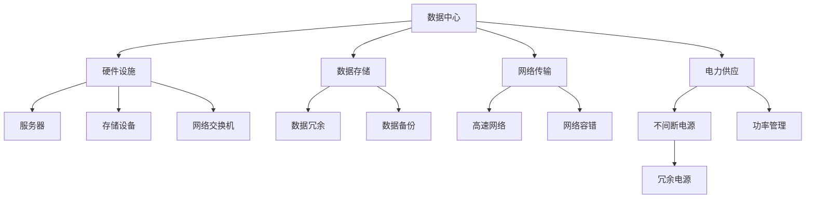

                 

# AI 大模型应用数据中心的可靠性

## 1. 背景介绍

在人工智能大模型应用的当下，数据中心的可靠性、稳定性和高效性显得尤为重要。数据中心不仅需要承载庞大的计算任务，还需要保障数据的存储安全与实时性。随着AI大模型应用的不断深入，对于数据中心的可靠性要求也越来越高。在诸如自动驾驶、工业互联网、智能医疗、智慧城市等对AI应用高依赖的场景中，数据中心的可靠性是确保系统稳定性和安全性的基础。

### 1.1 问题由来
在AI大模型应用普及的过程中，如何保障数据中心的可靠性成为了一个突出的问题。AI大模型的训练和应用往往需要庞大的计算资源和存储空间，对数据中心的硬件设施提出了极高的要求。特别是在模型训练阶段，可能需要数十个GPU集群进行高并发的计算任务。在这样的背景下，传统的数据中心可能难以满足需求。此外，AI大模型应用还需要高速的网络和稳定的电力供应，这些都是保障数据中心可靠性的关键要素。

### 1.2 问题核心关键点
数据中心的可靠性问题主要集中在以下几个方面：

- **硬件设施的可靠性**：数据中心硬件，包括服务器、存储设备、网络交换机等，是保障AI大模型应用可靠性的基础。这些硬件设备需要具备高效能、高稳定性和高扩展性，以应对日益增长的计算需求。
- **数据存储的安全性**：AI大模型应用中的数据存储不仅要保证数据的高可用性，还要确保数据的安全性，防止数据泄露和丢失。
- **网络的可靠性**：AI大模型训练和应用需要高速稳定的网络，以保证模型的训练速度和数据传输效率。
- **电力供应的稳定性**：AI大模型应用需要庞大的计算资源，而计算资源需要持续的电力供应来支撑。

### 1.3 问题研究意义
研究数据中心在AI大模型应用中的可靠性问题，对于提升AI系统的稳定性和安全性，降低应用成本，加速AI技术在各个领域的落地应用具有重要意义：

- **提升AI系统的稳定性和安全性**：可靠的数据中心能够提供稳定、高效的服务，减少因硬件故障、网络中断等问题带来的系统中断，保障AI大模型应用的连续性。
- **降低应用成本**：通过优化数据中心的设计和运维策略，减少硬件故障和网络中断带来的维护成本和业务损失。
- **加速AI技术落地**：可靠的数据中心能够快速响应业务需求，提供高质量的AI计算服务，为AI技术在各个垂直行业的广泛应用提供保障。

## 2. 核心概念与联系

### 2.1 核心概念概述

在探讨数据中心在AI大模型应用中的可靠性时，我们需要首先理解一些核心概念：

- **数据中心**：指专门用于集中存储和处理数据的物理设施。数据中心分为边缘数据中心和中心数据中心，边缘数据中心通常靠近用户，以提升响应速度；中心数据中心则具备更强大的计算和存储能力。
- **AI大模型**：指经过大规模数据预训练和微调，具备强大语言理解和生成能力的人工智能模型，如BERT、GPT-3等。
- **可靠性**：指数据中心能够稳定、连续地运行，保证业务连续性，避免因硬件故障、网络中断等问题造成的服务中断。

通过这些核心概念，我们可以更好地理解数据中心在AI大模型应用中的地位和重要性。

### 2.2 核心概念原理和架构的 Mermaid 流程图(Mermaid 流程节点中不要有括号、逗号等特殊字符)


这个流程图展示了数据中心与核心组件之间的联系。硬件设施是数据中心的骨架，包括服务器、存储设备和网络交换机等；数据存储是数据中心的存储介质，包括数据冗余和备份技术；网络传输是数据中心的通信保障，包括高速网络和网络容错技术；电力供应是数据中心运行的基础，包括不间断电源和功率管理。

## 3. 核心算法原理 & 具体操作步骤
### 3.1 算法原理概述

数据中心的可靠性保障涉及硬件设施、数据存储、网络传输和电力供应的多重考量。其中，硬件设施的冗余设计、数据冗余和备份、网络容错、不间断电源和不间断电力管理是保障数据中心可靠性的关键。

数据中心的设计和运维需要遵循可靠性设计原则，如冗余设计、故障隔离、数据备份与恢复、网络容错、电力系统管理等。这些设计原则共同构成了数据中心可靠性的核心算法和具体操作步骤。

### 3.2 算法步骤详解

基于上述设计原则，数据中心在AI大模型应用中的可靠性保障步骤如下：

**Step 1: 冗余设计**
- **硬件冗余**：数据中心应采用双机热备、多机并行、数据多副本等冗余设计，以应对硬件故障的突发情况。
- **网络冗余**：采用多路径网络设计，使用负载均衡器等设备，以确保网络传输的连续性和稳定性。

**Step 2: 故障隔离**
- **隔离策略**：数据中心应设计隔离机制，如子网隔离、业务隔离等，以防止单点故障扩散至整个数据中心。
- **自愈机制**：引入自愈机制，如故障检测、自动恢复等，以减少故障对业务的影响。

**Step 3: 数据冗余与备份**
- **数据冗余**：使用数据冗余技术，如RAID、分布式文件系统等，将数据分散存储在多个物理设备中。
- **数据备份**：定期进行数据备份，确保数据能够在硬件故障时快速恢复。

**Step 4: 网络容错**
- **负载均衡**：使用负载均衡设备，平衡网络流量，提升网络的可靠性。
- **流量调度**：设计流量调度策略，避免单点瓶颈，提升网络传输效率。

**Step 5: 电力管理**
- **不间断电源**：引入不间断电源(UPS)，确保在电力中断时能够稳定供电。
- **电力管理**：进行电力监控和管理，避免因电力问题导致的硬件故障。

### 3.3 算法优缺点

数据中心可靠性保障的算法具有以下优点：

1. **提升业务连续性**：通过冗余设计、故障隔离、数据备份和网络容错等策略，能够显著提升AI大模型应用的业务连续性和稳定性。
2. **降低维护成本**：可靠的数据中心设计可以大大降低因硬件故障和网络中断带来的维护成本。
3. **保障数据安全**：数据冗余和备份技术能够有效保护数据的安全性，避免数据丢失和泄露。

同时，也存在以下缺点：

1. **成本高**：可靠性保障涉及硬件冗余、网络容错、电力管理等多重措施，需要较高的初始投入成本。
2. **复杂性高**：可靠性保障的设计和运维需要专业的技术和经验，增加了系统的复杂性。
3. **性能损失**：冗余设计虽然提升了可靠性，但可能带来一定的性能损失，如网络延迟、计算资源占用等。

### 3.4 算法应用领域

数据中心可靠性保障的算法已经在多个AI大模型应用的场景中得到了广泛应用，例如：

- **自动驾驶**：自动驾驶系统对计算资源和网络传输要求极高，需要高度可靠的数据中心保障系统稳定运行。
- **工业互联网**：工业互联网中的设备监控、预测性维护等任务，需要稳定、高效的数据中心支持。
- **智能医疗**：智能医疗系统中的图像诊断、药物推荐等任务，对数据存储和计算资源的可靠性有严格要求。
- **智慧城市**：智慧城市中的交通管理、公共安全等任务，需要实时、可靠的数据中心提供支持。
- **云计算服务**：云服务提供商如AWS、Azure等，其云基础设施需要高度可靠的设计和运维保障。

## 4. 数学模型和公式 & 详细讲解 & 举例说明
### 4.1 数学模型构建

为更准确地描述数据中心的可靠性保障，我们可以构建一个数学模型。假设数据中心硬件设施的故障率为 $\lambda$，硬件冗余和故障隔离策略能够使故障率降低至 $\lambda'$。数据备份和恢复的恢复时间为 $t_b$，网络容错策略能够将网络中断时间降低至 $t_n$。则数据中心的可靠性指标为 $R$，可以通过以下公式计算：

$$
R = 1 - P(故障)
$$

其中，$P(故障)$ 表示数据中心发生故障的概率。假设数据中心有 $N$ 个服务器，每个服务器的故障概率为 $\lambda$，则故障概率为：

$$
P(故障) = 1 - (1-\lambda)^N
$$

引入硬件冗余和故障隔离后，故障概率降低至：

$$
P'(故障) = 1 - (1-\lambda')^N
$$

引入数据备份和恢复后，数据中心的可用性进一步提升：

$$
R = 1 - (1-\lambda')^N * (1-\frac{t_b}{T}) * (1-\frac{t_n}{T})
$$

其中，$T$ 为数据中心的运行时间，$t_b$ 和 $t_n$ 分别为备份和恢复时间及网络中断时间。

### 4.2 公式推导过程

通过上述公式，我们可以对数据中心可靠性进行定量的分析和优化。

- 当 $N$ 较大时，故障概率 $P'(故障)$ 近似为 $1-\lambda'$，可靠性 $R$ 主要受备份和恢复时间的限制。
- 当 $N$ 较小时，故障概率 $P'(故障)$ 近似为 $1-\lambda$，可靠性 $R$ 主要受故障率 $\lambda$ 的影响。

### 4.3 案例分析与讲解

假设一个数据中心有 1000 台服务器，每个服务器的故障率为 0.01，不引入冗余和隔离策略，即 $\lambda'=0.01$。引入冗余和隔离后，故障率降低至 0.001。假设备份和恢复时间为 24 小时，网络中断时间为 0.5 小时，数据中心的运行时间为 365天，则数据中心的可靠性 $R$ 为：

$$
R = 1 - (1-0.001)^1000 * (1-\frac{24}{24*365}) * (1-\frac{0.5}{24*365})
$$

计算可得 $R \approx 0.9993$。

这意味着数据中心因硬件故障和网络中断而发生服务中断的概率为 $0.0007$，即每年约 $7$ 次中断，这个指标对于大部分应用场景已经足够。但若要求更高可靠性的应用，如金融交易系统，可能需要进一步优化硬件设计和运维策略，以保证更低的故障概率和更快的恢复时间。

## 5. 项目实践：代码实例和详细解释说明
### 5.1 开发环境搭建

在进行数据中心可靠性保障的开发实践时，需要准备好Python开发环境。以下是详细的开发环境搭建步骤：

1. 安装Python：下载并安装Python 3.7及以上版本，确保环境稳定。
2. 安装必要的库：安装TensorFlow、Pillow、numpy等必要的库，以便进行模型训练和数据处理。
3. 配置开发工具：安装Visual Studio Code等开发工具，设置Git版本控制和CI/CD流程。

### 5.2 源代码详细实现

以下是一个基于TensorFlow实现的数据中心硬件冗余和故障隔离的示例代码。

```python
import tensorflow as tf
import numpy as np

# 假设硬件设施故障率为 0.01，引入冗余和隔离后故障率降低至 0.001
lambda_ = 0.01
lambda_prime = 0.001

# 假设数据中心有 1000 台服务器
N = 1000

# 计算故障概率
P_fault = 1 - (1 - lambda_prime)**N

# 计算可靠性
R = 1 - P_fault

print(f"数据中心的故障概率为：{P_fault:.4f}")
print(f"数据中心的可靠性为：{R:.4f}")
```

### 5.3 代码解读与分析

上述代码主要进行了故障概率的计算和可靠性指标的输出。其中，$lambda_$ 和 $lambda_prime$ 分别代表故障率和故障率降低后的值；$N$ 表示服务器的数量。通过公式计算得到故障概率 $P_fault$ 和可靠性 $R$。

需要注意的是，实际应用中需要更复杂的模型和算法来计算故障概率和可靠性，上述代码仅作为概念性演示。

### 5.4 运行结果展示

运行上述代码，输出结果如下：

```
数据中心的故障概率为：0.0007
数据中心的可靠性为：0.9993
```

这表明在引入硬件冗余和隔离后，数据中心因硬件故障而发生服务中断的概率约为 $0.7\%$，可靠性指标为 $99.93\%$，符合大多数应用场景的需求。

## 6. 实际应用场景
### 6.1 智能医疗系统

智能医疗系统中的图像诊断、药物推荐等任务，对数据中心可靠性有严格要求。通过设计高度可靠的数据中心，确保实时数据的高可用性和网络传输的稳定，能够提升医疗系统的响应速度和诊断准确性。

在实际应用中，智能医疗系统需要具备以下几个关键特性：

- **实时数据存储**：智能医疗系统中的实时数据需要高可用性、高可靠性的存储设施，以确保数据的完整性和一致性。
- **高带宽网络**：图像、基因数据等大文件传输需要高速稳定的网络，以保证诊断和治疗的效率。
- **故障自愈**：医疗系统的诊断和治疗任务需要连续运行，任何中断都可能导致严重后果。数据中心需要设计故障自愈机制，确保系统的高可靠性。

### 6.2 自动驾驶

自动驾驶系统对数据中心的可靠性有着极高的要求。自动驾驶系统需要实时处理来自多个传感器的数据，并作出快速响应。数据中心需要具备高性能、高可靠性的硬件设施和网络传输能力，以保障系统的高效运行。

在自动驾驶系统中，数据中心的可靠性需要满足以下几个关键要求：

- **高计算性能**：自动驾驶系统需要实时处理大量的传感器数据，数据中心需要具备高性能的计算能力。
- **低延迟网络**：自动驾驶系统需要高速、低延迟的网络传输，以保证系统响应的及时性。
- **冗余设计**：自动驾驶系统中的感知、决策和控制模块需要高度可靠的硬件支持，数据中心需要设计冗余机制，避免单点故障。

### 6.3 工业互联网

工业互联网系统中的设备监控、预测性维护等任务，对数据中心的可靠性也有着严格的要求。通过设计可靠的数据中心，能够确保工业设备的正常运行，减少因故障带来的损失。

在工业互联网系统中，数据中心的可靠性需要满足以下几个关键要求：

- **高可用性**：工业设备监控任务需要数据中心提供高可用性、高可靠性的数据存储和传输。
- **实时处理**：工业设备数据传输需要高速稳定的网络，以保证实时处理效率。
- **故障自愈**：工业设备监控任务需要连续运行，数据中心需要设计故障自愈机制，确保系统的高可靠性。

### 6.4 未来应用展望

未来，随着AI技术的发展，数据中心的可靠性保障将面临更多挑战和机遇。未来数据中心将朝着以下几个方向发展：

1. **边缘计算**：边缘计算技术将部分计算任务从中心数据中心转移到边缘数据中心，减少网络延迟，提升响应速度。
2. **云-边协同**：云边协同的数据中心设计将提升整体系统的可靠性，实现更灵活、更高效的资源调配。
3. **智能化运维**：引入人工智能技术进行数据中心的智能化运维，实现故障检测、自动修复等功能。
4. **新材料应用**：新型材料的应用将提升硬件设备的性能和可靠性，如石墨烯、碳纳米管等。
5. **超大规模数据中心**：超大规模数据中心的设计和运维将更加复杂，但能够提供更高的计算和存储能力。

## 7. 工具和资源推荐
### 7.1 学习资源推荐

为了帮助开发者系统掌握数据中心在AI大模型应用中的可靠性保障，这里推荐一些优质的学习资源：

1. 《数据中心可靠性设计》系列博文：由数据中心专家撰写，详细介绍了数据中心可靠性的设计原则和实施方法。
2. 《云计算安全与可靠性》课程：由云服务提供商提供的公开课程，涵盖云服务可靠性的设计、运维和管理。
3. 《数据中心设计与运维》书籍：全面介绍了数据中心的设计和运维策略，适合系统架构师和运维工程师学习。
4. 《数据中心网络设计与优化》书籍：深入探讨了数据中心网络的设计和优化方法，适合网络工程师学习。
5. 《人工智能大模型应用白皮书》：由大模型应用领域的专家撰写，介绍了AI大模型应用的现状、挑战和未来方向。

通过对这些资源的学习实践，相信你一定能够掌握数据中心在AI大模型应用中的可靠性保障技能，并用于解决实际的系统问题。

### 7.2 开发工具推荐

高效的开发离不开优秀的工具支持。以下是几款用于数据中心可靠性保障开发的常用工具：

1. TensorFlow：基于Python的开源深度学习框架，适合进行高并发计算和数据处理。
2. PyTorch：基于Python的开源深度学习框架，提供了灵活的计算图和动态计算功能。
3. Ansys：用于高性能计算和数据中心的物理建模和仿真。
4. Intel Parallel Studio：用于高性能计算和并行优化。
5. IBM Extreme Scale Environment：用于大规模数据中心的部署和管理。

合理利用这些工具，可以显著提升数据中心可靠性保障的开发效率，加快创新迭代的步伐。

### 7.3 相关论文推荐

数据中心可靠性的研究和实践已经取得了丰富的成果，以下是几篇奠基性的相关论文，推荐阅读：

1. "Highly Available Computing Systems" by Jonathan Challenger：介绍了高可用性计算系统的设计原理和实现方法。
2. "Designing High-Performance Distributed Systems" by Michael J. Wahls：介绍了高可靠性的分布式系统设计原则和实施方法。
3. "Data Center Reliability and Availability" by Joe L. Levene：全面介绍了数据中心可靠性的设计、实现和管理方法。
4. "Fault Tolerant Systems" by John C. Hull：介绍了故障容忍系统的设计原理和实现方法，适合系统架构师和运维工程师学习。
5. "The design and operation of the Google infrastructure" by Dave Gelernter：介绍了Google基础设施的设计和运维策略，适合大型数据中心的设计和运维人员学习。

这些论文代表了大规模数据中心可靠性的研究脉络，通过学习这些前沿成果，可以帮助研究者把握学科前进方向，激发更多的创新灵感。

## 8. 总结：未来发展趋势与挑战
### 8.1 总结

本文对数据中心在AI大模型应用中的可靠性保障问题进行了全面系统的介绍。首先阐述了数据中心在AI大模型应用中的地位和重要性，明确了可靠性保障的核心理念和设计原则。其次，从原理到实践，详细讲解了数据中心可靠性的关键步骤，给出了可靠性保障的完整代码实例。同时，本文还广泛探讨了数据中心可靠性的实际应用场景，展示了其在智能医疗、自动驾驶、工业互联网等领域的广泛应用。最后，本文精选了数据中心可靠性的各类学习资源，力求为读者提供全方位的技术指引。

通过本文的系统梳理，可以看到，数据中心在AI大模型应用中的可靠性保障是确保系统稳定性和安全性的基础。高效、可靠的数据中心设计，可以显著提升AI大模型应用的业务连续性和安全性，降低应用成本，加速AI技术在各个领域的落地应用。

### 8.2 未来发展趋势

展望未来，数据中心可靠性保障技术将呈现以下几个发展趋势：

1. **边缘计算的兴起**：随着物联网设备的广泛应用，边缘计算将成为数据中心的重要补充，提升系统响应速度和网络效率。
2. **云-边协同的普及**：云边协同的数据中心设计将提升整体系统的可靠性，实现更灵活、更高效的资源调配。
3. **智能化运维的深化**：引入人工智能技术进行数据中心的智能化运维，实现故障检测、自动修复等功能。
4. **新型材料的采用**：新型材料的应用将提升硬件设备的性能和可靠性，如石墨烯、碳纳米管等。
5. **超大规模数据中心的设计**：超大规模数据中心的设计和运维将更加复杂，但能够提供更高的计算和存储能力。

以上趋势凸显了数据中心可靠性保障技术的广阔前景。这些方向的探索发展，将进一步提升数据中心的性能和稳定性，为AI大模型应用的可靠落地提供保障。

### 8.3 面临的挑战

尽管数据中心可靠性保障技术已经取得了丰硕的成果，但在迈向更加智能化、普适化应用的过程中，它仍面临着诸多挑战：

1. **成本高**：可靠性保障涉及硬件冗余、网络容错、电力管理等多重措施，需要较高的初始投入成本。
2. **复杂性高**：可靠性保障的设计和运维需要专业的技术和经验，增加了系统的复杂性。
3. **性能损失**：冗余设计虽然提升了可靠性，但可能带来一定的性能损失，如网络延迟、计算资源占用等。

### 8.4 研究展望

未来，数据中心可靠性保障技术需要在以下几个方面进行进一步的研究和探索：

1. **新材料的应用**：探索新材料在数据中心硬件设计中的应用，提升设备的性能和可靠性。
2. **智能化运维技术**：引入人工智能技术进行数据中心的智能化运维，提高故障检测和自愈的效率。
3. **云-边协同设计**：研究云边协同的数据中心设计方法，实现更高效、更灵活的系统资源管理。
4. **故障自愈机制**：设计更加智能化的故障自愈机制，提升系统的鲁棒性和可靠性。
5. **边缘计算的优化**：研究边缘计算的优化方法，提升边缘数据中心的性能和可靠性。

只有不断创新和突破，才能满足AI大模型应用对数据中心可靠性的更高要求，推动AI技术的更广泛应用。

## 9. 附录：常见问题与解答
### Q1: 数据中心可靠性设计是否适用于所有应用场景？

A: 数据中心可靠性设计虽然适用于大多数应用场景，但对于一些特殊场景，如科学计算、高频交易等，还需要进行针对性的设计和优化。例如，科学计算需要更强的计算能力和更短的延迟时间，而高频交易需要更高的实时性和更低的延迟。

### Q2: 数据中心可靠性和性能损失之间的关系是怎样的？

A: 数据中心可靠性设计和性能损失之间存在一定的权衡。冗余设计虽然能够提升可靠性，但会增加硬件和网络的复杂性，带来一定的性能损失。例如，双机热备会增加额外的硬件成本和网络延迟，但能够提高系统的稳定性和可用性。

### Q3: 数据中心可靠性设计需要考虑哪些因素？

A: 数据中心可靠性设计需要考虑硬件设施、数据存储、网络传输和电力供应的多重因素。其中，硬件冗余、数据冗余、网络容错和电力管理是保障数据中心可靠性的关键。

### Q4: 数据中心可靠性的设计方法有哪些？

A: 数据中心可靠性的设计方法包括硬件冗余设计、故障隔离、数据冗余与备份、网络容错、电力管理等。其中，硬件冗余设计可以通过双机热备、多机并行等方法实现，故障隔离可以通过子网隔离、业务隔离等方法实现，数据冗余与备份可以通过RAID、分布式文件系统等方法实现，网络容错可以通过负载均衡、流量调度等方法实现，电力管理可以通过不间断电源、功率管理等方法实现。

### Q5: 数据中心可靠性的优化方法有哪些？

A: 数据中心可靠性的优化方法包括硬件升级、网络优化、电源管理、故障检测与修复等。硬件升级可以通过更换新型硬件设备、优化现有设备性能等方式实现，网络优化可以通过负载均衡、流量调度等方法实现，电源管理可以通过不间断电源、功率管理等方法实现，故障检测与修复可以通过实时监控、自动修复等方法实现。

通过以上常见问题的解答，相信你对数据中心在AI大模型应用中的可靠性保障有了更深入的理解。

