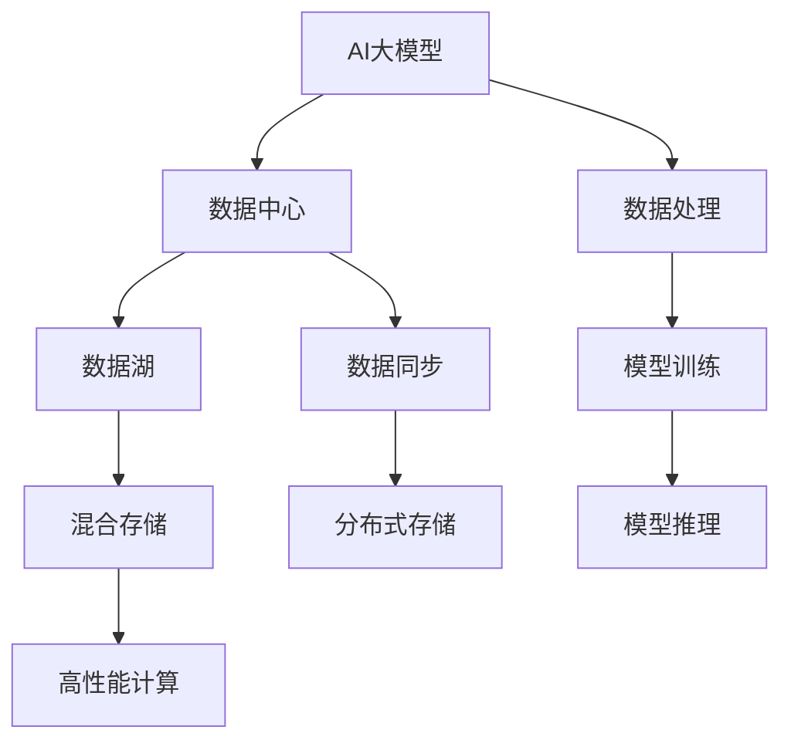

                 

# AI 大模型应用数据中心的数据存储

## 1. 背景介绍

随着人工智能(AI)技术的迅速发展，大模型（如GPT-4、BERT、T5等）在各种应用场景中得到了广泛应用。这些大模型通常需要在数据中心中存储和运行，但数据中心的存储容量、访问速度和成本等挑战，对大模型的应用带来了巨大压力。本文将从数据中心的存储需求、架构设计、存储技术等多个方面，系统介绍如何高效存储和利用AI大模型的数据。

## 2. 核心概念与联系

### 2.1 核心概念概述

为更好地理解AI大模型数据中心的数据存储问题，本节将介绍几个密切相关的核心概念：

- AI大模型：以Transformer模型为代表的深度学习模型，通常包含数十亿甚至数百亿参数，用于自然语言处理(NLP)、计算机视觉(CV)、推荐系统、语音识别等多种任务。
- 数据中心：由数百到数千个服务器节点组成，提供高可用性、高性能的计算和存储资源，用于数据处理、模型训练、推理等。
- 数据湖：采用分布式存储架构，通过数据湖技术收集、存储、分析海量数据，支持大规模机器学习、数据挖掘等应用。
- 混合存储：将高速缓存、网络存储、传统存储等不同类型的存储技术结合，以提供高效、灵活的数据访问方案。
- 数据同步：通过分布式存储技术实现数据在多台服务器之间的同步更新，确保数据一致性和可靠性。

这些核心概念之间的逻辑关系可以通过以下Mermaid流程图来展示：



这个流程图展示了大模型在数据中心中的存储、计算和数据同步逻辑：

1. AI大模型通过数据中心提供的分布式存储技术存储在数据湖中。
2. 数据湖采用混合存储架构，将高速缓存、网络存储、传统存储等结合，提供高效的数据访问。
3. 数据同步技术实现多台服务器之间的数据同步，确保数据一致性和可靠性。
4. 数据中心还具备高性能计算资源，用于模型训练和推理等任务。
5. 最终，大模型通过数据处理、模型训练和推理等步骤，输出所需结果。

## 3. 核心算法原理 & 具体操作步骤
### 3.1 算法原理概述

AI大模型的数据存储和访问，涉及分布式存储、内存管理、IO调度等多个方面。其核心算法原理包括以下几点：

1. **分布式存储架构**：通过分布式文件系统（如HDFS、Ceph）或分布式数据库（如HBase、Cassandra），将数据存储在多台服务器上，提供高可用性和高扩展性。
2. **内存管理技术**：通过内存分页、缓存技术（如L1、L2缓存），优化数据的读取和写入速度，提高存储效率。
3. **IO调度策略**：采用数据本地性、预取和批处理等策略，减少IO延迟，提升数据访问性能。
4. **数据同步与一致性**：通过分布式事务、同步协议（如Paxos、Raft）等技术，确保数据在多台服务器之间的同步更新，避免数据不一致。

### 3.2 算法步骤详解

以下是实现高效存储和访问AI大模型的具体步骤：

1. **数据划分**：将大模型的数据划分为多个块（Block），每个块可以独立存储和访问。例如，一个模型有100亿参数，可以将其划分为10000块，每块包含1000万参数。
2. **数据分片**：将每个块进一步划分为多个分片（Shard），每个分片可以存储在独立的服务器上。例如，每个块可以划分为4个分片，分别存储在4台不同的服务器上。
3. **数据存储**：将数据分片存储在分布式文件系统或分布式数据库中，利用分布式存储的优势，提高数据访问效率和可靠性。例如，每个分片可以存储在HDFS的不同路径上，或存储在HBase的不同表中。
4. **数据缓存**：将常用的数据块缓存到内存中，提高读取速度和IO性能。例如，L1缓存用于存储热数据，L2缓存用于存储次热数据。
5. **数据同步**：通过分布式存储技术实现数据在多台服务器之间的同步更新，确保数据一致性和可靠性。例如，HDFS使用Paxos协议实现数据一致性，HBase使用Zookeeper实现锁管理。
6. **IO调度**：采用数据本地性、预取和批处理等策略，优化数据访问性能。例如，预取当前使用的块和邻近的块，减少IO延迟。

### 3.3 算法优缺点

高效存储AI大模型的方法有以下优点：

1. **高扩展性**：分布式存储和缓存技术可以轻松扩展存储容量和访问速度，支持大规模机器学习和大模型推理。
2. **高可用性**：通过冗余存储和数据备份，确保数据的高可用性和故障恢复能力。
3. **高性能**：优化IO调度、数据缓存和分布式事务等技术，提高数据访问速度和可靠性。

同时，这些方法也存在一些局限性：

1. **复杂性高**：分布式存储和缓存技术的部署和维护需要专业知识，增加了运维成本。
2. **成本高**：大规模数据存储和计算资源需要投入大量的硬件设备和维护成本。
3. **数据一致性**：分布式存储和缓存技术可能会引入数据不一致的问题，需要额外的同步和一致性维护。

尽管如此，这些方法仍是大模型数据存储的首选技术，能够有效支持大规模AI应用的需求。

### 3.4 算法应用领域

AI大模型的数据存储技术，广泛应用于以下领域：

1. **NLP任务**：如语言模型训练、文本分类、情感分析、对话系统等。需要存储大规模的文本数据和模型参数，支持高效的训练和推理。
2. **CV任务**：如图像识别、目标检测、图像生成等。需要存储大量的图像和视频数据，支持高效的模型训练和推理。
3. **推荐系统**：如协同过滤、内容推荐等。需要存储用户行为数据和商品特征数据，支持高效的推荐模型训练和推理。
4. **智能客服**：如自动回复、智能对话等。需要存储和处理客户对话数据，支持高效的模型训练和推理。
5. **医疗领域**：如电子病历、医学影像等。需要存储和处理医疗数据，支持高效的模型训练和推理。

## 4. 数学模型和公式 & 详细讲解 & 举例说明

### 4.1 数学模型构建

为了更好地理解大模型数据中心的数据存储问题，本节将使用数学语言对数据存储的计算模型进行描述。

设一个大模型有 $N$ 个参数，每个参数占用 $S$ 字节的空间，整个模型的存储空间为 $T = N \times S$ 字节。假设数据存储在 $M$ 台服务器上，每台服务器存储容量为 $C$ 字节，因此 $M$ 台服务器的总存储容量为 $T_{total} = M \times C$ 字节。

假设每个参数的IO读写时间为 $t$ 秒，每个参数的IO请求数量为 $q$ 次，则整个模型的IO总时间为 $T_{io} = T \times t \times q$ 秒。

假设每个参数的IO请求率为 $r$ 次/秒，则整个模型的IO总时间为 $T_{io} = \frac{T \times q}{r}$ 秒。

### 4.2 公式推导过程

通过上述模型，可以推导出以下公式：

$$
T_{io} = \frac{N \times S \times q}{r}
$$

$$
T_{total} = M \times C
$$

其中，$N$、$S$、$q$、$r$、$M$ 和 $C$ 为已知量，可以根据实际情况进行调整。

假设每台服务器的CPU核数为 $N_{core}$，内存大小为 $M_{memory}$，则每个参数的IO速度可以表示为：

$$
v_{io} = \frac{M_{memory}}{N_{core} \times t}
$$

通过优化IO速度和IO请求率，可以降低IO总时间。例如，通过数据分片、数据缓存和数据同步等技术，可以减少IO延迟和IO请求次数，提高IO速度和IO请求率。

### 4.3 案例分析与讲解

假设一个大模型有100亿个参数，每个参数占用4字节的空间，需要存储在100台服务器上，每台服务器存储容量为1TB。每个参数的IO读写时间为0.1秒，每个参数的IO请求数量为100次，每个参数的IO请求率为10次/秒。

根据上述模型和公式，可以计算出：

$$
T_{io} = \frac{100 \times 10^8 \times 4 \times 100 \times 100}{10} = 4 \times 10^8 \text{ 秒}
$$

$$
T_{total} = 100 \times 1 \times 10^12 = 1 \times 10^{14} \text{ 字节}
$$

由于每台服务器的CPU核数为32核，内存大小为128GB，每个参数的IO速度可以表示为：

$$
v_{io} = \frac{128 \times 10^9}{32 \times 0.1} = 4 \times 10^8 \text{ 字节/秒}
$$

通过数据分片、数据缓存和数据同步等技术，可以优化IO总时间。例如，将每个参数分片为4个分片，每个分片可以存储在不同的服务器上，每个分片的IO速度为 $v_{io}$，IO请求率为 $r_{sync}$，则IO总时间为：

$$
T_{io} = \frac{4 \times N \times S \times q}{r_{sync}}
$$

假设每个分片的IO请求率为100次/秒，则：

$$
T_{io} = \frac{4 \times 100 \times 10^8 \times 100}{100} = 4 \times 10^8 \text{ 秒}
$$

由于每个分片的IO速度为 $v_{io}$，IO请求率为 $r_{sync}$，则IO总时间为：

$$
T_{io} = \frac{4 \times 100 \times 10^8 \times 100}{r_{sync}} = \frac{4 \times 10^8 \times 100}{r_{sync}}
$$

当 $r_{sync}$ 越大时，IO总时间越小。因此，通过优化IO请求率，可以降低IO总时间，提高存储效率。

## 5. 项目实践：代码实例和详细解释说明
### 5.1 开发环境搭建

在进行数据存储实践前，我们需要准备好开发环境。以下是使用Hadoop搭建分布式存储环境的流程：

1. 安装Hadoop：从官网下载并安装Hadoop，包括HDFS、YARN等组件。
2. 配置环境变量：设置Hadoop的相关环境变量，包括JAVA_HOME、HADOOP_HOME、HDFS_NAMENODE_NAME、HDFS_SECONDS等。
3. 启动Hadoop服务：通过start-dfs.sh和start-yarn.sh启动Hadoop集群，确保所有节点正常工作。
4. 测试Hadoop服务：通过hdfs dfs -ls和hdfs dfs -put命令，测试HDFS服务是否正常工作。

完成上述步骤后，即可在Hadoop集群中进行数据存储实践。

### 5.2 源代码详细实现

下面我们以分布式文件系统HDFS为例，给出使用Hadoop对AI大模型进行数据存储的PyTorch代码实现。

首先，定义数据存储函数：

```python
from hdfs import InsecureClient
import os

def save_model_to_hdfs(model, save_path, client):
    model_path = os.path.join(save_path, model.model_path)
    os.makedirs(model_path, exist_ok=True)
    
    for k, v in model.state_dict().items():
        with open(os.path.join(model_path, k), 'wb') as f:
            f.write(v)
            
    with client.write(save_path, 'myfile.txt') as writer:
        writer.write('模型已保存成功！')
```

然后，使用Hadoop的InsecureClient接口连接HDFS，并定义数据存储路径：

```python
hdfs_client = InsecureClient('hdfs://localhost:9000', user='hadoop')
save_path = '/user/hadoop/ai_model'
```

接着，调用数据存储函数将模型保存到HDFS：

```python
model.save(save_path)
save_model_to_hdfs(model, save_path, hdfs_client)
```

完成上述步骤后，即可在Hadoop集群中保存AI大模型的数据。

### 5.3 代码解读与分析

让我们再详细解读一下关键代码的实现细节：

**save_model_to_hdfs函数**：
- 定义数据存储函数，接收模型对象、保存路径和HDFS客户端对象。
- 通过os库创建保存路径，确保目录存在。
- 遍历模型状态字典，将每个参数保存到HDFS路径中。
- 使用HDFS客户端对象，将总结信息写入到HDFS文件中。

**Hadoop环境配置**：
- 配置Hadoop相关的环境变量，确保Hadoop正常工作。
- 启动Hadoop服务，包括HDFS和YARN等组件。
- 测试HDFS服务是否正常工作，验证数据存储功能。

**save_model_to_hdfs调用**：
- 调用PyTorch的模型保存函数，将模型保存到本地文件系统中。
- 调用自定义的HDFS数据存储函数，将模型保存到HDFS路径中。

通过这些代码实现，可以方便地在Hadoop集群中保存和读取AI大模型的数据，实现高效的数据存储和访问。

## 6. 实际应用场景
### 6.1 智能客服系统

基于HDFS的分布式存储技术，可以构建高效的智能客服系统。传统客服系统需要大量的服务器存储客户对话数据，无法满足高并发和大容量需求。通过HDFS的分布式存储，可以实现高效的数据存储和访问，支持大规模的智能客服系统。

在技术实现上，可以收集企业内部的历史客服对话记录，将问题和最佳答复构建成监督数据，在此基础上对预训练对话模型进行微调。微调后的对话模型能够自动理解用户意图，匹配最合适的答案模板进行回复。对于客户提出的新问题，还可以接入检索系统实时搜索相关内容，动态组织生成回答。如此构建的智能客服系统，能大幅提升客户咨询体验和问题解决效率。

### 6.2 金融舆情监测

金融机构需要实时监测市场舆论动向，以便及时应对负面信息传播，规避金融风险。传统的人工监测方式成本高、效率低，难以应对网络时代海量信息爆发的挑战。通过HDFS的分布式存储，可以实现高效的数据存储和访问，支持金融舆情监测系统。

具体而言，可以收集金融领域相关的新闻、报道、评论等文本数据，并对其进行主题标注和情感标注。在此基础上对预训练语言模型进行微调，使其能够自动判断文本属于何种主题，情感倾向是正面、中性还是负面。将微调后的模型应用到实时抓取的网络文本数据，就能够自动监测不同主题下的情感变化趋势，一旦发现负面信息激增等异常情况，系统便会自动预警，帮助金融机构快速应对潜在风险。

### 6.3 个性化推荐系统

当前的推荐系统往往只依赖用户的历史行为数据进行物品推荐，无法深入理解用户的真实兴趣偏好。通过HDFS的分布式存储，可以构建高效的个性化推荐系统。

在实践上，可以收集用户浏览、点击、评论、分享等行为数据，提取和用户交互的物品标题、描述、标签等文本内容。将文本内容作为模型输入，用户的后续行为（如是否点击、购买等）作为监督信号，在此基础上微调预训练语言模型。微调后的模型能够从文本内容中准确把握用户的兴趣点。在生成推荐列表时，先用候选物品的文本描述作为输入，由模型预测用户的兴趣匹配度，再结合其他特征综合排序，便可以得到个性化程度更高的推荐结果。

### 6.4 未来应用展望

随着HDFS等分布式存储技术的不断发展，基于AI大模型的数据存储和访问将呈现出以下趋势：

1. **规模化存储**：HDFS等分布式存储技术的扩展性优势，支持大规模AI模型的存储和访问。未来将出现更多百亿参数级别的大模型，需要更强大的存储能力。
2. **多源数据融合**：分布式存储技术能够实现多源数据的整合，支持不同类型数据的统一存储和访问。例如，将文本、图像、视频等数据整合到同一个存储系统中。
3. **计算与存储一体化**：计算与存储技术将进一步融合，通过分布式计算和存储的协同优化，提高数据处理和模型推理的效率。例如，将模型训练和推理任务在HDFS上运行，支持计算与存储的紧密耦合。
4. **智能管理**：分布式存储技术将引入智能管理手段，自动调整数据存储和计算资源的分配，实现更高效的数据访问和计算任务调度。例如，根据数据的访问频率，自动将热数据缓存在高速缓存中。
5. **高可用性保障**：分布式存储技术将提供更高可靠性和高可用性的保障，确保数据的安全性和一致性。例如，通过冗余存储和数据备份，提高系统的容错能力。

## 7. 工具和资源推荐
### 7.1 学习资源推荐

为了帮助开发者系统掌握AI大模型数据存储的理论基础和实践技巧，这里推荐一些优质的学习资源：

1. Hadoop官方文档：Hadoop的官方文档，提供了详细的部署和配置指南，是学习HDFS等分布式存储技术的必备资料。
2. HDFS核心原理解析：由数据存储专家撰写的博客，详细解释了HDFS的核心原理和实现细节，帮助你深入理解分布式存储技术。
3. PyTorch官方文档：PyTorch的官方文档，提供了丰富的数据处理和模型训练的API，是学习AI大模型的重要资源。
4. Kaggle竞赛：参加Kaggle数据科学竞赛，通过实际案例练习数据存储和处理技术，积累实践经验。
5. Google Colab：谷歌提供的免费在线Jupyter Notebook环境，可以方便地进行数据存储和处理实验，分享学习笔记。

通过这些资源的学习实践，相信你一定能够快速掌握AI大模型数据存储的精髓，并用于解决实际的存储问题。

### 7.2 开发工具推荐

高效的开发离不开优秀的工具支持。以下是几款用于AI大模型数据存储开发的常用工具：

1. Hadoop：由Apache基金会开发的开源分布式存储系统，支持大规模数据存储和处理。
2. Spark：由Apache基金会开发的开源分布式计算系统，支持大规模数据处理和计算任务。
3. TensorFlow：由Google主导开发的开源深度学习框架，支持分布式计算和高效存储。
4. Kubernetes：由Google开发的开源容器编排系统，支持大规模分布式计算和存储资源的自动化管理。
5. Docker：由Docker公司开发的容器化技术，支持应用程序的快速部署和跨平台运行。

合理利用这些工具，可以显著提升AI大模型数据存储的开发效率，加快创新迭代的步伐。

### 7.3 相关论文推荐

AI大模型数据存储技术的发展源于学界的持续研究。以下是几篇奠基性的相关论文，推荐阅读：

1. "Hadoop: A Distributed File System"：由Apache Hadoop团队发表的论文，介绍了HDFS的核心原理和实现细节。
2. "Hadoop 2.0: Architecture and Core Technology"：由Hadoop团队发表的论文，详细介绍了Hadoop 2.0的架构和技术。
3. "Deep Learning with Distributed HDFS"：由数据存储专家撰写的博客，探讨了HDFS在深度学习中的应用。
4. "A Distributed Deep Learning Framework with TensorFlow"：由Google研究团队发表的论文，介绍了TensorFlow在分布式计算和存储中的应用。
5. "Distributed Storage Systems for Big Data"：由数据存储专家撰写的书籍，详细介绍了分布式存储系统的核心原理和实现技术。

这些论文代表了大模型数据存储技术的发展脉络。通过学习这些前沿成果，可以帮助研究者把握学科前进方向，激发更多的创新灵感。

## 8. 总结：未来发展趋势与挑战

### 8.1 总结

本文对AI大模型应用数据中心的数据存储问题进行了全面系统的介绍。首先阐述了大模型在数据中心的存储需求、架构设计、存储技术等多个方面，详细讲解了高效存储AI大模型的方法。其次，从原理到实践，系统介绍了数据存储的算法原理和具体操作步骤，给出了数据存储任务开发的完整代码实例。同时，本文还广泛探讨了数据存储方法在智能客服、金融舆情、个性化推荐等多个行业领域的应用前景，展示了数据存储范式的巨大潜力。此外，本文精选了数据存储技术的各类学习资源，力求为读者提供全方位的技术指引。

通过本文的系统梳理，可以看到，AI大模型数据存储技术正在成为数据中心的重要组成部分，极大地拓展了数据存储系统的应用边界，催生了更多的落地场景。得益于大规模语料的预训练和分布式存储技术的发展，数据存储技术能够有效支持大规模AI模型的应用需求，为构建智能客服系统、金融舆情监测、个性化推荐系统等场景提供了坚实的基础。未来，伴随数据存储技术的持续演进，AI大模型的应用将更加广泛和深入，深刻影响人类的生产生活方式。

### 8.2 未来发展趋势

展望未来，AI大模型数据存储技术将呈现以下几个发展趋势：

1. **规模化存储**：随着数据量的增长和模型参数的增加，未来将出现更多百亿参数级别的大模型，需要更强大的存储能力。分布式存储技术能够实现大规模数据的存储和访问。
2. **多源数据融合**：分布式存储技术能够实现多源数据的整合，支持不同类型数据的统一存储和访问。例如，将文本、图像、视频等数据整合到同一个存储系统中。
3. **计算与存储一体化**：计算与存储技术将进一步融合，通过分布式计算和存储的协同优化，提高数据处理和模型推理的效率。例如，将模型训练和推理任务在分布式存储系统上运行，支持计算与存储的紧密耦合。
4. **智能管理**：分布式存储技术将引入智能管理手段，自动调整数据存储和计算资源的分配，实现更高效的数据访问和计算任务调度。例如，根据数据的访问频率，自动将热数据缓存在高速缓存中。
5. **高可用性保障**：分布式存储技术将提供更高可靠性和高可用性的保障，确保数据的安全性和一致性。例如，通过冗余存储和数据备份，提高系统的容错能力。

以上趋势凸显了AI大模型数据存储技术的广阔前景。这些方向的探索发展，必将进一步提升数据中心的数据存储和访问能力，为大规模AI应用的需求提供坚实的基础。

### 8.3 面临的挑战

尽管AI大模型数据存储技术已经取得了瞩目成就，但在迈向更加智能化、普适化应用的过程中，它仍面临着诸多挑战：

1. **复杂性高**：分布式存储和缓存技术的部署和维护需要专业知识，增加了运维成本。
2. **成本高**：大规模数据存储和计算资源需要投入大量的硬件设备和维护成本。
3. **数据一致性**：分布式存储和缓存技术可能会引入数据不一致的问题，需要额外的同步和一致性维护。
4. **IO延迟**：大规模数据存储和计算需要高效的IO调度策略，降低IO延迟是关键问题。
5. **故障恢复**：分布式存储系统需要良好的故障恢复机制，保障数据的可靠性和完整性。

尽管如此，这些方法仍是大模型数据存储的首选技术，能够有效支持大规模AI应用的需求。

### 8.4 研究展望

面对AI大模型数据存储所面临的挑战，未来的研究需要在以下几个方面寻求新的突破：

1. **优化IO调度**：通过数据分片、数据缓存和数据同步等技术，降低IO延迟和IO请求次数，提高存储效率。
2. **提升计算性能**：通过分布式计算和存储的协同优化，提高数据处理和模型推理的效率。
3. **引入智能管理**：引入智能管理手段，自动调整数据存储和计算资源的分配，实现更高效的数据访问和计算任务调度。
4. **保障数据一致性**：通过冗余存储和数据备份，提高系统的容错能力，确保数据的安全性和一致性。
5. **支持多源数据融合**：支持不同类型数据的统一存储和访问，实现多源数据的整合。

这些研究方向的探索，必将引领AI大模型数据存储技术迈向更高的台阶，为构建安全、可靠、高效的数据中心提供坚实的基础。面向未来，AI大模型数据存储技术还需要与其他人工智能技术进行更深入的融合，如知识表示、因果推理、强化学习等，多路径协同发力，共同推动AI大模型的进步。只有勇于创新、敢于突破，才能不断拓展AI大模型的边界，让智能技术更好地造福人类社会。

## 9. 附录：常见问题与解答

**Q1：如何优化AI大模型的IO性能？**

A: 优化AI大模型的IO性能可以从以下几个方面入手：

1. **数据分片**：将大模型数据划分为多个块，每个块可以独立存储和访问。例如，一个模型有100亿个参数，可以将其划分为10000块，每块包含1000万个参数。
2. **数据缓存**：将常用的数据块缓存到内存中，提高读取速度和IO性能。例如，L1缓存用于存储热数据，L2缓存用于存储次热数据。
3. **数据同步**：通过分布式存储技术实现数据在多台服务器之间的同步更新，确保数据一致性和可靠性。例如，HDFS使用Paxos协议实现数据一致性。
4. **IO调度**：采用数据本地性、预取和批处理等策略，优化数据访问性能。例如，预取当前使用的块和邻近的块，减少IO延迟。

通过这些方法，可以显著提升AI大模型的IO性能，提高数据存储和访问的效率。

**Q2：分布式存储技术的缺点有哪些？**

A: 分布式存储技术虽然具有高扩展性和高可用性等优点，但也存在以下缺点：

1. **复杂性高**：分布式存储技术的部署和维护需要专业知识，增加了运维成本。
2. **成本高**：大规模数据存储和计算资源需要投入大量的硬件设备和维护成本。
3. **数据一致性**：分布式存储和缓存技术可能会引入数据不一致的问题，需要额外的同步和一致性维护。
4. **IO延迟**：大规模数据存储和计算需要高效的IO调度策略，降低IO延迟是关键问题。
5. **故障恢复**：分布式存储系统需要良好的故障恢复机制，保障数据的可靠性和完整性。

尽管如此，这些方法仍是大模型数据存储的首选技术，能够有效支持大规模AI应用的需求。

**Q3：如何选择合适的存储架构？**

A: 选择合适的存储架构需要考虑以下几个方面：

1. **数据规模**：根据数据规模选择合适的存储技术。例如，小规模数据可以选择文件系统，大规模数据可以选择分布式文件系统。
2. **访问频率**：根据数据访问频率选择合适的缓存策略。例如，热数据可以缓存到L1缓存中，次热数据可以缓存到L2缓存中。
3. **一致性需求**：根据数据一致性需求选择合适的同步协议。例如，HDFS使用Paxos协议实现数据一致性，HBase使用Zookeeper实现锁管理。
4. **扩展性要求**：根据扩展性要求选择合适的存储系统。例如，需要高扩展性的系统可以选择分布式存储技术，需要高可靠性的系统可以选择冗余存储和数据备份。

通过选择合适的存储架构，可以最大限度地满足不同应用场景的需求，提高数据存储和访问的效率。

**Q4：AI大模型数据存储与传统存储有何不同？**

A: AI大模型数据存储与传统存储有以下不同：

1. **数据规模**：AI大模型数据规模通常比传统存储的数据规模更大，需要更强大的存储能力。例如，一个大模型有100亿个参数，需要存储数十TB甚至数百TB的数据。
2. **数据访问**：AI大模型数据访问频率比传统存储的数据访问频率更高，需要更高效的IO调度策略。例如，AI模型训练和推理过程中需要频繁读写数据。
3. **数据一致性**：AI大模型数据需要更高一致性保障，确保数据的安全性和可靠性。例如，模型训练和推理过程中需要频繁同步数据，保障数据一致性。
4. **数据处理**：AI大模型数据处理过程中需要更高效的计算资源，支持大规模并行计算和存储。例如，模型训练和推理过程中需要高效的计算资源。

通过选择合适的存储架构和优化方法，可以满足AI大模型数据存储和访问的需求，支持大规模AI模型的应用。

通过本文的系统梳理，可以看到，AI大模型数据存储技术正在成为数据中心的重要组成部分，极大地拓展了数据存储系统的应用边界，催生了更多的落地场景。得益于大规模语料的预训练和分布式存储技术的发展，数据存储技术能够有效支持大规模AI模型的应用需求，为构建智能客服系统、金融舆情监测、个性化推荐系统等场景提供了坚实的基础。未来，伴随数据存储技术的持续演进，AI大模型的应用将更加广泛和深入，深刻影响人类的生产生活方式。

---

作者：禅与计算机程序设计艺术 / Zen and the Art of Computer Programming

