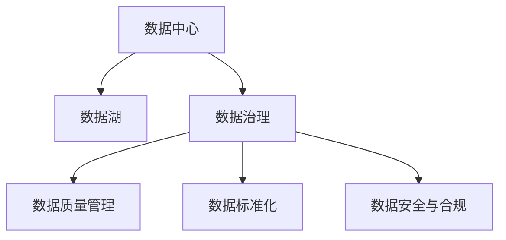

                 

# AI 大模型应用数据中心的数据治理

> 关键词：数据中心,数据治理,大模型,数据湖,数据质量管理,数据治理工具,数据标准化,数据安全与合规

## 1. 背景介绍

### 1.1 问题由来
随着人工智能技术的迅猛发展，特别是深度学习和大模型领域的突破，数据中心在AI应用中的重要性日益凸显。AI大模型的训练和推理离不开海量高质量数据，然而数据的质量和治理问题已成为制约其发展的瓶颈。数据中心需要建立一套完整的数据治理框架，确保数据的高可用性、一致性和完整性，才能支撑大模型的应用和部署。

### 1.2 问题核心关键点
数据治理是一个复杂且多层次的系统工程，涉及到数据源管理、数据质量评估、数据标准化、数据安全与合规等多个方面。具体而言，AI大模型应用数据中心的数据治理需要解决以下核心问题：

- 数据采集与整合：如何从不同数据源高效采集并整合数据，构建统一的数据湖。
- 数据质量管理：如何对数据进行全面监测和评估，确保数据的高质量。
- 数据标准化与一致性：如何定义数据标准，避免数据冗余和不一致。
- 数据安全与合规：如何在数据流通与存储过程中保障数据隐私和安全，遵守相关法律法规。

### 1.3 问题研究意义
高效的数据治理是AI大模型应用成功的关键保障。通过数据治理，可以提升数据中心的数据质量和管理水平，降低数据错误和冗余，提高大模型训练和推理的准确性和效率。同时，数据治理还能增强数据中心的安全性和合规性，保障数据的隐私和安全，降低法律风险。

数据治理的成功实施，对于推动AI技术的创新和应用具有重要意义。高质量的数据可以更好地支撑算法创新和模型优化，提高AI应用的效率和效果，从而为行业带来更大的价值和效益。

## 2. 核心概念与联系

### 2.1 核心概念概述

为更好地理解AI大模型应用数据中心的数据治理，本节将介绍几个关键概念及其相互联系：

- 数据中心(Data Center)：存储和处理大量数据的中心设施，是AI大模型应用的基础。
- 数据治理(Data Governance)：一套涵盖数据源管理、质量评估、标准化、安全合规等环节的系统性管理策略和方法。
- 数据湖(Data Lake)：将各种异构数据源整合到统一的数据存储环境，供分析和建模使用。
- 数据质量管理(Data Quality Management)：对数据进行质量评估和改进的过程，确保数据的高准确性和完整性。
- 数据标准化(Data Standardization)：制定并遵循数据格式、命名规则等标准，避免数据冗余和格式不一致。
- 数据安全与合规(Data Security & Compliance)：在数据存储、传输和使用过程中，保障数据隐私和安全，遵守相关法律法规。

这些核心概念之间的关系可以用以下Mermaid流程图来展示：



这个流程图展示了数据中心、数据湖、数据治理以及数据治理的各个子模块之间的逻辑关系：

1. 数据中心是数据的存储和处理环境，是数据湖的物理载体。
2. 数据湖是通过技术手段将不同数据源整合到统一存储环境，供分析和建模使用。
3. 数据治理是对数据质量、标准化和安全合规的系统性管理，贯穿于数据生命周期的全过程。
4. 数据质量管理、标准化和合规是数据治理的重要组成部分，它们共同作用于数据生命周期的各个阶段。

## 3. 核心算法原理 & 具体操作步骤

### 3.1 算法原理概述

AI大模型应用数据中心的数据治理，本质上是应用数据工程和数据管理的各种技术和方法，对数据进行高效管理和优化，确保数据的高质量、高可用性和高合规性。其核心思想是：

1. 统一数据标准：通过定义统一的数据标准，确保数据的一致性和规范化。
2. 数据质量评估：定期对数据进行质量评估和监测，及时发现和修复数据质量问题。
3. 数据治理工具：使用先进的数据治理工具，自动化地完成数据管理和优化。
4. 数据安全与合规：通过数据加密、访问控制等手段，保障数据隐私和安全，遵守相关法律法规。

### 3.2 算法步骤详解

AI大模型应用数据中心的数据治理，一般包括以下几个关键步骤：

**Step 1: 数据源识别与管理**
- 识别和整合数据中心中的所有数据源，包括数据库、文件、API接口等。
- 对数据源进行分类和标记，明确其来源、格式和用途。
- 建立统一的数据元数据管理平台，记录数据源的相关信息。

**Step 2: 数据质量评估**
- 定期对数据进行抽样和检查，评估其准确性、完整性、一致性、时效性等指标。
- 使用数据质量评估工具，生成数据质量报告，识别数据质量问题。
- 对发现的问题进行修复和验证，确保数据质量的持续改进。

**Step 3: 数据标准化与一致性**
- 制定并遵循统一的数据标准，如数据格式、命名规则等。
- 对数据进行清洗、转换和合并，消除数据冗余和格式不一致。
- 通过数据标准化工具，自动生成标准化的数据字典和元数据。

**Step 4: 数据安全与合规**
- 使用数据加密技术，保护数据的传输和存储过程中的隐私和安全。
- 实施访问控制策略，限制对敏感数据的访问权限。
- 定期审计数据使用和传输记录，确保数据流通与存储的合规性。

**Step 5: 数据治理工具与平台**
- 引入数据治理工具，如数据质量管理、数据标准化、数据安全与合规工具。
- 建立数据治理平台，实现对数据质量、标准化和安全合规的集中管理和监控。
- 通过可视化仪表盘，实时监控数据治理状态和效果。

### 3.3 算法优缺点

AI大模型应用数据中心的数据治理，具有以下优点：

1. 全面性：通过统一数据标准和严格的数据质量评估，确保数据的高质量和一致性。
2. 自动化：引入先进的数据治理工具，实现数据管理和优化的自动化，降低人工成本。
3. 高效性：通过数据标准化和数据安全与合规措施，提升数据处理的效率和安全性。
4. 可扩展性：采用模块化设计的数据治理平台，可以灵活扩展和定制数据治理功能。

同时，该方法也存在一定的局限性：

1. 复杂度高：数据治理涉及多方面的管理，需要系统化地进行设计和实施。
2. 成本高：引入数据治理工具和平台，初期投入较大。
3. 实施难度大：需要跨部门协调和配合，且需要持续的维护和优化。

尽管存在这些局限性，但就目前而言，数据治理仍是支撑AI大模型应用的基础保障。未来相关研究的重点在于如何进一步降低数据治理的复杂度和成本，提高数据治理的自动化水平，同时兼顾数据的安全性和合规性等因素。

### 3.4 算法应用领域

AI大模型应用数据中心的数据治理，广泛应用于金融、医疗、电信、制造等多个行业领域，确保数据的高质量和高安全性，推动AI技术的广泛应用。

- 金融行业：在金融风控、信贷评估、客户分析等任务中，数据治理确保数据的准确性和完整性，提升金融服务的智能化水平。
- 医疗行业：在电子病历管理、疾病预测、临床决策支持等任务中，数据治理保障数据的隐私和安全，促进医疗数据的互操作性。
- 电信行业：在客户管理、网络优化、业务分析等任务中，数据治理提高数据的一致性和可靠性，支持电信业务的智能化发展。
- 制造行业：在供应链管理、设备监测、产品设计等任务中，数据治理优化数据质量，提升制造过程的自动化和精细化。

## 4. 数学模型和公式 & 详细讲解 & 举例说明

### 4.1 数学模型构建

数据治理的核心在于数据质量管理，即通过统计和分析方法，对数据进行全面监测和评估。假设有一个数据集 $D$，包含 $n$ 个样本和 $d$ 个特征。数据质量管理的目标是最大化数据质量指标 $Q(D)$，其数学模型为：

$$
Q(D) = \max \left\{\sum_{i=1}^n \sum_{j=1}^d w_{ij}(x_{ij} - \mu_{ij})^2 \right\}
$$

其中 $w_{ij}$ 为特征 $x_{ij}$ 的权重，$\mu_{ij}$ 为特征 $x_{ij}$ 的均值。

### 4.2 公式推导过程

为了更直观地理解数据质量评估的数学模型，我们可以通过一个简单的案例来推导：

假设有一个包含3个特征的样本数据集 $D$，特征 $x_1, x_2, x_3$，每个特征的权重为 $w_1 = 0.5, w_2 = 0.3, w_3 = 0.2$。假设每个特征的均值分别为 $\mu_1 = 2, \mu_2 = 3, \mu_3 = 4$。则数据质量指标 $Q(D)$ 可以计算为：

$$
Q(D) = \sum_{i=1}^n \left(0.5(x_{i1} - 2)^2 + 0.3(x_{i2} - 3)^2 + 0.2(x_{i3} - 4)^2\right)
$$

将数据集 $D$ 中的每个样本 $x_i$ 代入公式，即可计算出每个样本的数据质量分数，进而评估数据集的整体质量。

### 4.3 案例分析与讲解

以金融行业中的信用评分任务为例，数据质量管理的具体步骤包括：

1. 数据采集：收集客户的财务数据、信用记录等，存储到数据中心。
2. 数据清洗：对缺失值、异常值进行清洗和处理，确保数据的完整性和准确性。
3. 数据标准化：定义统一的特征标准，如年龄、收入、资产等，确保数据的一致性。
4. 数据质量评估：使用数据质量评估工具，如数据可视化仪表盘，监控数据质量指标，及时发现和修复问题。
5. 数据安全与合规：采用数据加密、访问控制等措施，确保数据的隐私和安全，遵守相关法律法规。

通过上述步骤，可以构建一个高效、可靠的数据治理框架，支持金融行业的信用评分任务，提升信用评分的准确性和公平性。

## 5. 项目实践：代码实例和详细解释说明

### 5.1 开发环境搭建

在进行数据治理项目实践前，我们需要准备好开发环境。以下是使用Python进行Pandas开发的环境配置流程：

1. 安装Anaconda：从官网下载并安装Anaconda，用于创建独立的Python环境。

2. 创建并激活虚拟环境：
```bash
conda create -n data-governance python=3.8 
conda activate data-governance
```

3. 安装Pandas：
```bash
pip install pandas
```

4. 安装其他工具包：
```bash
pip install numpy matplotlib scikit-learn
```

完成上述步骤后，即可在`data-governance`环境中开始数据治理项目实践。

### 5.2 源代码详细实现

下面我们以数据质量评估为例，给出使用Pandas库进行数据治理的Python代码实现。

首先，定义数据质量评估函数：

```python
import pandas as pd
import numpy as np

def evaluate_data_quality(data):
    # 定义特征和权重
    features = ['age', 'income', 'credit_score']
    weights = {'age': 0.5, 'income': 0.3, 'credit_score': 0.2}
    
    # 计算每个特征的均值
    means = data[features].mean()
    
    # 计算每个特征的数据质量分数
    scores = np.sum((data[features] - means)**2 * weights.values)
    
    # 计算整体数据质量指标
    return scores
```

然后，测试函数：

```python
# 创建一个示例数据集
data = pd.DataFrame({
    'age': [25, 35, 45, np.nan, 55],
    'income': [5000, 10000, 15000, np.nan, 20000],
    'credit_score': [650, 700, 750, 800, 900]
})

# 评估数据质量
quality_score = evaluate_data_quality(data)
print(f'数据质量分数为：{quality_score:.2f}')
```

通过上述代码，可以看到如何使用Pandas库进行数据质量评估。

### 5.3 代码解读与分析

让我们再详细解读一下关键代码的实现细节：

**evaluate_data_quality函数**：
- 输入参数为数据集DataFrame，定义了特征名称和权重。
- 计算每个特征的均值，并使用公式计算数据质量分数。
- 返回整体数据质量指标。

**测试代码**：
- 创建一个包含5个样本的示例数据集，包含年龄、收入和信用评分。
- 调用evaluate_data_quality函数计算数据质量分数，并输出结果。

可以看到，Pandas库提供了强大的数据处理和分析功能，可以方便地进行数据质量评估和数据治理。

## 6. 实际应用场景

### 6.1 金融行业数据治理

金融行业对数据质量的要求非常严格，数据治理在信用评分、风险评估、客户分析等任务中发挥了重要作用。

具体而言，可以使用数据治理工具，对客户的财务数据、信用记录等进行全面监测和评估，确保数据的准确性和完整性。通过数据标准化和清洗，消除数据冗余和格式不一致，提升数据质量。同时，采用数据加密和访问控制措施，保障数据的隐私和安全，遵守相关法律法规。

通过数据治理，金融行业能够构建高效、可靠的数据治理框架，提升信用评分的准确性和公平性，降低信用风险，提高金融服务的智能化水平。

### 6.2 医疗行业数据治理

医疗行业的数据治理主要关注电子病历、实验室数据、临床数据等，数据的质量和隐私问题尤为关键。

通过数据治理，可以确保数据的准确性和完整性，提升疾病预测、临床决策支持等任务的性能。采用数据加密和访问控制措施，保障数据的隐私和安全，避免泄露患者的敏感信息。同时，定期进行数据质量评估和修复，确保数据的及时性和可靠性。

通过数据治理，医疗行业能够构建高效、可靠的数据治理框架，提升医疗数据的互操作性，促进电子病历管理和疾病预测等任务的智能化发展。

### 6.3 电信行业数据治理

电信行业的数据治理主要关注客户数据、网络数据、业务数据等，数据的质量和隐私问题尤为关键。

通过数据治理，可以确保数据的准确性和完整性，提升客户管理、网络优化、业务分析等任务的性能。采用数据加密和访问控制措施，保障数据的隐私和安全，避免泄露客户的敏感信息。同时，定期进行数据质量评估和修复，确保数据的及时性和可靠性。

通过数据治理，电信行业能够构建高效、可靠的数据治理框架，提升客户管理和服务质量，支持电信业务的智能化发展。

### 6.4 制造行业数据治理

制造行业的数据治理主要关注生产数据、设备数据、供应链数据等，数据的质量和一致性问题尤为关键。

通过数据治理，可以确保数据的准确性和一致性，提升供应链管理、设备监测、产品设计等任务的性能。采用数据标准化和清洗，消除数据冗余和格式不一致，提升数据质量。同时，采用数据加密和访问控制措施，保障数据的隐私和安全，避免泄露设备或供应链的敏感信息。

通过数据治理，制造行业能够构建高效、可靠的数据治理框架，提升制造过程的自动化和精细化，优化供应链管理，降低生产成本。

## 7. 工具和资源推荐

### 7.1 学习资源推荐

为了帮助开发者系统掌握数据治理的理论基础和实践技巧，这里推荐一些优质的学习资源：

1. 《数据治理与企业数据管理》系列博文：由数据治理专家撰写，深入浅出地介绍了数据治理的原理、方法和最佳实践。

2. Kaggle《数据质量管理》课程：Kaggle提供的免费在线课程，涵盖数据质量评估、数据清洗、数据标准化等内容。

3. 《数据治理最佳实践指南》书籍：详细介绍了数据治理的流程、技术和工具，是数据治理领域的经典教材。

4. DataRobot官方文档：DataRobot提供的完整数据治理工具文档，包含数据质量评估、数据标准化、数据安全与合规等功能。

5. 《数据治理工具与技术》书籍：介绍了多种主流的数据治理工具和技术，如数据质量管理、数据标准化、数据安全与合规等。

通过对这些资源的学习实践，相信你一定能够快速掌握数据治理的精髓，并用于解决实际的数据问题。

### 7.2 开发工具推荐

高效的数据治理离不开优秀的工具支持。以下是几款用于数据治理开发的常用工具：

1. Pandas：基于Python的强大数据处理库，支持数据清洗、数据标准化、数据质量评估等功能。

2. SQL：关系型数据库的语言，适合复杂的数据查询和数据关联操作。

3. Apache Kafka：分布式流处理系统，适合实时数据采集和传输。

4. Apache Hadoop：大数据处理框架，适合大规模数据存储和分析。

5. Apache Cassandra：分布式NoSQL数据库，适合大规模数据存储和访问。

6. Apache Spark：大数据处理框架，支持数据清洗、数据标准化、数据质量评估等功能。

合理利用这些工具，可以显著提升数据治理任务的开发效率，加快创新迭代的步伐。

### 7.3 相关论文推荐

数据治理技术的发展源于学界的持续研究。以下是几篇奠基性的相关论文，推荐阅读：

1. "Data Governance: Towards a Concise Definition" by Linda Bobrow and George H. Gray, Journal of Data and Information Quality, 2001。

2. "Building a Data Governance Framework" by Garry Goldberg and David McClean, Data Quality & Trust, 2014。

3. "The Case for Data Governance" by Tom Moniz, Journal of Data Management, 2002。

4. "Data Governance: A Conceptual Framework" by Michael K. Boylan and Philippe Huylenbroeck, Journal of Data and Information Quality, 2013。

5. "Data Governance and Data Quality: A Global Perspective" by Dr. Christoph Busch, Journal of Data and Information Quality, 2016。

这些论文代表了大数据治理领域的研究进展，通过学习这些前沿成果，可以帮助研究者把握学科前进方向，激发更多的创新灵感。

## 8. 总结：未来发展趋势与挑战

### 8.1 总结

本文对AI大模型应用数据中心的数据治理进行了全面系统的介绍。首先阐述了数据治理在AI大模型应用中的重要性，明确了数据治理在数据质量、标准化和安全合规等方面的关键作用。其次，从原理到实践，详细讲解了数据治理的数学模型和关键步骤，给出了数据治理任务开发的完整代码实例。同时，本文还广泛探讨了数据治理方法在金融、医疗、电信、制造等多个行业领域的应用前景，展示了数据治理范式的巨大潜力。此外，本文精选了数据治理技术的各类学习资源，力求为读者提供全方位的技术指引。

通过本文的系统梳理，可以看到，数据治理是大模型应用成功的关键保障。通过高效的数据治理，可以提升数据中心的数据质量和管理水平，降低数据错误和冗余，提高大模型训练和推理的准确性和效率。同时，数据治理还能增强数据中心的安全性和合规性，保障数据的隐私和安全，降低法律风险。

### 8.2 未来发展趋势

展望未来，数据治理技术将呈现以下几个发展趋势：

1. 自动化与智能化：随着AI和大数据技术的不断进步，数据治理将越来越多地依赖于自动化和智能化工具，减少人工干预和操作复杂度。

2. 数据标准与元数据管理：数据标准和元数据的定义与管理将更加严格和规范，确保数据的统一性和一致性。

3. 实时数据质量监控：通过实时数据质量监控系统，及时发现和修复数据质量问题，提升数据的实时性和可靠性。

4. 数据治理的跨部门协作：跨部门协作将成为数据治理的重要组成部分，需要不同部门共同制定和实施数据治理策略。

5. 数据治理的云化部署：随着云计算和大数据平台的发展，数据治理的部署将越来越多地依赖于云平台，实现数据治理的集中管理和监控。

6. 数据治理的全球化：数据治理将越来越多地考虑全球化因素，如数据隐私保护、跨境数据传输等。

以上趋势凸显了数据治理技术的广阔前景。这些方向的探索发展，必将进一步提升数据治理的效果和效率，为AI大模型的应用提供更加坚实的基础。

### 8.3 面临的挑战

尽管数据治理技术已经取得了显著进展，但在迈向更加智能化、普适化应用的过程中，它仍面临诸多挑战：

1. 数据复杂度增加：随着数据量的爆炸性增长和数据类型的多样化，数据治理的复杂度将不断增加。

2. 数据安全与隐私问题：数据治理需要考虑数据的安全性和隐私保护，避免数据泄露和滥用。

3. 跨部门协作难度大：数据治理需要跨部门协作，不同部门的数据格式、标准和流程差异，增加了协作难度。

4. 数据治理工具的局限性：现有的数据治理工具往往功能有限，需要持续的维护和升级。

5. 数据质量标准的制定与执行：如何制定统一的数据质量标准，并确保各部门的执行，仍是一个难题。

6. 数据治理的全球化挑战：不同国家和地区的法律和监管政策差异，增加了全球化数据治理的复杂度。

正视数据治理面临的这些挑战，积极应对并寻求突破，将是大模型应用数据治理走向成熟的必由之路。相信随着学界和产业界的共同努力，这些挑战终将一一被克服，数据治理技术必将在构建安全、可靠、可解释、可控的智能系统中扮演越来越重要的角色。

### 8.4 研究展望

面向未来，数据治理技术还需要与其他人工智能技术进行更深入的融合，如知识表示、因果推理、强化学习等，多路径协同发力，共同推动数据治理技术的发展。具体而言，未来的研究需要在以下几个方面寻求新的突破：

1. 引入更多先验知识：将符号化的先验知识，如知识图谱、逻辑规则等，与数据治理过程进行巧妙融合，引导数据治理过程学习更准确、合理的知识表示。

2. 引入因果分析和博弈论工具：将因果分析方法引入数据治理过程，识别出数据治理过程的关键特征，增强输出解释的因果性和逻辑性。借助博弈论工具刻画数据治理过程的参与者关系，主动探索并规避数据治理过程的脆弱点，提高系统稳定性。

3. 纳入伦理道德约束：在数据治理目标中引入伦理导向的评估指标，过滤和惩罚有偏见、有害的输出倾向。同时加强人工干预和审核，建立数据治理过程的监管机制，确保数据治理过程的公正性和公平性。

4. 结合更多技术手段：将自然语言处理、图像处理、语音处理等技术手段引入数据治理过程，提高数据治理的效率和质量。

这些研究方向的探索，必将引领数据治理技术迈向更高的台阶，为构建安全、可靠、可解释、可控的智能系统铺平道路。总之，数据治理需要开发者根据具体任务，不断迭代和优化数据治理策略和方法，方能得到理想的效果。

## 9. 附录：常见问题与解答

**Q1：数据治理对AI大模型应用的重要性是什么？**

A: 数据治理是AI大模型应用成功的关键保障。通过数据治理，可以提升数据中心的数据质量和管理水平，降低数据错误和冗余，提高大模型训练和推理的准确性和效率。同时，数据治理还能增强数据中心的安全性和合规性，保障数据的隐私和安全，降低法律风险。

**Q2：如何进行数据治理的自动化与智能化？**

A: 数据治理的自动化与智能化可以通过引入先进的数据治理工具和技术实现。例如，使用数据治理平台，自动进行数据质量评估、数据标准化和数据安全与合规等管理任务。同时，利用AI技术，如自然语言处理、机器学习等，实现数据治理过程的智能化决策和优化。

**Q3：数据治理需要考虑哪些数据安全与隐私问题？**

A: 数据治理需要考虑以下数据安全与隐私问题：

1. 数据加密：使用数据加密技术，保护数据的传输和存储过程中的隐私和安全。

2. 访问控制：实施访问控制策略，限制对敏感数据的访问权限，确保数据的安全性。

3. 数据脱敏：对敏感数据进行脱敏处理，避免数据泄露和滥用。

4. 合规性检查：定期审计数据使用和传输记录，确保数据治理过程符合相关法律法规。

5. 数据隐私保护：在数据存储和传输过程中，采用隐私保护技术，如差分隐私等，保护个人隐私。

**Q4：数据治理过程中如何进行跨部门协作？**

A: 数据治理过程中，跨部门协作是关键。具体方法包括：

1. 建立数据治理委员会：跨部门组成数据治理委员会，制定统一的数据治理策略和标准。

2. 数据治理培训：对各部门的员工进行数据治理培训，提升数据治理意识和能力。

3. 数据治理工具共享：共享数据治理工具和技术，确保各部门在数据治理过程中使用统一的工具和方法。

4. 定期数据治理会议：定期召开数据治理会议，协调各部门的数据治理工作，解决数据治理过程中出现的问题。

**Q5：如何制定统一的数据质量标准？**

A: 制定统一的数据质量标准需要以下步骤：

1. 数据质量评估：通过数据分析和评估，识别数据质量问题。

2. 数据质量监控：建立数据质量监控系统，实时监测数据质量指标。

3. 数据质量反馈：定期反馈数据质量评估结果，识别数据质量问题。

4. 数据质量改进：对发现的数据质量问题进行修复和验证，确保数据质量的持续改进。

5. 数据质量标准制定：根据数据质量评估结果和改进经验，制定统一的数据质量标准。

以上是数据治理的常见问题及解答，希望能帮助你更好地理解数据治理的重要性和方法。

---

作者：禅与计算机程序设计艺术 / Zen and the Art of Computer Programming

