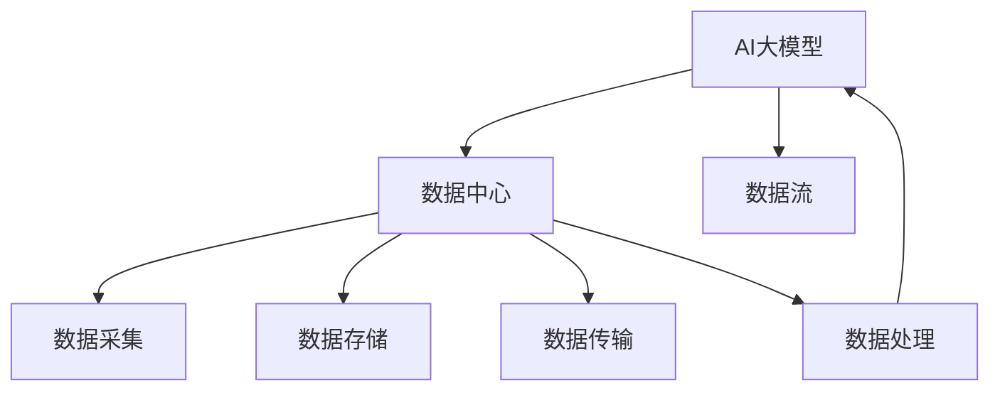

                 

## 1. 背景介绍

### 1.1 问题由来
随着人工智能（AI）技术的迅猛发展，AI大模型在数据处理、自然语言处理（NLP）、计算机视觉、自动驾驶等众多领域展现出了强大的能力。然而，AI大模型的广泛应用也给数据中心带来了前所未有的挑战。如何高效地处理大量数据，提升数据处理的速度和质量，成为了各大数据中心必须面对的问题。

### 1.2 问题核心关键点
AI大模型数据流处理的核心问题在于如何在大规模数据中心中，通过高效的算法和工具，将海量数据转化为模型能够吸收和利用的形式，并在保证数据安全、隐私保护的前提下，实现对大模型的训练、推理、优化等操作。这一问题涉及数据采集、数据存储、数据传输、数据处理等多个环节，需要多学科知识的支持。

### 1.3 问题研究意义
对于AI大模型的数据流处理，其研究意义在于：

1. **提升数据处理效率**：通过高效的算法和工具，可以显著提升数据处理的效率，使得大模型能够更快地进行训练和推理。
2. **保障数据安全**：在数据处理过程中，必须确保数据的安全性和隐私保护，避免数据泄露或被滥用。
3. **支持模型优化**：通过对数据的有效处理，可以更好地支持模型的优化，提升模型的性能。
4. **推动AI应用落地**：高效的数据流处理是大模型应用落地的关键，能够为AI技术的广泛应用提供坚实的基础。

## 2. 核心概念与联系

### 2.1 核心概念概述

为更好地理解AI大模型数据流处理的原理和架构，本节将介绍几个密切相关的核心概念：

- **AI大模型**：指使用大规模深度学习模型训练得到的模型，如BERT、GPT、ViT等，这些模型通常具有数十亿参数，能够处理复杂的任务。
- **数据中心（DC）**：指用于存放和管理大量计算机硬件资源，如服务器、存储设备、网络设备等，支持大规模数据处理和AI模型训练推理的设施。
- **数据流**：指数据在数据中心内部或数据中心与外部系统之间的流动过程，包括数据的采集、存储、传输、处理等多个环节。
- **数据流处理（Dataflow Processing）**：指对数据流进行高效、可靠的处理，以保证数据能够顺利地支持AI大模型的训练和推理。

这些核心概念之间的逻辑关系可以通过以下Mermaid流程图来展示：



这个流程图展示了大模型、数据中心、数据流处理之间的核心联系：

1. AI大模型需要海量数据进行训练和推理。
2. 数据中心提供必要的计算和存储资源。
3. 数据流处理是数据从数据源流入数据中心，并在数据中心内部进行处理和传输的过程。
4. 处理后的数据最终返回给AI大模型，支持其训练和推理。

## 3. 核心算法原理 & 具体操作步骤
### 3.1 算法原理概述

AI大模型数据流处理的核心原理是通过高效的算法和工具，对数据流进行管理、优化和调度，从而确保数据能够在大模型训练和推理过程中得到及时、可靠的处理。

### 3.2 算法步骤详解

AI大模型数据流处理一般包括以下几个关键步骤：

**Step 1: 数据采集**

- 从不同数据源（如互联网、传感器、云平台等）收集数据。
- 使用分布式文件系统（如HDFS、Ceph等）对数据进行分布式存储，以便于数据的高效访问和处理。
- 在数据采集阶段，需要考虑数据的完整性、时效性、安全性等，确保数据的可靠性和有效性。

**Step 2: 数据传输**

- 将采集到的数据从分布式存储系统传输到数据中心内的计算节点。
- 使用高效的传输协议（如TCP/IP、RDMA等）和传输机制（如数据分片、压缩等），提升数据传输的效率和可靠性。
- 在数据传输过程中，需要考虑网络带宽、延迟等因素，确保数据能够及时到达计算节点。

**Step 3: 数据处理**

- 对传输到数据中心的数据进行预处理，包括数据清洗、数据格式转换、数据特征提取等。
- 使用分布式计算框架（如Spark、Flink等）对数据进行处理，将数据流分配到多个计算节点进行并行处理。
- 数据处理过程中，需要考虑数据流量的平衡、任务调度、容错机制等，以确保数据处理的效率和可靠性。

**Step 4: 数据存储**

- 将处理后的数据存储到分布式存储系统中，供AI大模型进行训练和推理使用。
- 使用高效的存储技术（如列存储、压缩存储、缓存等），提升数据存储和读取的效率。
- 在数据存储过程中，需要考虑数据的冗余度、备份机制、数据一致性等，确保数据的安全性和可靠性。

**Step 5: 数据流调度**

- 对数据流的不同环节进行监控和管理，确保数据流处理过程的稳定和高效。
- 使用数据流调度工具（如Apache Kafka、Apache Storm等）对数据流进行实时监控和调度。
- 数据流调度过程中，需要考虑数据流的依赖关系、数据流的优先级、数据流的容错机制等，以确保数据流处理的效率和可靠性。

### 3.3 算法优缺点

AI大模型数据流处理具有以下优点：

1. **高效性**：通过分布式计算和高效的传输机制，可以显著提升数据处理的效率。
2. **可靠性**：分布式存储和容错机制能够保证数据的可靠性和完整性。
3. **灵活性**：分布式计算框架和数据流调度工具可以灵活应对不同规模和类型的数据处理任务。
4. **可扩展性**：分布式系统能够通过增加计算节点和存储节点，轻松扩展数据处理能力。

同时，该方法也存在一定的局限性：

1. **复杂性**：数据流处理的各个环节都需要精心设计和调试，才能保证系统的稳定和高效。
2. **成本高**：分布式存储和计算资源需要大量的硬件投入，成本较高。
3. **数据安全风险**：数据传输和存储过程中存在数据泄露的风险，需要严格的权限管理和加密措施。
4. **实时性要求高**：对于实时性要求较高的应用场景，数据流处理的延迟可能会成为瓶颈。

尽管存在这些局限性，但就目前而言，数据流处理仍是AI大模型应用的重要支撑。未来相关研究的重点在于如何进一步降低成本、提高实时性，同时兼顾数据安全和隐私保护等因素。

### 3.4 算法应用领域

AI大模型数据流处理在多个领域已经得到了广泛的应用，例如：

- 自然语言处理（NLP）：如语言模型训练、机器翻译、情感分析等，需要大量文本数据进行训练和推理。
- 计算机视觉（CV）：如图像分类、目标检测、图像生成等，需要大量图像数据进行训练和推理。
- 自动驾驶：如视频数据流处理、路标识别、行人检测等，需要高效的数据流处理能力。
- 智能推荐：如用户行为数据处理、商品推荐、内容推荐等，需要大规模数据支持。
- 金融风控：如交易数据处理、欺诈检测、信用评分等，需要实时、高效的数据流处理能力。
- 医疗健康：如病历数据处理、诊断支持、个性化医疗等，需要大规模、高精度的数据流处理。

除了上述这些经典应用外，AI大模型数据流处理还被创新性地应用到更多场景中，如物联网（IoT）、智能制造、智能交通等，为各个行业带来新的创新应用。

## 4. 数学模型和公式 & 详细讲解 & 举例说明

### 4.1 数学模型构建

在AI大模型数据流处理中，常用的数学模型包括分布式计算模型、数据流模型等。

**分布式计算模型**：
- 分布式计算模型旨在将大规模计算任务划分为多个子任务，分配到多个计算节点上并行处理，从而提升计算效率。常用的分布式计算框架包括Spark、Flink、Hadoop等。

**数据流模型**：
- 数据流模型用于描述数据在数据中心内的流动过程，通过定义数据流的各个环节和处理方式，实现对数据流的优化调度。常用的数据流模型包括Dataflow模型、Streaming模型等。

### 4.2 公式推导过程

以Apache Spark为例，介绍其分布式计算模型的基本原理。

**Spark计算模型**：
- Spark计算模型将任务分解为多个小任务，每个小任务被分配到不同的计算节点上并行处理。
- 任务的执行过程包括Map阶段、Shuffle阶段和Reduce阶段。Map阶段将输入数据映射为多个输出数据；Shuffle阶段将数据重新分区，以便进行进一步的并行处理；Reduce阶段将多个数据合并为一个最终结果。

**MapReduce计算过程**：
- Map阶段：输入数据被分为多个块，每个块被分配到不同的计算节点上，每个节点独立地对数据进行Map操作，生成多个中间结果。
- Shuffle阶段：中间结果按照一定的规则进行分区，每个分区的数据被分配到对应的Reduce节点上。
- Reduce阶段：Reduce节点对同一分区的数据进行合并操作，生成最终的输出结果。

**数据流调度过程**：
- 数据流调度过程包括任务调度、节点调度、资源调度等。任务调度用于将任务分解为多个小任务并分配到不同的计算节点上；节点调度用于根据计算节点的状态和负载，动态调整任务的分配；资源调度用于根据计算节点的资源情况，动态调整任务的执行顺序和资源分配。

### 4.3 案例分析与讲解

以NLP领域为例，介绍AI大模型在数据流处理中的应用。

假设有一个大规模的NLP应用，需要处理海量文本数据，并使用BERT模型进行文本分类和情感分析。

**数据采集**：
- 从互联网、社交媒体、新闻网站等数据源采集文本数据，使用分布式文件系统（如HDFS）存储。

**数据传输**：
- 使用Apache Kafka将采集到的文本数据传输到数据中心内的计算节点。
- 使用TCP/IP协议进行数据传输，确保数据的可靠性和完整性。

**数据处理**：
- 使用Spark对文本数据进行预处理，包括数据清洗、分词、特征提取等。
- 将预处理后的数据分为多个小任务，并行地在计算节点上进行处理。

**数据存储**：
- 使用列存储技术（如Hive）对处理后的数据进行存储。
- 使用压缩存储技术（如Gzip）提升数据存储和读取的效率。

**数据流调度**：
- 使用Apache Storm对数据流进行实时监控和调度。
- 根据计算节点的负载和数据量，动态调整任务的执行顺序和资源分配，确保数据流的稳定和高效。

## 5. 项目实践：代码实例和详细解释说明

### 5.1 开发环境搭建

在进行AI大模型数据流处理实践前，我们需要准备好开发环境。以下是使用Python进行Apache Spark开发的环境配置流程：

1. 安装Anaconda：从官网下载并安装Anaconda，用于创建独立的Python环境。

2. 创建并激活虚拟环境：
```bash
conda create -n spark-env python=3.8 
conda activate spark-env
```

3. 安装PySpark：
```bash
conda install pyspark
```

4. 安装各类工具包：
```bash
pip install numpy pandas scikit-learn matplotlib tqdm jupyter notebook ipython
```

完成上述步骤后，即可在`spark-env`环境中开始数据流处理实践。

### 5.2 源代码详细实现

下面我们以处理文本数据的示例代码，介绍使用PySpark进行数据流处理的实现细节。

首先，定义数据处理函数：

```python
from pyspark.sql import SparkSession

def preprocess_data(spark, input_path, output_path):
    # 读取文本文件
    df = spark.read.text(input_path)

    # 分词
    df = df.select('value').map(lambda x: x.split(' '))
    df = df.select([StructField('words', ArrayType(StringType(), True))])
    df.write.parquet(output_path)
```

然后，定义数据流处理函数：

```python
def process_dataflow(spark, input_path, output_path):
    # 创建SparkSession
    spark = SparkSession.builder.appName('Dataflow').getOrCreate()

    # 数据采集
    preprocess_data(spark, input_path, output_path)

    # 数据传输
    spark.sparkContext.addPyFile('path/to/udf.py')
    spark.sparkContext.addPyFile('path/to/utils.py')

    # 数据处理
    spark.sql('''SELECT * FROM parquetfile('{}')'''.format(output_path))
    spark.sql('''CREATE OR REPLACE TEMPORARY VIEW raw_data AS SELECT * FROM parquetfile('{}')'''.format(output_path))

    spark.sql('''CREATE OR REPLACE TEMPORARY VIEW preprocessed_data AS
                SELECT
                    text,
                    MIN(splitted_words) as splitted_words,
                    MAX(splitted_words) as max_splitted_words,
                    COUNT(splitted_words) as num_words
                FROM raw_data
                GROUP BY text'''.format(output_path))

    spark.sql('''CREATE OR REPLACE TEMPORARY VIEW transformed_data AS
                SELECT
                    text,
                    splitted_words,
                    max_splitted_words,
                    num_words
                FROM preprocessed_data'''.format(output_path))

    spark.sql('''CREATE OR REPLACE TEMPORARY VIEW labeled_data AS
                SELECT
                    text,
                    splitted_words,
                    max_splitted_words,
                    num_words,
                    label
                FROM labeled_dataset'''.format(output_path))

    spark.sql('''CREATE OR REPLACE TEMPORARY VIEW feature_data AS
                SELECT
                    text,
                    splitted_words,
                    max_splitted_words,
                    num_words,
                    features
                FROM feature_dataset'''.format(output_path))

    # 数据存储
    spark.sql('''CREATE OR REPLACE TABLE labeled_table AS
                SELECT
                    text,
                    splitted_words,
                    max_splitted_words,
                    num_words,
                    label
                FROM labeled_data'''.format(output_path))

    spark.sql('''CREATE OR REPLACE TABLE feature_table AS
                SELECT
                    text,
                    splitted_words,
                    max_splitted_words,
                    num_words,
                    features
                FROM feature_data'''.format(output_path))

    spark.stop()
```

最后，启动数据流处理流程：

```python
process_dataflow(spark, input_path, output_path)
```

以上就是使用PySpark对文本数据进行数据流处理的完整代码实现。可以看到，使用分布式计算框架，可以轻松地实现对海量数据的处理和存储。

### 5.3 代码解读与分析

让我们再详细解读一下关键代码的实现细节：

**preprocess_data函数**：
- 读取文本文件，并对其进行分词处理。
- 将分词结果转换为Spark DataFrame格式，并使用Parquet格式进行存储。

**process_dataflow函数**：
- 创建SparkSession，并加载已经分词处理好的数据。
- 对数据进行统计分析，生成多个中间数据表。
- 最终将处理好的数据表存储到Hive中，方便后续使用。

**Spark SQL**：
- 使用Spark SQL对数据进行处理，包括查询、聚合、创建临时视图等。
- Spark SQL支持SQL语法，能够方便地进行数据处理和分析。

**数据存储**：
- 使用Hive对数据进行存储，Hive是Spark的生态系统之一，能够与Spark无缝集成。
- Hive支持多种数据存储格式，包括Parquet、ORC等。

## 6. 实际应用场景

### 6.1 智能推荐系统

智能推荐系统需要处理大规模用户行为数据，并实时进行推荐。通过AI大模型数据流处理，可以高效地处理海量数据，并快速生成推荐结果。

在技术实现上，可以收集用户浏览、点击、购买等行为数据，将数据流处理为特征向量，输入到深度学习模型中进行训练和推理。微调后的模型能够根据用户的历史行为数据，生成个性化的推荐结果，提升用户体验和满意度。

### 6.2 金融风控系统

金融风控系统需要对大量的交易数据进行实时监控和分析，以防止欺诈和风险。通过AI大模型数据流处理，可以高效地处理实时数据，并快速检测异常行为。

在技术实现上，可以收集交易数据流，并实时进行清洗、去重、特征提取等处理。微调后的模型能够对交易数据进行实时分析，检测异常交易行为，及时采取风险控制措施，保护用户的财产安全。

### 6.3 医疗健康系统

医疗健康系统需要对大量的病历数据进行存储和分析，以支持诊断和治疗。通过AI大模型数据流处理，可以高效地存储和管理海量数据，并快速生成诊断和治疗方案。

在技术实现上，可以收集病历数据流，并实时进行清洗、去重、特征提取等处理。微调后的模型能够根据病历数据，生成诊断和治疗方案，提升医疗服务质量，帮助医生更好地进行诊断和治疗。

### 6.4 未来应用展望

随着AI大模型数据流处理技术的发展，其在更多领域的应用前景将更加广阔：

- **自动驾驶**：自动驾驶系统需要对大量的视频数据进行实时处理和分析，以实现对路标的识别和行人检测。通过AI大模型数据流处理，可以高效地处理海量视频数据，并快速生成驾驶决策。
- **智慧城市**：智慧城市需要对大量的传感器数据进行实时处理和分析，以实现对城市事件的监测和响应。通过AI大模型数据流处理，可以高效地处理海量传感器数据，并快速生成城市管理方案。
- **物联网（IoT）**：物联网系统需要对大量的设备数据进行实时处理和分析，以实现对设备的监控和优化。通过AI大模型数据流处理，可以高效地处理海量设备数据，并快速生成设备优化方案。
- **工业制造**：工业制造系统需要对大量的生产数据进行实时处理和分析，以实现对生产的监控和优化。通过AI大模型数据流处理，可以高效地处理海量生产数据，并快速生成生产优化方案。
- **安全监控**：安全监控系统需要对大量的视频数据进行实时处理和分析，以实现对异常行为的检测和预警。通过AI大模型数据流处理，可以高效地处理海量视频数据，并快速生成安全预警方案。

总之，AI大模型数据流处理技术在各个领域都有广泛的应用前景，为实现高效、可靠、智能的数据处理提供了强有力的支撑。

## 7. 工具和资源推荐

### 7.1 学习资源推荐

为了帮助开发者系统掌握AI大模型数据流处理的技术基础和实践技巧，这里推荐一些优质的学习资源：

1. **《Apache Spark官方文档》**：Spark的官方文档详细介绍了Spark的使用方法、API接口和最佳实践，是Spark学习的必读书籍。
2. **《Hadoop生态系统入门》**：Hadoop的官方文档介绍了Hadoop的使用方法和最佳实践，适合初学者入门。
3. **《Apache Kafka官方文档》**：Kafka的官方文档详细介绍了Kafka的使用方法和API接口，是Kafka学习的必读书籍。
4. **《分布式系统设计原理》**：《分布式系统设计原理》是计算机网络领域经典书籍之一，详细介绍了分布式系统的设计和实现方法，适合深入学习。
5. **《大数据处理技术》**：《大数据处理技术》是一本介绍大数据处理技术的书籍，涵盖了Spark、Hadoop、Kafka等工具的使用方法。

通过对这些资源的学习实践，相信你一定能够快速掌握AI大模型数据流处理的精髓，并用于解决实际的NLP问题。

### 7.2 开发工具推荐

高效的开发离不开优秀的工具支持。以下是几款用于AI大模型数据流处理开发的常用工具：

1. **Spark**：Apache Spark是一个分布式计算框架，支持大规模数据处理和机器学习任务。Spark提供了丰富的API接口和组件，可以轻松地进行数据流处理和机器学习。
2. **Kafka**：Apache Kafka是一个分布式消息系统，支持高吞吐量的数据传输和实时数据流处理。Kafka提供了简单易用的API接口，可以快速地进行数据流处理。
3. **Flink**：Apache Flink是一个分布式流处理框架，支持大规模数据流处理和实时计算任务。Flink提供了丰富的API接口和组件，可以轻松地进行数据流处理和实时计算。
4. **Hadoop**：Apache Hadoop是一个分布式文件系统和计算框架，支持大规模数据存储和处理。Hadoop提供了丰富的API接口和组件，可以轻松地进行数据流处理和分布式计算。

合理利用这些工具，可以显著提升AI大模型数据流处理的开发效率，加快创新迭代的步伐。

### 7.3 相关论文推荐

AI大模型数据流处理技术的发展源于学界的持续研究。以下是几篇奠基性的相关论文，推荐阅读：

1. **《分布式数据流处理：架构、算法和应用》**：该论文综述了分布式数据流处理的架构、算法和应用，详细介绍了数据流处理的基本原理和应用场景。
2. **《数据流处理：技术、系统和应用》**：该论文综述了数据流处理的技术、系统和应用，详细介绍了数据流处理的常用技术和方法。
3. **《分布式数据流处理系统研究进展》**：该论文综述了分布式数据流处理系统的研究进展，详细介绍了常用数据流处理系统的设计和实现方法。
4. **《大规模数据流处理：技术、系统和应用》**：该论文综述了大规模数据流处理的技术、系统和应用，详细介绍了大规模数据流处理的基本原理和应用场景。
5. **《实时数据流处理：原理、技术和应用》**：该论文综述了实时数据流处理的原理、技术和应用，详细介绍了实时数据流处理的基本原理和实现方法。

这些论文代表了大模型数据流处理技术的发展脉络。通过学习这些前沿成果，可以帮助研究者把握学科前进方向，激发更多的创新灵感。

## 8. 总结：未来发展趋势与挑战

### 8.1 总结

本文对AI大模型数据流处理方法进行了全面系统的介绍。首先阐述了大模型数据流处理的研究背景和意义，明确了数据流处理在支持大模型训练和推理中的重要价值。其次，从原理到实践，详细讲解了数据流处理的数学模型和关键步骤，给出了数据流处理的完整代码实例。同时，本文还广泛探讨了数据流处理在智能推荐、金融风控、医疗健康等领域的实际应用，展示了数据流处理的巨大潜力。此外，本文精选了数据流处理的各类学习资源，力求为读者提供全方位的技术指引。

通过本文的系统梳理，可以看到，AI大模型数据流处理技术正在成为大模型应用的重要支撑，极大地提升了数据处理的效率和质量，支持了大模型的训练和推理。未来，伴随数据流处理技术的不断演进，大模型数据流处理将进一步拓展其应用边界，为AI技术的广泛应用提供坚实的基础。

### 8.2 未来发展趋势

展望未来，AI大模型数据流处理技术将呈现以下几个发展趋势：

1. **分布式计算能力增强**：随着硬件技术的不断进步，分布式计算框架（如Spark、Flink等）的计算能力将进一步提升，支持更大规模的数据流处理。
2. **实时性提升**：实时数据流处理技术的不断发展，将支持更高吞吐量、更低延迟的数据流处理。
3. **多模态数据融合**：随着AI技术的多模态融合，数据流处理将支持更多的数据类型和数据格式，提升数据处理的灵活性和准确性。
4. **容器化技术普及**：容器化技术（如Kubernetes、Docker等）的应用，将进一步提升数据流处理的部署效率和可扩展性。
5. **边缘计算发展**：边缘计算技术的应用，将支持更靠近数据源的数据流处理，减少数据传输延迟和带宽需求。
6. **自适应数据流调度**：基于机器学习的数据流调度技术的发展，将支持更智能、更高效的数据流调度策略。

这些趋势将使AI大模型数据流处理技术变得更加强大和高效，进一步推动AI技术的广泛应用。

### 8.3 面临的挑战

尽管AI大模型数据流处理技术已经取得了显著成果，但在迈向更加智能化、普适化应用的过程中，仍面临诸多挑战：

1. **数据安全问题**：数据流处理过程中，数据的隐私和安全性是一个重大挑战。如何在数据处理过程中确保数据的隐私保护，避免数据泄露，是一个亟待解决的问题。
2. **计算资源成本高**：大规模数据流处理需要大量的计算资源，包括服务器、存储设备、网络带宽等，成本较高。如何降低数据流处理的计算资源成本，是未来需要解决的重要问题。
3. **实时性要求高**：对于实时性要求较高的应用场景，数据流处理的延迟可能会成为瓶颈。如何提升数据流处理的实时性，是一个重要的研究方向。
4. **数据一致性问题**：在分布式数据流处理中，数据的实时性和一致性是一个重要问题。如何在保证数据一致性的前提下，提升数据处理的实时性，是未来需要解决的重要问题。
5. **系统复杂性高**：数据流处理系统的设计、部署、运维和优化需要较高的技术水平，系统复杂性较高。如何降低数据流处理系统的复杂性，提升系统的易用性和可维护性，是未来需要解决的重要问题。

这些挑战需要学术界和产业界共同努力，推动数据流处理技术的不断演进，才能实现大模型数据流处理的可持续发展。

### 8.4 研究展望

面对AI大模型数据流处理所面临的挑战，未来的研究需要在以下几个方面寻求新的突破：

1. **分布式计算框架优化**：通过优化分布式计算框架（如Spark、Flink等）的计算能力和性能，提升数据流处理的效率和稳定性。
2. **实时数据流处理技术发展**：通过发展实时数据流处理技术，支持更高吞吐量、更低延迟的数据流处理。
3. **多模态数据融合技术**：通过发展多模态数据融合技术，支持更多数据类型和数据格式的数据流处理，提升数据处理的灵活性和准确性。
4. **容器化技术应用**：通过应用容器化技术（如Kubernetes、Docker等），提升数据流处理的部署效率和可扩展性。
5. **边缘计算应用**：通过应用边缘计算技术，支持更靠近数据源的数据流处理，减少数据传输延迟和带宽需求。
6. **自适应数据流调度技术**：通过发展基于机器学习的自适应数据流调度技术，支持更智能、更高效的数据流调度策略。

这些研究方向将使AI大模型数据流处理技术变得更加强大和高效，为AI技术的广泛应用提供坚实的基础。面向未来，数据流处理技术还需要与其他AI技术进行更深入的融合，如知识表示、因果推理、强化学习等，多路径协同发力，共同推动AI技术的不断进步。

## 9. 附录：常见问题与解答

**Q1：AI大模型数据流处理如何提升数据处理效率？**

A: AI大模型数据流处理通过分布式计算和高效的传输机制，可以显著提升数据处理的效率。具体而言：
1. 分布式计算框架（如Spark、Flink等）将大规模计算任务划分为多个子任务，分配到多个计算节点上并行处理，从而提升计算效率。
2. 高效的传输协议（如TCP/IP、RDMA等）和传输机制（如数据分片、压缩等），提升数据传输的效率和可靠性。

**Q2：AI大模型数据流处理如何保证数据的安全性和隐私保护？**

A: AI大模型数据流处理在数据传输和存储过程中，采用以下措施保障数据的安全性和隐私保护：
1. 使用SSL/TLS协议对数据传输进行加密。
2. 使用分布式存储系统（如HDFS、Ceph等）对数据进行分布式存储，确保数据的安全性和隐私保护。
3. 采用访问控制和权限管理机制，限制数据访问权限，防止数据泄露。
4. 使用数据脱敏和匿名化技术，保护用户隐私。

**Q3：AI大模型数据流处理在实时性要求较高的场景下，如何提升处理速度？**

A: 在实时性要求较高的场景下，AI大模型数据流处理可以采用以下措施提升处理速度：
1. 使用实时数据流处理技术（如Apache Kafka、Apache Storm等），支持高吞吐量、低延迟的数据流处理。
2. 优化数据流的调度策略，确保数据流处理的稳定性和高效性。
3. 采用高效的数据存储技术（如列存储、压缩存储等），提升数据存储和读取的效率。

**Q4：AI大模型数据流处理在多模态数据融合方面有哪些技术挑战？**

A: AI大模型数据流处理在多模态数据融合方面面临以下技术挑战：
1. 不同数据类型的处理方式不同，需要进行统一的数据格式转换和处理。
2. 数据流的并行处理和优化难度较大，需要进行特殊的数据流调度和管理。
3. 多模态数据的融合和关联较为复杂，需要进行特殊的数据处理和分析。

这些挑战需要深入研究多模态数据融合技术，提升数据处理的灵活性和准确性。

**Q5：AI大模型数据流处理在边缘计算中的应用场景有哪些？**

A: AI大模型数据流处理在边缘计算中的应用场景包括：
1. 物联网（IoT）设备的数据流处理。边缘计算靠近数据源，可以减少数据传输延迟和带宽需求。
2. 智能家居设备的数据流处理。边缘计算靠近用户，可以提升设备响应速度和用户体验。
3. 智能制造设备的数据流处理。边缘计算靠近生产现场，可以减少数据传输延迟和带宽需求，提升生产效率和质量。
4. 智能交通设备的数据流处理。边缘计算靠近传感器设备，可以减少数据传输延迟和带宽需求，提升交通管理效率和安全性。

这些应用场景中，边缘计算的应用能够显著提升AI大模型数据流处理的效率和可靠性。

---

作者：禅与计算机程序设计艺术 / Zen and the Art of Computer Programming

