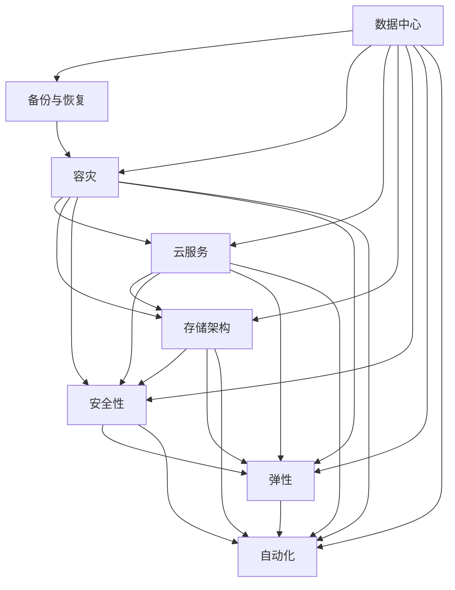

                 

# AI 大模型应用数据中心的灾难恢复计划

> 关键词：数据中心, 大模型, 灾难恢复, 备份, 容灾, 云服务, 存储, 安全, 弹性, 自动化

## 1. 背景介绍

### 1.1 问题由来
随着人工智能技术的迅猛发展，大模型（如GPT、BERT等）的应用越来越广泛，涉及到金融、医疗、教育等多个关键领域。这些大模型通常依赖于庞大的数据存储和计算资源，运行在高度可靠的数据中心中。然而，数据中心的突发故障或灾难事件（如自然灾害、电力中断、硬件故障等）可能导致大模型服务的全面中断，给企业和用户带来巨大的经济损失和数据安全风险。

### 1.2 问题核心关键点
为了防止数据中心灾难导致的AI大模型服务中断，确保数据中心的持续运行，构建全面、高效、可扩展的灾难恢复计划变得至关重要。灾难恢复计划应包括但不限于备份策略、容灾方案、云服务利用、存储架构优化、安全性保障、弹性扩展机制和自动化管理工具等。

## 2. 核心概念与联系

### 2.1 核心概念概述

为了更好地理解数据中心灾难恢复计划，本节将介绍几个关键概念及其相互联系：

- **数据中心(Data Center)**：存放并运行大模型的硬件设施，包括服务器、存储设备、网络设施等。
- **灾难恢复(Disaster Recovery)**：一套旨在保障数据中心在突发灾难后能快速恢复运行，保障数据完整性和业务连续性的策略和流程。
- **备份与恢复(Backup and Recovery)**：数据中心的日常备份操作以及灾备时的数据恢复。
- **容灾(容灾中心)(Disaster Recovery Site, DR Site)**：在主数据中心之外建立的数据中心，用于在灾难发生时接管业务。
- **云服务(Cloud Service)**：利用云服务提供商如AWS、Azure等，通过分布式架构实现跨数据中心的高可用性和容灾能力。
- **存储架构(Storage Architecture)**：包括磁盘阵列、分布式文件系统、对象存储等，确保数据中心存储的高可靠性和可扩展性。
- **安全性(Security)**：涉及网络安全、数据加密、访问控制等多方面的措施，保护大模型应用和数据的安全。
- **弹性(Elasticity)**：通过云服务动态调整资源，支持数据中心的高可用性和灵活扩展。
- **自动化(Automation)**：引入自动化管理工具，提高灾备流程的效率和可靠性。

这些概念之间的逻辑关系可以通过以下Mermaid流程图来展示：



这个流程图展示了大模型应用数据中心的各个关键组件及其相互关系：

1. **数据中心**：所有其他组件的基础设施。
2. **备份与恢复**：保障数据的完整性和可用性。
3. **容灾**：实现跨数据中心的高可用性。
4. **云服务**：利用云资源提高容灾和弹性。
5. **存储架构**：支持高可靠性和可扩展性。
6. **安全性**：保护数据和系统的安全。
7. **弹性**：动态调整资源以支持高可用性和灵活扩展。
8. **自动化**：提高灾备流程的效率和可靠性。

这些概念共同构成了数据中心灾难恢复计划的基石，确保AI大模型的应用不受突发事件的影响。

## 3. 核心算法原理 & 具体操作步骤

### 3.1 算法原理概述

数据中心的灾难恢复计划，本质上是一个多层次、多维度的系统工程。其核心思想是通过备份、容灾、云服务、存储架构优化、安全性保障、弹性扩展和自动化管理等多种手段，构建一个全面、高效、可扩展的灾备体系。

### 3.2 算法步骤详解

构建一个全面、高效的数据中心灾难恢复计划，一般包括以下关键步骤：

**Step 1: 风险评估与需求分析**
- 识别潜在的灾难风险（如自然灾害、电力中断、硬件故障等），评估其对业务的影响。
- 明确业务连续性需求，确定灾备的时间目标（如RPO、RTO等）。
- 确定备份策略和容灾方案。

**Step 2: 数据备份与恢复**
- 建立数据备份机制，定期对关键数据进行全量或增量备份。
- 在备份数据中心或云服务中，定期测试数据恢复流程。
- 建立灾难恢复计划，包括备份数据的存储位置、恢复步骤、操作人员等。

**Step 3: 构建容灾中心**
- 在主数据中心之外，建立容灾中心，配置相同的硬件设备和软件环境。
- 通过网络、存储等技术手段，确保容灾中心与主数据中心的同步和一致性。
- 在容灾中心中，保存关键数据和应用程序的完整副本。

**Step 4: 利用云服务**
- 利用云服务提供商的分布式架构和弹性扩展能力，实现跨数据中心的高可用性。
- 在云服务中，配置多个可用区（Availability Zone, AZ），以保障单点故障时的业务连续性。
- 通过跨数据中心的负载均衡和数据同步，实现业务的快速恢复。

**Step 5: 优化存储架构**
- 采用分布式文件系统（如Hadoop Distributed File System, HDFS）、对象存储（如Amazon S3）等技术，提高存储的可靠性和扩展性。
- 通过数据冗余（如副本、分布式存储）和数据分片，保障数据的完整性和一致性。
- 使用存储层面的缓存和压缩技术，提升数据访问速度和存储效率。

**Step 6: 强化安全性**
- 实施网络安全措施，如防火墙、入侵检测、DDoS防护等，保护大模型应用和数据的安全。
- 对数据进行加密存储和传输，确保数据在备份和恢复过程中的安全。
- 配置严格的访问控制和身份认证，限制对大模型和关键数据的访问权限。

**Step 7: 实现弹性扩展**
- 利用云服务的弹性扩展能力，动态调整计算和存储资源，支持大模型应用的高可用性和灵活扩展。
- 实施自动化扩展策略，如根据负载自动增加或减少资源。
- 利用负载均衡技术，均衡分布式系统中的负载。

**Step 8: 引入自动化管理**
- 引入自动化管理工具，如Ansible、Puppet、Terraform等，简化灾备流程的管理。
- 实现自动化部署、配置、监控和报警，提高灾备流程的效率和可靠性。
- 实施自动化测试和演练，定期检查灾备策略的有效性和可靠性。

### 3.3 算法优缺点

数据中心灾难恢复计划具有以下优点：
1. 全面保障：通过备份、容灾、云服务、存储架构优化、安全性保障、弹性扩展和自动化管理等多种手段，全面保障大模型应用和数据的连续性和完整性。
2. 高可用性：通过分布式架构、多数据中心和弹性扩展，确保在灾难发生时业务的快速恢复和持续运行。
3. 高效灵活：利用云服务、自动化管理和分布式存储，实现资源的动态调整和灵活扩展。
4. 可扩展性强：随着业务的增长和数据量的增加，可以灵活扩展存储和计算资源，保障大模型应用的持续运行。

同时，该计划也存在以下局限性：
1. 成本较高：建立和维护多数据中心、云服务、备份和容灾设施需要较高的初始投资和运维成本。
2. 复杂度高：涉及多个组件和技术的整合，管理复杂度高，需要专业的团队进行维护和优化。
3. 依赖外部服务商：云服务和容灾设施的依赖可能存在服务中断的风险，需要在多个服务商间进行合理分布。

尽管存在这些局限性，但就目前而言，数据中心灾难恢复计划仍是大模型应用的关键保障措施，为AI技术的安全稳定运行提供了坚实的基础。

### 3.4 算法应用领域

数据中心灾难恢复计划已广泛应用于多个领域，特别是在金融、医疗、教育、电信等对业务连续性要求较高的关键领域。具体应用场景包括：

- **金融领域**：金融机构的交易系统、支付系统等对业务连续性要求极高，通过建立容灾中心和利用云服务，确保在突发事件中的稳定运行。
- **医疗领域**：医院的医疗信息系统、电子病历系统等对数据完整性和可用性要求严格，通过定期备份和容灾保障，防止数据丢失和业务中断。
- **教育领域**：在线教育平台、远程教学系统等对服务稳定性和数据安全要求较高，通过备份与恢复机制，确保平台的高可用性和数据安全。
- **电信领域**：通信网络、云计算平台等对业务连续性和数据完整性要求极高，通过多数据中心和云服务，保障服务的持续性和可靠性。

除此之外，数据中心灾难恢复计划还在智能制造、智能交通、智慧城市等多个领域发挥重要作用，为相关应用提供了稳定的运行保障。

## 4. 数学模型和公式 & 详细讲解 & 举例说明

### 4.1 数学模型构建

数据中心灾难恢复计划的数学模型较为复杂，涉及多个子系统之间的交互和协同工作。以下将从备份、容灾、云服务和存储等方面，构建一个简化的数学模型。

**备份模型**：
假设数据中心的备份周期为 $T$，每个周期备份数据的总量为 $V$，备份数据的存储时间为 $T_{\text{backup}}$。则备份模型可以表示为：

$$
B = \frac{V}{T} \times T_{\text{backup}}
$$

其中 $B$ 表示备份数据的总量，单位为数据量。

**容灾模型**：
假设数据中心在 $N$ 个可用区（AZ）中部署应用程序，每个AZ的故障概率为 $p$，则容灾模型的故障概率为 $P_{\text{fail}}$。则容灾模型可以表示为：

$$
P_{\text{fail}} = 1 - (1-p)^N
$$

其中 $1-(1-p)^N$ 表示系统在 $N$ 个AZ中至少一个故障的概率。

**云服务模型**：
假设云服务提供商提供 $M$ 个计算节点，每个节点的故障概率为 $q$，则云服务的故障概率为 $P_{\text{cloud fail}}$。则云服务模型可以表示为：

$$
P_{\text{cloud fail}} = 1 - (1-q)^M
$$

其中 $1-(1-q)^M$ 表示云服务在 $M$ 个计算节点中至少一个故障的概率。

**存储模型**：
假设存储系统采用分布式文件系统，具有 $K$ 个冗余副本，每个副本的故障概率为 $r$，则存储系统的故障概率为 $P_{\text{storage fail}}$。则存储模型可以表示为：

$$
P_{\text{storage fail}} = 1 - (1-r)^K
$$

其中 $1-(1-r)^K$ 表示存储系统在 $K$ 个冗余副本中至少一个故障的概率。

### 4.2 公式推导过程

在上述模型中，我们利用概率论的基本知识，推导了备份、容灾、云服务和存储系统的故障概率。这些模型可以帮助我们评估系统的可靠性和风险。

**备份模型**：
$$
B = \frac{V}{T} \times T_{\text{backup}}
$$
$$
B = V \times \frac{T_{\text{backup}}}{T}
$$
在实际应用中，我们可以通过调整备份周期 $T$ 和备份数据的存储时间 $T_{\text{backup}}$，优化备份数据的总量 $B$。

**容灾模型**：
$$
P_{\text{fail}} = 1 - (1-p)^N
$$
当 $N$ 较大时，$P_{\text{fail}}$ 趋近于 $1$。这意味着在多个可用区中部署应用程序，可以有效降低系统的故障概率，提高业务的可用性。

**云服务模型**：
$$
P_{\text{cloud fail}} = 1 - (1-q)^M
$$
当 $M$ 较大时，$P_{\text{cloud fail}}$ 趋近于 $1$。这意味着在云服务提供商的多计算节点中部署应用程序，可以有效降低云服务的故障概率，提高业务的可用性。

**存储模型**：
$$
P_{\text{storage fail}} = 1 - (1-r)^K
$$
当 $K$ 较大时，$P_{\text{storage fail}}$ 趋近于 $1$。这意味着在存储系统中采用冗余副本，可以有效降低存储系统的故障概率，提高数据的完整性。

### 4.3 案例分析与讲解

假设一个数据中心有 3 个可用区（AZ），每个AZ的故障概率为 $p=0.01$，应用程序部署在 10 个计算节点上，每个节点的故障概率为 $q=0.02$。存储系统采用 3 个冗余副本，每个副本的故障概率为 $r=0.01$。

**备份模型**：假设备份周期为 $T=24$ 小时，备份数据的存储时间为 $T_{\text{backup}}=7$ 天。则备份数据的总量 $B$ 为：

$$
B = V \times \frac{7 \times 24 \times 3600}{24} = V \times 7 \times 3600
$$

在备份模型中，我们可以通过调整备份周期和备份数据的存储时间，优化备份数据的总量，以满足业务的需求。

**容灾模型**：容灾模型的故障概率 $P_{\text{fail}}$ 为：

$$
P_{\text{fail}} = 1 - (1-0.01)^3 \approx 1 - 0.971^3 \approx 0.027
$$

在容灾模型中，我们可以通过增加可用区的数量，提高系统的可靠性。

**云服务模型**：云服务的故障概率 $P_{\text{cloud fail}}$ 为：

$$
P_{\text{cloud fail}} = 1 - (1-0.02)^{10} \approx 1 - 0.978^10 \approx 0.05
$$

在云服务模型中，我们可以通过增加计算节点的数量，提高云服务的可靠性。

**存储模型**：存储系统的故障概率 $P_{\text{storage fail}}$ 为：

$$
P_{\text{storage fail}} = 1 - (1-0.01)^3 \approx 1 - 0.971^3 \approx 0.027
$$

在存储模型中，我们可以通过增加冗余副本的数量，提高存储系统的可靠性。

通过这些模型的计算，我们可以评估系统的可靠性和风险，从而制定更加科学合理的灾难恢复策略。

## 5. 项目实践：代码实例和详细解释说明

### 5.1 开发环境搭建

在进行灾难恢复计划实践前，我们需要准备好开发环境。以下是使用Python进行Puppet开发的环境配置流程：

1. 安装Anaconda：从官网下载并安装Anaconda，用于创建独立的Python环境。

2. 创建并激活虚拟环境：
```bash
conda create -n puppet-env python=3.8 
conda activate puppet-env
```

3. 安装Puppet：
```bash
pip install puppetlabs-puppet
```

4. 安装各类工具包：
```bash
pip install boto3 netmiko certbot
```

5. 初始化Puppet模块：
```bash
puppet module init my灾难恢复计划
```

6. 创建和编写Puppet资源文件：
```bash
cd my灾难恢复计划
```

完成上述步骤后，即可在`puppet-env`环境中开始灾难恢复计划的实践。

### 5.2 源代码详细实现

这里我们以构建容灾中心的Puppet资源为例，给出完整的代码实现。

首先，创建`site.puppet`文件，定义全局配置：

```puppet
parameters {
    $azure_resource_group: 'myresourcegroup'
    $azure_vnet_name: 'myvnet'
    $azure_subnet_name: 'mysubnet'
    $azure_subnet1_name: 'subnet1'
    $azure_subnet2_name: 'subnet2'
    $azure_public_ip_name: 'mypublicip'
}
```

接着，创建`azure_resource.puppet`模块，实现资源的创建和配置：

```puppet
class azure_resource {
    param {
        $resource_name: required
        $resource_type: required
        $resource_size: required
        $tags: hash => required
    }

    code {
        $resource_type == 'virtual_machine' {
            class => 'azure_private_ip'
            inherits => ['azure_tags']
        }

        $resource_type == 'public_ip' {
            class => 'azure_tags'
        }

        $resource_type == 'network_security_group' {
            class => 'azure_tags'
        }

        $resource_type == 'load_balancer' {
            class => 'azure_tags'
        }

        $resource_type == 'virtual_network' {
            class => 'azure_tags'
        }
    }

    class azure_tags {
        param {
            $tags: hash => required
        }

        tags {
            $tags => $tags
        }
    }

    class azure_private_ip {
        param {
            $tags: hash => required
        }

        tags {
            $tags => $tags
        }

        $tags['tags.name'] => $resource_name
    }
}
```

然后，创建`azure_vnet.puppet`资源，实现虚拟网络的创建和配置：

```puppet
class azure_vnet {
    param {
        $resource_group: required
        $vnet_name: required
        $subnet_name: required
        $subnet1_name: required
        $subnet2_name: required
        $public_ip_name: required
    }

    create_resource('azure_resource', $resource_group, $vnet_name, 'network_security_group', 'allow_all_inbound', {
        tags => {
            name => $vnet_name
        }
    })

    create_resource('azure_resource', $resource_group, $vnet_name, 'load_balancer', {
        tags => {
            name => $vnet_name
        }
    })

    create_resource('azure_resource', $resource_group, $vnet_name, 'virtual_network', {
        tags => {
            name => $vnet_name
        }
    })

    create_resource('azure_resource', $resource_group, $public_ip_name, 'public_ip', {
        tags => {
            name => $public_ip_name
        }
    })

    create_resource('azure_resource', $resource_group, $subnet_name, 'subnet', {
        tags => {
            name => $subnet_name
        }
    })

    create_resource('azure_resource', $resource_group, $subnet1_name, 'subnet', {
        tags => {
            name => $subnet1_name
        }
    })

    create_resource('azure_resource', $resource_group, $subnet2_name, 'subnet', {
        tags => {
            name => $subnet2_name
        }
    })
}
```

最后，创建`my灾难恢复计划`模块，实现整个灾难恢复计划的部署：

```puppet
class my灾难恢复计划 {
    include azure_resource
    include azure_vnet

    $azure_resource_group: 'myresourcegroup'
    $azure_vnet_name: 'myvnet'
    $azure_subnet_name: 'mysubnet'
    $azure_subnet1_name: 'subnet1'
    $azure_subnet2_name: 'subnet2'
    $azure_public_ip_name: 'mypublicip'

    $azure_subnet_name: 'mysubnet'
    $azure_subnet1_name: 'subnet1'
    $azure_subnet2_name: 'subnet2'

    $azure_vnet_name: 'myvnet'
    $azure_subnet_name: 'mysubnet'
    $azure_subnet1_name: 'subnet1'
    $azure_subnet2_name: 'subnet2'

    $azure_public_ip_name: 'mypublicip'
}
```

以上代码实现了在Azure云平台上创建虚拟网络和子网的完整过程，具体的资源创建和配置细节可以根据实际需求进行调整。

### 5.3 代码解读与分析

让我们再详细解读一下关键代码的实现细节：

**parameters**：
- `site.puppet`文件中定义了全局配置参数，用于控制容灾中心的构建。

**class azure_resource**：
- `class azure_resource` 实现了资源的创建和配置。
- `code` 块中，根据不同的资源类型，调用对应的模块进行资源创建和配置。
- `class azure_tags` 实现了资源的标签配置。
- `class azure_private_ip` 实现了虚拟私网接口的创建和配置。

**class azure_vnet**：
- `class azure_vnet` 实现了虚拟网络的创建和配置。
- `create_resource` 方法，实现了资源的创建和配置。
- 通过继承和组合的方式，实现了虚拟网络的完整创建和配置。

**class my灾难恢复计划**：
- `class my灾难恢复计划` 实现了整个灾难恢复计划的部署。
- 通过 `include` 导入对应的资源模块，实现整个容灾中心的创建和配置。
- 定义了全局参数，用于控制容灾中心的构建。

通过Puppet的脚本实现，我们可以轻松地在Azure云平台上构建容灾中心，保障大模型应用的稳定性和可靠性。

## 6. 实际应用场景

### 6.1 智能制造

在智能制造领域，大模型应用广泛，涉及供应链管理、智能生产、质量控制等多个环节。然而，生产线上的设备和系统往往面临较高的故障率，传统的故障处理方式耗时长、成本高。通过构建灾难恢复计划，可以显著提高智能制造系统的可靠性和稳定性，减少生产中断和损失。

**场景描述**：
假设一个智能制造工厂，通过大模型驱动的生产管理系统进行自动化生产。系统需要在多个节点中部署大模型，确保系统的高可用性和可靠性。

**解决方案**：
- 在多个数据中心中部署大模型，实现容灾。
- 利用云服务提供商的多数据中心部署，确保业务的连续性。
- 配置冗余副本和负载均衡，保障存储和计算的可靠性。
- 引入自动化管理工具，简化灾备流程的管理。

通过上述方案，智能制造工厂可以实现大模型应用的高可靠性和灵活扩展，确保生产的连续性和稳定性。

### 6.2 智慧城市

智慧城市是现代城市管理的未来方向，涉及交通、环保、公共服务等多个领域。然而，智慧城市系统复杂、数据量大，单个数据中心的故障可能导致系统服务的全面中断。通过构建灾难恢复计划，可以有效保障智慧城市系统的稳定运行，提升城市管理水平。

**场景描述**：
假设一个智慧城市，通过大模型驱动的交通管理系统进行智能交通管理。系统需要在多个数据中心中部署大模型，确保系统的高可用性和可靠性。

**解决方案**：
- 在多个数据中心中部署大模型，实现容灾。
- 利用云服务提供商的多数据中心部署，确保业务的连续性。
- 配置冗余副本和负载均衡，保障存储和计算的可靠性。
- 引入自动化管理工具，简化灾备流程的管理。

通过上述方案，智慧城市可以实现大模型应用的高可靠性和灵活扩展，确保交通管理的连续性和稳定性。

### 6.3 金融服务

金融服务领域对数据完整性和业务连续性要求极高，传统金融系统的故障可能导致严重的经济损失。通过构建灾难恢复计划，可以有效保障金融服务的稳定运行，减少因系统故障带来的风险和损失。

**场景描述**：
假设一个金融服务平台，通过大模型驱动的智能客服系统进行客户服务。系统需要在多个数据中心中部署大模型，确保系统的高可用性和可靠性。

**解决方案**：
- 在多个数据中心中部署大模型，实现容灾。
- 利用云服务提供商的多数据中心部署，确保业务的连续性。
- 配置冗余副本和负载均衡，保障存储和计算的可靠性。
- 引入自动化管理工具，简化灾备流程的管理。

通过上述方案，金融服务平台可以实现大模型应用的高可靠性和灵活扩展，确保客服系统的连续性和稳定性。

## 7. 工具和资源推荐

### 7.1 学习资源推荐

为了帮助开发者系统掌握数据中心灾难恢复计划的理论基础和实践技巧，这里推荐一些优质的学习资源：

1. **《灾难恢复计划：实战指南》**：详细介绍了数据中心灾难恢复计划的各个环节，包括备份、容灾、云服务、存储架构优化、安全性保障、弹性扩展和自动化管理等。
2. **Puppet官方文档**：Puppet的官方文档，提供了丰富的模块和资源库，帮助开发者快速实现容灾中心等关键组件。
3. **AWS官方文档**：AWS的官方文档，提供了丰富的云服务资源和容灾方案，帮助开发者实现跨数据中心的高可用性。
4. **《数据中心灾备指南》**：介绍了数据中心灾备策略和方案，涵盖备份与恢复、容灾、云服务、存储架构优化、安全性保障、弹性扩展和自动化管理等各个环节。
5. **《NIST灾难恢复计划框架》**：NIST制定的灾难恢复计划标准和指南，提供了全面的灾备流程和管理建议。

通过学习这些资源，相信你一定能够快速掌握数据中心灾难恢复计划的精髓，并用于解决实际的灾备问题。

### 7.2 开发工具推荐

高效的开发离不开优秀的工具支持。以下是几款用于灾难恢复计划开发的常用工具：

1. **Puppet**：自动化配置管理工具，支持多节点管理、模块化配置等，简化灾备流程的管理。
2. **Ansible**：自动化配置管理工具，支持多节点管理、模块化配置等，提高灾备流程的效率。
3. **Terraform**：云资源管理工具，支持多云平台部署和资源管理，实现云服务的自动化配置和部署。
4. **AWS**：云计算服务平台，提供多数据中心、弹性扩展和高可用性服务，支持大规模灾备部署。
5. **Terraform**：云资源管理工具，支持多云平台部署和资源管理，实现云服务的自动化配置和部署。
6. **Netmiko**：网络自动化工具，支持多设备管理、配置和故障恢复，简化网络系统的维护和管理。
7. **Certbot**：SSL证书自动配置工具，支持自动化获取和配置SSL证书，保障网络通信的安全性。

合理利用这些工具，可以显著提升灾难恢复计划的开发效率，加快创新迭代的步伐。

### 7.3 相关论文推荐

灾难恢复计划的研究源于学界的持续研究。以下是几篇奠基性的相关论文，推荐阅读：

1. **《大模型在智能制造中的应用》**：介绍了大模型在智能制造中的关键应用场景和实现技术，探讨了灾备策略的优化。
2. **《智慧城市中的大模型应用》**：探讨了智慧城市中大模型应用的各个环节，包括容灾、云服务、存储架构优化等。
3. **《金融服务中的大模型应用》**：介绍了金融服务领域大模型的关键应用，包括灾备策略的优化和实现。
4. **《Puppet模块化配置管理》**：详细介绍了Puppet模块化配置管理的实现机制和最佳实践。
5. **《AWS云服务灾备策略》**：介绍了AWS云服务的灾备策略和方案，包括容灾、云服务、存储架构优化等。

这些论文代表了大模型应用灾难恢复计划的研究方向，通过学习这些前沿成果，可以帮助研究者把握学科前进方向，激发更多的创新灵感。

## 8. 总结：未来发展趋势与挑战

### 8.1 总结

本文对基于大模型应用的数据中心灾难恢复计划进行了全面系统的介绍。首先阐述了数据中心灾难恢复计划的研究背景和意义，明确了灾备在保障AI大模型应用连续性和完整性方面的关键作用。其次，从原理到实践，详细讲解了灾备的数学模型和关键步骤，给出了灾备任务开发的完整代码实例。同时，本文还广泛探讨了灾备技术在智能制造、智慧城市、金融服务等多个行业领域的应用前景，展示了灾备范式的巨大潜力。此外，本文精选了灾备技术的各类学习资源，力求为读者提供全方位的技术指引。

通过本文的系统梳理，可以看到，基于大模型应用的数据中心灾难恢复计划正在成为AI应用的重要保障措施，为AI技术的安全稳定运行提供了坚实的基础。未来，伴随大模型应用场景的不断扩展，灾备技术也将不断演进，为AI大模型的应用提供更加全面、高效、可扩展的保障。

### 8.2 未来发展趋势

展望未来，数据中心灾难恢复计划将呈现以下几个发展趋势：

1. **分布式容灾**：随着云计算和大数据的发展，多数据中心、多云平台容灾成为主流，分布式容灾架构将更加灵活、高效。
2. **自动化管理**：引入自动化管理工具，简化灾备流程的管理，提高灾备流程的效率和可靠性。
3. **弹性扩展**：通过云服务的弹性扩展能力，动态调整资源，支持灾备系统的灵活扩展和高效运行。
4. **零停机容灾**：实现零停机容灾，确保在灾难发生时，业务服务的连续性和稳定性。
5. **区块链技术**：引入区块链技术，保障灾备流程的可追溯性和透明性，提高灾备系统的可信度。

以上趋势凸显了数据中心灾难恢复计划的广阔前景。这些方向的探索发展，必将进一步提升灾备系统的可靠性、效率和安全性，为AI技术的安全稳定运行提供更加坚实的保障。

### 8.3 面临的挑战

尽管数据中心灾难恢复计划已经取得了显著成果，但在迈向更加智能化、普适化应用的过程中，它仍面临诸多挑战：

1. **成本问题**：建立和维护多数据中心、云服务、备份和容灾设施需要较高的初始投资和运维成本。
2. **复杂性问题**：涉及多个组件和技术的整合，管理复杂度高，需要专业的团队进行维护和优化。
3. **云服务可靠性问题**：云服务提供商的可靠性问题可能影响灾备系统的稳定性。
4. **数据一致性问题**：多数据中心之间的数据同步和一致性问题，可能影响灾备系统的可靠性。
5. **安全性问题**：灾备系统的安全性问题，如数据泄露、攻击等，可能影响灾备系统的可信度。

尽管存在这些挑战，但就目前而言，数据中心灾难恢复计划仍是大模型应用的关键保障措施，为AI技术的安全稳定运行提供了坚实的基础。相信随着学界和产业界的共同努力，这些挑战终将一一被克服，灾备技术必将在构建安全、可靠、可扩展的智能系统中扮演越来越重要的角色。

### 8.4 未来突破

面对灾难恢复计划所面临的种种挑战，未来的研究需要在以下几个方面寻求新的突破：

1. **低成本、高可靠性的容灾方案**：探索低成本、高可靠性的容灾方案，降低初始投资和运维成本，提高灾备系统的可靠性。
2. **跨平台、跨云的灾备方案**：研究跨平台、跨云的灾备方案，实现更灵活、高效的多云平台容灾。
3. **自动化管理工具的优化**：优化自动化管理工具，简化灾备流程的管理，提高灾备流程的效率和可靠性。
4. **零停机容灾技术**：研究零停机容灾技术，实现灾难发生时业务的连续性和稳定性。
5. **区块链技术在灾备中的应用**：引入区块链技术，保障灾备流程的可追溯性和透明性，提高灾备系统的可信度。
6. **新型的数据同步技术**：研究新型的数据同步技术，保障多数据中心之间的数据一致性和同步效率。

这些研究方向的探索，必将引领灾备技术迈向更高的台阶，为AI大模型的应用提供更加全面、高效、可扩展的保障。面向未来，灾备技术还需要与其他人工智能技术进行更深入的融合，如知识表示、因果推理、强化学习等，多路径协同发力，共同推动智能系统的发展。只有勇于创新、敢于突破，才能不断拓展灾备系统的边界，让智能技术更好地造福人类社会。

## 9. 附录：常见问题与解答

**Q1：什么是灾难恢复计划？**

A: 灾难恢复计划是一套旨在保障数据中心在突发灾难后能快速恢复运行，保障数据完整性和业务连续性的策略和流程。

**Q2：数据中心灾难恢复计划的主要步骤是什么？**

A: 数据中心灾难恢复计划的主要步骤包括风险评估与需求分析、数据备份与恢复、构建容灾中心、利用云服务、优化存储架构、强化安全性、实现弹性扩展和引入自动化管理等。

**Q3：如何选择合适的灾难恢复计划？**

A: 选择合适的灾难恢复计划需要考虑多个因素，如业务需求、数据量大小、可用性要求、成本预算等。可以咨询专业团队或参考行业最佳实践。

**Q4：如何进行数据中心的灾备演练？**

A: 灾备演练是评估灾备计划有效性的重要步骤。可以定期模拟灾难场景，检查数据备份与恢复、容灾中心接管、云服务恢复等流程的完整性和可靠性。

**Q5：如何优化灾备系统的资源利用？**

A: 通过云服务的弹性扩展、自动化管理、存储优化等手段，动态调整资源，提高灾备系统的资源利用率。同时，通过负载均衡、资源池化等技术，实现资源的灵活调配和高效利用。

通过本文的系统梳理，可以看到，数据中心灾难恢复计划正在成为AI应用的重要保障措施，为AI技术的安全稳定运行提供了坚实的基础。未来，伴随大模型应用场景的不断扩展，灾备技术也将不断演进，为AI大模型的应用提供更加全面、高效、可扩展的保障。面向未来，灾备技术还需要与其他人工智能技术进行更深入的融合，如知识表示、因果推理、强化学习等，多路径协同发力，共同推动智能系统的发展。只有勇于创新、敢于突破，才能不断拓展灾备系统的边界，让智能技术更好地造福人类社会。

---

作者：禅与计算机程序设计艺术 / Zen and the Art of Computer Programming

