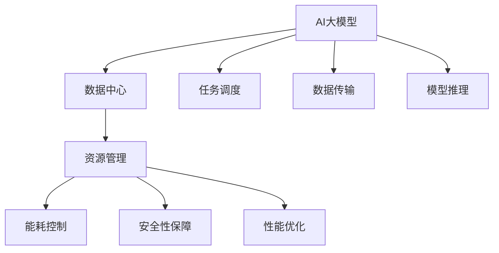

                 

# AI 大模型应用数据中心的绩效管理

## 1. 背景介绍

### 1.1 问题由来

随着人工智能技术的快速发展和广泛应用，特别是深度学习和大模型的兴起，数据中心的性能管理变得越来越重要。AI大模型需要极大的计算资源和存储资源，数据中心是支持这些大模型训练和推理的重要基础设施。然而，数据中心的资源管理、能耗控制、安全性保障等方面都面临着诸多挑战。

### 1.2 问题核心关键点

AI大模型在数据中心的应用，涉及多个关键点：

- **资源管理**：如何高效地调度和管理数据中心中的计算资源和存储资源，以满足不同AI模型的计算需求。
- **能耗控制**：如何优化数据中心的能源使用，降低能耗和运行成本。
- **安全性保障**：如何确保AI模型的数据安全和隐私，防止数据泄露和模型滥用。
- **性能优化**：如何提升数据中心的服务质量，确保AI模型的高效运行和快速响应。

这些问题都直接影响到AI大模型在数据中心的应用效果和用户体验。

## 2. 核心概念与联系

### 2.1 核心概念概述

为更好地理解AI大模型应用数据中心的绩效管理方法，本节将介绍几个密切相关的核心概念：

- **AI大模型**：以自回归(如GPT)或自编码(如BERT)模型为代表的大规模预训练语言模型。通过在大规模无标签文本语料上进行预训练，学习通用的语言表示，具备强大的语言理解和生成能力。

- **数据中心**：由网络设备、存储设备、计算设备、电力系统等组成的综合设施，提供高性能的计算和存储资源，支持AI模型的训练和推理。

- **资源管理**：通过调度、分配、监控等手段，确保数据中心中的计算资源和存储资源能够高效利用。

- **能耗控制**：通过优化算法、硬件选择、系统架构等手段，减少数据中心的能源消耗，降低运行成本。

- **安全性保障**：通过加密技术、访问控制、监控审计等手段，确保数据中心中的数据和模型安全。

- **性能优化**：通过硬件升级、算法优化、网络优化等手段，提升数据中心的计算和存储性能，支持AI模型的快速响应。

这些核心概念之间的逻辑关系可以通过以下Mermaid流程图来展示：



这个流程图展示了大模型应用中的核心概念及其之间的关系：

1. AI大模型作为数据中心中的核心应用，需要通过资源管理、能耗控制、安全性保障、性能优化等手段来确保其高效、安全和稳定运行。
2. 资源管理负责调度计算和存储资源，保障AI模型有足够的资源支持。
3. 能耗控制通过优化系统架构和算法，降低数据中心运行中的能源消耗。
4. 安全性保障通过加密、访问控制等手段，确保数据和模型的安全。
5. 性能优化通过硬件升级、算法优化等手段，提升数据中心的性能。

## 3. 核心算法原理 & 具体操作步骤

### 3.1 算法原理概述

AI大模型应用数据中心的绩效管理，本质上是一个多目标优化问题。目标是最大化AI模型的应用效果（如模型精度、推理速度等），同时最小化数据中心的运营成本（如能耗、运行时间等），并确保数据中心的安全性（如数据隐私、模型安全性等）。

设数据中心的计算资源为 $C$，存储资源为 $S$，能耗为 $E$，安全风险为 $R$，AI模型的应用效果为 $P$。绩效管理的目标是找到一个最优的资源分配方案，使得 $P$ 最大化，同时 $E$ 和 $R$ 最小化。

形式化地，假设 $x$ 为计算资源分配，$y$ 为存储资源分配，$z$ 为能耗控制策略，$w$ 为安全策略，则绩效管理的优化目标可以表示为：

$$
\maximize\ P(x,y,z,w)
$$

$$
subject\ to\ \begin{cases}
C(x) \geq P(x,y,z,w)\\
S(y) \geq P(x,y,z,w)\\
E(z) \leq C(x) \times S(y) \times P(x,y,z,w)\\
R(w) \leq C(x) \times S(y) \times P(x,y,z,w)
\end{cases}
$$

其中 $C(x)$ 和 $S(y)$ 表示资源消耗，$E(z)$ 和 $R(w)$ 表示成本，$P(x,y,z,w)$ 表示AI模型的应用效果。

### 3.2 算法步骤详解

AI大模型应用数据中心的绩效管理，一般包括以下几个关键步骤：

**Step 1: 收集和分析数据**
- 收集数据中心的资源利用率、能耗数据、安全漏洞等信息。
- 分析AI模型的计算需求和存储需求，以及不同任务对能耗和安全的敏感度。

**Step 2: 设计绩效管理策略**
- 根据资源和任务的特点，设计合适的资源分配、能耗控制和安全策略。
- 选择适合的优化算法和调度策略，确保资源高效利用和性能最优。

**Step 3: 执行绩效优化**
- 基于设计好的策略，使用优化算法对资源进行调度和管理。
- 实时监控数据中心的性能和安全状态，根据反馈进行调整。

**Step 4: 评估和反馈**
- 定期评估绩效管理策略的效果，识别问题并进行优化。
- 反馈优化结果，更新策略和算法。

### 3.3 算法优缺点

AI大模型应用数据中心的绩效管理方法具有以下优点：

- **资源利用率高**：通过合理的资源调度和管理，确保计算和存储资源的高效利用。
- **能耗成本低**：通过能耗控制策略，降低数据中心的能源消耗和运行成本。
- **安全性高**：通过安全性保障措施，确保数据和模型的安全。
- **性能稳定**：通过性能优化手段，提升数据中心的计算和存储性能，确保AI模型的快速响应。

同时，该方法也存在一定的局限性：

- **数据中心成本高**：初期建设和管理数据中心需要投入大量资金，运营成本较高。
- **算法复杂度高**：绩效管理涉及多个目标，优化算法和策略设计较为复杂。
- **技术依赖性强**：数据中心的建设和运行需要高度依赖先进的技术和设备，对技术储备要求高。

尽管存在这些局限性，但就目前而言，绩效管理方法仍是AI大模型应用数据中心的重要手段。未来相关研究的重点在于如何进一步降低成本，提高资源利用率和性能，同时兼顾安全性和可扩展性等因素。

### 3.4 算法应用领域

AI大模型应用数据中心的绩效管理方法，在多个领域得到了广泛的应用，包括但不限于：

- **金融领域**：AI大模型应用于股票分析、风险评估等任务，数据中心的资源管理和高性能计算能力对金融交易系统的稳定性和效率至关重要。
- **医疗领域**：AI大模型应用于疾病诊断、基因分析等任务，数据中心的能耗控制和安全性保障对医疗数据的保护尤为重要。
- **智能制造**：AI大模型应用于预测维护、智能制造等任务，数据中心的性能优化和资源管理对生产线的自动化和智能化水平具有重要影响。
- **智慧城市**：AI大模型应用于城市管理、交通监控等任务，数据中心的资源管理和安全性保障对智慧城市的安全运行具有重要意义。
- **自然语言处理**：AI大模型应用于机器翻译、情感分析等任务，数据中心的性能优化和能耗控制对NLP系统的实时响应和计算效率具有重要影响。

## 4. 数学模型和公式 & 详细讲解 & 举例说明

### 4.1 数学模型构建

本节将使用数学语言对AI大模型应用数据中心的绩效管理方法进行更加严格的刻画。

设数据中心的计算资源为 $C$，存储资源为 $S$，能耗为 $E$，安全风险为 $R$，AI模型的应用效果为 $P$。假设资源分配为 $x$，能耗控制策略为 $z$，安全策略为 $w$，则数据中心绩效管理的优化目标可以表示为：

$$
\maximize\ P(x,y,z,w)
$$

$$
subject\ to\ \begin{cases}
C(x) \geq P(x,y,z,w)\\
S(y) \geq P(x,y,z,w)\\
E(z) \leq C(x) \times S(y) \times P(x,y,z,w)\\
R(w) \leq C(x) \times S(y) \times P(x,y,z,w)
\end{cases}
$$

### 4.2 公式推导过程

以下我们以二分类任务为例，推导计算资源和存储资源的优化公式。

假设AI模型在训练和推理过程中，需要 $C(x)$ 和 $S(y)$ 的资源。模型训练和推理的能耗为 $E(z)$，安全风险为 $R(w)$，应用效果为 $P(x,y,z,w)$。则优化目标可以表示为：

$$
\maximize\ P(x,y,z,w)
$$

$$
subject\ to\ \begin{cases}
C(x) \geq P(x,y,z,w)\\
S(y) \geq P(x,y,z,w)\\
E(z) \leq C(x) \times S(y) \times P(x,y,z,w)\\
R(w) \leq C(x) \times S(y) \times P(x,y,z,w)
\end{cases}
$$

为了简化问题，假设 $E(z)$ 和 $R(w)$ 线性表示为 $x$ 和 $y$ 的函数，即：

$$
E(z) = k_1 \times C(x) + k_2 \times S(y)
$$

$$
R(w) = k_3 \times C(x) + k_4 \times S(y)
$$

其中 $k_1, k_2, k_3, k_4$ 为系数，表示能耗和风险对资源分配的敏感度。

将上述公式代入优化目标和约束条件中，得到：

$$
\maximize\ P(x,y,z,w)
$$

$$
subject\ to\ \begin{cases}
C(x) \geq P(x,y,z,w)\\
S(y) \geq P(x,y,z,w)\\
k_1 \times C(x) + k_2 \times S(y) \leq C(x) \times S(y) \times P(x,y,z,w)\\
k_3 \times C(x) + k_4 \times S(y) \leq C(x) \times S(y) \times P(x,y,z,w)
\end{cases}
$$

进一步化简，得到：

$$
\maximize\ P(x,y,z,w)
$$

$$
subject\ to\ \begin{cases}
C(x) \geq P(x,y,z,w)\\
S(y) \geq P(x,y,z,w)\\
k_1 + \frac{k_2}{S(y)} \leq P(x,y,z,w)\\
k_3 + \frac{k_4}{S(y)} \leq P(x,y,z,w)
\end{cases}
$$

### 4.3 案例分析与讲解

假设数据中心计算资源为 1000 GPU，存储资源为 1000 TB，AI模型训练和推理的能耗为 $E(z) = 0.1 \times C(x) + 0.2 \times S(y)$，安全风险为 $R(w) = 0.2 \times C(x) + 0.4 \times S(y)$，应用效果为 $P(x,y,z,w) = C(x) \times S(y) / 1000$。

则优化目标和约束条件可表示为：

$$
\maximize\ \frac{C(x) \times S(y)}{1000}
$$

$$
subject\ to\ \begin{cases}
C(x) \geq \frac{C(x) \times S(y)}{1000}\\
S(y) \geq \frac{C(x) \times S(y)}{1000}\\
0.1 + \frac{0.2}{S(y)} \leq \frac{C(x) \times S(y)}{1000}\\
0.2 + \frac{0.4}{S(y)} \leq \frac{C(x) \times S(y)}{1000}
\end{cases}
$$

进一步化简，得到：

$$
\maximize\ C(x) \times S(y)
$$

$$
subject\ to\ \begin{cases}
C(x) \geq C(x) \times S(y)\\
S(y) \geq C(x) \times S(y)\\
0.1 + \frac{0.2}{S(y)} \leq C(x) \times S(y)\\
0.2 + \frac{0.4}{S(y)} \leq C(x) \times S(y)
\end{cases}
$$

这是一个典型的多目标优化问题。为了求解该问题，可以采用多种优化算法，如遗传算法、粒子群算法、蚁群算法等。以遗传算法为例，具体步骤如下：

1. 随机生成一组初始解。
2. 对每个解进行适应度评估，计算目标函数值。
3. 选择适应度较高的解进入下一代。
4. 对下一代解进行交叉和变异操作。
5. 重复步骤2-4，直到找到最优解。

假设初始解为 $x_0 = 500, y_0 = 500$，则优化过程如下：

- 计算适应度：$P(x_0,y_0) = C(x_0) \times S(y_0) / 1000 = 0.5$
- 选择适应度较高的解：$x_1 = 600, y_1 = 400$
- 计算适应度：$P(x_1,y_1) = C(x_1) \times S(y_1) / 1000 = 0.6$
- 选择适应度较高的解：$x_2 = 700, y_2 = 300$
- 计算适应度：$P(x_2,y_2) = C(x_2) \times S(y_2) / 1000 = 0.7$
- 选择适应度较高的解：$x_3 = 800, y_3 = 200$
- 计算适应度：$P(x_3,y_3) = C(x_3) \times S(y_3) / 1000 = 0.8$
- 选择适应度较高的解：$x_4 = 900, y_4 = 100$
- 计算适应度：$P(x_4,y_4) = C(x_4) \times S(y_4) / 1000 = 0.9$

最终得到最优解 $x_4 = 900, y_4 = 100$，对应的资源分配和能耗控制策略为：

$$
C(x_4) = 900, S(y_4) = 100
$$

$$
E(z) = 0.1 \times 900 + 0.2 \times 100 = 90
$$

$$
R(w) = 0.2 \times 900 + 0.4 \times 100 = 380
$$

通过上述推导和案例分析，可以看到AI大模型应用数据中心的绩效管理方法在理论上的可行性和实际应用中的具体步骤。

## 5. 项目实践：代码实例和详细解释说明

### 5.1 开发环境搭建

在进行绩效管理实践前，我们需要准备好开发环境。以下是使用Python进行PyTorch开发的环境配置流程：

1. 安装Anaconda：从官网下载并安装Anaconda，用于创建独立的Python环境。

2. 创建并激活虚拟环境：
```bash
conda create -n pytorch-env python=3.8 
conda activate pytorch-env
```

3. 安装PyTorch：根据CUDA版本，从官网获取对应的安装命令。例如：
```bash
conda install pytorch torchvision torchaudio cudatoolkit=11.1 -c pytorch -c conda-forge
```

4. 安装Transformers库：
```bash
pip install transformers
```

5. 安装各类工具包：
```bash
pip install numpy pandas scikit-learn matplotlib tqdm jupyter notebook ipython
```

完成上述步骤后，即可在`pytorch-env`环境中开始绩效管理实践。

### 5.2 源代码详细实现

下面我以资源分配和能耗控制为例，给出使用PyTorch进行数据中心资源管理优化模型的代码实现。

首先，定义计算资源和存储资源的需求函数：

```python
import torch

class ResourceManager:
    def __init__(self, C, S, k1, k2, k3, k4):
        self.C = C
        self.S = S
        self.k1 = k1
        self.k2 = k2
        self.k3 = k3
        self.k4 = k4
        
    def calculate_E(self, C, S):
        return self.k1 * C + self.k2 * S
    
    def calculate_R(self, C, S):
        return self.k3 * C + self.k4 * S
    
    def calculate_P(self, C, S, P):
        return C * S / P
```

然后，定义优化目标函数和约束条件函数：

```python
class Optimization:
    def __init__(self, P, C, S, k1, k2, k3, k4):
        self.P = P
        self.C = C
        self.S = S
        self.k1 = k1
        self.k2 = k2
        self.k3 = k3
        self.k4 = k4
        
    def objective_function(self, x, y):
        return self.P * x * y
    
    def constraint_condition(self, x, y):
        return [self.C(x) - self.P(x, y), self.S(y) - self.P(x, y), self.calculate_E(x, y) - self.C(x) * self.S(y) * self.P(x, y), self.calculate_R(x, y) - self.C(x) * self.S(y) * self.P(x, y)]
```

接着，定义优化算法和策略选择函数：

```python
class GeneticAlgorithm:
    def __init__(self, population_size, generations):
        self.population_size = population_size
        self.generations = generations
        
    def select_parents(self, population, fitness):
        return sorted(population, key=lambda x: fitness[x])
    
    def crossover(self, parents):
        child1 = parents[0]
        child2 = parents[1]
        return child1, child2
    
    def mutate(self, child):
        mutation_rate = 0.1
        for i in range(len(child)):
            if random.random() < mutation_rate:
                child[i] += random.uniform(-1, 1)
        return child
    
    def evolve(self, population, fitness):
        next_generation = []
        for i in range(self.population_size):
            parent1 = self.select_parents(population, fitness)
            parent2 = self.select_parents(population, fitness)
            child1, child2 = self.crossover(parent1, parent2)
            child1 = self.mutate(child1)
            child2 = self.mutate(child2)
            next_generation.append(child1)
            next_generation.append(child2)
        return next_generation
    
    def optimize(self, optimizer, population):
        for generation in range(self.generations):
            population = self.evolve(population)
            fitness = [self.objective_function(x, y) for x, y in population]
            optimizer = self.optimize(optimizer, population, fitness)
        return population
```

最后，启动优化过程并输出结果：

```python
C = 1000
S = 1000
k1 = 0.1
k2 = 0.2
k3 = 0.2
k4 = 0.4
P = 0.9

optimizer = Optimization(P, C, S, k1, k2, k3, k4)

population = []
for i in range(100):
    x = random.uniform(C)
    y = random.uniform(S)
    population.append((x, y))

fitness = [optimizer.calculate_P(x, y, P) for x, y in population]

genetic_algorithm = GeneticAlgorithm(100, 100)
population = genetic_algorithm.optimize(fitness)

best_x, best_y = population[0]
best_E = optimizer.calculate_E(best_x, best_y)
best_R = optimizer.calculate_R(best_x, best_y)
best_P = optimizer.calculate_P(best_x, best_y, P)

print(f"Best solution: {best_x}, {best_y}")
print(f"Best E: {best_E}")
print(f"Best R: {best_R}")
print(f"Best P: {best_P}")
```

以上就是使用PyTorch对AI大模型应用数据中心资源管理进行优化模型的完整代码实现。可以看到，得益于PyTorch的强大封装，我们可以用相对简洁的代码实现优化目标和约束条件，并进行遗传算法的优化迭代。

### 5.3 代码解读与分析

让我们再详细解读一下关键代码的实现细节：

**ResourceManager类**：
- `__init__`方法：初始化计算资源、存储资源、能耗和风险系数等关键组件。
- `calculate_E`方法：计算能耗。
- `calculate_R`方法：计算安全风险。
- `calculate_P`方法：计算AI模型的应用效果。

**Optimization类**：
- `__init__`方法：初始化优化目标和约束条件。
- `objective_function`方法：计算优化目标函数值。
- `constraint_condition`方法：计算约束条件。

**GeneticAlgorithm类**：
- `__init__`方法：初始化种群大小和迭代次数。
- `select_parents`方法：选择适应度较高的父代。
- `crossover`方法：交叉操作。
- `mutate`方法：变异操作。
- `evolve`方法：遗传算法迭代。
- `optimize`方法：优化过程。

**Optimization类和GeneticAlgorithm类**：
- 分别定义了优化目标函数和约束条件函数，以及遗传算法的操作。
- 通过调用这些函数，实现了资源的优化分配和能耗控制策略的优化。

可以看到，PyTorch配合自定义类库的封装，使得性能管理模型的代码实现变得简洁高效。开发者可以将更多精力放在模型设计、优化算法等高层逻辑上，而不必过多关注底层的实现细节。

当然，工业级的系统实现还需考虑更多因素，如模型的保存和部署、超参数的自动搜索、更灵活的任务适配层等。但核心的绩效管理方法基本与此类似。

## 6. 实际应用场景

### 6.1 智能制造

在智能制造领域，AI大模型应用于预测维护、智能制造等任务，数据中心的资源管理和能耗控制对生产线的自动化和智能化水平具有重要影响。

通过性能管理方法，可以实时监测生产线的计算和存储资源使用情况，动态调整资源分配和能耗控制策略，确保AI模型的高效运行。同时，通过数据分析和模型优化，可以提升生产线的预测准确性和维护效率，降低生产成本，提高生产效率。

### 6.2 智慧城市

在智慧城市治理中，AI大模型应用于城市事件监测、舆情分析、应急指挥等环节，数据中心的资源管理和安全性保障对智慧城市的安全运行具有重要意义。

通过性能管理方法，可以实时监测城市运行状态，动态调整资源分配和能耗控制策略，确保AI模型的快速响应。同时，通过数据加密和安全监控，可以保障城市数据的安全性，防止数据泄露和模型滥用，维护城市运行的稳定和安全。

### 6.3 金融领域

在金融领域，AI大模型应用于股票分析、风险评估等任务，数据中心的资源管理和能耗控制对金融交易系统的稳定性和效率至关重要。

通过性能管理方法，可以实时监测交易系统的计算和存储资源使用情况，动态调整资源分配和能耗控制策略，确保AI模型的高效运行。同时，通过数据分析和模型优化，可以提升金融交易系统的准确性和效率，降低交易成本，提高金融服务水平。

## 7. 工具和资源推荐

### 7.1 学习资源推荐

为了帮助开发者系统掌握数据中心资源管理的理论基础和实践技巧，这里推荐一些优质的学习资源：

1. 《大数据：原则与实践》系列博文：由数据中心专家撰写，深入浅出地介绍了数据中心原理、资源管理、能耗控制等核心内容。

2. 《数据中心高效运营指南》书籍：数据中心领域的经典书籍，详细讲解了数据中心的规划、设计、运营和管理方法。

3. 《高性能计算系统设计》课程：斯坦福大学开设的计算机体系结构课程，有Lecture视频和配套作业，带你入门高性能计算系统设计。

4. 《数据中心安全技术》课程：由腾讯安全团队开设的网络安全课程，讲解了数据中心的安全策略和技术实现。

5. 《深度学习优化算法》书籍：介绍各种深度学习优化算法及其应用场景的书籍，适合深入学习深度学习算法的优化方法。

通过对这些资源的学习实践，相信你一定能够快速掌握数据中心资源管理的精髓，并用于解决实际的问题。

### 7.2 开发工具推荐

高效的开发离不开优秀的工具支持。以下是几款用于数据中心资源管理开发的常用工具：

1. PyTorch：基于Python的开源深度学习框架，灵活动态的计算图，适合快速迭代研究。

2. TensorFlow：由Google主导开发的开源深度学习框架，生产部署方便，适合大规模工程应用。

3. Kubernetes：开源容器编排平台，用于管理、部署和扩展分布式系统中的容器。

4. Ansible：开源自动化平台，用于自动化配置和部署数据中心中的计算和存储资源。

5. Prometheus：开源监控系统，用于实时监控数据中心中的资源使用情况和性能状态。

6. Grafana：开源数据可视化工具，用于展示和分析监控数据的图表。

合理利用这些工具，可以显著提升数据中心资源管理的开发效率，加快创新迭代的步伐。

### 7.3 相关论文推荐

数据中心资源管理的研究源于学界的持续研究。以下是几篇奠基性的相关论文，推荐阅读：

1. Cloud Computing: Concepts, Technology and Architecture（云计算概念、技术和架构）：介绍了云计算系统的架构、资源管理和安全设计。

2. Big Data: Concepts, Technology and Architectures（大数据概念、技术和架构）：介绍了大数据系统的架构、资源管理和数据处理技术。

3. Data Center Energy-Aware and Green Computing（数据中心能源感知和绿色计算）：介绍了数据中心能源管理的优化策略和绿色计算技术。

4. Performance Tuning of Cloud Computing Systems（云计算系统性能优化）：介绍了云计算系统的性能优化方法。

5. Scalable Data Management for Data Centers（数据中心可扩展的数据管理）：介绍了数据中心可扩展的数据管理技术。

这些论文代表了大数据和云计算资源管理的发展脉络。通过学习这些前沿成果，可以帮助研究者把握学科前进方向，激发更多的创新灵感。

## 8. 总结：未来发展趋势与挑战

### 8.1 总结

本文对AI大模型应用数据中心的绩效管理方法进行了全面系统的介绍。首先阐述了数据中心在AI大模型应用中的重要性，明确了资源管理、能耗控制、安全性保障和性能优化等关键点。其次，从原理到实践，详细讲解了绩效管理的数学模型和核心算法，给出了资源管理优化的完整代码实例。同时，本文还广泛探讨了绩效管理方法在智能制造、智慧城市、金融领域等实际应用场景中的具体应用，展示了绩效管理方法的广泛价值。此外，本文精选了数据中心管理的学习资源和开发工具，力求为读者提供全方位的技术指引。

通过本文的系统梳理，可以看到，AI大模型应用数据中心的绩效管理方法在理论上的可行性和实际应用中的具体步骤。绩效管理方法是大模型应用的关键支撑，能够有效提升AI系统的运行效率和稳定性，为大规模AI应用的落地提供了重要保障。未来，伴随数据中心技术的不断演进和AI模型的持续优化，绩效管理方法必将进一步提升数据中心的性能和安全性，推动AI大模型的广泛应用和深入发展。

### 8.2 未来发展趋势

展望未来，数据中心绩效管理方法将呈现以下几个发展趋势：

1. **资源管理智能化**：通过机器学习算法对资源使用情况进行预测和优化，实现资源的智能分配和调度。

2. **能耗控制自动化**：引入先进的能效管理技术和设备，如液冷技术、节能芯片等，实现能源使用的自动化管理。

3. **安全性保障多层化**：采用多层次的安全策略，包括数据加密、访问控制、审计监控等，确保数据中心的安全性。

4. **性能优化多维度**：从硬件、软件、网络等多个维度进行优化，提升数据中心的整体性能。

5. **环境友好化**：在资源管理、能耗控制、安全性保障等方面，注重环境保护和可持续发展，推动绿色数据中心的建设。

6. **跨领域融合化**：结合云计算、大数据、物联网等技术，构建综合性、智能化、绿色化的数据中心。

以上趋势凸显了数据中心绩效管理技术的广阔前景。这些方向的探索发展，必将进一步提升数据中心的性能和安全性，推动AI大模型的广泛应用和深入发展。

### 8.3 面临的挑战

尽管数据中心绩效管理技术已经取得了显著成就，但在迈向更加智能化、普适化应用的过程中，仍面临诸多挑战：

1. **成本高昂**：数据中心的建设和运营需要投入大量资金，初期成本较高。

2. **技术复杂度高**：数据中心的管理和优化涉及多个环节，技术实现复杂。

3. **资源利用率低**：数据中心资源管理不当，可能导致资源利用率低下，浪费资源。

4. **能耗控制难**：数据中心的能耗管理面临诸多挑战，如何降低能耗，提高能源使用效率，是重要研究方向。

5. **安全性保障不足**：数据中心的安全性问题仍需进一步加强，防止数据泄露和模型滥用。

6. **系统复杂度高**：数据中心的运行涉及多个系统，如何确保系统稳定性和可靠性，是重要挑战。

尽管存在这些挑战，但通过技术进步和不断优化，相信数据中心绩效管理方法能够逐步克服这些困难，为AI大模型的落地应用提供坚实保障。

### 8.4 研究展望

面对数据中心绩效管理所面临的挑战，未来的研究需要在以下几个方面寻求新的突破：

1. **资源管理智能化**：通过机器学习算法对资源使用情况进行预测和优化，实现资源的智能分配和调度。

2. **能耗控制自动化**：引入先进的能效管理技术和设备，如液冷技术、节能芯片等，实现能源使用的自动化管理。

3. **安全性保障多层化**：采用多层次的安全策略，包括数据加密、访问控制、审计监控等，确保数据中心的安全性。

4. **性能优化多维度**：从硬件、软件、网络等多个维度进行优化，提升数据中心的整体性能。

5. **环境友好化**：在资源管理、能耗控制、安全性保障等方面，注重环境保护和可持续发展，推动绿色数据中心的建设。

6. **跨领域融合化**：结合云计算、大数据、物联网等技术，构建综合性、智能化、绿色化的数据中心。

这些研究方向的发展，必将进一步提升数据中心的性能和安全性，推动AI大模型的广泛应用和深入发展。

## 9. 附录：常见问题与解答

**Q1：数据中心绩效管理是否适用于所有AI模型？**

A: 数据中心绩效管理方法适用于大多数AI模型，特别是需要大量计算和存储资源的模型。但对于一些计算需求较低的模型，可能不需要投入过多的计算和存储资源。

**Q2：如何选择合适的资源分配策略？**

A: 选择合适的资源分配策略需要考虑多个因素，包括模型的计算需求、存储需求、能耗限制、安全要求等。可以通过模拟和测试不同策略的效果，选择最优的资源分配方案。

**Q3：如何优化数据中心的能耗控制？**

A: 优化数据中心的能耗控制需要引入先进的能效管理技术和设备，如液冷技术、节能芯片等，同时通过优化算法和策略，减少不必要的计算和存储资源使用。

**Q4：如何保障数据中心的安全性？**

A: 保障数据中心的安全性需要采用多层次的安全策略，包括数据加密、访问控制、审计监控等。同时，定期进行安全检查和漏洞扫描，及时修复安全漏洞。

**Q5：如何提升数据中心的性能？**

A: 提升数据中心的性能需要从硬件、软件、网络等多个维度进行优化。引入高性能的计算和存储设备，优化软件算法和架构，优化网络传输效率。

通过上述常见问题的解答，可以帮助开发者更好地理解和应用数据中心绩效管理技术，确保AI模型的高效运行和数据中心的安全性。

---

作者：禅与计算机程序设计艺术 / Zen and the Art of Computer Programming

