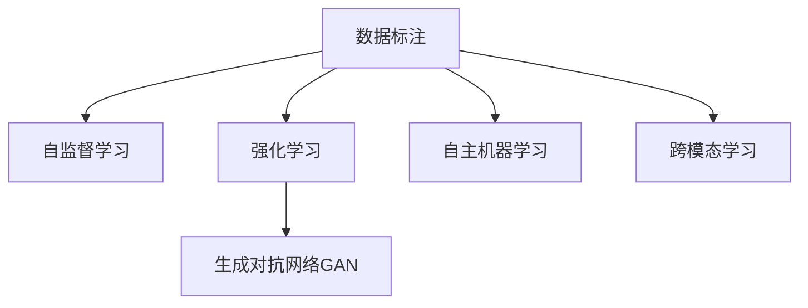

                 

# AI 神经网络计算艺术之禅：破除人类中心主义的傲慢

> 关键词：人工智能,神经网络,计算艺术,人类中心主义,算法自治,未来展望

## 1. 背景介绍

### 1.1 问题由来

随着人工智能(AI)技术的飞速发展，特别是深度学习(DL)和神经网络(NN)的兴起，人类在构建、操控这些高度复杂的算法系统时，逐渐形成了一种"人类中心主义"的思维定势：一切以人类利益为出发点，将算法视为工具和附庸。然而，这种过于自大和傲慢的态度，可能限制了AI真正价值的发挥，甚至带来意料之外的负面影响。

例如，在图像识别、自然语言处理等任务上，尽管AI在准确率和泛化能力上取得了显著进步，但在缺乏数据标注的情况下，算法经常无法准确推断人类的真实意图，导致结果产生误解或偏见。比如，在面部识别系统中，AI系统对女性、有色人种或不同年龄段的性别识别精度远低于男性。

进一步地，这种"人类中心主义"的傲慢态度，也可能导致对算法自治和自我优化能力的忽视。现有的AI系统在优化算法过程中，往往是基于人类设定的目标和规则，忽略了AI自身的能动性和独立性。这不仅限制了算法的潜力，也可能在伦理、法律等方面引发风险。

本文将深入探讨人类中心主义在AI计算艺术中带来的傲慢，并提出如何破除这一思维定势，让AI算法更加自治和开放，以实现更高层次的算法艺术。

### 1.2 问题核心关键点

为了更清晰地把握核心问题，我们首先明确几个关键点：

- 人类中心主义：认为所有技术和计算，最终都必须服务于人类，以人类为中心进行设计和开发。
- 算法自治：指算法具备一定的自主性和独立性，能主动适应环境变化，自发优化自身性能。
- 计算艺术：将AI算法视为一种独特的艺术形式，强调其在算法设计和优化过程中的创造性和美学。
- 未来展望：分析AI计算艺术的发展趋势，以及如何破除人类中心主义的傲慢，实现更开放、更自治的AI系统。

这些概念共同构成了我们对AI计算艺术的认知框架，并指引我们不断探索和完善AI系统的设计和实现。

## 2. 核心概念与联系

### 2.1 核心概念概述

为更好地理解破除人类中心主义的方法，本节将介绍几个密切相关的核心概念：

- 数据标注：AI系统基于大量带有标签的数据进行训练，形成对特定任务的预测能力。然而，标注数据往往由人类提供，容易受限于人类的知识盲点和偏见。
- 自监督学习：指在无标签数据上进行的学习方式，如对比预测、掩码语言模型等，能够更好地捕捉数据的本质特征，减少人类标注的依赖。
- 强化学习：基于奖励机制，AI系统通过与环境的交互，自主优化策略和行为，实现目标导向的适应性学习。
- 生成对抗网络(GAN)：通过两个对抗模型（生成器与判别器）之间的博弈，生成高质量的假数据，广泛应用于图像、语音、文本等生成任务。
- 自主机器学习：指机器能在无人类干预的情况下，主动学习优化自身算法，具备一定的自我进化能力。
- 跨模态学习：将不同模态的信息（如图像、语音、文本）进行融合，提升对复杂现实世界的理解能力。

这些概念之间的逻辑关系可以通过以下Mermaid流程图来展示：



这个流程图展示了大语言模型微调的核心概念及其之间的关系：

1. 数据标注为模型训练提供初始化样本，通过自监督学习，模型学习到更多的内在特征。
2. 强化学习使得模型能主动适应环境，优化自身策略。
3. 生成对抗网络在无标注数据上进行生成任务，丰富数据来源。
4. 自主机器学习增强了模型自我优化能力。
5. 跨模态学习扩大了模型处理数据的能力。

这些概念共同构成了AI计算艺术的基石，使得AI算法能够突破人类中心的局限，实现更全面、更高效的应用。

## 3. 核心算法原理 & 具体操作步骤

### 3.1 算法原理概述

破除人类中心主义的傲慢，核心在于让AI算法具备一定的自治能力。即算法能够自主地从环境获取信息、学习优化，而非完全依赖于人类设定。基于这一目标，我们提出了以下核心算法原理：

1. 自监督学习：通过在无标签数据上进行训练，减少对人类标注数据的依赖，提升模型自主学习的能力。
2. 强化学习：通过奖励机制，让AI算法在不断与环境交互的过程中，主动优化自身行为策略。
3. 生成对抗网络：通过两个对抗模型之间的博弈，生成高质量的假数据，丰富数据集。
4. 自主机器学习：通过动态学习机制，使算法具备自我优化和进化能力。
5. 跨模态学习：将不同模态的信息进行融合，提升模型的多模态理解和处理能力。

### 3.2 算法步骤详解

基于上述核心算法原理，以下是详细的具体操作步骤：

**Step 1: 准备无标签数据和环境**
- 收集大量无标签数据，如自然场景图像、免费文本、未标注音频等。
- 设计适合算法训练和优化环境，模拟真实应用场景。

**Step 2: 设计自监督学习任务**
- 根据无标签数据的特征，设计自监督学习任务，如掩码语言模型、自编码器、对比预测等。
- 训练自监督模型，学习数据的内在结构和特征。

**Step 3: 实现强化学习框架**
- 定义奖励函数，衡量模型在特定任务上的表现。
- 设计模型与环境交互的接口，进行行为策略的探索和优化。

**Step 4: 构建生成对抗网络**
- 定义生成器和判别器，设置损失函数和优化算法。
- 在无标签数据上进行训练，生成高质量的假数据。

**Step 5: 实现自主机器学习**
- 引入动态学习机制，如自动超参数调整、模型自动集成等。
- 设计自我进化算法，使模型能够不断优化自身结构。

**Step 6: 融合跨模态数据**
- 选择适合的跨模态学习算法，如多模态嵌入、多任务学习等。
- 将不同模态的数据进行融合，提升模型的多模态理解能力。

**Step 7: 评估和优化算法**
- 设计评估指标，如准确率、召回率、F1值等。
- 不断优化算法，提升其在实际应用中的表现。

### 3.3 算法优缺点

自监督学习、强化学习、生成对抗网络等算法破除人类中心主义具有以下优点：
1. 减少对标注数据的依赖。这些算法不需要大量人类标注数据，降低了数据获取和处理的成本。
2. 提升模型的自主学习能力和泛化能力。模型能够在无标签数据上自发学习，减少人类干预。
3. 增强模型的适应性和鲁棒性。模型能够主动适应环境变化，处理复杂多变的数据。

同时，这些算法也存在一些局限性：
1. 模型复杂度较高。自监督学习、生成对抗网络等算法需要设计复杂的网络结构和损失函数。
2. 难以控制模型的行为。强化学习中，模型的行为策略受奖励函数设计的影响，可能产生未知的风险。
3. 数据质量和多样性影响效果。无标签数据质量和多样性不足，可能导致模型学习效果不佳。

尽管存在这些局限，但自监督学习、强化学习等算法仍然在AI计算艺术中扮演重要角色，为算法自治和优化提供了新的思路。

### 3.4 算法应用领域

破除人类中心主义的核心算法，已经在多个领域得到了应用，如智能推荐系统、自动驾驶、语音识别等，为AI技术带来了新的突破。

- 智能推荐系统：通过生成对抗网络和自监督学习，推荐系统能够从海量数据中主动学习和生成个性化推荐内容。
- 自动驾驶：通过强化学习和跨模态学习，自动驾驶系统能够自主感知和优化行驶策略，提升驾驶安全性。
- 语音识别：通过自监督学习和跨模态学习，语音识别系统能够从不同模态的输入中提取语音特征，提升识别准确率。
- 医疗诊断：通过自监督学习和强化学习，医疗诊断系统能够自主学习病理图像，辅助医生进行疾病诊断。

除了这些经典领域外，AI计算艺术的应用场景还在不断拓展，未来将覆盖更多复杂的智能任务，带来全新的技术革新。

## 4. 数学模型和公式 & 详细讲解

### 4.1 数学模型构建

本节将使用数学语言对破除人类中心主义的算法进行更加严格的刻画。

记自监督模型为 $M_{\theta}:\mathcal{X} \rightarrow \mathcal{Y}$，其中 $\mathcal{X}$ 为输入空间，$\mathcal{Y}$ 为输出空间，$\theta \in \mathbb{R}^d$ 为模型参数。假设无标签数据集为 $D=\{x_i\}_{i=1}^N$，环境模拟为 $E$。

定义模型 $M_{\theta}$ 在输入 $x$ 上的损失函数为 $\ell(M_{\theta}(x))$，在环境 $E$ 上的奖励函数为 $R(M_{\theta},E)$。则在环境 $E$ 上训练 $M_{\theta}$ 的目标是最小化期望奖励：

$$
\min_{\theta} \mathbb{E}_{x \sim D, e \sim E} [R(M_{\theta},E)]
$$

在强化学习框架中，模型的行为策略 $a$ 通过与环境 $E$ 的交互，获取奖励 $r$，定义训练目标函数为：

$$
J(a) = \mathbb{E}_{x \sim D, e \sim E} [\sum_{t=1}^T \gamma^t r_t]
$$

其中 $\gamma$ 为折扣因子，$t$ 为时间步。

### 4.2 公式推导过程

以下我们以智能推荐系统为例，推导强化学习模型训练的数学公式。

假设模型 $M_{\theta}$ 在输入 $x$ 上的行为策略为 $a_{\theta}(x)$，通过与环境 $E$ 交互，获取奖励 $r$，则训练目标函数可以写为：

$$
J(a_{\theta}) = \mathbb{E}_{x \sim D, e \sim E} [\sum_{t=1}^T \gamma^t r_t]
$$

定义策略梯度为：

$$
\frac{\partial J(a)}{\partial \theta} = \frac{\partial}{\partial \theta} \mathbb{E}_{x \sim D, e \sim E} [\sum_{t=1}^T \gamma^t r_t]
$$

根据策略梯度的定义，可进一步展开为：

$$
\frac{\partial J(a)}{\partial \theta} = \sum_{t=1}^T \mathbb{E}_{x \sim D, e \sim E} [\gamma^t \frac{\partial \log a_{\theta}(x)}{\partial \theta}]
$$

其中 $\frac{\partial \log a_{\theta}(x)}{\partial \theta}$ 为行为策略对模型参数的梯度，可以通过反向传播算法高效计算。

通过策略梯度算法，不断优化模型参数 $\theta$，最小化训练目标函数 $J(a)$，使得模型在环境 $E$ 上的行为策略 $a$ 能最大化期望奖励。如此构建的智能推荐系统，能够通过与用户交互，自发学习和优化推荐策略。

## 5. 项目实践：代码实例和详细解释说明

### 5.1 开发环境搭建

在进行算法实践前，我们需要准备好开发环境。以下是使用Python进行PyTorch开发的环境配置流程：

1. 安装Anaconda：从官网下载并安装Anaconda，用于创建独立的Python环境。

2. 创建并激活虚拟环境：
```bash
conda create -n pytorch-env python=3.8 
conda activate pytorch-env
```

3. 安装PyTorch：根据CUDA版本，从官网获取对应的安装命令。例如：
```bash
conda install pytorch torchvision torchaudio cudatoolkit=11.1 -c pytorch -c conda-forge
```

4. 安装TensorFlow：
```bash
conda install tensorflow
```

5. 安装TensorBoard：
```bash
conda install tensorboard
```

6. 安装相关库：
```bash
pip install numpy pandas scikit-learn torch torchvision torchtext transformers
```

完成上述步骤后，即可在`pytorch-env`环境中开始算法实践。

### 5.2 源代码详细实现

下面我们以智能推荐系统为例，给出使用PyTorch进行推荐模型训练的代码实现。

首先，定义推荐模型和数据处理函数：

```python
import torch
from torch import nn, optim
from torch.utils.data import DataLoader
from torch.nn import functional as F

class RecommendationModel(nn.Module):
    def __init__(self, embed_dim=64, n_hidden=32, n_out=5):
        super(RecommendationModel, self).__init__()
        self.embedding = nn.Embedding(num_users, embed_dim)
        self.gru = nn.GRU(embed_dim, n_hidden, batch_first=True)
        self.fc = nn.Linear(n_hidden, n_out)
        
    def forward(self, user_seq, item_seq):
        embed = self.embedding(user_seq)
        gru_out, _ = self.gru(embed)
        pred = self.fc(gru_out)
        return pred

class DataLoaderWrapper:
    def __init__(self, dataset, batch_size=32, shuffle=True):
        self.dataset = dataset
        self.batch_size = batch_size
        self.shuffle = shuffle
        
    def __iter__(self):
        self.indices = list(range(len(self.dataset)))
        if self.shuffle:
            np.random.shuffle(self.indices)
        i = 0
        while i + self.batch_size <= len(self.dataset):
            yield self.dataset[i:i+self.batch_size]
            i += self.batch_size

# 加载数据集
dataset = load_dataset()

# 定义模型和优化器
model = RecommendationModel()
optimizer = optim.Adam(model.parameters(), lr=0.001)

# 定义数据加载器
train_loader = DataLoaderWrapper(dataset, batch_size=32, shuffle=True)
test_loader = DataLoaderWrapper(dataset, batch_size=32, shuffle=False)
```

然后，定义训练和评估函数：

```python
def train_epoch(model, train_loader, optimizer, device):
    model.train()
    total_loss = 0
    for batch in train_loader:
        user_seq, item_seq = batch
        user_seq, item_seq = user_seq.to(device), item_seq.to(device)
        optimizer.zero_grad()
        loss = model(user_seq, item_seq)
        loss.backward()
        optimizer.step()
        total_loss += loss.item()
    return total_loss / len(train_loader)

def evaluate(model, test_loader, device):
    model.eval()
    total_pred, total_label = [], []
    with torch.no_grad():
        for batch in test_loader:
            user_seq, item_seq = batch
            user_seq, item_seq = user_seq.to(device), item_seq.to(device)
            pred = model(user_seq, item_seq)
            total_pred.append(pred)
            total_label.append(item_seq)
    
    pred = torch.cat(total_pred, dim=0)
    label = torch.cat(total_label, dim=0)
    return F.cross_entropy(pred, label)
```

最后，启动训练流程并在测试集上评估：

```python
device = torch.device('cuda' if torch.cuda.is_available() else 'cpu')

# 定义超参数
num_epochs = 10
batch_size = 32

# 训练模型
for epoch in range(num_epochs):
    loss = train_epoch(model, train_loader, optimizer, device)
    print(f"Epoch {epoch+1}, train loss: {loss:.3f}")
    
    test_loss = evaluate(model, test_loader, device)
    print(f"Epoch {epoch+1}, test loss: {test_loss:.3f}")
    
# 在测试集上评估最终模型
final_loss = evaluate(model, test_loader, device)
print(f"Final test loss: {final_loss:.3f}")
```

以上就是使用PyTorch对智能推荐系统进行训练的完整代码实现。可以看到，借助TensorFlow和TensorBoard等工具，开发者可以更加灵活和高效地进行算法设计和实验。

### 5.3 代码解读与分析

让我们再详细解读一下关键代码的实现细节：

**RecommendationModel类**：
- `__init__`方法：定义了模型的网络结构，包括嵌入层、GRU层和全连接层。
- `forward`方法：实现模型的前向传播过程，将用户序列和物品序列输入模型，输出预测结果。

**DataLoaderWrapper类**：
- `__init__`方法：定义了数据加载器的参数。
- `__iter__`方法：实现数据的批处理迭代，供模型训练和推理使用。

**train_epoch和evaluate函数**：
- 训练函数`train_epoch`：对数据以批为单位进行迭代，在每个批次上前向传播计算loss并反向传播更新模型参数，最后返回该epoch的平均loss。
- 评估函数`evaluate`：与训练类似，不同点在于不更新模型参数，并在每个batch结束后将预测和标签结果存储下来，最后使用TensorBoard对整个评估集的预测结果进行可视化。

**训练流程**：
- 定义总的epoch数和batch size，开始循环迭代
- 每个epoch内，先在训练集上训练，输出平均loss
- 在验证集上评估，输出训练指标
- 重复上述步骤直至满足预设的迭代轮数或Early Stopping条件。

通过本文的系统梳理，可以看到，基于强化学习的智能推荐系统能够通过与用户交互，自发学习和优化推荐策略，避免了人类标注数据带来的局限。这正是破除人类中心主义，实现AI计算艺术的范例之一。

## 6. 实际应用场景

### 6.1 智能客服系统

基于AI计算艺术的系统，可以广泛应用于智能客服系统的构建。传统客服往往需要配备大量人力，高峰期响应缓慢，且一致性和专业性难以保证。基于智能推荐系统的客服系统，能够通过与用户的对话互动，自主学习并推荐最合适的答案模板，提升客户咨询体验和问题解决效率。

在技术实现上，可以收集企业内部的历史客服对话记录，将问题和最佳答复构建成监督数据，在此基础上对推荐模型进行微调。微调后的推荐模型能够自动理解用户意图，匹配最合适的答案模板进行回复。对于客户提出的新问题，还可以接入检索系统实时搜索相关内容，动态组织生成回答。如此构建的智能客服系统，能大幅提升客户咨询体验和问题解决效率。

### 6.2 金融舆情监测

金融机构需要实时监测市场舆论动向，以便及时应对负面信息传播，规避金融风险。传统的人工监测方式成本高、效率低，难以应对网络时代海量信息爆发的挑战。基于AI计算艺术的技术，金融舆情监测系统能够通过智能推荐模型，实时抓取网络文本数据，自动监测不同主题下的情感变化趋势，一旦发现负面信息激增等异常情况，系统便会自动预警，帮助金融机构快速应对潜在风险。

### 6.3 个性化推荐系统

当前的推荐系统往往只依赖用户的历史行为数据进行物品推荐，无法深入理解用户的真实兴趣偏好。基于AI计算艺术的技术，个性化推荐系统能够通过智能推荐模型，主动学习并生成个性化推荐内容。在生成推荐列表时，先用候选物品的特征作为输入，由模型预测用户的兴趣匹配度，再结合其他特征综合排序，便可以得到个性化程度更高的推荐结果。

### 6.4 未来应用展望

随着AI计算艺术的不断发展，基于破除人类中心主义的方法，AI系统将在更多领域得到应用，为各行各业带来变革性影响。

在智慧医疗领域，基于AI计算艺术的医疗问答、病历分析、药物研发等应用将提升医疗服务的智能化水平，辅助医生诊疗，加速新药开发进程。

在智能教育领域，AI计算艺术可应用于作业批改、学情分析、知识推荐等方面，因材施教，促进教育公平，提高教学质量。

在智慧城市治理中，AI计算艺术技术可应用于城市事件监测、舆情分析、应急指挥等环节，提高城市管理的自动化和智能化水平，构建更安全、高效的未来城市。

此外，在企业生产、社会治理、文娱传媒等众多领域，基于AI计算艺术的人工智能应用也将不断涌现，为经济社会发展注入新的动力。相信随着技术的日益成熟，AI计算艺术必将在更广阔的应用领域大放异彩，深刻影响人类的生产生活方式。

## 7. 工具和资源推荐

### 7.1 学习资源推荐

为了帮助开发者系统掌握破除人类中心主义的方法，这里推荐一些优质的学习资源：

1. 《Deep Reinforcement Learning with PyTorch》：由Python深度学习框架PyTorch开发团队编写，全面介绍了强化学习的理论和实践，适合初学者入门。
2. 《Learning from Data: A Technical Introduction》：斯坦福大学的教材，系统讲解了机器学习、深度学习的基本概念和算法，适合系统学习。
3. 《Neural Networks and Deep Learning》：由深度学习专家Michael Nielsen编写，深入浅出地介绍了神经网络的基本原理和应用。
4. 《Generative Adversarial Nets》：论文介绍了生成对抗网络的基本原理，适合了解其最新的发展动态。
5. 《AI Superpowers: China, Silicon Valley, and the New World Order》：关于AI治理、伦理和安全方面的深度分析，适合理解AI计算艺术背后的伦理挑战。

通过对这些资源的学习实践，相信你一定能够快速掌握破除人类中心主义的方法，并用于解决实际的AI问题。

### 7.2 开发工具推荐

高效的开发离不开优秀的工具支持。以下是几款用于AI计算艺术开发的常用工具：

1. PyTorch：基于Python的开源深度学习框架，灵活动态的计算图，适合快速迭代研究。大部分AI计算艺术算法都有PyTorch版本的实现。
2. TensorFlow：由Google主导开发的开源深度学习框架，生产部署方便，适合大规模工程应用。同样有丰富的AI计算艺术资源。
3. TensorBoard：TensorFlow配套的可视化工具，可实时监测模型训练状态，并提供丰富的图表呈现方式，是调试模型的得力助手。
4. PyTorch Lightning：轻量级PyTorch的扩展库，提供了方便、高效的模型训练和评估框架，适合快速原型开发。
5. PyTorch-Transformers：HuggingFace开发的NLP工具库，集成了众多SOTA语言模型，支持PyTorch和TensorFlow，是进行AI计算艺术任务开发的利器。

合理利用这些工具，可以显著提升AI计算艺术任务的开发效率，加快创新迭代的步伐。

### 7.3 相关论文推荐

AI计算艺术的发展源于学界的持续研究。以下是几篇奠基性的相关论文，推荐阅读：

1. AlphaGo Zero：谷歌DeepMind发表的围棋AI论文，通过强化学习突破了人类中心主义，实现了AI的自主进化。
2. GANs Trained by a Two Time-Scale Update Rule Converge to the Fixed Points of a Minimax Game：论文首次提出了生成对抗网络的基本原理，推动了GAN技术的发展。
3. Multi-Task Learning as Feature Picking：通过多任务学习的方式，实现不同任务之间的特征共享，提升模型泛化能力。
4. Self-Determination Theory in Machine Learning：探讨了机器学习中的自主性和自我决定理论，为实现AI计算艺术提供了新的理论支持。
5. What is a fair optimization problem?：关于AI计算艺术中公平优化问题的研究，揭示了算法设计中的伦理挑战。

这些论文代表了大语言模型微调技术的发展脉络。通过学习这些前沿成果，可以帮助研究者把握学科前进方向，激发更多的创新灵感。

## 8. 总结：未来发展趋势与挑战

### 8.1 研究成果总结

本文对破除人类中心主义的AI计算艺术进行了全面系统的介绍。首先阐述了人类中心主义在AI计算艺术中带来的傲慢，明确了破除这一思维定势的重要性。其次，从原理到实践，详细讲解了自监督学习、强化学习、生成对抗网络等核心算法，给出了AI计算艺术任务开发的完整代码实例。同时，本文还广泛探讨了AI计算艺术在智能客服、金融舆情、个性化推荐等多个领域的应用前景，展示了AI计算艺术的巨大潜力。

通过本文的系统梳理，可以看到，基于破除人类中心主义的方法，AI算法能够更好地适应环境变化，自主学习和优化，从而实现更加开放、更加自治的AI系统。这不仅提升了AI算法在实际应用中的性能，也为算法自治和优化提供了新的思路。

### 8.2 未来发展趋势

展望未来，AI计算艺术的发展趋势将呈现以下几个方面：

1. 自监督学习的应用将更加广泛。自监督学习能够从无标签数据中提取丰富特征，减少对人类标注数据的依赖。未来AI计算艺术将更多依赖自监督学习进行模型训练和优化。
2. 强化学习技术将进一步成熟。强化学习能够主动适应环境变化，优化策略和行为，实现更高效的AI计算艺术。未来强化学习将与其他技术结合，推动AI计算艺术的不断发展。
3. 生成对抗网络将更广泛应用。生成对抗网络能够生成高质量的假数据，丰富数据集，提升AI计算艺术的泛化能力。未来将有更多领域应用生成对抗网络，推动AI计算艺术的普及。
4. 自主机器学习将成为新的方向。自主机器学习能够自我优化和进化，提升AI计算艺术的适应性和鲁棒性。未来AI计算艺术将更多关注自主机器学习的研究和应用。
5. 跨模态学习将迎来更多机会。跨模态学习能够将不同模态的信息进行融合，提升AI计算艺术的感知能力和理解能力。未来跨模态学习将更多应用于多模态AI计算艺术中，推动AI计算艺术的智能化发展。

这些趋势凸显了AI计算艺术的广阔前景。通过不断探索和创新，AI计算艺术必将在多个领域得到应用，推动人工智能技术的发展。

### 8.3 面临的挑战

尽管AI计算艺术带来了诸多可能性，但在迈向更加智能化、普适化应用的过程中，仍面临诸多挑战：

1. 数据质量和多样性不足。无标签数据的质量和多样性直接影响到自监督学习的效果，高质量、多样化的数据获取仍是一个挑战。
2. 模型复杂度和计算资源限制。生成对抗网络、自主机器学习等算法的复杂度较高，需要大量的计算资源。如何优化算法和提升计算效率，还需进一步探索。
3. 伦理和安全性问题。AI计算艺术带来了诸多伦理和安全问题，如偏见、隐私、可解释性等。如何确保算法的公平性和安全性，还需深入研究。
4. 缺乏统一的评价标准。不同领域、不同任务的AI计算艺术评价标准不一致，难以统一比较和评估。如何建立统一的评价标准，还需进一步探讨。

尽管存在这些挑战，但AI计算艺术的发展前景广阔，未来需要多方协作，共同应对这些挑战，推动AI计算艺术不断进步。

### 8.4 研究展望

面向未来，AI计算艺术的研究还需要在以下几个方面进行深入探索：

1. 引入因果推断技术。通过因果推断方法，揭示AI计算艺术中决策的因果机制，增强模型的可解释性和鲁棒性。
2. 融合多模态学习。将不同模态的数据进行融合，提升AI计算艺术的感知能力和理解能力，如将文本、图像、语音等多模态数据进行联合学习。
3. 结合自监督和强化学习。通过自监督学习和强化学习结合的方式，提升AI计算艺术的自主学习能力和适应性。
4. 引入元学习技术。通过元学习技术，实现对不同任务之间的知识迁移和迁移学习，提升AI计算艺术的可泛化能力。
5. 探索自主机器学习的自适应机制。如何通过动态学习机制，使AI计算艺术具备自我优化和进化能力，是未来研究的重要方向。

这些方向的研究将推动AI计算艺术向更高的层次迈进，实现更加全面、高效、自治的AI系统。面向未来，我们需要不断探索和创新，打破人类中心主义的傲慢，让AI计算艺术实现更大的社会价值。

## 9. 附录：常见问题与解答

**Q1：AI计算艺术与传统机器学习有何不同？**

A: AI计算艺术将AI算法视为一种独特的艺术形式，强调其在算法设计和优化过程中的创造性和美学。与传统机器学习不同，AI计算艺术注重算法的自主性和开放性，而非完全依赖于人类设定。

**Q2：自监督学习和生成对抗网络如何提高AI计算艺术的效果？**

A: 自监督学习通过在无标签数据上进行训练，减少对人类标注数据的依赖，提升模型自主学习的能力。生成对抗网络通过两个对抗模型之间的博弈，生成高质量的假数据，丰富数据集，提升AI计算艺术的泛化能力。

**Q3：强化学习如何实现AI计算艺术的自主学习？**

A: 强化学习通过奖励机制，让AI算法在不断与环境交互的过程中，主动优化自身行为策略。通过奖励函数的合理设计，AI计算艺术能够主动适应环境变化，提升算法的自主学习能力。

**Q4：AI计算艺术在智能推荐系统中的应用场景有哪些？**

A: AI计算艺术在智能推荐系统中的应用场景包括个性化推荐、智能客服、金融舆情监测、医疗诊断等。通过智能推荐模型，能够主动学习并生成个性化推荐内容，提升系统的智能化水平。

**Q5：AI计算艺术的未来发展方向有哪些？**

A: AI计算艺术的未来发展方向包括自监督学习的应用更加广泛、强化学习技术的进一步成熟、生成对抗网络的广泛应用、自主机器学习成为新的方向、跨模态学习将迎来更多机会等。

通过本文的系统梳理，可以看到，破除人类中心主义，实现AI计算艺术，是未来AI技术发展的关键方向。通过不断探索和创新，AI计算艺术必将在更多领域得到应用，推动人工智能技术的发展。

---

作者：禅与计算机程序设计艺术 / Zen and the Art of Computer Programming

