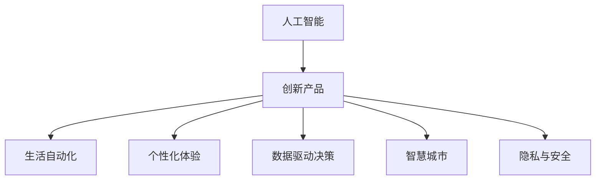

                 

# AI 驱动的创新产品：改变我们的生活方式

> 关键词：人工智能,创新产品,生活方式,自动化,数据驱动,用户体验,智慧城市

## 1. 背景介绍

### 1.1 问题由来
随着人工智能(AI)技术的迅猛发展，AI驱动的创新产品正逐渐融入我们的生活，从智能手机、智能家居到智能办公，AI正在改变我们的生活方式。然而，尽管AI技术已经带来了诸多便利，但其应用过程中仍面临诸多挑战，例如用户隐私保护、数据安全、算法透明性等问题。本文旨在探讨AI驱动创新产品的前景与挑战，如何构建更加智能、可靠、可解释的系统，以改善我们的日常生活。

### 1.2 问题核心关键点
本文聚焦于AI驱动的创新产品及其在生活中的应用，具体包括：

1. **自动化流程优化**：通过AI技术优化日常生活中的各种流程，如智能家居、智能办公、智能交通等。
2. **个性化体验提升**：利用AI技术实现个性化推荐、智能客服、个性化医疗等，提升用户体验。
3. **数据驱动决策**：通过大数据分析和AI模型，实现智能决策支持，如金融风控、市场预测等。
4. **智慧城市建设**：构建智能城市，实现城市管理的智能化和高效化。
5. **隐私与安全保障**：如何在享受AI带来的便利的同时，保障用户隐私和数据安全。

### 1.3 问题研究意义
研究AI驱动的创新产品，对于推动技术进步、促进经济发展、改善人类生活质量具有重要意义：

1. **技术进步**：AI技术的发展和应用为其他领域提供了新的技术工具和方法，推动相关技术的不断进步。
2. **经济繁荣**：AI技术的应用将为各行各业带来新的增长点，提升经济活动效率。
3. **社会福祉**：AI技术在医疗、教育、交通等领域的广泛应用，将显著提升社会福祉。
4. **安全保障**：AI技术的应用将提升社会治理和公共安全的水平，减少犯罪和事故。
5. **创新发展**：AI技术的应用将推动创新，催生新的商业模式和产业形态。

## 2. 核心概念与联系

### 2.1 核心概念概述

为更好地理解AI驱动的创新产品，本节将介绍几个密切相关的核心概念：

- **人工智能(Artificial Intelligence, AI)**：利用计算机系统模拟人类智能行为的技术，涵盖感知、推理、学习等能力。
- **创新产品(Investigated Products)**：结合AI技术，通过产品化实现创新的应用场景。
- **生活自动化(Automation of Daily Life)**：利用AI技术自动化完成日常任务，提升效率。
- **个性化体验(Personalized Experience)**：通过AI技术实现对个体需求的精准响应，提升用户体验。
- **数据驱动决策(Data-Driven Decision Making)**：利用大数据和AI模型进行决策，提升决策效率和质量。
- **智慧城市(Smart City)**：利用AI技术实现城市管理的智能化和高效化。
- **隐私与安全(Privacy and Security)**：保护用户隐私和数据安全，确保AI系统的可靠性和可信度。

这些概念之间的逻辑关系可以通过以下Mermaid流程图来展示：



这个流程图展示了大语言模型的核心概念及其之间的关系：

1. AI技术提供基础能力。
2. 创新产品通过AI技术实现具体应用。
3. 生活自动化、个性化体验、数据驱动决策、智慧城市等，是AI驱动创新产品的典型应用场景。
4. 隐私与安全是AI系统构建和应用过程中需要重点考虑的问题。

## 3. 核心算法原理 & 具体操作步骤
### 3.1 算法原理概述

AI驱动的创新产品通常涉及多种AI算法和技术，但其核心原理可以归纳为以下几个方面：

1. **数据驱动**：收集和分析大量数据，利用AI模型进行模式识别和预测，从而驱动产品的智能化决策。
2. **机器学习**：利用数据训练AI模型，使其具备自主学习的能力，不断优化预测和决策的准确性。
3. **深度学习**：通过多层神经网络模型，模拟人类大脑的神经元结构，实现复杂的模式识别和决策。
4. **自然语言处理(NLP)**：利用AI技术理解和生成自然语言，实现语音识别、文本分析、智能客服等功能。
5. **计算机视觉**：利用AI技术进行图像和视频分析，实现物体识别、场景理解等功能。

### 3.2 算法步骤详解

AI驱动的创新产品开发过程一般包括以下关键步骤：

**Step 1: 需求分析**
- 确定产品应用场景和用户需求，设计产品功能和使用场景。
- 收集相关数据，进行数据预处理和特征提取。

**Step 2: 模型设计**
- 选择适合的AI模型，如深度学习、机器学习等，设计模型架构。
- 确定模型输入和输出，定义模型训练目标。

**Step 3: 数据训练**
- 准备标注数据集，进行数据增强和数据清洗。
- 使用优化算法进行模型训练，调整模型超参数。
- 评估模型性能，进行模型优化和调优。

**Step 4: 产品开发**
- 将训练好的模型嵌入到产品中，实现具体功能。
- 进行UI/UX设计，优化用户体验。
- 实现数据存储和传输，保障数据安全和隐私。

**Step 5: 测试和部署**
- 在实际环境中进行产品测试，发现和修复问题。
- 部署产品到生产环境，监控系统性能。
- 定期更新模型和算法，保持产品竞争力。

### 3.3 算法优缺点

AI驱动的创新产品具有以下优点：

1. **高效性**：利用AI技术自动处理大量数据，提升决策效率。
2. **个性化**：通过分析用户数据，实现个性化推荐和智能客服。
3. **智能化**：利用深度学习和自然语言处理技术，实现复杂任务处理。
4. **可靠性**：AI模型具备自主学习能力，不断优化算法性能。

同时，这些产品也存在一定的局限性：

1. **数据依赖**：需要大量高质量数据支持，数据质量直接影响模型性能。
2. **算法复杂**：深度学习等复杂模型训练和调试难度较大，对技术要求高。
3. **隐私风险**：收集和分析用户数据，存在隐私泄露风险。
4. **伦理挑战**：AI模型的决策过程缺乏透明度，可能引发伦理问题。

尽管存在这些局限性，但AI驱动的创新产品依然凭借其高效性、个性化和智能化等优势，在多个领域得到广泛应用。未来相关研究将继续关注如何平衡技术优势与数据隐私、算法透明性等伦理问题。

### 3.4 算法应用领域

AI驱动的创新产品广泛应用于多个领域，包括但不限于：

1. **智能家居**：利用AI技术实现智能控制、安防监控、家庭助理等功能，提升居家生活质量。
2. **智能办公**：通过AI技术优化办公流程，提升工作效率和决策质量。
3. **智能交通**：利用AI技术进行交通管理、智能导航、自动驾驶等，实现交通智能化。
4. **智能医疗**：利用AI技术进行疾病诊断、治疗建议、健康管理等，提升医疗服务质量。
5. **金融科技**：利用AI技术进行风险评估、信用评分、市场预测等，提升金融服务水平。
6. **智慧城市**：利用AI技术实现城市管理智能化，如智能交通、智能安防、智慧环境等。

此外，AI技术还在教育、能源、农业等领域得到广泛应用，为各行各业带来了创新和发展机遇。

## 4. 数学模型和公式 & 详细讲解  
### 4.1 数学模型构建

本节将使用数学语言对AI驱动的创新产品开发过程进行更加严格的刻画。

记AI驱动的创新产品为 $P$，其输入为 $X$，输出为 $Y$，模型的输入输出关系可以表示为：

$$
Y = f(X; \theta)
$$

其中 $f$ 为模型的映射函数，$\theta$ 为模型的参数，通过训练数据集 $D=\{(x_i, y_i)\}_{i=1}^N$ 进行训练。模型的目标是最小化损失函数 $\mathcal{L}$，使得模型在训练集上的预测值与真实值尽可能接近，即：

$$
\theta^* = \mathop{\arg\min}_{\theta} \mathcal{L}(\theta)
$$

常用的损失函数包括交叉熵损失、均方误差损失等。通过梯度下降等优化算法，最小化损失函数，更新模型参数 $\theta$，最终得到最优模型参数 $\theta^*$。

### 4.2 公式推导过程

以深度学习模型为例，其前向传播和后向传播的计算过程可以表示为：

$$
y = \sigma(Wx + b)
$$

其中 $W$ 为权重矩阵，$b$ 为偏置向量，$\sigma$ 为激活函数，$x$ 为输入向量，$y$ 为输出向量。

对于训练数据集 $D=\{(x_i, y_i)\}_{i=1}^N$，模型的损失函数可以表示为：

$$
\mathcal{L} = \frac{1}{N} \sum_{i=1}^N \ell(y_i, \hat{y}_i)
$$

其中 $\ell$ 为损失函数，$\hat{y}_i$ 为模型对第 $i$ 个样本的预测值。常用的损失函数包括交叉熵损失和均方误差损失，具体公式如下：

$$
\ell(y, \hat{y}) = -y \log \hat{y} + (1-y) \log (1-\hat{y})
$$

$$
\ell(y, \hat{y}) = \frac{1}{2} (y - \hat{y})^2
$$

通过反向传播算法，计算损失函数对模型参数的梯度，更新参数：

$$
\frac{\partial \mathcal{L}}{\partial \theta} = \frac{\partial \mathcal{L}}{\partial y} \frac{\partial y}{\partial x} \frac{\partial x}{\partial \theta}
$$

通过优化算法如梯度下降，不断迭代更新模型参数，最终得到最优参数 $\theta^*$。

### 4.3 案例分析与讲解

以智能客服系统为例，其开发过程可以分为以下几个步骤：

1. **需求分析**：收集用户反馈，确定客服系统的功能和需求。
2. **数据准备**：收集历史客服对话记录，进行数据清洗和标注。
3. **模型设计**：选择适合的深度学习模型，设计模型架构。
4. **数据训练**：利用标注数据集训练模型，调整模型参数。
5. **产品开发**：将训练好的模型嵌入到客服系统中，实现智能客服功能。
6. **测试和部署**：在实际环境中进行测试，修复问题和漏洞，部署到生产环境。

## 5. 项目实践：代码实例和详细解释说明
### 5.1 开发环境搭建

在进行AI驱动的创新产品开发前，我们需要准备好开发环境。以下是使用Python进行TensorFlow开发的环境配置流程：

1. 安装Anaconda：从官网下载并安装Anaconda，用于创建独立的Python环境。

2. 创建并激活虚拟环境：
```bash
conda create -n tf-env python=3.8 
conda activate tf-env
```

3. 安装TensorFlow：根据CUDA版本，从官网获取对应的安装命令。例如：
```bash
conda install tensorflow
```

4. 安装各类工具包：
```bash
pip install numpy pandas scikit-learn matplotlib tqdm jupyter notebook ipython
```

完成上述步骤后，即可在`tf-env`环境中开始AI驱动创新产品的开发。

### 5.2 源代码详细实现

下面以智能客服系统为例，给出使用TensorFlow开发AI驱动创新产品的PyTorch代码实现。

首先，定义智能客服系统的数据处理函数：

```python
import tensorflow as tf
from tensorflow.keras import layers

class CustomerService(tf.keras.Model):
    def __init__(self, input_dim, output_dim):
        super(CustomerService, self).__init__()
        self.input_dim = input_dim
        self.output_dim = output_dim
        
        self.encoder = layers.Dense(64, activation='relu')
        self.decoder = layers.Dense(self.output_dim, activation='softmax')
    
    def call(self, x):
        x = self.encoder(x)
        return self.decoder(x)
```

然后，定义训练和评估函数：

```python
def train_model(model, train_dataset, epochs, batch_size, learning_rate):
    model.compile(loss='categorical_crossentropy', optimizer=tf.keras.optimizers.Adam(learning_rate), metrics=['accuracy'])
    model.fit(train_dataset, epochs=epochs, batch_size=batch_size, validation_data=val_dataset)
    
def evaluate_model(model, test_dataset, batch_size):
    model.evaluate(test_dataset, batch_size=batch_size)
```

最后，启动训练流程并在测试集上评估：

```python
epochs = 10
batch_size = 64
learning_rate = 0.001

train_dataset = ...
val_dataset = ...
test_dataset = ...

model = CustomerService(train_dataset.shape[1], num_classes)
train_model(model, train_dataset, epochs, batch_size, learning_rate)
evaluate_model(model, test_dataset, batch_size)
```

以上就是使用TensorFlow进行智能客服系统开发的完整代码实现。可以看到，TensorFlow提供了丰富的Keras API，使得模型设计和训练过程非常简洁高效。

### 5.3 代码解读与分析

让我们再详细解读一下关键代码的实现细节：

**CustomerService类**：
- `__init__`方法：初始化输入和输出维度，定义模型的编码器和解码器。
- `call`方法：进行模型的前向传播。

**train_model函数**：
- 编译模型，设置损失函数和优化器。
- 使用训练数据集进行模型训练，设置验证集。
- 循环迭代训练过程，直到预设的epoch数。

**evaluate_model函数**：
- 使用测试数据集进行模型评估，返回评估结果。

**训练流程**：
- 定义总的epoch数和batch size，开始循环迭代
- 每个epoch内，在训练集上训练，输出损失和准确率
- 在验证集上评估，返回损失和准确率
- 所有epoch结束后，在测试集上评估，给出最终结果

可以看到，TensorFlow提供的高效API使得模型的设计和训练过程非常简单，开发者可以更加专注于模型的优化和特征工程。

当然，工业级的系统实现还需考虑更多因素，如模型的保存和部署、超参数的自动搜索、更灵活的任务适配层等。但核心的AI驱动创新产品开发过程基本与此类似。

## 6. 实际应用场景
### 6.1 智能家居

智能家居系统利用AI技术，实现家庭自动化和智能化管理。通过语音识别、图像识别、传感器监测等技术，实现智能照明、智能温控、智能安防等功能，提升居家生活质量。例如，智能音箱可以通过语音命令控制家中的各种设备，智能窗帘可以根据天气和用户习惯自动调节。

### 6.2 智能办公

智能办公系统利用AI技术，优化办公流程和决策支持。通过自然语言处理技术，实现智能客服、文档生成、邮件分类等功能。例如，智能客服系统可以自动解答用户咨询，文档生成系统可以根据模板和输入信息自动生成报告。

### 6.3 智能交通

智能交通系统利用AI技术，实现交通管理和智能导航。通过图像识别技术，实现交通信号灯控制、车辆识别、交通事故检测等功能。例如，自动驾驶汽车可以通过感知周围环境，实现自主导航和避障。

### 6.4 智能医疗

智能医疗系统利用AI技术，提升医疗服务的智能化和效率。通过自然语言处理技术，实现电子病历生成、疾病诊断、治疗建议等功能。例如，智能医疗助手可以根据医生的描述，自动推荐相关药物和诊疗方案。

### 6.5 金融科技

金融科技系统利用AI技术，提升金融服务的智能化和效率。通过机器学习技术，实现风险评估、信用评分、市场预测等功能。例如，智能风控系统可以根据用户行为数据，预测违约风险，优化信贷审批流程。

### 6.6 智慧城市

智慧城市系统利用AI技术，实现城市管理的智能化和高效化。通过计算机视觉技术，实现智能安防、智能交通、智能环境等功能。例如，智能监控系统可以自动检测异常行为，及时发出预警。

### 6.7 未来应用展望

随着AI技术的不断发展，AI驱动的创新产品将广泛应用于更多领域，为人类带来新的生活方式。例如：

1. **个性化推荐系统**：通过AI技术实现个性化商品推荐、个性化内容推送等，提升用户满意度和粘性。
2. **智能健康管理**：通过AI技术实现健康监测、疾病预测、个性化医疗等，提升健康管理水平。
3. **智能金融服务**：通过AI技术实现智能投顾、智能理财、智能风控等，提升金融服务质量。
4. **智能教育**：通过AI技术实现智能辅导、智能评估、个性化教育等，提升教育效果。
5. **智能农业**：通过AI技术实现智能灌溉、智能施肥、智能收获等，提升农业生产效率。
6. **智能物流**：通过AI技术实现智能调度、智能仓储、智能配送等，提升物流效率。

## 7. 工具和资源推荐
### 7.1 学习资源推荐

为了帮助开发者系统掌握AI驱动创新产品的理论基础和实践技巧，这里推荐一些优质的学习资源：

1. 《深度学习》系列博文：由AI专家撰写，深入浅出地介绍了深度学习的基本概念和应用。
2. CS231n《深度学习与计算机视觉》课程：斯坦福大学开设的深度学习课程，涵盖计算机视觉领域的基本概念和经典模型。
3. 《Python深度学习》书籍：由深度学习大牛撰写，详细介绍了Python在深度学习中的应用。
4. TensorFlow官方文档：TensorFlow的官方文档，提供了丰富的API和示例，是AI开发的重要参考。
5. PyTorch官方文档：PyTorch的官方文档，提供了丰富的API和示例，是AI开发的重要参考。

通过对这些资源的学习实践，相信你一定能够快速掌握AI驱动创新产品的精髓，并用于解决实际的AI应用问题。
### 7.2 开发工具推荐

高效的开发离不开优秀的工具支持。以下是几款用于AI驱动创新产品开发的常用工具：

1. TensorFlow：由Google主导开发的开源深度学习框架，生产部署方便，适合大规模工程应用。
2. PyTorch：由Facebook主导开发的深度学习框架，灵活动态，适合快速迭代研究。
3. Keras：高层API，封装了TensorFlow和PyTorch的复杂性，使得模型开发更加便捷。
4. Jupyter Notebook：交互式编程环境，支持Python、R等多种语言，方便调试和展示代码。
5. Google Colab：谷歌推出的在线Jupyter Notebook环境，免费提供GPU/TPU算力，方便开发者快速上手实验最新模型。

合理利用这些工具，可以显著提升AI驱动创新产品的开发效率，加快创新迭代的步伐。

### 7.3 相关论文推荐

AI驱动创新产品的发展源于学界的持续研究。以下是几篇奠基性的相关论文，推荐阅读：

1. 《ImageNet Classification with Deep Convolutional Neural Networks》：AlexNet论文，提出了卷积神经网络，开启深度学习时代。
2. 《Natural Language Processing (almost) from Scratch》：LSTM论文，提出了长短期记忆网络，实现了语言序列建模。
3. 《Attention is All You Need》：Transformer论文，提出了Transformer模型，改变了自然语言处理领域。
4. 《Generative Adversarial Nets》：GAN论文，提出了生成对抗网络，实现了图像生成等任务。
5. 《AlphaGo Zero》：AlphaGo Zero论文，实现了自我对弈，提升了AI在游戏领域的水平。

这些论文代表了大语言模型驱动创新产品的发展脉络。通过学习这些前沿成果，可以帮助研究者把握学科前进方向，激发更多的创新灵感。

## 8. 总结：未来发展趋势与挑战

### 8.1 总结

本文对AI驱动的创新产品进行了全面系统的介绍。首先阐述了AI驱动创新产品的前景和挑战，明确了其在自动化流程优化、个性化体验提升、数据驱动决策、智慧城市建设等方面的独特价值。其次，从原理到实践，详细讲解了AI驱动创新产品的开发过程，给出了完整的产品开发代码实现。同时，本文还广泛探讨了AI驱动创新产品在智能家居、智能办公、智能交通等多个领域的应用前景，展示了AI驱动创新产品的巨大潜力。此外，本文精选了AI驱动创新产品的学习资源和开发工具，力求为读者提供全方位的技术指引。

通过本文的系统梳理，可以看到，AI驱动创新产品正在成为各行各业的重要技术手段，极大地提升了生产效率和用户体验。未来，伴随AI技术的不断发展，AI驱动创新产品将带来更加智能、高效、可靠的生活体验，为人类生活带来深刻变革。

### 8.2 未来发展趋势

展望未来，AI驱动创新产品的发展将呈现以下几个趋势：

1. **智能化水平提升**：随着AI技术的不断进步，AI驱动创新产品的智能化水平将不断提高，应用场景将更加广泛。
2. **个性化程度增强**：通过大数据和AI模型的结合，AI驱动创新产品将更好地满足个性化需求，提升用户体验。
3. **数据驱动决策优化**：利用更高级的数据处理和AI模型，AI驱动创新产品将提升决策效率和质量，优化决策过程。
4. **智慧城市建设加速**：智慧城市将实现更加智能化和高效化的城市管理，提升城市居民的生活质量。
5. **伦理和安全保障**：在AI产品开发过程中，将更加注重伦理和安全性，保障用户隐私和数据安全。
6. **多模态融合发展**：AI驱动创新产品将实现多模态数据的融合，提升系统感知和决策能力。

以上趋势凸显了AI驱动创新产品的广阔前景。这些方向的探索发展，将进一步推动AI技术在各个领域的应用，带来新的商业机会和社会价值。

### 8.3 面临的挑战

尽管AI驱动创新产品已经取得了诸多成就，但在迈向更加智能化、普适化应用的过程中，仍面临诸多挑战：

1. **数据获取与处理**：高质量数据获取和处理难度较大，数据量不足将限制AI系统的性能。
2. **算法复杂性**：深度学习和复杂模型的训练和调试难度较大，对技术要求高。
3. **隐私与伦理**：数据隐私和算法透明性问题需要进一步解决，保障用户权益。
4. **模型鲁棒性**：面对异常数据和攻击，AI系统的鲁棒性需要进一步提升。
5. **计算资源消耗**：大规模模型的训练和推理需要大量计算资源，资源优化问题亟待解决。
6. **用户体验优化**：提升系统的易用性和用户体验，是未来AI产品开发的重要方向。

这些挑战需要学术界和产业界共同努力，不断优化算法和技术，提升AI系统的性能和可靠性。

### 8.4 研究展望

面对AI驱动创新产品所面临的挑战，未来的研究需要在以下几个方面寻求新的突破：

1. **数据获取与处理**：开发更多高效的数据获取和处理技术，扩大数据规模，提升数据质量。
2. **算法优化**：开发更加高效、易用的算法和工具，提升模型训练和推理效率。
3. **隐私与伦理**：研究数据隐私保护和算法透明性技术，提升AI系统的可信度。
4. **模型鲁棒性**：开发鲁棒性更强的算法和模型，提升系统的鲁棒性和抗干扰能力。
5. **计算资源优化**：研究高效的模型压缩和推理优化技术，提升系统的资源利用效率。
6. **用户体验优化**：提升系统的易用性和用户体验，实现智能化与易用性的平衡。

这些研究方向的探索，必将引领AI驱动创新产品走向更加智能化、普适化和可靠化的方向，为人类生活带来深刻变革。面向未来，AI驱动创新产品需要与其他AI技术进行更深入的融合，如知识表示、因果推理、强化学习等，多路径协同发力，共同推动AI技术的发展和应用。只有勇于创新、敢于突破，才能不断拓展AI驱动创新产品的边界，让AI技术更好地造福人类社会。

## 9. 附录：常见问题与解答

**Q1：AI驱动的创新产品是否适用于所有应用场景？**

A: AI驱动的创新产品适用于大多数应用场景，特别是数据量较大、决策过程复杂和需要大量人工介入的场景。但在一些对安全性要求极高、数据隐私问题严重的场景，如医疗、金融等，需要谨慎应用。

**Q2：AI驱动的创新产品如何保障数据隐私？**

A: 保障数据隐私是AI驱动创新产品开发过程中需要重点考虑的问题。可以采取以下措施：
1. 数据匿名化：对数据进行去标识化处理，保护用户隐私。
2. 差分隐私：引入差分隐私技术，降低隐私泄露风险。
3. 加密传输：使用加密技术保护数据传输过程中的隐私。
4. 用户授权：在数据收集和使用前，征得用户授权，保障用户知情权。

**Q3：AI驱动的创新产品如何提升用户体验？**

A: 提升用户体验是AI驱动创新产品开发过程中的重要目标。可以采取以下措施：
1. 智能推荐：利用AI技术进行个性化推荐，提升用户满意度。
2. 智能客服：通过自然语言处理技术，实现智能客服，提升服务效率。
3. 用户界面优化：提升系统的易用性和操作效率，增强用户粘性。
4. 用户反馈机制：建立用户反馈机制，持续优化产品功能和用户体验。

**Q4：AI驱动的创新产品面临哪些伦理挑战？**

A: AI驱动创新产品面临的主要伦理挑战包括：
1. 数据偏见：AI系统可能学习到数据中的偏见，导致决策不公平。
2. 隐私泄露：AI系统可能泄露用户隐私，引发隐私泄露问题。
3. 算法透明性：AI系统的决策过程缺乏透明性，难以解释和审计。
4. 安全攻击：AI系统可能受到对抗攻击，影响系统安全性。

这些问题需要从数据获取、模型设计、算法实现等多个环节进行综合考虑和优化，确保AI系统的公正性、隐私性和安全性。

---

作者：禅与计算机程序设计艺术 / Zen and the Art of Computer Programming

