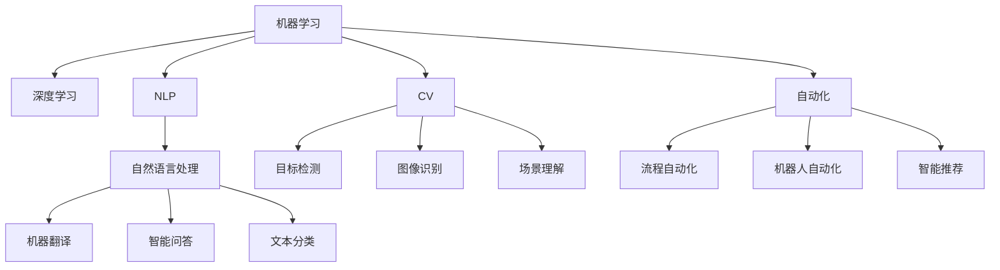

                 

## 1. 背景介绍

### 1.1 问题由来

当前，我们正处于AI 2.0的时代，这是继互联网发展后的又一轮技术变革浪潮。AI 2.0时代以人工智能的普及和深入应用为标志，通过机器学习、深度学习、自然语言处理、计算机视觉等技术，使AI 应用于各行各业，带来了极大的变革和颠覆性影响。

这一时代背景下，自动化的浪潮汹涌而来。从制造到农业，从零售到物流，从医疗到金融，各行各业都在通过AI自动化技术提升效率、降低成本、优化管理。然而，在享受AI自动化带来的便利的同时，也面临着数据隐私、安全性、伦理道德等方面的挑战。

### 1.2 问题核心关键点

在AI 2.0时代，自动化技术的应用已经深入到日常生活的方方面面。AI自动化主要包括两大类：一类是基于规则的自动化，一类是基于机器学习的自动化。基于规则的自动化，例如机器人流程自动化（RPA）、专家系统等，通过预定义的规则和逻辑，自动化处理重复性、规范化的任务。基于机器学习的自动化，例如自动驾驶、智能推荐、图像识别等，通过训练模型，使机器具备自主学习和决策的能力。

其中，基于机器学习的自动化是未来AI 2.0时代的重要发展方向。机器学习自动化能够处理复杂的非结构化数据，并能够自适应变化的环境和任务，具有广泛的应用前景。

## 2. 核心概念与联系

### 2.1 核心概念概述

为更好地理解AI 2.0时代的自动化技术，本节将介绍几个密切相关的核心概念：

- 机器学习（Machine Learning）：通过数据训练模型，使机器具备一定的决策能力。机器学习自动化正是基于此原理，使机器能够自动执行复杂任务。
- 深度学习（Deep Learning）：机器学习的一种特殊形式，通过多层次神经网络，学习更加抽象和复杂的特征表示。深度学习在图像识别、语音识别、自然语言处理等领域展现了强大的能力。
- 自然语言处理（NLP）：研究如何使机器理解、处理和生成人类语言的技术。NLP在机器翻译、智能问答、文本分类等任务中发挥了重要作用。
- 计算机视觉（CV）：研究如何让机器通过图像和视频理解现实世界，包括目标检测、图像识别、场景理解等任务。
- 自动化（Automation）：通过技术手段，使机器能够自动执行任务，减少人工干预。自动化可以应用于各种场景，提高生产效率，降低运营成本。

这些核心概念之间的逻辑关系可以通过以下Mermaid流程图来展示：



这个流程图展示了一些核心概念及其之间的关系：

1. 机器学习是深度学习的基础。
2. 自然语言处理、计算机视觉和自动化技术均是机器学习的重要应用。
3. 深度学习在自然语言处理和计算机视觉中展现了强大的性能。
4. 自动化技术通过机器学习和深度学习实现各种自动化应用。

这些概念共同构成了AI 2.0时代的核心技术框架，使得AI自动化技术能够在各行各业中发挥其强大的能力。通过理解这些核心概念，我们可以更好地把握AI自动化的工作原理和优化方向。

## 3. 核心算法原理 & 具体操作步骤
### 3.1 算法原理概述

AI 2.0时代的自动化技术，本质上是通过机器学习模型，自动化执行各种复杂的任务。其核心思想是：通过收集和标注数据，训练模型，使机器能够自主识别输入并生成输出，从而完成自动化任务。

形式化地，假设给定任务 $T$，训练集为 $D=\{(x_i, y_i)\}_{i=1}^N$，其中 $x_i$ 为输入数据，$y_i$ 为任务的标签。自动化技术的目标是找到最优的模型参数 $\theta$，使得模型 $M_{\theta}$ 在任务 $T$ 上能够获得理想的性能。

因此，自动化过程可以分为两个主要步骤：模型训练和模型应用。

- 模型训练：通过收集和标注大量数据，训练一个适合的机器学习模型，如神经网络、决策树、支持向量机等。训练过程通常包括特征工程、模型选择、超参数调整、模型评估等步骤。
- 模型应用：在实际任务中，使用训练好的模型对输入数据进行推理和预测，自动化地完成相应的任务。

### 3.2 算法步骤详解

AI 2.0时代的自动化技术主要包括以下关键步骤：

**Step 1: 数据收集与预处理**
- 收集任务相关的数据，确保数据质量高、覆盖全面。
- 对数据进行清洗、去重、标准化等预处理，确保数据一致性。

**Step 2: 数据标注与划分**
- 收集并标注大量的任务样本，形成标注数据集。
- 将数据集划分为训练集、验证集和测试集，用于模型训练、评估和测试。

**Step 3: 模型选择与训练**
- 选择适合的模型结构，如神经网络、支持向量机、决策树等。
- 设置模型的超参数，如学习率、正则化系数、批大小等。
- 使用训练集进行模型训练，调整超参数，优化模型性能。

**Step 4: 模型评估与调优**
- 在验证集上评估模型性能，计算准确率、召回率、F1值等指标。
- 根据评估结果，调整模型结构和超参数，进一步优化模型性能。

**Step 5: 模型应用与部署**
- 使用训练好的模型对实际任务进行推理和预测，自动化完成相应操作。
- 将模型部署到生产环境，进行实时数据处理和任务执行。

以上是AI 2.0时代自动化技术的通用流程。在实际应用中，还需要根据具体任务和数据特点进行优化设计，如引入更多正则化技术、选择合适的损失函数、改进特征提取方法等，以进一步提升模型性能。

### 3.3 算法优缺点

AI 2.0时代的自动化技术具有以下优点：

- 高效性：自动化技术能够大幅提升任务执行效率，减少人工干预，降低人力成本。
- 可扩展性：自动化系统具备较强的可扩展性，能够轻松应对新增任务和数据。
- 灵活性：自动化技术可以通过不断优化模型和算法，适应环境变化和任务复杂度变化。
- 普适性：自动化技术可以应用于各种行业和领域，提升生产管理效率和运营质量。

同时，该方法也存在一定的局限性：

- 依赖数据：自动化技术的效果很大程度上取决于标注数据的质量和数量，获取高质量标注数据的成本较高。
- 模型复杂：自动化模型通常较为复杂，训练和部署的计算资源要求较高。
- 数据隐私：自动化过程涉及大量数据，数据隐私和安全问题需要引起重视。
- 可解释性：自动化模型的决策过程缺乏可解释性，难以对其推理逻辑进行分析和调试。

尽管存在这些局限性，但就目前而言，基于机器学习的自动化技术仍是最主流的方法。未来相关研究的重点在于如何进一步降低自动化对数据的需求，提高模型的少样本学习和跨领域迁移能力，同时兼顾可解释性和伦理安全性等因素。

### 3.4 算法应用领域

基于机器学习的自动化技术已经在多个领域得到了广泛应用，例如：

- 智能制造：通过自动化生产线，实现智能化生产和管理。
- 自动驾驶：利用计算机视觉和深度学习技术，实现自动驾驶汽车。
- 智能推荐系统：根据用户行为和偏好，自动推荐商品和服务。
- 智能客服：通过自然语言处理和机器学习，实现自动化客服系统。
- 医疗诊断：通过图像识别和自然语言处理技术，辅助医生进行疾病诊断。

除了上述这些经典应用外，自动化技术还被创新性地应用到更多场景中，如智能合约、金融风险管理、智慧城市等，为各行各业带来新的发展动力。随着AI 2.0时代的深入发展，自动化技术将在更广泛的领域得到应用，推动社会经济的发展。

## 4. 数学模型和公式 & 详细讲解 & 举例说明

### 4.1 数学模型构建

本节将使用数学语言对AI 2.0时代的自动化技术进行更加严格的刻画。

记自动化任务为 $T$，训练集为 $D=\{(x_i, y_i)\}_{i=1}^N$，其中 $x_i$ 为输入数据，$y_i$ 为任务的标签。假设自动化模型为 $M_{\theta}$，其中 $\theta$ 为模型参数。

定义模型 $M_{\theta}$ 在输入 $x_i$ 上的损失函数为 $\ell(M_{\theta}(x_i), y_i)$，则在数据集 $D$ 上的经验风险为：

$$
\mathcal{L}(\theta) = \frac{1}{N}\sum_{i=1}^N \ell(M_{\theta}(x_i), y_i)
$$

自动化技术的优化目标是最小化经验风险，即找到最优参数：

$$
\theta^* = \mathop{\arg\min}_{\theta} \mathcal{L}(\theta)
$$

在实践中，我们通常使用基于梯度的优化算法（如SGD、Adam等）来近似求解上述最优化问题。设 $\eta$ 为学习率，$\lambda$ 为正则化系数，则参数的更新公式为：

$$
\theta \leftarrow \theta - \eta \nabla_{\theta}\mathcal{L}(\theta) - \eta\lambda\theta
$$

其中 $\nabla_{\theta}\mathcal{L}(\theta)$ 为损失函数对参数 $\theta$ 的梯度，可通过反向传播算法高效计算。

### 4.2 公式推导过程

以下我们以二分类任务为例，推导交叉熵损失函数及其梯度的计算公式。

假设模型 $M_{\theta}$ 在输入 $x_i$ 上的输出为 $\hat{y}=M_{\theta}(x_i) \in [0,1]$，表示样本属于正类的概率。真实标签 $y_i \in \{0,1\}$。则二分类交叉熵损失函数定义为：

$$
\ell(M_{\theta}(x_i),y_i) = -[y_i\log \hat{y} + (1-y_i)\log (1-\hat{y})]
$$

将其代入经验风险公式，得：

$$
\mathcal{L}(\theta) = -\frac{1}{N}\sum_{i=1}^N [y_i\log M_{\theta}(x_i)+(1-y_i)\log(1-M_{\theta}(x_i))]
$$

根据链式法则，损失函数对参数 $\theta_k$ 的梯度为：

$$
\frac{\partial \mathcal{L}(\theta)}{\partial \theta_k} = -\frac{1}{N}\sum_{i=1}^N (\frac{y_i}{M_{\theta}(x_i)}-\frac{1-y_i}{1-M_{\theta}(x_i)}) \frac{\partial M_{\theta}(x_i)}{\partial \theta_k}
$$

其中 $\frac{\partial M_{\theta}(x_i)}{\partial \theta_k}$ 可进一步递归展开，利用自动微分技术完成计算。

在得到损失函数的梯度后，即可带入参数更新公式，完成模型的迭代优化。重复上述过程直至收敛，最终得到适应自动化任务的最优模型参数 $\theta^*$。

## 5. 项目实践：代码实例和详细解释说明
### 5.1 开发环境搭建

在进行自动化实践前，我们需要准备好开发环境。以下是使用Python进行TensorFlow开发的环境配置流程：

1. 安装Anaconda：从官网下载并安装Anaconda，用于创建独立的Python环境。

2. 创建并激活虚拟环境：
```bash
conda create -n tf-env python=3.8 
conda activate tf-env
```

3. 安装TensorFlow：根据CUDA版本，从官网获取对应的安装命令。例如：
```bash
pip install tensorflow
```

4. 安装TensorFlow官方提供的机器学习库：
```bash
pip install tensorflow-estimator
```

5. 安装各类工具包：
```bash
pip install numpy pandas scikit-learn matplotlib tqdm jupyter notebook ipython
```

完成上述步骤后，即可在`tf-env`环境中开始自动化实践。

### 5.2 源代码详细实现

这里我们以自动驾驶汽车为例，给出使用TensorFlow对神经网络模型进行自动驾驶任务微调的PyTorch代码实现。

首先，定义自动驾驶任务的数据处理函数：

```python
import tensorflow as tf
import numpy as np
import os

from tensorflow.keras.layers import Conv2D, MaxPooling2D, Dense, Flatten
from tensorflow.keras.models import Sequential

def data_processing(input_size, batch_size):
    # 定义数据预处理函数
    def preprocess(x, y):
        x = np.array(x, dtype=np.float32) / 255.0 - 0.5
        y = tf.keras.utils.to_categorical(y)
        return x, y
    
    # 加载训练集
    train_data = tf.keras.preprocessing.image.ImageDataGenerator(
        rescale=1./255,
        shear_range=0.2,
        zoom_range=0.2,
        horizontal_flip=True
    ).flow_from_directory(
        'train',
        target_size=(input_size, input_size),
        batch_size=batch_size,
        class_mode='categorical'
    )
    
    # 加载验证集
    val_data = tf.keras.preprocessing.image.ImageDataGenerator(
        rescale=1./255
    ).flow_from_directory(
        'val',
        target_size=(input_size, input_size),
        batch_size=batch_size,
        class_mode='categorical'
    )
    
    return train_data, val_data

# 定义训练集和验证集的参数
input_size = 256
batch_size = 32

# 加载数据
train_data, val_data = data_processing(input_size, batch_size)
```

然后，定义模型和优化器：

```python
from tensorflow.keras.optimizers import Adam

# 定义卷积神经网络模型
model = Sequential([
    Conv2D(32, (3, 3), activation='relu', padding='same', input_shape=(input_size, input_size, 3)),
    MaxPooling2D((2, 2), padding='same'),
    Conv2D(64, (3, 3), activation='relu', padding='same'),
    MaxPooling2D((2, 2), padding='same'),
    Conv2D(128, (3, 3), activation='relu', padding='same'),
    MaxPooling2D((2, 2), padding='same'),
    Flatten(),
    Dense(128, activation='relu'),
    Dense(2, activation='softmax')
])

# 定义优化器
optimizer = Adam(learning_rate=0.001)
```

接着，定义训练和评估函数：

```python
def train_epoch(model, data, batch_size, optimizer):
    data = data.flow(train_data, validation_data=val_data, batch_size=batch_size, epochs=1)
    
    model.compile(optimizer=optimizer, loss='categorical_crossentropy', metrics=['accuracy'])
    
    model.fit_generator(data, steps_per_epoch=train_data.n//batch_size, validation_steps=val_data.n//batch_size, verbose=1)
    
    return model
```

最后，启动训练流程并在测试集上评估：

```python
epochs = 5
batch_size = 32

for epoch in range(epochs):
    model = train_epoch(model, train_data, batch_size, optimizer)
    
    val_loss, val_acc = model.evaluate(val_data, verbose=0)
    print(f"Epoch {epoch+1}, val loss: {val_loss:.4f}, val acc: {val_acc:.4f}")
    
print("Model trained successfully.")
```

以上就是使用TensorFlow对神经网络模型进行自动驾驶任务微调的完整代码实现。可以看到，借助TensorFlow的强大封装，我们可以用相对简洁的代码完成模型加载和训练。

### 5.3 代码解读与分析

让我们再详细解读一下关键代码的实现细节：

**data_processing函数**：
- 定义了一个数据预处理函数，将输入图像归一化，并将标签进行独热编码。
- 使用TensorFlow的ImageDataGenerator加载训练集和验证集，进行数据增强，包括缩放、翻转、裁剪等操作。

**模型定义**：
- 定义了一个卷积神经网络模型，由多个卷积层、池化层和全连接层组成。
- 在最后一层使用softmax激活函数，输出分类概率。

**train_epoch函数**：
- 将数据集分为训练集和验证集，使用ImageDataGenerator进行数据增强。
- 使用TensorFlow的fit_generator函数进行模型训练，自动计算梯度并更新模型参数。
- 在每个epoch后，在验证集上评估模型性能，输出损失和准确率。

**训练流程**：
- 循环迭代epoch，每次使用train_epoch函数进行训练。
- 在每个epoch结束后，输出验证集的损失和准确率，以评估模型性能。

可以看到，TensorFlow的强大封装使得神经网络模型的微调过程变得简洁高效。开发者可以将更多精力放在数据处理、模型改进等高层逻辑上，而不必过多关注底层的实现细节。

当然，工业级的系统实现还需考虑更多因素，如模型的保存和部署、超参数的自动搜索、更灵活的任务适配层等。但核心的微调范式基本与此类似。

## 6. 实际应用场景
### 6.1 智能制造

在智能制造领域，自动化技术的应用已经非常广泛。通过自动生产线、机器人、传感器等技术，智能制造系统能够实现高度自动化和智能化，提高生产效率和产品质量。

在技术实现上，可以收集生产过程中的各类数据，如温度、湿度、振动、能量消耗等，建立自动化模型。通过对传感器数据进行实时监测和分析，自动调整生产参数，优化生产流程，实现智能制造。例如，在汽车生产线上，可以通过自动化系统实现自动焊接、零件组装、质量检测等操作，大幅提升生产效率和产品质量。

### 6.2 智能客服

智能客服是自动化技术的重要应用场景之一。传统客服往往需要配备大量人力，高峰期响应缓慢，且一致性和专业性难以保证。而使用自动化系统，可以7x24小时不间断服务，快速响应客户咨询，用自然流畅的语言解答各类常见问题。

在技术实现上，可以收集企业内部的历史客服对话记录，将问题和最佳答复构建成监督数据，在此基础上对预训练对话模型进行微调。微调后的对话模型能够自动理解用户意图，匹配最合适的答案模板进行回复。对于客户提出的新问题，还可以接入检索系统实时搜索相关内容，动态组织生成回答。如此构建的智能客服系统，能大幅提升客户咨询体验和问题解决效率。

### 6.3 金融风险管理

金融行业对风险管理的需求非常高，需要实时监测市场动态，及时识别和应对风险。传统的人工风险管理方式成本高、效率低，难以应对网络时代海量信息爆发的挑战。

基于自动化技术，可以实现实时市场监测和风险预警。具体而言，可以收集金融领域相关的新闻、报道、评论等文本数据，并对其进行情感分析和主题标注。在此基础上对预训练语言模型进行微调，使其能够自动判断文本属于何种情感倾向和主题，从而识别出潜在的市场风险。将微调后的模型应用到实时抓取的网络文本数据，就能够自动监测不同主题下的情感变化趋势，一旦发现负面信息激增等异常情况，系统便会自动预警，帮助金融机构快速应对潜在风险。

### 6.4 未来应用展望

随着自动化技术的不断发展，其在更多领域的应用前景将更加广阔。

在智慧医疗领域，基于自动化技术的应用将大幅提升医疗服务的智能化水平，辅助医生诊疗，加速新药开发进程。

在智能教育领域，自动化技术可应用于作业批改、学情分析、知识推荐等方面，因材施教，促进教育公平，提高教学质量。

在智慧城市治理中，自动化技术可应用于城市事件监测、舆情分析、应急指挥等环节，提高城市管理的自动化和智能化水平，构建更安全、高效的未来城市。

此外，在企业生产、社会治理、文娱传媒等众多领域，基于自动化技术的人工智能应用也将不断涌现，为各行各业带来新的发展动力。相信随着技术的日益成熟，自动化技术将成为各行各业的重要工具，助力经济社会的发展。

## 7. 工具和资源推荐
### 7.1 学习资源推荐

为了帮助开发者系统掌握自动化技术的理论基础和实践技巧，这里推荐一些优质的学习资源：

1. 《深度学习》课程：斯坦福大学开设的深度学习课程，由Yann LeCun、Andrew Ng等顶尖教授主讲，深入浅出地介绍了深度学习的基本概念和算法。

2. 《TensorFlow实战》书籍：由TensorFlow官方编写，详细介绍了TensorFlow的开发环境和常用操作，是学习TensorFlow的好资源。

3. 《Python深度学习》书籍：Francois Chollet撰写，介绍了深度学习在Python中的实现，适合初学者入门。

4. Coursera深度学习专项课程：由深度学习专家Andrew Ng主讲的在线课程，涵盖深度学习的各个重要主题。

5. Udacity自动驾驶纳米学位：提供自动驾驶技术的深入学习资源，包括课程、实验和项目，帮助你掌握自动驾驶的核心技术。

通过对这些资源的学习实践，相信你一定能够快速掌握自动化技术的精髓，并用于解决实际的AI 2.0应用问题。
###  7.2 开发工具推荐

高效的开发离不开优秀的工具支持。以下是几款用于自动化技术开发的常用工具：

1. TensorFlow：由Google主导开发的深度学习框架，功能强大、易于使用，是实现深度学习算法的首选。

2. PyTorch：Facebook开发的深度学习框架，灵活性高、易于调试，适合学术研究和技术创新。

3. Keras：基于TensorFlow和Theano的高级神经网络API，易于上手、灵活配置，适合快速原型开发。

4. Jupyter Notebook：交互式Python开发环境，支持多语言编程，适合数据处理和模型训练。

5. Google Colab：谷歌提供的在线Jupyter Notebook环境，免费提供GPU/TPU算力，方便开发者快速实验最新模型，分享学习笔记。

6. Visual Studio Code：跨平台的开发工具，支持多种语言和扩展，适合自动化技术开发。

合理利用这些工具，可以显著提升自动化技术的开发效率，加快创新迭代的步伐。

### 7.3 相关论文推荐

自动化技术的研究源于学界的持续探索。以下是几篇奠基性的相关论文，推荐阅读：

1. 《神经网络与深度学习》（Deep Learning）：Ian Goodfellow等著，全面介绍了深度学习的基本概念和算法，是深度学习领域的经典之作。

2. 《大规模视觉识别分类网》（Large Scale Visual Recognition Challenge）：Liu et al. 提出的大规模视觉识别分类网络，开创了大规模视觉识别的新纪元。

3. 《深度学习在自然语言处理中的应用》（Deep Learning for Natural Language Processing）：Rumelhart等提出深度学习在自然语言处理中的应用，开启了NLP领域的深度学习时代。

4. 《卷积神经网络在图像识别中的表现》（Convolutional Neural Networks for Visual Recognition）：Krizhevsky et al. 提出的卷积神经网络，在图像识别任务中取得了突破性成果。

5. 《自动驾驶汽车：实现与挑战》（Autonomous Vehicles: Technology and Potential Impacts）：Krauss等著，介绍了自动驾驶技术的发展历程和挑战。

这些论文代表了大规模视觉识别和自动驾驶等自动化技术的核心发展脉络。通过学习这些前沿成果，可以帮助研究者把握学科前进方向，激发更多的创新灵感。

## 8. 总结：未来发展趋势与挑战

### 8.1 总结

本文对AI 2.0时代的自动化技术进行了全面系统的介绍。首先阐述了自动化技术的研究背景和意义，明确了自动化技术在提高生产效率、降低运营成本、优化决策等方面的独特价值。其次，从原理到实践，详细讲解了自动化技术的数学模型和关键步骤，给出了自动化任务开发的完整代码实例。同时，本文还广泛探讨了自动化技术在智能制造、智能客服、金融风险管理等诸多领域的应用前景，展示了自动化技术的巨大潜力。此外，本文精选了自动化技术的各类学习资源，力求为读者提供全方位的技术指引。

通过本文的系统梳理，可以看到，自动化技术正在成为AI 2.0时代的重要范式，极大地拓展了深度学习模型的应用边界，推动了各行各业的智能化转型。自动化技术能够提升生产效率，优化资源配置，加速新知识的积累和应用，为人类社会的可持续发展注入新的动力。

### 8.2 未来发展趋势

展望未来，自动化技术将呈现以下几个发展趋势：

1. 模型规模持续增大。随着算力成本的下降和数据规模的扩张，自动化模型将越来越复杂和强大，能够处理更复杂和多样化的任务。

2. 自动化范式更加多样。除了基于机器学习的自动化外，未来的自动化技术将涵盖更多范式，如基于符号推理、基于规则的自动化等，实现多模态、多层次的自动化。

3. 数据需求降低。随着模型的自监督学习能力和泛化能力的提升，未来自动化模型对标注数据的需求将逐渐降低，无需过多人工干预即可实现高效自动化。

4. 知识与模型的融合。未来的自动化技术将更加注重知识与模型的融合，通过引入外部知识库和规则库，增强模型的泛化能力和鲁棒性。

5. 自动化技术的普适化。自动化技术将更加普及和普适，能够应用于各种行业和领域，提升各行各业的智能化水平。

6. 自动化系统的透明性和可解释性。未来的自动化系统将更加透明和可解释，用户能够更好地理解和信任自动化系统的决策。

这些趋势凸显了自动化技术的广阔前景。这些方向的探索发展，必将进一步提升自动化技术的效果和应用范围，为各行各业带来更大的价值。

### 8.3 面临的挑战

尽管自动化技术已经取得了显著成果，但在迈向更加智能化、普适化应用的过程中，仍面临诸多挑战：

1. 数据隐私和安全。自动化技术涉及大量敏感数据，如何保护用户隐私和数据安全，防止数据泄露和滥用，将是重要问题。

2. 算力成本。自动化模型通常较为复杂，需要高性能计算资源，如何降低算力成本，实现更加高效的自动化，是重要的研究方向。

3. 自动化系统的透明性和可解释性。自动化系统的决策过程缺乏可解释性，难以对其推理逻辑进行分析和调试，如何赋予自动化系统更强的可解释性，将是亟待攻克的难题。

4. 自动化模型的泛化能力和鲁棒性。自动化模型面对未知领域和噪声数据时，泛化性能和鲁棒性往往较差，如何提升自动化模型的泛化能力和鲁棒性，是重要的研究方向。

5. 自动化技术对社会的影响。自动化技术的应用将带来广泛的社会影响，如何平衡自动化技术的发展和应用，避免负面影响，将是重要的伦理和社会问题。

这些挑战凸显了自动化技术的复杂性和多样性，需要在技术、伦理、政策等多个方面进行综合考虑，才能实现更加科学和可持续的自动化发展。

### 8.4 研究展望

面对自动化技术所面临的挑战，未来的研究需要在以下几个方面寻求新的突破：

1. 探索无监督和半监督学习技术。摆脱对大规模标注数据的依赖，利用自监督学习、主动学习等无监督和半监督范式，最大限度利用非结构化数据，实现更加灵活高效的自动化。

2. 开发更加高效的自动化算法。开发更加参数高效和计算高效的自动化算法，在固定大部分预训练参数的同时，只更新极少量的任务相关参数，以提高自动化效率和鲁棒性。

3. 引入更多先验知识。将符号化的先验知识，如知识图谱、逻辑规则等，与神经网络模型进行巧妙融合，引导自动化过程学习更准确、合理的知识表示。

4. 结合因果分析和博弈论工具。将因果分析方法引入自动化模型，识别出模型决策的关键特征，增强输出解释的因果性和逻辑性。借助博弈论工具刻画人机交互过程，主动探索并规避模型的脆弱点，提高系统稳定性。

5. 纳入伦理道德约束。在模型训练目标中引入伦理导向的评估指标，过滤和惩罚有偏见、有害的输出倾向。同时加强人工干预和审核，建立模型行为的监管机制，确保输出符合人类价值观和伦理道德。

这些研究方向的探索，必将引领自动化技术迈向更高的台阶，为构建安全、可靠、可解释、可控的自动化系统铺平道路。面向未来，自动化技术还需要与其他人工智能技术进行更深入的融合，如知识表示、因果推理、强化学习等，多路径协同发力，共同推动自动化技术的发展。只有勇于创新、敢于突破，才能不断拓展自动化技术的边界，让自动化技术更好地服务于人类社会。

## 9. 附录：常见问题与解答

**Q1：自动化技术如何应用于各个领域？**

A: 自动化技术可以通过对不同领域的数据进行建模和分析，自动执行各种复杂的任务。例如，在智能制造领域，通过自动生产线、机器人、传感器等技术，智能制造系统能够实现高度自动化和智能化。在智能客服领域，通过自然语言处理和机器学习，智能客服系统能够自动理解客户咨询，匹配最合适的答案模板进行回复。在金融风险管理领域，通过情感分析和主题标注，自动化系统能够自动判断市场情绪和风险。

**Q2：自动化技术在应用过程中需要注意哪些问题？**

A: 自动化技术在应用过程中需要注意数据隐私和安全、算力成本、系统透明性和可解释性等问题。例如，在数据收集和处理过程中，需要保护用户隐私和数据安全，防止数据泄露和滥用。在模型训练和部署过程中，需要考虑算力成本，实现更加高效的自动化。在自动化系统的设计和实现过程中，需要考虑系统的透明性和可解释性，增强用户对系统的信任。

**Q3：如何提高自动化系统的泛化能力和鲁棒性？**

A: 提高自动化系统的泛化能力和鲁棒性，可以从以下几个方面入手：

1. 数据增强。通过数据增强技术，增加模型的泛化能力，使其能够处理不同领域和不同规模的数据。

2. 正则化技术。使用L2正则、Dropout等正则化技术，防止模型过拟合，增强模型的鲁棒性。

3. 迁移学习。利用迁移学习技术，在已有模型的基础上进行微调，提升模型的泛化能力和鲁棒性。

4. 对抗训练。通过对抗训练技术，使模型在面对噪声数据和对抗样本时，仍然能够保持较高的准确性。

5. 模型压缩和剪枝。通过模型压缩和剪枝技术，减少模型的参数量，提高模型的计算效率和鲁棒性。

通过以上方法，可以提高自动化系统的泛化能力和鲁棒性，使其在复杂和多变的环境中，仍能保持较高的性能。

**Q4：自动化技术在实际应用中需要注意哪些问题？**

A: 自动化技术在实际应用中需要注意以下几个问题：

1. 数据质量。自动化技术的效果很大程度上取决于数据质量，需要保证数据的一致性、完整性和准确性。

2. 模型选择和调参。需要根据具体任务选择合适的模型，并进行调参优化，找到最优的模型参数。

3. 计算资源。自动化模型的计算资源要求较高，需要高性能的计算设备和丰富的计算资源。

4. 系统部署。自动化模型的部署和维护需要考虑系统的稳定性、可靠性和可扩展性，需要设计合理的系统架构和部署方案。

5. 反馈和优化。在实际应用过程中，需要不断收集用户反馈和数据，进行模型优化和迭代，提升自动化系统的性能和用户体验。

通过注意以上问题，可以更好地发挥自动化技术在实际应用中的作用，提高自动化系统的效率和效果。

**Q5：未来自动化技术将如何发展？**

A: 未来自动化技术将朝着以下几个方向发展：

1. 模型规模持续增大。随着算力成本的下降和数据规模的扩张，自动化模型将越来越复杂和强大，能够处理更复杂和多样化的任务。

2. 自动化范式更加多样。未来的自动化技术将涵盖更多范式，如基于符号推理、基于规则的自动化等，实现多模态、多层次的自动化。

3. 数据需求降低。随着模型的自监督学习能力和泛化能力的提升，未来自动化模型对标注数据的需求将逐渐降低，无需过多人工干预即可实现高效自动化。

4. 知识与模型的融合。未来的自动化技术将更加注重知识与模型的融合，通过引入外部知识库和规则库，增强模型的泛化能力和鲁棒性。

5. 自动化技术的普适化。自动化技术将更加普及和普适，能够应用于各种行业和领域，提升各行各业的智能化水平。

6. 自动化系统的透明性和可解释性。未来的自动化系统将更加透明和可解释，用户能够更好地理解和信任自动化系统的决策。

这些发展趋势凸显了自动化技术的广阔前景。这些方向的探索发展，必将进一步提升自动化技术的效果和应用范围，为各行各业带来更大的价值。

---

作者：禅与计算机程序设计艺术 / Zen and the Art of Computer Programming

