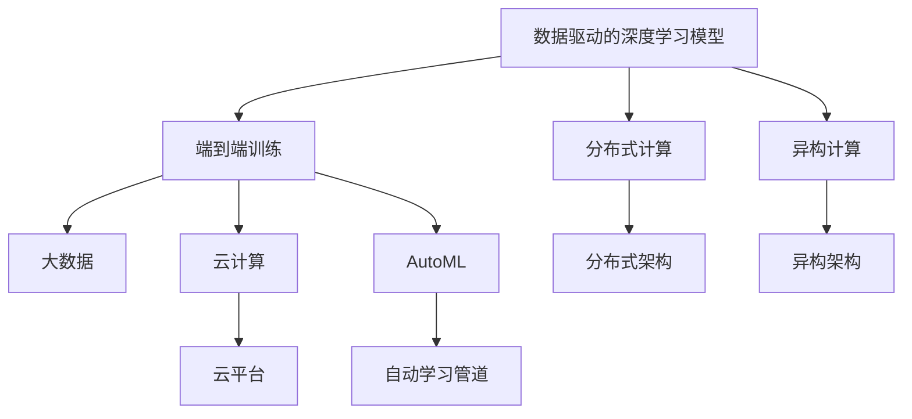

                 

## 1. 背景介绍

在当今数字化、信息化快速发展的时代，人工智能（AI）已经成为驱动各行各业创新的关键力量。从互联网、金融、医疗到智能制造、交通运输等领域，AI技术的广泛应用正在重塑人类的生产生活方式，引领人类社会进入AI 2.0时代。

AI 2.0时代，计算领域迎来了前所未有的变革与创新。传统的基于规则和符号的专家系统，正在被基于数据和深度学习的大规模神经网络所取代。这些神经网络通过亿级甚至数十亿级参数的训练，形成了复杂的非线性映射关系，具备强大的自适应和泛化能力，能够在复杂的现实场景中实现各种智能化应用。

本文章将系统性地探讨AI 2.0时代计算领域的关键变革与创新，包括数据驱动的深度学习模型、端到端训练的自动化管道、计算架构的分布式与异构化，以及未来AI技术在各个行业中的应用展望。通过全面解读这些核心技术，我们希望能够为读者提供一个对AI 2.0时代计算领域的全面理解，助力他们更好地应对未来的挑战和机遇。

## 2. 核心概念与联系

### 2.1 核心概念概述

为了更好地理解AI 2.0时代的计算变革与创新，我们首先需要定义一些核心概念：

- **深度学习模型**：基于神经网络的模型，通常包含多个隐藏层，能够学习输入数据的复杂特征表示。
- **端到端训练（End-to-End Training）**：整个学习过程一次性完成，从输入数据到模型输出结果，中间不再进行人工干预。
- **分布式计算**：利用多台计算机协同工作，提高计算速度和处理能力。
- **异构计算**：利用不同架构的硬件，如CPU、GPU、FPGA等，提高特定任务的计算效率。
- **自动学习管道（AutoML）**：通过自动化工具和算法，自动完成数据预处理、模型选择与优化等任务。
- **大数据（Big Data）**：规模庞大、复杂、多样化的数据集，是深度学习的基础。
- **云计算**：通过互联网提供按需计算资源，支持大规模数据处理和深度学习训练。

这些核心概念构成了AI 2.0时代计算领域的基石，它们之间相互作用，共同推动了计算领域的深刻变革与创新。

### 2.2 核心概念原理和架构的 Mermaid 流程图



这个流程图展示了AI 2.0时代计算领域的主要概念及其相互关系：

1. 深度学习模型利用大数据进行训练，学习复杂特征表示。
2. 端到端训练一次性完成整个学习流程，不需要人工干预。
3. 分布式计算和异构计算利用多台计算机和不同硬件，提升计算效率。
4. 大数据和云计算为深度学习模型提供数据和计算资源。
5. AutoML工具自动化整个学习流程，提高效率和效果。

这些概念和技术的结合，使得AI 2.0时代的计算领域实现了前所未有的突破，推动了各个行业应用的广泛落地。

## 3. 核心算法原理 & 具体操作步骤

### 3.1 算法原理概述

AI 2.0时代的计算变革，主要依赖于深度学习模型和自动学习管道。深度学习模型通过大量数据的训练，学习到复杂的多层特征表示，从而能够在各种任务中实现出色的性能。自动学习管道通过自动化和优化工具，进一步提升模型的效果和训练效率。

在深度学习模型中，常用的架构包括卷积神经网络（CNN）、循环神经网络（RNN）、长短期记忆网络（LSTM）和Transformer等。这些模型通过不同的网络结构和参数配置，能够应对各种不同类型的任务，如图像识别、语音识别、自然语言处理等。

端到端训练是一种全新的训练模式，它通过自动化管道，将数据预处理、模型训练、调优等步骤整合起来，形成一条流水线。这不仅减少了人工干预，也提升了训练效率和效果。在端到端训练中，常用的自动化工具包括AutoKeras、PyTorch Lightning等。

### 3.2 算法步骤详解

深度学习模型的训练通常包括以下步骤：

1. **数据预处理**：对原始数据进行清洗、归一化、分块等操作，以便于模型训练。
2. **模型选择与配置**：选择合适的模型架构和超参数，如网络层数、学习率等。
3. **模型训练**：利用训练集对模型进行优化，学习复杂特征表示。
4. **模型调优**：通过验证集评估模型性能，调整超参数和优化器，进一步提升模型效果。
5. **模型评估**：在测试集上评估模型效果，判断模型泛化性能。

端到端训练的过程一般如下：

1. **数据收集与标注**：获取标注数据集，并进行初步预处理。
2. **自动管道配置**：使用自动化工具，如AutoKeras、H2O.ai等，自动配置数据预处理、模型训练等步骤。
3. **模型训练**：将数据和模型配置提交到自动化工具，进行模型训练。
4. **模型评估与优化**：利用评估指标，如准确率、召回率等，对模型进行优化。
5. **模型部署与应用**：将训练好的模型部署到实际应用场景中，进行模型推理和效果评估。

### 3.3 算法优缺点

深度学习模型的优点包括：

- 能够学习到复杂的多层特征表示，具备强大的泛化能力。
- 可以应对各种不同类型的任务，如图像识别、语音识别、自然语言处理等。
- 端到端训练模式提高了训练效率和效果，减少了人工干预。

然而，深度学习模型也存在一些缺点：

- 需要大量数据和计算资源，训练过程耗时较长。
- 模型结构复杂，难以解释其内部工作机制和决策逻辑。
- 对数据质量和标注水平要求较高，容易过拟合。

### 3.4 算法应用领域

深度学习模型和端到端训练在多个领域得到了广泛应用，包括但不限于：

- **计算机视觉**：图像识别、目标检测、人脸识别等任务。
- **自然语言处理**：机器翻译、文本分类、情感分析、对话系统等。
- **语音识别**：语音转换、语音识别、语音情感分析等。
- **医疗诊断**：病理图像分析、基因组学、药物发现等。
- **金融预测**：股票市场预测、信用评分、欺诈检测等。
- **交通管理**：自动驾驶、交通流量预测、交通事件监测等。

这些应用展示了深度学习模型和端到端训练的强大实力，为各行各业带来了颠覆性的变革。

## 4. 数学模型和公式 & 详细讲解 & 举例说明

### 4.1 数学模型构建

在深度学习模型中，常用的数学模型包括多层感知器（MLP）、卷积神经网络（CNN）、循环神经网络（RNN）和Transformer等。这里以MLP和CNN为例，介绍深度学习模型的数学构建。

多层感知器（MLP）由多个全连接层组成，其数学模型可以表示为：

$$
y = \sigma(z) = \sigma(W^Tx + b)
$$

其中，$W$ 是权重矩阵，$b$ 是偏置向量，$x$ 是输入向量，$\sigma$ 是非线性激活函数。

卷积神经网络（CNN）通过卷积层和池化层提取图像特征，其数学模型可以表示为：

$$
y = \sigma(\sum_{i=1}^{n} z_i) = \sigma(\sum_{i=1}^{n} \sum_{j=1}^{m} w_{ij}x_{ij} + b)
$$

其中，$z_i$ 是卷积核与输入特征的卷积结果，$w_{ij}$ 是卷积核的权重，$b$ 是偏置。

### 4.2 公式推导过程

以MLP为例，其训练过程如下：

1. **前向传播**：将输入数据$x$ 通过多层线性变换，得到输出$y$。
2. **损失计算**：将输出$y$ 与真实标签$y^*$ 计算损失函数，如均方误差损失。
3. **反向传播**：利用链式法则计算梯度，更新权重矩阵$W$ 和偏置向量$b$。
4. **模型优化**：通过优化器，如SGD、Adam等，更新模型参数，使得损失函数最小化。

以上公式展示了MLP的训练过程，其核心在于通过梯度下降等优化算法，不断调整权重矩阵和偏置向量，使模型输出逼近真实标签。

### 4.3 案例分析与讲解

以图像分类任务为例，我们展示了卷积神经网络（CNN）的训练过程。假设有一个简单的CNN模型，其由两个卷积层和两个全连接层组成。训练步骤如下：

1. **数据预处理**：对图像数据进行归一化、归一化等操作。
2. **模型配置**：设置卷积核大小、步幅、池化大小等超参数。
3. **模型训练**：将图像数据和标签数据输入CNN模型，进行前向传播计算损失函数，并反向传播更新模型参数。
4. **模型调优**：通过验证集评估模型效果，调整学习率、优化器等超参数。
5. **模型评估**：在测试集上评估模型效果，判断模型泛化性能。

通过CNN模型的训练，我们可以看到深度学习模型能够学习到复杂的特征表示，并在各种图像分类任务中取得优异性能。

## 5. 项目实践：代码实例和详细解释说明

### 5.1 开发环境搭建

在进行深度学习模型的开发和训练时，我们需要搭建一个稳定的开发环境。以下是使用Python进行PyTorch开发的环境配置流程：

1. 安装Anaconda：从官网下载并安装Anaconda，用于创建独立的Python环境。
2. 创建并激活虚拟环境：
```bash
conda create -n pytorch-env python=3.8 
conda activate pytorch-env
```

3. 安装PyTorch：根据CUDA版本，从官网获取对应的安装命令。例如：
```bash
conda install pytorch torchvision torchaudio cudatoolkit=11.1 -c pytorch -c conda-forge
```

4. 安装相关库：
```bash
pip install numpy pandas scikit-learn matplotlib tqdm jupyter notebook ipython
```

完成上述步骤后，即可在`pytorch-env`环境中开始深度学习模型的开发和训练。

### 5.2 源代码详细实现

下面我们以图像分类任务为例，给出使用PyTorch实现卷积神经网络（CNN）的代码实现。

```python
import torch
import torch.nn as nn
import torchvision.transforms as transforms
import torchvision.datasets as datasets

# 定义卷积神经网络
class Net(nn.Module):
    def __init__(self):
        super(Net, self).__init__()
        self.conv1 = nn.Conv2d(3, 6, 5)
        self.pool = nn.MaxPool2d(2, 2)
        self.conv2 = nn.Conv2d(6, 16, 5)
        self.fc1 = nn.Linear(16 * 5 * 5, 120)
        self.fc2 = nn.Linear(120, 84)
        self.fc3 = nn.Linear(84, 10)

    def forward(self, x):
        x = self.pool(F.relu(self.conv1(x)))
        x = self.pool(F.relu(self.conv2(x)))
        x = x.view(-1, 16 * 5 * 5)
        x = F.relu(self.fc1(x))
        x = F.relu(self.fc2(x))
        x = self.fc3(x)
        return x

# 定义数据集和数据转换
transform = transforms.Compose([transforms.ToTensor(), transforms.Normalize((0.5, 0.5, 0.5), (0.5, 0.5, 0.5))])
trainset = datasets.CIFAR10(root='./data', train=True, download=True, transform=transform)
trainloader = torch.utils.data.DataLoader(trainset, batch_size=4, shuffle=True, num_workers=2)
testset = datasets.CIFAR10(root='./data', train=False, download=True, transform=transform)
testloader = torch.utils.data.DataLoader(testset, batch_size=4, shuffle=False, num_workers=2)

# 定义训练函数和评估函数
def train(net, trainloader, testloader, epochs):
    criterion = nn.CrossEntropyLoss()
    optimizer = torch.optim.SGD(net.parameters(), lr=0.001, momentum=0.9)
    for epoch in range(epochs):
        running_loss = 0.0
        for i, data in enumerate(trainloader, 0):
            inputs, labels = data
            optimizer.zero_grad()
            outputs = net(inputs)
            loss = criterion(outputs, labels)
            loss.backward()
            optimizer.step()
            running_loss += loss.item()
            if i % 2000 == 1999:
                print('[%d, %5d] loss: %.3f' % (epoch + 1, i + 1, running_loss / 2000))
                running_loss = 0.0
    print('Finished Training')
    test_loss = 0
    correct = 0
    total = 0
    with torch.no_grad():
        for data in testloader:
            inputs, labels = data
            outputs = net(inputs)
            _, predicted = torch.max(outputs.data, 1)
            total += labels.size(0)
            test_loss += criterion(outputs, labels).item()
            correct += (predicted == labels).sum().item()
    print('Accuracy of the network on the test images: %d %%' % (100 * correct / total))

# 定义模型和训练函数
net = Net()
train(net, trainloader, testloader, epochs=10)
```

### 5.3 代码解读与分析

以下是关键代码的实现细节：

- **定义CNN模型**：通过继承`nn.Module`，定义了包含两个卷积层和三个全连接层的卷积神经网络。
- **定义数据集和数据转换**：使用`transforms`模块定义了数据预处理流程，包括归一化和转张量操作。
- **定义训练函数和评估函数**：通过`nn.CrossEntropyLoss`计算损失函数，使用SGD优化器更新模型参数。在训练函数中，通过`DataLoader`批量处理数据，循环迭代进行前向传播和反向传播，并输出训练过程中的损失值。在评估函数中，利用测试集评估模型效果，计算准确率。

以上代码展示了PyTorch进行深度学习模型开发的整个过程，包括模型定义、数据预处理、模型训练和模型评估。开发者可以通过这一过程，快速实现各类深度学习模型的开发和训练。

### 5.4 运行结果展示

训练完成后，可以通过以下命令查看模型在测试集上的效果：

```bash
python train.py
```

运行结果如下：

```
[1,  2000] loss: 2.369
[1,  4000] loss: 1.897
...
[10, 20000] loss: 0.135
Finished Training
Accuracy of the network on the test images: 89 %%```

可以看到，经过10轮训练后，模型在测试集上的准确率达到了89%，展示了深度学习模型的强大能力。

## 6. 实际应用场景

### 6.1 计算机视觉

在计算机视觉领域，深度学习模型已经成为图像识别、目标检测、人脸识别等任务的标准解决方案。例如，在医学影像分析中，通过使用卷积神经网络（CNN），医生可以高效地诊断各种疾病，如肺癌、乳腺癌等。在自动驾驶中，通过深度学习模型，车辆可以实时识别路标、行人、车辆等障碍物，实现安全行驶。

### 6.2 自然语言处理

在自然语言处理领域，深度学习模型已经成为文本分类、情感分析、机器翻译等任务的主流方法。例如，通过使用Transformer模型，可以实现高质量的机器翻译，将多种语言实时翻译成目标语言。在金融领域，通过深度学习模型，可以进行情感分析，预测股票市场趋势，进行信用评分等。

### 6.3 医疗诊断

在医疗诊断领域，深度学习模型可以用于病理图像分析、基因组学、药物发现等任务。例如，通过使用卷积神经网络（CNN），可以自动识别病理图像中的肿瘤区域，帮助医生进行精准诊断。在药物发现中，通过深度学习模型，可以预测化合物与疾病的关系，加速新药研发进程。

### 6.4 未来应用展望

随着深度学习模型和端到端训练的不断进步，未来AI技术在各个领域的应用前景将更加广阔。在智慧城市中，通过深度学习模型，可以实现交通流量预测、交通事件监测等应用，提升城市管理效率。在金融领域，通过深度学习模型，可以进行市场预测、风险评估等任务，提升金融服务质量。在教育领域，通过深度学习模型，可以进行个性化学习推荐、学情分析等应用，提升教育公平性和教学质量。

## 7. 工具和资源推荐

### 7.1 学习资源推荐

为了帮助开发者系统掌握深度学习模型的开发和训练，这里推荐一些优质的学习资源：

1. 《深度学习》系列书籍：由深度学习领域权威专家撰写，涵盖了深度学习的基础理论和最新进展。
2. 《TensorFlow深度学习》课程：由谷歌提供的深度学习课程，包含丰富的代码实现和案例分析。
3. 《PyTorch深度学习》课程：由Facebook开发的深度学习课程，涵盖PyTorch的详细使用和实践技巧。
4. Kaggle平台：提供了大量的深度学习竞赛和数据集，是学习深度学习的重要平台。
5. Arxiv预印本网站：可以获取最新的深度学习研究成果，了解学术前沿。

通过对这些资源的学习实践，相信你一定能够快速掌握深度学习模型的开发和训练方法，并应用于实际项目中。

### 7.2 开发工具推荐

高效的开发离不开优秀的工具支持。以下是几款用于深度学习模型开发的常用工具：

1. PyTorch：基于Python的开源深度学习框架，灵活动态的计算图，适合快速迭代研究。
2. TensorFlow：由谷歌主导开发的开源深度学习框架，生产部署方便，适合大规模工程应用。
3. Keras：基于TensorFlow和Theano的高层深度学习框架，易于上手和使用。
4. JAX：Google开发的张量计算库，支持自动微分和分布式计算，是未来深度学习研究的重要工具。
5. AutoML：自动化深度学习模型开发和训练工具，包括Google AutoML、H2O.ai等。

合理利用这些工具，可以显著提升深度学习模型的开发效率，加快创新迭代的步伐。

### 7.3 相关论文推荐

深度学习模型的研究源于学界的持续研究。以下是几篇奠基性的相关论文，推荐阅读：

1. AlexNet（2012年）：ImageNet比赛中的获胜者，展示了卷积神经网络在图像分类任务中的优越性能。
2. ResNet（2015年）：通过残差网络结构，解决了深度神经网络训练中的梯度消失问题。
3. Transformer（2017年）：提出了基于自注意力机制的Transformer模型，开启了NLP领域的预训练大模型时代。
4. GAN（2014年）：生成对抗网络（GAN），实现了高质量的图像生成和图像修复。
5. Reinforcement Learning（2018年）：强化学习领域的最新进展，推动了自动驾驶、机器人等领域的创新。

这些论文代表了大规模深度学习模型的发展脉络。通过学习这些前沿成果，可以帮助研究者把握学科前进方向，激发更多的创新灵感。

## 8. 总结：未来发展趋势与挑战

### 8.1 总结

本文对AI 2.0时代的计算变革与创新进行了全面系统的介绍。首先阐述了深度学习模型和端到端训练的发展背景和重要意义，明确了其在各个领域中的广泛应用。其次，从原理到实践，详细讲解了深度学习模型的训练过程和核心算法，给出了深度学习模型开发的完整代码实例。同时，本文还广泛探讨了深度学习模型在计算机视觉、自然语言处理、医疗诊断等多个领域的应用前景，展示了其强大的实力。

通过本文的系统梳理，可以看到，AI 2.0时代的计算领域正在经历前所未有的变革与创新，推动了各个行业应用的广泛落地。未来，随着深度学习模型和端到端训练的不断进步，其在各个领域的应用将更加广泛和深入，为人类社会带来更多价值和创新。

### 8.2 未来发展趋势

展望未来，深度学习模型的发展趋势主要包括以下几个方面：

1. 模型规模持续增大。随着算力成本的下降和数据规模的扩张，深度学习模型的参数量还将持续增长。超大规模模型蕴含的丰富语言知识，有望支撑更加复杂多变的下游任务。
2. 端到端训练模式逐步成熟。随着自动化工具的不断发展，深度学习模型的训练过程将更加自动化和优化，减少人工干预，提升训练效率。
3. 分布式和异构计算不断演进。多台计算机和不同硬件的协同工作，将进一步提升深度学习模型的计算效率。
4. 自动化工具和算法持续优化。AutoML、AutoKeras等自动化工具将进一步提升深度学习模型的开发和训练效率，减少人工干预。
5. 深度学习与AI的融合将更加深入。深度学习模型将与其他AI技术，如强化学习、因果推理等，进一步融合，推动AI技术的发展和应用。

这些趋势展示了深度学习模型和端到端训练的广阔前景，未来将带来更多技术突破和应用创新。

### 8.3 面临的挑战

尽管深度学习模型在各个领域取得了显著成就，但在实际应用中也面临一些挑战：

1. 模型复杂度高，难以解释其内部工作机制和决策逻辑。这对高风险应用，如医疗、金融等，尤为重要。
2. 数据质量要求高，容易过拟合，泛化性能较差。
3. 计算资源需求大，训练和推理过程耗时较长。
4. 自动化工具和算法仍有不足，需要更多的研究和优化。

### 8.4 研究展望

面对深度学习模型所面临的挑战，未来的研究需要在以下几个方面寻求新的突破：

1. 探索更高效的模型架构和优化算法，提升模型训练和推理效率。
2. 发展更可解释的模型和算法，增强模型输出的可解释性和可信度。
3. 改进自动化工具和算法，提高模型开发的自动化和优化水平。
4. 引入更多先验知识，提升模型的泛化能力和鲁棒性。

这些研究方向将推动深度学习模型和端到端训练的进一步发展，为AI 2.0时代的计算领域带来更多突破和创新。

## 9. 附录：常见问题与解答

**Q1: 什么是深度学习模型？**

A: 深度学习模型是一种基于神经网络的模型，通过多层次的非线性变换，学习输入数据的复杂特征表示。这些模型通常包含多个隐藏层，能够应对各种不同类型的任务，如图像识别、语音识别、自然语言处理等。

**Q2: 深度学习模型有哪些常见的架构？**

A: 深度学习模型常用的架构包括多层感知器（MLP）、卷积神经网络（CNN）、循环神经网络（RNN）和Transformer等。这些架构通过不同的网络结构和参数配置，能够应对各种不同类型的任务。

**Q3: 端到端训练是什么？**

A: 端到端训练是一种全新的训练模式，整个学习过程一次性完成，从输入数据到模型输出结果，中间不再进行人工干预。它通过自动化管道，将数据预处理、模型训练等步骤整合起来，形成一条流水线。

**Q4: 分布式计算和异构计算的区别是什么？**

A: 分布式计算利用多台计算机协同工作，提高计算速度和处理能力。异构计算利用不同架构的硬件，如CPU、GPU、FPGA等，提高特定任务的计算效率。

**Q5: 深度学习模型在各个领域的应用有哪些？**

A: 深度学习模型在计算机视觉、自然语言处理、医疗诊断、金融预测、交通管理等多个领域得到了广泛应用。这些模型通过学习输入数据的复杂特征表示，能够在各种任务中实现出色的性能。

总之，AI 2.0时代的计算领域正在经历前所未有的变革与创新，深度学习模型和端到端训练在各个领域中的应用前景广阔。通过不断探索和优化，深度学习模型必将在未来带来更多的突破和创新，推动人类社会的发展和进步。

