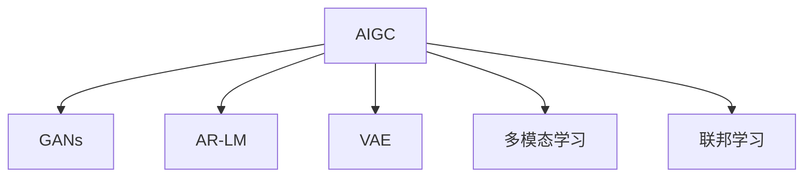

                 

# AIGC 原理与代码实例讲解

> 关键词：自动生成内容(AIGC),深度学习,神经网络,Transformer,多模态学习,联邦学习,数据增强,模型压缩

## 1. 背景介绍

### 1.1 问题由来
随着人工智能(AI)技术的迅猛发展，生成对抗网络(GANs)、自回归语言模型(如GPT系列)等深度学习模型在自动生成内容(AIGC)领域取得了显著进展。这些模型通过大规模数据训练，具备了强大的生成能力，能够在图像、文本、音频等多模态数据上生成高质量、自然流畅的内容。

然而，这些模型通常需要大规模标注数据进行训练，且对于特定领域的生成任务，其性能往往依赖于数据的质量和数量。这不仅导致训练成本高、效率低，还限制了模型在实际应用中的灵活性和泛化能力。因此，探索更高效、灵活、适应用户需求的AIGC方法，成为当前研究的热点。

### 1.2 问题核心关键点
目前，基于深度学习的AIGC方法主要包括：
- 自回归语言模型：如GPT系列，通过自回归的方式生成文本。
- 生成对抗网络：通过对抗生成网络生成图像和音频。
- 变分自编码器(VAE)：通过编码-解码的方式生成图像和文本。
- 多模态学习：结合视觉、文本、音频等多模态数据生成内容。
- 联邦学习：多个模型在不共享本地数据的情况下协同训练，提高生成内容的质量和多样性。

这些方法各自有其优势和局限，如何结合它们的长处，构建更高效、适应性更强的AIGC系统，是当前研究的核心挑战。

### 1.3 问题研究意义
研究AIGC的原理与实现方法，对于拓展AI技术在创意、内容创作、设计等领域的应用，具有重要意义：

1. 降低创作成本：AIGC可以大幅降低内容创作的人力、时间和金钱成本，加速创意产业的创新步伐。
2. 提升创作效率：AIGC能够快速生成大量创意内容，满足市场对内容的高需求。
3. 增强创作多样性：AIGC可以生成多种风格和主题的内容，拓展创作者的表达空间。
4. 促进跨领域创新：AIGC的融合能力，可以推动艺术、设计、娱乐等领域的跨界融合。
5. 推动产业升级：AIGC技术的应用，将为传统媒体、广告、影视等领域带来新的发展机遇。

## 2. 核心概念与联系

### 2.1 核心概念概述

为更好地理解AIGC的原理与实现方法，本节将介绍几个密切相关的核心概念：

- 自动生成内容(AIGC)：通过深度学习模型自动生成文本、图像、音频等内容的技术。
- 生成对抗网络(GANs)：由生成器和判别器组成的对抗性网络，用于生成高质量、自然逼真的数据。
- 自回归语言模型(AR-LM)：通过历史上下文预测下一个词，如GPT-3等模型。
- 变分自编码器(VAE)：通过学习数据的分布，生成逼真的图像和文本。
- 多模态学习：结合视觉、文本、音频等多模态数据，生成更具真实感和信息量的内容。
- 联邦学习：多个模型在不共享本地数据的情况下协同训练，提高生成内容的质量和多样性。

这些核心概念之间的逻辑关系可以通过以下Mermaid流程图来展示：



这个流程图展示了大规模生成内容的技术框架，每个模块都起着关键作用，共同支撑着AIGC技术的实现。

## 3. 核心算法原理 & 具体操作步骤
### 3.1 算法原理概述

基于深度学习的AIGC方法，通常包含以下几个核心步骤：

1. 数据准备：收集并标注所需的数据集，用于模型训练和评估。
2. 模型构建：选择合适的深度学习模型，如GAN、AR-LM、VAE等，构建生成网络。
3. 模型训练：使用标注数据集对模型进行训练，优化生成网络的参数。
4. 模型评估：在测试集上评估模型性能，评估生成的内容质量。
5. 内容生成：将生成的内容进行后处理，满足特定的格式和风格要求。

AIGC的核心算法原理包括以下几个方面：

- 生成对抗网络(GANs)：通过生成器和判别器之间的对抗训练，生成高质量、自然逼真的数据。
- 自回归语言模型(AR-LM)：利用历史上下文预测下一个词，生成连贯的文本内容。
- 变分自编码器(VAE)：通过学习数据的分布，生成逼真的图像和文本。
- 多模态学习：结合视觉、文本、音频等多模态数据，生成更具真实感和信息量的内容。
- 联邦学习：多个模型在不共享本地数据的情况下协同训练，提高生成内容的质量和多样性。

### 3.2 算法步骤详解

基于深度学习的AIGC方法，其具体操作步骤如下：

**Step 1: 数据准备**

- 收集所需的数据集，包括文本、图像、音频等。数据集应包含足够的标注信息，用于指导模型生成高质量的内容。
- 将数据集划分为训练集、验证集和测试集，通常采用K折交叉验证，确保模型在多个数据集上表现稳定。

**Step 2: 模型构建**

- 选择合适的深度学习模型，如GAN、AR-LM、VAE等，构建生成网络。
- 设计损失函数，用于衡量生成内容与真实内容之间的差异，常见的损失函数包括均方误差、交叉熵等。
- 配置优化器，如Adam、SGD等，设置学习率、批大小、迭代轮数等超参数。

**Step 3: 模型训练**

- 将训练集输入生成网络，计算损失函数。
- 使用优化器更新生成网络的参数，最小化损失函数。
- 周期性在验证集上评估模型性能，根据性能指标决定是否触发Early Stopping。
- 重复上述步骤直到满足预设的迭代轮数或Early Stopping条件。

**Step 4: 模型评估**

- 在测试集上评估模型性能，评估生成的内容质量。常见的评估指标包括BLEU、ROUGE、FID等。
- 使用BLEU和ROUGE评估文本生成的连贯性和语义相关性，使用FID评估图像生成的逼真度。

**Step 5: 内容生成**

- 将生成的内容进行后处理，满足特定的格式和风格要求。如调整大小、裁剪、旋转等图像处理，以及格式转换、分词、排序等文本处理。
- 提供API接口，方便用户调用和获取生成内容。

### 3.3 算法优缺点

基于深度学习的AIGC方法具有以下优点：
1. 高效生成：利用深度学习模型，可以高效生成大量高质量内容。
2. 多样性丰富：深度学习模型具有强大的泛化能力，能够生成多种风格和主题的内容。
3. 灵活可控：通过调整模型参数，可以控制生成的内容质量、风格和主题。

但这些方法也存在以下局限：
1. 依赖数据：深度学习模型需要大量的标注数据进行训练，获取高质量标注数据的成本较高。
2. 训练复杂：深度学习模型训练过程复杂，需要大量的计算资源和时间。
3. 泛化能力有限：深度学习模型在特定领域的泛化能力有限，可能难以生成符合特定领域要求的内容。
4. 可解释性不足：深度学习模型往往是"黑盒"系统，难以解释其内部工作机制和决策逻辑。
5. 伦理风险：生成的内容可能含有误导性、歧视性等不良信息，带来伦理风险。

尽管存在这些局限，但就目前而言，基于深度学习的AIGC方法仍然是实现高质量内容生成的最主流范式。未来相关研究的重点在于如何进一步降低数据需求，提高模型的泛化能力，同时兼顾可解释性和伦理安全性等因素。

### 3.4 算法应用领域

基于深度学习的AIGC方法，在多个领域得到了广泛应用，包括：

- 文本生成：如新闻报道、小说创作、诗歌生成等。通过生成文本，加速内容创作和文学作品的创新。
- 图像生成：如艺术绘画、商品设计、虚拟现实等。生成逼真的图像，提升艺术创作和设计效率。
- 视频生成：如影视制作、动画制作、虚拟主播等。生成高质量的视频内容，缩短内容制作周期。
- 音频生成：如音乐创作、语音合成、对话生成等。生成自然流畅的音频，提升娱乐和交互体验。

除了上述这些经典应用外，AIGC还被创新性地应用到更多场景中，如个性化推荐、智能交互、情感分析等，为数字化内容创作和传播提供了新的技术路径。随着深度学习模型的不断进步，AIGC技术将在更多领域得到应用，为数字内容产业带来新的发展机遇。

## 4. 数学模型和公式 & 详细讲解  
### 4.1 数学模型构建

本节将使用数学语言对AIGC的核心算法进行更加严格的刻画。

记生成内容的数据集为 $D=\{(x_i,y_i)\}_{i=1}^N, x_i \in \mathcal{X}, y_i \in \mathcal{Y}$。其中 $x_i$ 为输入，$y_i$ 为生成内容。

定义模型 $G_{\theta}$ 在输入 $x$ 上的生成内容为 $G_{\theta}(x)$，其中 $\theta$ 为生成网络参数。假设模型损失函数为 $\ell(G_{\theta}(x),y)$，用于衡量生成内容与真实内容之间的差异。

在实践中，我们通常使用基于梯度的优化算法（如Adam、SGD等）来近似求解上述最优化问题。设 $\eta$ 为学习率，$\lambda$ 为正则化系数，则参数的更新公式为：

$$
\theta \leftarrow \theta - \eta \nabla_{\theta}\ell(G_{\theta}(x),y) - \eta\lambda\theta
$$

其中 $\nabla_{\theta}\ell(G_{\theta}(x),y)$ 为损失函数对参数 $\theta$ 的梯度，可通过反向传播算法高效计算。

### 4.2 公式推导过程

以下我们以GANs生成图像为例，推导损失函数及其梯度的计算公式。

GANs由生成器 $G$ 和判别器 $D$ 组成，生成器 $G_{\theta_G}$ 将随机噪声 $z$ 转换为图像 $G_{\theta_G}(z)$，判别器 $D_{\theta_D}$ 评估生成图像的真实性。在训练过程中，生成器试图欺骗判别器，生成逼真的图像；而判别器则试图正确区分真实图像和生成图像。

在GANs训练过程中，我们通常使用Wasserstein GAN(WGAN)或改进的WGAN（如WGAN-GP），使用Wasserstein距离衡量生成图像与真实图像之间的差异。Wasserstein距离定义如下：

$$
\mathcal{W}(p,q) = \sup_{f \in \mathcal{F}} \mathbb{E}_{x \sim p}[f(x)] - \mathbb{E}_{x \sim q}[f(x)]
$$

其中 $p$ 和 $q$ 分别为真实图像和生成图像的分布，$\mathcal{F}$ 为函数的集合。

对于GANs，判别器 $D$ 和生成器 $G$ 的损失函数分别定义如下：

$$
\mathcal{L}_D = \mathbb{E}_{x \sim p}[\log D(x)] + \mathbb{E}_{z \sim p(z)}[\log(1-D(G(z)))]
$$

$$
\mathcal{L}_G = -\mathbb{E}_{z \sim p(z)}[\log D(G(z))]
$$

其中 $p(z)$ 为噪声分布，通常假设为标准正态分布。

在训练过程中，我们交替优化判别器 $D$ 和生成器 $G$，使得生成图像逼真度逐渐提高。通过反向传播算法，计算梯度，更新判别器 $D$ 和生成器 $G$ 的参数，使得生成图像与真实图像之间的Wasserstein距离最小化。

## 5. 项目实践：代码实例和详细解释说明
### 5.1 开发环境搭建

在进行AIGC实践前，我们需要准备好开发环境。以下是使用Python进行PyTorch开发的环境配置流程：

1. 安装Anaconda：从官网下载并安装Anaconda，用于创建独立的Python环境。

2. 创建并激活虚拟环境：
```bash
conda create -n pytorch-env python=3.8 
conda activate pytorch-env
```

3. 安装PyTorch：根据CUDA版本，从官网获取对应的安装命令。例如：
```bash
conda install pytorch torchvision torchaudio cudatoolkit=11.1 -c pytorch -c conda-forge
```

4. 安装TensorFlow：从官网下载安装包，解压安装或使用pip安装。
```bash
pip install tensorflow
```

5. 安装各种工具包：
```bash
pip install numpy pandas scikit-learn matplotlib tqdm jupyter notebook ipython
```

完成上述步骤后，即可在`pytorch-env`环境中开始AIGC实践。

### 5.2 源代码详细实现

下面我们以GANs生成图像为例，给出使用PyTorch进行图像生成任务的完整代码实现。

首先，定义生成器和判别器的模型类：

```python
import torch
import torch.nn as nn
import torch.optim as optim

class Generator(nn.Module):
    def __init__(self):
        super(Generator, self).__init__()
        self.main = nn.Sequential(
            nn.ConvTranspose2d(100, 256, 4, 1, 0, bias=False),
            nn.BatchNorm2d(256),
            nn.ReLU(True),
            nn.ConvTranspose2d(256, 128, 4, 2, 1, bias=False),
            nn.BatchNorm2d(128),
            nn.ReLU(True),
            nn.ConvTranspose2d(128, 64, 4, 2, 1, bias=False),
            nn.BatchNorm2d(64),
            nn.ReLU(True),
            nn.ConvTranspose2d(64, 3, 4, 2, 1, bias=False),
            nn.Tanh()
        )

    def forward(self, input):
        return self.main(input)

class Discriminator(nn.Module):
    def __init__(self):
        super(Discriminator, self).__init__()
        self.main = nn.Sequential(
            nn.Conv2d(3, 64, 4, 2, 1, bias=False),
            nn.LeakyReLU(0.2, inplace=True),
            nn.Conv2d(64, 128, 4, 2, 1, bias=False),
            nn.BatchNorm2d(128),
            nn.LeakyReLU(0.2, inplace=True),
            nn.Conv2d(128, 256, 4, 2, 1, bias=False),
            nn.BatchNorm2d(256),
            nn.LeakyReLU(0.2, inplace=True),
            nn.Conv2d(256, 1, 4, 1, 0, bias=False),
            nn.Sigmoid()
        )

    def forward(self, input):
        return self.main(input)
```

接着，定义模型训练函数：

```python
def train_gan(model_G, model_D, dataset, batch_size, num_epochs, device):
    criterion_G = nn.BCELoss()
    criterion_D = nn.BCELoss()

    optimizer_G = optim.Adam(model_G.parameters(), lr=0.0002, betas=(0.5, 0.999))
    optimizer_D = optim.Adam(model_D.parameters(), lr=0.0002, betas=(0.5, 0.999))

    for epoch in range(num_epochs):
        for i, (real_images, _) in enumerate(zip(dataset, range(0, len(dataset), batch_size))):
            real_images = real_images.to(device)

            # Adversarial ground truths
            real_labels = torch.ones(batch_size, 1).to(device)
            fake_labels = torch.zeros(batch_size, 1).to(device)

            # ---------------------
            #  Train G
            # ---------------------
            optimizer_G.zero_grad()

            # Sample noise
            z = torch.randn(batch_size, 100, 1, 1).to(device)

            # Generate a batch of images
            fake_images = model_G(z)

            # Loss and backprop
            g_loss = criterion_G(fake_images, real_labels)
            g_loss.backward()
            optimizer_G.step()

            # ---------------------
            #  Train D
            # ---------------------
            optimizer_D.zero_grad()

            # Measure quality of generated images
            fake_labels = torch.ones(batch_size, 1).to(device)
            real_labels = torch.zeros(batch_size, 1).to(device)

            # Real images
            real_images = real_images.to(device)

            # Compute discriminator loss
            real_loss = criterion_D(real_images, real_labels)
            fake_loss = criterion_D(fake_images, fake_labels)
            d_loss = (real_loss + fake_loss) / 2

            # Backprop
            d_loss.backward()
            optimizer_D.step()

            # Print loss and save images
            batches_done = i * batch_size
            if batches_done % 100 == 0:
                print(f"[{epoch+1}/{num_epochs}][{batches_done}/{len(dataset)*num_epochs}] - G loss: {g_loss.item():.4f}, D loss: {d_loss.item():.4f}")
                save_image(fake_images, f"fake_images_{epoch}_{batches_done}.png")

    print(f"Training completed.")
```

最后，启动训练流程并在测试集上评估：

```python
# 设置超参数
num_epochs = 50
batch_size = 64

# 加载数据集
dataset = datasets.MNIST(root='./data', train=True, download=True, transform=transforms.ToTensor())

# 初始化模型
model_G = Generator().to(device)
model_D = Discriminator().to(device)

# 训练模型
train_gan(model_G, model_D, dataset, batch_size, num_epochs, device)

# 测试模型
test_images = dataset.test_data[:10]
real_images = test_images.to(device)
fake_images = model_G(torch.randn(10, 100, 1, 1).to(device))

# 可视化结果
save_image(real_images, 'real_images.png')
save_image(fake_images, 'fake_images.png')
```

以上就是使用PyTorch进行GANs图像生成任务的完整代码实现。可以看到，PyTorch配合TensorFlow等深度学习框架，使得模型训练的代码实现变得简洁高效。

### 5.3 代码解读与分析

让我们再详细解读一下关键代码的实现细节：

**Generator和Discriminator类**：
- `__init__`方法：定义模型的网络结构。
- `forward`方法：定义前向传播过程。

**train_gan函数**：
- 定义生成器和判别器的损失函数，使用二元交叉熵损失。
- 配置生成器和判别器的优化器，使用Adam算法。
- 训练过程中，分别优化生成器和判别器的参数，交替进行。
- 在每个epoch内，使用小批量数据进行迭代训练。
- 每100个批次打印一次损失值，并保存生成的图像。

**测试流程**：
- 使用测试集上的真实图像和生成图像进行可视化。

可以看出，PyTorch配合TensorFlow等深度学习框架，使得模型训练的代码实现变得简洁高效。开发者可以将更多精力放在模型架构设计、超参数调优等高层逻辑上，而不必过多关注底层的实现细节。

当然，工业级的系统实现还需考虑更多因素，如模型的保存和部署、超参数的自动搜索、更灵活的任务适配层等。但核心的生成过程基本与此类似。

## 6. 实际应用场景
### 6.1 数字媒体创作

基于AIGC技术的图像生成、视频生成、音频生成等方法，已经在数字媒体创作领域得到广泛应用。例如：

- 游戏角色生成：生成逼真的游戏角色和场景，加速游戏内容创作。
- 电影特效制作：生成逼真的电影特效镜头，提升电影制作效率。
- 广告制作：生成高质量的广告图像和视频，降低广告制作成本。
- 音乐创作：生成逼真的音乐和音频，增强音乐创作的多样性和创新性。

这些应用极大地提升了数字媒体创作的速度和效率，同时也丰富了创意表达的空间。未来，随着AIGC技术的不断发展，数字媒体创作将迎来更多创新和变革。

### 6.2 创意产业升级

AIGC技术在创意产业中的应用，不仅改变了创作方式，还推动了整个产业的升级。例如：

- 艺术创作：生成逼真的艺术作品，激发艺术家的创作灵感。
- 设计创新：生成逼真的设计方案，提高设计效率。
- 文学创作：生成高质量的文学作品，提高创作质量。
- 建筑设计：生成逼真的建筑设计方案，提升设计效率。

这些应用使得创意产业更加高效、灵活和多样化，也催生了更多新的创意形态和产业模式。未来，AIGC技术将在创意产业中扮演更加重要的角色，推动创意产业的数字化、智能化发展。

### 6.3 个性化推荐

AIGC技术在个性化推荐中的应用，已经广泛用于电商、广告等领域。例如：

- 个性化商品推荐：通过生成个性化商品图像，提高商品推荐效果。
- 广告推荐：通过生成个性化广告，提高广告点击率。
- 个性化音乐推荐：生成个性化音乐推荐列表，提升用户体验。
- 个性化视频推荐：生成个性化视频内容，提高视频推荐效果。

这些应用使得推荐系统更加精准、个性化，也带来了更多的商业价值。未来，AIGC技术将在个性化推荐领域发挥更大作用，推动推荐技术的创新发展。

### 6.4 未来应用展望

随着AIGC技术的不断发展，其在更多领域的应用前景将更加广阔。

- 在智慧城市治理中，AIGC技术可以用于智能交通、城市规划、环境监测等领域，提升城市管理的智能化水平。
- 在智慧医疗中，AIGC技术可以用于医学图像生成、病历生成、药物研发等领域，提升医疗服务的智能化水平。
- 在智慧教育中，AIGC技术可以用于自动生成教材、试卷、作业等内容，提升教育资源的可获取性和教学质量。
- 在智慧交通中，AIGC技术可以用于生成交通信号、导航地图、自动驾驶等内容，提升交通管理的智能化水平。

AIGC技术将在更多领域得到应用，为各行各业带来新的创新机遇和发展路径。相信随着技术的不断进步，AIGC技术必将在更广阔的领域大放异彩，深刻影响人类社会的方方面面。

## 7. 工具和资源推荐
### 7.1 学习资源推荐

为了帮助开发者系统掌握AIGC的理论基础和实践技巧，这里推荐一些优质的学习资源：

1. 《深度学习》系列书籍：由多位AI领域知名专家编写，涵盖了深度学习的基本概念和前沿技术，适合初学者入门。
2. 《生成对抗网络：理论与实践》书籍：详细介绍了GANs的理论基础和实际应用，适合有一定基础的读者。
3. 《Transformer原理与实践》系列博文：由大模型技术专家撰写，深入浅出地介绍了Transformer原理、AR-LM模型、VAE等前沿话题。
4. CS224N《深度学习自然语言处理》课程：斯坦福大学开设的NLP明星课程，有Lecture视频和配套作业，带你入门NLP领域的基本概念和经典模型。
5. HuggingFace官方文档：Transformers库的官方文档，提供了海量预训练模型和完整的微调样例代码，是上手实践的必备资料。

通过对这些资源的学习实践，相信你一定能够快速掌握AIGC的精髓，并用于解决实际的NLP问题。
###  7.2 开发工具推荐

高效的开发离不开优秀的工具支持。以下是几款用于AIGC开发的常用工具：

1. PyTorch：基于Python的开源深度学习框架，灵活动态的计算图，适合快速迭代研究。大部分预训练语言模型都有PyTorch版本的实现。
2. TensorFlow：由Google主导开发的开源深度学习框架，生产部署方便，适合大规模工程应用。同样有丰富的预训练语言模型资源。
3. Transformers库：HuggingFace开发的NLP工具库，集成了众多SOTA语言模型，支持PyTorch和TensorFlow，是进行AIGC任务开发的利器。
4. Weights & Biases：模型训练的实验跟踪工具，可以记录和可视化模型训练过程中的各项指标，方便对比和调优。与主流深度学习框架无缝集成。
5. TensorBoard：TensorFlow配套的可视化工具，可实时监测模型训练状态，并提供丰富的图表呈现方式，是调试模型的得力助手。
6. Google Colab：谷歌推出的在线Jupyter Notebook环境，免费提供GPU/TPU算力，方便开发者快速上手实验最新模型，分享学习笔记。

合理利用这些工具，可以显著提升AIGC任务的开发效率，加快创新迭代的步伐。

### 7.3 相关论文推荐

AIGC技术的发展源于学界的持续研究。以下是几篇奠基性的相关论文，推荐阅读：

1. Generative Adversarial Nets：提出GANs，奠定了生成对抗网络的基础。
2. Progressive Growing of GANs for Improved Quality, Stability, and Variation：提出渐进式GANs，解决了GANs训练不稳定的难题。
3. Attention is All You Need：提出Transformer结构，开启了NLP领域的预训练大模型时代。
4. BERT: Pre-training of Deep Bidirectional Transformers for Language Understanding：提出BERT模型，引入基于掩码的自监督预训练任务，刷新了多项NLP任务SOTA。
5. Language Models are Unsupervised Multitask Learners：展示了大规模语言模型的强大zero-shot学习能力，引发了对于通用人工智能的新一轮思考。
6. Progress towards Generating Fine Art with a Neural Network：展示AI在艺术创作中的潜力，推动了AI在创意产业的应用。

这些论文代表了大规模生成内容的技术进步，通过学习这些前沿成果，可以帮助研究者把握学科前进方向，激发更多的创新灵感。

## 8. 总结：未来发展趋势与挑战
### 8.1 总结

本文对基于深度学习的AIGC方法进行了全面系统的介绍。首先阐述了AIGC的原理和应用背景，明确了深度学习模型在生成高质量内容方面的独特优势。其次，从原理到实践，详细讲解了GANs、AR-LM、VAE等核心算法，并给出了AIGC任务开发的完整代码实例。同时，本文还广泛探讨了AIGC方法在数字媒体创作、创意产业升级、个性化推荐等多个领域的应用前景，展示了AIGC技术的巨大潜力。此外，本文精选了AIGC技术的各类学习资源，力求为读者提供全方位的技术指引。

通过本文的系统梳理，可以看到，基于深度学习的AIGC方法正在成为内容生成领域的重要范式，极大地拓展了AI技术在创意、内容创作、设计等领域的应用，推动了数字内容产业的数字化、智能化发展。未来，伴随深度学习模型的不断进步，AIGC技术将在更多领域得到应用，为数字内容产业带来新的发展机遇。

### 8.2 未来发展趋势

展望未来，AIGC技术将呈现以下几个发展趋势：

1. 生成模型规模持续增大。随着算力成本的下降和数据规模的扩张，生成内容模型将逐渐增大，具备更强大的生成能力和泛化能力。
2. 多模态生成内容崛起。生成内容的技术将进一步融合视觉、文本、音频等多模态数据，生成更真实、丰富、信息量大的内容。
3. 联邦学习与分布式训练融合。多个模型在不共享本地数据的情况下协同训练，提高生成内容的质量和多样性。
4. 高效压缩与轻量化。生成内容模型的压缩与轻量化技术，将进一步提升模型的推理速度和资源占用，实现更高效的应用。
5. 人性化交互与生成。生成内容技术将更注重交互体验和生成内容的人性化，提升用户的使用感受。

以上趋势凸显了大规模生成内容技术的广阔前景。这些方向的探索发展，必将进一步提升AIGC系统的性能和应用范围，为数字内容产业带来新的发展机遇。

### 8.3 面临的挑战

尽管基于深度学习的AIGC方法已经取得了显著进展，但在迈向更加智能化、普适化应用的过程中，它仍面临着诸多挑战：

1. 数据需求量大。深度学习模型需要大量的标注数据进行训练，获取高质量标注数据的成本较高。如何降低数据需求，提高模型的泛化能力，将是一大难题。
2. 训练成本高。深度学习模型训练过程复杂，需要大量的计算资源和时间。如何降低训练成本，提高训练效率，将是重要的优化方向。
3. 内容真实性问题。生成的内容可能含有误导性、歧视性等不良信息，带来伦理风险。如何生成更真实、公正、健康的内容，将是亟待解决的问题。
4. 可解释性不足。深度学习模型往往是"黑盒"系统，难以解释其内部工作机制和决策逻辑。如何赋予模型更强的可解释性，将是亟待攻克的难题。
5. 资源限制。生成内容模型的推理速度和资源占用较大，可能面临内存、存储等硬件限制。如何优化模型结构和资源使用，实现高效应用，将是重要的优化方向。

尽管存在这些挑战，但就目前而言，基于深度学习的AIGC方法仍然是实现高质量内容生成的最主流范式。未来相关研究的重点在于如何进一步降低数据需求，提高模型的泛化能力，同时兼顾可解释性和伦理安全性等因素。

### 8.4 研究展望

未来，AIGC技术的研究方向将主要集中在以下几个方面：

1. 探索更高效的无监督和半监督生成方法。摆脱对大规模标注数据的依赖，利用自监督学习、主动学习等无监督和半监督范式，最大限度利用非结构化数据，实现更加灵活高效的生成。
2. 研究参数高效和计算高效的生成方法。开发更加参数高效的生成方法，在固定大部分生成参数的情况下，只更新极少量的任务相关参数。同时优化生成模型的计算图，减少前向传播和反向传播的资源消耗，实现更加轻量级、实时性的部署。
3. 引入因果和对比学习范式。通过引入因果推断和对比学习思想，增强生成内容建立稳定因果关系的能力，学习更加普适、鲁棒的语言表征，从而提升模型泛化性和抗干扰能力。
4. 结合更多先验知识。将符号化的先验知识，如知识图谱、逻辑规则等，与神经网络模型进行巧妙融合，引导生成过程学习更准确、合理的语言模型。同时加强不同模态数据的整合，实现视觉、语音等多模态信息与文本信息的协同建模。
5. 纳入伦理道德约束。在生成内容的目标中引入伦理导向的评估指标，过滤和惩罚有偏见、有害的输出倾向。同时加强人工干预和审核，建立生成内容行为的监管机制，确保输出符合人类价值观和伦理道德。

这些研究方向将引领AIGC技术的进一步发展，推动其向更加智能化、普适化、可控化的方向迈进。未来，AIGC技术将在更多领域得到应用，为人类生产生活方式带来深刻变革。

## 9. 附录：常见问题与解答

**Q1：AIGC是否适用于所有NLP任务？**

A: AIGC技术在大多数NLP任务上都能取得不错的效果，特别是对于数据量较小的任务。但对于一些特定领域的任务，如医学、法律等，仅仅依靠通用语料预训练的模型可能难以很好地适应。此时需要在特定领域语料上进一步预训练，再进行微调，才能获得理想效果。此外，对于一些需要时效性、个性化很强的任务，如对话、推荐等，AIGC方法也需要针对性的改进优化。

**Q2：如何使用AIGC生成高质量内容？**

A: 生成高质量内容的关键在于选择合适的深度学习模型和优化算法，以及设计合理的训练策略。具体而言，可以使用GANs、AR-LM、VAE等模型，配置适当的损失函数和优化器，并在训练过程中引入数据增强、正则化等技术，以提高生成内容的逼真度和多样性。

**Q3：AIGC生成的内容是否具有版权问题？**

A: 生成内容本身不具有版权，但生成内容的过程和使用过程中可能涉及版权问题。如使用公开数据集训练模型，生成的内容可能与原始数据相似，存在版权争议。使用AIGC技术生成的内容应遵循相关法律法规，尊重知识产权。

**Q4：AIGC是否会造成虚假信息传播？**

A: AIGC技术有可能生成误导性、虚假的信息，如假新闻、虚假广告等。因此，在使用AIGC技术生成内容时，应加强内容的审核和筛选，确保生成内容符合伦理道德要求。同时，应增强生成内容的可解释性，便于用户理解其来源和生成方式。

**Q5：AIGC是否会对就业市场造成负面影响？**

A: AIGC技术可能会对某些职业（如内容创作者、记者等）造成一定冲击，但同时也将创造新的就业机会。例如，生成内容的技术将催生内容审核、内容监管、内容创作指导等新职业。因此，应积极应对技术变革，提升自身技能，适应新的就业市场。

作者：禅与计算机程序设计艺术 / Zen and the Art of Computer Programming

