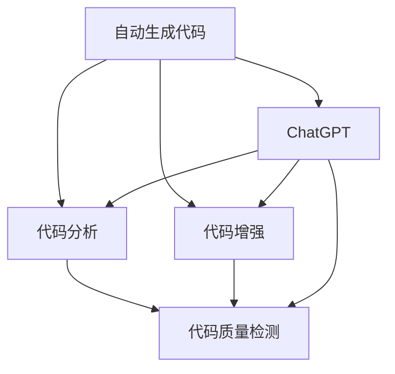

                 

# AIGC从入门到实战：利用 ChatGPT 分析和跟踪算法代码，让它帮你探路

> 关键词：
- 自动生成代码(Auto-code Generation)
- 算法性能分析(Algorithm Performance Analysis)
- 代码追踪(Code Tracking)
- ChatGPT
- 代码增强(Code Augmentation)
- 代码质量检测(Code Quality Detection)
- 编程助手(Programming Assistant)

## 1. 背景介绍

### 1.1 问题由来
随着人工智能(AI)技术的快速发展，自动化生成代码(AIGC)已经成为软件开发领域的重要趋势。AI驱动的自动代码生成技术，不仅能够加速软件开发，提升代码质量，还能促进团队协作，减少人为错误。然而，自动生成的代码通常存在精度不高、易错率高的问题，亟需通过有效的分析和跟踪手段进行优化。

此外，为了提升代码质量和编程效率，开发者往往需要利用多种工具进行代码分析和增强。然而，面对海量的代码库和复杂的分析需求，手动查找、筛选和评估代码无疑是一个费时费力且容易出错的过程。如何构建一个能够自动进行代码分析和增强的编程助手，成为当前AI和软件开发领域亟需解决的问题。

### 1.2 问题核心关键点
自动生成代码、代码分析和增强等任务，其核心目标在于提高代码质量和开发效率。为了实现这一目标，基于大语言模型的AIGC技术逐渐崭露头角。而ChatGPT作为当前最为流行的大模型之一，具备强大的自然语言处理能力，可以用于生成、分析和跟踪代码，构建高效的编程助手。本文将围绕ChatGPT的这些应用进行深入探讨，并提出基于ChatGPT的代码分析和增强方法。

### 1.3 问题研究意义
研究ChatGPT在代码生成、分析和增强中的应用，对于提升软件开发效率、降低人为错误、提高代码质量具有重要意义：

1. **加速开发进程**：通过自动生成代码，减少手动编码的重复劳动，提升开发速度。
2. **提升代码质量**：通过代码分析和增强，识别和修复潜在缺陷，提升代码可读性、可维护性和可扩展性。
3. **促进协作**：统一的编程助手工具，使不同团队的开发者能够更容易地理解和维护代码库。
4. **降低开发成本**：减少手动调试和测试的工作量，提升开发效率，降低时间和人力成本。
5. **提高开发安全性**：自动检测和修复代码中的潜在安全漏洞，提升系统的安全性。

## 2. 核心概念与联系

### 2.1 核心概念概述

为更好地理解ChatGPT在代码生成、分析和增强中的应用，本节将介绍几个密切相关的核心概念：

- **自动生成代码(Auto-code Generation)**：指通过算法和模型自动生成符合特定需求的代码片段或完整代码，通常用于提高开发效率和降低人为错误。
- **代码分析(Code Analysis)**：对代码进行语法、语义和结构的分析，旨在发现和修复潜在的错误和漏洞，提升代码质量和可读性。
- **代码增强(Code Augmentation)**：通过添加注释、优化结构等方式，提升代码的可维护性和可扩展性，增强代码质量。
- **编程助手(Programming Assistant)**：基于AI或ML模型的编程工具，能够提供代码生成、分析和增强等功能，帮助开发者提升工作效率。
- **ChatGPT**：OpenAI开发的大语言模型，能够理解和生成自然语言，具备强大的文本处理能力，适用于代码生成、分析和增强等任务。
- **代码质量检测(Code Quality Detection)**：通过自动化工具和模型检测代码质量，识别潜在问题，如代码重复、死码、错误等。

这些核心概念之间的逻辑关系可以通过以下Mermaid流程图来展示：



这个流程图展示了自动生成代码、代码分析、代码增强、代码质量检测等任务，以及它们如何通过ChatGPT进行高效实现。

## 3. 核心算法原理 & 具体操作步骤
### 3.1 算法原理概述

基于ChatGPT的代码生成、分析和增强方法，主要基于以下原理：

1. **自动生成代码**：利用ChatGPT强大的自然语言处理能力，通过编程语言的语法和语义规则，自动生成符合特定需求的代码片段或完整代码。
2. **代码分析**：将代码作为输入，通过ChatGPT进行语法、语义和结构的分析，识别潜在的错误和漏洞。
3. **代码增强**：在代码分析的基础上，利用ChatGPT生成添加注释、优化结构等增强代码的建议。
4. **代码质量检测**：通过ChatGPT对代码进行质量评估，识别代码重复、死码、错误等潜在问题。

### 3.2 算法步骤详解

以下是利用ChatGPT进行代码生成、分析和增强的具体操作步骤：

**Step 1: 准备数据和环境**
- 收集目标任务的代码库，准备测试数据集。
- 确保ChatGPT模型和相关API的可用性，搭建开发环境。

**Step 2: 代码生成**
- 使用ChatGPT模型生成符合需求的新代码片段。
- 可以通过设置提示词(prompt)来引导ChatGPT生成特定功能的代码，例如：“请生成一个简单的JavaScript函数，实现两个数字的求和。”

**Step 3: 代码分析**
- 将代码作为输入，使用ChatGPT进行语法和语义分析。
- 通过模型输出识别代码中的错误、漏洞和潜在问题，例如：“请分析以下Python代码的语法错误。”

**Step 4: 代码增强**
- 在代码分析的基础上，使用ChatGPT生成代码增强的建议，例如：“请为以下代码片段添加注释。”
- 通过模型输出生成增强后的代码，提升代码的可读性和可维护性。

**Step 5: 代码质量检测**
- 使用ChatGPT对代码进行质量评估，生成代码质量报告。
- 通过模型输出识别代码重复、死码、错误等潜在问题，并提供修复建议。

**Step 6: 集成与部署**
- 将ChatGPT生成的代码、分析报告和增强建议集成到开发环境中。
- 构建编程助手工具，供开发者使用，提升代码生成、分析和增强的效率。

### 3.3 算法优缺点

基于ChatGPT的代码生成、分析和增强方法，具有以下优点：

1. **高效生成代码**：ChatGPT能够快速生成符合需求的代码，大大提升开发效率。
2. **深度代码分析**：通过强大的自然语言处理能力，ChatGPT可以进行深度的代码分析和错误检测。
3. **自动代码增强**：生成添加注释、优化结构等代码增强建议，提升代码质量。
4. **智能代码质量检测**：自动检测代码质量，识别潜在问题，减少手动检测的工作量。

同时，该方法也存在一些局限性：

1. **依赖模型质量**：ChatGPT生成的代码质量依赖于模型的训练数据和参数设置。
2. **模型泛化能力**：模型可能对特定领域的代码生成和分析效果更好，对一般性代码的处理能力有限。
3. **性能开销**：ChatGPT的推理过程和API调用需要一定的时间和计算资源。
4. **缺乏语境理解**：模型可能无法理解特定业务语境，生成与需求不符的代码。
5. **鲁棒性不足**：生成的代码可能存在易错率高、不符合编程规范等问题。

尽管存在这些局限性，但ChatGPT的强大自然语言处理能力，使其成为代码生成、分析和增强的有力工具。未来相关研究的重点在于如何进一步提升模型的泛化能力和鲁棒性，减少生成代码的误差，增强模型的语境理解能力。

### 3.4 算法应用领域

基于ChatGPT的代码生成、分析和增强方法，已经在多个领域得到应用：

- **软件开发**：通过自动生成和分析代码，提升开发效率和代码质量。
- **测试与质量保证**：生成自动化测试用例，检测代码质量，提升软件测试的覆盖率和准确性。
- **文档生成**：自动生成API文档、函数注释等，提升文档的可读性和可维护性。
- **教育与培训**：生成编程练习题、解答代码等，辅助学生学习和教师教学。
- **数据分析**：自动生成数据处理脚本、分析报告等，提升数据分析效率。
- **安全与防护**：通过自动检测代码中的安全漏洞，提升系统的安全性。

除了上述这些经典应用外，ChatGPT在代码生成、分析和增强方面的探索还将不断拓展到更多场景中，为软件开发和相关领域带来全新的突破。

## 4. 数学模型和公式 & 详细讲解 & 举例说明
### 4.1 数学模型构建

在代码生成、分析和增强过程中，可以构建如下数学模型：

- **代码生成模型**：$G(\theta, x) = \hat{y}$
- **代码分析模型**：$A(\theta, x) = \hat{y}$
- **代码增强模型**：$E(\theta, x, y) = \hat{z}$
- **代码质量检测模型**：$D(\theta, x) = \hat{z}$

其中，$x$ 表示输入代码，$y$ 表示生成的代码或增强建议，$z$ 表示代码分析报告或质量评估结果。$\theta$ 表示模型参数，可以是训练好的预训练模型。

### 4.2 公式推导过程

以代码生成模型为例，其推导过程如下：

假设输入为代码片段 $x$，输出为生成的代码 $\hat{y}$，生成模型的目标是最小化生成代码与真实代码的差异，即：

$$
\min_{\theta} \sum_{i} \|G_{\theta}(x_i) - y_i\|^2
$$

其中，$G_{\theta}(x_i)$ 表示模型在输入 $x_i$ 上的输出，$\| \cdot \|$ 表示向量范数。

对于代码分析模型和代码增强模型，其推导过程类似，目标均是通过优化模型参数 $\theta$，最小化预测结果与真实结果的差异。

### 4.3 案例分析与讲解

**案例1: 自动生成代码**
假设我们要生成一个Python的求和函数，可以这样提示ChatGPT：

```python
提示词：请生成一个Python函数，实现两个数字的求和。
ChatGPT输出：
def sum(a, b):
    return a + b
```

**案例2: 代码分析**
假设我们有一段Python代码，需要检测其中的语法错误：

```python
提示词：请分析以下Python代码的语法错误。
代码：
def foo(a, b)
    return a + b
ChatGPT输出：
语法错误：在定义函数时，括号后面应该加冒号，而不是逗号。
```

**案例3: 代码增强**
假设我们有一段JavaScript代码，需要添加注释：

```python
提示词：请为以下JavaScript代码片段添加注释。
代码：
function add(a, b) {
    return a + b;
}
ChatGPT输出：
/**
 * 计算两个数字的和
 * @param {number} a 第一个数字
 * @param {number} b 第二个数字
 * @return {number} 两个数字的和
 */
function add(a, b) {
    return a + b;
}
```

**案例4: 代码质量检测**
假设我们有一段C++代码，需要检测其中的质量问题：

```python
提示词：请检测以下C++代码的质量。
代码：
int main() {
    int x = 5;
    int y = 10;
    int z = x + y;
    cout << "The sum of x and y is " << z << endl;
    return 0;
}
ChatGPT输出：
代码质量报告：代码没有死码、重复代码和错误，但可以进一步优化。
```

通过这些案例，可以看到ChatGPT在代码生成、分析和增强方面的强大能力。

## 5. 项目实践：代码实例和详细解释说明
### 5.1 开发环境搭建

在进行代码生成、分析和增强实践前，我们需要准备好开发环境。以下是使用Python进行ChatGPT开发的简单环境配置流程：

1. 安装OpenAI API：访问OpenAI官方网站，注册账号并获取API密钥。
2. 安装Python的gpt-3库：
```bash
pip install gpt-3
```

3. 安装相关开发工具：
```bash
pip install numpy pandas scikit-learn matplotlib tqdm jupyter notebook ipython
```

完成上述步骤后，即可在Python环境中使用ChatGPT进行代码生成、分析和增强的实践。

### 5.2 源代码详细实现

下面我们以代码分析和增强为例，给出使用gpt-3库对代码进行分析和增强的Python代码实现。

首先，定义代码分析函数：

```python
from gpt_3 import GPT3

def analyze_code(code):
    model = GPT3(api_key='YOUR_API_KEY')
    prompt = "请分析以下代码的语法和语义错误。"
    response = model.complete(prompt, max_tokens=100, code=code)
    return response
```

然后，定义代码增强函数：

```python
def enhance_code(code):
    model = GPT3(api_key='YOUR_API_KEY')
    prompt = "请为以下代码片段添加注释。"
    response = model.complete(prompt, max_tokens=100, code=code)
    return response
```

最后，启动代码分析与增强流程：

```python
code = '''
def sum(a, b):
    return a + b
'''

analysis = analyze_code(code)
enhancement = enhance_code(code)

print(analysis)
print(enhancement)
```

### 5.3 代码解读与分析

让我们再详细解读一下关键代码的实现细节：

**analyze_code函数**：
- 利用gpt-3库初始化模型。
- 设置提示词，使用ChatGPT进行代码分析。
- 通过模型输出获取代码分析结果。

**enhance_code函数**：
- 利用gpt-3库初始化模型。
- 设置提示词，使用ChatGPT生成代码增强建议。
- 通过模型输出获取代码增强建议。

**代码分析与增强流程**：
- 定义需要分析的代码片段。
- 调用分析函数和增强函数，获取分析结果和增强建议。
- 打印分析结果和增强建议。

可以看到，通过使用Python的gpt-3库，我们能够方便地调用ChatGPT模型，进行代码分析和增强。开发者可以根据具体需求，进一步定制和扩展分析函数和增强函数，以适应不同的代码库和分析场景。

## 6. 实际应用场景
### 6.1 软件开发

基于ChatGPT的代码生成、分析和增强方法，可以广泛应用于软件开发领域，提升代码生成效率和代码质量：

- **自动化测试**：自动生成测试用例，检测代码质量，提升测试覆盖率。
- **代码重构**：通过代码分析和增强，提升代码可读性和可维护性。
- **文档生成**：自动生成API文档、函数注释等，提升文档质量。
- **代码生成**：自动生成代码片段或完整代码，提升开发效率。

### 6.2 教育与培训

在教育与培训领域，ChatGPT的代码生成和分析能力可以辅助学生学习和教师教学：

- **编程练习**：自动生成编程练习题和解答代码，帮助学生学习。
- **代码调试**：通过代码分析和增强，帮助学生理解代码结构和逻辑，提升编程能力。
- **知识生成**：自动生成知识文档和解释，辅助教师教学。

### 6.3 安全与防护

在安全与防护领域，ChatGPT的代码质量检测能力可以用于提升系统的安全性：

- **代码审计**：自动检测代码中的潜在安全漏洞，提升系统安全性。
- **攻击检测**：通过代码分析和增强，识别恶意代码和攻击行为。

### 6.4 未来应用展望

随着ChatGPT技术的不断进步，其在大规模代码生成、分析和增强方面的应用将更加广泛：

- **多语言支持**：支持多种编程语言和领域，提升代码生成和分析的覆盖范围。
- **语境理解**：增强模型的语境理解能力，提升代码生成和分析的准确性。
- **实时性提升**：优化API调用和推理过程，提升代码生成和分析的实时性。
- **自动化部署**：将ChatGPT生成的代码、分析报告和增强建议自动化部署到开发环境中，提升开发效率。

未来，随着ChatGPT技术的持续优化和升级，其在大规模代码生成、分析和增强方面的应用将更加深入和广泛，为软件开发和相关领域带来更多的创新和突破。

## 7. 工具和资源推荐
### 7.1 学习资源推荐

为了帮助开发者系统掌握ChatGPT在代码生成、分析和增强中的应用，这里推荐一些优质的学习资源：

1. **OpenAI官方文档**：详细介绍了gpt-3库的使用方法和API调用，是使用ChatGPT的必备资料。
2. **NLP课程**：斯坦福大学的《自然语言处理与深度学习》课程，介绍了NLP和ChatGPT的基本概念和应用。
3. **Transformers书籍**：介绍了Transformer模型和相关应用，包括代码生成和分析。
4. **PyTorch和TensorFlow教程**：介绍了PyTorch和TensorFlow等深度学习框架的使用，适合进行模型开发和优化。
5. **GitHub开源项目**：包括许多利用ChatGPT进行代码生成、分析和增强的开源项目，提供了丰富的代码和文档。

通过学习这些资源，相信你一定能够快速掌握ChatGPT在代码生成、分析和增强中的应用，并用于解决实际的NLP问题。

### 7.2 开发工具推荐

高效的开发离不开优秀的工具支持。以下是几款用于ChatGPT开发的常用工具：

1. **gpt-3库**：Python的gpt-3库，提供了简单便捷的API接口，适合进行代码生成和分析。
2. **Jupyter Notebook**：支持Python代码的交互式开发和展示，方便代码调试和文档编写。
3. **Google Colab**：谷歌提供的免费Jupyter Notebook环境，支持GPU/TPU算力，适合进行大规模实验。
4. **Weights & Biases**：模型训练的实验跟踪工具，可以记录和可视化模型训练过程中的各项指标，方便对比和调优。
5. **TensorBoard**：TensorFlow配套的可视化工具，可实时监测模型训练状态，并提供丰富的图表呈现方式。

合理利用这些工具，可以显著提升ChatGPT在代码生成、分析和增强任务中的开发效率，加快创新迭代的步伐。

### 7.3 相关论文推荐

ChatGPT在代码生成、分析和增强方面的发展源于学界的持续研究。以下是几篇奠基性的相关论文，推荐阅读：

1. **Natural Language Processing with Transformers**：介绍了Transformer模型和相关应用，包括代码生成和分析。
2. **Programming by Examples**：探讨了通过例子编程的方法，可以应用于代码生成和增强。
3. **GPT-3代码生成与优化**：介绍了GPT-3在代码生成和优化方面的应用。
4. **代码增强与检测技术**：探讨了通过自动生成和分析代码，提升代码质量和可维护性的技术。

这些论文代表了大语言模型在代码生成、分析和增强方面的发展脉络。通过学习这些前沿成果，可以帮助研究者把握学科前进方向，激发更多的创新灵感。

## 8. 总结：未来发展趋势与挑战
### 8.1 总结

本文对利用ChatGPT进行代码生成、分析和增强的方法进行了全面系统的介绍。首先阐述了ChatGPT在代码生成、分析和增强中的应用背景和意义，明确了这些技术在提升代码质量和开发效率方面的独特价值。其次，从原理到实践，详细讲解了ChatGPT在代码生成、分析和增强过程中的数学模型和算法步骤，给出了完整的代码实例和详细解释。同时，本文还广泛探讨了ChatGPT在软件开发、教育与培训、安全与防护等多个领域的应用前景，展示了其强大的代码生成、分析和增强能力。

通过本文的系统梳理，可以看到，利用ChatGPT进行代码生成、分析和增强方法，已经在NLP领域得到了广泛应用，提升了代码生成和分析的效率和质量。未来，伴随ChatGPT技术的持续演进，这些技术将在更多领域得到推广和应用，为软件开发和相关领域带来更多的创新和突破。

### 8.2 未来发展趋势

展望未来，ChatGPT在代码生成、分析和增强方面的应用将呈现以下几个发展趋势：

1. **深度学习模型的应用**：随着深度学习模型的不断进步，ChatGPT生成的代码质量将进一步提升，生成的代码将更加准确、高效。
2. **多语言支持**：ChatGPT将支持更多编程语言和领域，提升代码生成和分析的覆盖范围。
3. **语境理解能力的增强**：通过优化模型结构、增加训练数据，ChatGPT的语境理解能力将得到增强，提升代码生成和分析的准确性和鲁棒性。
4. **自动化和智能化**：ChatGPT生成的代码将更加智能化，能够根据上下文自动调整生成策略，生成更加符合需求的代码。
5. **实时性和实时性提升**：通过优化API调用和推理过程，ChatGPT的实时性将得到提升，满足开发过程中的实时需求。
6. **集成与部署**：ChatGPT生成的代码、分析报告和增强建议将更容易集成到开发环境中，提升开发效率和代码质量。

以上趋势凸显了ChatGPT在代码生成、分析和增强方面的广阔前景。这些方向的探索发展，必将进一步提升NLP系统的性能和应用范围，为软件开发和相关领域带来更多的创新和突破。

### 8.3 面临的挑战

尽管ChatGPT在代码生成、分析和增强方面已经取得了瞩目成就，但在迈向更加智能化、普适化应用的过程中，它仍面临诸多挑战：

1. **数据依赖性**：生成的代码质量依赖于模型的训练数据和参数设置，数据不足可能导致代码生成效果不佳。
2. **鲁棒性不足**：模型可能对特定领域的代码生成和分析效果更好，对一般性代码的处理能力有限。
3. **性能开销**：ChatGPT的推理过程和API调用需要一定的时间和计算资源。
4. **语境理解能力**：模型可能无法理解特定业务语境，生成与需求不符的代码。
5. **安全性问题**：生成的代码可能存在安全漏洞，需要对生成过程进行安全监控。

尽管存在这些挑战，但ChatGPT的强大自然语言处理能力，使其成为代码生成、分析和增强的有力工具。未来相关研究的重点在于如何进一步提升模型的泛化能力和鲁棒性，减少生成代码的误差，增强模型的语境理解能力。

### 8.4 未来突破

面对ChatGPT在代码生成、分析和增强方面所面临的挑战，未来的研究需要在以下几个方面寻求新的突破：

1. **深度学习模型的改进**：探索更深层次的神经网络模型，如Transformer、BERT等，提升代码生成和分析的准确性和鲁棒性。
2. **数据增强和预训练**：利用数据增强和预训练技术，提升模型的泛化能力和鲁棒性，生成更加准确、高效的代码。
3. **语境理解能力的增强**：通过优化模型结构、增加训练数据，提升模型的语境理解能力，生成更加符合需求的代码。
4. **安全性和隐私保护**：引入安全性和隐私保护机制，对生成的代码进行严格审查，确保代码质量和安全性。
5. **跨领域知识融合**：将领域知识与神经网络模型进行融合，提升模型的跨领域通用性和适应性。
6. **自动化和智能化**：通过自动化和智能化技术，提升代码生成和分析的效率和质量。

这些研究方向的探索，必将引领ChatGPT在代码生成、分析和增强方面的技术进步，为软件开发和相关领域带来更多的创新和突破。面向未来，ChatGPT需要与其他AI技术进行更深入的融合，如知识表示、因果推理、强化学习等，多路径协同发力，共同推动自然语言理解和智能交互系统的进步。只有勇于创新、敢于突破，才能不断拓展ChatGPT的边界，让智能技术更好地造福人类社会。

## 9. 附录：常见问题与解答
**Q1：ChatGPT在代码生成和分析中的应用是否适用于所有编程语言？**

A: 目前ChatGPT在多种编程语言上都有应用，例如Python、JavaScript、Java等。但是，不同编程语言的语法和语义差异较大，ChatGPT在特定语言上的生成和分析效果可能存在差异。因此，开发者需要根据具体编程语言和需求，进行相应的参数调整和优化。

**Q2：ChatGPT在代码生成和分析中如何处理语法和语义错误？**

A: ChatGPT通过自然语言处理能力，能够识别代码中的语法和语义错误。具体处理方式包括：

1. 语法错误：通过提示词引导ChatGPT指出代码中的语法错误，并给出修正建议。例如：“请指出以下Python代码中的语法错误。”
2. 语义错误：通过提示词引导ChatGPT解释代码的语义逻辑错误，并给出修正建议。例如：“请解释以下JavaScript代码中的错误，并给出修正建议。”

**Q3：ChatGPT生成的代码是否需要手动优化？**

A: 生成的代码需要根据具体需求和场景进行优化，以确保代码质量和性能。ChatGPT可以生成符合需求的代码，但可能存在精度和效率问题。因此，开发者需要手动检查和优化生成的代码，以提升代码质量和开发效率。

**Q4：ChatGPT在代码生成和分析中如何保持代码风格一致性？**

A: 可以通过设置提示词来引导ChatGPT生成符合特定代码风格和规范的代码。例如，可以设置提示词要求生成符合PEP 8规范的Python代码。具体实现方式包括：

1. 提示词：“请生成符合PEP 8规范的Python代码。”
2. 提示词：“请生成符合Java编码规范的代码。”

通过设置不同的提示词，ChatGPT可以生成符合不同编程语言和规范的代码，保持代码风格一致性。

**Q5：ChatGPT在代码生成和分析中如何保证生成的代码安全性？**

A: 可以通过设置提示词来引导ChatGPT生成符合安全规范的代码。例如，可以设置提示词要求生成不包含SQL注入、XSS等安全漏洞的代码。具体实现方式包括：

1. 提示词：“请生成不包含SQL注入漏洞的Python代码。”
2. 提示词：“请生成不包含XSS漏洞的JavaScript代码。”

通过设置不同的提示词，ChatGPT可以生成符合安全规范的代码，保证代码的安全性。

---

作者：禅与计算机程序设计艺术 / Zen and the Art of Computer Programming

