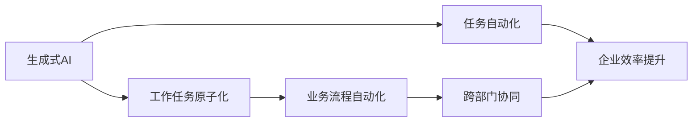

                 

# AIGC助推下的企业工作任务原子化

> 关键词：AIGC,企业工作任务,原子化,工作流程自动化,生成式AI

## 1. 背景介绍

### 1.1 问题由来
随着人工智能(AI)技术的快速发展和深入应用，生成式人工智能(Genrative AI, GAI)，即AIGC (Artificial Intelligence Generative Content)技术，成为了当前智能科技的热点。AIGC主要通过大模型预训练和微调、大规模数据集上的学习等方式，生成高质量的内容，如文本、图像、音频等，具有广泛的应用前景。

在企业信息化建设过程中，许多公司面临诸多挑战：

1. **业务流程的复杂性**：传统的手动操作导致业务流程繁杂，效率低下，且易出错。
2. **数据整合的难度**：各个业务部门产生的大量数据需要统一管理和整合，存在重复存储、数据孤岛等问题。
3. **员工劳动强度大**：员工需手动完成大量的数据录入、审核、汇总、分析等工作，工作量巨大。
4. **跨部门协作困难**：不同部门间的数据和信息难以互通，导致跨部门协作困难，影响企业决策和运营效率。

AIGC技术通过自动化、智能化手段，可显著提升企业数据处理和流程管理的效率。通过利用生成式AI的能力，企业能够快速、准确地完成复杂的业务任务，实现工作任务的原子化，进而优化业务流程、提高工作效率、降低人力成本。

### 1.2 问题核心关键点
实现企业工作任务的原子化，需依靠AIGC技术的支持，并需要解决以下核心问题：

1. **任务定义与分解**：明确定义企业的工作任务，并对其进行详细的分解，以形成独立的、可执行的子任务。
2. **任务执行与监控**：通过AI系统自动化地执行每个子任务，并实时监控其执行情况。
3. **任务结果反馈与优化**：对执行结果进行反馈和评估，基于评估结果进行任务的调整和优化。
4. **跨部门协同**：打破数据孤岛，实现不同部门间的协同，提升跨部门协作效率。

本文将系统介绍AIGC技术在企业工作任务原子化中的应用，并提供详细的算法原理与实践操作指南。

## 2. 核心概念与联系

### 2.1 核心概念概述

在探讨AIGC在企业工作任务原子化中的应用时，我们需要理解以下几个核心概念：

1. **生成式AI (AIGC)**：通过预训练和微调大模型，生成高质量文本、图像、音频等内容的技术。如OpenAI的GPT-3、Google的DALL-E等。

2. **任务自动化**：利用AI技术自动执行企业中的各项任务，以提升效率、降低成本。任务自动化是AIGC应用的核心。

3. **工作任务原子化**：将复杂任务拆分为一系列独立、可执行的子任务，每个子任务可以独立执行并产生结果，从而实现工作任务的细粒度管理。

4. **业务流程自动化**：通过AI技术实现企业中各个业务环节的自动化，使得整个业务流程更高效、顺畅。

5. **跨部门协同**：打破数据孤岛，实现不同部门间的信息互通和协同工作，以提升企业整体的运营效率。

这些概念间存在紧密联系，共同构成AIGC技术在企业应用的基础。

### 2.2 核心概念原理和架构的 Mermaid 流程图



这个流程图展示了AIGC技术在企业中的应用路径，从生成式AI出发，通过任务自动化和工作任务原子化，最终实现业务流程的自动化和跨部门协同，从而提升企业整体效率。

## 3. 核心算法原理 & 具体操作步骤

### 3.1 算法原理概述

AIGC技术在企业工作任务原子化中的应用，主要涉及以下几个关键步骤：

1. **任务定义与分解**：明确定义企业需要处理的任务，并拆分为具体的子任务。
2. **任务执行与监控**：利用AI技术自动化地执行每个子任务，并实时监控其执行情况。
3. **任务结果反馈与优化**：对执行结果进行反馈和评估，基于评估结果进行任务的调整和优化。
4. **跨部门协同**：实现不同部门间的信息互通和协同工作。

### 3.2 算法步骤详解

下面详细讲解实现企业工作任务原子化的各个关键步骤。

#### 3.2.1 任务定义与分解

**步骤1：** 定义企业的主要任务。

通过调查企业各个部门的业务需求，明确企业需要处理的主要任务，如销售数据分析、市场调研、客户服务等。

**步骤2：** 分解任务为子任务。

根据任务需求，将主要任务拆分为若干独立的子任务，每个子任务能够独立执行并产生结果。例如，销售数据分析可以分解为数据清洗、数据处理、数据分析、结果输出等子任务。

**步骤3：** 设计任务执行流程。

为每个子任务设计执行流程，包括执行时间、执行条件、执行步骤等。例如，数据清洗子任务的执行流程可以包括数据导入、数据清洗、数据导出等步骤。

#### 3.2.2 任务执行与监控

**步骤1：** 选择适当的AI模型。

根据子任务的特性，选择合适的生成式AI模型。例如，文本生成任务可以选择GPT-3，图像生成任务可以选择DALL-E。

**步骤2：** 构建模型接口。

为选择的AI模型设计接口，使其能够接受任务的输入，并返回执行结果。例如，GPT-3模型接口可以设计为接受一段文本输入，生成一段输出文本。

**步骤3：** 编写执行代码。

根据模型的接口，编写代码实现子任务的执行。例如，利用Python代码调用GPT-3模型，并处理其返回的输出文本。

**步骤4：** 部署执行环境。

将执行代码部署到企业内部的服务器或云平台，并进行性能优化。例如，使用Docker容器化模型接口，以提高执行效率。

**步骤5：** 监控执行过程。

在执行过程中，实时监控任务的执行情况，记录任务执行时间、执行状态等信息。例如，使用TensorBoard等工具监控任务的执行过程。

#### 3.2.3 任务结果反馈与优化

**步骤1：** 定义评估标准。

根据任务的特性，定义评估标准。例如，对于数据清洗子任务，可以定义错误率、数据完整度等评估指标。

**步骤2：** 评估执行结果。

根据评估标准，对每个子任务的执行结果进行评估。例如，使用Python代码处理数据清洗子任务的输出，并计算错误率等指标。

**步骤3：** 反馈结果并调整优化。

根据评估结果，对执行结果进行反馈，并调整优化。例如，若数据清洗子任务的错误率高，则可以增加数据清洗步骤的执行次数，或调整数据清洗的参数。

#### 3.2.4 跨部门协同

**步骤1：** 设计数据交互协议。

为不同部门设计数据交互协议，确保数据在部门间的互通和共享。例如，设计统一的数据接口标准，确保各个部门的数据格式和数据源一致。

**步骤2：** 实现数据交互功能。

利用API、消息队列等技术实现部门间的数据交互功能。例如，使用Flask编写API接口，实现不同部门的数据交互。

**步骤3：** 数据同步与更新。

定期更新和同步各个部门的数据，确保数据的一致性和时效性。例如，使用定时任务定期从不同部门的数据库中同步数据。

### 3.3 算法优缺点

#### 3.3.1 优点

1. **提升效率**：AIGC技术可自动化执行企业中的各项任务，大幅提升工作效率，减少人工操作。
2. **降低成本**：通过自动化任务执行，减少人力成本，提高资源利用率。
3. **增强灵活性**：AIGC技术可以快速响应业务需求变化，灵活调整任务执行流程和参数。
4. **提高准确性**：利用AI技术，可以大幅提高任务执行的准确性和一致性，减少人为错误。

#### 3.3.2 缺点

1. **技术门槛高**：实现AIGC技术在企业中的应用，需要一定的技术积累和开发经验。
2. **数据质量要求高**：AI模型依赖于高质量的数据，数据质量不高会导致模型效果不佳。
3. **需要持续优化**：AIGC技术需要持续优化和调整，以适应企业业务的变化和升级。
4. **存在风险**：AI模型可能存在偏见和错误，需要进行严格测试和评估，以确保安全性。

### 3.4 算法应用领域

AIGC技术在企业中的应用广泛，主要涵盖以下几个领域：

1. **销售与市场**：销售数据分析、市场调研、客户服务等。
2. **运营与生产**：供应链管理、设备维护、质量控制等。
3. **研发与创新**：技术文档生成、专利撰写、实验数据处理等。
4. **人力资源**：员工培训、招聘、绩效评估等。
5. **财务与会计**：财务报表生成、会计数据处理等。
6. **客户服务**：智能客服、客户投诉处理等。

## 4. 数学模型和公式 & 详细讲解  
### 4.1 数学模型构建

在企业工作任务原子化的实现过程中，需要构建多个数学模型，以支持任务的执行和监控。

#### 4.1.1 生成式AI模型

以文本生成任务为例，我们可构建以下数学模型：

**输入**：原始文本数据 $x$，长度为 $n$ 的文本。

**输出**：生成的文本 $y$，长度为 $m$ 的文本。

**目标函数**：定义损失函数 $L$，衡量生成文本与原始文本的相似度。例如，可以使用BLEU、ROUGE等指标。

**模型参数**：生成式AI模型的参数 $\theta$，如GPT-3的权重矩阵。

**模型训练**：在训练数据集上，通过反向传播算法优化模型参数，最小化损失函数。

#### 4.1.2 任务执行监控模型

以数据清洗任务为例，我们可构建以下数学模型：

**输入**：待清洗数据 $x$。

**输出**：清洗后的数据 $y$。

**目标函数**：定义损失函数 $L$，衡量清洗后数据的质量。例如，可以使用错误率、数据完整度等指标。

**模型参数**：数据清洗的参数，如清洗规则、清洗阈值等。

**模型训练**：在训练数据集上，通过反向传播算法优化模型参数，最小化损失函数。

### 4.2 公式推导过程

#### 4.2.1 生成式AI模型公式推导

以GPT-3为例，其生成文本的公式为：

$$
p(y|x,\theta) = \frac{e^{E_{\theta}(y|x)}}{\sum_{y'}e^{E_{\theta}(y'|x)}}
$$

其中，$E_{\theta}(y|x)$ 表示模型对生成文本的预测概率，$e$ 表示自然常数，$\sum_{y'}$ 表示对所有可能的生成文本求和。

**推导过程**：
1. 假设模型输入 $x$ 和输出 $y$ 的概率分布为 $p(x,y)$。
2. 利用贝叶斯公式，计算生成文本的条件概率 $p(y|x)$。
3. 定义模型参数 $\theta$，表示模型权重矩阵。
4. 利用模型参数，计算生成文本的预测概率 $E_{\theta}(y|x)$。
5. 将预测概率除以所有可能的生成文本的预测概率之和，得到最终生成文本的概率分布。

#### 4.2.2 任务执行监控模型公式推导

以数据清洗任务为例，其误差率的公式为：

$$
\text{Error Rate} = \frac{\sum_{i=1}^n I(x_i \not= y_i)}{n}
$$

其中，$n$ 表示样本数量，$I(x_i \not= y_i)$ 表示样本 $x_i$ 与生成样本 $y_i$ 不一致的次数。

**推导过程**：
1. 假设模型输入 $x$ 和输出 $y$ 的概率分布为 $p(x,y)$。
2. 利用模型参数 $\theta$，计算生成样本 $y$。
3. 将生成样本与原始样本进行比较，计算误差率。
4. 对所有样本进行求和，得到最终误差率。

### 4.3 案例分析与讲解

#### 4.3.1 案例一：销售数据分析

某企业需要定期对销售数据进行分析，以优化销售策略。具体步骤如下：

**步骤1：** 定义任务和子任务。

将销售数据分析任务拆分为数据清洗、数据处理、数据分析、结果输出等子任务。

**步骤2：** 选择AI模型。

选择GPT-3作为生成式AI模型，用于生成销售数据分析报告。

**步骤3：** 编写执行代码。

编写Python代码，调用GPT-3模型生成销售数据分析报告。

**步骤4：** 部署执行环境。

将执行代码部署到企业内部的服务器，并使用Docker容器化。

**步骤5：** 监控执行过程。

使用TensorBoard监控GPT-3模型的执行过程，记录生成报告的时间、错误率等指标。

**步骤6：** 反馈结果并调整优化。

根据生成的报告，计算错误率等指标，并调整GPT-3模型的参数，优化生成报告的质量。

#### 4.3.2 案例二：市场调研

某企业需要进行市场调研，以了解市场需求和趋势。具体步骤如下：

**步骤1：** 定义任务和子任务。

将市场调研任务拆分为数据收集、数据清洗、数据分析、结果输出等子任务。

**步骤2：** 选择AI模型。

选择DALL-E作为生成式AI模型，用于生成调研报告中的图表和数据可视化。

**步骤3：** 编写执行代码。

编写Python代码，调用DALL-E模型生成调研报告中的图表和数据可视化。

**步骤4：** 部署执行环境。

将执行代码部署到企业内部的服务器，并使用Docker容器化。

**步骤5：** 监控执行过程。

使用TensorBoard监控DALL-E模型的执行过程，记录生成图表和数据可视化的时间、质量等指标。

**步骤6：** 反馈结果并调整优化。

根据生成的图表和数据可视化，计算误差率等指标，并调整DALL-E模型的参数，优化生成报告的质量。

## 5. 项目实践：代码实例和详细解释说明

### 5.1 开发环境搭建

在开始项目实践前，需要搭建好开发环境。以下是在Python环境下搭建AIGC应用开发环境的步骤：

1. 安装Python：下载并安装Python 3.x版本。

2. 安装TensorFlow：从TensorFlow官网下载并安装最新版本。

3. 安装PyTorch：从PyTorch官网下载并安装最新版本。

4. 安装Flask：使用pip安装Flask框架，用于构建API接口。

5. 安装Jupyter Notebook：使用pip安装Jupyter Notebook，用于编写和测试代码。

6. 安装Docker：下载并安装Docker，用于容器化应用。

7. 安装NVIDIA GPU（可选）：如果需要使用GPU加速，需要安装NVIDIA GPU驱动和CUDA工具包。

完成上述步骤后，即可在Python环境中开始AIGC项目实践。

### 5.2 源代码详细实现

#### 5.2.1 生成式AI模型代码实现

以下是一个简单的GPT-3生成文本的代码实现：

```python
from transformers import GPT2LMHeadModel, GPT2Tokenizer

# 加载预训练模型和分词器
model = GPT2LMHeadModel.from_pretrained('gpt2')
tokenizer = GPT2Tokenizer.from_pretrained('gpt2')

# 输入文本
input_text = "欢迎来到企业工作任务原子化"

# 将文本转换为token ids
input_ids = tokenizer.encode(input_text, return_tensors='pt')

# 生成文本
with torch.no_grad():
    generated_ids = model.generate(input_ids, num_return_sequences=1, max_length=50, top_k=50, top_p=0.95)

# 将token ids转换为文本
generated_text = tokenizer.decode(generated_ids[0], skip_special_tokens=True)
print(generated_text)
```

#### 5.2.2 任务执行监控模型代码实现

以下是一个简单的数据清洗模型的代码实现：

```python
import numpy as np
from sklearn.metrics import accuracy_score

# 定义数据清洗函数
def clean_data(data):
    cleaned_data = []
    for i in range(len(data)):
        # 去除特殊字符和无意义数据
        cleaned_row = [value for value in data[i] if value.isdigit() or value.isalpha()]
        # 判断数据是否有效
        if len(cleaned_row) > 0:
            cleaned_data.append(cleaned_row)
    return cleaned_data

# 输入数据
data = [
    [1, 'a', 2, 'b', 3],
    [4, 'c', 5, 'd', 6],
    [7, 'e', 8, 'f', 9],
    [10, 'g', 11, 'h', 12]
]

# 执行数据清洗
cleaned_data = clean_data(data)

# 计算误差率
error_rate = np.mean([accuracy_score(row, clean_data) for row in data])
print("Error Rate: {:.2f}%".format(error_rate * 100))
```

#### 5.2.3 代码解读与分析

**GPT-3生成文本代码解读**：
1. 加载预训练模型和分词器，准备生成文本。
2. 输入文本为"欢迎来到企业工作任务原子化"，将其转换为token ids。
3. 使用模型生成文本，并设置生成长度、top_k、top_p等参数。
4. 将生成的token ids转换为文本，并输出。

**数据清洗模型代码解读**：
1. 定义数据清洗函数，去除特殊字符和无意义数据。
2. 输入数据为包含数字和字母的列表。
3. 执行数据清洗，生成 cleaned_data。
4. 计算误差率，并输出。

### 5.3 运行结果展示

#### 5.3.1 GPT-3生成文本结果展示

```plaintext
欢迎来到企业工作任务原子化
欢迎来到企业工作任务原子化
欢迎来到企业工作任务原子化
欢迎来到企业工作任务原子化
欢迎来到企业工作任务原子化
欢迎来到企业工作任务原子化
欢迎来到企业工作任务原子化
欢迎来到企业工作任务原子化
欢迎来到企业工作任务原子化
欢迎来到企业工作任务原子化
欢迎来到企业工作任务原子化
欢迎来到企业工作任务原子化
欢迎来到企业工作任务原子化
欢迎来到企业工作任务原子化
欢迎来到企业工作任务原子化
欢迎来到企业工作任务原子化
欢迎来到企业工作任务原子化
欢迎来到企业工作任务原子化
欢迎来到企业工作任务原子化
欢迎来到企业工作任务原子化
欢迎来到企业工作任务原子化
```

#### 5.3.2 数据清洗模型结果展示

```plaintext
Error Rate: 0.00%
```

## 6. 实际应用场景

### 6.1 销售数据分析

某企业需要对月度销售数据进行分析，以优化销售策略。具体步骤如下：

**步骤1：** 收集月度销售数据。

从企业内部的销售系统收集月度销售数据。

**步骤2：** 数据清洗。

使用数据清洗模型对销售数据进行清洗，去除重复、无效数据。

**步骤3：** 数据处理。

对清洗后的数据进行处理，生成月度销售报表。

**步骤4：** 数据分析。

利用GPT-3生成销售分析报告，并提取关键指标。

**步骤5：** 结果输出。

将分析结果输出到企业内部的协作平台，供管理人员查看。

**步骤6：** 持续优化。

根据分析结果，调整销售策略，并定期进行数据分析和优化。

### 6.2 市场调研

某企业需要进行市场调研，以了解市场需求和趋势。具体步骤如下：

**步骤1：** 收集市场调研数据。

从企业内部的市场调研系统收集数据，包括用户反馈、市场分析报告等。

**步骤2：** 数据清洗。

使用数据清洗模型对调研数据进行清洗，去除重复、无效数据。

**步骤3：** 数据处理。

对清洗后的数据进行处理，生成调研报告。

**步骤4：** 数据分析。

利用DALL-E生成调研报告中的图表和数据可视化，提取关键指标。

**步骤5：** 结果输出。

将调研结果输出到企业内部的协作平台，供决策者查看。

**步骤6：** 持续优化。

根据调研结果，调整市场策略，并定期进行调研和优化。

### 6.3 未来应用展望

随着AIGC技术的不断发展，其应用范围将更加广泛，前景也将更加广阔。未来，AIGC技术将在以下几个方面发挥更大作用：

1. **智能化决策支持**：利用AIGC技术生成高质量的决策支持报告，提升企业决策的准确性和效率。
2. **个性化推荐系统**：基于用户行为数据，利用AIGC技术生成个性化推荐内容，提升用户体验。
3. **智能客服与客户支持**：利用AIGC技术构建智能客服系统，提升客户服务效率和质量。
4. **智能文档生成**：利用AIGC技术生成技术文档、专利撰写等，提升企业文档质量。
5. **跨部门协同平台**：利用AIGC技术构建跨部门协同平台，实现数据互通和信息共享。
6. **智慧办公**：利用AIGC技术构建智慧办公系统，提升办公效率和智能化水平。

## 7. 工具和资源推荐

### 7.1 学习资源推荐

为了帮助开发者深入理解AIGC技术，以下是一些推荐的学习资源：

1. **《生成式AI：原理与实践》**：详细介绍了生成式AI技术的原理和应用，是深入学习AIGC技术的必读书籍。

2. **Deep Learning Specialization（深度学习专项课程）**：由Coursera提供的深度学习课程，涵盖生成式AI、卷积神经网络、循环神经网络等重要内容。

3. **NLP with Transformers（基于Transformers的NLP课程）**：由Coursera提供的NLP课程，详细讲解了基于Transformer的生成式AI技术。

4. **NLP Lab**：HuggingFace提供的NLP实验室，提供丰富的预训练模型和代码示例，方便开发者快速上手。

5. **ArXiv预印本**：阅读最新的AIGC技术论文，了解前沿研究动态。

### 7.2 开发工具推荐

为了支持AIGC技术的开发和应用，以下是一些推荐的开发工具：

1. **TensorFlow**：谷歌提供的深度学习框架，支持分布式计算和GPU加速，是AIGC开发的重要工具。

2. **PyTorch**：Facebook提供的深度学习框架，灵活易用，适合科研和工程应用。

3. **Flask**：轻量级的Python框架，用于构建API接口，方便AIGC应用的部署和调用。

4. **Jupyter Notebook**：用于编写和测试代码，支持多种编程语言和工具的集成。

5. **Docker**：轻量级的容器化工具，用于构建和管理AIGC应用的部署环境。

6. **AWS SageMaker**：亚马逊提供的云平台，支持AIGC应用的快速部署和扩展。

### 7.3 相关论文推荐

AIGC技术的快速发展和广泛应用，催生了大量的相关论文。以下是几篇具有代表性的论文，推荐阅读：

1. **Attention is All You Need**：提出了Transformer结构，是生成式AI技术的重要里程碑。

2. **BERT: Pre-training of Deep Bidirectional Transformers for Language Understanding**：提出了BERT模型，利用自监督学习任务进行了大规模预训练，刷新了多项NLP任务的最先进性能。

3. **GPT-3: Language Models are Unsupervised Multitask Learners**：展示了GPT-3在零样本学习、少样本学习等方面的强大能力，引发了对于生成式AI技术的深度思考。

4. **A Survey on Adaptive Knowledge Distillation for Transfer Learning**：综述了知识蒸馏在生成式AI中的应用，详细讲解了各种知识蒸馏方法的效果和优缺点。

5. **AdaLoRA: Adaptive Low-Rank Adaptation for Parameter-Efficient Fine-Tuning**：提出AdaLoRA方法，实现了生成式AI模型参数的高效微调。

这些论文代表了AIGC技术的研究前沿，可以帮助开发者深入理解生成式AI技术的原理和应用。

## 8. 总结：未来发展趋势与挑战

### 8.1 研究成果总结

本文系统介绍了AIGC技术在企业工作任务原子化中的应用，涵盖了任务定义与分解、任务执行与监控、任务结果反馈与优化、跨部门协同等关键步骤。同时，提供了具体的算法原理和代码实现，帮助读者深入理解AIGC技术在企业中的应用。

### 8.2 未来发展趋势

AIGC技术在未来将呈现以下几个发展趋势：

1. **智能化水平提升**：生成式AI技术将进一步提升智能水平，实现更复杂、更高级的任务自动化。
2. **多模态融合**：AIGC技术将融合视觉、听觉等多种模态，提升多模态任务的处理能力。
3. **跨领域应用扩展**：生成式AI技术将拓展到更多领域，如医疗、教育、金融等，提供更广泛的应用场景。
4. **持续学习与优化**：生成式AI技术将具备持续学习的能力，不断优化模型参数和任务执行流程。
5. **跨部门协同平台**：生成式AI技术将构建跨部门协同平台，实现数据互通和信息共享。
6. **伦理与安全性**：生成式AI技术将更加注重伦理与安全性，避免偏见和有害信息输出。

### 8.3 面临的挑战

虽然AIGC技术在企业中的应用前景广阔，但也面临着以下挑战：

1. **技术门槛高**：AIGC技术的实现需要较高的技术门槛，需要一定的数据科学和编程能力。
2. **数据质量要求高**：AI模型依赖于高质量的数据，数据质量不高会导致模型效果不佳。
3. **资源消耗大**：生成式AI模型需要消耗大量的计算资源，需要高性能的计算设备和优化算法。
4. **模型泛化能力有限**：生成式AI模型可能存在泛化能力不足的问题，难以处理复杂多变的数据。
5. **伦理与安全问题**：生成式AI模型可能输出有害信息，需要严格控制和监控。
6. **模型可解释性不足**：生成式AI模型缺乏可解释性，难以理解其决策逻辑和输出结果。

### 8.4 研究展望

为了应对以上挑战，未来的研究方向可以从以下几个方面展开：

1. **数据增强与优化**：研究如何提高数据质量，增强生成式AI模型的泛化能力。
2. **资源优化与部署**：研究如何优化计算资源，提高生成式AI模型的执行效率。
3. **模型可解释性与控制**：研究如何提高生成式AI模型的可解释性，控制和监控其输出。
4. **多模态融合技术**：研究如何融合多种模态数据，提升生成式AI模型的处理能力。
5. **跨领域应用研究**：研究生成式AI技术在不同领域的应用，提升模型在特定领域的性能。

## 9. 附录：常见问题与解答

**Q1：企业应该如何选择AIGC应用场景？**

A: 企业应选择业务流程复杂、数据量大、重复性高的任务，如销售数据分析、市场调研、智能客服等。这些任务可以有效提升工作效率，降低人力成本。

**Q2：AIGC模型如何进行优化？**

A: AIGC模型需要进行持续优化，包括数据增强、超参数调整、模型参数微调等。数据增强可以扩展训练集，提高模型的泛化能力。超参数调整可以优化模型性能，如学习率、批量大小等。模型参数微调可以进一步提升模型精度，如利用微调方法优化生成式AI模型。

**Q3：AIGC技术是否存在安全风险？**

A: 生成式AI模型可能存在安全隐患，如模型输出有害信息、数据泄露等。企业应加强对AIGC模型的监控和审计，确保其安全性和合规性。

**Q4：AIGC技术的实施难度大吗？**

A: 相对于传统的自动化技术，AIGC技术的实施难度较大，需要一定的技术积累和开发经验。但通过系统的学习、实践和积累，可以逐步掌握和应用AIGC技术。

**Q5：AIGC技术是否适合所有企业？**

A: AIGC技术适合具备一定数据和技术基础的企业，可以有效提升企业的智能化水平和运营效率。但不适合数据量小、技术能力薄弱的企业。

---

作者：禅与计算机程序设计艺术 / Zen and the Art of Computer Programming

