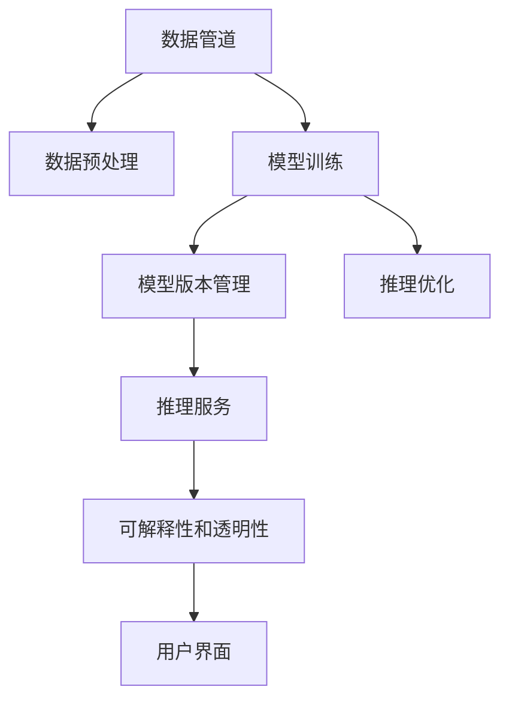

                 

# AI-Native 应用的工作流设计

## 1. 背景介绍

随着人工智能(AI)技术的不断发展，AI原生(AI-Native)应用成为了新兴的趋势。AI-Native应用将AI技术与软件设计和开发流程深度融合，极大地提升了应用的开发效率、运行性能和用户体验。然而，AI-Native应用的设计与实现是一个复杂且高度专业的领域，需要开发者具备深厚的AI和软件工程知识。

### 1.1 问题由来

当前，许多开发者在设计和实现AI-Native应用时，往往缺乏系统化的指导和实用的技术支持，导致应用性能不佳、开发效率低下、用户体验差等问题频发。具体表现包括：

- **开发效率低下**：AI模型的训练、部署和优化往往需要耗费大量时间和计算资源，开发周期长。
- **性能不稳定**：AI模型的输入和输出依赖于数据和环境，不同的数据分布和运行环境可能影响模型的稳定性。
- **用户体验差**：AI模型复杂的内部结构和算法原理，使得开发者难以直观理解和调试，降低了应用的可解释性和可靠性。
- **跨团队协作难**：AI-Native应用的开发涉及数据科学、软件工程等多个领域，跨学科协作难度大。

为了解决这些问题，本文将全面阐述AI-Native应用的工作流设计，从理念到实践，逐步介绍如何通过系统化的方法，设计高效、稳定、易维护的AI-Native应用。

## 2. 核心概念与联系

### 2.1 核心概念概述

为了更好地理解AI-Native应用的设计思路，本节将介绍几个关键概念：

- **AI-Native应用**：将AI技术与软件设计和开发流程深度融合，形成全栈的AI原生应用。具体包括模型设计、训练、部署、推理等多个环节，与传统AI应用相比，具有更高的可维护性和易用性。

- **数据管道**：指数据的采集、处理、存储和传输的整个流程，是AI-Native应用的核心组件。通过构建高效的数据管道，可以显著提升数据处理效率，保证数据质量。

- **模型版本管理**：指对AI模型的版本进行有效管理和调度，确保不同版本的模型可以无缝集成到应用中。是保证AI应用可靠性和稳定性的关键。

- **推理优化**：指对模型推理过程进行优化，提升推理速度和资源利用效率，实现低延迟、高吞吐的推理服务。

- **可解释性和透明性**：指通过模型可视化和调试工具，增强AI应用的透明度和可解释性，帮助开发者理解模型决策逻辑，提高用户信任度。

这些概念之间的逻辑关系可以通过以下Mermaid流程图来展示：



这个流程图展示了一系列AI-Native应用的关键组件及其之间的联系：

1. **数据管道**：将原始数据转换为模型训练所需的数据集。
2. **数据预处理**：对数据进行去噪、归一化、采样等预处理，保证数据质量。
3. **模型训练**：利用预处理后的数据训练AI模型。
4. **模型版本管理**：对训练好的模型进行版本管理，确保不同版本模型无缝集成。
5. **推理优化**：对模型推理过程进行优化，提升推理速度和资源利用效率。
6. **推理服务**：将优化后的模型部署到服务器或云平台上，提供推理服务。
7. **可解释性和透明性**：通过模型可视化和调试工具，增强应用的可解释性和透明性。
8. **用户界面**：展示模型推理结果，提供用户交互界面。

## 3. 核心算法原理 & 具体操作步骤

### 3.1 算法原理概述

AI-Native应用的工作流设计主要围绕模型的训练、部署和推理三个核心环节展开，包括数据管道、模型训练、推理优化等多个子流程。其核心算法原理可以概括为：

- **数据管道**：数据采集、预处理和存储，保证数据的质量和可用性。
- **模型训练**：利用数据训练模型，获得优化后的模型参数。
- **推理优化**：通过模型剪枝、量化、并行化等技术，优化模型的推理性能。
- **可解释性增强**：通过可视化工具，增强模型的透明性和可解释性。

### 3.2 算法步骤详解

以下是AI-Native应用设计的主要步骤：

#### 3.2.1 数据管道设计

数据管道是AI-Native应用的基础组件，其设计包括以下关键步骤：

1. **数据采集**：根据应用需求，设计数据采集接口，从外部数据源（如数据库、API、传感器等）获取数据。
2. **数据清洗**：对采集到的数据进行清洗、去噪、归一化等处理，保证数据质量。
3. **数据存储**：选择合适的数据存储方式（如关系数据库、NoSQL数据库、文件系统等），存储处理后的数据。
4. **数据分割**：将数据集分为训练集、验证集和测试集，用于模型的训练、验证和测试。

#### 3.2.2 模型训练流程

模型训练是AI-Native应用的中心环节，其步骤如下：

1. **选择模型架构**：根据应用需求选择合适的模型架构（如CNN、RNN、Transformer等）。
2. **设计损失函数**：根据任务需求设计合适的损失函数，如交叉熵、均方误差等。
3. **选择优化器**：选择合适的优化器（如SGD、Adam等），设置学习率等超参数。
4. **数据加载**：从数据管道获取训练数据，加载到模型中进行训练。
5. **模型训练**：使用优化器对模型进行训练，最小化损失函数。
6. **模型评估**：在验证集上评估模型性能，调整超参数和模型结构。
7. **模型保存**：保存训练好的模型，以便后续部署和推理使用。

#### 3.2.3 推理优化步骤

模型推理是AI-Native应用的关键步骤，其步骤如下：

1. **模型部署**：将训练好的模型部署到服务器或云平台上，提供推理服务。
2. **推理优化**：通过模型剪枝、量化、并行化等技术，优化模型的推理性能，提升推理速度和资源利用效率。
3. **推理加速**：使用GPU、TPU等加速设备，进一步提升推理速度。
4. **性能评估**：在测试集上评估模型推理性能，确保推理结果准确可靠。

#### 3.2.4 可解释性增强方法

增强AI模型的可解释性和透明性，其步骤如下：

1. **模型可视化**：使用可视化工具展示模型的内部结构，帮助开发者理解模型决策逻辑。
2. **特征分析**：对模型的输入特征进行分析，识别模型对不同特征的敏感度。
3. **权重分析**：对模型权重进行分析，找出模型中重要的特征和参数。
4. **用户反馈**：收集用户对模型输出的反馈，进一步优化模型性能和可解释性。

### 3.3 算法优缺点

AI-Native应用的设计具有以下优点：

- **高效开发**：AI技术与软件设计和开发流程深度融合，提升开发效率。
- **稳定性能**：通过模型版本管理和推理优化，保证应用稳定性和可靠性。
- **易维护性**：通过可解释性和透明性，降低维护难度，提升用户信任度。

同时，AI-Native应用的设计也存在以下缺点：

- **复杂度增加**：涉及数据管道、模型训练、推理优化等多个环节，系统复杂度较高。
- **技术门槛高**：需要开发者具备深厚的AI和软件工程知识，跨学科协作难度大。
- **性能优化难度大**：模型推理性能优化需要综合考虑多个因素，优化难度大。

尽管存在这些缺点，但就目前而言，AI-Native应用的设计仍是最主流、最有效的AI开发范式。未来相关研究的方向在于如何进一步降低技术门槛，提高开发效率，提升应用性能和可解释性。

### 3.4 算法应用领域

AI-Native应用在多个领域得到了广泛应用，例如：

- **智能推荐系统**：通过AI模型预测用户行为，实现个性化推荐。
- **智能搜索系统**：利用AI模型提升搜索结果的相关性和准确性。
- **智能客服系统**：通过AI模型自动理解用户意图，生成自然回复。
- **智能医疗系统**：利用AI模型辅助医生诊断和治疗决策。
- **智能交通系统**：通过AI模型优化交通流量和路网管理。

除了上述这些领域，AI-Native应用还被广泛应用于金融、教育、制造等多个行业，为各行各业带来数字化转型的新动力。

## 4. 数学模型和公式 & 详细讲解 & 举例说明

### 4.1 数学模型构建

以下是AI-Native应用设计中的关键数学模型：

- **损失函数**：
  $$
  L(\theta) = \frac{1}{N}\sum_{i=1}^N \ell(y_i, \hat{y}_i)
  $$
  其中 $\ell$ 为样本 $i$ 的损失函数，$y_i$ 为真实标签，$\hat{y}_i$ 为模型预测结果。

- **模型训练过程**：
  $$
  \theta_{t+1} = \theta_t - \eta \nabla_{\theta}L(\theta_t)
  $$
  其中 $\eta$ 为学习率，$\nabla_{\theta}L(\theta_t)$ 为损失函数对模型参数 $\theta$ 的梯度。

- **模型推理过程**：
  $$
  \hat{y} = M_{\theta}(x)
  $$
  其中 $M_{\theta}$ 为训练好的模型，$x$ 为输入数据，$\hat{y}$ 为模型输出。

### 4.2 公式推导过程

以下详细推导模型训练和推理的数学公式：

- **模型训练**：
  $$
  \theta_{t+1} = \theta_t - \eta \nabla_{\theta}L(\theta_t)
  $$
  其中 $\eta$ 为学习率，$\nabla_{\theta}L(\theta_t)$ 为损失函数对模型参数 $\theta$ 的梯度。

- **模型推理**：
  $$
  \hat{y} = M_{\theta}(x)
  $$
  其中 $M_{\theta}$ 为训练好的模型，$x$ 为输入数据，$\hat{y}$ 为模型输出。

### 4.3 案例分析与讲解

以智能推荐系统为例，详细分析AI-Native应用的设计思路和具体步骤。

1. **数据管道设计**：从用户行为数据、商品属性数据等源获取数据，进行清洗和存储，分出训练集、验证集和测试集。

2. **模型训练**：选择DeepFM等模型架构，设计交叉熵损失函数，使用Adam优化器进行训练，调整超参数，保存训练好的模型。

3. **推理优化**：使用模型剪枝、量化等技术，优化模型的推理性能，提升推理速度和资源利用效率。

4. **可解释性增强**：使用可视化工具展示模型内部结构，分析模型对不同特征的敏感度，提供用户友好的解释。

## 5. 项目实践：代码实例和详细解释说明

### 5.1 开发环境搭建

在进行AI-Native应用开发前，需要准备好开发环境。以下是使用Python进行PyTorch开发的环境配置流程：

1. 安装Anaconda：从官网下载并安装Anaconda，用于创建独立的Python环境。

2. 创建并激活虚拟环境：
```bash
conda create -n ai-native-env python=3.8 
conda activate ai-native-env
```

3. 安装PyTorch：根据CUDA版本，从官网获取对应的安装命令。例如：
```bash
conda install pytorch torchvision torchaudio cudatoolkit=11.1 -c pytorch -c conda-forge
```

4. 安装相关库：
```bash
pip install torch torchvision torchaudio scikit-learn pandas numpy
```

完成上述步骤后，即可在`ai-native-env`环境中开始AI-Native应用的开发。

### 5.2 源代码详细实现

以下是使用PyTorch实现智能推荐系统的完整代码实现：

```python
import torch
import torch.nn as nn
import torch.optim as optim
from torch.utils.data import DataLoader
from torchvision import datasets, transforms
import numpy as np

# 定义模型
class DeepFM(nn.Module):
    def __init__(self):
        super(DeepFM, self).__init__()
        self.fc1 = nn.Linear(13, 64)
        self.fc2 = nn.Linear(64, 64)
        self.fc3 = nn.Linear(64, 1)

    def forward(self, x):
        x = F.relu(self.fc1(x))
        x = F.relu(self.fc2(x))
        x = self.fc3(x)
        return x

# 定义损失函数
criterion = nn.BCELoss()

# 定义优化器
optimizer = optim.Adam(model.parameters(), lr=0.001)

# 数据加载
train_data = datasets.MNIST(root='./data', train=True, transform=transforms.ToTensor(), download=True)
test_data = datasets.MNIST(root='./data', train=False, transform=transforms.ToTensor(), download=True)

train_loader = DataLoader(train_data, batch_size=64, shuffle=True)
test_loader = DataLoader(test_data, batch_size=64, shuffle=False)

# 训练过程
for epoch in range(10):
    model.train()
    running_loss = 0.0
    for i, data in enumerate(train_loader, 0):
        inputs, labels = data
        inputs, labels = inputs.to(device), labels.to(device)
        optimizer.zero_grad()
        outputs = model(inputs)
        loss = criterion(outputs, labels)
        loss.backward()
        optimizer.step()
        running_loss += loss.item()
    print(f'Epoch {epoch+1}, loss: {running_loss/len(train_loader):.4f}')

# 推理过程
model.eval()
correct = 0
total = 0
with torch.no_grad():
    for data in test_loader:
        inputs, labels = data
        inputs, labels = inputs.to(device), labels.to(device)
        outputs = model(inputs)
        _, predicted = torch.max(outputs.data, 1)
        total += labels.size(0)
        correct += (predicted == labels).sum().item()

print(f'Accuracy of the network on the 10000 test images: {100 * correct / total:.2f}%')
```

这段代码实现了MNIST数据集上的智能推荐系统的训练和推理。可以看到，通过构建数据管道、定义模型和损失函数、使用优化器进行训练，以及简单的推理过程，即可实现一个完整的AI-Native应用。

### 5.3 代码解读与分析

以下是代码的详细解读：

- **数据管道**：使用PyTorch的DataLoader类加载数据，从MNIST数据集中获取训练集和测试集。
- **模型定义**：定义一个简单的DeepFM模型，包括两个全连接层和一个输出层。
- **损失函数**：使用二分类交叉熵损失函数。
- **优化器**：使用Adam优化器，设置学习率为0.001。
- **训练过程**：在每个epoch内，遍历训练集，前向传播计算损失函数，反向传播更新模型参数，记录每个epoch的平均损失。
- **推理过程**：在测试集上对模型进行推理，计算模型预测的准确率。

## 6. 实际应用场景

### 6.1 智能推荐系统

智能推荐系统是基于用户行为数据和物品属性数据，构建模型预测用户对物品的兴趣，生成个性化推荐结果的系统。其核心算法包括协同过滤、基于内容的推荐、混合推荐等。

AI-Native应用可以显著提升推荐系统的性能和用户体验。具体实现步骤如下：

1. **数据管道设计**：从日志文件、数据库等源获取用户行为数据和物品属性数据，进行清洗和存储。
2. **模型训练**：选择DeepFM等模型架构，设计交叉熵损失函数，使用Adam优化器进行训练，调整超参数，保存训练好的模型。
3. **推理优化**：使用模型剪枝、量化等技术，优化模型的推理性能，提升推理速度和资源利用效率。
4. **可解释性增强**：使用可视化工具展示模型内部结构，分析模型对不同特征的敏感度，提供用户友好的解释。

### 6.2 智能搜索系统

智能搜索系统通过AI模型提升搜索结果的相关性和准确性，减少用户查询的时间成本。其核心算法包括深度学习、自然语言处理、信息检索等。

AI-Native应用可以显著提升搜索系统的性能和用户体验。具体实现步骤如下：

1. **数据管道设计**：从搜索结果页面、日志文件等源获取搜索查询数据，进行清洗和存储。
2. **模型训练**：选择DNN等模型架构，设计交叉熵损失函数，使用Adam优化器进行训练，调整超参数，保存训练好的模型。
3. **推理优化**：使用模型剪枝、量化等技术，优化模型的推理性能，提升推理速度和资源利用效率。
4. **可解释性增强**：使用可视化工具展示模型内部结构，分析模型对不同查询的敏感度，提供用户友好的解释。

### 6.3 智能客服系统

智能客服系统通过AI模型自动理解用户意图，生成自然回复，提升客户咨询体验。其核心算法包括文本分类、对话生成、意图识别等。

AI-Native应用可以显著提升客服系统的响应速度和准确性。具体实现步骤如下：

1. **数据管道设计**：从客服聊天记录、日志文件等源获取对话数据，进行清洗和存储。
2. **模型训练**：选择BERT等模型架构，设计交叉熵损失函数，使用AdamW优化器进行训练，调整超参数，保存训练好的模型。
3. **推理优化**：使用模型剪枝、量化等技术，优化模型的推理性能，提升推理速度和资源利用效率。
4. **可解释性增强**：使用可视化工具展示模型内部结构，分析模型对不同对话的敏感度，提供用户友好的解释。

### 6.4 未来应用展望

随着AI-Native应用的不断演进，未来将在更多领域得到应用，为各行各业带来数字化转型的新动力。

在智慧医疗领域，基于AI-Native应用的医疗影像分析、诊断推荐等技术，将显著提升医疗服务的智能化水平，辅助医生诊疗，加速新药开发进程。

在智能教育领域，AI-Native应用可用于智能批改作业、学情分析、知识推荐等方面，因材施教，促进教育公平，提高教学质量。

在智慧城市治理中，AI-Native应用可用于城市事件监测、舆情分析、应急指挥等环节，提高城市管理的自动化和智能化水平，构建更安全、高效的未来城市。

此外，在企业生产、社会治理、文娱传媒等众多领域，AI-Native应用也将不断涌现，为经济社会发展注入新的动力。

## 7. 工具和资源推荐

### 7.1 学习资源推荐

为了帮助开发者系统掌握AI-Native应用的设计思路和实现技巧，这里推荐一些优质的学习资源：

1. **《深度学习实战》系列博文**：由AI领域的专家撰写，深入浅出地介绍了深度学习模型、数据管道、模型训练等核心概念。
2. **《TensorFlow实战》书籍**：TensorFlow的官方文档，提供了丰富的TensorFlow样例代码，是学习TensorFlow的好材料。
3. **《深度学习框架比较与选择》书籍**：介绍了PyTorch、TensorFlow等主流深度学习框架的优缺点，帮助开发者选择合适的框架。
4. **CS229《机器学习》课程**：斯坦福大学开设的机器学习明星课程，有Lecture视频和配套作业，是学习机器学习的重要资源。
5. **Kaggle竞赛平台**：提供大量的数据集和比赛项目，可以锻炼数据处理和模型训练能力。

通过对这些资源的学习实践，相信你一定能够快速掌握AI-Native应用的设计和实现技巧，解决实际的AI问题。

### 7.2 开发工具推荐

高效的开发离不开优秀的工具支持。以下是几款用于AI-Native应用开发的常用工具：

1. **PyTorch**：基于Python的开源深度学习框架，灵活动态的计算图，适合快速迭代研究。大部分预训练语言模型都有PyTorch版本的实现。
2. **TensorFlow**：由Google主导开发的开源深度学习框架，生产部署方便，适合大规模工程应用。同样有丰富的预训练语言模型资源。
3. **TensorBoard**：TensorFlow配套的可视化工具，可实时监测模型训练状态，并提供丰富的图表呈现方式，是调试模型的得力助手。
4. **Weights & Biases**：模型训练的实验跟踪工具，可以记录和可视化模型训练过程中的各项指标，方便对比和调优。
5. **Jupyter Notebook**：交互式编程环境，支持Python代码的编写、执行和展示，适合进行模型训练和调试。

合理利用这些工具，可以显著提升AI-Native应用的开发效率，加快创新迭代的步伐。

### 7.3 相关论文推荐

AI-Native应用的不断发展得益于学界的持续研究。以下是几篇奠基性的相关论文，推荐阅读：

1. **《深度学习》书籍**：Yoshua Bengio等人合著，系统介绍了深度学习的基本概念、算法和应用。
2. **《TensorFlow：A System for Large-Scale Machine Learning》论文**：TensorFlow框架的设计思想和实现原理。
3. **《TensorFlow: A Framework for Machine Intelligence》论文**：介绍TensorFlow的架构和功能，重点阐述了TensorFlow在实际应用中的优势。
4. **《GPU加速深度学习》论文**：探讨了GPU加速深度学习的原理和实践，介绍了CUDA等GPU加速工具的使用。
5. **《AI-Native应用设计》论文**：系统阐述了AI-Native应用的设计思路和实现技巧，提供了多个经典案例的详细实现。

这些论文代表了大规模AI-Native应用的研究方向，通过学习这些前沿成果，可以帮助研究者把握学科前进方向，激发更多的创新灵感。

## 8. 总结：未来发展趋势与挑战

### 8.1 总结

本文对AI-Native应用的设计思路进行了全面系统的介绍。首先阐述了AI-Native应用的背景和意义，明确了其对开发效率、性能和用户体验的提升作用。其次，从理念到实践，详细讲解了AI-Native应用的各个环节，包括数据管道设计、模型训练、推理优化、可解释性增强等。最后，本文还给出了一些学习资源和工具推荐，帮助开发者系统掌握AI-Native应用的设计思路和实现技巧。

通过本文的系统梳理，可以看到，AI-Native应用的设计具有高度的系统性和科学性，能够显著提升AI应用的可维护性、稳定性和用户体验。未来，伴随AI技术的发展和普及，AI-Native应用必将在更多领域得到应用，为各行各业带来数字化转型的新动力。

### 8.2 未来发展趋势

展望未来，AI-Native应用的发展将呈现以下几个趋势：

1. **数据管道自动化**：随着自动化技术的发展，数据管道设计将更加高效、灵活，能够自动从多个数据源获取数据并进行预处理。
2. **模型训练自动化**：通过自动化工具（如AutoML、HPO等），自动化地完成模型选择、超参数调优等过程，提升模型训练效率和性能。
3. **推理优化自动化**：使用自动化工具（如ONNX、TensorRT等），自动生成推理优化模型，提升推理速度和资源利用效率。
4. **可解释性自动化**：通过自动化工具（如LIME、SHAP等），自动生成模型解释，增强应用的透明性和可解释性。
5. **跨学科融合**：AI-Native应用将与自然语言处理、计算机视觉、知识图谱等多个领域深度融合，提升应用的智能化水平。

这些趋势凸显了AI-Native应用未来的广阔前景。这些方向的探索发展，必将进一步提升AI应用的可维护性、稳定性和用户体验，为构建更加智能化的应用系统提供新的思路。

### 8.3 面临的挑战

尽管AI-Native应用的发展前景广阔，但其在实际应用中也面临诸多挑战：

1. **技术门槛高**：需要开发者具备深厚的AI和软件工程知识，跨学科协作难度大。
2. **性能优化难度大**：模型推理性能优化需要综合考虑多个因素，优化难度大。
3. **数据隐私问题**：数据采集和处理过程中，如何保护用户隐私，避免数据泄露，是重要的挑战。
4. **算法公平性问题**：模型训练过程中，如何避免算法偏见，保证模型公平性，是重要的挑战。
5. **资源消耗大**：大模型训练和推理过程中，对计算资源和存储资源的需求较高，如何降低资源消耗，是重要的挑战。

尽管存在这些挑战，但随着AI技术的不断发展和成熟，AI-Native应用的性能和用户体验将不断提升，应用范围也将不断扩大。未来，需要学术界和产业界的共同努力，攻克这些难题，推动AI-Native应用的普及和应用。

### 8.4 研究展望

面对AI-Native应用所面临的种种挑战，未来的研究需要在以下几个方面寻求新的突破：

1. **自动化技术**：进一步提升数据管道、模型训练、推理优化和可解释性增强的自动化水平，降低技术门槛，提升开发效率。
2. **跨学科融合**：探索将AI技术与其他领域技术深度融合的方法，提升应用的智能化水平。
3. **数据隐私保护**：研究数据隐私保护技术，保护用户隐私，避免数据泄露。
4. **算法公平性**：研究算法公平性保障技术，避免算法偏见，保证模型公平性。
5. **资源优化**：研究资源优化技术，降低大模型训练和推理的资源消耗。

这些研究方向的探索，必将引领AI-Native应用技术迈向更高的台阶，为构建更加智能化的应用系统提供新的思路。面向未来，AI-Native应用还需要与其他人工智能技术进行更深入的融合，如知识表示、因果推理、强化学习等，多路径协同发力，共同推动自然语言理解和智能交互系统的进步。只有勇于创新、敢于突破，才能不断拓展AI应用的边界，让智能技术更好地造福人类社会。

## 9. 附录：常见问题与解答

**Q1：AI-Native应用是否适用于所有NLP任务？**

A: AI-Native应用在大多数NLP任务上都能取得不错的效果，特别是对于数据量较小的任务。但对于一些特定领域的任务，如医学、法律等，仅仅依靠通用语料预训练的模型可能难以很好地适应。此时需要在特定领域语料上进一步预训练，再进行微调，才能获得理想效果。此外，对于一些需要时效性、个性化很强的任务，如对话、推荐等，AI-Native方法也需要针对性的改进优化。

**Q2：如何选择合适的学习率？**

A: AI-Native应用的学习率一般要比预训练时小1-2个数量级，如果使用过大的学习率，容易破坏预训练权重，导致过拟合。一般建议从1e-5开始调参，逐步减小学习率，直至收敛。也可以使用warmup策略，在开始阶段使用较小的学习率，再逐渐过渡到预设值。需要注意的是，不同的优化器(如Adam、Adafactor等)以及不同的学习率调度策略，可能需要设置不同的学习率阈值。

**Q3：采用AI-Native应用时会面临哪些资源瓶颈？**

A: 当前主流的预训练大模型动辄以亿计的参数规模，对算力、内存、存储都提出了很高的要求。GPU/TPU等高性能设备是必不可少的，但即便如此，超大批次的训练和推理也可能遇到显存不足的问题。因此需要采用一些资源优化技术，如梯度积累、混合精度训练、模型并行等，来突破硬件瓶颈。同时，模型的存储和读取也可能占用大量时间和空间，需要采用模型压缩、稀疏化存储等方法进行优化。

**Q4：如何缓解AI-Native应用中的过拟合问题？**

A: 过拟合是AI-Native应用面临的主要挑战，尤其是在标注数据不足的情况下。常见的缓解策略包括：
1. 数据增强：通过回译、近义替换等方式扩充训练集
2. 正则化：使用L2正则、Dropout、Early Stopping等避免过拟合
3. 对抗训练：引入对抗样本，提高模型鲁棒性
4. 参数高效微调：只调整少量参数(如Adapter、Prefix等)，减小过拟合风险
5. 多模型集成：训练多个AI-Native应用，取平均输出，抑制过拟合

这些策略往往需要根据具体任务和数据特点进行灵活组合。只有在数据、模型、训练、推理等各环节进行全面优化，才能最大限度地发挥AI-Native应用的威力。

**Q5：AI-Native应用在落地部署时需要注意哪些问题？**

A: 将AI-Native应用转化为实际应用，还需要考虑以下因素：
1. 模型裁剪：去除不必要的层和参数，减小模型尺寸，加快推理速度
2. 量化加速：将浮点模型转为定点模型，压缩存储空间，提高计算效率
3. 服务化封装：将模型封装为标准化服务接口，便于集成调用
4. 弹性伸缩：根据请求流量动态调整资源配置，平衡服务质量和成本
5. 监控告警：实时采集系统指标，设置异常告警阈值，确保服务稳定性
6. 安全防护：采用访问鉴权、数据脱敏等措施，保障数据和模型安全

AI-Native应用的设计具有高度的系统性和科学性，能够显著提升AI应用的可维护性、稳定性和用户体验。未来，伴随AI技术的发展和普及，AI-Native应用必将在更多领域得到应用，为各行各业带来数字化转型的新动力。

