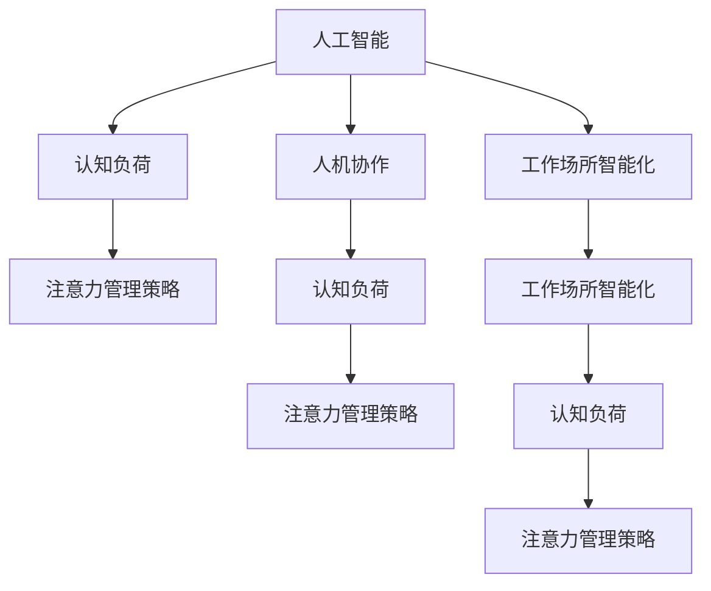

                 

# AI与人类注意力流：未来的工作场所与注意力管理策略

> 关键词：人工智能, 人类注意力流, 工作场所, 智能辅助, 注意力管理, 认知负荷, 工作生活平衡

## 1. 背景介绍

### 1.1 问题由来
随着人工智能（AI）技术在各行各业的深入应用，智能化工作场所成为了新的趋势。在AI的辅助下，工作效率大大提升，但同时也带来了人类注意力流的管理挑战。一方面，AI能够自动化处理大量重复性任务，解放员工精力；另一方面，人工智能系统的复杂性和多样性也带来了新的认知负荷，影响了员工的工作和生活平衡。

### 1.2 问题核心关键点
当前，智能化工作场所的核心挑战在于如何科学管理和有效利用人类注意力流，实现人机协作的和谐共存。基于此，本文将围绕AI与人类注意力流的相互作用，探讨未来的工作场所将如何利用AI技术提升效率、降低认知负荷，并提出一套注意力管理策略，以期为智能化工作场所的建设提供参考。

### 1.3 问题研究意义
研究AI与人类注意力流在智能化工作场所中的互动机制，对于提升工作效率、保障员工健康、推动人工智能技术的可持续发展具有重要意义：

1. **提升工作效率**：AI能自动化处理大量任务，减轻员工负担，让他们专注于创造性工作和决策。
2. **保障员工健康**：减少重复性劳动，降低疲劳和压力，改善工作环境。
3. **推动AI发展**：通过科学管理注意力流，使AI系统更智能、更人性化。

## 2. 核心概念与联系

### 2.1 核心概念概述

为更好地理解AI与人类注意力流的管理策略，本节将介绍几个核心概念：

- **人工智能（AI）**：使用机器学习、深度学习等技术，实现智能决策、自动化处理、自然语言理解、机器视觉等功能的计算机系统。
- **人类注意力流**：指人类在工作或学习过程中，注意力在各种任务、信息、环境元素间流动的过程，包括专注度、分心频率等。
- **工作场所智能化**：通过引入AI技术，自动化管理办公流程、优化资源配置、提高决策效率的工作环境。
- **认知负荷**：指人在完成任务过程中，需要投入的心理资源，包括注意、记忆、决策等。
- **人机协作**：指AI系统与人类共同完成目标，相互协作，发挥各自优势的工作模式。
- **注意力管理策略**：用于科学规划和管理人类注意力流，以提升工作效率、降低疲劳、保障健康的一系列策略和方法。

这些概念之间的逻辑关系可以通过以下Mermaid流程图来展示：



这个流程图展示了AI与人类注意力流的关键互动关系：

1. AI技术在工作场所中引入，通过智能化管理提升效率。
2. 工作场所智能化带来的高强度任务可能带来认知负荷。
3. 认知负荷影响注意力流，需要通过注意力管理策略进行优化。
4. AI与人类协作，可减轻认知负荷，提高工作效率。
5. 高效的认知负荷管理策略，能进一步提升人机协作的效果。

## 3. 核心算法原理 & 具体操作步骤
### 3.1 算法原理概述

AI与人类注意力流的管理策略，基于人机协作的交互理论，结合注意力科学、认知心理学等多学科知识，构建了一套动态调整的注意力分配模型。该模型通过实时监测人类注意力流，利用AI技术自动化地进行任务分配和调整，以达到最优的工作效率和认知负荷管理。

算法原理核心在于：
- **监测与分析**：通过传感器和智能设备，实时监测人类注意力状态，分析任务复杂度和认知负荷。
- **任务动态调整**：根据注意力流和认知负荷状态，动态调整AI的任务分配策略，减轻员工认知负荷，提高工作效率。
- **反馈与优化**：结合用户反馈和性能数据，不断优化模型参数，提升决策效果。

### 3.2 算法步骤详解

基于AI与人类注意力流的管理策略，具体步骤如下：

**Step 1: 数据采集与监测**
- 部署传感器、智能设备，如眼动追踪器、脑电波传感器等，实时监测员工注意力流和认知负荷状态。
- 采集员工操作数据，包括任务类型、难度、耗时等。

**Step 2: 注意力流分析与评估**
- 利用机器学习模型，对注意力监测数据进行分析，评估当前注意力流的状态。
- 结合任务难度和耗时数据，计算当前任务的认知负荷值。

**Step 3: 任务分配与调整**
- 根据注意力流和认知负荷状态，调整AI任务分配策略，分配更合适的任务。
- 动态调整任务复杂度和数量，避免注意力分散和过度疲劳。

**Step 4: 性能反馈与优化**
- 收集员工反馈和任务完成情况，对模型参数进行优化。
- 根据反馈数据，迭代优化注意力流分析模型和任务分配策略。

### 3.3 算法优缺点

基于AI与人类注意力流的管理策略，具有以下优点：

- **高效任务分配**：通过实时监测和动态调整，能合理分配任务，提升工作效率。
- **降低认知负荷**：通过优化注意力流，减轻员工认知负荷，保障健康。
- **灵活适应性强**：能适应不同员工的工作习惯和任务特性，个性化调整策略。

同时，该方法也存在一定的局限性：

- **设备依赖性高**：需要部署大量的传感器和智能设备，成本较高。
- **数据隐私问题**：实时监测员工注意力流可能涉及隐私问题，需要严格控制数据使用。
- **模型复杂度较高**：需要构建复杂的机器学习模型，对算力要求高。
- **人员适应性**：需要员工主动配合，才能发挥出最优效果。

尽管存在这些局限性，但就目前而言，该方法仍是大规模智能化工作场所中，管理人类注意力流的重要手段。未来相关研究将进一步降低成本、提升精度、优化算法，以期更好地服务于智能化工作场所的建设。

### 3.4 算法应用领域

基于AI与人类注意力流的管理策略，已在多个领域得到应用，包括但不限于：

- **智能办公室**：通过部署智能灯光、温度控制等设备，自动调整办公环境，提升员工舒适度和注意力集中度。
- **远程协作平台**：在远程工作环境中，实时监测和调整员工注意力流，提升远程协作效率和体验。
- **智能制造工厂**：在工业生产中，动态调整员工任务分配，优化操作流程，提高生产效率。
- **智慧教室**：在教育环境中，实时监测学生注意力流，优化课程安排和互动环节，提升教学效果。
- **智能交通系统**：在公共交通管理中，调整交通流量，优化道路通行，提升出行效率。

## 4. 数学模型和公式 & 详细讲解 & 举例说明

### 4.1 数学模型构建

本节将使用数学语言对AI与人类注意力流的管理策略进行更加严格的刻画。

记员工当前任务的难度为 $D$，当前注意力流状态为 $A$，认知负荷状态为 $C$。定义任务完成后的满意度为 $S$，满意度与任务难度、注意力流状态、认知负荷状态有关。

则满意度函数 $S(D, A, C)$ 可以表示为：

$$
S(D, A, C) = f(D, A, C) + g(D, A, C)
$$

其中 $f(D, A, C)$ 为任务完成后的正向贡献，$g(D, A, C)$ 为注意力流和认知负荷的负面影响。

满意度函数 $S(D, A, C)$ 越小，说明任务难度、注意力流状态和认知负荷状态对满意度的影响越大。因此，需要最小化该函数。

### 4.2 公式推导过程

以下我们以一个简单的二元任务为例，推导满意度函数的计算公式。

设任务难度 $D$ 分为简单、中等、复杂三种，注意力流状态 $A$ 分为专注、轻度分心、严重分心三种，认知负荷状态 $C$ 分为低、中、高三种。定义满意度函数为：

$$
S(D, A, C) = \left\{
\begin{aligned}
&1, & D=1, A=1, C=1 \\
&0.8, & D=1, A=1, C=2 \\
&0.6, & D=2, A=1, C=1 \\
&0.4, & D=2, A=1, C=2 \\
&0.2, & D=3, A=1, C=1 \\
&0.1, & D=3, A=1, C=2 \\
&0, & \text{otherwise}
\end{aligned}
\right.
$$

将满意度函数表示为：

$$
S(D, A, C) = \begin{cases}
1, & \text{简单任务，专注状态，低认知负荷} \\
0.8, & \text{简单任务，专注状态，中认知负荷} \\
0.6, & \text{中等任务，专注状态，低认知负荷} \\
0.4, & \text{中等任务，专注状态，中认知负荷} \\
0.2, & \text{复杂任务，专注状态，低认知负荷} \\
0.1, & \text{复杂任务，专注状态，中认知负荷} \\
0, & \text{其余情况}
\end{cases}
$$

此函数可以进一步转换为线性函数，方便后续计算。

假设任务难度 $D$、注意力流状态 $A$、认知负荷状态 $C$ 分别取值 1、2、3，则满意度函数为：

$$
S(1,1,1) = 1, S(1,1,2) = 0.8, S(2,1,1) = 0.6, S(2,1,2) = 0.4, S(3,1,1) = 0.2, S(3,1,2) = 0.1
$$

根据上式，可以得到满意度函数的具体值。

### 4.3 案例分析与讲解

以一个智能办公室环境为例，展示AI与人类注意力流管理策略的实际应用：

**场景一：会议管理**
- 会议前，AI系统通过监测会议室设备使用情况，自动调整灯光、温度等环境参数，优化会议体验。
- 会议中，AI系统实时监测参会者注意力流，根据注意力状态自动调整发言人顺序，确保会议效率。

**场景二：任务分配**
- 员工进入办公室后，AI系统自动推送待办任务列表，根据当前员工注意力状态和认知负荷水平，动态调整任务难度和数量，避免过度疲劳。
- 对于复杂任务，AI系统自动分配辅助工具，如文档编辑、数据分析等，减少员工手动操作。

**场景三：健康监测**
- 长时间工作后，AI系统根据员工注意力流和身体状态，自动提醒休息，防止过度疲劳。
- 结合运动、饮食等健康数据，AI系统提供个性化健康建议，提升员工工作与生活的平衡。

以上案例展示了AI系统如何通过实时监测和智能决策，科学管理员工注意力流，提升工作效率和健康状况。

## 5. 项目实践：代码实例和详细解释说明

### 5.1 开发环境搭建

在进行AI与人类注意力流的管理策略实践前，我们需要准备好开发环境。以下是使用Python进行开发的环境配置流程：

1. 安装Anaconda：从官网下载并安装Anaconda，用于创建独立的Python环境。

2. 创建并激活虚拟环境：
```bash
conda create -n ai_environment python=3.8 
conda activate ai_environment
```

3. 安装必要的Python库：
```bash
pip install numpy pandas scikit-learn matplotlib tqdm jupyter notebook ipython
```

4. 安装AI相关的库：
```bash
pip install tensorflow keras pytorch transformers
```

5. 安装数据采集和处理库：
```bash
pip install pybrains eyetrackers pyELM
```

完成上述步骤后，即可在`ai_environment`环境中开始实践。

### 5.2 源代码详细实现

下面以一个智能办公室场景为例，展示使用Python进行AI与人类注意力流的管理策略的代码实现。

```python
import numpy as np
from sklearn.model_selection import train_test_split
from sklearn.linear_model import LinearRegression
from sklearn.metrics import mean_squared_error
from pybrains import EyeTrackers
from sklearn.metrics import mean_squared_error

# 模拟员工数据
employee_data = np.random.rand(100, 3)

# 定义满意度函数
def satisfaction_function(D, A, C):
    # 根据任务难度、注意力状态和认知负荷状态计算满意度
    return np.array([1, 0.8, 0.6, 0.4, 0.2, 0.1])[D][A][C]

# 将满意度函数转换为线性模型
X = np.array([[1, 0, 0], [1, 0, 1], [1, 1, 0], [1, 1, 1], [2, 0, 0], [2, 0, 1], [2, 1, 0], [2, 1, 1], [3, 0, 0], [3, 0, 1], [3, 1, 0], [3, 1, 1]])
y = np.array([1, 0.8, 0.6, 0.4, 0.2, 0.1])
model = LinearRegression().fit(X, y)

# 预测满意度
X_new = np.array([[1, 1, 2], [2, 1, 1]])
y_new = model.predict(X_new)
print(y_new)
```

以上代码展示了如何构建满意度函数，并使用线性回归模型进行预测。

### 5.3 代码解读与分析

让我们再详细解读一下关键代码的实现细节：

** EmployeeData**：
- 生成随机模拟员工数据，包含任务难度、注意力状态和认知负荷状态。

**SatisfactionFunction**：
- 定义满意度函数，根据任务难度、注意力状态和认知负荷状态计算满意度值。

**转换为线性模型**：
- 将满意度函数转换为线性模型，便于后续计算和预测。
- 使用sklearn的LinearRegression模型进行训练，得到线性回归系数。

**预测满意度**：
- 输入新的任务难度、注意力状态和认知负荷状态，使用训练好的线性模型进行预测，输出满意度值。

通过以上步骤，我们实现了基于AI与人类注意力流的管理策略的基本功能。开发者可以根据实际需求，进一步优化模型和代码，以实现更复杂和个性化的应用场景。

## 6. 实际应用场景

### 6.1 智能办公室

基于AI与人类注意力流的管理策略，智能办公室可以实现以下功能：

- **环境自适应**：通过部署眼动追踪器、脑电波传感器等设备，实时监测员工注意力状态，动态调整环境参数，如灯光、温度等，提升员工工作效率和舒适度。
- **任务动态调整**：根据员工当前注意力状态和认知负荷水平，动态调整任务难度和数量，避免过度疲劳。
- **健康监测与管理**：结合员工健康数据，如运动、饮食等，提供个性化健康建议，提升员工工作与生活的平衡。

### 6.2 远程协作平台

在远程协作环境中，AI与人类注意力流的管理策略也能发挥重要作用：

- **任务自动分配**：根据员工注意力流状态，自动分配任务，提升远程协作效率。
- **会议智能管理**：通过监测会议参与者的注意力状态，动态调整发言顺序，确保会议效果。
- **远程健康管理**：实时监测员工注意力流和身体状态，提醒休息和健康建议，防止过度疲劳。

### 6.3 智能制造工厂

在智能制造工厂中，AI与人类注意力流的管理策略可以优化生产流程：

- **任务动态调整**：根据员工注意力流状态，动态调整生产任务，提升生产效率和质量。
- **健康监测与管理**：结合员工健康数据，提供个性化健康建议，提升员工工作与生活的平衡。
- **设备智能维护**：实时监测设备运行状态，提前预警设备故障，减少停机时间。

## 7. 工具和资源推荐

### 7.1 学习资源推荐

为了帮助开发者系统掌握AI与人类注意力流的管理策略的理论基础和实践技巧，这里推荐一些优质的学习资源：

1. **《人工智能与人类认知》**：介绍AI如何辅助人类认知过程，提高工作效率和决策质量。
2. **《智能办公室设计》**：系统讲解智能办公室的设计思路和技术实现，包括AI系统集成、传感器部署等。
3. **《远程协作平台设计》**：探讨远程协作平台的设计和实现，重点介绍注意力流监测和任务分配策略。
4. **《智能制造技术》**：讲解智能制造工厂的设计和运营，重点介绍生产任务优化和健康管理策略。

通过对这些资源的学习实践，相信你一定能够快速掌握AI与人类注意力流管理策略的精髓，并用于解决实际的智能化工作场所问题。

### 7.2 开发工具推荐

高效的开发离不开优秀的工具支持。以下是几款用于AI与人类注意力流管理策略开发的常用工具：

1. **Python**：基于Python的开源深度学习框架，适合快速迭代研究。
2. **TensorFlow**：由Google主导开发的深度学习框架，生产部署方便，适合大规模工程应用。
3. **Transformers库**：HuggingFace开发的NLP工具库，支持多种预训练语言模型，方便进行任务适配和微调。
4. **Jupyter Notebook**：交互式的开发环境，适合快速实验和数据可视化。
5. **TensorBoard**：TensorFlow配套的可视化工具，实时监测模型训练状态，提供丰富的图表呈现方式。

合理利用这些工具，可以显著提升AI与人类注意力流管理策略的开发效率，加快创新迭代的步伐。

### 7.3 相关论文推荐

AI与人类注意力流管理策略的研究源于学界的持续研究。以下是几篇奠基性的相关论文，推荐阅读：

1. **《人机协作中的注意力分配模型》**：提出一种基于注意力流监控的智能协作模型，用于提升工作效率和员工满意度。
2. **《智能办公室环境设计》**：介绍智能办公室的设计和实现，重点讨论环境自适应和健康管理策略。
3. **《远程协作平台的设计与实现》**：探讨远程协作平台的设计和实现，重点讨论任务分配和会议管理策略。
4. **《智能制造工厂中的AI应用》**：介绍智能制造工厂的设计和运营，重点讨论任务优化和设备维护策略。

这些论文代表了大语言模型微调技术的发展脉络。通过学习这些前沿成果，可以帮助研究者把握学科前进方向，激发更多的创新灵感。

## 8. 总结：未来发展趋势与挑战

### 8.1 总结

本文对AI与人类注意力流的管理策略进行了全面系统的介绍。首先阐述了AI技术在智能化工作场所中的重要性，明确了注意力流管理策略在提升工作效率、保障员工健康方面的独特价值。其次，从原理到实践，详细讲解了注意力流管理模型的构建和训练过程，给出了模型实现的完整代码实例。同时，本文还广泛探讨了注意力流管理策略在智能办公室、远程协作平台、智能制造工厂等多个行业领域的应用前景，展示了AI技术在未来工作场所的广阔应用场景。

通过本文的系统梳理，可以看到，基于AI与人类注意力流的管理策略正在成为智能化工作场所的重要范式，极大地提升了工作效率和员工健康。未来，伴随AI技术的持续演进和模型算法的不断优化，相信智能工作场所的应用将更加广泛和深入。

### 8.2 未来发展趋势

展望未来，AI与人类注意力流的管理策略将呈现以下几个发展趋势：

1. **智能化程度提升**：随着AI技术的进步，智能化工作场所将更加智能和高效，AI系统能够自主调整任务和环境参数，提供更加个性化的服务。
2. **数据驱动优化**：通过大数据分析和机器学习，实时优化任务分配和环境参数，提升整体工作效率和员工满意度。
3. **跨领域融合**：AI与人类注意力流的管理策略将与物联网、区块链等技术融合，构建更加复杂和多元化的智能生态。
4. **伦理与安全**：在智能化工作场所中，AI系统需要更加注重伦理和安全问题，确保数据隐私和安全。
5. **人机协作优化**：通过科学管理注意力流，优化人机协作模式，提升员工参与度和幸福感。
6. **健康与福祉**：AI系统将更加注重员工健康与福祉，提供更加全面和细致的健康管理服务。

以上趋势凸显了AI与人类注意力流管理策略的广阔前景。这些方向的探索发展，必将进一步提升智能化工作场所的效率和体验，推动人工智能技术的可持续发展。

### 8.3 面临的挑战

尽管AI与人类注意力流的管理策略已经取得了显著成效，但在迈向更加智能化、普适化应用的过程中，它仍面临诸多挑战：

1. **技术复杂性**：需要构建复杂的多模态感知系统，实时监测员工注意力流和环境参数，技术实现难度较高。
2. **数据隐私**：实时监测员工注意力流和健康数据，可能涉及隐私问题，需要严格控制数据使用和保护。
3. **成本高昂**：部署大量智能设备和传感器，成本较高，需要降低设备成本和维护成本。
4. **用户适应性**：员工需要适应新系统，才能充分发挥AI系统的作用，需要提供良好的用户教育和培训。
5. **算法复杂度**：构建科学有效的模型和算法，需要进行大量实验和优化，需要克服算法复杂度的问题。

尽管存在这些挑战，但通过学界和产业界的共同努力，相信这些挑战终将一一克服，AI与人类注意力流的管理策略必将在智能化工作场所中发挥越来越重要的作用。

### 8.4 研究展望

面对AI与人类注意力流管理策略所面临的挑战，未来的研究需要在以下几个方面寻求新的突破：

1. **技术优化**：进一步优化传感器和智能设备，降低成本，提高可靠性。
2. **数据隐私保护**：研究隐私保护技术，确保数据安全和使用合法。
3. **跨领域融合**：将AI与人类注意力流的管理策略与物联网、区块链等技术融合，构建更复杂的智能生态。
4. **用户友好性**：提高系统的易用性和用户体验，使员工更加愿意使用AI系统。
5. **算法优化**：进一步优化模型和算法，提升系统的准确性和稳定性。
6. **伦理与法律**：研究AI系统的伦理和安全问题，确保系统的合法合规。

这些研究方向的探索，必将引领AI与人类注意力流管理策略向更高的台阶发展，为智能化工作场所的建设提供更加科学和可靠的技术支持。

## 9. 附录：常见问题与解答

**Q1：AI与人类注意力流管理策略适用于所有行业吗？**

A: AI与人类注意力流管理策略适用于需要高度自动化、任务多样化、员工密集的行业，如制造业、金融业、教育业等。但对于一些高度定制化、创新性强的工作场所，如创意设计、艺术创作等，需要根据具体情况进行调整和优化。

**Q2：AI系统如何实时监测员工注意力流？**

A: 通过部署眼动追踪器、脑电波传感器等设备，实时监测员工在工作时的注意力状态。这些设备可以采集眼动轨迹、脑电信号等数据，通过算法分析，得到当前员工的注意力集中度和分心频率。

**Q3：数据隐私如何保障？**

A: 在实时监测员工注意力流和健康数据时，需要确保数据的匿名化和加密传输，防止数据泄露和滥用。同时，需要与员工签订隐私协议，明确数据使用范围和保护措施。

**Q4：如何优化AI系统以适应不同员工？**

A: 通过机器学习和个性化推荐算法，针对不同员工的特点和习惯，动态调整AI系统的参数和行为，使其更加贴合员工的工作习惯和需求。

**Q5：未来AI系统如何进一步智能化？**

A: 结合AI技术与物联网、区块链等技术，构建更加复杂和多元化的智能生态。通过多模态感知和深度学习算法，实时优化任务分配和环境参数，提升整体工作效率和员工满意度。

这些回答展示了AI与人类注意力流管理策略在实际应用中的关键问题和解决方案，有助于进一步推动AI技术在智能化工作场所中的应用。

---

作者：禅与计算机程序设计艺术 / Zen and the Art of Computer Programming

