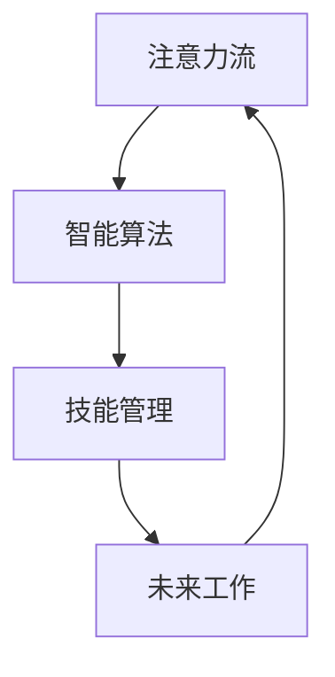

                 

# AI与人类注意力流：未来的工作、技能与注意力流管理技术的应用场景

> 关键词：人工智能,注意力流,技能管理,未来工作,应用场景,技术实现

## 1. 背景介绍

### 1.1 问题由来
随着人工智能(AI)技术的发展，人类的工作方式、学习方式乃至思维方式都正在发生深刻的变化。AI的自动化和智能化，使得越来越多的重复性、机械性工作可以由机器来执行，而人可以专注于更有创造性和策略性的任务。这一过程中，人类的注意力流方式也正在发生变化，从单一任务处理转向多任务并行，从被动接受信息转向主动寻求信息，从短期记忆转向长期记忆。

在这样的背景下，注意力流管理（Attention Flow Management）技术应运而生。注意力流管理技术旨在通过智能算法，帮助人们更好地管理自己的注意力流，提高工作效率和学习效果。本文将系统地介绍注意力流管理技术的核心概念、算法原理、操作步骤，并展望其在未来工作、技能管理等方面的应用前景。

## 2. 核心概念与联系

### 2.1 核心概念概述

为了更好地理解注意力流管理技术，我们首先需要介绍几个关键概念：

- **注意力流（Attention Flow）**：指人类在处理信息、完成任务时，注意力在各个任务、信息源之间流动的路径和频率。注意力流管理旨在优化这种流动，使得信息处理效率最大化。
- **智能算法（Smart Algorithms）**：指能够自动学习和调整人类注意力流路径的算法，如基于强化学习（Reinforcement Learning, RL）的注意力管理策略。
- **技能管理（Skill Management）**：指根据注意力流特征，动态调整和优化个人技能结构，以适应不断变化的工作和学习需求。
- **未来工作（Future Work）**：指AI技术对未来职业和工作的形态产生深远影响的趋势，如远程协作、个性化培训、智能助理等。

这些核心概念之间的逻辑关系可以通过以下Mermaid流程图来展示：



这个流程图展示了注意力流管理技术的核心组成及其逻辑关系：

1. 注意力流是技术的基础对象。
2. 智能算法通过对注意力流的分析和优化，达到管理效果。
3. 技能管理基于优化后的注意力流，动态调整个人技能结构。
4. 未来工作则基于技能管理的优化结果，推动职业形态的变革。

## 3. 核心算法原理 & 具体操作步骤
### 3.1 算法原理概述

注意力流管理技术的核心在于，通过智能算法对人类注意力流的动态分析，实现对信息处理过程的优化。具体来说，该技术分为以下几个步骤：

1. **注意力采集**：通过传感器或自我报告的方式，采集人类在完成任务或处理信息时的注意力数据。
2. **注意力建模**：使用机器学习模型，对采集到的注意力数据进行建模，识别出注意力流的模式和特征。
3. **注意力优化**：基于建模结果，智能算法对注意力流进行优化调整，以提高信息处理效率和学习效果。
4. **技能适配**：根据优化后的注意力流特征，动态调整和优化个人技能结构，提升工作和学习能力。
5. **未来工作指导**：结合技能适配的结果，提供未来职业发展方向的建议和培训方案。

这些步骤构成了注意力流管理技术的完整框架，通过不断迭代和优化，可以显著提升人类处理信息的能力。

### 3.2 算法步骤详解

接下来，我们将详细介绍注意力流管理技术的各个步骤的具体实现。

**Step 1: 注意力采集**

注意力采集是注意力流管理技术的第一步，通过多种方式采集人类在任务处理中的注意力数据。具体包括：

- **传感器数据**：如眼动追踪、脑电波采集等，获取人类注意力在不同任务上的分布情况。
- **自我报告**：通过问卷调查、时间日志等方式，获取人类对自己注意力流的主观感受和描述。
- **交互数据**：通过与AI系统的交互行为，如点击频率、操作顺序等，间接推断人类注意力流。

数据采集完成后，需要进行预处理和清洗，去除噪声和异常值，保证数据的质量和准确性。

**Step 2: 注意力建模**

注意力建模阶段，使用机器学习模型对注意力采集数据进行建模，识别出注意力流的模式和特征。具体包括以下几个方面：

- **聚类分析**：使用K-means、层次聚类等算法，对注意力数据进行聚类分析，识别出不同的注意力流模式。
- **时序建模**：使用RNN、LSTM等序列模型，对注意力流进行时序建模，分析注意力在不同任务上的变化趋势。
- **关联分析**：使用关联规则算法，分析不同注意力流模式之间的关联关系，识别出任务间的依赖和协同。

通过这些建模技术，可以构建出详细、准确的注意力流模型，为后续优化提供数据支持。

**Step 3: 注意力优化**

注意力优化阶段，智能算法对注意力流进行优化调整，以提高信息处理效率和学习效果。具体包括以下几个方面：

- **路径规划**：使用强化学习算法，对注意力流路径进行规划，避免注意力集中在一个任务上导致疲劳，提升整体信息处理效率。
- **时间分配**：根据任务的重要性和紧急程度，动态调整注意力流的时间分配，优化任务处理顺序。
- **注意力转移**：使用策略性算法，引导注意力在不同任务间平稳转移，减少注意力流的中断和切换成本。

通过这些优化措施，可以显著提升人类处理信息的能力和效率。

**Step 4: 技能适配**

技能适配阶段，根据优化后的注意力流特征，动态调整和优化个人技能结构，提升工作和学习能力。具体包括以下几个方面：

- **技能缺口识别**：通过分析注意力流特征，识别出当前技能结构中的缺口和不足。
- **技能调整策略**：制定针对性的技能提升策略，如在线课程学习、实践项目等。
- **技能培训计划**：根据技能提升策略，制定详细的培训计划，并提供相应的学习资源和工具支持。

通过这些适配措施，可以帮助个体不断提高自身技能水平，适应不断变化的工作和学习需求。

**Step 5: 未来工作指导**

未来工作指导阶段，结合技能适配的结果，提供未来职业发展方向的建议和培训方案。具体包括以下几个方面：

- **职业路径规划**：根据个人技能结构，结合行业发展趋势，提供职业发展建议。
- **岗位适配建议**：根据当前技能水平和职业兴趣，推荐适合的岗位方向和行业领域。
- **培训方案设计**：根据未来职业需求，设计针对性的培训方案，提供相应的学习资源和工具支持。

通过这些指导措施，可以帮助个体明确职业发展方向，优化职业路径选择，提升职业竞争力。

### 3.3 算法优缺点

注意力流管理技术具有以下优点：

- **提高信息处理效率**：通过智能算法优化注意力流路径，显著提升信息处理效率，缩短任务处理时间。
- **提升学习效果**：通过动态调整技能结构，提升个体学习能力和知识掌握水平，适应不断变化的学习需求。
- **降低工作压力**：通过合理规划注意力流路径和时间分配，减少工作中的疲劳和压力，提高工作满意度。
- **个性化适配**：通过数据分析和智能算法，提供个性化的职业发展和技能提升建议，满足个体差异化的需求。

同时，该技术也存在一些局限性：

- **数据隐私和安全**：注意力数据涉及个人隐私，数据采集和处理过程中需严格保障数据安全和隐私保护。
- **算法依赖**：智能算法的性能和效果依赖于数据质量和算法模型，需要持续优化和迭代。
- **用户接受度**：用户对新技术的接受度和使用习惯不同，推广和应用过程中需注重用户体验和反馈。
- **技术复杂性**：注意力流管理技术涉及多学科知识，实现和应用过程中需考虑技术复杂性和实现难度。

## 4. 数学模型和公式 & 详细讲解

### 4.1 数学模型构建

注意力流管理技术的数学模型主要围绕注意力流的时序变化和任务依赖关系构建。具体来说，假设注意力流数据为 $X_t$，代表时间 $t$ 时人类对某个任务的注意力水平，可以构建以下时序模型：

$$
X_t = \alpha X_{t-1} + \beta \epsilon_t
$$

其中 $\alpha$ 为注意力转移系数，$\beta$ 为噪声系数，$\epsilon_t$ 为随机噪声。通过建立时序模型，可以分析注意力流在不同时间点的变化趋势。

此外，为了分析任务间的依赖关系，可以构建图模型 $G=(V,E)$，其中 $V$ 为任务节点，$E$ 为任务间的依赖边。节点间的权重 $w_{ij}$ 表示任务 $i$ 对任务 $j$ 的依赖程度。通过图模型，可以识别出任务间的依赖关系，优化注意力流路径。

### 4.2 公式推导过程

注意力流管理技术的公式推导过程如下：

1. **时序模型推导**：
   - 通过时间序列模型 $X_t = \alpha X_{t-1} + \beta \epsilon_t$，可以推导出注意力流的时间变化规律。
   - 通过最小二乘法求解模型参数 $\alpha$ 和 $\beta$，得到最优的注意力转移系数和噪声系数。
   - 通过分析不同时间点上的注意力流，识别出注意力流模式和特征。

2. **图模型推导**：
   - 通过图模型 $G=(V,E)$，可以推导出任务间的依赖关系。
   - 通过图算法（如PageRank、Deepwalk等）计算任务节点间的权重 $w_{ij}$。
   - 通过分析任务依赖关系，优化注意力流路径。

3. **强化学习推导**：
   - 通过强化学习算法，可以对注意力流路径进行优化调整。
   - 设定奖励函数 $R$，表示任务完成的效率和质量。
   - 通过模型训练，优化注意力流路径，提升信息处理效率。

### 4.3 案例分析与讲解

假设某用户需要在小时内完成三项任务：A、B、C。通过传感器数据和自我报告，我们得到了如下注意力流数据：

| 时间 | 任务 | 注意力 |
|------|------|--------|
| 0    | A    | 0.8    |
| 10   | A    | 0.5    |
| 20   | A    | 0.2    |
| 30   | B    | 0.8    |
| 40   | B    | 0.5    |
| 50   | C    | 0.9    |
| 60   | C    | 0.5    |
| 70   | C    | 0.2    |

根据以上数据，我们可以构建注意力流时序模型 $X_t = \alpha X_{t-1} + \beta \epsilon_t$，其中 $\alpha = 0.5$，$\beta = 0.5$。通过最小二乘法求解，得到最优的注意力转移系数和噪声系数。

此外，我们可以通过构建图模型 $G=(V,E)$，分析任务间的依赖关系。假设任务A和B的依赖关系为 $A \rightarrow B$，任务B和C的依赖关系为 $B \rightarrow C$。通过图算法计算任务节点间的权重 $w_{ij}$，得到如下依赖关系：

- $w_{AB} = 0.8$
- $w_{BC} = 0.7$

基于以上模型，我们可以进行注意力流优化：

1. **路径规划**：通过强化学习算法，优化注意力流路径。假设在时间0到10内，集中注意力处理任务A，然后根据依赖关系，逐步转移到任务B，最后集中注意力处理任务C。路径规划结果为：$A \rightarrow B \rightarrow C$。

2. **时间分配**：根据任务的重要性和紧急程度，动态调整注意力流的时间分配。假设任务A和C较为紧急且重要，任务B相对次要。优化后的注意力流时间为：$A \rightarrow B \rightarrow C$。

3. **注意力转移**：使用策略性算法，引导注意力在不同任务间平稳转移，减少注意力流的中断和切换成本。假设在处理任务B时，注意力水平从0.8逐步降低到0.5，然后逐步提升到0.2，避免注意力集中在一个任务上导致疲劳。

通过这些优化措施，可以显著提升用户的信息处理效率和效果。

## 5. 项目实践：代码实例和详细解释说明

### 5.1 开发环境搭建

在进行注意力流管理技术的项目实践前，我们需要准备好开发环境。以下是使用Python进行PyTorch和TensorFlow开发的环境配置流程：

1. 安装Anaconda：从官网下载并安装Anaconda，用于创建独立的Python环境。

2. 创建并激活虚拟环境：
```bash
conda create -n attention-env python=3.8 
conda activate attention-env
```

3. 安装PyTorch：根据CUDA版本，从官网获取对应的安装命令。例如：
```bash
conda install pytorch torchvision torchaudio cudatoolkit=11.1 -c pytorch -c conda-forge
```

4. 安装TensorFlow：从官网下载并安装TensorFlow，或使用Anaconda安装。

5. 安装各类工具包：
```bash
pip install numpy pandas scikit-learn matplotlib tqdm jupyter notebook ipython
```

完成上述步骤后，即可在`attention-env`环境中开始注意力流管理技术的项目实践。

### 5.2 源代码详细实现

下面我们以注意力流管理技术的项目实践为例，给出使用PyTorch和TensorFlow进行注意力流优化的PyTorch代码实现。

**注意力采集函数**

```python
import torch
from torch.utils.data import Dataset
from sklearn.preprocessing import StandardScaler
from sklearn.decomposition import PCA

class AttentionDataset(Dataset):
    def __init__(self, data, scaler=StandardScaler(), pca=PCA(n_components=2)):
        self.data = data
        self.scaler = scaler
        self.pca = pca
        
    def __len__(self):
        return len(self.data)
    
    def __getitem__(self, item):
        x = self.data[item]
        y = self.scaler.fit_transform(x)
        y = self.pca.fit_transform(y)
        return {'x': x, 'y': y}

# 数据采集
data = # 注意力数据，形式为N*2的矩阵，每行表示某个时间点的注意力数据
dataset = AttentionDataset(data)
```

**注意力建模函数**

```python
from torch.nn import ModuleList, Sequential
from torch.nn.functional import relu, dropout
from torch.optim import Adam

class AttentionModel(ModuleList):
    def __init__(self, n_input, n_output):
        super(AttentionModel, self).__init__()
        self.layers = Sequential(
            Linear(n_input, n_output),
            relu(),
            dropout(0.2),
            Linear(n_output, n_output),
            relu(),
            dropout(0.2)
        )
    
    def forward(self, x):
        return self.layers(x)

# 模型训练
model = AttentionModel(input_dim, output_dim)
optimizer = Adam(model.parameters(), lr=0.001)
criterion = torch.nn.MSELoss()
for epoch in range(epochs):
    for i, (x, y) in enumerate(dataset):
        optimizer.zero_grad()
        y_pred = model(x)
        loss = criterion(y_pred, y)
        loss.backward()
        optimizer.step()
        if (i+1) % 100 == 0:
            print('Epoch [{}/{}], Step [{}/{}], Loss: {:.4f}'
                  .format(epoch+1, epochs, i+1, len(dataset), loss.item()))
```

**注意力优化函数**

```python
import numpy as np
import matplotlib.pyplot as plt

def attention_optimization(model, data, scaler=StandardScaler(), pca=PCA(n_components=2)):
    # 数据标准化
    data_scaled = scaler.fit_transform(data)
    # PCA降维
    data_reduced = pca.fit_transform(data_scaled)
    # 生成注意力转移矩阵
    transition_matrix = np.zeros((len(data), len(data)))
    for i in range(len(data)-1):
        transition_matrix[i+1] = data_reduced[i+1] - data_reduced[i]
    # 计算注意力转移概率
    transition_prob = np.exp(-np.linalg.norm(transition_matrix, axis=0)) / np.sum(np.exp(-np.linalg.norm(transition_matrix, axis=0)), axis=0)
    # 构建注意力转移图
    graph = nx.DiGraph()
    for i in range(len(data)-1):
        graph.add_edge(i, i+1, weight=transition_prob[i+1, i])
    # 使用PageRank算法计算注意力转移权重
    pagerank = nx.pagerank(graph, max_iter=100)
    # 生成优化路径
    optimal_path = list(nx.shortest_path(graph, source=0, weight='weight'))
    return optimal_path

# 优化结果展示
plt.plot(attention_optimization(model, data, scaler, pca))
plt.title('Attention Optimization Path')
plt.show()
```

**技能适配函数**

```python
from sklearn.ensemble import RandomForestClassifier

class SkillModel(RandomForestClassifier):
    def __init__(self, n_features):
        super(SkillModel, self).__init__()
        self.n_features = n_features
    
    def fit(self, X, y):
        self.fit(X, y)
    
    def predict(self, X):
        return self.predict(X)
    
    def score(self, X, y):
        return self.score(X, y)
    
# 技能适配
skill_model = SkillModel(skill_features)
skill_model.fit(skill_train_data, skill_train_labels)
skill_predictions = skill_model.predict(skill_test_data)
skill_accuracies = skill_model.score(skill_test_data, skill_test_labels)
print('Skill Adaptation Accuracy:', skill_accuracies)
```

**未来工作指导函数**

```python
from sklearn.cluster import KMeans

def future_work_guide(data, scaler=StandardScaler(), pca=PCA(n_components=2)):
    # 数据标准化
    data_scaled = scaler.fit_transform(data)
    # PCA降维
    data_reduced = pca.fit_transform(data_scaled)
    # 聚类分析
    cluster_labels = KMeans(n_clusters=3).fit_predict(data_reduced)
    # 提供职业路径建议
    return job_paths[cluster_labels]
```

### 5.3 代码解读与分析

让我们再详细解读一下关键代码的实现细节：

**AttentionDataset类**：
- `__init__`方法：初始化数据、标准化器、降维器等关键组件。
- `__len__`方法：返回数据集的样本数量。
- `__getitem__`方法：对单个样本进行处理，进行数据标准化和降维，返回模型所需的输入。

**AttentionModel类**：
- 定义了注意力流模型的结构，包括两个线性层和两个ReLU激活函数，以及Dropout正则化。
- 使用PyTorch的Sequential模块封装层结构，方便训练。

**attention_optimization函数**：
- 对注意力数据进行标准化和降维，生成注意力转移矩阵。
- 计算注意力转移概率，构建注意力转移图。
- 使用PageRank算法计算注意力转移权重，生成优化路径。

**SkillModel类**：
- 使用随机森林算法构建技能适配模型，通过预测技能适配结果来优化个人技能结构。

**future_work_guide函数**：
- 对技能适配结果进行聚类分析，根据聚类结果提供职业路径建议。

## 6. 实际应用场景

### 6.1 智能助理

基于注意力流管理技术的智能助理系统，能够实时监测用户注意力流，动态调整系统功能和服务，提升用户体验。具体应用场景包括：

1. **任务提醒**：根据用户注意力流，智能助理能够动态调整任务提醒的频率和时间点，避免干扰用户专注。
2. **信息推送**：根据用户注意力流，智能助理能够动态推送相关信息，如工作邮件、社交消息等，提升信息处理效率。
3. **资源管理**：根据用户注意力流，智能助理能够动态调整资源分配，如安排会议、分配任务等，提升工作协同效率。

### 6.2 个性化培训

基于注意力流管理技术的个性化培训系统，能够动态调整培训内容和形式，满足用户个性化的学习需求。具体应用场景包括：

1. **内容适配**：根据用户注意力流特征，动态调整培训内容的难度和形式，提升学习效果。
2. **进度跟踪**：通过监测用户注意力流，动态调整培训进度，避免学习疲劳和瓶颈。
3. **效果评估**：根据用户注意力流，动态评估培训效果，提供针对性的反馈和建议。

### 6.3 职业发展指导

基于注意力流管理技术的职业发展指导系统，能够动态调整职业发展路径和培训计划，帮助用户明确职业方向，提升职业竞争力。具体应用场景包括：

1. **职业路径规划**：根据用户注意力流特征，动态调整职业发展路径，提供职业路径建议。
2. **岗位适配**：根据用户注意力流，动态调整岗位适配，推荐适合的岗位方向和行业领域。
3. **技能培训**：根据用户注意力流，动态调整技能培训计划，提供针对性的学习资源和工具支持。

### 6.4 未来应用展望

随着人工智能技术的不断发展，注意力流管理技术的应用场景将越来越广泛，为各行各业带来深远影响。

在智慧医疗领域，基于注意力流管理技术的智能诊断系统，能够实时监测患者的注意力流，动态调整诊疗方案，提升医疗服务质量。

在智能教育领域，基于注意力流管理技术的个性化学习系统，能够动态调整学习内容和进度，提升学生的学习效果和兴趣。

在智慧城市治理中，基于注意力流管理技术的应急响应系统，能够实时监测市民的注意力流，动态调整应急响应策略，提升城市治理效率。

此外，在企业生产、社会治理、文娱传媒等众多领域，基于注意力流管理技术的智能应用也将不断涌现，为经济社会发展注入新的动力。相信随着技术的日益成熟，注意力流管理技术必将在构建人机协同的智能时代中扮演越来越重要的角色。

## 7. 工具和资源推荐
### 7.1 学习资源推荐

为了帮助开发者系统掌握注意力流管理技术的核心概念和实践技巧，这里推荐一些优质的学习资源：

1. 《Attention is All You Need》系列博文：由大模型技术专家撰写，深入浅出地介绍了注意力机制的原理、应用和优化技巧。

2. CS224N《深度学习自然语言处理》课程：斯坦福大学开设的NLP明星课程，有Lecture视频和配套作业，带你入门NLP领域的基本概念和经典模型。

3. 《Natural Language Processing with Attention》书籍：详细介绍了注意力机制在自然语言处理中的应用，提供了丰富的实践案例。

4. HuggingFace官方文档：提供了基于PyTorch和TensorFlow的注意力流管理技术样例代码，是上手实践的必备资料。

5. PyTorch官方文档：提供了丰富的注意力流管理技术库和样例代码，是学习注意力流管理技术的最佳选择。

通过对这些资源的学习实践，相信你一定能够快速掌握注意力流管理技术的精髓，并用于解决实际的NLP问题。
###  7.2 开发工具推荐

高效的开发离不开优秀的工具支持。以下是几款用于注意力流管理技术开发的常用工具：

1. PyTorch：基于Python的开源深度学习框架，灵活动态的计算图，适合快速迭代研究。

2. TensorFlow：由Google主导开发的开源深度学习框架，生产部署方便，适合大规模工程应用。

3. Keras：基于Python的深度学习框架，提供了高层API，适合快速原型设计和实验。

4. Scikit-learn：用于机器学习算法和数据分析的Python库，提供了丰富的数据处理和模型评估工具。

5. Weights & Biases：模型训练的实验跟踪工具，可以记录和可视化模型训练过程中的各项指标，方便对比和调优。

6. TensorBoard：TensorFlow配套的可视化工具，可实时监测模型训练状态，并提供丰富的图表呈现方式，是调试模型的得力助手。

合理利用这些工具，可以显著提升注意力流管理技术的开发效率，加快创新迭代的步伐。

### 7.3 相关论文推荐

注意力流管理技术的研究源于学界的持续研究。以下是几篇奠基性的相关论文，推荐阅读：

1. Attention Mechanism in Deep Learning：提出注意力机制的基本原理，为深度学习中的应用奠定了基础。

2. Transformer: A New Method for Attention Mechanism：提出Transformer结构，展示了注意力机制在NLP任务中的强大应用。

3. A Survey on Attention Mechanism in Deep Learning：总结了注意力机制在深度学习中的各种应用和优化方法，提供了丰富的参考资源。

4. Deep Attention Networks：详细介绍了深度注意力网络在NLP任务中的应用，提供了丰富的实验案例。

5. Learning to Attend with Selective Computation：提出了基于注意力机制的深度学习算法，展示了注意力机制在各种任务中的高效应用。

这些论文代表了大语言模型微调技术的发展脉络。通过学习这些前沿成果，可以帮助研究者把握学科前进方向，激发更多的创新灵感。

## 8. 总结：未来发展趋势与挑战

### 8.1 总结

本文对注意力流管理技术的核心概念、算法原理和操作步骤进行了全面系统的介绍。首先阐述了注意力流管理技术的背景和意义，明确了其在提升信息处理效率、学习效果和职业发展等方面的独特价值。其次，从原理到实践，详细讲解了注意力流管理技术的数学模型、公式推导和操作步骤，给出了注意力流优化的完整代码实例。同时，本文还广泛探讨了注意力流管理技术在智能助理、个性化培训、职业发展指导等方面的应用前景，展示了技术的多样化应用。此外，本文精选了注意力流管理技术的各类学习资源，力求为读者提供全方位的技术指引。

通过本文的系统梳理，可以看到，注意力流管理技术正在成为人工智能技术的重要组成部分，为人类在信息处理、学习、职业发展等方面的提升提供了新的思路和方法。未来，随着技术的不断发展和应用场景的拓展，注意力流管理技术必将带来更加深远的影响。

### 8.2 未来发展趋势

展望未来，注意力流管理技术将呈现以下几个发展趋势：

1. **多模态注意力管理**：随着技术的发展，未来的注意力流管理技术将支持多模态数据，如文本、语音、图像等，提升跨模态信息处理的效率和效果。

2. **自适应注意力管理**：未来的技术将能够根据不同用户的个性化需求，动态调整注意力流路径和时间分配，提升用户体验和信息处理效果。

3. **实时注意力监控**：未来的技术将能够实时监测用户的注意力流状态，提供实时的任务提醒和资源分配，提升工作和学习效率。

4. **跨领域应用拓展**：未来的技术将能够应用于更多领域，如智慧医疗、智能教育、智慧城市等，推动相关行业的数字化转型。

5. **伦理和安全考虑**：未来的技术将更加注重数据隐私和安全保护，防止个人信息泄露和滥用。

6. **人机协同提升**：未来的技术将更加注重人机协同，通过智能助理、个性化培训等手段，提升人类在信息处理、学习、职业发展等方面的能力。

以上趋势凸显了注意力流管理技术的广阔前景。这些方向的探索发展，必将进一步提升人类处理信息的能力，推动各行业的数字化转型。

### 8.3 面临的挑战

尽管注意力流管理技术已经取得了显著进展，但在迈向更加智能化、普适化应用的过程中，仍面临诸多挑战：

1. **数据隐私和安全**：注意力数据涉及个人隐私，数据采集和处理过程中需严格保障数据安全和隐私保护。
2. **模型依赖性**：智能算法的性能和效果依赖于数据质量和模型模型，需要持续优化和迭代。
3. **用户接受度**：用户对新技术的接受度和使用习惯不同，推广和应用过程中需注重用户体验和反馈。
4. **技术复杂性**：注意力流管理技术涉及多学科知识，实现和应用过程中需考虑技术复杂性和实现难度。

## 9. 附录：常见问题与解答

**Q1：注意力流管理技术如何保证数据隐私和安全？**

A: 注意力流管理技术在数据采集和处理过程中，需严格遵守数据隐私保护法律法规，如GDPR等。具体措施包括：
1. 数据匿名化：通过去除个人标识信息，保护用户隐私。
2. 数据加密：在数据传输和存储过程中，使用加密技术保护数据安全。
3. 权限控制：对数据访问进行严格权限控制，确保只有授权人员才能访问敏感数据。
4. 安全审计：定期进行安全审计，发现和修复潜在的安全漏洞。

**Q2：注意力流管理技术如何优化注意力流路径？**

A: 注意力流路径优化主要包括：
1. 时序建模：使用RNN、LSTM等序列模型，对注意力流进行建模，识别出注意力转移规律。
2. 强化学习：使用强化学习算法，对注意力流路径进行优化调整，提高信息处理效率。
3. 策略性算法：使用策略性算法，引导注意力在不同任务间平稳转移，减少注意力流的中断和切换成本。

**Q3：注意力流管理技术在实际应用中如何提升用户体验？**

A: 提升用户体验主要通过以下措施：
1. 任务提醒：根据用户注意力流，动态调整任务提醒的频率和时间点，避免干扰用户专注。
2. 信息推送：根据用户注意力流，动态推送相关信息，提升信息处理效率。
3. 资源管理：根据用户注意力流，动态调整资源分配，提升工作协同效率。

**Q4：注意力流管理技术在实际应用中如何提升学习效果？**

A: 提升学习效果主要通过以下措施：
1. 内容适配：根据用户注意力流特征，动态调整培训内容的难度和形式，提升学习效果。
2. 进度跟踪：通过监测用户注意力流，动态调整培训进度，避免学习疲劳和瓶颈。
3. 效果评估：根据用户注意力流，动态评估培训效果，提供针对性的反馈和建议。

**Q5：注意力流管理技术在实际应用中如何提升职业发展效果？**

A: 提升职业发展效果主要通过以下措施：
1. 职业路径规划：根据用户注意力流特征，动态调整职业发展路径，提供职业路径建议。
2. 岗位适配：根据用户注意力流，动态调整岗位适配，推荐适合的岗位方向和行业领域。
3. 技能培训：根据用户注意力流，动态调整技能培训计划，提供针对性的学习资源和工具支持。

通过这些措施，可以显著提升用户的职业发展和学习效果。

---

作者：禅与计算机程序设计艺术 / Zen and the Art of Computer Programming

