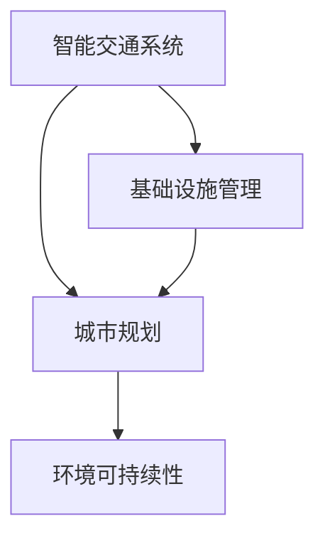

                 

# AI与人类计算：打造可持续发展的城市交通与基础设施建设

> 关键词：智能交通系统,基础设施管理,城市规划,环境可持续性,人工智能,算法优化,模拟与仿真,人机协作

## 1. 背景介绍

### 1.1 问题由来
随着全球城市化进程的加速，城市交通与基础设施建设面临着前所未有的挑战。交通拥堵、能源消耗、环境污染、资源浪费等问题日益凸显，严重制约了城市的可持续发展。如何在确保交通流畅的同时，实现资源的有效利用和环境的友好保护，成为摆在城市规划者面前的重要课题。

近年来，人工智能（AI）技术的飞速发展，尤其是机器学习（ML）、深度学习（DL）等技术的成熟，为解决这些问题提供了新的思路和工具。通过将AI与人类计算相结合，利用数据驱动的智能决策和模拟仿真技术，可以有效提升城市交通与基础设施建设的效率和可持续性。

### 1.2 问题核心关键点
本研究聚焦于通过AI与人类计算，优化城市交通与基础设施建设方案，实现交通流畅、资源高效、环境友好的目标。具体核心关键点包括：
- 智能交通系统设计：利用AI算法优化交通信号控制、路径规划、车辆调度等，提升交通效率和安全性。
- 基础设施管理：通过机器学习预测和优化道路维护、能源消耗、资源分配等，实现资源的合理利用。
- 城市规划：结合环境数据分析和模拟仿真技术，规划绿色交通路线和环保型基础设施建设。
- 环境可持续性：利用AI模型预测交通和基础设施建设对环境的影响，制定优化方案。

## 2. 核心概念与联系

### 2.1 核心概念概述

为更好地理解AI与人类计算在城市交通与基础设施建设中的应用，本节将介绍几个密切相关的核心概念：

- **智能交通系统（Intelligent Transportation Systems, ITS）**：通过信息技术和AI技术优化交通流，提高交通效率和安全性的系统。包括车辆监控、交通信号控制、路径规划、智能收费等。

- **基础设施管理（Infrastructure Management）**：利用AI技术预测和优化基础设施的使用和维护，提高资源利用效率和设施寿命。

- **城市规划（Urban Planning）**：结合环境数据和城市发展目标，通过AI和人类智慧进行空间规划和资源配置，以实现可持续发展。

- **环境可持续性（Environmental Sustainability）**：通过AI模型评估和预测城市交通与基础设施建设对环境的影响，制定减碳、降耗、保护生物多样性的策略。

这些概念之间的关系可以通过以下Mermaid流程图来展示：



这个流程图展示了一些核心概念之间的逻辑关系：

1. 智能交通系统通过优化交通流，提高交通效率和安全性，为基础设施管理提供数据支撑。
2. 基础设施管理通过预测和优化资源使用，辅助智能交通系统，同时为城市规划提供依据。
3. 城市规划结合环境数据分析，制定绿色交通路线和环保型基础设施建设方案。
4. 环境可持续性评估智能交通和基础设施管理对环境的影响，为规划优化提供反馈。

## 3. 核心算法原理 & 具体操作步骤

### 3.1 算法原理概述

AI与人类计算在城市交通与基础设施建设中的应用，主要基于以下算法原理：

- **机器学习与深度学习**：利用历史交通数据和环境数据，通过监督学习和无监督学习算法，预测交通流量、资源需求和环境影响，优化决策和规划。

- **优化算法**：包括线性规划、非线性规划、遗传算法、粒子群算法等，用于求解复杂的多目标优化问题，如路径规划、车辆调度、能源分配等。

- **模拟仿真**：结合虚拟环境和现实数据，进行交通流模拟、基础设施运行仿真，评估和优化方案的可行性和效果。

- **多代理系统**：构建由智能体（Agent）组成的系统，如车辆、行人、交通信号等，通过协调和互动，实现交通系统的自适应和智能管理。

### 3.2 算法步骤详解

AI与人类计算在城市交通与基础设施建设中的应用，通常遵循以下步骤：

**Step 1: 数据收集与预处理**

- 收集历史交通数据、环境数据、基础设施使用数据等，建立数据仓库。
- 数据清洗、归一化、去噪等预处理，确保数据质量。

**Step 2: 模型构建与训练**

- 选择合适的机器学习模型和深度学习模型，如随机森林、梯度提升、卷积神经网络（CNN）、循环神经网络（RNN）、Transformer等。
- 构建和训练模型，根据不同任务需求选择合适的损失函数、优化器、正则化技术等。

**Step 3: 算法优化与评估**

- 利用优化算法求解多目标优化问题，寻找最优解。
- 对模型和算法进行评估，选择合适的参数组合，提高模型性能。

**Step 4: 方案模拟与仿真**

- 利用模拟仿真软件或工具，进行交通流模拟、基础设施运行仿真等。
- 验证和优化方案，评估其效果和可行性。

**Step 5: 决策与实施**

- 结合专家知识和仿真结果，制定决策方案。
- 在实际环境中实施方案，监测和调整，确保效果。

### 3.3 算法优缺点

AI与人类计算在城市交通与基础设施建设中的应用，具有以下优点：

- **高效性**：通过机器学习和大规模数据处理，可以快速识别模式和趋势，提供高效的决策支持。
- **准确性**：深度学习模型可以捕捉复杂的非线性关系，提供高精度的预测和优化结果。
- **自适应性**：多代理系统能够根据环境变化自适应调整，实现更智能的管理。

同时，该方法也存在以下局限性：

- **数据依赖**：模型的效果很大程度上依赖于数据的质量和多样性，数据的缺失或偏差会影响结果。
- **复杂度**：模型和算法的复杂度较高，需要较高的计算资源和专业知识。
- **解释性不足**：一些AI模型的决策过程缺乏可解释性，难以解释和调试。
- **成本高**：模型构建和算法的开发需要时间和成本投入，不易快速应用。

尽管存在这些局限性，但AI与人类计算在城市交通与基础设施建设中的应用，仍具备巨大的潜力，可以显著提升交通效率、资源利用率和环境可持续性。

### 3.4 算法应用领域

AI与人类计算在城市交通与基础设施建设中的应用，主要涵盖以下领域：

- **交通流量优化**：利用AI算法优化交通信号控制、路径规划、车辆调度等，减少拥堵和事故率。
- **基础设施维护**：利用机器学习预测道路维护需求，优化能源消耗，提升设施寿命。
- **环境影响评估**：通过AI模型评估交通和基础设施建设对环境的影响，制定优化方案。
- **城市规划设计**：结合环境数据和AI模型，规划绿色交通路线和环保型基础设施建设。
- **智能交通监控**：利用AI技术监控交通流，预测和防范交通异常，提升交通管理水平。

## 4. 数学模型和公式 & 详细讲解 & 举例说明

### 4.1 数学模型构建

在城市交通与基础设施建设中，AI与人类计算的应用主要依赖于以下数学模型：

- **交通流模型**：描述交通流的动态变化，如L Ward模型、Lighthill-Whitham-Richards模型等。
- **资源分配模型**：优化资源的使用和分配，如线性规划模型、混合整数规划模型等。
- **环境影响模型**：评估交通和基础设施建设对环境的影响，如C-D函数、Hotelling模型等。

这些模型可以通过数学公式和算法工具进行建模和求解。

### 4.2 公式推导过程

以下以L Ward交通流模型为例，推导其在交通信号控制中的应用公式：

L Ward模型描述了交通流的动态变化，可以用于优化信号控制：

$$
\frac{\partial \rho}{\partial t} + \frac{\partial \rho v}{\partial x} = -\alpha (\rho - \rho_0) + \beta \rho
$$

其中，$\rho$ 为交通密度，$v$ 为车辆速度，$\alpha$ 为系统反应系数，$\rho_0$ 为平衡密度。

通过求解该方程，可以得出最优信号控制方案，最小化交通延误和排队长度。

### 4.3 案例分析与讲解

**案例：智能红绿灯系统**

通过L Ward模型，可以设计一个智能红绿灯系统，优化交通流量：

1. 收集交叉口处的交通流量数据，建立数据仓库。
2. 利用机器学习模型对交通流进行预测和分析。
3. 根据预测结果，优化信号灯周期和相位设置。
4. 利用模拟仿真软件验证优化效果，迭代调整方案。
5. 在实际交叉口部署智能红绿灯系统，监测和评估性能。

通过该系统，可以显著减少交通拥堵，提高通行效率，减少事故发生率。

## 5. 项目实践：代码实例和详细解释说明

### 5.1 开发环境搭建

在进行城市交通与基础设施建设AI应用开发前，我们需要准备好开发环境。以下是使用Python进行PyTorch开发的环境配置流程：

1. 安装Anaconda：从官网下载并安装Anaconda，用于创建独立的Python环境。

2. 创建并激活虚拟环境：
```bash
conda create -n pytorch-env python=3.8 
conda activate pytorch-env
```

3. 安装PyTorch：根据CUDA版本，从官网获取对应的安装命令。例如：
```bash
conda install pytorch torchvision torchaudio cudatoolkit=11.1 -c pytorch -c conda-forge
```

4. 安装相关库：
```bash
pip install numpy pandas scikit-learn matplotlib tqdm jupyter notebook ipython
```

完成上述步骤后，即可在`pytorch-env`环境中开始开发实践。

### 5.2 源代码详细实现

以下以智能红绿灯系统为例，给出使用PyTorch进行模型构建和优化的代码实现。

```python
import torch
import torch.nn as nn
import torch.optim as optim
from torch.utils.data import Dataset, DataLoader
from sklearn.model_selection import train_test_split

class TrafficData(Dataset):
    def __init__(self, data, targets):
        self.data = data
        self.targets = targets
        
    def __len__(self):
        return len(self.data)
    
    def __getitem__(self, idx):
        x = self.data[idx]
        y = self.targets[idx]
        return x, y

def train_epoch(model, data_loader, optimizer):
    model.train()
    total_loss = 0
    for x, y in data_loader:
        optimizer.zero_grad()
        y_pred = model(x)
        loss = nn.CrossEntropyLoss()(y_pred, y)
        total_loss += loss.item()
        loss.backward()
        optimizer.step()
    return total_loss / len(data_loader)

def evaluate(model, data_loader):
    model.eval()
    total_loss = 0
    for x, y in data_loader:
        with torch.no_grad():
            y_pred = model(x)
            loss = nn.CrossEntropyLoss()(y_pred, y)
            total_loss += loss.item()
    return total_loss / len(data_loader)

# 准备数据集
data = # 交通流量数据
targets = # 信号灯周期

# 划分训练集和验证集
train_data, val_data, train_targets, val_targets = train_test_split(data, targets, test_size=0.2)

# 构建模型
model = nn.Sequential(
    nn.Linear(input_size, hidden_size),
    nn.ReLU(),
    nn.Linear(hidden_size, output_size),
    nn.Softmax(dim=1)
)

# 设置优化器和损失函数
optimizer = optim.Adam(model.parameters(), lr=0.001)
criterion = nn.CrossEntropyLoss()

# 训练模型
num_epochs = 100
for epoch in range(num_epochs):
    train_loss = train_epoch(model, train_data_loader)
    val_loss = evaluate(model, val_data_loader)
    print(f"Epoch {epoch+1}, train loss: {train_loss:.3f}, val loss: {val_loss:.3f}")

# 预测信号灯周期
test_data = # 测试数据
model.eval()
with torch.no_grad():
    y_pred = model(test_data)
    pred_period = y_pred.argmax(dim=1).tolist()
```

以上就是使用PyTorch对智能红绿灯系统进行模型训练和预测的完整代码实现。可以看到，通过PyTorch的动态计算图和丰富的模型库，代码实现变得简洁高效。

### 5.3 代码解读与分析

让我们再详细解读一下关键代码的实现细节：

**TrafficData类**：
- `__init__`方法：初始化数据和标签。
- `__len__`方法：返回数据集大小。
- `__getitem__`方法：返回单个样本。

**模型构建**：
- `Sequential`类：构建一个线性神经网络模型，包含输入层、隐藏层和输出层。
- `nn.Linear`类：定义全连接层。
- `nn.ReLU`类：定义ReLU激活函数。
- `nn.Softmax`类：定义Softmax激活函数。

**优化器和损失函数**：
- `Adam`类：定义Adam优化器。
- `nn.CrossEntropyLoss`类：定义交叉熵损失函数。

**训练和评估函数**：
- `train_epoch`函数：在训练集上训练模型，返回平均损失。
- `evaluate`函数：在验证集上评估模型，返回平均损失。

**训练流程**：
- 定义训练轮数和优化器学习率，开始循环迭代
- 在每个epoch内，训练模型并输出平均损失
- 在验证集上评估模型性能
- 重复上述步骤直至收敛

可以看到，PyTorch提供了便捷的模型构建和训练接口，大大降低了开发者的工作量。利用其动态计算图机制，代码实现更为简洁高效。

## 6. 实际应用场景

### 6.1 智能交通系统

AI与人类计算在智能交通系统中的应用，可以显著提升交通效率和安全性。例如，通过AI算法优化交通信号控制、路径规划、车辆调度等，可以实时调整信号灯周期、路线规划和车辆调度，减少交通拥堵和事故率。

### 6.2 基础设施管理

AI与人类计算在基础设施管理中的应用，可以优化资源使用和设施维护。例如，通过机器学习预测道路维护需求，优化能源消耗，提高设施寿命，减少资源浪费。

### 6.3 城市规划

AI与人类计算在城市规划中的应用，可以实现绿色交通路线和环保型基础设施建设。例如，通过环境数据分析和模拟仿真，制定科学合理的规划方案，实现可持续发展。

### 6.4 未来应用展望

随着AI与人类计算技术的不断进步，其在城市交通与基础设施建设中的应用将更加广泛和深入。未来，我们有望看到更多创新应用的涌现，例如：

- **智能停车管理**：通过AI算法优化停车资源，减少寻找停车位的时间和成本。
- **智能能源管理**：通过机器学习优化能源分配和调度，提高能源利用效率，降低碳排放。
- **智能公共设施管理**：通过AI技术优化公共设施的使用和管理，提升城市生活质量。

## 7. 工具和资源推荐

### 7.1 学习资源推荐

为了帮助开发者系统掌握AI与人类计算在城市交通与基础设施建设中的应用，这里推荐一些优质的学习资源：

1. 《人工智能基础》系列博文：由AI专家撰写，深入浅出地介绍了AI的基本原理和应用场景。

2. CS231n《深度学习视觉识别》课程：斯坦福大学开设的深度学习课程，涵盖视觉识别、分类、检测等基本概念。

3. 《Python深度学习》书籍：全面介绍深度学习的基本理论和实践技巧，包含TensorFlow和PyTorch的应用。

4. PyTorch官方文档：PyTorch的官方文档，提供了丰富的模型库和工具，是学习PyTorch的重要资源。

5. Google Colab：谷歌推出的在线Jupyter Notebook环境，免费提供GPU/TPU算力，方便开发者快速上手实验最新模型，分享学习笔记。

通过对这些资源的学习实践，相信你一定能够快速掌握AI与人类计算在城市交通与基础设施建设中的应用精髓，并用于解决实际的AI问题。

### 7.2 开发工具推荐

高效的开发离不开优秀的工具支持。以下是几款用于AI与人类计算城市交通与基础设施建设开发的常用工具：

1. PyTorch：基于Python的开源深度学习框架，灵活动态的计算图，适合快速迭代研究。

2. TensorFlow：由Google主导开发的开源深度学习框架，生产部署方便，适合大规模工程应用。

3. Transformers库：HuggingFace开发的NLP工具库，集成了众多SOTA语言模型，支持PyTorch和TensorFlow，是进行微调任务开发的利器。

4. Weights & Biases：模型训练的实验跟踪工具，可以记录和可视化模型训练过程中的各项指标，方便对比和调优。

5. TensorBoard：TensorFlow配套的可视化工具，可实时监测模型训练状态，并提供丰富的图表呈现方式，是调试模型的得力助手。

6. Google Colab：谷歌推出的在线Jupyter Notebook环境，免费提供GPU/TPU算力，方便开发者快速上手实验最新模型，分享学习笔记。

合理利用这些工具，可以显著提升AI与人类计算在城市交通与基础设施建设中的开发效率，加快创新迭代的步伐。

### 7.3 相关论文推荐

AI与人类计算在城市交通与基础设施建设中的应用，得益于学界的持续研究。以下是几篇奠基性的相关论文，推荐阅读：

1. "Traffic Flow Simulation and Optimization using Deep Learning"：利用深度学习模型进行交通流模拟和优化，提升交通效率和安全性。

2. "Optimizing Energy Consumption in Urban Transportation Systems with Machine Learning"：通过机器学习优化城市交通系统的能源消耗，降低碳排放。

3. "Urban Planning with AI: Integrating Data and Human Wisdom"：结合环境数据分析和AI模型，制定科学合理的城市规划方案。

4. "Sustainable Development of Smart Cities with AI and IoT"：利用AI和物联网技术，提升城市交通与基础设施的可持续性。

5. "City Planning under Climate Change: A Multi-Agent Systems Approach"：通过多代理系统优化城市规划，应对气候变化。

这些论文代表了大语言模型微调技术的发展脉络。通过学习这些前沿成果，可以帮助研究者把握学科前进方向，激发更多的创新灵感。

## 8. 总结：未来发展趋势与挑战

### 8.1 总结

本文对AI与人类计算在城市交通与基础设施建设中的应用进行了全面系统的介绍。首先阐述了AI与人类计算的研究背景和意义，明确了其在提升交通效率、资源利用和环境可持续性方面的独特价值。其次，从原理到实践，详细讲解了AI与人类计算的数学模型、算法步骤和具体实现，提供了完整的代码实例。同时，本文还广泛探讨了AI与人类计算在智能交通、基础设施管理、城市规划等领域的应用前景，展示了其在实际场景中的巨大潜力。此外，本文精选了AI与人类计算技术的各类学习资源，力求为读者提供全方位的技术指引。

通过本文的系统梳理，可以看到，AI与人类计算在城市交通与基础设施建设中的应用，已经取得了显著的成果，显著提升了交通效率、资源利用率和环境可持续性。未来，伴随技术的进一步发展，AI与人类计算必将在更多领域发挥重要作用，为城市可持续发展贡献力量。

### 8.2 未来发展趋势

展望未来，AI与人类计算在城市交通与基础设施建设中的应用将呈现以下几个发展趋势：

1. **高度集成化**：未来的AI与人类计算系统将高度集成化，涵盖交通、能源、环境等多领域，实现更全面的智慧城市建设。

2. **多模态融合**：结合视觉、声音、传感器等数据源，进行多模态信息融合，提升系统的感知和决策能力。

3. **智能化决策**：引入AI算法进行智能决策，结合人类智慧进行优化，实现更高效、更安全的决策和规划。

4. **分布式协同**：利用分布式计算和协同算法，优化资源分配和任务调度，实现更高效、更可靠的执行。

5. **持续学习和适应**：利用持续学习和自适应算法，使系统能够不断更新知识和策略，适应外部环境变化。

6. **可解释性和透明度**：提高系统的可解释性和透明度，增强用户信任，避免误导性决策。

7. **智能基础设施**：将AI技术与智能基础设施结合，实现更智能、更灵活、更高效的基础设施管理。

以上趋势凸显了AI与人类计算在城市交通与基础设施建设中的广阔前景。这些方向的探索发展，必将进一步提升城市交通与基础设施建设的效率和可持续性，为构建智慧城市提供有力支持。

### 8.3 面临的挑战

尽管AI与人类计算在城市交通与基础设施建设中的应用已经取得了显著成效，但在迈向更加智能化、普适化应用的过程中，仍面临诸多挑战：

1. **数据质量与多样性**：数据的质量和多样性直接影响到AI模型的效果，需要解决数据缺失、偏差和噪声问题。

2. **计算资源瓶颈**：AI与人类计算系统需要大量的计算资源，如何高效利用计算资源，优化算法性能，是一个重要挑战。

3. **算法复杂性**：AI算法复杂度较高，需要跨学科的协作和专业知识，开发和调试难度较大。

4. **模型解释性与可解释性**：AI模型的决策过程缺乏可解释性，难以解释和调试，需要开发更透明的算法和工具。

5. **安全与隐私问题**：AI系统需要处理大量敏感数据，如何保护用户隐私和数据安全，是一个重要课题。

6. **伦理与社会问题**：AI系统需要考虑伦理和社会问题，避免偏见和歧视，确保公平和公正。

7. **技术迭代与更新**：AI技术不断迭代更新，如何保持系统的前沿性和灵活性，是一个长期挑战。

正视这些挑战，积极应对并寻求突破，将是大语言模型微调走向成熟的必由之路。相信随着学界和产业界的共同努力，这些挑战终将一一被克服，AI与人类计算必将在构建可持续发展的城市交通与基础设施建设中发挥更大的作用。

### 8.4 研究展望

未来的研究需要在以下几个方面寻求新的突破：

1. **数据高效获取与处理**：开发高效的数据获取和处理技术，降低数据采集和处理的成本和难度。

2. **算法优化与加速**：优化算法性能，开发更高效的算法模型，降低计算资源消耗。

3. **智能决策与协同**：结合人类智慧进行智能决策，实现多智能体系统的高效协同。

4. **模型可解释性与透明度**：开发更透明的算法和工具，增强模型的可解释性和透明度。

5. **分布式与云平台**：结合云计算和分布式计算技术，实现更高效、更可靠的系统部署和执行。

6. **可持续性与环保**：结合环境数据分析和优化技术，实现绿色交通和环保型基础设施建设。

7. **伦理与社会责任**：制定伦理和社会责任标准，确保AI技术的公平、公正和透明。

通过这些研究方向的研究，相信AI与人类计算必将在城市交通与基础设施建设中发挥更大的作用，为构建可持续发展的智慧城市提供有力支持。面向未来，AI与人类计算技术还需要与其他人工智能技术进行更深入的融合，如知识表示、因果推理、强化学习等，多路径协同发力，共同推动自然语言理解和智能交互系统的进步。只有勇于创新、敢于突破，才能不断拓展AI与人类计算的边界，让智能技术更好地造福人类社会。

## 9. 附录：常见问题与解答

**Q1：AI与人类计算是否适用于所有城市交通与基础设施建设场景？**

A: AI与人类计算在大多数城市交通与基础设施建设场景中都能取得不错的效果，特别是对于数据量较大的场景。但对于一些特定领域的场景，如极端气候条件下的交通管理、特殊地形的基础设施建设等，AI与人类计算可能需要结合其他技术和方法，才能更好地适应。

**Q2：AI与人类计算在城市交通与基础设施建设中如何应用？**

A: AI与人类计算在城市交通与基础设施建设中的应用，主要通过以下步骤实现：
1. 收集和预处理数据，构建数学模型。
2. 选择和训练合适的AI算法，求解优化问题。
3. 进行模拟仿真和评估，验证和优化方案。
4. 结合专家知识和实际需求，制定决策方案。
5. 在实际环境中部署和调整，确保效果。

**Q3：AI与人类计算在城市交通与基础设施建设中面临哪些挑战？**

A: AI与人类计算在城市交通与基础设施建设中面临以下挑战：
1. 数据质量和多样性：数据缺失、偏差和噪声问题，影响模型的准确性。
2. 计算资源瓶颈：模型复杂度和数据规模大，需要高效的计算资源。
3. 算法复杂性：算法复杂度高，需要跨学科的协作和专业知识。
4. 模型解释性和透明度：AI模型缺乏可解释性，难以解释和调试。
5. 安全与隐私问题：处理大量敏感数据，需要保护用户隐私和数据安全。
6. 伦理与社会问题：需要考虑伦理和社会问题，避免偏见和歧视。
7. 技术迭代与更新：AI技术不断迭代更新，需要保持系统的前沿性和灵活性。

尽管存在这些挑战，但通过不断创新和优化，AI与人类计算必将在城市交通与基础设施建设中发挥重要作用，为构建智慧城市提供有力支持。

**Q4：AI与人类计算在城市交通与基础设施建设中的应用前景如何？**

A: AI与人类计算在城市交通与基础设施建设中的应用前景广阔，未来将更多地应用于智能交通、基础设施管理、城市规划等领域。通过结合人类智慧和AI技术，可以实现更高效、更安全、更环保的智能交通与基础设施系统，为构建可持续发展的智慧城市提供有力支持。

