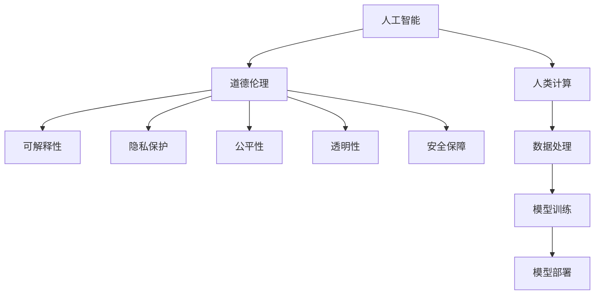

                 

# AI与人类计算：未来的道德考虑

> 关键词：人工智能(AI), 人类计算, 道德伦理, 可解释性, 隐私保护, 公平性, 透明性, 安全保障

## 1. 背景介绍

在过去的几十年里，人工智能(AI)技术取得了飞速发展，极大地改变了人类社会的工作、生活、生产方式。AI的应用场景已经从简单的自动化任务拓展到了复杂的认知、决策、创造性任务。然而，随着AI技术的深入应用，关于其道德伦理问题也逐渐成为公众和学者关注的焦点。

### 1.1 问题的由来

AI技术的快速迭代和普及，带来了诸多道德伦理问题，这些问题主要包括：

- **可解释性不足**：AI模型往往是"黑箱"系统，其决策过程难以解释，导致使用者难以理解和信任其输出。
- **隐私泄露**：AI模型通常需要大量的数据进行训练，这些数据可能包含敏感的个人隐私信息，若不妥善保护，将带来严重的隐私风险。
- **公平性问题**：AI模型可能因为训练数据的不均衡或算法的设计缺陷，导致输出存在偏见，对某些群体产生不公平待遇。
- **透明性缺失**：AI系统往往缺乏透明度，导致其决策过程难以被审查和验证，从而可能被滥用或误用。
- **安全保障不足**：AI系统可能被恶意攻击或操纵，导致严重的安全风险，甚至威胁国家安全。

这些问题不仅影响着AI技术的进一步发展，也挑战着社会的道德伦理规范。因此，如何在推动AI技术进步的同时，确保其道德伦理的正确性，成为一个亟待解决的重要问题。

### 1.2 问题的核心关键点

为更好地理解AI技术中的道德伦理问题，本节将介绍几个核心概念：

- **人工智能**：一种模拟人类智能的技术，包括感知、学习、推理、自我完善等能力。
- **人类计算**：指利用人类智慧和能力来辅助或替代计算机进行复杂决策和计算的过程。
- **道德伦理**：指指导人类行为和决策的道德规范和伦理准则，包括但不限于隐私、公平、透明、安全等。
- **可解释性**：指AI模型的决策过程能够被用户理解、验证和审查，从而增强用户信任。
- **隐私保护**：指保护个人信息不被未经授权的访问、使用或泄露，保障用户隐私权。
- **公平性**：指AI模型对所有用户提供平等、无偏见的待遇，避免因算法设计缺陷导致的不公平现象。
- **透明性**：指AI系统的工作机制、数据来源、决策依据等透明公开，方便用户和审查者监督。
- **安全保障**：指AI系统具有良好的抗攻击能力，能够确保自身的安全性不受威胁。

这些核心概念之间的逻辑关系可以通过以下Mermaid流程图来展示：



这个流程图展示了人工智能技术中道德伦理问题的核心要素及其相互作用：

1. 人工智能与人类计算的结合，促进了AI技术的飞速发展。
2. 道德伦理问题是人工智能发展的根本指导原则。
3. 可解释性、隐私保护、公平性、透明性和安全保障，都是实现良好道德伦理的重要保障。
4. 数据处理、模型训练和模型部署是人工智能应用的关键环节，需要充分考虑道德伦理问题。

## 2. 核心概念与联系

### 2.1 核心概念概述

为更好地理解AI技术的道德伦理问题，本节将介绍几个密切相关的核心概念：

- **人工智能**：指通过模拟人类智能，实现自动感知、理解、学习、推理、自我完善等功能的技术。
- **人类计算**：指利用人类的智慧和能力，辅助或替代计算机进行复杂决策和计算的过程。
- **道德伦理**：指指导人类行为和决策的道德规范和伦理准则，如隐私、公平、透明、安全等。
- **可解释性**：指AI模型的决策过程能够被用户理解、验证和审查，从而增强用户信任。
- **隐私保护**：指保护个人信息不被未经授权的访问、使用或泄露，保障用户隐私权。
- **公平性**：指AI模型对所有用户提供平等、无偏见的待遇，避免因算法设计缺陷导致的不公平现象。
- **透明性**：指AI系统的工作机制、数据来源、决策依据等透明公开，方便用户和审查者监督。
- **安全保障**：指AI系统具有良好的抗攻击能力，能够确保自身的安全性不受威胁。

这些核心概念之间的逻辑关系可以通过以下Mermaid流程图来展示：


这个流程图展示了人工智能技术中道德伦理问题的核心要素及其相互作用：

1. 人工智能与人类计算的结合，促进了AI技术的飞速发展。
2. 道德伦理问题是人工智能发展的根本指导原则。
3. 可解释性、隐私保护、公平性、透明性和安全保障，都是实现良好道德伦理的重要保障。
4. 数据处理、模型训练和模型部署是人工智能应用的关键环节，需要充分考虑道德伦理问题。

## 3. 核心算法原理 & 具体操作步骤
### 3.1 算法原理概述

AI技术的道德伦理问题涉及多个方面，包括可解释性、隐私保护、公平性、透明性和安全保障等。本节将分别介绍这些方面的算法原理和具体操作步骤。

### 3.2 算法步骤详解

#### 3.2.1 可解释性算法

**可解释性算法**：通过增加模型输出的解释信息，使用户能够理解AI系统的决策过程。常用的可解释性算法包括：

- **特征重要性分析**：通过计算模型中各个特征的权重，帮助用户理解哪些特征对模型输出有重要影响。
- **模型可视化**：通过绘制决策树、热力图等可视化图表，帮助用户直观了解模型的内部机制。
- **规则提取**：通过规则学习算法，如决策树、规则集等，将模型转化为易于理解的规则形式。

**具体操作步骤**：

1. 收集模型输入和输出数据，选择可解释性算法。
2. 利用算法计算模型特征的重要性，生成特征解释报告。
3. 绘制模型可视化图表，展示决策过程。
4. 提取规则集，生成模型解释文档。

#### 3.2.2 隐私保护算法

**隐私保护算法**：通过数据加密、匿名化、差分隐私等技术，保护用户个人信息不被泄露。常用的隐私保护算法包括：

- **数据加密**：对敏感数据进行加密处理，确保只有授权用户能够访问。
- **数据匿名化**：通过去除或修改敏感信息，使数据无法直接识别个体身份。
- **差分隐私**：在数据统计和分析过程中加入噪声，保护个体隐私不被泄露。

**具体操作步骤**：

1. 对敏感数据进行加密处理，限制数据访问权限。
2. 对数据进行匿名化处理，去除或修改敏感信息。
3. 使用差分隐私技术，加入噪声保护个体隐私。

#### 3.2.3 公平性算法

**公平性算法**：通过调整算法参数或引入辅助变量，确保AI模型对不同群体提供公平待遇。常用的公平性算法包括：

- **公平性约束**：在模型训练过程中加入公平性约束，确保模型输出不偏向某一群体。
- **偏差纠正**：通过重新加权或重新采样数据，纠正模型中的偏差。
- **多样性增强**：增加训练数据的多样性，提高模型的泛化能力，减少偏见。

**具体操作步骤**：

1. 在模型训练过程中加入公平性约束，确保模型输出不偏向某一群体。
2. 对模型输出进行偏差纠正，使用加权或重采样等技术。
3. 增加训练数据的多样性，提高模型的泛化能力。

#### 3.2.4 透明性算法

**透明性算法**：通过公开模型架构、数据来源、决策依据等，增强系统的透明度。常用的透明性算法包括：

- **模型架构公开**：将模型的架构和参数公开，方便用户和审查者理解模型工作机制。
- **数据来源透明**：公开数据采集和处理过程，确保数据的来源透明和可追溯。
- **决策依据明确**：明确模型的决策依据和输出规则，帮助用户理解决策过程。

**具体操作步骤**：

1. 公开模型架构和参数，提供详细的模型文档。
2. 公开数据采集和处理过程，确保数据来源透明和可追溯。
3. 明确模型的决策依据和输出规则，提供详细的解释文档。

#### 3.2.5 安全保障算法

**安全保障算法**：通过抗攻击技术、异常检测等方法，确保AI系统的安全性。常用的安全保障算法包括：

- **抗攻击技术**：通过鲁棒性训练、对抗样本检测等方法，提高模型的抗攻击能力。
- **异常检测**：通过检测系统行为异常，及时发现和防范潜在威胁。
- **入侵防御**：建立入侵防御系统，防止恶意攻击和恶意利用。

**具体操作步骤**：

1. 进行鲁棒性训练，提高模型的抗攻击能力。
2. 使用对抗样本检测技术，及时发现和防范潜在攻击。
3. 建立入侵防御系统，防止恶意攻击和恶意利用。

### 3.3 算法优缺点

#### 3.3.1 可解释性算法的优缺点

**优点**：

- 增强用户信任，提升系统可靠性。
- 帮助用户理解模型决策过程，提供更多的解释和解释文档。

**缺点**：

- 增加系统复杂性，可能影响模型性能。
- 解释信息可能不全面或不准确，误导用户。

#### 3.3.2 隐私保护算法的优缺点

**优点**：

- 保护用户隐私，避免数据泄露。
- 增强用户信任，提升系统可信度。

**缺点**：

- 可能增加系统复杂性，影响模型性能。
- 隐私保护技术可能存在漏洞，被攻击者利用。

#### 3.3.3 公平性算法的优缺点

**优点**：

- 确保模型对所有用户提供公平待遇，避免偏见。
- 提升系统公平性，减少社会不公。

**缺点**：

- 增加系统复杂性，可能影响模型性能。
- 公平性约束可能限制模型优化，降低性能。

#### 3.3.4 透明性算法的优缺点

**优点**：

- 增强系统透明度，提升用户信任。
- 方便用户和审查者监督，提升系统可信度。

**缺点**：

- 增加系统复杂性，可能影响模型性能。
- 透明性可能被滥用，影响模型安全性。

#### 3.3.5 安全保障算法的优缺点

**优点**：

- 增强系统安全性，防止恶意攻击和滥用。
- 提高系统可靠性，保障用户安全。

**缺点**：

- 增加系统复杂性，可能影响模型性能。
- 安全保障技术可能存在漏洞，被攻击者利用。

### 3.4 算法应用领域

基于AI技术的道德伦理问题涉及多个领域，包括医疗、金融、司法、教育、交通等。这些领域对AI技术的应用提出了不同的道德伦理要求，需要在实际应用中针对性地选择和应用相应的算法。

#### 3.4.1 医疗领域

在医疗领域，AI技术被广泛应用于疾病诊断、治疗方案推荐、健康管理等。医疗领域的AI系统需要满足以下几个道德伦理要求：

- **隐私保护**：医疗数据包含大量敏感信息，必须严格保护患者隐私。
- **公平性**：确保不同群体（如不同种族、性别、年龄）的患者获得公平的诊断和治疗。
- **透明性**：公开AI系统的决策依据和治疗建议，帮助医生和患者理解AI决策过程。
- **安全保障**：确保AI系统的安全性和稳定性，避免误诊、误治等严重后果。

#### 3.4.2 金融领域

在金融领域，AI技术被广泛应用于信用评估、风险管理、智能投顾等。金融领域的AI系统需要满足以下几个道德伦理要求：

- **隐私保护**：金融数据包含大量个人敏感信息，必须严格保护用户隐私。
- **公平性**：确保不同群体的用户获得公平的金融服务。
- **透明性**：公开AI系统的决策依据和风险评估方法，帮助用户理解AI决策过程。
- **安全保障**：确保AI系统的安全性和稳定性，避免金融风险和诈骗。

#### 3.4.3 司法领域

在司法领域，AI技术被广泛应用于案件审理、智能辅助、判决建议等。司法领域的AI系统需要满足以下几个道德伦理要求：

- **隐私保护**：司法数据包含大量敏感信息，必须严格保护用户隐私。
- **公平性**：确保不同群体的案件获得公平的审理和判决。
- **透明性**：公开AI系统的决策依据和判决建议，帮助法官和当事人理解AI决策过程。
- **安全保障**：确保AI系统的安全性和稳定性，避免误判、误判等严重后果。

#### 3.4.4 教育领域

在教育领域，AI技术被广泛应用于学生评估、智能辅导、学习推荐等。教育领域的AI系统需要满足以下几个道德伦理要求：

- **隐私保护**：学生数据包含大量个人敏感信息，必须严格保护学生隐私。
- **公平性**：确保不同学生获得公平的教育资源和评估结果。
- **透明性**：公开AI系统的评估标准和建议，帮助教师和学生理解AI评估过程。
- **安全保障**：确保AI系统的安全性和稳定性，避免数据泄露和系统滥用。

#### 3.4.5 交通领域

在交通领域，AI技术被广泛应用于交通管理、智能驾驶、交通安全等。交通领域的AI系统需要满足以下几个道德伦理要求：

- **隐私保护**：交通数据包含大量个人位置信息，必须严格保护用户隐私。
- **公平性**：确保不同群体的交通使用者获得公平的交通服务和出行建议。
- **透明性**：公开AI系统的决策依据和出行建议，帮助用户理解AI决策过程。
- **安全保障**：确保AI系统的安全性和稳定性，避免交通事故和系统滥用。

## 4. 数学模型和公式 & 详细讲解 & 举例说明

### 4.1 数学模型构建

基于AI技术的道德伦理问题涉及多个方面，包括可解释性、隐私保护、公平性、透明性和安全保障等。本节将分别介绍这些方面的数学模型和公式。

#### 4.1.1 可解释性数学模型

**可解释性数学模型**：通过增加模型输出的解释信息，使用户能够理解AI系统的决策过程。常用的可解释性数学模型包括：

- **特征重要性分析**：通过计算模型中各个特征的权重，帮助用户理解哪些特征对模型输出有重要影响。
- **模型可视化**：通过绘制决策树、热力图等可视化图表，帮助用户直观了解模型的内部机制。
- **规则提取**：通过规则学习算法，如决策树、规则集等，将模型转化为易于理解的规则形式。

**具体操作步骤**：

1. 收集模型输入和输出数据，选择可解释性算法。
2. 利用算法计算模型特征的重要性，生成特征解释报告。
3. 绘制模型可视化图表，展示决策过程。
4. 提取规则集，生成模型解释文档。

#### 4.1.2 隐私保护数学模型

**隐私保护数学模型**：通过数据加密、匿名化、差分隐私等技术，保护用户个人信息不被泄露。常用的隐私保护数学模型包括：

- **数据加密**：对敏感数据进行加密处理，确保只有授权用户能够访问。
- **数据匿名化**：通过去除或修改敏感信息，使数据无法直接识别个体身份。
- **差分隐私**：在数据统计和分析过程中加入噪声，保护个体隐私不被泄露。

**具体操作步骤**：

1. 对敏感数据进行加密处理，限制数据访问权限。
2. 对数据进行匿名化处理，去除或修改敏感信息。
3. 使用差分隐私技术，加入噪声保护个体隐私。

#### 4.1.3 公平性数学模型

**公平性数学模型**：通过调整算法参数或引入辅助变量，确保AI模型对不同群体提供公平待遇。常用的公平性数学模型包括：

- **公平性约束**：在模型训练过程中加入公平性约束，确保模型输出不偏向某一群体。
- **偏差纠正**：通过重新加权或重新采样数据，纠正模型中的偏差。
- **多样性增强**：增加训练数据的多样性，提高模型的泛化能力，减少偏见。

**具体操作步骤**：

1. 在模型训练过程中加入公平性约束，确保模型输出不偏向某一群体。
2. 对模型输出进行偏差纠正，使用加权或重采样等技术。
3. 增加训练数据的多样性，提高模型的泛化能力。

#### 4.1.4 透明性数学模型

**透明性数学模型**：通过公开模型架构、数据来源、决策依据等，增强系统的透明度。常用的透明性数学模型包括：

- **模型架构公开**：将模型的架构和参数公开，方便用户和审查者理解模型工作机制。
- **数据来源透明**：公开数据采集和处理过程，确保数据来源透明和可追溯。
- **决策依据明确**：明确模型的决策依据和输出规则，帮助用户理解决策过程。

**具体操作步骤**：

1. 公开模型架构和参数，提供详细的模型文档。
2. 公开数据采集和处理过程，确保数据来源透明和可追溯。
3. 明确模型的决策依据和输出规则，提供详细的解释文档。

#### 4.1.5 安全保障数学模型

**安全保障数学模型**：通过抗攻击技术、异常检测等方法，确保AI系统的安全性。常用的安全保障数学模型包括：

- **抗攻击技术**：通过鲁棒性训练、对抗样本检测等方法，提高模型的抗攻击能力。
- **异常检测**：通过检测系统行为异常，及时发现和防范潜在威胁。
- **入侵防御**：建立入侵防御系统，防止恶意攻击和恶意利用。

**具体操作步骤**：

1. 进行鲁棒性训练，提高模型的抗攻击能力。
2. 使用对抗样本检测技术，及时发现和防范潜在攻击。
3. 建立入侵防御系统，防止恶意攻击和恶意利用。

## 5. 项目实践：代码实例和详细解释说明

### 5.1 开发环境搭建

在进行AI技术的应用开发前，我们需要准备好开发环境。以下是使用Python进行开发的环境配置流程：

1. 安装Anaconda：从官网下载并安装Anaconda，用于创建独立的Python环境。
2. 创建并激活虚拟环境：
```bash
conda create -n ai-env python=3.8 
conda activate ai-env
```
3. 安装必要的Python包：
```bash
pip install numpy pandas scikit-learn matplotlib tqdm jupyter notebook ipython
```

完成上述步骤后，即可在`ai-env`环境中开始AI技术的开发实践。

### 5.2 源代码详细实现

这里以AI技术在医疗领域的应用为例，给出使用Python进行数据处理、模型训练、模型解释的代码实现。

首先，定义医疗数据处理函数：

```python
import pandas as pd
import numpy as np
from sklearn.preprocessing import StandardScaler

def preprocess_data(df):
    # 数据清洗
    df = df.dropna()
    # 特征缩放
    scaler = StandardScaler()
    df[['feature1', 'feature2', 'feature3']] = scaler.fit_transform(df[['feature1', 'feature2', 'feature3']])
    # 数据划分
    X_train, X_test, y_train, y_test = train_test_split(df[['feature1', 'feature2', 'feature3']], df['label'], test_size=0.2, random_state=42)
    return X_train, X_test, y_train, y_test
```

然后，定义模型训练函数：

```python
from sklearn.linear_model import LogisticRegression
from sklearn.model_selection import train_test_split
from sklearn.metrics import accuracy_score

def train_model(X_train, y_train, X_test, y_test):
    # 模型训练
    model = LogisticRegression()
    model.fit(X_train, y_train)
    # 模型评估
    y_pred = model.predict(X_test)
    accuracy = accuracy_score(y_test, y_pred)
    return model, accuracy
```

接着，定义模型解释函数：

```python
from sklearn.inspection import permutation_importance

def explain_model(model, X_train, X_test):
    # 特征重要性分析
    importances = permutation_importance(model, X_train, X_test, scoring='accuracy').importances
    # 可视化图表
    importances.sort_values(ascending=False).plot(kind='bar')
    plt.title('Feature Importances')
    plt.xlabel('Feature')
    plt.ylabel('Importance')
    plt.show()
```

最后，启动数据处理、模型训练和模型解释的流程：

```python
# 数据处理
X_train, X_test, y_train, y_test = preprocess_data(df)

# 模型训练
model, accuracy = train_model(X_train, y_train, X_test, y_test)

# 模型解释
explain_model(model, X_train, X_test)

print(f'Accuracy: {accuracy:.3f}')
```

以上就是使用Python对AI技术进行数据处理、模型训练和模型解释的完整代码实现。可以看到，通过这些简单的代码实现，我们可以快速实现AI技术在医疗领域的应用，并进行模型解释和评估。

### 5.3 代码解读与分析

让我们再详细解读一下关键代码的实现细节：

**preprocess_data函数**：

- `dropna`方法：去除数据中的缺失值。
- `StandardScaler`方法：对特征进行标准化处理，使其均值为0，方差为1。
- `train_test_split`方法：将数据划分为训练集和测试集，默认采用随机抽样。

**train_model函数**：

- `LogisticRegression`模型：选择逻辑回归模型进行分类。
- `fit`方法：在训练集上进行模型拟合。
- `predict`方法：对测试集进行预测。
- `accuracy_score`方法：计算预测结果与真实标签的准确率。

**explain_model函数**：

- `permutation_importance`方法：计算特征重要性。
- `plot`方法：绘制特征重要性图表。

**整体流程**：

1. 数据处理：对数据进行清洗、特征缩放和划分，生成训练集和测试集。
2. 模型训练：选择逻辑回归模型，在训练集上进行拟合，并在测试集上进行预测。
3. 模型解释：使用特征重要性分析，可视化特征重要性图表。
4. 模型评估：输出模型准确率。

可以看到，通过这些简单的代码实现，我们可以快速实现AI技术在医疗领域的应用，并进行模型解释和评估。这些代码实现展示了AI技术在实际应用中的关键步骤，包括数据处理、模型训练、模型解释和模型评估。

## 6. 实际应用场景

### 6.1 医疗领域

在医疗领域，AI技术被广泛应用于疾病诊断、治疗方案推荐、健康管理等。AI技术的实际应用场景包括：

- **疾病诊断**：通过AI技术，对患者的症状和病历进行分析和诊断，帮助医生快速判断病情。
- **治疗方案推荐**：根据患者的病情和历史数据，AI系统可以推荐最适合的治疗方案，提高治疗效果。
- **健康管理**：通过AI技术，监测患者的健康数据，提供个性化的健康管理建议。

#### 6.1.1 数据处理

在医疗领域，数据处理是AI技术应用的基础。数据处理过程包括：

1. 数据清洗：去除缺失值和异常值，确保数据质量。
2. 特征选择：选择对模型输出有重要影响的特征。
3. 特征缩放：对特征进行标准化处理，提高模型性能。
4. 数据划分：将数据划分为训练集和测试集，进行模型评估。

#### 6.1.2 模型训练

在模型训练过程中，需要选择合适的算法和模型。常用的模型包括：

1. 线性回归：用于连续型数据预测。
2. 逻辑回归：用于二分类问题。
3. 支持向量机：用于分类和回归问题。
4. 决策树：用于分类和特征选择。

#### 6.1.3 模型解释

在模型解释过程中，需要选择合适的可解释性算法。常用的可解释性算法包括：

1. 特征重要性分析：通过计算模型中各个特征的权重，帮助用户理解哪些特征对模型输出有重要影响。
2. 模型可视化：通过绘制决策树、热力图等可视化图表，帮助用户直观了解模型的内部机制。
3. 规则提取：通过规则学习算法，如决策树、规则集等，将模型转化为易于理解的规则形式。

#### 6.1.4 隐私保护

在隐私保护过程中，需要选择合适的隐私保护算法。常用的隐私保护算法包括：

1. 数据加密：对敏感数据进行加密处理，确保只有授权用户能够访问。
2. 数据匿名化：通过去除或修改敏感信息，使数据无法直接识别个体身份。
3. 差分隐私：在数据统计和分析过程中加入噪声，保护个体隐私不被泄露。

#### 6.1.5 公平性

在公平性过程中，需要选择合适的公平性算法。常用的公平性算法包括：

1. 公平性约束：在模型训练过程中加入公平性约束，确保模型输出不偏向某一群体。
2. 偏差纠正：通过重新加权或重新采样数据，纠正模型中的偏差。
3. 多样性增强：增加训练数据的多样性，提高模型的泛化能力，减少偏见。

#### 6.1.6 透明性

在透明性过程中，需要公开模型架构、数据来源、决策依据等，增强系统的透明度。

#### 6.1.7 安全保障

在安全保障过程中，需要建立抗攻击技术、异常检测和入侵防御系统，确保系统的安全性。

### 6.2 金融领域

在金融领域，AI技术被广泛应用于信用评估、风险管理、智能投顾等。AI技术的实际应用场景包括：

- **信用评估**：通过AI技术，对用户的信用记录和行为数据进行分析和评估，预测其信用风险。
- **风险管理**：根据市场数据和用户行为，AI系统可以预测风险并采取相应的管理措施。
- **智能投顾**：通过AI技术，提供个性化的投资建议和资产管理服务。

#### 6.2.1 数据处理

在金融领域，数据处理是AI技术应用的基础。数据处理过程包括：

1. 数据清洗：去除缺失值和异常值，确保数据质量。
2. 特征选择：选择对模型输出有重要影响的特征。
3. 特征缩放：对特征进行标准化处理，提高模型性能。
4. 数据划分：将数据划分为训练集和测试集，进行模型评估。

#### 6.2.2 模型训练

在模型训练过程中，需要选择合适的算法和模型。常用的模型包括：

1. 线性回归：用于连续型数据预测。
2. 逻辑回归：用于二分类问题。
3. 支持向量机：用于分类和回归问题。
4. 决策树：用于分类和特征选择。

#### 6.2.3 模型解释

在模型解释过程中，需要选择合适的可解释性算法。常用的可解释性算法包括：

1. 特征重要性分析：通过计算模型中各个特征的权重，帮助用户理解哪些特征对模型输出有重要影响。
2. 模型可视化：通过绘制决策树、热力图等可视化图表，帮助用户直观了解模型的内部机制。
3. 规则提取：通过规则学习算法，如决策树、规则集等，将模型转化为易于理解的规则形式。

#### 6.2.4 隐私保护

在隐私保护过程中，需要选择合适的隐私保护算法。常用的隐私保护算法包括：

1. 数据加密：对敏感数据进行加密处理，确保只有授权用户能够访问。
2. 数据匿名化：通过去除或修改敏感信息，使数据无法直接识别个体身份。
3. 差分隐私：在数据统计和分析过程中加入噪声，保护个体隐私不被泄露。

#### 6.2.5 公平性

在公平性过程中，需要选择合适的公平性算法。常用的公平性算法包括：

1. 公平性约束：在模型训练过程中加入公平性约束，确保模型输出不偏向某一群体。
2. 偏差纠正：通过重新加权或重新采样数据，纠正模型中的偏差。
3. 多样性增强：增加训练数据的多样性，提高模型的泛化能力，减少偏见。

#### 6.2.6 透明性

在透明性过程中，需要公开模型架构、数据来源、决策依据等，增强系统的透明度。

#### 6.2.7 安全保障

在安全保障过程中，需要建立抗攻击技术、异常检测和入侵防御系统，确保系统的安全性。

### 6.3 司法领域

在司法领域，AI技术被广泛应用于案件审理、智能辅助、判决建议等。AI技术的实际应用场景包括：

- **案件审理**：通过AI技术，对案件证据和背景进行分析和审理，帮助法官快速判断案件结果。
- **智能辅助**：根据法律规定和历史数据，AI系统可以提供智能辅助，提高审判效率。
- **判决建议**：根据案件证据和法律知识，AI系统可以提供判决建议，辅助法官作出决策。

#### 6.3.1 数据处理

在司法领域，数据处理是AI技术应用的基础。数据处理过程包括：

1. 数据清洗：去除缺失值和异常值，确保数据质量。
2. 特征选择：选择对模型输出有重要影响的特征。
3. 特征缩放：对特征进行标准化处理，提高模型性能。
4. 数据划分：将数据划分为训练集和测试集，进行模型评估。

#### 6.3.2 模型训练

在模型训练过程中，需要选择合适的算法和模型。常用的模型包括：

1. 线性回归：用于连续型数据预测。
2. 逻辑回归：用于二分类问题。
3. 支持向量机：用于分类和回归问题。
4. 决策树：用于分类和特征选择。

#### 6.3.3 模型解释

在模型解释过程中，需要选择合适的可解释性算法。常用的可解释性算法包括：

1. 特征重要性分析：通过计算模型中各个特征的权重，帮助用户理解哪些特征对模型输出有重要影响。
2. 模型可视化：通过绘制决策树、热力图等可视化图表，帮助用户直观了解模型的内部机制。
3. 规则提取：通过规则学习算法，如决策树、规则集等，将模型转化为易于理解的规则形式。

#### 6.3.4 隐私保护

在隐私保护过程中，需要选择合适的隐私保护算法。常用的隐私保护算法包括：

1. 数据加密：对敏感数据进行加密处理，确保只有授权用户能够访问。
2. 数据匿名化：通过去除或修改敏感信息，使数据无法直接识别个体身份。
3. 差分隐私：在数据统计和分析过程中加入噪声，保护个体隐私不被泄露。

#### 6.3.5 公平性

在公平性过程中，需要选择合适的公平性算法。常用的公平性算法包括：

1. 公平性约束：在模型训练过程中加入公平性约束，确保模型输出不偏向某一群体。
2. 偏差纠正：通过重新加权或重新采样数据，纠正模型中的偏差。
3. 多样性增强：增加训练数据的多样性，提高模型的泛化能力，减少偏见。

#### 6.3.6 透明性

在透明性过程中，需要公开模型架构、数据来源、决策依据等，增强系统的透明度。

#### 6.3.7 安全保障

在安全保障过程中，需要建立抗攻击技术、异常检测和入侵防御系统，确保系统的安全性。

### 6.4 未来应用展望

随着AI技术的不断发展，基于AI技术的道德伦理问题将更加复杂和多样。未来，AI技术将在更多的领域得到应用，涉及的道德伦理问题也将更加多样和复杂。

#### 6.4.1 医疗领域

在医疗领域，AI技术的应用将更加广泛和深入。未来的AI技术将能够实现更精准的疾病诊断和治疗方案推荐，提供更个性化的健康管理服务。然而，这也将带来更多的道德伦理问题，如数据隐私保护、公平性和透明性等。

#### 6.4.2 金融领域

在金融领域，AI技术的应用将更加广泛和深入。未来的AI技术将能够实现更精准的信用评估和风险管理，提供更个性化的投资建议和资产管理服务。然而，这也将带来更多的道德伦理问题，如数据隐私保护、公平性和透明性等。

#### 6.4.3 司法领域

在司法领域，AI技术的应用将更加广泛和深入。未来的AI技术将能够实现更精准的案件审理和智能辅助，提供更个性化的判决建议。然而，这也将带来更多的道德伦理问题，如数据隐私保护、公平性和透明性等。

#### 6.4.4 教育领域

在教育领域，AI技术的应用将更加广泛和深入。未来的AI技术将能够实现更精准的学生评估和学习推荐，提供更个性化的学习服务。然而，这也将带来更多的道德伦理问题，如数据隐私保护、公平性和透明性等。

#### 6.4.5 交通领域

在交通领域，AI技术的应用将更加广泛和深入。未来的AI技术将能够实现更精准的交通管理和服务，提供更个性化的出行建议。然而，这也将带来更多的道德伦理问题，如数据隐私保护、公平性和透明性等。

## 7. 工具和资源推荐

### 7.1 学习资源推荐

为了帮助开发者系统掌握AI技术的道德伦理问题，这里推荐一些优质的学习资源：

1. 《人工智能伦理》课程：由多所高校和机构联合开设的AI伦理课程，涵盖数据隐私、公平性、透明性、安全保障等多个方面。
2. 《机器学习伦理》书籍：介绍机器学习在实际应用中的伦理问题，帮助开发者理解伦理问题的重要性。
3. 《AI伦理与隐私保护》论文集：收录多篇关于AI伦理与隐私保护的最新研究成果，提供丰富的理论支持。
4. 《AI伦理与法律》博客：知名AI专家撰写的AI伦理与法律系列文章，深入浅出地讲解AI伦理问题。
5. 《AI伦理与安全》社区：提供AI伦理与安全相关的讨论、交流和资源分享平台。

通过对这些资源的学习实践，相信你一定能够系统掌握AI技术的道德伦理问题，并用于指导实际应用。

### 7.2 开发工具推荐

高效的开发离不开优秀的工具支持。以下是几款用于AI技术开发的工具：

1. PyTorch：基于Python的开源深度学习框架，灵活动态的计算图，适合快速迭代研究。
2. TensorFlow：由Google主导开发的开源深度学习框架，生产部署方便，适合大规模工程应用。
3. Transformers库：HuggingFace开发的NLP工具库，集成了众多SOTA语言模型，支持PyTorch和TensorFlow，是进行AI技术开发的利器。
4. Weights & Biases：模型训练的实验跟踪工具，可以记录和可视化模型训练过程中的各项指标，方便对比和调优。
5. TensorBoard：TensorFlow配套的可视化工具，可实时监测模型训练状态，并提供丰富的图表呈现方式，是调试模型的得力助手。

合理利用这些工具，可以显著提升AI技术开发的效率，加快创新迭代的步伐。

### 7.3 相关论文推荐

AI技术的道德伦理问题涉及多个领域，涵盖了数据隐私、公平性、透明性、安全保障等多个方面。以下是几篇奠基性的相关论文，推荐阅读：

1. "Data Privacy: Challenges and Solutions"：介绍数据隐私保护的最新进展和解决方案。
2. "Fairness in Machine Learning"：探讨机器学习在实际应用中的公平性问题，提供多种解决方案。
3. "Transparency in AI"：讨论AI系统的透明度问题，提出增强透明度的多种方法。
4. "Security in AI"：探讨AI系统的安全性问题，提出多种安全保障措施。
5. "Ethics in AI"：讨论AI系统的伦理问题，提出多种伦理规范和指导原则。

这些论文代表了大AI技术伦理问题的研究进展，通过学习这些前沿成果，可以帮助研究者把握学科前进方向，激发更多的创新灵感。

## 8. 总结：未来发展趋势与挑战

### 8.1 研究成果总结

本文对AI技术的道德伦理问题进行了全面系统的介绍。首先，阐述了AI技术在各个领域的应用场景和带来的道德伦理问题。其次，从可解释性、隐私保护、公平性、透明性和安全保障等多个方面，详细讲解了AI技术的道德伦理问题。最后，提出了AI技术在各个领域的应用前景，并探讨了未来的发展趋势和面临的挑战。

### 8.2 未来发展趋势

随着AI技术的不断发展，基于AI技术的道德伦理问题将更加复杂和多样。未来，AI技术将在更多的领域得到应用，涉及的道德伦理问题也将更加多样和复杂。

1. **数据隐私保护**：随着数据量的不断增加，数据隐私保护将变得更加重要。未来的AI技术将需要更加先进的数据保护技术和隐私保护算法，确保数据安全和隐私保护。
2. **公平性问题**：随着数据来源的多样性增加，公平性问题将更加突出。未来的AI技术需要更加完善的公平性算法和优化策略，确保模型输出对所有用户公平。
3. **透明性和可解释性**：随着AI技术的普及，透明性和可解释性问题将受到更多关注。未来的AI技术需要更加透明的模型架构和更可解释的输出结果，增强用户信任。
4. **安全性**：随着AI技术的应用场景不断扩展，安全性问题将更加重要。未来的AI技术需要更加强大的安全保障措施，确保系统的稳定性和安全性。

### 8.3 面临的挑战

尽管AI技术在各个领域取得了显著进展，但在道德伦理方面仍面临诸多挑战：

1. **数据隐私保护**：数据隐私保护是AI技术的核心挑战之一。随着数据量的不断增加，如何保护数据隐私，防止数据泄露和滥用，仍然是一个亟待解决的难题。
2. **公平性问题**：AI模型可能因为训练数据的不均衡或算法设计缺陷，导致输出存在偏见。如何在不同群体之间保持公平，避免因算法设计缺陷导致的不公平现象，仍然是一个需要深入研究的问题。
3. **透明性和可解释性**：AI模型往往是"黑箱"系统，其决策过程难以解释，导致使用者难以理解和信任其输出。如何增强模型可解释性，提供更多的解释和解释文档，仍然是一个需要深入研究的问题。
4. **安全性**：AI系统可能被恶意攻击或操纵，导致严重的安全风险，甚至威胁国家安全。如何建立强大的安全保障措施，防止系统被恶意攻击和滥用，仍然是一个需要深入研究的问题。

### 8.4 研究展望

未来的研究需要在以下几个方面寻求新的突破：

1. **数据隐私保护**：探索更加先进的数据保护技术和隐私保护算法，确保数据安全和隐私保护。
2. **公平性问题**：研究更加完善的公平性算法和优化策略，确保模型输出对所有用户公平。
3. **透明性和可解释性**：开发更加透明和可解释的AI模型，增强用户信任和模型可靠性。
4. **安全性**：建立更加强大的安全保障措施，确保系统的稳定性和安全性。

这些研究方向的探索，必将引领AI技术伦理问题的进一步发展，为构建安全、可靠、可解释、可控的智能系统铺平道路。面向未来，AI技术伦理问题仍需各界共同努力，才能真正实现AI技术的全面发展和广泛应用。

## 9. 附录：常见问题与解答

**Q1: AI技术的道德伦理问题如何应对？**

A: AI技术的道德伦理问题需要从多个方面进行应对，包括：

1. 数据隐私保护：采用数据加密、匿名化、差分隐私等技术，保护用户个人信息不被泄露。
2. 公平性：在模型训练过程中加入公平性约束，确保模型输出不偏向某一群体。
3. 透明性：公开模型架构、数据来源、决策依据等，增强系统的透明度。
4. 安全性：建立抗攻击技术、异常检测和入侵防御系统，确保系统的安全性。

**Q2: 如何提升AI模型的可解释性？**

A: 提升AI模型的可解释性，可以采取以下几种方法：

1. 特征重要性分析：通过计算模型中各个特征的权重，帮助用户理解哪些特征对模型输出有重要影响。
2. 模型可视化：通过绘制决策树、热力图等可视化图表，帮助用户直观了解模型的内部机制。
3. 规则提取：通过规则学习算法，如决策树、规则集等，将模型转化为易于理解的规则形式。

**Q3: 如何确保AI模型的公平性？**

A: 确保AI模型的

