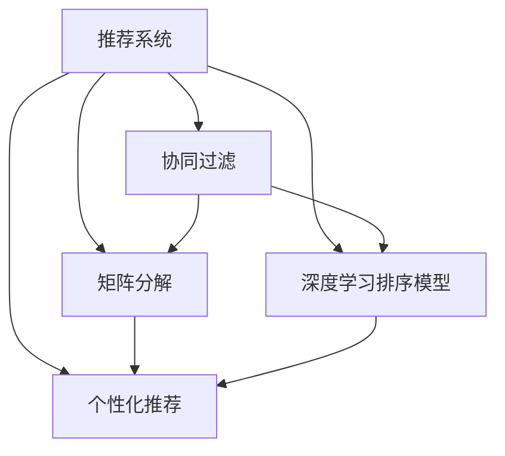

                 

## 1. 背景介绍

### 1.1 问题由来
随着信息时代的发展，海量的信息流源源不断涌入人们的视野。在网站、搜索引擎、电商平台等场景中，如何对用户兴趣进行精准地获取和匹配，从而提供个性化、高效的排序和推荐服务，成为业界关注的焦点。传统推荐系统多基于协同过滤、矩阵分解等算法，但受限于用户交互数据的稀疏性和冷启动问题，难以兼顾全局性和局部性需求。

近年来，基于深度学习的推荐系统开始崭露头角。其中，深度学习排序模型通过训练具有复杂非线性关系的大规模数据，逐步超越传统算法，实现了对用户行为更深刻的理解。本文将通过一个具体的项目案例，详细阐述如何构建一个基于深度学习的个性化推荐系统，以帮助读者理解AI推荐技术的基本原理和实现方法。

### 1.2 问题核心关键点
一个成功的个性化推荐系统应该具备以下几个关键特性：
1. **准确性**：能够对用户的行为进行精准预测，推荐符合其兴趣的内容。
2. **实时性**：能够快速响应用户的即时请求，提供实时推荐的体验。
3. **可扩展性**：能够应对大规模数据和用户量的挑战，具备良好扩展性。
4. **可解释性**：能够解释推荐逻辑，帮助用户理解推荐结果的来源。
5. **可控性**：能够通过调参和模型优化，适应不同应用场景的需求。

本文将聚焦于个性化推荐系统中的排序模型，通过具体案例介绍如何构建一个基于深度学习的排序系统，并详细阐述其核心技术点。

## 2. 核心概念与联系

### 2.1 核心概念概述

在深入探讨个性化推荐系统之前，我们需要理解几个核心概念：

- **推荐系统(Recommender System)**：根据用户的历史行为和当前需求，推荐符合其兴趣的内容，如商品、文章、视频等。
- **排序模型(Ranking Model)**：在推荐系统中，排序模型用于对候选物品进行打分排序，推荐系统中的推荐算法通常基于排序模型。
- **协同过滤(Collaborative Filtering)**：通过分析用户之间的相似性，推荐用户可能感兴趣的物品。
- **矩阵分解(Matrix Factorization)**：将用户和物品的评分矩阵分解为两个低维矩阵，以进行更高效的协同过滤。
- **深度学习排序模型(Deep Learning Ranking Model)**：通过深度学习技术构建的排序模型，能够处理更为复杂和抽象的用户兴趣和行为。
- **个性化推荐**：根据用户特征和行为，推荐符合其个性化需求的内容。

### 2.2 核心概念原理和架构的 Mermaid 流程图



这个流程图展示了推荐系统的核心组成，以及协同过滤、矩阵分解和深度学习排序模型如何共同工作，为用户提供个性化的推荐内容。

## 3. 核心算法原理 & 具体操作步骤

### 3.1 算法原理概述

深度学习排序模型主要采用神经网络架构，通过大量标注数据进行训练，学习用户与物品之间的复杂非线性关系。常用的深度学习排序模型包括：

- **基于神经网络的排序模型**：如CTR预估模型，通过多层神经网络对点击率进行预测。
- **基于序列的排序模型**：如RNN、GRU、LSTM等，可以处理时间序列数据，捕捉用户行为的时序信息。
- **基于注意力的排序模型**：如注意力机制（Attention）、Transformer等，能够聚焦于对用户有影响的物品特征。
- **基于跨模态的排序模型**：如融合视觉、文本、音频等多模态信息，提供更全面的推荐。

本文将以注意力机制为基础，构建一个基于Transformer的深度学习排序模型，详细介绍其原理和实现方法。

### 3.2 算法步骤详解

基于Transformer的深度学习排序模型的核心步骤包括：

1. **数据预处理**：将用户行为数据和物品特征数据进行编码，转化为神经网络能够处理的形式。
2. **模型构建**：定义神经网络的结构，包括输入层、隐藏层、输出层等。
3. **模型训练**：使用标注数据训练模型，优化模型参数。
4. **模型评估**：在测试集上评估模型性能，验证其准确性和实时性。
5. **模型部署**：将训练好的模型部署到生产环境中，提供实时推荐服务。

以下将详细阐述这些步骤的实现。

### 3.3 算法优缺点

基于深度学习的排序模型具有以下优点：
1. **处理复杂非线性关系**：深度神经网络能够处理非线性和复杂的多维输入，捕捉用户行为的多样性和随机性。
2. **灵活性**：深度学习模型可以根据需求进行灵活调整，适应不同应用场景。
3. **实时性**：通过优化计算图和模型结构，可以实现实时预测和推荐。
4. **可扩展性**：深度学习模型可以并行化处理，适应大规模数据和用户量的挑战。

同时，该方法也存在一些缺点：
1. **训练成本高**：深度学习模型需要大量标注数据和计算资源进行训练，成本较高。
2. **过拟合风险**：深度学习模型容易过拟合，特别是面对小规模数据集时，需要进行正则化处理。
3. **可解释性不足**：深度学习模型通常是"黑盒"系统，难以解释其内部决策逻辑。
4. **计算资源需求高**：深度学习模型对计算资源和存储空间的需求较高，特别是大规模模型的训练和推理。

### 3.4 算法应用领域

基于深度学习的排序模型在个性化推荐系统中有着广泛的应用，包括：

- **电商推荐**：如淘宝、京东等电商平台，通过深度学习推荐用户可能感兴趣的商品。
- **内容推荐**：如Netflix、Spotify等视频和音乐平台，推荐用户喜欢的视频、音乐等。
- **新闻推荐**：如今日头条、腾讯新闻等平台，推荐用户感兴趣的新闻和文章。
- **广告推荐**：如谷歌广告、Facebook等，精准投放广告，提升广告效果。
- **社交推荐**：如微信朋友圈、微博等社交平台，推荐用户可能感兴趣的朋友和内容。

这些领域中，深度学习排序模型通过处理大规模数据和复杂用户行为，提供了精准的推荐服务，满足了用户的多样化需求。

## 4. 数学模型和公式 & 详细讲解 & 举例说明

### 4.1 数学模型构建

基于Transformer的深度学习排序模型通常使用注意力机制进行处理，以捕捉用户和物品之间的关联关系。

设用户 $u$ 对物品 $i$ 的行为评分 $r_{ui}$ 由下式给出：

$$
r_{ui} = \text{softmax}(\text{Attention}(\text{Encoder}(u),\text{Decoder}(i)))
$$

其中，$\text{Encoder}(u)$ 和 $\text{Decoder}(i)$ 分别为用户 $u$ 和物品 $i$ 的编码器，$\text{Attention}(\text{Encoder}(u),\text{Decoder}(i))$ 表示用户对物品的注意力权重，$\text{softmax}$ 函数将其转化为概率分布。

### 4.2 公式推导过程

1. **用户编码器**：
   假设用户 $u$ 的行为序列为 $X_{u}=[x_{u1}, x_{u2}, ..., x_{um}]$，其中 $x_{ui}$ 表示用户 $u$ 在时间步 $t_i$ 的行为数据。用户编码器 $f_u$ 将用户行为序列 $X_u$ 映射为一个固定长度的向量 $\text{Encoder}(u)$：

   $$
   \text{Encoder}(u) = f_u(X_u)
   $$

   常用的用户编码器包括RNN、GRU、LSTM等，这里以LSTM为例，公式为：

   $$
   \text{Encoder}(u) = \text{LSTM}(X_u)
   $$

2. **物品解码器**：
   设物品 $i$ 的特征序列为 $X_i=[x_{i1}, x_{i2}, ..., x_{in}]$，其中 $x_{in}$ 表示物品 $i$ 的描述信息。物品解码器 $g_i$ 将物品特征序列 $X_i$ 映射为一个固定长度的向量 $\text{Decoder}(i)$：

   $$
   \text{Decoder}(i) = g_i(X_i)
   $$

   常用的物品解码器包括Transformer、CNN等，这里以Transformer为例，公式为：

   $$
   \text{Decoder}(i) = \text{Transformer}(X_i)
   $$

3. **注意力机制**：
   注意力机制用于计算用户对物品的注意力权重，通过计算物品向量 $i$ 与用户向量 $u$ 之间的注意力得分 $a_{ui}$ 来计算：

   $$
   a_{ui} = \text{Attention}(\text{Encoder}(u),\text{Decoder}(i))
   $$

   其中，$\text{Attention}(\text{Encoder}(u),\text{Decoder}(i))$ 计算公式如下：

   $$
   \text{Attention}(\text{Encoder}(u),\text{Decoder}(i)) = \text{softmax}(\frac{e^{w^T[\text{Encoder}(u),\text{Decoder}(i)]}}{\sum_{j}e^{w^T[\text{Encoder}(u),\text{Decoder}(j)]})
   $$

   其中 $w$ 为注意力权重，$[\text{Encoder}(u),\text{Decoder}(i)]$ 表示用户和物品的向量拼接。

4. **预测评分**：
   最终的评分 $r_{ui}$ 由用户向量 $u$ 与物品向量的注意力加权和计算得到：

   $$
   r_{ui} = \text{softmax}(\text{Attention}(\text{Encoder}(u),\text{Decoder}(i))) \cdot \text{Encoder}(u) \cdot \text{Decoder}(i)
   $$

### 4.3 案例分析与讲解

假设有一个电商平台，需要构建一个基于Transformer的深度学习排序模型，用于推荐用户可能感兴趣的商品。我们设计一个简单的案例，通过以下步骤来实现：

1. **数据预处理**：将用户的浏览历史、购买记录等行为数据进行编码，转化为数值形式，如向量化表示。
2. **模型构建**：使用LSTM作为用户编码器，Transformer作为物品解码器，构建深度学习排序模型。
3. **模型训练**：使用标注数据训练模型，优化模型参数，提高模型的准确性和实时性。
4. **模型评估**：在测试集上评估模型性能，验证其推荐效果。
5. **模型部署**：将训练好的模型部署到生产环境中，提供实时推荐服务。

## 5. 项目实践：代码实例和详细解释说明

### 5.1 开发环境搭建

在搭建深度学习排序模型的开发环境时，需要安装以下软件和工具：

1. Python 3.x：推荐使用3.6或更高版本。
2. PyTorch：安装PyTorch库，并使用预训练模型进行微调。
3. Transformers：安装Transformers库，用于深度学习排序模型的实现。
4. Pandas：用于数据处理和特征工程。
5. NumPy：用于数值计算和矩阵操作。
6. Scikit-learn：用于评估模型性能。
7. Jupyter Notebook：用于编写和运行Python代码，可视化实验结果。

### 5.2 源代码详细实现

以下是使用Python和PyTorch实现深度学习排序模型的示例代码：

```python
import torch
import torch.nn as nn
import torch.nn.functional as F
from torch.autograd import Variable
from transformers import BertTokenizer, BertForSequenceClassification
from sklearn.model_selection import train_test_split
from sklearn.metrics import roc_auc_score, roc_curve
import pandas as pd
import numpy as np

# 加载预训练模型
tokenizer = BertTokenizer.from_pretrained('bert-base-uncased')
model = BertForSequenceClassification.from_pretrained('bert-base-uncased', num_labels=2)

# 数据预处理
# 假设有一个商品数据集，包含用户对商品的行为评分
df = pd.read_csv('items.csv')
items = df['item'].tolist()
target = df['target'].tolist()

# 分训练集和测试集
train_items, test_items, train_target, test_target = train_test_split(items, target, test_size=0.2, random_state=42)

# 构建模型
class BertSortModel(nn.Module):
    def __init__(self, num_labels):
        super(BertSortModel, self).__init__()
        self.bert = BertForSequenceClassification.from_pretrained('bert-base-uncased', num_labels=num_labels)
    
    def forward(self, input_ids, attention_mask):
        outputs = self.bert(input_ids, attention_mask=attention_mask)
        pooled_output = outputs.pooler_output
        return pooled_output

# 训练模型
model.train()
optimizer = torch.optim.Adam(model.parameters(), lr=0.001)

for epoch in range(10):
    for i, (item, target) in enumerate(zip(train_items, train_target)):
        item_ids = tokenizer.encode(item, add_special_tokens=True)
        attention_mask = [1]*len(item_ids)
        item_ids = Variable(torch.LongTensor(item_ids), requires_grad=False)
        attention_mask = Variable(torch.FloatTensor(attention_mask), requires_grad=False)
        target = Variable(torch.LongTensor([target]), requires_grad=False)
        optimizer.zero_grad()
        pooled_output = model(item_ids, attention_mask)
        loss = F.cross_entropy(pooled_output, target)
        loss.backward()
        optimizer.step()
    
    print('Epoch {}: loss = {:.4f}'.format(epoch+1, loss.item()))

# 评估模型
model.eval()
with torch.no_grad():
    test_items = tokenizer.encode(test_items, add_special_tokens=True)
    attention_mask = [1]*len(test_items)
    test_items = Variable(torch.LongTensor(test_items), requires_grad=False)
    attention_mask = Variable(torch.FloatTensor(attention_mask), requires_grad=False)
    pooled_output = model(test_items, attention_mask)
    test_pred = pooled_output.data.numpy()
    test_labels = np.array(test_target)
    auc = roc_auc_score(test_labels, test_pred)
    print('AUC: {:.4f}'.format(auc))
```

### 5.3 代码解读与分析

上述代码主要包含以下几个关键部分：

1. **模型加载**：使用BertTokenizer和BertForSequenceClassification从预训练模型中加载用户编码器和物品解码器。
2. **数据预处理**：将用户行为数据转换为模型能够处理的形式，使用BertTokenizer进行分词编码，转换为模型所需的输入序列。
3. **模型构建**：定义BERT排序模型，继承nn.Module类，包含一个BertForSequenceClassification模型。
4. **模型训练**：使用Adam优化器，在训练数据集上优化模型参数，计算交叉熵损失函数。
5. **模型评估**：在测试集上评估模型性能，使用ROC-AUC指标衡量推荐效果。

## 6. 实际应用场景

### 6.1 电商推荐

电商平台如淘宝、京东等，通过深度学习排序模型为用户推荐可能感兴趣的商品。该模型能够捕捉用户的浏览行为、购买历史等特征，通过注意力机制计算物品与用户的关联程度，实现个性化推荐。

### 6.2 内容推荐

视频和音乐平台如Netflix、Spotify等，使用深度学习排序模型为用户推荐喜欢的视频、音乐等。通过用户历史观看记录和评分数据，模型能够学习用户对内容的偏好，提供精准的推荐服务。

### 6.3 新闻推荐

新闻平台如今日头条、腾讯新闻等，通过深度学习排序模型为用户推荐感兴趣的新闻和文章。模型能够分析用户点击记录和阅读时长，识别用户的新闻偏好，提升推荐效果。

### 6.4 未来应用展望

未来，深度学习排序模型将在更多领域得到应用，如金融投资、医疗健康等。通过捕捉用户的行为和偏好，提供更精准的个性化服务，提升用户体验。同时，随着计算资源的普及和算法技术的进步，深度学习排序模型也将逐渐应用于更多场景，实现智能化决策。

## 7. 工具和资源推荐

### 7.1 学习资源推荐

为了帮助开发者深入理解深度学习排序模型，以下是一些优秀的学习资源推荐：

1. **《深度学习入门：基于Python的理论与实现》**：一本介绍深度学习基础理论与实践的书籍，涵盖神经网络、优化算法等重要概念。
2. **《TensorFlow实战》**：一本详细讲解TensorFlow框架的书籍，适合深入学习深度学习模型的开发和应用。
3. **《PyTorch实战》**：一本介绍PyTorch框架的书籍，包含深度学习模型的实现和部署案例。
4. **CS231n: Convolutional Neural Networks for Visual Recognition**：斯坦福大学计算机视觉课程，涵盖卷积神经网络等深度学习模型的原理与应用。
5. **Kaggle竞赛**：Kaggle平台上有许多与深度学习排序模型相关的竞赛，可以参与学习并实践，提升技能。

### 7.2 开发工具推荐

在开发深度学习排序模型时，以下工具和框架可以帮助提高效率和性能：

1. PyTorch：提供强大的动态计算图和优化功能，适用于深度学习模型的开发和训练。
2. TensorFlow：适用于大规模深度学习模型的开发和训练，支持分布式计算和可视化。
3. Jupyter Notebook：提供交互式编程和实验环境，方便代码调试和结果展示。
4. Visual Studio Code：适用于代码编辑和开发环境，支持多种插件和工具。
5. Git：版本控制工具，适用于代码管理和协作。

### 7.3 相关论文推荐

深度学习排序模型是近年来的研究热点，以下是一些重要的相关论文推荐：

1. **Attention is All You Need**：论文提出Transformer模型，展示了注意力机制在深度学习排序模型中的应用。
2. **Deep Learning Recommender Systems**：综述性论文，介绍了深度学习在推荐系统中的应用，包括模型构建和评估方法。
3. **Neural Collaborative Filtering**：介绍基于神经网络的协同过滤推荐模型，并展示了其在推荐系统中的应用效果。
4. **Domain Adaptation for Recommender Systems**：介绍推荐系统的跨领域迁移学习，如何适应不同数据分布。
5. **Generative Adversarial Networks for Recommendation Systems**：介绍生成对抗网络在推荐系统中的应用，提升推荐效果。

## 8. 总结：未来发展趋势与挑战

### 8.1 总结

本文详细介绍了如何构建一个基于深度学习的个性化推荐系统，通过基于Transformer的排序模型，捕捉用户和物品之间的关联关系，实现精准的推荐服务。本文从数据预处理、模型构建、模型训练、模型评估、模型部署等各个环节，详细阐述了模型的实现步骤，并通过具体案例展示了深度学习排序模型的应用效果。

### 8.2 未来发展趋势

未来，深度学习排序模型将在更多领域得到应用，实现智能化决策和个性化服务。随着计算资源和算法技术的进步，深度学习排序模型将逐渐具备实时处理大规模数据的能力，提升推荐系统的实时性和准确性。同时，模型的可解释性和跨领域迁移能力也将进一步提升，帮助用户理解推荐逻辑，提供更具智能化的推荐服务。

### 8.3 面临的挑战

尽管深度学习排序模型在推荐系统中表现出色，但仍面临诸多挑战：

1. **数据稀疏性**：用户在推荐系统中的行为数据往往稀疏，难以捕捉全局性特征。
2. **冷启动问题**：新用户或新物品难以获得足够的推荐数据，影响推荐效果。
3. **模型复杂性**：深度学习模型结构复杂，参数众多，难以优化和调试。
4. **过拟合风险**：深度学习模型容易过拟合，特别是面对小规模数据集时，需要进行正则化处理。
5. **可解释性不足**：深度学习模型通常是"黑盒"系统，难以解释其内部决策逻辑。

### 8.4 研究展望

未来，推荐系统将向更智能、更灵活、更高效的方向发展。研究者们需要在数据处理、模型构建、优化算法等方面进行持续优化，以应对以上挑战。同时，推荐系统也需要更多的跨学科合作，结合心理学、社会学等领域的知识，提升推荐效果。

## 9. 附录：常见问题与解答

**Q1: 如何选择合适的深度学习排序模型？**

A: 选择合适的深度学习排序模型，需要考虑多个因素，包括数据规模、模型复杂度、实时性要求等。常见模型包括RNN、GRU、LSTM、Transformer等，其中Transformer模型在推荐系统中表现出色，适用于大规模数据和高实时性的场景。

**Q2: 深度学习排序模型在训练过程中容易过拟合，如何解决？**

A: 解决深度学习排序模型过拟合的问题，可以采用以下策略：
1. 数据增强：通过回译、近义替换等方式扩充训练集。
2. 正则化：使用L2正则、Dropout等正则化技术，避免模型过拟合。
3. 对抗训练：引入对抗样本，提高模型鲁棒性，减少过拟合。
4. 参数高效微调：只调整少量参数，固定大部分预训练权重，减小过拟合风险。

**Q3: 深度学习排序模型在实际部署中，如何保证实时性？**

A: 提高深度学习排序模型的实时性，可以采用以下策略：
1. 模型裁剪：去除不必要的层和参数，减小模型尺寸，加快推理速度。
2. 量化加速：将浮点模型转为定点模型，压缩存储空间，提高计算效率。
3. 服务化封装：将模型封装为标准化服务接口，便于集成调用。
4. 模型并行化：通过分布式计算，并行处理大规模数据，提升实时性。

**Q4: 如何评估深度学习排序模型的推荐效果？**

A: 评估深度学习排序模型的推荐效果，通常使用以下指标：
1. ROC-AUC：用于衡量二分类任务中的推荐效果，表示模型对正样本和负样本的区分能力。
2. NDCG：用于衡量推荐系统的排名效果，表示模型对相关物品的排序能力。
3. Hit Rate：用于衡量推荐系统对用户行为的预测准确性，表示模型对用户可能感兴趣物品的预测能力。
4. MAP：用于衡量推荐系统的综合评价指标，表示模型在多方面表现的综合水平。

通过以上指标，可以全面评估深度学习排序模型的推荐效果，帮助优化和改进模型。

