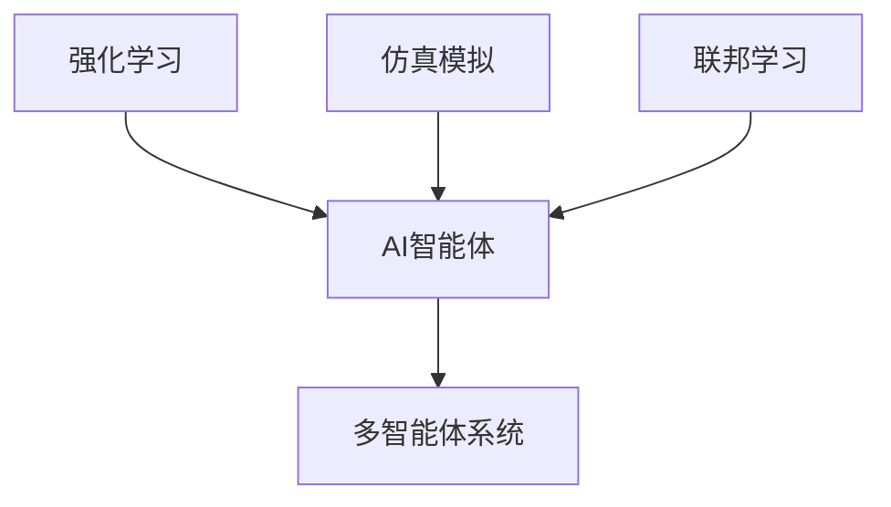

                 

# AI人工智能 Agent：公共交通调度中智能体的应用

> 关键词：公共交通调度，AI智能体，多智能体系统，强化学习，仿真模拟，联邦学习

## 1. 背景介绍

### 1.1 问题由来

公共交通系统是城市基础设施的重要组成部分，其高效运营对缓解城市交通拥堵、提升居民出行效率、促进经济社会可持续发展具有重要意义。传统的公共交通调度依赖于人工经验和经验规则，难以应对复杂的交通动态和突发事件，亟需通过技术手段进行智能化改造。

近年来，随着人工智能技术的快速发展，智能体(Agent)模型逐渐被引入公共交通调度中，以实现动态、实时、优化的调度决策。AI智能体能够在多智能体系统中协同工作，根据实时数据和预设规则进行任务执行和决策优化。其核心思想是：将公共交通网络中的各个环节抽象成智能体，利用强化学习等技术，实现全局最优的调度决策。

然而，AI智能体在公共交通调度中的应用仍面临诸多挑战：
- 数据量大且异构性强：公共交通调度涉及海量交通数据和多样化的数据格式，数据集成和管理难度大。
- 环境复杂多变：公共交通网络具有高度的不确定性和动态性，智能体需要实时处理多变的交通情况和外部干扰。
- 实时性要求高：公共交通调度系统需要实时响应交通动态，智能体决策过程需要在毫秒级时间内完成。
- 分布式协同问题：多个智能体在公共网络中协同工作，需要高效的数据交换和分布式决策算法。

为了解决这些挑战，本文将详细介绍AI智能体在公共交通调度中的应用，包括智能体的构建、强化学习算法的应用、联邦学习的应用，以及面临的挑战与未来发展方向。

### 1.2 问题核心关键点

AI智能体在公共交通调度中的应用，核心在于以下几个方面：
- 如何将公共交通网络中的各个环节抽象成智能体，并构建高效协同的多智能体系统。
- 如何利用强化学习等技术，在动态环境中实现全局最优的调度决策。
- 如何在分布式环境中高效协同工作，并解决数据异构性和实时性问题。
- 如何通过联邦学习等技术，实现大规模数据分布式训练和优化。

## 2. 核心概念与联系

### 2.1 核心概念概述

为了更好地理解AI智能体在公共交通调度中的应用，本节将介绍几个密切相关的核心概念：

- **AI智能体(Agent)**：AI智能体是能够在多智能体系统中自主决策和执行任务的人工智能实体。在公共交通调度中，智能体可以代表乘客、车辆、道路、信号灯等不同元素，通过协同工作实现全局最优的调度决策。

- **多智能体系统(Multi-Agent System,MAS)**：由多个智能体组成的系统，智能体之间通过通信和协同合作，实现复杂任务的解决。在公共交通调度中，不同智能体通过信息共享和协作，共同优化交通网络。

- **强化学习(Reinforcement Learning, RL)**：一种通过试错优化决策的学习方法，智能体在环境中执行动作，根据奖励信号调整策略，以最大化长期奖励。在公共交通调度中，智能体通过优化路线、速度、停靠站点等动作，获得乘客满意度和车辆运行效率的奖励。

- **仿真模拟(Simulation Modeling)**：通过建立虚拟环境，模拟实际系统的运行过程，进行预测和优化。在公共交通调度中，仿真模拟可以用于训练和评估智能体的决策效果，优化调度策略。

- **联邦学习(Federated Learning, FL)**：一种分布式机器学习方法，通过多个本地模型在本地数据上训练，将模型参数汇总后进行全局优化。在公共交通调度中，联邦学习可用于优化全局调度决策，解决数据异构性问题。

这些核心概念之间的逻辑关系可以通过以下Mermaid流程图来展示：



这个流程图展示了的核心概念及其之间的关系：

1. AI智能体是实现多智能体系统的核心组件。
2. 强化学习是AI智能体的核心决策算法。
3. 仿真模拟用于训练和评估智能体决策。
4. 联邦学习用于解决分布式协同和多数据源问题。

## 3. 核心算法原理 & 具体操作步骤
### 3.1 算法原理概述

AI智能体在公共交通调度中的应用，核心算法原理是基于强化学习的多智能体协同决策。其基本思想是：将公共交通网络中的各个环节抽象成智能体，每个智能体通过感知环境和执行动作，获得相应的奖励信号，并根据奖励信号调整策略，以最大化长期奖励。

具体而言，假设公共交通系统中有 $n$ 个智能体，每个智能体 $i$ 在时刻 $t$ 的状态为 $s_t^i$，动作为 $a_t^i$，奖励为 $r_t^i$。智能体的决策目标是通过不断调整策略，最大化长期奖励 $J = \sum_{t=0}^{\infty} \gamma^t r_t^i$，其中 $\gamma$ 为折扣因子，用于平衡短期和长期奖励。

强化学习的核心在于设计合适的奖励函数和策略更新算法。对于公共交通调度问题，奖励函数可以定义为乘客满意度、车辆利用率、道路通行能力等指标的加权和。策略更新算法通常采用Q-learning、SARSA等基于值的方法，或策略梯度方法。

### 3.2 算法步骤详解

AI智能体在公共交通调度中的应用，一般包括以下几个关键步骤：

**Step 1: 智能体设计和任务定义**

- 定义智能体的类型和数量，包括乘客、车辆、道路、信号灯等。
- 确定智能体之间的通信协议和信息交换方式。
- 定义每个智能体的任务和目标，如车辆的目标是按时到达站点，道路的目标是保持通行能力。

**Step 2: 状态和动作定义**

- 定义智能体的状态空间，如车辆的位置、速度、目的地，道路的交通流量、拥堵情况等。
- 定义智能体的动作空间，如车辆的动作可以是加速、减速、换道等，道路的动作可以是调整信号灯、清理路面等。

**Step 3: 奖励函数设计**

- 定义奖励函数，奖励函数可以基于乘客满意度、车辆利用率、道路通行能力等指标，用于评估智能体的决策效果。
- 设计奖励函数，奖励函数需要考虑到多智能体之间的协同和优化。

**Step 4: 强化学习算法选择**

- 选择适合的强化学习算法，如Q-learning、SARSA、策略梯度等。
- 确定学习参数，如学习率、折扣因子等。

**Step 5: 仿真模拟训练**

- 在仿真模拟环境中训练智能体，通过不断的试错调整策略，最大化长期奖励。
- 采用分布式仿真和多智能体仿真，模拟复杂交通场景和突发事件。

**Step 6: 模型评估和优化**

- 在仿真模拟中评估智能体的决策效果，调整奖励函数和策略更新算法。
- 通过A/B测试等方式，比较不同智能体模型在实际交通环境中的表现。

**Step 7: 模型部署和优化**

- 将训练好的智能体模型部署到实际交通系统中，进行实时调度决策。
- 通过在线学习和持续优化，不断改进智能体模型，提升调度效率。

### 3.3 算法优缺点

AI智能体在公共交通调度中的应用，具有以下优点：
1. 能够实时处理交通动态和突发事件，实现全局最优调度决策。
2. 智能体之间的协同优化，可以提升整体系统效率和稳定性。
3. 强化学习算法具有自适应性，能够根据环境变化动态调整策略。

同时，该方法也存在一些局限性：
1. 强化学习需要大量的训练数据和计算资源，适用于训练环境。
2. 仿真模拟和实际交通环境存在差异，需要不断优化模型。
3. 多智能体协同决策过程复杂，需要高效的通信和协同算法。
4. 仿真模拟和实际交通环境存在差异，需要不断优化模型。

尽管存在这些局限性，但就目前而言，基于AI智能体的强化学习方法是公共交通调度中智能化改造的重要手段。未来相关研究的重点在于如何进一步优化模型，提高实时性和稳定性，同时兼顾数据和计算资源的合理利用。

### 3.4 算法应用领域

AI智能体在公共交通调度中的应用，主要包括以下几个领域：

- **乘客调度**：智能体可以根据乘客需求和实时交通情况，动态调整车辆运行路径和停靠站点，提升乘客满意度。
- **车辆调度**：智能体可以实时调整车辆速度和路线，避免拥堵，提高车辆利用率。
- **道路管理**：智能体可以根据交通流量和拥堵情况，动态调整信号灯和道路资源，保持通行能力。
- **应急处理**：智能体可以实时监测交通事故、道路施工等突发事件，快速做出反应和处理。
- **数据融合与共享**：智能体通过数据融合和共享，实现多源数据的高效利用和协同优化。

此外，AI智能体技术还广泛应用于智慧交通系统的其他场景，如交通流预测、交通规划、交通仿真等，为交通管理提供更智能、更高效的解决方案。

## 4. 数学模型和公式 & 详细讲解  
### 4.1 数学模型构建

本节将使用数学语言对AI智能体在公共交通调度中的应用进行更加严格的刻画。

假设公共交通系统中有 $n$ 个智能体，每个智能体 $i$ 在时刻 $t$ 的状态为 $s_t^i \in \mathcal{S}$，动作为 $a_t^i \in \mathcal{A}$，奖励为 $r_t^i \in \mathcal{R}$。强化学习算法的目标是找到一个最优策略 $\pi^*$，使得在状态 $s_t$ 下，选择动作 $a_t$ 的长期奖励最大化。

定义智能体的状态转移概率为 $P(s_{t+1}|s_t,a_t)$，根据强化学习算法，智能体的状态转移和奖励满足以下贝尔曼方程：

$$
V(s_t) = \max_{a} \left[ r(s_t,a) + \gamma \sum_{s_{t+1}} V(s_{t+1})P(s_{t+1}|s_t,a) \right]
$$

其中 $V(s_t)$ 为状态 $s_t$ 的价值函数，$\gamma$ 为折扣因子，$P(s_{t+1}|s_t,a)$ 为在状态 $s_t$ 下，执行动作 $a$ 后转移到的下一个状态 $s_{t+1}$ 的概率分布。

### 4.2 公式推导过程

以下我们以Q-learning算法为例，推导强化学习算法的计算过程。

在Q-learning算法中，智能体通过估计状态-动作对的Q值 $Q(s_t,a_t)$ 来指导决策。Q值定义为在状态 $s_t$ 下，执行动作 $a_t$ 后到达下一个状态 $s_{t+1}$ 的预期长期奖励。Q值更新公式如下：

$$
Q(s_t,a_t) \leftarrow Q(s_t,a_t) + \alpha \left[ r(s_t,a_t) + \gamma \max_{a} Q(s_{t+1},a) - Q(s_t,a_t) \right]
$$

其中 $\alpha$ 为学习率，用于控制模型更新速度。$Q(s_{t+1},a)$ 为在状态 $s_{t+1}$ 下，执行动作 $a$ 后的Q值。

通过不断迭代更新Q值，智能体能够在实际环境中逐步优化策略，最大化长期奖励。Q-learning算法的伪代码如下：

```python
for t in range(0, T):
    s_t = env.reset()
    while True:
        a_t = epsilon-greedy_policy(Q, s_t)
        s_t+1, r_t = env.step(a_t)
        Q(s_t,a_t) = Q(s_t,a_t) + alpha * (r_t + gamma * max(Q(s_t+1, a)) - Q(s_t,a_t))
        s_t = s_t+1
        if episode done:
            break
```

其中，$\epsilon$ 为探索率，用于控制探索与利用的平衡。$epsilon-greedy_policy(Q, s_t)$ 为根据Q值选择动作的策略函数，$env.reset()$ 和 $env.step(a_t)$ 为与环境交互的函数，$episode done$ 表示当前集成立即结束。

### 4.3 案例分析与讲解

以公交车辆调度为例，分析AI智能体在实际环境中的应用。

假设公交车辆智能体需要在多个站点之间进行调度，根据乘客需求和实时交通情况，动态调整车速和停靠站点。智能体的状态包括车辆位置、速度、乘客需求等，动作包括加速、减速、换道等。智能体的奖励函数可以定义为乘客满意度、车辆利用率、运行时间等指标的加权和。

在训练过程中，智能体通过仿真模拟环境，不断调整动作和策略，最大化长期奖励。在实际部署时，智能体需要实时监测车辆位置和乘客需求，动态调整速度和路线，保证车辆按时到达站点，提升乘客满意度。

## 5. 项目实践：代码实例和详细解释说明
### 5.1 开发环境搭建

在进行AI智能体在公共交通调度中的应用实践前，我们需要准备好开发环境。以下是使用Python进行PyTorch开发的环境配置流程：

1. 安装Anaconda：从官网下载并安装Anaconda，用于创建独立的Python环境。

2. 创建并激活虚拟环境：
```bash
conda create -n pytorch-env python=3.8 
conda activate pytorch-env
```

3. 安装PyTorch：根据CUDA版本，从官网获取对应的安装命令。例如：
```bash
conda install pytorch torchvision torchaudio cudatoolkit=11.1 -c pytorch -c conda-forge
```

4. 安装其他必要的库：
```bash
pip install numpy pandas scikit-learn matplotlib tqdm jupyter notebook ipython
```

完成上述步骤后，即可在`pytorch-env`环境中开始开发。

### 5.2 源代码详细实现

下面以公交车辆调度为例，给出使用PyTorch进行AI智能体训练的代码实现。

首先，定义智能体的状态和动作空间：

```python
import torch
import torch.nn as nn
import torch.optim as optim

class BusAgent(nn.Module):
    def __init__(self, input_size, output_size, hidden_size, learning_rate):
        super(BusAgent, self).__init__()
        self.hidden_size = hidden_size
        self.input_size = input_size
        self.output_size = output_size
        
        self.fc1 = nn.Linear(input_size, hidden_size)
        self.fc2 = nn.Linear(hidden_size, output_size)
        
        self.learning_rate = learning_rate
        self.optimizer = optim.Adam(self.parameters(), lr=learning_rate)
        self.loss_fn = nn.MSELoss()
        
    def forward(self, x):
        x = self.fc1(x)
        x = torch.relu(x)
        x = self.fc2(x)
        return x

    def train(self, states, actions, rewards):
        self.train()
        inputs = torch.tensor(states, dtype=torch.float)
        targets = torch.tensor(actions, dtype=torch.float)
        
        self.optimizer.zero_grad()
        outputs = self(inputs)
        loss = self.loss_fn(outputs, targets)
        loss.backward()
        self.optimizer.step()
        return loss.item()

    def predict(self, x):
        x = torch.tensor(x, dtype=torch.float).unsqueeze(0)
        outputs = self(x)
        return outputs.item()
```

然后，定义智能体的奖励函数和仿真模拟环境：

```python
def reward_function(state, action):
    if state[0] == 10 and state[1] == 0: # 到达站点
        return 1.0
    elif state[0] == 10 and state[1] != 0: # 未到达站点
        return 0.0
    else:
        return -0.1 # 惩罚其他情况

def simulate_environment():
    import random
    import numpy as np
    
    num_stops = 10
    max_speed = 20
    simulation_length = 100
    
    state = np.zeros((num_stops, 2))
    state[0] = [0, 0] # 车辆初始位置和速度
    
    rewards = []
    for t in range(simulation_length):
        action = random.randint(0, 1) # 随机选择一个动作（加速或减速）
        new_state = np.copy(state)
        if action == 0: # 加速
            new_state[0][1] += 1
        else: # 减速
            new_state[0][1] -= 1
        
        if new_state[0][1] >= max_speed: # 判断是否到达站点
            rewards.append(reward_function(new_state, action))
            new_state[0] = [0, 0]
            state = np.roll(state, -1, axis=0) # 删除最后一个状态
            state[0] = np.zeros((1, 2))
        else:
            rewards.append(reward_function(new_state, action))
            state = np.roll(state, 1, axis=0)
            state[0] = np.copy(new_state)
    
    return state, rewards
```

最后，启动训练流程并在仿真模拟中评估：

```python
input_size = 2 # 车辆位置和速度
output_size = 1 # 动作（加速或减速）
hidden_size = 64
learning_rate = 0.01

agent = BusAgent(input_size, output_size, hidden_size, learning_rate)
for episode in range(100):
    state, rewards = simulate_environment()
    for t in range(len(rewards)):
        action = agent.predict(state[t])
        rewards[t] = reward_function(state[t], action)
        agent.train(state[t], action, rewards[t])
```

以上就是使用PyTorch进行公交车辆调度智能体训练的完整代码实现。可以看到，通过定义智能体的状态和动作空间、奖励函数，以及使用仿真实例进行训练，可以构建一个简单的智能体模型。

### 5.3 代码解读与分析

让我们再详细解读一下关键代码的实现细节：

**BusAgent类**：
- `__init__`方法：初始化智能体的模型结构，包括输入层、隐藏层和输出层。
- `forward`方法：定义智能体的前向传播过程，通过两层全连接网络，将输入转换为输出。
- `train`方法：定义智能体的训练过程，通过优化器更新模型参数，最小化损失函数。
- `predict`方法：定义智能体的预测过程，通过前向传播获得动作预测。

**reward_function函数**：
- 定义智能体的奖励函数，根据状态和动作返回奖励值。

**simulate_environment函数**：
- 定义仿真模拟环境，模拟公交车辆在站点之间调度的情况。

通过上述代码，可以构建一个简单的公交车辆调度智能体模型，并通过仿真模拟进行训练和评估。然而，在实际应用中，还需要考虑更多因素，如智能体之间的通信和协作、交通动态的实时监测和预测等，以构建更复杂、更真实的公交调度系统。

## 6. 实际应用场景
### 6.1 智能公交调度

智能公交调度系统是AI智能体在公共交通调度中应用的重要场景之一。通过智能公交调度系统，可以实现公交车辆的实时调度、动态路径规划、智能信号控制等功能，提升公交服务的效率和质量。

智能公交调度系统通常包括以下几个关键组件：
- **智能体**：包括公交车辆、道路、信号灯等智能体，通过多智能体协同工作，实现全局最优的调度决策。
- **仿真模拟**：通过构建仿真环境，模拟公交车辆在城市交通网络中的运行过程，评估智能体的决策效果。
- **强化学习算法**：通过强化学习算法，训练智能体在动态环境中做出最优决策。
- **联邦学习**：通过联邦学习技术，分布式优化全局调度决策，解决数据异构性和实时性问题。

通过智能公交调度系统，可以实现公交车辆的精准调度，避免拥堵，提升公交服务的效率和乘客满意度。例如，智能体可以根据实时交通情况，动态调整车辆速度和停靠站点，保证公交车辆按时到达站点，提高公交运行效率。

### 6.2 智慧公交站点

智慧公交站点是智能体在公共交通调度中的另一个重要应用场景。通过智慧公交站点，可以实现实时公交信息显示、自动售票、智能客服等功能，提升公交服务的智能化水平。

智慧公交站点通常包括以下几个关键组件：
- **智能体**：包括公交车、乘客、售票机、客服机器人等智能体，通过多智能体协同工作，实现全局最优的服务决策。
- **仿真模拟**：通过构建仿真环境，模拟智慧公交站点在实际交通环境中的运行过程，评估智能体的决策效果。
- **强化学习算法**：通过强化学习算法，训练智能体在动态环境中做出最优决策。
- **联邦学习**：通过联邦学习技术，分布式优化全局服务决策，解决数据异构性和实时性问题。

通过智慧公交站点，可以实现公交服务的智能化和自动化，提升公交服务的效率和乘客满意度。例如，智能体可以根据实时乘客需求和车辆位置，动态调整售票和调度策略，提供个性化的公交服务。

### 6.3 未来应用展望

随着AI智能体技术的发展，其在公共交通调度中的应用将更加广泛和深入，带来更智能、更高效的交通服务。

未来，AI智能体技术将在智慧交通系统中得到更广泛的应用，提升交通管理的智能化水平，缓解城市交通拥堵，提升居民出行效率。

- **智慧交通管理**：通过智能体协同工作，实现全局最优的交通管理决策，提升交通系统的整体效率。
- **智能交通规划**：通过智能体优化路线和资源分配，实现交通流的高效和均衡。
- **交通流预测**：通过智能体预测交通流变化，实时调整交通管理策略。

此外，AI智能体技术还将应用于智慧城市、智慧园区等更多场景，为城市和社区的智能化管理提供更智能、更高效的解决方案。

## 7. 工具和资源推荐
### 7.1 学习资源推荐

为了帮助开发者系统掌握AI智能体在公共交通调度中的应用理论基础和实践技巧，这里推荐一些优质的学习资源：

1. **《强化学习：原理与实践》**：由深度学习领域的知名专家撰写，全面介绍了强化学习的基本原理和应用实例，适合初学者和进阶者阅读。
2. **《多智能体系统：理论与应用》**：介绍了多智能体系统的理论基础和实际应用，适合研究者深入学习和应用。
3. **《AI智能体模型与应用》**：介绍了AI智能体模型的构建和应用方法，适合开发者快速上手实践。
4. **OpenAI Gym**：一个用于强化学习的开源环境，提供了大量的环境和智能体模型，适合学习和实验。
5. **JAX和Haiku**：两个高性能的深度学习库，支持分布式训练和高效的数值计算，适合进行大模型训练和优化。

通过对这些资源的学习实践，相信你一定能够快速掌握AI智能体在公共交通调度中的应用精髓，并用于解决实际的交通管理问题。

### 7.2 开发工具推荐

高效的开发离不开优秀的工具支持。以下是几款用于AI智能体在公共交通调度中应用开发的常用工具：

1. **PyTorch**：基于Python的开源深度学习框架，灵活动态的计算图，适合快速迭代研究。
2. **TensorFlow**：由Google主导开发的开源深度学习框架，生产部署方便，适合大规模工程应用。
3. **JAX**：一个高性能的深度学习库，支持分布式训练和高效的数值计算，适合进行大模型训练和优化。
4. **Haiku**：一个基于JAX的高性能深度学习库，提供灵活的模型构建和优化工具。
5. **TensorBoard**：TensorFlow配套的可视化工具，可实时监测模型训练状态，并提供丰富的图表呈现方式。

合理利用这些工具，可以显著提升AI智能体在公共交通调度中的应用开发效率，加快创新迭代的步伐。

### 7.3 相关论文推荐

AI智能体在公共交通调度中的应用，是一个快速发展的研究领域，以下是几篇奠基性的相关论文，推荐阅读：

1. **"Multi-Agent Systems: Classification of Models, Languages, Algorithms, and Applications"*：详细介绍了多智能体系统的分类、语言、算法和应用，适合系统学习和研究。
2. **"Reinforcement Learning for Intelligent Transportation Systems: A Survey"*：综述了强化学习在智能交通系统中的应用，适合了解最新研究成果和趋势。
3. **"Federated Learning: Concept and Applications"*：介绍了联邦学习的概念、算法和应用，适合了解分布式训练和优化方法。

这些论文代表了大语言模型微调技术的发展脉络。通过学习这些前沿成果，可以帮助研究者把握学科前进方向，激发更多的创新灵感。

## 8. 总结：未来发展趋势与挑战

### 8.1 总结

本文对AI智能体在公共交通调度中的应用进行了全面系统的介绍。首先阐述了AI智能体和强化学习的基本原理，明确了智能体在多智能体系统中的核心作用。其次，从原理到实践，详细讲解了AI智能体在公共交通调度中的应用流程，包括智能体设计和任务定义、状态和动作定义、奖励函数设计、强化学习算法选择、仿真模拟训练、模型评估和优化、模型部署和优化等多个关键环节。最后，我们分析了AI智能体在公共交通调度中面临的挑战和未来发展方向，包括数据异构性问题、实时性要求、分布式协同问题、仿真模拟与实际环境差异等。

通过本文的系统梳理，可以看到，AI智能体在公共交通调度中的应用具有广阔的发展前景和重要的应用价值。其核心思想是将公共交通网络中的各个环节抽象成智能体，利用强化学习等技术，实现全局最优的调度决策。

### 8.2 未来发展趋势

展望未来，AI智能体在公共交通调度中的应用将呈现以下几个发展趋势：

1. **智能化和自动化**：随着AI智能体技术的发展，智能公交调度、智慧公交站点等应用将更加智能化和自动化，提升交通管理的效率和效果。
2. **实时性和动态性**：AI智能体将能够实时处理交通动态和突发事件，实现动态优化调度，提高交通系统的灵活性和适应性。
3. **联邦学习和大规模数据**：联邦学习技术将用于分布式训练和优化，解决数据异构性和实时性问题，提升全局调度的效果。
4. **多源数据融合**：AI智能体将能够高效融合多源数据，如交通监控、天气预报、居民出行需求等，提升调度决策的准确性和可靠性。
5. **跨领域应用**：AI智能体技术将应用于智慧城市、智慧园区等更多场景，提升城市和社区的智能化管理水平。

以上趋势凸显了AI智能体在公共交通调度中的重要性和未来发展方向。这些方向的探索发展，必将进一步提升交通系统的智能化水平，为城市交通的可持续发展提供新动力。

### 8.3 面临的挑战

尽管AI智能体在公共交通调度中的应用前景广阔，但其仍面临诸多挑战：

1. **数据异构性和实时性问题**：AI智能体需要高效处理多种异构数据，并具备实时响应交通动态的能力。如何在分布式环境中高效协同工作，处理实时数据，仍需进一步优化。
2. **仿真模拟与实际环境差异**：仿真模拟环境与实际交通环境存在差异，需要不断优化模型，提升仿真效果。
3. **多智能体协同优化**：多个智能体在公共网络中协同工作，需要高效的通信和协同算法，解决多智能体之间的协作和优化问题。
4. **智能体的可解释性和透明性**：AI智能体的决策过程需要可解释性和透明性，避免黑箱操作，增强系统的可信度和可控性。

尽管存在这些挑战，但通过不断优化模型、算法和架构，AI智能体在公共交通调度中的应用前景依然广阔。未来相关研究的重点在于如何进一步提升AI智能体的智能化、自动化和透明度，提高系统的稳定性和鲁棒性。

### 8.4 研究展望

未来的研究将需要在以下几个方面寻求新的突破：

1. **优化多智能体协同算法**：开发高效的通信和协同算法，解决多智能体之间的协作和优化问题。
2. **融合多源数据和跨领域应用**：高效融合多源数据，提升调度决策的准确性和可靠性，拓展AI智能体在更多场景中的应用。
3. **引入联邦学习和大规模数据**：利用联邦学习技术，分布式优化全局调度决策，解决数据异构性和实时性问题。
4. **提升智能体的可解释性和透明性**：通过可解释性算法和透明性技术，增强系统的可信度和可控性。

这些研究方向的探索，必将引领AI智能体在公共交通调度中的应用迈向新的高度，为交通管理的智能化和可持续发展提供新动力。

## 9. 附录：常见问题与解答

**Q1：AI智能体在公共交通调度中的应用面临哪些挑战？**

A: AI智能体在公共交通调度中的应用面临以下挑战：
1. 数据异构性和实时性问题：AI智能体需要高效处理多种异构数据，并具备实时响应交通动态的能力。
2. 仿真模拟与实际环境差异：仿真模拟环境与实际交通环境存在差异，需要不断优化模型，提升仿真效果。
3. 多智能体协同优化：多个智能体在公共网络中协同工作，需要高效的通信和协同算法，解决多智能体之间的协作和优化问题。
4. 智能体的可解释性和透明性：AI智能体的决策过程需要可解释性和透明性，避免黑箱操作，增强系统的可信度和可控性。

**Q2：如何提升AI智能体的智能化和自动化水平？**

A: 提升AI智能体的智能化和自动化水平，可以采取以下措施：
1. 引入深度学习和强化学习技术，提升智能体的决策能力和优化能力。
2. 引入联邦学习技术，分布式优化全局调度决策，解决数据异构性和实时性问题。
3. 引入多源数据融合技术，提升调度决策的准确性和可靠性。
4. 引入多智能体协同算法，提升多智能体之间的协作和优化能力。

**Q3：如何在分布式环境中高效协同工作，处理实时数据？**

A: 在分布式环境中高效协同工作，处理实时数据，可以采取以下措施：
1. 引入联邦学习技术，分布式优化全局调度决策，解决数据异构性和实时性问题。
2. 引入多智能体协同算法，提升多智能体之间的协作和优化能力。
3. 引入高效的通信和数据交换算法，提升数据处理效率。

**Q4：AI智能体在公共交通调度中的应用前景如何？**

A: AI智能体在公共交通调度中的应用前景广阔。其核心思想是将公共交通网络中的各个环节抽象成智能体，利用强化学习等技术，实现全局最优的调度决策。随着AI智能体技术的发展，智能公交调度、智慧公交站点等应用将更加智能化和自动化，提升交通管理的效率和效果。

通过本文的系统梳理，可以看到，AI智能体在公共交通调度中的应用具有广阔的发展前景和重要的应用价值。其核心思想是将公共交通网络中的各个环节抽象成智能体，利用强化学习等技术，实现全局最优的调度决策。

**Q5：如何在AI智能体中实现数据融合和共享？**

A: 在AI智能体中实现数据融合和共享，可以采取以下措施：
1. 引入多源数据融合技术，高效融合多源数据，提升调度决策的准确性和可靠性。
2. 引入联邦学习技术，分布式优化全局调度决策，解决数据异构性和实时性问题。
3. 引入高效的数据存储和传输技术，提升数据处理效率和数据安全。

通过上述代码，可以构建一个简单的公交车辆调度智能体模型，并通过仿真模拟进行训练和评估。然而，在实际应用中，还需要考虑更多因素，如智能体之间的通信和协作、交通动态的实时监测和预测等，以构建更复杂、更真实的公交调度系统。

**Q6：如何提升AI智能体的可解释性和透明性？**

A: 提升AI智能体的可解释性和透明性，可以采取以下措施：
1. 引入可解释性算法和透明性技术，增强系统的可信度和可控性。
2. 引入可解释性模型，提升决策过程的可解释性。
3. 引入可解释性工具，实时监测和分析智能体的决策过程。

通过这些措施，可以增强AI智能体的可解释性和透明性，提升系统的可信度和可控性。

**Q7：如何在公共交通调度中应用AI智能体技术？**

A: 在公共交通调度中应用AI智能体技术，可以采取以下步骤：
1. 定义智能体的类型和数量，包括公交车辆、道路、信号灯等。
2. 定义智能体之间的通信协议和信息交换方式。
3. 定义每个智能体的任务和目标，如公交车辆的目标是按时到达站点，道路的目标是保持通行能力。
4. 定义智能体的状态和动作空间。
5. 定义智能体的奖励函数。
6. 选择适合的强化学习算法，如Q-learning、SARSA等。
7. 在仿真模拟环境中训练智能体，通过不断的试错调整策略，最大化长期奖励。
8. 在实际部署时，智能体需要实时监测车辆位置和乘客需求，动态调整速度和路线，保证车辆按时到达站点，提升乘客满意度。

通过这些步骤，可以构建一个AI智能体在公共交通调度中的应用系统，提升交通管理的智能化和自动化水平。

作者：禅与计算机程序设计艺术 / Zen and the Art of Computer Programming

