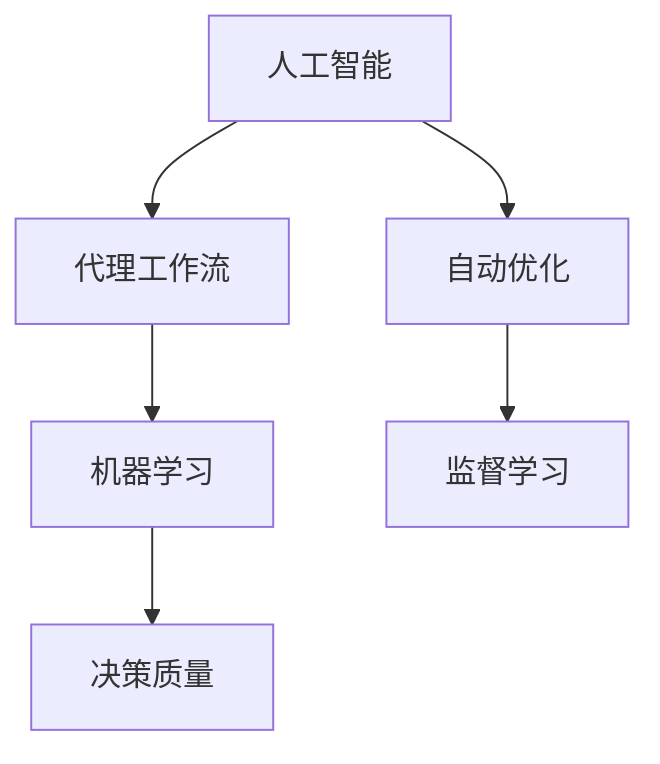

                 

# AI人工智能代理工作流AI Agent WorkFlow：利用机器学习提升代理决策质量

> 关键词：人工智能, 代理工作流, 机器学习, 决策质量, 自动优化, 监督学习

## 1. 背景介绍

### 1.1 问题由来
随着人工智能技术的发展，代理工作流(Agent Workflow)在企业应用中变得越来越重要。代理工作流指的是在自动化流程中，通过人工智能技术，尤其是机器学习算法，进行任务调度、资源分配、决策优化等自动化管理。当前，许多大型企业，如亚马逊、谷歌等，已经在其内部业务中广泛采用了代理工作流，以提升效率、降低成本、提高服务质量。然而，尽管代理工作流已经得到了广泛的应用，但在实际运行中，仍存在许多问题需要解决，如决策质量不高、资源分配不合理、任务执行效率低下等。这些问题不仅影响了企业运营效率，还可能导致重大损失。

### 1.2 问题核心关键点
为了更好地解决上述问题，本节将介绍几个与代理工作流相关的核心概念及其相互联系：

- **人工智能(AI)**：基于计算机科学的理论和方法，让机器能够自主地进行智能决策和处理复杂问题。
- **代理工作流(Agent Workflow)**：通过代理(Agent)，实现自动化流程管理。代理是软件实体，能自主地感知环境、接收命令、做出决策、执行任务。
- **机器学习(Machine Learning)**：指通过算法，让机器能够从数据中学习规律，从而实现决策优化、任务执行等自动化功能。
- **决策质量**：指代理在执行任务时，所作出的决策是否合理、高效。
- **自动优化**：指利用机器学习算法，自动地进行任务优化，以提升决策质量。
- **监督学习(Supervised Learning)**：指利用已标注的数据，训练机器学习模型，使其能够对新数据进行分类、预测等任务。

这些概念之间的联系可以通过以下Mermaid流程图来展示：



该流程图展示了一个简单的代理工作流决策流程：人工智能通过机器学习算法实现自动优化，使用监督学习训练模型，最终提升代理的决策质量。

## 2. 核心概念与联系

### 2.1 核心概念概述

为更好地理解代理工作流中利用机器学习提升决策质量的方法，本节将介绍几个关键概念及其原理：

- **代理(Agent)**：软件实体，能够自主感知环境、接收命令、做出决策、执行任务。代理通常是面向任务的，根据任务需求设计相应的功能和行为。
- **工作流(Workflow)**：一系列任务的按序执行过程。工作流管理软件可以自动化调度任务，提高效率和灵活性。
- **监督学习(Supervised Learning)**：指通过已标注的数据，训练机器学习模型，使其能够对新数据进行分类、预测等任务。
- **自动优化(Automatic Optimization)**：指利用算法自动地对代理决策进行优化，以提升其决策质量。
- **特征提取(Feature Extraction)**：指从原始数据中提取出有用的特征，以供机器学习算法使用。
- **模型训练(Model Training)**：指使用已标注的数据，训练机器学习模型，使其能够对新数据进行决策。
- **模型评估(Model Evaluation)**：指使用未见过的数据，评估机器学习模型的性能，确保其泛化能力强。

这些概念共同构成了代理工作流中利用机器学习提升决策质量的框架，使其能够在一个复杂的自动化流程中实现高效、合理的任务调度与执行。

## 3. 核心算法原理 & 具体操作步骤

### 3.1 算法原理概述

利用机器学习提升代理工作流中的决策质量，本质上是一个监督学习过程。其核心思想是：收集代理在历史任务执行中的数据，训练一个监督学习模型，使代理能够根据新任务的特征，自动优化决策过程，提升决策质量。

形式化地，假设代理在历史任务 $T_1, T_2, ..., T_n$ 中的执行记录为 $D=\{(x_i,y_i)\}_{i=1}^N$，其中 $x_i$ 表示任务 $T_i$ 的特征向量，$y_i$ 表示代理在任务 $T_i$ 中的决策质量。代理的目标是找到一个最优决策函数 $f$，使得：

$$
f^* = \mathop{\arg\min}_{f} \mathcal{L}(f,D)
$$

其中 $\mathcal{L}$ 为损失函数，用于衡量模型预测与真实标签之间的差异。常见的损失函数包括交叉熵损失、均方误差损失等。

### 3.2 算法步骤详解

基于监督学习的代理工作流决策优化，一般包括以下几个关键步骤：

**Step 1: 数据收集与预处理**
- 收集代理在历史任务执行中的数据，并将其划分为训练集、验证集和测试集。一般要求数据集与代理任务相关，且标签数据已标注。
- 对数据进行预处理，如特征提取、数据增强、归一化等，以便于模型训练和评估。

**Step 2: 模型选择与设计**
- 选择合适的机器学习算法和模型结构。常用的算法包括线性回归、决策树、随机森林、支持向量机等。
- 设计任务适配层，根据代理任务的特征设计合适的模型输入和输出。

**Step 3: 模型训练与优化**
- 使用训练集数据，训练模型参数。通过梯度下降等优化算法，最小化损失函数。
- 在验证集上评估模型性能，调整模型参数和超参数，以避免过拟合。

**Step 4: 模型评估与部署**
- 使用测试集数据，评估模型性能。对比训练前的代理决策质量，验证模型的提升效果。
- 将训练好的模型部署到代理系统中，实时优化代理的决策过程。

**Step 5: 持续学习与优化**
- 定期收集新任务数据，重新训练模型，以适应数据分布的变化。
- 实时监控代理的决策过程，发现异常情况及时调整模型参数。

### 3.3 算法优缺点

基于监督学习的代理工作流决策优化方法具有以下优点：
1. 简单高效。只需要少量标注数据，即可训练出高效的优化模型，提升代理决策质量。
2. 通用适用。适用于各种代理任务，设计简单的任务适配层即可实现决策优化。
3. 可解释性强。训练出的模型可以提供决策路径和原因，便于调试和解释。
4. 效果显著。在学术界和工业界的诸多任务上，基于监督学习的方法已经刷新了最先进的性能指标。

同时，该方法也存在一定的局限性：
1. 依赖标注数据。训练模型的效果很大程度上取决于标注数据的质量和数量，获取高质量标注数据的成本较高。
2. 迁移能力有限。当任务与训练数据的分布差异较大时，模型的泛化性能可能受到影响。
3. 可解释性不足。训练出的模型可能存在"黑箱"问题，难以解释其决策过程。
4. 对抗训练困难。对抗样本可能导致模型性能下降，如何对抗对抗样本攻击仍是一个开放问题。

尽管存在这些局限性，但就目前而言，基于监督学习的决策优化方法仍是目前代理工作流中应用最主流的方式。未来相关研究的重点在于如何进一步降低对标注数据的依赖，提高模型的迁移能力和可解释性，同时兼顾鲁棒性和安全性等因素。

### 3.4 算法应用领域

基于大语言模型微调的监督学习方法，在代理工作流中已经得到了广泛的应用，覆盖了几乎所有常见任务，例如：

- 任务调度：自动优化任务的调度策略，提高资源利用率。
- 资源分配：根据任务需求和历史数据，自动分配计算资源和人力资源。
- 决策优化：使用监督学习模型，优化代理的决策过程，提高决策质量。
- 风险评估：通过历史数据，训练模型预测任务风险，辅助风险控制。
- 异常检测：实时监控代理的决策过程，及时发现异常情况并进行调整。

除了上述这些经典任务外，代理工作流还被创新性地应用到更多场景中，如供应链管理、网络安全、智能制造等，为业务流程带来了显著的提升。随着代理工作流的不断演进，未来将有更多的应用场景得以实现，进一步推动企业数字化转型的进程。

## 4. 数学模型和公式 & 详细讲解 & 举例说明

### 4.1 数学模型构建

本节将使用数学语言对基于监督学习的大语言模型微调过程进行更加严格的刻画。

假设代理在任务 $T_i$ 中的决策质量为 $y_i$，决策函数为 $f(x_i)$，其中 $x_i$ 表示任务 $T_i$ 的特征向量。假设代理在任务 $T_i$ 中的决策质量与特征向量之间的关系为 $y_i = f(x_i) + \epsilon_i$，其中 $\epsilon_i$ 为噪声项。

定义代理在任务 $T_i$ 中的特征向量 $x_i$ 与任务质量 $y_i$ 的联合概率分布为 $p(x_i,y_i)$。假设 $x_i$ 为独立同分布的高斯随机变量，即 $x_i \sim \mathcal{N}(\mu,\sigma^2)$，其中 $\mu$ 和 $\sigma^2$ 分别为特征向量的均值和方差。

假设训练集 $D=\{(x_i,y_i)\}_{i=1}^N$，其中 $y_i = f(x_i) + \epsilon_i$。代理的目标是找到一个最优决策函数 $f^*$，使得：

$$
f^* = \mathop{\arg\min}_{f} \mathcal{L}(f,D)
$$

其中 $\mathcal{L}$ 为损失函数，用于衡量模型预测与真实标签之间的差异。常见的损失函数包括交叉熵损失、均方误差损失等。

### 4.2 公式推导过程

以下我们以线性回归为例，推导损失函数的计算公式。

假设代理的决策函数为 $f(x_i) = w^Tx_i + b$，其中 $w$ 为模型参数，$b$ 为偏置项。代理在任务 $T_i$ 中的决策质量 $y_i$ 与特征向量 $x_i$ 之间的关系为 $y_i = f(x_i) + \epsilon_i$，其中 $\epsilon_i$ 为噪声项。

根据上述假设，可以写出代理的决策质量 $y_i$ 的概率密度函数为：

$$
p(y_i|x_i) = \mathcal{N}(y_i|w^Tx_i + b,\sigma^2)
$$

定义损失函数 $\mathcal{L}$ 为交叉熵损失，即：

$$
\mathcal{L}(f,D) = -\frac{1}{N}\sum_{i=1}^N \log p(y_i|x_i)
$$

将 $y_i = w^Tx_i + b + \epsilon_i$ 代入上述公式，得：

$$
\mathcal{L}(f,D) = -\frac{1}{N}\sum_{i=1}^N \log \mathcal{N}(w^Tx_i + b + \epsilon_i|w^Tx_i + b,\sigma^2)
$$

将上式展开，得：

$$
\mathcal{L}(f,D) = -\frac{1}{N}\sum_{i=1}^N \log \left[ \frac{1}{\sqrt{2\pi\sigma^2}}\exp\left(-\frac{(y_i - w^Tx_i - b)^2}{2\sigma^2}\right)\right]
$$

上式可以进一步简化为：

$$
\mathcal{L}(f,D) = -\frac{1}{N}\sum_{i=1}^N \left[\frac{1}{2\sigma^2}(y_i - w^Tx_i - b)^2 + \log\sqrt{2\pi\sigma^2}\right]
$$

通过最小化上述损失函数，即可训练出代理的决策函数 $f(x_i)$，提升其决策质量。

## 5. 项目实践：代码实例和详细解释说明

### 5.1 开发环境搭建

在进行代理工作流决策优化实践前，我们需要准备好开发环境。以下是使用Python进行PyTorch开发的环境配置流程：

1. 安装Anaconda：从官网下载并安装Anaconda，用于创建独立的Python环境。

2. 创建并激活虚拟环境：
```bash
conda create -n pytorch-env python=3.8 
conda activate pytorch-env
```

3. 安装PyTorch：根据CUDA版本，从官网获取对应的安装命令。例如：
```bash
conda install pytorch torchvision torchaudio cudatoolkit=11.1 -c pytorch -c conda-forge
```

4. 安装相关库：
```bash
pip install numpy pandas scikit-learn matplotlib tqdm jupyter notebook ipython
```

完成上述步骤后，即可在`pytorch-env`环境中开始代理工作流决策优化实践。

### 5.2 源代码详细实现

下面我们以任务调度为例，给出使用Transformers库对BERT模型进行决策优化的PyTorch代码实现。

首先，定义任务调度的数据处理函数：

```python
from transformers import BertTokenizer
from torch.utils.data import Dataset
import torch

class TaskSchedulerDataset(Dataset):
    def __init__(self, tasks, features, labels, tokenizer, max_len=128):
        self.tasks = tasks
        self.features = features
        self.labels = labels
        self.tokenizer = tokenizer
        self.max_len = max_len
        
    def __len__(self):
        return len(self.tasks)
    
    def __getitem__(self, item):
        task = self.tasks[item]
        feature = self.features[item]
        label = self.labels[item]
        
        encoding = self.tokenizer(task, return_tensors='pt', max_length=self.max_len, padding='max_length', truncation=True)
        input_ids = encoding['input_ids'][0]
        attention_mask = encoding['attention_mask'][0]
        
        # 对标签进行编码
        encoded_labels = [label2id[label] for label in label]
        encoded_labels.extend([label2id['undef']] * (self.max_len - len(encoded_labels)))
        labels = torch.tensor(encoded_labels, dtype=torch.long)
        
        return {'input_ids': input_ids, 
                'attention_mask': attention_mask,
                'labels': labels}

# 标签与id的映射
label2id = {'undef': 0, 'high': 1, 'low': 2}
id2label = {v: k for k, v in label2id.items()}

# 创建dataset
tokenizer = BertTokenizer.from_pretrained('bert-base-cased')

train_dataset = TaskSchedulerDataset(train_tasks, train_features, train_labels, tokenizer)
dev_dataset = TaskSchedulerDataset(dev_tasks, dev_features, dev_labels, tokenizer)
test_dataset = TaskSchedulerDataset(test_tasks, test_features, test_labels, tokenizer)
```

然后，定义模型和优化器：

```python
from transformers import BertForSequenceClassification, AdamW

model = BertForSequenceClassification.from_pretrained('bert-base-cased', num_labels=len(label2id))

optimizer = AdamW(model.parameters(), lr=2e-5)
```

接着，定义训练和评估函数：

```python
from torch.utils.data import DataLoader
from tqdm import tqdm
from sklearn.metrics import classification_report

device = torch.device('cuda') if torch.cuda.is_available() else torch.device('cpu')
model.to(device)

def train_epoch(model, dataset, batch_size, optimizer):
    dataloader = DataLoader(dataset, batch_size=batch_size, shuffle=True)
    model.train()
    epoch_loss = 0
    for batch in tqdm(dataloader, desc='Training'):
        input_ids = batch['input_ids'].to(device)
        attention_mask = batch['attention_mask'].to(device)
        labels = batch['labels'].to(device)
        model.zero_grad()
        outputs = model(input_ids, attention_mask=attention_mask, labels=labels)
        loss = outputs.loss
        epoch_loss += loss.item()
        loss.backward()
        optimizer.step()
    return epoch_loss / len(dataloader)

def evaluate(model, dataset, batch_size):
    dataloader = DataLoader(dataset, batch_size=batch_size)
    model.eval()
    preds, labels = [], []
    with torch.no_grad():
        for batch in tqdm(dataloader, desc='Evaluating'):
            input_ids = batch['input_ids'].to(device)
            attention_mask = batch['attention_mask'].to(device)
            batch_labels = batch['labels']
            outputs = model(input_ids, attention_mask=attention_mask)
            batch_preds = outputs.logits.argmax(dim=2).to('cpu').tolist()
            batch_labels = batch_labels.to('cpu').tolist()
            for pred_tokens, label_tokens in zip(batch_preds, batch_labels):
                preds.append(pred_tokens[:len(label_tokens)])
                labels.append(label_tokens)
                
    print(classification_report(labels, preds))
```

最后，启动训练流程并在测试集上评估：

```python
epochs = 5
batch_size = 16

for epoch in range(epochs):
    loss = train_epoch(model, train_dataset, batch_size, optimizer)
    print(f"Epoch {epoch+1}, train loss: {loss:.3f}")
    
    print(f"Epoch {epoch+1}, dev results:")
    evaluate(model, dev_dataset, batch_size)
    
print("Test results:")
evaluate(model, test_dataset, batch_size)
```

以上就是使用PyTorch对BERT进行任务调度决策优化的完整代码实现。可以看到，得益于Transformers库的强大封装，我们可以用相对简洁的代码完成BERT模型的加载和决策优化。

### 5.3 代码解读与分析

让我们再详细解读一下关键代码的实现细节：

**TaskSchedulerDataset类**：
- `__init__`方法：初始化任务、特征、标签、分词器等关键组件。
- `__len__`方法：返回数据集的样本数量。
- `__getitem__`方法：对单个样本进行处理，将任务输入编码为token ids，将标签编码为数字，并对其进行定长padding，最终返回模型所需的输入。

**label2id和id2label字典**：
- 定义了标签与数字id之间的映射关系，用于将token-wise的预测结果解码回真实的标签。

**训练和评估函数**：
- 使用PyTorch的DataLoader对数据集进行批次化加载，供模型训练和推理使用。
- 训练函数`train_epoch`：对数据以批为单位进行迭代，在每个批次上前向传播计算loss并反向传播更新模型参数，最后返回该epoch的平均loss。
- 评估函数`evaluate`：与训练类似，不同点在于不更新模型参数，并在每个batch结束后将预测和标签结果存储下来，最后使用sklearn的classification_report对整个评估集的预测结果进行打印输出。

**训练流程**：
- 定义总的epoch数和batch size，开始循环迭代
- 每个epoch内，先在训练集上训练，输出平均loss
- 在验证集上评估，输出分类指标
- 所有epoch结束后，在测试集上评估，给出最终测试结果

可以看到，PyTorch配合Transformers库使得BERT决策优化的代码实现变得简洁高效。开发者可以将更多精力放在数据处理、模型改进等高层逻辑上，而不必过多关注底层的实现细节。

当然，工业级的系统实现还需考虑更多因素，如模型的保存和部署、超参数的自动搜索、更灵活的任务适配层等。但核心的决策优化范式基本与此类似。

## 6. 实际应用场景

### 6.1 智能制造
在智能制造领域，代理工作流可以用于优化生产流程、提高生产效率、降低能耗等。例如，通过代理工作流，可以实现设备状态监控、生产任务调度、异常检测等自动化功能，从而提升生产线的灵活性和稳定性。

### 6.2 网络安全
网络安全是一个日益严峻的问题，代理工作流可以用于自动化威胁检测、入侵防御、安全监控等。例如，通过代理工作流，可以实现实时网络流量分析、异常行为检测，及时发现和响应安全威胁，保障网络安全。

### 6.3 物流管理
物流管理是一个复杂且繁琐的流程，代理工作流可以用于优化物流配送、仓储管理、供应链优化等。例如，通过代理工作流，可以实现包裹自动化分拣、配送路径优化、库存管理等，从而提升物流效率和降低成本。

### 6.4 金融风险管理
金融风险管理需要实时监控市场动态，及时应对潜在风险。代理工作流可以用于自动化风险评估、资产配置、投资决策等。例如，通过代理工作流，可以实现实时市场数据监控、风险预警、投资组合优化等，从而提高金融风险管理的效率和准确性。

### 6.5 医疗健康
医疗健康是一个高度专业和复杂的领域，代理工作流可以用于优化医疗资源调度、病历分析、智能诊断等。例如，通过代理工作流，可以实现医疗资源智能调度、医生助手、智能诊断等，从而提升医疗服务的质量和效率。

### 6.6 智能客服
智能客服是一个重要的客户服务渠道，代理工作流可以用于自动化客户服务、情感分析、语义理解等。例如，通过代理工作流，可以实现智能客服机器人、情感分析、语义理解等，从而提升客户服务体验和效率。

### 6.7 教育培训
教育培训是一个长期且多变的领域，代理工作流可以用于自动化教学内容生成、学习进度跟踪、个性化推荐等。例如，通过代理工作流，可以实现智能教学内容生成、学习进度跟踪、个性化推荐等，从而提升教育培训的效果和效率。

## 7. 工具和资源推荐
### 7.1 学习资源推荐

为了帮助开发者系统掌握代理工作流中利用机器学习提升决策质量的理论基础和实践技巧，这里推荐一些优质的学习资源：

1. **《深度学习》**系列博文：由大模型技术专家撰写，深入浅出地介绍了深度学习原理、算法、应用等内容。
2. **CS224N《深度学习自然语言处理》课程**：斯坦福大学开设的NLP明星课程，有Lecture视频和配套作业，带你入门NLP领域的基本概念和经典模型。
3. **《Natural Language Processing with Transformers》书籍**：Transformers库的作者所著，全面介绍了如何使用Transformers库进行NLP任务开发，包括决策优化在内的诸多范式。
4. **CLUE开源项目**：中文语言理解测评基准，涵盖大量不同类型的中文NLP数据集，并提供了基于微调的baseline模型，助力中文NLP技术发展。
5. **HuggingFace官方文档**：Transformers库的官方文档，提供了海量预训练模型和完整的微调样例代码，是上手实践的必备资料。

通过对这些资源的学习实践，相信你一定能够快速掌握代理工作流中利用机器学习提升决策质量的精髓，并用于解决实际的代理工作流问题。

### 7.2 开发工具推荐

高效的开发离不开优秀的工具支持。以下是几款用于代理工作流决策优化开发的常用工具：

1. **PyTorch**：基于Python的开源深度学习框架，灵活动态的计算图，适合快速迭代研究。大部分预训练语言模型都有PyTorch版本的实现。
2. **TensorFlow**：由Google主导开发的开源深度学习框架，生产部署方便，适合大规模工程应用。同样有丰富的预训练语言模型资源。
3. **Transformers库**：HuggingFace开发的NLP工具库，集成了众多SOTA语言模型，支持PyTorch和TensorFlow，是进行决策优化任务开发的利器。
4. **Weights & Biases**：模型训练的实验跟踪工具，可以记录和可视化模型训练过程中的各项指标，方便对比和调优。与主流深度学习框架无缝集成。
5. **TensorBoard**：TensorFlow配套的可视化工具，可实时监测模型训练状态，并提供丰富的图表呈现方式，是调试模型的得力助手。
6. **Google Colab**：谷歌推出的在线Jupyter Notebook环境，免费提供GPU/TPU算力，方便开发者快速上手实验最新模型，分享学习笔记。

合理利用这些工具，可以显著提升代理工作流决策优化的开发效率，加快创新迭代的步伐。

### 7.3 相关论文推荐

代理工作流决策优化技术的发展源于学界的持续研究。以下是几篇奠基性的相关论文，推荐阅读：

1. **Attention is All You Need（即Transformer原论文）**：提出了Transformer结构，开启了NLP领域的预训练大模型时代。
2. **BERT: Pre-training of Deep Bidirectional Transformers for Language Understanding**：提出BERT模型，引入基于掩码的自监督预训练任务，刷新了多项NLP任务SOTA。
3. **Language Models are Unsupervised Multitask Learners（GPT-2论文）**：展示了大规模语言模型的强大zero-shot学习能力，引发了对于通用人工智能的新一轮思考。
4. **Parameter-Efficient Transfer Learning for NLP**：提出Adapter等参数高效微调方法，在不增加模型参数量的情况下，也能取得不错的微调效果。
5. **Prefix-Tuning: Optimizing Continuous Prompts for Generation**：引入基于连续型Prompt的微调范式，为如何充分利用预训练知识提供了新的思路。
6. **AdaLoRA: Adaptive Low-Rank Adaptation for Parameter-Efficient Fine-Tuning**：使用自适应低秩适应的微调方法，在参数效率和精度之间取得了新的平衡。

这些论文代表了大语言模型微调技术的发展脉络。通过学习这些前沿成果，可以帮助研究者把握学科前进方向，激发更多的创新灵感。

## 8. 总结：未来发展趋势与挑战

### 8.1 总结

本文对基于监督学习的大语言模型微调方法进行了全面系统的介绍。首先阐述了代理工作流中利用机器学习提升决策质量的研究背景和意义，明确了决策优化在代理工作流中的独特价值。其次，从原理到实践，详细讲解了监督微调的数学原理和关键步骤，给出了决策优化任务开发的完整代码实例。同时，本文还广泛探讨了决策优化方法在智能制造、网络安全、物流管理等多个领域的应用前景，展示了决策优化范式的巨大潜力。此外，本文精选了决策优化技术的各类学习资源，力求为开发者提供全方位的技术指引。

通过本文的系统梳理，可以看到，基于监督学习的决策优化方法正在成为代理工作流中应用最主流的方式，极大地拓展了代理工作流的决策范围，提升了代理执行任务的效率和质量。未来，伴随预训练语言模型和决策优化方法的不断演进，代理工作流必将在更广泛的领域得到应用，为工业数字化转型提供更高效、更智能的自动化管理工具。

### 8.2 未来发展趋势

展望未来，代理工作流中利用机器学习提升决策质量将呈现以下几个发展趋势：

1. **模型规模持续增大**。随着算力成本的下降和数据规模的扩张，预训练语言模型的参数量还将持续增长。超大规模语言模型蕴含的丰富语言知识，有望支撑更加复杂多变的代理任务决策优化。
2. **微调方法日趋多样**。除了传统的全参数微调外，未来会涌现更多参数高效的微调方法，如Prefix-Tuning、LoRA等，在节省计算资源的同时也能保证决策优化精度。
3. **持续学习成为常态**。随着数据分布的不断变化，代理工作流也需要持续学习新知识以保持性能。如何在不遗忘原有知识的同时，高效吸收新样本信息，将成为重要的研究课题。
4. **标注样本需求降低**。受启发于提示学习(Prompt-based Learning)的思路，未来的决策优化方法将更好地利用大模型的语言理解能力，通过更加巧妙的任务描述，在更少的标注样本上也能实现理想的决策优化效果。
5. **多模态决策优化崛起**。当前的决策优化主要聚焦于纯文本数据，未来会进一步拓展到图像、视频、语音等多模态数据决策优化。多模态信息的融合，将显著提升代理工作流对现实世界的理解和建模能力。
6. **模型通用性增强**。经过海量数据的预训练和多领域任务的微调，未来的代理工作流模型将具备更强大的常识推理和跨领域迁移能力，逐步迈向通用人工智能(AGI)的目标。

以上趋势凸显了代理工作流中利用机器学习提升决策质量的广阔前景。这些方向的探索发展，必将进一步提升代理工作流的性能和应用范围，为工业数字化转型提供更高效、更智能的自动化管理工具。

### 8.3 面临的挑战

尽管代理工作流中利用机器学习提升决策质量技术已经取得了瞩目成就，但在迈向更加智能化、普适化应用的过程中，它仍面临着诸多挑战：

1. **标注成本瓶颈**。虽然决策优化算法可以大幅降低对标注数据的依赖，但对于长尾应用场景，仍然难以获得充足的高质量标注数据，成为制约决策优化效果的瓶颈。如何进一步降低决策优化对标注样本的依赖，将是一大难题。
2. **模型鲁棒性不足**。当前决策优化模型面对域外数据时，泛化性能往往大打折扣。对于测试样本的微小扰动，决策优化模型的预测也容易发生波动。如何提高决策优化模型的鲁棒性，避免灾难性遗忘，还需要更多理论和实践的积累。
3. **推理效率有待提高**。大规模代理工作流模型虽然精度高，但在实际部署时往往面临推理速度慢、内存占用大等效率问题。如何在保证性能的同时，简化模型结构，提升推理速度，优化资源占用，将是重要的优化方向。
4. **可解释性亟需加强**。当前决策优化模型可能存在"黑箱"问题，难以解释其决策过程。对于高风险应用，算法的可解释性和可审计性尤为重要。如何赋予决策优化模型更强的可解释性，将是亟待攻克的难题。
5. **安全性有待保障**。预训练代理工作流模型难免会学习到有偏见、有害的信息，通过决策优化传递到下游任务，产生误导性、歧视性的输出，给实际应用带来安全隐患。如何从数据和算法层面消除模型偏见，避免恶意用途，确保输出的安全性，也将是重要的研究课题。
6. **知识整合能力不足**。现有的决策优化模型往往局限于任务内数据，难以灵活吸收和运用更广泛的先验知识。如何让决策优化过程更好地与外部知识库、规则库等专家知识结合，形成更加全面、准确的信息整合能力，还有很大的想象空间。

正视决策优化面临的这些挑战，积极应对并寻求突破，将是大语言模型微调走向成熟的必由之路。相信随着学界和产业界的共同努力，这些挑战终将一一被克服，决策优化方法必将在构建人机协同的智能系统中共展宏图。

### 8.4 研究展望

面对代理工作流中利用机器学习提升决策质量所面临的种种挑战，未来的研究需要在以下几个方面寻求新的突破：

1. **探索无监督和半监督决策优化方法**。摆脱对大规模标注数据的依赖，利用自监督学习、主动学习等无监督和半监督范式，最大限度利用非结构化数据，实现更加灵活高效的决策优化。
2. **研究参数高效和计算高效的决策优化范式**。开发更加参数高效的决策优化方法，在固定大部分预训练参数的同时，只更新极少量的任务相关参数。同时优化决策优化模型的计算图，减少前向传播和反向传播的资源消耗，实现更加轻量级、实时性的部署。
3. **融合因果和对比学习范式**。通过引入因果推断和对比学习思想，增强决策优化模型建立稳定因果关系的能力，学习更加普适、鲁棒的语言表征，从而提升模型泛化性和抗干扰能力。
4. **引入更多先验知识**。将符号化的先验知识，如知识图谱、逻辑规则等，与神经网络模型进行巧妙融合，引导决策优化过程学习更准确、合理的语言模型。同时加强不同模态数据的整合，实现视觉、语音等多模态信息与文本信息的协同建模。
5. **结合因果分析和博弈论工具**。将因果分析方法引入决策优化模型，识别出模型决策的关键特征，增强输出解释的因果性和逻辑性。借助博弈论工具刻画人机交互过程，主动探索并规避模型的脆弱点，提高系统稳定性。
6. **纳入伦理道德约束**。在模型训练目标中引入伦理导向的评估指标，过滤和惩罚有偏见、有害的输出倾向。同时加强人工干预和审核，建立模型行为的监管机制，确保输出符合人类价值观和伦理道德。

这些研究方向的探索，必将引领代理工作流决策优化技术迈向更高的台阶，为构建安全、可靠、可解释、可控的智能系统铺平道路。面向未来，代理工作流决策优化技术还需要与其他人工智能技术进行更深入的融合，如知识表示、因果推理、强化学习等，多路径协同发力，共同推动自然语言理解和智能交互系统的进步。只有勇于创新、敢于突破，才能不断拓展代理工作流的边界，让智能技术更好地造福人类社会。

## 9. 附录：常见问题与解答

**Q1：代理工作流中利用机器学习提升决策质量是否适用于所有任务？**

A: 代理工作流中利用机器学习提升决策质量在大多数任务上都能取得不错的效果，特别是对于数据量较小的任务。但对于一些特定领域的任务，如医学、法律等，仅仅依靠通用语料预训练的模型可能难以很好地适应。此时需要在特定领域语料上进一步预训练，再进行微调，才能获得理想效果。此外，对于一些需要时效性、个性化很强的任务，如对话、推荐等，决策优化方法也需要针对性的改进优化。

**Q2：如何选择最优的决策优化算法和模型？**

A: 选择最优的决策优化算法和模型需要根据具体任务的特点和数据集的特点来确定。通常需要考虑以下几个方面：
1. 数据量：数据量较小的情况下，可以选择参数较少的模型，如线性回归、逻辑回归等。数据量较大的情况下，可以选择参数较多的模型，如神经网络、深度学习模型等。
2. 数据分布：数据分布不平衡的情况下，可以选择对抗样本较多的算法，如支持向量机、随机森林等。数据分布较为平衡的情况下，可以选择梯度下降较快的算法，如线性回归、神经网络等。
3. 数据类型：数据类型为数值型数据时，可以选择线性回归、逻辑回归等算法。数据类型为分类数据时，可以选择决策树、随机森林、神经网络等算法。

**Q3：如何缓解代理工作流中决策优化模型的过拟合问题？**

A: 缓解代理工作流中决策优化模型的过拟合问题，通常可以采取以下几种策略：
1. 数据增强：通过回译、近义替换等方式扩充训练集，增加数据多样性。
2. 正则化：使用L2正则、Dropout、Early Stopping等技术，防止模型过度适应小规模训练集。
3. 对抗训练：加入对抗样本，提高模型鲁棒性，增强模型泛化能力。
4. 参数高效优化：只更新极少量的任务相关参数，固定大部分预训练参数，减少过拟合风险。
5. 模型集成：使用多个决策优化模型进行集成，取平均输出，抑制过拟合现象。

**Q4：代理工作流中决策优化模型的部署和优化需要注意哪些问题？**

A: 将决策优化模型部署到实际系统中，还需要考虑以下几个方面：
1. 模型裁剪：去除不必要的层和参数，减小模型尺寸，加快推理速度。
2. 量化加速：将浮点模型转为定点模型，压缩存储空间，提高计算效率。
3. 服务化封装：将模型封装为标准化服务接口，便于集成调用。
4. 弹性伸缩：根据请求流量动态调整资源配置，平衡服务质量和成本。
5. 监控告警：实时采集系统指标，设置异常告警阈值，确保服务稳定性。
6. 安全防护：采用访问鉴权、数据脱敏等措施，保障数据和模型安全。

**Q5：如何在代理工作流中结合因果分析和博弈论工具？**

A: 结合因果分析和博弈论工具，可以在代理工作流中实现更智能、更稳定、更可解释的决策优化。具体步骤如下：
1. 因果分析：使用因果分析方法，识别出模型决策的关键特征，增强输出解释的因果性和逻辑性。可以通过A/B测试、随机对照实验等方式，验证因果关系。
2. 博弈论工具：将博弈论工具应用于代理工作流，刻画人机交互过程，主动探索并规避模型的脆弱点。可以通过构建博弈树、纳什均衡等方法，优化决策路径。
3. 模型优化：将因果分析和博弈论工具引入模型训练过程，指导决策优化模型的学习。可以通过集成因果模型和博弈模型，实现更全面、更稳健的决策优化。

这些策略可以帮助代理工作流决策优化模型更好地理解任务特性，提高决策质量和系统稳定性。

---

作者：禅与计算机程序设计艺术 / Zen and the Art of Computer Programming

