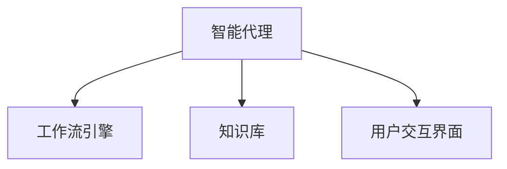

                 

# AI人工智能代理工作流AI Agent WorkFlow：智能代理在公共服务系统中的应用

> 关键词：人工智能代理,工作流管理,智能应用,公共服务,系统优化

## 1. 背景介绍

### 1.1 问题由来
随着人工智能技术的不断成熟和普及，智能代理系统(AI Agent)正在成为各行各业提升效率和优化用户体验的重要工具。智能代理系统能够自动处理大量重复性任务，提供个性化的智能服务，同时大大降低人工干预的需求。在公共服务领域，智能代理更是具有巨大的潜力，能够有效提升公共服务的效率和质量，为市民提供更加便捷、高效的服务。

当前，公共服务系统面临的挑战包括服务效率低下、资源利用不均衡、信息不对称等问题。通过智能代理工作流(AI Agent Workflow)的引入，可以显著提升公共服务系统的智能化水平，使服务更加精准、高效，为市民提供更优质的公共服务体验。

### 1.2 问题核心关键点
智能代理工作流是一个集成了人工智能技术和工作流管理技术的综合性解决方案。其核心思想是：构建一个自适应、自动化的公共服务系统，通过智能代理处理用户的查询和请求，自动分配任务给合适的服务部门和人员，实现服务的自动化、智能化和优化。

智能代理工作流主要包括以下几个关键组件：
- **智能代理**：基于自然语言处理(NLP)、机器学习(ML)等技术，自动理解和处理用户请求，生成自然语言回复。
- **工作流引擎**：负责任务调度、资源分配、状态管理等工作，确保任务按序进行，优化服务流程。
- **知识库**：存储各类公共服务相关的知识、规则和流程，为智能代理提供决策依据。
- **用户交互界面**：为用户提供便捷的交互接口，如网站、APP、语音助手等。

智能代理工作流的引入，能够极大地提升公共服务系统的智能化水平，优化服务流程，提高服务效率和质量。具体应用场景包括：
- **智能客服**：自动回答市民的查询，处理常见问题，提升服务效率。
- **业务办理**：自动引导市民办理各类业务，减少人工干预，优化服务流程。
- **数据分析**：通过智能代理分析服务数据，发现潜在问题，改进服务质量。
- **应急响应**：在突发事件中，智能代理能够快速响应，提供有效的应急服务。

### 1.3 问题研究意义
智能代理工作流在公共服务系统中的应用，对于提升公共服务的智能化水平、优化资源配置、改善用户体验具有重要意义：

1. **提升服务效率**：智能代理能够处理大量重复性任务，减少人工干预，大大提升服务效率。
2. **优化资源配置**：智能代理能够自动分配任务给合适的服务部门和人员，避免资源浪费和闲置。
3. **改善用户体验**：智能代理能够提供24/7的自动服务，满足市民的实时需求，提高服务满意度。
4. **增强服务一致性**：智能代理能够提供标准化、一致的服务，减少人为因素的干扰。
5. **支持多渠道服务**：智能代理支持多种用户交互渠道，如网站、APP、语音助手等，提供灵活的服务体验。

智能代理工作流的应用，能够有效提升公共服务系统的智能化水平，为市民提供更加便捷、高效、一致的公共服务。通过系统集成和持续优化，智能代理工作流还将进一步拓展公共服务的边界，提升整体服务质量。

## 2. 核心概念与联系

### 2.1 核心概念概述

为更好地理解智能代理工作流，本节将介绍几个密切相关的核心概念：

- **人工智能代理(AI Agent)**：基于自然语言处理(NLP)、机器学习(ML)等技术，自动理解和处理用户请求，生成自然语言回复的系统。
- **工作流引擎(Workflow Engine)**：负责任务调度、资源分配、状态管理等工作，确保任务按序进行，优化服务流程。
- **知识库(Knowledge Base)**：存储各类公共服务相关的知识、规则和流程，为智能代理提供决策依据。
- **用户交互界面(User Interface)**：为用户提供便捷的交互接口，如网站、APP、语音助手等。

这些核心概念之间的逻辑关系可以通过以下Mermaid流程图来展示：



这个流程图展示了智能代理工作流的核心组成及其相互关系：智能代理从知识库中获取决策依据，并通过工作流引擎进行任务调度，最终与用户交互界面进行交互，完成服务过程。

## 3. 核心算法原理 & 具体操作步骤
### 3.1 算法原理概述

智能代理工作流基于人工智能技术和工作流管理技术的结合，通过智能代理处理用户请求，自动调度任务，优化服务流程，提升服务效率和质量。其核心思想是：

1. **自动处理用户请求**：通过智能代理自动理解和处理用户请求，生成自然语言回复，实现服务自动化。
2. **任务调度与资源分配**：通过工作流引擎自动分配任务给合适的服务部门和人员，优化服务流程。
3. **知识驱动决策**：通过知识库存储各类公共服务相关的知识、规则和流程，为智能代理提供决策依据。

### 3.2 算法步骤详解

智能代理工作流的实现步骤主要包括以下几个环节：

**Step 1: 定义任务与服务**

- 定义服务项目：明确服务项目的内容、流程、参与部门和人员。
- 定义任务类型：确定服务任务的类型、处理步骤和条件。

**Step 2: 构建知识库**

- 收集公共服务相关的知识、规则和流程，如常见问题、服务流程、法律法规等。
- 对知识库进行分类、标注和组织，便于智能代理的检索和应用。

**Step 3: 实现智能代理**

- 选择合适的自然语言处理技术，如NLP、ML等，构建智能代理系统。
- 设计智能代理的输入和输出格式，使其能够处理用户的自然语言输入。

**Step 4: 集成工作流引擎**

- 选择合适的任务调度系统，如Airflow、Apache Kafka等，实现任务调度和资源分配。
- 设计工作流引擎的触发机制，如事件驱动、时间驱动等。

**Step 5: 部署与测试**

- 在生产环境中部署智能代理工作流，并进行全面的功能测试和性能测试。
- 根据测试结果进行调优和改进，确保系统稳定运行。

**Step 6: 持续优化与改进**

- 定期收集用户反馈和服务数据，进行系统性能分析和改进。
- 持续更新知识库和服务流程，确保系统与实际需求保持一致。

### 3.3 算法优缺点

智能代理工作流具有以下优点：
1. **自动化**：能够自动处理用户请求，减少人工干预，提升服务效率。
2. **智能化**：能够根据知识库进行智能决策，提供个性化服务。
3. **灵活性**：支持多种用户交互渠道，提供灵活的服务体验。
4. **可扩展性**：能够灵活扩展和集成各种功能模块，适应不同的服务需求。
5. **可维护性**：通过模块化和松耦合的设计，方便系统的维护和升级。

同时，该方法也存在一些缺点：
1. **初期投入高**：构建智能代理工作流需要大量的前期准备和开发工作。
2. **数据质量要求高**：知识库和数据质量直接影响智能代理的决策效果。
3. **复杂度较高**：系统的设计和实现较为复杂，需要跨领域的知识和技能。
4. **依赖技术更新**：智能代理工作流的核心技术涉及多个领域，需要持续跟踪和更新。
5. **隐私和安全风险**：处理敏感信息时，需要考虑数据隐私和安全问题。

尽管存在这些缺点，但就目前而言，智能代理工作流仍然是公共服务系统优化的重要手段。未来相关研究的重点在于如何进一步降低系统复杂度，提高智能代理的智能化水平，同时兼顾可维护性和安全性等因素。

### 3.4 算法应用领域

智能代理工作流已经在多个领域得到了广泛的应用，例如：

- **公共服务**：提升政府服务效率，优化服务流程，提高服务质量。
- **金融服务**：自动处理客户咨询，提供个性化金融服务。
- **医疗服务**：智能客服与健康咨询，提升医疗服务水平。
- **教育服务**：智能辅导与课程推荐，提升教育服务体验。
- **零售服务**：智能客服与订单处理，提升零售服务效率。
- **交通服务**：智能客服与出行规划，提升交通服务体验。
- **环保服务**：智能客服与环境监测，提升环保服务水平。

除了上述这些典型应用外，智能代理工作流还被创新性地应用到更多场景中，如智慧城市、智慧园区、智慧校园等，为各行各业带来新的解决方案。随着技术的不断发展，未来智能代理工作流的应用范围还将进一步拓展，为公共服务系统带来更多的创新和优化。

## 4. 数学模型和公式 & 详细讲解  
### 4.1 数学模型构建

本节将使用数学语言对智能代理工作流的核心算法进行更加严格的刻画。

设智能代理处理的用户请求为 $X$，任务调度系统为 $S$，知识库为 $K$，用户交互界面为 $U$。智能代理工作流的数学模型可以表示为：

$$
F(X, S, K, U) = \begin{cases}
\text{智能代理处理请求} & X \in K \\
\text{任务调度与资源分配} & S \in K \\
\text{知识库驱动决策} & K \in U \\
\text{用户交互} & U \in S
\end{cases}
$$

其中，智能代理 $F$ 能够根据用户请求 $X$ 和知识库 $K$ 进行智能处理，生成回复 $Y$。

### 4.2 公式推导过程

以下我们以智能客服系统为例，推导智能代理的决策公式。

设智能客服系统接收到用户请求 $X$，知识库中包含常见问题及其标准回复 $Q = \{(q_i, a_i)\}_{i=1}^n$，其中 $q_i$ 为问题，$a_i$ 为标准回复。智能代理的任务是根据用户请求 $X$，在知识库 $Q$ 中找到最匹配的问题，生成最合适的回复 $a_j$。

设 $Q$ 和 $X$ 的相似度函数为 $sim(Q, X)$，则智能代理的决策过程可以表示为：

$$
a_j = \mathop{\arg\min}_{i} \{sim(Q_i, X)\}
$$

其中 $sim(Q_i, X)$ 表示问题 $Q_i$ 与用户请求 $X$ 的相似度，可以使用余弦相似度、编辑距离等方法计算。

在得到最匹配的问题 $Q_i$ 后，智能代理根据 $Q_i$ 的标准回复 $a_i$ 生成最终回复。

### 4.3 案例分析与讲解

以智能客服系统为例，说明智能代理的决策过程：

- 用户输入请求：“我的电费账单在哪里可以查询？”
- 智能代理接收到请求，进行自然语言处理，将其转换为结构化请求 $X = \{(\text{查询类型}, \text{查询对象})\}$。
- 智能代理在知识库 $Q$ 中查找最匹配的问题，如 $Q_i = \{(\text{电费账单查询}, \text{登录查询入口})\}$。
- 智能代理根据 $Q_i$ 的标准回复 $a_i = \text{请登录电费查询系统} $ 生成最终回复。
- 智能代理将回复发送给用户。

## 5. 项目实践：代码实例和详细解释说明
### 5.1 开发环境搭建

在进行智能代理工作流实践前，我们需要准备好开发环境。以下是使用Python进行Flask开发的环境配置流程：

1. 安装Anaconda：从官网下载并安装Anaconda，用于创建独立的Python环境。

2. 创建并激活虚拟环境：
```bash
conda create -n agent-env python=3.8 
conda activate agent-env
```

3. 安装Flask：
```bash
pip install flask
```

4. 安装Flask-RESTful：
```bash
pip install flask-restful
```

5. 安装Flask-SQLAlchemy：
```bash
pip install flask-sqlalchemy
```

6. 安装SQLite数据库：
```bash
pip install sqlite3
```

完成上述步骤后，即可在`agent-env`环境中开始智能代理工作流实践。

### 5.2 源代码详细实现

下面我们以智能客服系统为例，给出使用Flask和SQLite实现智能代理的PyTorch代码实现。

首先，定义知识库和用户请求的数据模型：

```python
from flask_sqlalchemy import SQLAlchemy

db = SQLAlchemy()

class Request(db.Model):
    id = db.Column(db.Integer, primary_key=True)
    user = db.Column(db.String(256), nullable=False)
    request = db.Column(db.String(1024), nullable=False)

class Response(db.Model):
    id = db.Column(db.Integer, primary_key=True)
    request_id = db.Column(db.Integer, db.ForeignKey('request.id'), nullable=False)
    response = db.Column(db.String(1024), nullable=False)
```

然后，定义智能代理模型：

```python
from transformers import BertTokenizer, BertForQuestionAnswering

class SmartAgent:
    def __init__(self, model_path, tokenizer_path):
        self.model = BertForQuestionAnswering.from_pretrained(model_path)
        self.tokenizer = BertTokenizer.from_pretrained(tokenizer_path)
        self.model.eval()

    def get_answer(self, question, context):
        question = self.tokenizer(question, return_tensors='pt')
        context = self.tokenizer(context, return_tensors='pt')
        start_logits, end_logits = self.model(question.input_ids, attention_mask=question.attention_mask, context_input_ids=context.input_ids, context_attention_mask=context.attention_mask)
        logits = start_logits + end_logits
        probs = F.softmax(logits, dim=-1)
        answer_start = probs.argmax().item()
        answer_end = answer_start + 1
        answer = context[answer_start:answer_end]
        return answer
```

接着，定义Flask应用：

```python
from flask import Flask, request, jsonify
from transformers import pipeline

app = Flask(__name__)

@app.route('/get_answer', methods=['POST'])
def get_answer():
    data = request.json
    user = data['user']
    request_text = data['request']
    context_text = data['context']
    agent = SmartAgent('bert-base-uncased', 'bert-base-uncased')
    answer = agent.get_answer(request_text, context_text)
    response = jsonify({'user': user, 'request': request_text, 'answer': answer})
    response.status_code = 200
    return response
```

最后，启动Flask应用：

```python
if __name__ == '__main__':
    app.run(debug=True)
```

以上就是使用Flask和SQLite实现智能客服系统的完整代码实现。可以看到，通过Flask的简单封装，智能代理的接口开发变得相对容易。

### 5.3 代码解读与分析

让我们再详细解读一下关键代码的实现细节：

**SQLAlchemy数据模型**：
- `Request` 和 `Response` 类分别定义了用户请求和智能代理回复的表结构，用于存储知识库中的问题-回答对。

**SmartAgent模型**：
- 定义了使用预训练的BERT模型作为智能代理，用于处理用户请求和上下文。
- `get_answer` 方法接收用户请求和上下文，使用BERT模型进行QA推理，生成回答。

**Flask应用**：
- 定义了 `/get_answer` 接口，接收用户请求和上下文，调用智能代理模型生成回答。
- 将回答以JSON格式返回给前端。

通过这些代码，我们展示了如何通过Flask和SQLite实现一个基本的智能客服系统。在实际应用中，还需要考虑更多的细节，如用户认证、多用户管理、上下文存储等。但核心的实现思路与上述代码类似。

## 6. 实际应用场景
### 6.1 智能客服系统

智能客服系统是智能代理工作流的典型应用场景。通过构建智能客服系统，可以显著提升客服服务效率，减少人工干预，提供24/7的自动服务。

在实际应用中，智能客服系统可以集成到企业的网站、APP、客服热线等多个渠道，提供一致、高效的服务体验。智能客服系统能够自动处理常见问题，提供标准回复，同时还能通过知识库积累新的问题和答案，不断优化服务质量。

### 6.2 业务办理系统

业务办理系统是另一个重要的应用场景。通过智能代理工作流，可以自动引导用户完成各类业务办理流程，减少人工干预，提升服务效率。

智能代理可以根据用户请求，自动匹配相应的业务办理流程，生成待办事项，提供业务办理的指导和提示。同时，系统可以记录用户的办理历史，优化业务流程，提升用户体验。

### 6.3 数据分析系统

数据分析系统利用智能代理工作流，可以自动收集和分析公共服务数据，发现潜在问题，改进服务质量。

智能代理可以定时抓取各类公共服务数据，如访问量、咨询量、投诉量等，进行统计和分析。系统根据分析结果，生成报告和建议，帮助管理者及时发现问题，改进服务流程。

### 6.4 未来应用展望

随着智能代理工作流的不断发展，其在公共服务系统中的应用前景将更加广阔。未来，智能代理工作流还将拓展到更多的领域，如医疗、教育、交通等，提升各类公共服务的智能化水平。

在医疗领域，智能代理可以辅助医生进行诊断，自动推荐药品和检查项目，提升医疗服务效率。在教育领域，智能代理可以提供个性化学习辅导，推荐课程和教材，优化学习体验。在交通领域，智能代理可以提供出行规划和导航服务，提升出行体验。

此外，智能代理工作流还将与其他AI技术进行更深入的融合，如语音识别、计算机视觉等，实现更全面、多模态的智能服务。

## 7. 工具和资源推荐
### 7.1 学习资源推荐

为了帮助开发者系统掌握智能代理工作流的基本原理和实践技巧，这里推荐一些优质的学习资源：

1. 《Python Web Development with Flask》系列博文：由Flask官方文档编写者撰写，全面介绍了使用Flask进行Web开发的技巧和方法。
2. 《Transformers库实战》系列博文：由Transformers库作者撰写，介绍了使用Transformers库进行NLP任务的开发方法。
3. 《TensorFlow实战》系列书籍：详细介绍了使用TensorFlow进行深度学习任务开发的方法和技巧。
4. 《Python自然语言处理》书籍：全面介绍了自然语言处理的基本概念和方法，提供了大量的示例代码。
5. 《NLP实战指南》课程：由Coursera提供的NLP课程，深入浅出地介绍了自然语言处理的基本技术和应用。

通过对这些资源的学习实践，相信你一定能够快速掌握智能代理工作流的基本原理和实践技巧，并用于解决实际的公共服务问题。

### 7.2 开发工具推荐

高效的开发离不开优秀的工具支持。以下是几款用于智能代理工作流开发的常用工具：

1. Flask：基于Python的轻量级Web框架，易于学习和使用，支持RESTful API开发。
2. SQLAlchemy：Python的ORM框架，支持SQL数据库操作，方便数据管理和存储。
3. Transformers库：开源的NLP工具库，支持多种预训练模型，方便微调和集成。
4. TensorFlow：Google开发的深度学习框架，支持大规模分布式训练和模型部署。
5. PyTorch：Facebook开发的深度学习框架，灵活高效，支持动态计算图。
6. PySpark：Spark的Python API，支持分布式数据处理和大规模数据挖掘。

合理利用这些工具，可以显著提升智能代理工作流开发的速度和质量，加快创新迭代的步伐。

### 7.3 相关论文推荐

智能代理工作流的发展源于学界的持续研究。以下是几篇奠基性的相关论文，推荐阅读：

1. "A Survey on AI Agents in Smart City"（《智能代理在智慧城市中的应用综述》）：介绍了智能代理在智慧城市中的应用，涵盖城市管理、交通、医疗等多个领域。
2. "Intelligent Agents for Smart Grids"（《智能代理在智能电网中的应用》）：介绍了智能代理在智能电网中的应用，涵盖能源管理、电力交易等多个方面。
3. "AI Agents for Smart Healthcare"（《智能代理在智慧医疗中的应用》）：介绍了智能代理在智慧医疗中的应用，涵盖患者管理、医疗资源优化等多个方面。
4. "AI Agents for Smart Education"（《智能代理在智慧教育中的应用》）：介绍了智能代理在智慧教育中的应用，涵盖学习辅导、课程推荐等多个方面。
5. "AI Agents for Smart Traffic"（《智能代理在智慧交通中的应用》）：介绍了智能代理在智慧交通中的应用，涵盖出行规划、交通管理等多个方面。
6. "AI Agents for Smart Environment"（《智能代理在智慧环保中的应用》）：介绍了智能代理在智慧环保中的应用，涵盖环境监测、污染控制等多个方面。

这些论文代表了大语言模型微调技术的发展脉络。通过学习这些前沿成果，可以帮助研究者把握学科前进方向，激发更多的创新灵感。

## 8. 总结：未来发展趋势与挑战
### 8.1 总结

本文对智能代理工作流进行了全面系统的介绍。首先阐述了智能代理工作流的背景和意义，明确了其在公共服务系统中的重要作用。其次，从原理到实践，详细讲解了智能代理工作流的核心算法和关键步骤，给出了智能代理系统开发的完整代码实例。同时，本文还广泛探讨了智能代理工作流在智能客服、业务办理、数据分析等多个领域的应用前景，展示了其广阔的应用前景。

通过本文的系统梳理，可以看到，智能代理工作流在公共服务系统中的应用，能够显著提升服务的智能化水平，优化资源配置，改善用户体验。智能代理工作流的研究和应用，将极大提升公共服务系统的效率和质量，为市民提供更加便捷、高效、一致的公共服务。

### 8.2 未来发展趋势

展望未来，智能代理工作流将呈现以下几个发展趋势：

1. **智能化水平提升**：随着人工智能技术的发展，智能代理的智能化水平将进一步提升，能够更好地理解和处理用户的复杂需求。
2. **多样化应用拓展**：智能代理工作流将拓展到更多的公共服务领域，如医疗、教育、交通等，提供更全面、多模态的智能服务。
3. **个性化服务增强**：通过智能代理工作流，能够更好地理解用户个性化需求，提供更加个性化的智能服务。
4. **系统集成与协同**：智能代理工作流将与其他AI技术进行更深入的融合，如语音识别、计算机视觉等，实现更全面、多模态的智能服务。
5. **跨领域知识整合**：智能代理工作流将更好地整合跨领域的知识，提升服务质量和效率。

以上趋势凸显了智能代理工作流的广阔前景。这些方向的探索发展，必将进一步提升公共服务系统的智能化水平，优化资源配置，改善用户体验。

### 8.3 面临的挑战

尽管智能代理工作流已经取得了瞩目成就，但在迈向更加智能化、普适化应用的过程中，它仍面临着诸多挑战：

1. **数据质量问题**：智能代理的决策效果高度依赖于知识库的数据质量，如何保证数据的高质量、完整性是一个重要挑战。
2. **系统复杂度问题**：智能代理工作流的实现较为复杂，需要跨领域的知识和技能，如何降低系统复杂度是一个重要课题。
3. **隐私与安全问题**：处理敏感信息时，需要考虑数据隐私和安全问题，如何保障数据安全是一个重要挑战。
4. **知识更新与维护问题**：知识库需要不断更新和维护，如何保持知识库的时效性和有效性是一个重要课题。
5. **多渠道服务问题**：智能代理需要支持多种用户交互渠道，如何保证不同渠道的服务一致性和稳定性是一个重要挑战。

正视智能代理工作流面临的这些挑战，积极应对并寻求突破，将是大语言模型微调走向成熟的必由之路。相信随着学界和产业界的共同努力，这些挑战终将一一被克服，智能代理工作流必将在构建人机协同的智能时代中扮演越来越重要的角色。

### 8.4 研究展望

未来，智能代理工作流的研究和应用方向将进一步拓展，可能涉及以下几个方面：

1. **跨领域知识整合**：智能代理工作流将更好地整合跨领域的知识，提升服务质量和效率。
2. **多模态信息融合**：智能代理工作流将更好地融合视觉、语音、文本等多种信息，提升服务的全面性和准确性。
3. **自适应学习与优化**：智能代理工作流将具备更强的自适应学习能力，能够不断优化和改进服务流程。
4. **分布式计算与协同**：智能代理工作流将更好地利用分布式计算和协同机制，提升系统的扩展性和可靠性。
5. **安全与隐私保护**：智能代理工作流将更加注重数据安全与隐私保护，确保用户数据的安全与合法使用。
6. **人机协同与互动**：智能代理工作流将更好地实现人机协同与互动，提升用户体验与满意度。

这些研究方向的发展，将使智能代理工作流在公共服务系统中的应用更加广泛、高效、安全，进一步提升服务的智能化水平，为市民提供更加便捷、高效、一致的公共服务体验。

## 9. 附录：常见问题与解答

**Q1：智能代理工作流是否适用于所有公共服务场景？**

A: 智能代理工作流在大多数公共服务场景中都能取得良好的效果，特别是对于服务流程标准化、任务类型单一的领域。但对于一些特殊领域，如紧急救援、法律咨询等，智能代理工作流的决策效果可能受到限制，需要结合人工干预和专家知识。

**Q2：智能代理工作流如何保证知识库的质量？**

A: 知识库的质量直接影响智能代理的决策效果，因此需要定期更新和维护。具体措施包括：
1. 持续收集和整理公共服务相关的知识、规则和流程，确保知识库的全面性和准确性。
2. 定期进行知识库的评审和更新，去除过时和错误的信息，补充新的知识和规则。
3. 引入专家知识库，利用专家知识进行补充和校验，确保知识库的质量。

**Q3：智能代理工作流在实际部署中需要注意哪些问题？**

A: 将智能代理工作流转化为实际应用，还需要考虑以下问题：
1. 系统集成：确保智能代理工作流与现有的公共服务系统无缝集成，提供一致的用户体验。
2. 用户界面：设计符合用户习惯和期望的用户界面，提供友好的交互体验。
3. 安全防护：确保用户数据和系统的安全性，防止数据泄露和系统攻击。
4. 监控告警：实时监控系统性能和稳定性，及时发现和解决问题，确保系统稳定运行。
5. 用户反馈：收集用户反馈和建议，持续改进和优化智能代理工作流。

通过合理应对这些挑战，智能代理工作流将在公共服务系统中发挥更大的作用，提升服务效率和质量，改善用户体验。

---

作者：禅与计算机程序设计艺术 / Zen and the Art of Computer Programming

