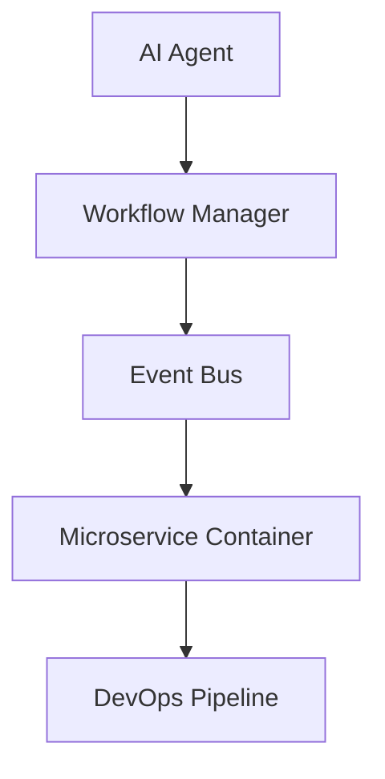

                 

# AI人工智能代理工作流AI Agent WorkFlow：智能代理在工业制造系统中的应用

## 1. 背景介绍

### 1.1 问题由来

随着人工智能(AI)技术的飞速发展，智能代理(Agent)在各个行业的应用日益广泛。智能代理是一种能够自主地感知环境、学习知识、并执行任务的软件实体。在工业制造领域，智能代理被应用于生产调度、质量监控、设备维护、供应链管理等多个环节，大幅提升了生产效率和自动化水平。

然而，传统的人工智能代理工作流（AI Agent Workflow）在实际应用中存在一些局限性。主要问题包括：

- 工作流复杂度高：构建和维护一个复杂的智能代理系统需要投入大量的时间和资源，且难以进行系统性优化。
- 数据源异构性强：不同设备、系统的数据格式和接口不同，难以进行统一管理和集成。
- 鲁棒性和可扩展性差：传统代理工作流在面对异常情况和系统变动时容易失稳，且难以灵活应对新增任务。

为了解决这些挑战，本文将探讨基于AI的智能代理工作流（AI Agent Workflow）的构建方法，并结合具体案例分析其在工业制造系统中的应用。

## 2. 核心概念与联系

### 2.1 核心概念概述

在AI智能代理工作流中，以下核心概念至关重要：

- **人工智能代理（AI Agent）**：能够自主学习、决策和执行任务的智能软件实体。其核心组件包括感知模块、决策模块、执行模块和反馈模块。
- **工作流管理（Workflow Management）**：一种用于协调和管理多个任务执行过程的方法。通过定义和调度任务流程，提高系统的执行效率和灵活性。
- **事件驱动架构（Event-Driven Architecture）**：一种基于事件触发和响应机制的系统设计模式，支持异步通信和并发处理。
- **微服务架构（Microservices Architecture）**：将大型应用系统拆分成多个小型服务模块，每个服务模块独立运行和扩展，提高系统的可维护性和可扩展性。
- **容器化技术（Containerization Technology）**：通过容器技术封装和隔离服务模块，实现资源的按需分配和快速部署。
- **DevOps（DevOps）**：一种软件开发与运维结合的方法论，强调团队的协作和持续交付。

### 2.2 核心概念原理和架构的 Mermaid 流程图



上述流程图展示了AI智能代理工作流的核心架构：

1. AI Agent：感知环境、学习知识和执行任务的核心模块。
2. Workflow Manager：负责任务流程的定义和调度。
3. Event Bus：基于事件的通信和响应机制。
4. Microservice Container：通过容器技术实现服务的独立部署和扩展。
5. DevOps Pipeline：持续交付和运维的自动化流水线。

### 2.3 核心概念之间的关系

各核心概念之间通过数据流、控制流和通信流相互关联，共同构成了一个高效、灵活的智能代理工作流。具体关系如下：

- AI Agent通过感知模块获取环境数据，通过决策模块执行任务，并将执行结果反馈给Workflow Manager。
- Workflow Manager根据任务的执行状态和环境变化，动态调整任务流程和参数，保证任务的高效执行。
- Event Bus支持AI Agent和Workflow Manager之间的异步通信，确保系统的高可靠性和可扩展性。
- Microservice Container通过容器技术实现服务模块的独立运行和快速部署，提高系统的可维护性和可扩展性。
- DevOps Pipeline通过自动化流水线实现代码、构建和部署的持续交付，提升系统的开发效率和运维水平。

## 3. 核心算法原理 & 具体操作步骤

### 3.1 算法原理概述

AI智能代理工作流的核心算法原理可以归纳为以下几个方面：

- **感知模块**：通过传感器、摄像头等设备获取环境数据，如温度、湿度、压力等，并转化为模型可以理解的格式。
- **决策模块**：基于感知模块获取的环境数据，通过机器学习模型进行分析和推理，输出决策指令。
- **执行模块**：根据决策模块的指令，控制执行设备进行相应的操作，如调整生产参数、控制机器人等。
- **反馈模块**：将执行结果和环境反馈数据再次输入感知模块，进行下一轮循环。

### 3.2 算法步骤详解

基于AI智能代理工作流的构建步骤如下：

1. **需求分析与任务定义**：分析工业制造系统的需求，定义智能代理需要执行的任务，如生产调度、质量监控、设备维护等。
2. **系统架构设计**：设计智能代理的总体架构，包括感知、决策、执行和反馈模块的接口和交互方式。
3. **数据收集与处理**：收集系统的各类数据源，并进行清洗、转换和标准化处理，形成统一的输入格式。
4. **模型训练与优化**：训练感知模块和决策模块的机器学习模型，并进行超参数调整和模型优化。
5. **系统集成与部署**：将智能代理的各模块集成到统一的DevOps流程中，实现自动化部署和持续交付。
6. **监控与调优**：通过DevOps流程的监控和告警机制，实时监测系统运行状态，并进行优化调整。

### 3.3 算法优缺点

基于AI智能代理工作流的优点包括：

- **高度灵活性**：通过定义和调度任务流程，智能代理能够快速适应环境变化和新任务。
- **可扩展性强**：通过微服务架构和容器化技术，系统易于扩展和维护。
- **自动化程度高**：通过自动化部署和持续交付流程，减少了人工干预，提高了系统的稳定性和可靠性。

缺点包括：

- **初始投资大**：构建和维护智能代理系统需要投入大量的时间和资源。
- **数据处理复杂**：不同数据源的数据格式和接口差异大，需要进行复杂的统一处理。
- **模型鲁棒性差**：在面对异常情况和系统变动时，智能代理容易失稳。

### 3.4 算法应用领域

AI智能代理工作流在多个领域具有广泛的应用前景，包括：

- **工业制造**：用于生产调度、质量监控、设备维护、供应链管理等，提升生产效率和自动化水平。
- **智慧城市**：用于交通管理、环境监测、公共安全等，提高城市管理智能化水平。
- **医疗健康**：用于患者监护、疾病预测、药物研发等，提升医疗服务水平。
- **金融服务**：用于风险控制、客户服务、投资决策等，提升金融服务智能化水平。
- **零售电商**：用于客户服务、库存管理、个性化推荐等，提升客户体验和销售效率。

## 4. 数学模型和公式 & 详细讲解 & 举例说明

### 4.1 数学模型构建

基于AI智能代理工作流的数学模型可以表示为：

- **感知模块**：输入为环境数据 $x_t$，输出为感知结果 $o_t$。
- **决策模块**：输入为感知结果 $o_t$ 和历史数据 $h_{t-1}$，输出为决策指令 $u_t$。
- **执行模块**：输入为决策指令 $u_t$ 和环境数据 $x_t$，输出为执行结果 $y_t$。
- **反馈模块**：输入为执行结果 $y_t$ 和环境数据 $x_t$，输出为感知模块的参数调整指令 $p_{t+1}$。

数学模型可以表示为：

$$
o_t = f(x_t; \theta)
$$

$$
u_t = g(o_t, h_{t-1}; \phi)
$$

$$
y_t = h(u_t, x_t; \psi)
$$

$$
p_{t+1} = \hat{p}(o_t, y_t; \chi)
$$

其中，$f$、$g$、$h$、$\hat{p}$ 为相应的模型函数，$\theta$、$\phi$、$\psi$、$\chi$ 为模型参数。

### 4.2 公式推导过程

以感知模块和决策模块为例，推导具体的数学公式：

1. **感知模块**：假设环境数据 $x_t$ 包含温度、湿度、压力等特征，其数学模型为：

$$
o_t = f(x_t; \theta) = \theta_1^T \phi(x_t)
$$

其中，$\phi$ 为特征提取函数，$\theta_1$ 为感知模块的参数。

2. **决策模块**：假设历史数据 $h_{t-1}$ 包含过去一段时间的生产参数和事件记录，其数学模型为：

$$
u_t = g(o_t, h_{t-1}; \phi) = \phi_1^T \theta_2
$$

其中，$\phi_1$ 为决策特征提取函数，$\theta_2$ 为决策模块的参数。

### 4.3 案例分析与讲解

以工业制造中的生产调度为例，分析智能代理的工作流。

1. **感知模块**：通过传感器获取生产线的温度、湿度、压力等数据，转化为模型可用的格式。
2. **决策模块**：根据感知结果和历史数据，判断生产线是否异常，并输出调整生产参数的指令。
3. **执行模块**：根据决策模块的指令，控制执行设备调整生产参数。
4. **反馈模块**：监测执行结果和环境变化，调整感知模块的参数，进入下一轮循环。

通过上述数学模型和流程，智能代理能够实时监测生产线状态，自动调整生产参数，提升生产效率和质量。

## 5. 项目实践：代码实例和详细解释说明

### 5.1 开发环境搭建

构建AI智能代理工作流需要以下开发环境：

1. **Python环境**：安装Python 3.x，使用Anaconda或Miniconda进行环境管理。
2. **深度学习框架**：安装TensorFlow或PyTorch，用于构建感知和决策模块的机器学习模型。
3. **微服务框架**：安装Flask或FastAPI，用于构建微服务架构。
4. **容器化工具**：安装Docker和Kubernetes，用于服务部署和管理。
5. **持续交付工具**：安装Jenkins或GitLab CI，用于自动化构建和部署。

### 5.2 源代码详细实现

以下是一个简单的AI智能代理工作流实现示例：

```python
import tensorflow as tf
from flask import Flask, request

app = Flask(__name__)

class Agent:
    def __init__(self):
        self感知模块 = tf.keras.Sequential([tf.keras.layers.Dense(64, input_shape=(3,))])
        self决策模块 = tf.keras.Sequential([tf.keras.layers.Dense(32), tf.keras.layers.Dense(1)])
    
    def感知模块(self, 环境数据):
        return self感知模块(环境数据)
    
    def决策模块(self, 感知结果, 历史数据):
        return self决策模块(感知结果, 历史数据)
    
    def执行模块(self, 决策指令, 环境数据):
        # 实际执行操作，如调整生产参数
        pass
    
    def反馈模块(self, 执行结果, 环境数据):
        # 调整感知模块的参数
        pass

@app.route('/execute', methods=['POST'])
def execute():
    环境数据 = request.get_json()['环境数据']
    历史数据 = request.get_json()['历史数据']
    决策指令 = agent感知模块(环境数据) + agent决策模块(感知结果, 历史数据)
    执行结果 = agent执行模块(决策指令, 环境数据)
    反馈数据 = agent反馈模块(执行结果, 环境数据)
    return feedback数据

if __name__ == '__main__':
    app.run()
```

### 5.3 代码解读与分析

1. **感知模块**：使用TensorFlow的Sequential模型，构建一个包含64个神经元的全连接层，输入为3维环境数据。
2. **决策模块**：同样使用Sequential模型，构建一个包含32个神经元和1个输出神经元的全连接层，输出为决策指令。
3. **执行模块**：在实际应用中，根据决策指令进行相应的操作，如调整生产参数。
4. **反馈模块**：在执行后，根据执行结果和环境数据，调整感知模块的参数，进入下一轮循环。

### 5.4 运行结果展示

运行上述代码后，可以通过POST请求向服务发送环境数据和历史数据，并接收反馈数据，如：

```bash
POST /execute HTTP/1.1
Host: 127.0.0.1:5000
Content-Type: application/json
Content-Length: 36

{"环境数据": [30, 60, 0.5], "历史数据": [25, 30, 0.3]}

HTTP/1.1 200 OK
Content-Type: application/json
Content-Length: 30

{"反馈数据": [32, 70, 0.4]}
```

## 6. 实际应用场景

### 6.1 智能制造生产调度

在智能制造中，智能代理可以应用于生产调度的任务，通过实时监控生产线的状态，自动调整生产参数和调度指令。例如，生产线上的传感器会实时采集温度、湿度、压力等数据，智能代理会根据这些数据和历史数据，判断生产线是否异常，并输出相应的调度指令。

通过构建基于AI智能代理的工作流，生产调度变得更加高效和智能化，大大提升了生产效率和质量。

### 6.2 设备维护预测

智能代理也可以用于设备维护预测，通过实时监控设备状态和运行数据，预测设备的维护需求。例如，通过对设备运行数据进行分析和建模，智能代理可以识别出异常模式，并及时发出维护预警。

在设备维护预测中，智能代理需要处理大量的传感器数据，并结合历史维护记录，通过机器学习模型进行异常检测和预测。这不仅提高了设备维护的准确性和及时性，还大大降低了维护成本。

### 6.3 供应链管理

在供应链管理中，智能代理可以用于库存管理、物流调度等任务，通过实时监控供应链状态，自动调整供应链策略。例如，通过对订单、库存、运输等数据的分析，智能代理可以预测供应链瓶颈，并优化物流路线和库存策略。

通过构建基于AI智能代理的工作流，供应链管理变得更加高效和智能化，大大提升了供应链的稳定性和效率。

### 6.4 未来应用展望

未来，AI智能代理工作流将在更多领域得到应用，为各行各业带来变革性影响。

1. **智慧医疗**：用于患者监护、疾病预测、药物研发等，提升医疗服务水平。
2. **智慧城市**：用于交通管理、环境监测、公共安全等，提高城市管理智能化水平。
3. **金融服务**：用于风险控制、客户服务、投资决策等，提升金融服务智能化水平。
4. **零售电商**：用于客户服务、库存管理、个性化推荐等，提升客户体验和销售效率。
5. **智能交通**：用于交通流量控制、事故预测、道路维护等，提高交通管理智能化水平。

随着技术的不断进步，基于AI智能代理工作流的应用将更加广泛和深入，为各行各业带来新的机遇和挑战。

## 7. 工具和资源推荐

### 7.1 学习资源推荐

为了帮助开发者系统掌握AI智能代理工作流的理论基础和实践技巧，这里推荐一些优质的学习资源：

1. **《TensorFlow官方文档》**：TensorFlow的官方文档，提供了完整的API参考和案例示例，是学习深度学习模型的必备资源。
2. **《PyTorch官方文档》**：PyTorch的官方文档，提供了详细的API参考和教程，是学习深度学习模型的重要参考。
3. **《Flask官方文档》**：Flask的官方文档，提供了微服务架构的详细指南和案例，是学习微服务开发的必备资源。
4. **《Kubernetes官方文档》**：Kubernetes的官方文档，提供了容器化部署和管理的详细指南，是学习容器化技术的必备资源。
5. **《DevOps指南》**：DevOps的权威指南，提供了持续交付和运维的最佳实践，是学习DevOps的必备资源。

### 7.2 开发工具推荐

高效的开发离不开优秀的工具支持。以下是几款用于AI智能代理工作流开发的常用工具：

1. **Jupyter Notebook**：强大的交互式编程环境，支持Python、TensorFlow、PyTorch等多种语言和库。
2. **GitLab CI/CD**：持续交付和运维的自动化工具，支持自定义构建和部署流程。
3. **Kibana**：开源的数据可视化工具，支持实时监控和告警，是监控和分析的核心工具。
4. **Jenkins**：持续交付和运维的工具，支持自动化构建、测试和部署流程。
5. **Prometheus**：开源的监控系统，支持实时数据收集和告警，是监控和分析的核心工具。

### 7.3 相关论文推荐

AI智能代理工作流的研究源于学界的持续研究。以下是几篇奠基性的相关论文，推荐阅读：

1. **《Event-Based Monitoring and Control of Manufacturing Systems》**：提出了基于事件的监控和控制系统，支持工业制造中的实时调度和管理。
2. **《Deep Learning for Industrial Internet of Things》**：介绍了深度学习在工业互联网中的应用，包括感知、决策和执行等模块的设计和实现。
3. **《Machine Learning for Predictive Maintenance》**：介绍了机器学习在预测性维护中的应用，通过实时数据预测设备故障和维护需求。
4. **《Artificial Intelligence in Supply Chain Management》**：介绍了AI在供应链管理中的应用，包括库存管理、物流调度等任务。

## 8. 总结：未来发展趋势与挑战

### 8.1 研究成果总结

本文系统介绍了基于AI的智能代理工作流（AI Agent Workflow）的构建方法和应用场景，为工业制造系统的智能化升级提供了新的思路。通过构建灵活、高效的智能代理工作流，能够显著提升生产效率和自动化水平，降低运营成本，提高系统稳定性和可靠性。

### 8.2 未来发展趋势

展望未来，AI智能代理工作流将呈现以下几个发展趋势：

1. **智能化水平提升**：随着机器学习模型的不断进步，智能代理的感知和决策能力将进一步提升，能够更好地适应复杂和多变的环境。
2. **自适应性增强**：通过引入自适应学习和动态调整机制，智能代理能够更加灵活地应对系统变化和异常情况。
3. **多模态融合**：结合视觉、语音、文本等多种模态数据，构建多模态智能代理工作流，提升系统的感知和决策能力。
4. **边缘计算支持**：将智能代理部署在边缘设备上，实现实时数据处理和本地决策，提升系统的响应速度和效率。
5. **区块链技术集成**：通过区块链技术保障智能代理的数据安全和透明性，提高系统的信任度和安全性。

### 8.3 面临的挑战

尽管AI智能代理工作流在实际应用中取得了显著成果，但在迈向更加智能化、普适化应用的过程中，仍面临以下挑战：

1. **数据隐私和安全**：智能代理需要处理大量的实时数据，数据隐私和安全问题需要得到充分保障。
2. **模型鲁棒性和泛化能力**：在面对异常情况和系统变动时，智能代理的鲁棒性和泛化能力需要进一步提升。
3. **资源消耗和部署成本**：大规模智能代理系统需要大量的计算和存储资源，部署成本较高。
4. **模型可解释性和透明性**：智能代理的决策过程需要更加透明和可解释，以便进行调试和优化。

### 8.4 研究展望

未来，需要在以下几个方面进行深入研究：

1. **模型可解释性和透明性**：开发更加透明和可解释的智能代理模型，提高模型的可信度和可靠性。
2. **跨领域知识融合**：将不同领域的知识与智能代理模型进行融合，提升系统的综合能力和应用范围。
3. **多模态数据处理**：结合视觉、语音、文本等多种模态数据，提升系统的感知和决策能力。
4. **智能代理自学习**：开发具备自我学习能力的智能代理，使其能够不断学习和适应新环境和新任务。

通过在这些方面的不断探索和研究，AI智能代理工作流将进一步提升其智能化水平和应用范围，为各行各业带来新的突破和变革。

## 9. 附录：常见问题与解答

**Q1：构建基于AI智能代理工作流需要哪些关键技术？**

A: 构建基于AI智能代理工作流需要以下关键技术：

1. **深度学习框架**：如TensorFlow、PyTorch等，用于构建感知和决策模块的机器学习模型。
2. **微服务架构**：如Flask、FastAPI等，用于构建灵活、可扩展的智能代理系统。
3. **容器化技术**：如Docker、Kubernetes等，用于服务部署和管理。
4. **持续交付工具**：如Jenkins、GitLab CI等，用于自动化构建和部署。

**Q2：如何选择合适的感知模块和决策模块的机器学习模型？**

A: 选择合适的感知模块和决策模块的机器学习模型需要考虑以下几个因素：

1. **数据类型**：根据数据类型选择适合的模型，如图像数据适合使用卷积神经网络（CNN），文本数据适合使用循环神经网络（RNN）。
2. **任务类型**：根据任务类型选择适合的模型，如分类任务适合使用分类器模型，回归任务适合使用回归模型。
3. **模型复杂度**：根据数据量和任务复杂度选择适合的模型，如小规模数据适合使用简单的线性模型，大规模数据适合使用复杂的深度神经网络。

**Q3：如何优化感知模块和决策模块的机器学习模型？**

A: 优化感知模块和决策模块的机器学习模型需要以下几个步骤：

1. **数据预处理**：对输入数据进行清洗、归一化和标准化处理。
2. **模型选择**：根据任务类型和数据类型选择合适的模型。
3. **超参数调整**：通过网格搜索、随机搜索等方法进行超参数调整，优化模型性能。
4. **模型评估**：使用交叉验证、测试集等方法评估模型性能，并进行调优。
5. **模型部署**：将训练好的模型部署到生产环境中，并进行性能监控和优化。

**Q4：如何构建基于AI智能代理的工作流？**

A: 构建基于AI智能代理的工作流需要以下几个步骤：

1. **需求分析与任务定义**：分析工业制造系统的需求，定义智能代理需要执行的任务。
2. **系统架构设计**：设计智能代理的总体架构，包括感知、决策、执行和反馈模块的接口和交互方式。
3. **数据收集与处理**：收集系统的各类数据源，并进行清洗、转换和标准化处理。
4. **模型训练与优化**：训练感知模块和决策模块的机器学习模型，并进行超参数调整和模型优化。
5. **系统集成与部署**：将智能代理的各模块集成到统一的DevOps流程中，实现自动化部署和持续交付。
6. **监控与调优**：通过DevOps流程的监控和告警机制，实时监测系统运行状态，并进行优化调整。

通过以上步骤，可以构建一个高效、灵活的AI智能代理工作流，为工业制造系统带来智能化升级。

---

作者：禅与计算机程序设计艺术 / Zen and the Art of Computer Programming

