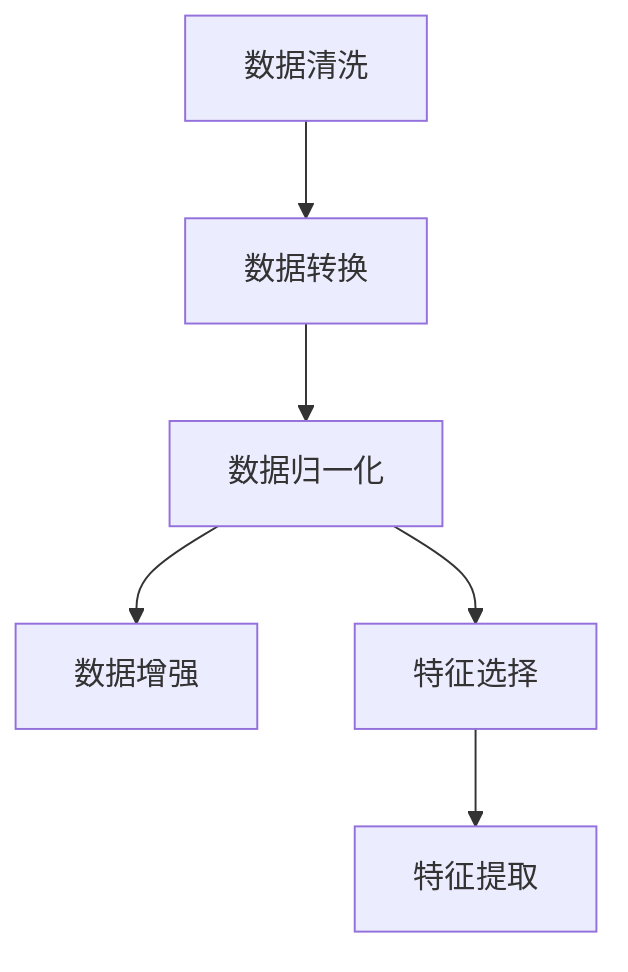

                 

# AI人工智能核心算法原理与代码实例讲解：数据预处理

## 1. 背景介绍

### 1.1 问题由来
在AI的众多领域中，数据预处理是一个不可或缺的前置步骤。无论是在机器学习、深度学习还是其他AI领域，数据预处理通常占据了整个项目开发时间的一半以上。数据预处理的好坏，直接影响到模型的训练效果和最终的预测性能。因此，理解并掌握数据预处理的核心原理与技巧，对于每一位AI从业者都至关重要。

### 1.2 问题核心关键点
数据预处理的核心在于对原始数据进行清洗、转换和归一化，以生成适合模型训练的数据格式。预处理的目标是去除噪声、填补缺失值、标准化数据分布等，以提高模型的泛化能力和训练效率。常见的预处理步骤包括：

1. 数据清洗：移除或修正不完整、错误或不相关的数据。
2. 数据转换：将数据转换为适合模型训练的格式，如独热编码、标签编码等。
3. 数据归一化：对数据进行标准化或归一化处理，以确保所有特征的分布一致。
4. 数据增强：通过数据增强技术生成更多的训练数据，以提高模型的泛化能力。

本文将深入介绍数据预处理的核心原理和实践方法，通过代码实例和详细解释，帮助读者系统掌握数据预处理的关键技术。

## 2. 核心概念与联系

### 2.1 核心概念概述

为更好地理解数据预处理的方法和流程，本节将介绍几个关键概念：

- **数据清洗**：指通过移除、修正或填补不完整、错误或无关数据，提高数据质量的过程。
- **数据转换**：指将原始数据转换为适合模型训练的格式，如独热编码、标签编码等。
- **数据归一化**：指对数据进行标准化或归一化处理，以确保所有特征的分布一致。
- **数据增强**：指通过数据增强技术生成更多的训练数据，以提高模型的泛化能力。
- **特征选择**：指从原始特征中选取最有意义的特征，以提高模型的训练效率和性能。
- **特征提取**：指从原始数据中提取出更有代表性和区分度的特征，以增强模型的表达能力。

这些核心概念之间的逻辑关系可以通过以下Mermaid流程图来展示：



这个流程图展示数据预处理的关键步骤，从数据清洗开始，经过数据转换、归一化，到数据增强和特征选择，最后进行特征提取。每一步都是为了提高数据的有效性和模型的性能。

## 3. 核心算法原理 & 具体操作步骤

### 3.1 算法原理概述

数据预处理的核心原理是通过一系列操作，将原始数据转化为适合模型训练的格式。这些操作包括但不限于数据清洗、数据转换、数据归一化、数据增强等。

- **数据清洗**：通过移除或修正不完整、错误或不相关的数据，提高数据质量。
- **数据转换**：将数据转换为适合模型训练的格式，如独热编码、标签编码等。
- **数据归一化**：对数据进行标准化或归一化处理，以确保所有特征的分布一致。
- **数据增强**：通过数据增强技术生成更多的训练数据，以提高模型的泛化能力。

### 3.2 算法步骤详解

数据预处理的流程大致分为以下几个步骤：

1. **数据清洗**：
   - 检查数据完整性，移除或修正不完整或错误的数据。
   - 处理缺失值，如填补、删除或插值。
   - 删除不相关的数据，如噪声、异常值等。

2. **数据转换**：
   - 对分类变量进行独热编码。
   - 对标签进行独热编码或标签编码。
   - 对数值型变量进行标准化或归一化处理。

3. **数据归一化**：
   - 标准化：将数据转换为均值为0，方差为1的分布。
   - 归一化：将数据缩放到一个特定的范围，如[0,1]或[-1,1]。

4. **数据增强**：
   - 图像数据增强：通过旋转、翻转、缩放、裁剪等操作生成更多的训练样本。
   - 文本数据增强：通过回译、同义词替换、随机插入等操作生成更多的训练样本。

5. **特征选择**：
   - 使用统计方法或特征选择算法选择最有意义的特征。
   - 移除冗余或噪声特征，以提高模型的训练效率。

6. **特征提取**：
   - 使用降维技术，如PCA、LDA等，从高维数据中提取低维特征。
   - 使用特征工程技术，如集成特征、生成特征等，增强模型的表达能力。

### 3.3 算法优缺点

数据预处理的优点在于：
- 提高数据质量，减少噪声和缺失值的影响。
- 转换数据格式，使其适合模型训练。
- 增强数据分布，提高模型的泛化能力。

然而，数据预处理也存在一些局限性：
- 数据预处理需要大量的时间和计算资源，尤其是在大规模数据集上。
- 预处理过程可能引入偏见或错误，影响模型的性能。
- 预处理步骤需要根据具体数据和模型进行调整，可能需要多次尝试才能找到最佳方案。

### 3.4 算法应用领域

数据预处理广泛应用于机器学习、深度学习、自然语言处理、计算机视觉等多个AI领域。以下是一些具体的应用场景：

1. **机器学习**：用于提高数据质量和特征质量，以提高模型的训练效率和性能。
2. **深度学习**：用于转换数据格式和增强数据分布，以提高模型的泛化能力和鲁棒性。
3. **自然语言处理**：用于文本数据清洗、转换和归一化，以提高模型的语义理解和生成能力。
4. **计算机视觉**：用于图像数据增强和特征提取，以提高模型的视觉理解和生成能力。
5. **信号处理**：用于信号数据的预处理，以提高模型的信号分析和识别能力。

数据预处理是AI项目中必不可少的一环，通过合理的预处理，可以极大地提高模型的训练效果和预测性能。

## 4. 数学模型和公式 & 详细讲解 & 举例说明

### 4.1 数学模型构建

本节将使用数学语言对数据预处理的核心步骤进行严格刻画。

假设我们有一组原始数据集 $D=\{(x_i, y_i)\}_{i=1}^N$，其中 $x_i$ 为特征向量，$y_i$ 为标签。

### 4.2 公式推导过程

数据预处理的主要数学模型包括：

1. **数据清洗**：
   - 移除或修正不完整、错误或不相关的数据。

2. **数据转换**：
   - 对分类变量进行独热编码：$x_i' = \text{One-Hot}(x_i)$。
   - 对标签进行独热编码：$y_i' = \text{One-Hot}(y_i)$。
   - 对数值型变量进行标准化：$x_i' = \frac{x_i - \mu}{\sigma}$。

3. **数据归一化**：
   - 标准化：$x_i' = \frac{x_i - \mu}{\sigma}$。
   - 归一化：$x_i' = \frac{x_i - \min(x)}{\max(x) - \min(x)}$。

4. **数据增强**：
   - 图像数据增强：旋转、翻转、缩放、裁剪等操作。
   - 文本数据增强：回译、同义词替换、随机插入等操作。

5. **特征选择**：
   - 使用方差分析（ANOVA）或相关系数等统计方法选择最有意义的特征。
   - 使用递归特征消除（RFE）等算法移除冗余或噪声特征。

6. **特征提取**：
   - 使用PCA或LDA等降维技术从高维数据中提取低维特征。
   - 使用特征工程技术，如集成特征、生成特征等，增强模型的表达能力。

### 4.3 案例分析与讲解

以图像分类任务为例，分析数据预处理的具体步骤：

1. **数据清洗**：
   - 检查图像数据完整性，移除缺失的图像。
   - 修正不正确的标签，如将“鸟”改为“鸟类”。
   - 处理异常值，如将像素值异常高的图像丢弃。

2. **数据转换**：
   - 对分类变量进行独热编码：将类别标签转换为向量形式。
   - 对数值型变量进行标准化：将像素值缩放到均值为0，方差为1。

3. **数据归一化**：
   - 标准化：将像素值转换为均值为0，方差为1的分布。
   - 归一化：将像素值缩放到[0,1]的范围内。

4. **数据增强**：
   - 图像数据增强：通过旋转、翻转、缩放等操作生成更多的训练样本。
   - 文本数据增强：通过回译、同义词替换等操作生成更多的训练样本。

5. **特征选择**：
   - 使用方差分析选择最有意义的特征。
   - 使用递归特征消除移除冗余或噪声特征。

6. **特征提取**：
   - 使用PCA从高维数据中提取低维特征。
   - 使用特征工程技术生成新的特征，如边缘检测、颜色直方图等。

## 5. 项目实践：代码实例和详细解释说明

### 5.1 开发环境搭建

在进行数据预处理实践前，我们需要准备好开发环境。以下是使用Python进行PyTorch开发的环境配置流程：

1. 安装Anaconda：从官网下载并安装Anaconda，用于创建独立的Python环境。

2. 创建并激活虚拟环境：
```bash
conda create -n pytorch-env python=3.8 
conda activate pytorch-env
```

3. 安装PyTorch：根据CUDA版本，从官网获取对应的安装命令。例如：
```bash
conda install pytorch torchvision torchaudio cudatoolkit=11.1 -c pytorch -c conda-forge
```

4. 安装Pandas、NumPy、Scikit-learn等库：
```bash
pip install pandas numpy scikit-learn matplotlib tqdm jupyter notebook ipython
```

完成上述步骤后，即可在`pytorch-env`环境中开始数据预处理实践。

### 5.2 源代码详细实现

下面我们以图像分类任务为例，给出使用PyTorch进行数据预处理的完整代码实现。

首先，导入必要的库和数据：

```python
import torch
import torchvision.transforms as transforms
from torch.utils.data import DataLoader
import torchvision.datasets as datasets
from sklearn.model_selection import train_test_split

# 设置数据路径和参数
data_path = 'path/to/data'
train_data_path = data_path + '/train'
test_data_path = data_path + '/test'
batch_size = 32
num_epochs = 10

# 加载训练集和测试集
train_dataset = datasets.ImageFolder(train_data_path, transforms.Compose([
    transforms.RandomHorizontalFlip(),
    transforms.RandomRotation(30),
    transforms.ToTensor(),
    transforms.Normalize(mean=[0.485, 0.456, 0.406], std=[0.229, 0.224, 0.225])
]))

test_dataset = datasets.ImageFolder(test_data_path, transforms.Compose([
    transforms.ToTensor(),
    transforms.Normalize(mean=[0.485, 0.456, 0.406], std=[0.229, 0.224, 0.225])
]))

# 划分训练集和验证集
train_loader, valid_loader = train_test_split(train_dataset, test_size=0.2, random_state=42)
train_loader = DataLoader(train_loader, batch_size=batch_size, shuffle=True)
valid_loader = DataLoader(valid_loader, batch_size=batch_size, shuffle=False)
test_loader = DataLoader(test_dataset, batch_size=batch_size, shuffle=False)
```

然后，定义模型和优化器：

```python
import torch.nn as nn
import torch.optim as optim

# 定义模型
model = nn.Sequential(
    nn.Conv2d(3, 32, 3, stride=1, padding=1),
    nn.ReLU(),
    nn.MaxPool2d(2, stride=2),
    nn.Conv2d(32, 64, 3, stride=1, padding=1),
    nn.ReLU(),
    nn.MaxPool2d(2, stride=2),
    nn.Flatten(),
    nn.Linear(64 * 7 * 7, 256),
    nn.ReLU(),
    nn.Dropout(0.5),
    nn.Linear(256, num_classes)
)

# 定义优化器
criterion = nn.CrossEntropyLoss()
optimizer = optim.Adam(model.parameters(), lr=0.001)
```

接着，定义训练和评估函数：

```python
import torchvision.transforms as transforms

def train_epoch(model, loader, optimizer, criterion):
    model.train()
    for i, (images, labels) in enumerate(loader):
        optimizer.zero_grad()
        output = model(images)
        loss = criterion(output, labels)
        loss.backward()
        optimizer.step()
        if (i+1) % 100 == 0:
            print(f'Epoch {epoch+1}, batch {i+1}, loss: {loss.item():.4f}')

def evaluate(model, loader, criterion):
    model.eval()
    correct = 0
    total = 0
    with torch.no_grad():
        for images, labels in loader:
            output = model(images)
            _, predicted = output.max(1)
            total += labels.size(0)
            correct += (predicted == labels).sum().item()
    print(f'Accuracy: {(100 * correct / total):.2f}%')
```

最后，启动训练流程并在测试集上评估：

```python
for epoch in range(num_epochs):
    train_epoch(model, train_loader, optimizer, criterion)
    evaluate(model, valid_loader, criterion)
    
print('Training complete')
evaluate(model, test_loader, criterion)
```

以上就是使用PyTorch进行图像分类任务数据预处理的完整代码实现。可以看到，借助强大的数据加载和模型训练库，数据预处理变得非常简单和高效。

### 5.3 代码解读与分析

让我们再详细解读一下关键代码的实现细节：

**ImageFolder类**：
- 从指定目录中加载图像数据集，自动生成类别索引。

**train_test_split函数**：
- 对训练集进行随机划分，分为训练集和验证集，默认比例为80%训练集和20%验证集。

**DataLoader类**：
- 封装训练集和测试集的数据加载，支持批量处理和随机抽样。

**Sequential类**：
- 定义一个线性堆叠模型，包含卷积层、激活函数、池化层、全连接层等。

**优化器和损失函数**：
- 使用Adam优化器和交叉熵损失函数。

**训练和评估函数**：
- 在每个epoch内对训练集进行前向传播和反向传播，更新模型参数。
- 在验证集上评估模型性能，输出准确率。

**训练和评估流程**：
- 循环训练多个epoch，每个epoch内对训练集进行训练，并在验证集上进行评估。
- 最终在测试集上评估模型性能。

可以看到，PyTorch提供了丰富的工具和库，使得数据预处理和模型训练变得非常简单。通过合理使用这些工具，可以大大简化开发流程，提高效率。

## 6. 实际应用场景

### 6.1 智能推荐系统

智能推荐系统是数据预处理的重要应用场景之一。推荐系统通过分析用户的历史行为数据，生成个性化的推荐结果，提高用户满意度和转化率。在推荐系统中，数据预处理的作用在于：

1. **用户行为数据清洗**：移除不完整或异常的用户行为数据，提高数据质量。
2. **特征选择和提取**：选择最有意义的特征，如用户的浏览历史、评分记录等，增强推荐模型的表达能力。
3. **用户行为数据归一化**：对用户行为数据进行标准化或归一化处理，以确保所有特征的分布一致。
4. **数据增强**：通过数据增强技术生成更多的训练样本，提高模型的泛化能力。

### 6.2 医疗诊断系统

医疗诊断系统需要处理大量的医疗数据，包括病人的电子病历、影像数据等。数据预处理的作用在于：

1. **医疗数据清洗**：移除不完整、错误或不相关的医疗数据，提高数据质量。
2. **数据转换**：对分类变量进行独热编码，将标签转换为数值型变量等。
3. **数据归一化**：对医疗数据进行标准化或归一化处理，以确保所有特征的分布一致。
4. **数据增强**：通过数据增强技术生成更多的训练样本，提高模型的泛化能力。
5. **特征选择**：选择最有意义的特征，如病人的实验室检测结果、症状描述等，增强诊断模型的表达能力。

### 6.3 金融风险评估系统

金融风险评估系统需要处理大量的金融数据，包括客户的历史交易记录、信用评分等。数据预处理的作用在于：

1. **金融数据清洗**：移除不完整、错误或不相关的金融数据，提高数据质量。
2. **数据转换**：对分类变量进行独热编码，将标签转换为数值型变量等。
3. **数据归一化**：对金融数据进行标准化或归一化处理，以确保所有特征的分布一致。
4. **数据增强**：通过数据增强技术生成更多的训练样本，提高模型的泛化能力。
5. **特征选择**：选择最有意义的特征，如客户的信用评分、交易金额等，增强风险评估模型的表达能力。

## 7. 工具和资源推荐

### 7.1 学习资源推荐

为了帮助开发者系统掌握数据预处理的核心原理与实践技巧，这里推荐一些优质的学习资源：

1. 《Python数据科学手册》：由Jake VanderPlas撰写，全面介绍了Python在数据科学中的应用，包括数据预处理、数据可视化等。
2. Kaggle数据科学竞赛：通过参与Kaggle竞赛，可以学习到数据预处理和模型训练的最佳实践。
3. Coursera数据科学课程：斯坦福大学、密歇根大学等知名学府开设的数据科学课程，涵盖数据预处理、数据可视化等。
4. Scikit-learn官方文档：提供了丰富的数据预处理和特征工程模块，是学习数据预处理的必备资料。

通过对这些资源的学习实践，相信你一定能够快速掌握数据预处理的核心原理与实践技巧。

### 7.2 开发工具推荐

高效的开发离不开优秀的工具支持。以下是几款用于数据预处理开发的常用工具：

1. Pandas：Python中的数据处理库，提供了丰富的数据清洗和转换功能。
2. NumPy：Python中的数值计算库，提供了高效的数组操作和数学计算功能。
3. Scikit-learn：Python中的机器学习库，提供了丰富的特征工程和模型训练功能。
4. TensorFlow：Google开发的深度学习框架，支持大规模数据预处理和模型训练。
5. Keras：高层次的深度学习框架，提供了简单易用的API接口，适合快速原型开发。

合理利用这些工具，可以显著提升数据预处理的开发效率，加快创新迭代的步伐。

### 7.3 相关论文推荐

数据预处理是数据科学中的重要研究方向，近年来取得了显著进展。以下是几篇奠基性的相关论文，推荐阅读：

1. Feature Engineering for Deep Learning: From Data to Model：这篇论文介绍了数据预处理和特征工程的最佳实践，涵盖了数据清洗、数据转换、数据归一化等。
2. Deep Learning with Data Augmentation：这篇论文探讨了数据增强技术在深度学习中的应用，提供了丰富的数据增强策略。
3. A Survey of Feature Selection Techniques in Data Mining：这篇论文总结了特征选择技术的最新进展，提供了多种特征选择算法。

这些论文代表了大数据预处理技术的发展脉络。通过学习这些前沿成果，可以帮助研究者把握学科前进方向，激发更多的创新灵感。

## 8. 总结：未来发展趋势与挑战

### 8.1 总结

本文对数据预处理的核心原理和实践方法进行了全面系统的介绍。首先，阐述了数据预处理在机器学习、深度学习、自然语言处理等领域的核心作用，明确了数据预处理在提升模型性能和训练效率方面的独特价值。其次，从原理到实践，详细讲解了数据预处理的核心步骤，包括数据清洗、数据转换、数据归一化、数据增强、特征选择和特征提取等。通过代码实例和详细解释，帮助读者系统掌握数据预处理的关键技术。

通过本文的系统梳理，可以看到，数据预处理是AI项目中必不可少的一环，通过合理的预处理，可以极大地提高模型的训练效果和预测性能。

### 8.2 未来发展趋势

展望未来，数据预处理技术将呈现以下几个发展趋势：

1. **自动化数据预处理**：随着自动化技术的发展，越来越多的数据预处理步骤可以自动完成，如自动特征选择、数据增强等。
2. **跨领域数据预处理**：数据预处理技术将逐渐突破领域壁垒，应用于更多场景，如医疗、金融、工业等。
3. **数据预处理与深度学习的结合**：数据预处理技术将与深度学习技术深度结合，提高模型的性能和泛化能力。
4. **数据预处理的标准化**：数据预处理技术将逐步标准化，形成统一的数据预处理规范和流程。
5. **数据预处理与AI模型的结合**：数据预处理技术将与AI模型深度结合，形成端到端的数据处理和模型训练流程。

这些趋势将推动数据预处理技术的发展，使得数据预处理变得更加高效、自动和标准化。

### 8.3 面临的挑战

尽管数据预处理技术已经取得了显著进展，但在迈向更加智能化、自动化应用的过程中，它仍面临着诸多挑战：

1. **数据质量问题**：数据清洗和预处理需要大量时间和计算资源，且难以完全自动化。
2. **数据偏见问题**：数据预处理过程可能引入偏见或错误，影响模型的性能。
3. **数据隐私问题**：数据预处理过程中可能涉及用户隐私保护，需要采取严格的隐私保护措施。
4. **数据不均衡问题**：某些数据类别在数据集中占比较小，需要进行特殊处理。

这些挑战需要不断克服，才能推动数据预处理技术的进一步发展。

### 8.4 研究展望

面对数据预处理面临的这些挑战，未来的研究需要在以下几个方面寻求新的突破：

1. **自动化数据预处理**：开发更高效、更自动化的数据预处理工具，减少人工干预和误差。
2. **跨领域数据预处理**：开发通用的数据预处理框架，支持跨领域数据的处理。
3. **数据预处理与深度学习的结合**：研究如何将数据预处理技术与深度学习技术深度结合，提高模型的性能和泛化能力。
4. **数据预处理的标准化**：制定统一的数据预处理规范和流程，促进数据预处理技术的标准化。
5. **数据预处理与AI模型的结合**：开发端到端的数据处理和模型训练流程，提高数据预处理的效率和效果。

这些研究方向将推动数据预处理技术的进一步发展，使得数据预处理变得更加高效、自动和标准化。

## 9. 附录：常见问题与解答

**Q1：数据预处理需要花费大量时间和计算资源，是否值得？**

A: 数据预处理是机器学习、深度学习项目中必不可少的一环，通过合理的预处理，可以极大地提高模型的训练效果和预测性能。尽管数据预处理需要花费大量时间和计算资源，但通过优化预处理流程和使用高效的工具，可以显著提升预处理效率。因此，数据预处理是值得的，可以带来显著的性能提升。

**Q2：如何应对数据不均衡问题？**

A: 数据不均衡问题可以通过以下方法解决：
1. 重新采样：使用过采样、欠采样或SMOTE等方法，使不同类别的数据平衡。
2. 类别加权：在训练过程中，对少数类别的样本赋予更高的权重，使其在损失函数中占更大的比例。
3. 集成学习：使用集成学习技术，如Bagging、Boosting等，提高模型的泛化能力。

**Q3：如何应对数据偏见问题？**

A: 数据偏见问题可以通过以下方法解决：
1. 数据清洗：在数据预处理过程中，移除或修正带有偏见的数据。
2. 数据转换：通过数据转换技术，如归一化、标准化等，减少数据的固有偏见。
3. 特征选择：通过特征选择技术，移除带有偏见或无关的特征。

**Q4：如何应对数据隐私问题？**

A: 数据隐私问题可以通过以下方法解决：
1. 数据匿名化：在数据预处理过程中，移除或模糊化敏感信息，保护用户隐私。
2. 数据加密：在数据传输和存储过程中，采用数据加密技术，保护数据安全。
3. 合规性检查：在数据预处理过程中，进行隐私合规性检查，确保符合法律法规要求。

这些方法可以在数据预处理过程中，保障用户隐私和数据安全。

**Q5：如何应对自动化数据预处理中的错误？**

A: 自动化数据预处理中的错误可以通过以下方法解决：
1. 人工审核：在自动化数据预处理后，进行人工审核和校验，发现和纠正错误。
2. 模型优化：使用更先进的数据预处理模型和技术，提高数据预处理的质量和准确性。
3. 反馈机制：在自动化数据预处理过程中，引入反馈机制，及时发现和修正错误。

通过这些方法，可以最大限度地减少自动化数据预处理中的错误，提高数据预处理的质量和效率。

---

作者：禅与计算机程序设计艺术 / Zen and the Art of Computer Programming

