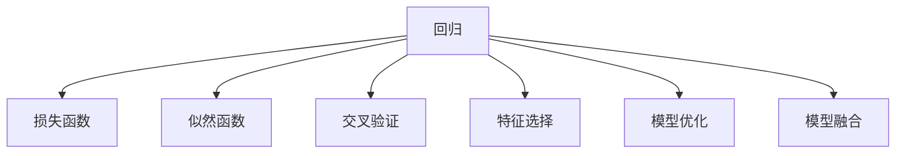

                 

# AI人工智能核心算法原理与代码实例讲解：统计学习

> 关键词：统计学习,机器学习,回归,分类,决策树,支持向量机,贝叶斯分类器,神经网络

## 1. 背景介绍

### 1.1 问题由来

统计学习是机器学习中的一个重要分支，其核心思想是通过对数据进行建模，从而预测未来的数据。它主要解决的是从数据中学习模型参数，使得模型能够对未知数据进行准确预测。统计学习广泛应用于金融、医疗、电商等领域，是人工智能领域的重要工具。

近年来，随着数据量的不断增加和计算能力的提升，统计学习在处理复杂问题方面取得了显著进展。然而，统计学习算法复杂度较高，需要大量的数据和计算资源，对模型的理解和优化要求也较高。

### 1.2 问题核心关键点

统计学习涉及的核心关键点包括：

1. 回归与分类：统计学习主要分为回归与分类两种任务，回归预测连续变量，分类预测离散变量。
2. 模型训练与评估：统计学习算法主要通过最大化似然函数或最小化损失函数进行模型训练，使用交叉验证等方法进行模型评估。
3. 特征选择：统计学习算法需要通过特征选择确定模型所需的重要特征。
4. 模型优化：统计学习算法需要优化模型参数以提高预测精度。
5. 模型融合：统计学习算法可以通过模型融合来提高预测精度。

这些关键点构成了统计学习的基础框架，帮助研究人员和工程师在实际应用中有效地构建和使用模型。

### 1.3 问题研究意义

统计学习在人工智能领域中的应用非常广泛，其研究意义主要体现在以下几个方面：

1. 数据驱动决策：统计学习算法能够从海量数据中提取有价值的知识，为决策者提供支持。
2. 提高预测精度：通过统计学习算法，可以对未来的数据进行准确预测，减少决策风险。
3. 降低成本：统计学习算法能够自动化地处理大量数据，降低人力成本。
4. 提高效率：统计学习算法能够优化模型的参数，提高预测速度。
5. 拓展应用范围：统计学习算法能够应用于各种复杂问题，为人工智能技术的应用提供新的思路和方法。

## 2. 核心概念与联系

### 2.1 核心概念概述

为了更好地理解统计学习算法，本节将介绍几个密切相关的核心概念：

1. 统计学习(Statistical Learning)：通过数据建模，预测未来数据的学习方法。
2. 回归(Regression)：预测连续变量。
3. 分类(Classification)：预测离散变量。
4. 损失函数(Loss Function)：用于衡量模型预测与实际值之间的差距。
5. 似然函数(Likelihood Function)：衡量模型参数与数据分布的拟合程度。
6. 交叉验证(Cross-Validation)：用于评估模型性能的统计方法。
7. 特征选择(Feature Selection)：用于确定模型所需的重要特征。
8. 模型优化(Model Optimization)：通过优化模型参数提高预测精度。
9. 模型融合(Model Ensemble)：通过组合多个模型提高预测精度。

这些核心概念之间的逻辑关系可以通过以下Mermaid流程图来展示：



这个流程图展示了他理论的回归算法及其相关概念之间的联系。

## 3. 核心算法原理 & 具体操作步骤
### 3.1 算法原理概述

统计学习算法主要分为回归和分类两种类型。以下是两种基本算法原理的介绍：

#### 回归算法

回归算法主要解决连续变量的预测问题，常用的回归算法包括线性回归、多项式回归、岭回归、决策树回归等。线性回归算法假设数据服从线性模型，通过最小化残差平方和来拟合模型。决策树回归算法通过构建决策树来分类和预测连续变量，每个节点都包含一个分割特征和一个分割值。

#### 分类算法

分类算法主要解决离散变量的预测问题，常用的分类算法包括逻辑回归、支持向量机、决策树、朴素贝叶斯等。逻辑回归算法假设数据服从二元伯努利分布，通过最大化似然函数来拟合模型。支持向量机算法通过构建最大间隔超平面来分类，能够处理非线性数据。决策树分类算法通过构建决策树来分类，每个节点都包含一个分割特征和一个分割值。朴素贝叶斯算法假设特征之间相互独立，通过最大化后验概率来分类。

### 3.2 算法步骤详解

统计学习算法主要包括以下几个关键步骤：

#### 步骤1：数据准备

统计学习算法需要准备训练数据集和测试数据集，数据集应包括输入特征和目标变量。

#### 步骤2：模型选择

根据问题的特点选择合适的统计学习算法。回归问题选择回归算法，分类问题选择分类算法。

#### 步骤3：模型训练

根据选择的算法，利用训练数据集进行模型训练，优化模型参数。

#### 步骤4：模型评估

利用测试数据集对模型进行评估，使用交叉验证等方法确定模型性能。

#### 步骤5：模型应用

使用训练好的模型对新数据进行预测。

### 3.3 算法优缺点

统计学习算法具有以下优点：

1. 可解释性强：统计学习算法可以使用统计方法进行模型评估和特征选择，模型结构简单，易于解释。
2. 可扩展性好：统计学习算法可以处理大规模数据集，并且可以在线学习。
3. 预测精度高：统计学习算法通过优化模型参数，能够提高预测精度。

同时，统计学习算法也存在以下缺点：

1. 对数据要求高：统计学习算法需要大量的数据和较高的计算资源。
2. 模型复杂度高：统计学习算法的模型复杂度较高，容易出现过拟合现象。
3. 模型选择困难：统计学习算法需要根据问题的特点选择合适的算法，选择不当会导致模型性能下降。

### 3.4 算法应用领域

统计学习算法广泛应用于金融、医疗、电商等领域，以下是几个主要的应用领域：

#### 金融领域

统计学习算法可以用于股票价格预测、信用风险评估、投资组合优化等。例如，线性回归算法可以用于预测股票价格，逻辑回归算法可以用于评估信用风险。

#### 医疗领域

统计学习算法可以用于疾病诊断、药物研发、基因表达分析等。例如，决策树算法可以用于分类疾病，朴素贝叶斯算法可以用于基因表达分析。

#### 电商领域

统计学习算法可以用于推荐系统、商品分类、广告投放等。例如，支持向量机算法可以用于商品分类，神经网络算法可以用于推荐系统。

## 4. 数学模型和公式 & 详细讲解 & 举例说明

### 4.1 数学模型构建

统计学习算法主要使用数学模型来描述数据，常用的数学模型包括线性模型、逻辑回归模型、支持向量机模型等。

#### 线性回归模型

线性回归模型假设数据服从线性模型，模型为：

$$
y_i = \beta_0 + \beta_1 x_{i1} + \beta_2 x_{i2} + \cdots + \beta_p x_{ip} + \epsilon_i
$$

其中，$y_i$为目标变量，$x_{ij}$为输入特征，$\beta_0,\beta_1,\cdots,\beta_p$为模型参数，$\epsilon_i$为误差项。

#### 逻辑回归模型

逻辑回归模型假设数据服从二元伯努利分布，模型为：

$$
p(y_i = 1|x_i) = \frac{1}{1 + e^{-\beta^T x_i}}
$$

其中，$x_i$为输入特征，$\beta^T x_i$为线性变换，$p(y_i = 1|x_i)$为目标变量的条件概率。

#### 支持向量机模型

支持向量机模型假设数据服从线性分类模型，模型为：

$$
f(x) = w^T x + b
$$

其中，$x$为输入特征，$w$为权重向量，$b$为偏置项。

### 4.2 公式推导过程

#### 线性回归

线性回归模型的参数估计可以通过最小化残差平方和来实现。假设已知训练数据集$D=\{(x_i,y_i)\}_{i=1}^N$，模型参数为$\beta_0,\beta_1,\cdots,\beta_p$，则残差平方和为：

$$
RSS = \sum_{i=1}^N (y_i - \hat{y}_i)^2
$$

其中，$\hat{y}_i = \beta_0 + \beta_1 x_{i1} + \beta_2 x_{i2} + \cdots + \beta_p x_{ip}$。

最小化残差平方和得到参数估计公式：

$$
\beta_j = \frac{\sum_{i=1}^N (y_i - \hat{y}_i)x_{ij}}{\sum_{i=1}^N x_{ij}^2}
$$

#### 逻辑回归

逻辑回归模型的参数估计可以通过最大化似然函数来实现。假设已知训练数据集$D=\{(x_i,y_i)\}_{i=1}^N$，模型参数为$\beta_0,\beta_1,\cdots,\beta_p$，则似然函数为：

$$
L(\beta_0,\beta_1,\cdots,\beta_p) = \prod_{i=1}^N p(y_i = 1|x_i)^{y_i} (1 - p(y_i = 1|x_i))^{1 - y_i}
$$

最大化似然函数得到参数估计公式：

$$
\beta_j = \frac{\sum_{i=1}^N y_i x_{ij}}{\sum_{i=1}^N x_{ij}^2}
$$

#### 支持向量机

支持向量机模型的参数估计可以通过求解拉格朗日乘子来实现。假设已知训练数据集$D=\{(x_i,y_i)\}_{i=1}^N$，模型参数为$w,b$，则拉格朗日乘子为$\alpha_i$，对偶问题为：

$$
\max_{\alpha} \frac{\sum_{i=1}^N \alpha_i - \frac{1}{2} \sum_{i=1}^N \sum_{j=1}^N \alpha_i \alpha_j y_i y_j \langle x_i,x_j \rangle - \sum_{i=1}^N \alpha_i y_i}
$$

最小化上述对偶问题得到参数估计公式：

$$
w = \sum_{i=1}^N \alpha_i y_i x_i
$$

### 4.3 案例分析与讲解

#### 案例1：线性回归

假设有一组数据集，用于预测房价，已知数据集$D=\{(x_i,y_i)\}_{i=1}^N$，其中$x_i$为房屋面积和房屋年龄，$y_i$为目标变量即房价。可以使用线性回归模型来拟合数据集，使用公式：

$$
\hat{y}_i = \beta_0 + \beta_1 x_{i1} + \beta_2 x_{i2}
$$

其中，$\beta_0,\beta_1,\beta_2$为模型参数，可以使用最小化残差平方和公式来估计模型参数。假设已知$\beta_0,\beta_1,\beta_2$的初始值为0，则：

$$
\beta_j = \frac{\sum_{i=1}^N (y_i - \hat{y}_i)x_{ij}}{\sum_{i=1}^N x_{ij}^2}
$$

使用上述公式可以计算得到$\beta_0,\beta_1,\beta_2$的值，进而得到线性回归模型。

#### 案例2：逻辑回归

假设有一组数据集，用于预测患者是否患有某种疾病，已知数据集$D=\{(x_i,y_i)\}_{i=1}^N$，其中$x_i$为患者的症状和年龄，$y_i$为目标变量即患者是否患有该疾病。可以使用逻辑回归模型来拟合数据集，使用公式：

$$
p(y_i = 1|x_i) = \frac{1}{1 + e^{-\beta^T x_i}}
$$

其中，$x_i$为输入特征，$\beta^T x_i$为线性变换。使用公式：

$$
\beta_j = \frac{\sum_{i=1}^N y_i x_{ij}}{\sum_{i=1}^N x_{ij}^2}
$$

可以计算得到$\beta_0,\beta_1,\cdots,\beta_p$的值，进而得到逻辑回归模型。

#### 案例3：支持向量机

假设有一组数据集，用于分类不同水果，已知数据集$D=\{(x_i,y_i)\}_{i=1}^N$，其中$x_i$为水果的特征，$y_i$为目标变量即水果类型。可以使用支持向量机模型来拟合数据集，使用公式：

$$
f(x) = w^T x + b
$$

其中，$x$为输入特征，$w$为权重向量，$b$为偏置项。使用拉格朗日乘子公式：

$$
w = \sum_{i=1}^N \alpha_i y_i x_i
$$

可以计算得到$w$和$b$的值，进而得到支持向量机模型。

## 5. 项目实践：代码实例和详细解释说明

### 5.1 开发环境搭建

在进行统计学习算法实践前，我们需要准备好开发环境。以下是使用Python进行Scikit-learn开发的环境配置流程：

1. 安装Anaconda：从官网下载并安装Anaconda，用于创建独立的Python环境。

2. 创建并激活虚拟环境：
```bash
conda create -n scikit-learn-env python=3.8 
conda activate scikit-learn-env
```

3. 安装Scikit-learn：
```bash
conda install scikit-learn
```

4. 安装相关库：
```bash
pip install numpy pandas matplotlib seaborn scikit-learn
```

完成上述步骤后，即可在`scikit-learn-env`环境中开始实践。

### 5.2 源代码详细实现

下面我们以回归和分类两种任务为例，给出使用Scikit-learn库进行统计学习算法开发的Python代码实现。

#### 回归算法

首先，定义回归任务的数据处理函数：

```python
import numpy as np
import pandas as pd

def load_data():
    data = pd.read_csv('data.csv')
    X = data[['feature1', 'feature2']]
    y = data['target']
    return X, y

X, y = load_data()
```

然后，定义回归模型：

```python
from sklearn.linear_model import LinearRegression

model = LinearRegression()
model.fit(X, y)
```

最后，评估回归模型：

```python
from sklearn.metrics import mean_squared_error, r2_score

y_pred = model.predict(X)
rmse = np.sqrt(mean_squared_error(y, y_pred))
r2 = r2_score(y, y_pred)
print('RMSE:', rmse)
print('R2:', r2)
```

#### 分类算法

首先，定义分类任务的数据处理函数：

```python
def load_data():
    data = pd.read_csv('data.csv')
    X = data[['feature1', 'feature2']]
    y = data['target']
    return X, y

X, y = load_data()
```

然后，定义分类模型：

```python
from sklearn.linear_model import LogisticRegression

model = LogisticRegression()
model.fit(X, y)
```

最后，评估分类模型：

```python
from sklearn.metrics import accuracy_score, confusion_matrix

y_pred = model.predict(X)
accuracy = accuracy_score(y, y_pred)
cm = confusion_matrix(y, y_pred)
print('Accuracy:', accuracy)
print('Confusion Matrix:', cm)
```

### 5.3 代码解读与分析

让我们再详细解读一下关键代码的实现细节：

**load_data函数**：
- 定义了数据加载函数，用于读取数据集，并将其转换为输入特征和目标变量。

**LinearRegression和LogisticRegression类**：
- 分别定义了线性回归模型和逻辑回归模型，使用Scikit-learn库的封装功能，简化了模型训练和评估过程。

**fit和predict方法**：
- 使用fit方法进行模型训练，将训练数据传入模型。
- 使用predict方法进行模型预测，将测试数据传入模型，返回预测结果。

**评估指标**：
- 使用mean_squared_error计算均方误差，用于评估回归模型的预测精度。
- 使用r2_score计算决定系数，用于评估回归模型的拟合效果。
- 使用accuracy_score计算准确率，用于评估分类模型的预测精度。
- 使用confusion_matrix计算混淆矩阵，用于评估分类模型的分类效果。

可以看到，Scikit-learn库封装了常用的统计学习算法，使得模型的训练和评估变得非常简洁高效。开发者可以使用这些工具快速实现回归和分类任务。

当然，工业级的系统实现还需考虑更多因素，如模型的保存和部署、超参数的自动搜索、更多的评估指标等。但核心的统计学习算法基本与此类似。

## 6. 实际应用场景

### 6.1 智能推荐系统

统计学习算法可以用于推荐系统，根据用户的历史行为数据和物品的特征，预测用户对物品的评分，从而推荐最适合的物品。例如，可以使用线性回归或逻辑回归模型来预测用户对物品的评分，使用支持向量机模型来分类物品类型。

在技术实现上，可以收集用户浏览、点击、评价、收藏等行为数据，提取和物品相关的特征，如商品名称、描述、标签等。将用户行为数据和物品特征作为输入，预测用户对物品的评分，并根据评分进行推荐。

### 6.2 金融风险控制

统计学习算法可以用于金融风险控制，根据用户的历史交易记录和行为数据，预测用户是否会违约或发生欺诈行为。例如，可以使用逻辑回归或支持向量机模型来分类用户是否会违约或欺诈，使用决策树模型来分类欺诈类型。

在技术实现上，可以收集用户的历史交易记录和行为数据，提取和交易相关的特征，如交易金额、交易时间、交易地点等。将用户行为数据和交易特征作为输入，使用逻辑回归或支持向量机模型预测用户是否会违约或欺诈，使用决策树模型分类欺诈类型。

### 6.3 智能客服系统

统计学习算法可以用于智能客服系统，根据用户的问题或输入，预测用户意图并提供相应的回答。例如，可以使用决策树或朴素贝叶斯模型来分类用户意图，使用线性回归或逻辑回归模型来预测用户意图。

在技术实现上，可以收集用户的历史对话记录和问题，提取和问题相关的特征，如问题类型、问题关键词等。将用户问题特征作为输入，使用决策树或朴素贝叶斯模型预测用户意图，使用线性回归或逻辑回归模型预测用户意图对应的回答。

### 6.4 未来应用展望

随着统计学习算法的发展，其在各个领域的应用前景更加广阔。以下是几个主要的应用领域：

#### 金融领域

统计学习算法可以用于股票价格预测、信用风险评估、投资组合优化等。例如，可以使用线性回归算法预测股票价格，使用逻辑回归算法评估信用风险。

#### 医疗领域

统计学习算法可以用于疾病诊断、药物研发、基因表达分析等。例如，可以使用决策树算法分类疾病，使用朴素贝叶斯算法分析基因表达。

#### 电商领域

统计学习算法可以用于推荐系统、商品分类、广告投放等。例如，可以使用支持向量机算法分类商品类型，使用神经网络算法推荐商品。

此外，统计学习算法还可以应用于气象预测、交通流量预测、环境监测等领域，为各行各业提供数据驱动的决策支持。

## 7. 工具和资源推荐
### 7.1 学习资源推荐

为了帮助开发者系统掌握统计学习算法的理论基础和实践技巧，这里推荐一些优质的学习资源：

1. 《机器学习》课程：斯坦福大学开设的机器学习课程，有Lecture视频和配套作业，带你入门机器学习的基本概念和经典算法。

2. 《Python机器学习》书籍：通过Python实现机器学习算法的经典入门书籍，涵盖统计学习、分类、回归等多种算法。

3. Scikit-learn官方文档：Scikit-learn库的官方文档，提供了详尽的算法介绍和示例代码，是学习统计学习算法的必备资料。

4. Kaggle数据科学竞赛：Kaggle平台提供了大量数据集和模型，可以锻炼机器学习算法的实际应用能力。

5. Coursera机器学习课程：由Coursera平台开设的机器学习课程，涵盖了统计学习、深度学习、自然语言处理等多种机器学习方向。

通过对这些资源的学习实践，相信你一定能够快速掌握统计学习算法的精髓，并用于解决实际的机器学习问题。

### 7.2 开发工具推荐

高效的开发离不开优秀的工具支持。以下是几款用于统计学习算法开发的常用工具：

1. Scikit-learn：基于Python的机器学习库，提供了多种统计学习算法和模型评估方法，简单易用，是机器学习开发者的必备工具。

2. TensorFlow：由Google主导开发的深度学习框架，适合处理大规模数据和复杂模型，支持分布式计算。

3. PyTorch：由Facebook主导开发的深度学习框架，灵活高效，适合进行深度学习研究和开发。

4. Jupyter Notebook：基于Web的编程环境，支持Python、R等多种语言，是数据科学家的常用工具。

5. R语言：统计学和数据分析的主流语言，提供了丰富的统计学习算法和图形可视化工具。

合理利用这些工具，可以显著提升统计学习算法的开发效率，加快创新迭代的步伐。

### 7.3 相关论文推荐

统计学习算法的发展源于学界的持续研究。以下是几篇奠基性的相关论文，推荐阅读：

1. 《统计学习基础》：统计学习算法的基本介绍和实现方法。

2. 《机器学习：统计学习方法》：涵盖统计学习、分类、回归等多种算法，是统计学习算法的经典教材。

3. 《随机梯度下降算法》：介绍随机梯度下降算法在统计学习中的应用，是统计学习算法的重要组成部分。

4. 《Adaboost算法》：介绍Adaboost算法在统计学习中的应用，是统计学习算法的重要组成部分。

5. 《深度学习》：深度学习是统计学习算法的重要方向，涵盖深度神经网络、卷积神经网络、循环神经网络等多种模型。

这些论文代表了大统计学习算法的发展脉络。通过学习这些前沿成果，可以帮助研究者把握学科前进方向，激发更多的创新灵感。

## 8. 总结：未来发展趋势与挑战

### 8.1 总结

本文对统计学习算法进行了全面系统的介绍。首先阐述了统计学习算法的理论基础和应用背景，明确了统计学习算法在机器学习中的重要地位。其次，从原理到实践，详细讲解了回归、分类、决策树、支持向量机等经典算法的实现过程，给出了统计学习算法开发的完整代码实例。同时，本文还广泛探讨了统计学习算法在金融、医疗、电商等诸多领域的应用前景，展示了统计学习算法的巨大潜力。此外，本文精选了统计学习算法的各类学习资源，力求为读者提供全方位的技术指引。

通过本文的系统梳理，可以看到，统计学习算法在人工智能领域中的应用非常广泛，其研究意义主要体现在以下几个方面：

1. 数据驱动决策：统计学习算法能够从海量数据中提取有价值的知识，为决策者提供支持。
2. 提高预测精度：通过统计学习算法，可以对未来的数据进行准确预测，减少决策风险。
3. 降低成本：统计学习算法能够自动化地处理大量数据，降低人力成本。
4. 提高效率：统计学习算法能够优化模型的参数，提高预测速度。
5. 拓展应用范围：统计学习算法能够应用于各种复杂问题，为人工智能技术的应用提供新的思路和方法。

### 8.2 未来发展趋势

展望未来，统计学习算法将呈现以下几个发展趋势：

1. 模型复杂度进一步提升：随着深度学习算法的发展，统计学习算法的模型复杂度将进一步提升，能够处理更加复杂的问题。
2. 多模态学习兴起：统计学习算法将不仅仅局限于单一模态的数据，将能够融合视觉、语音、文本等多种模态的数据，提高模型性能。
3. 实时学习成为常态：统计学习算法将逐渐实现实时学习，能够快速适应数据分布的变化。
4. 自适应学习算法兴起：统计学习算法将逐渐实现自适应学习，能够动态调整模型参数，提高模型的泛化能力。
5. 强化学习与统计学习结合：统计学习算法将逐渐与强化学习结合，实现更加智能化的决策系统。

以上趋势凸显了统计学习算法的广阔前景。这些方向的探索发展，必将进一步提升统计学习算法的性能，为人工智能技术的应用提供新的思路和方法。

### 8.3 面临的挑战

尽管统计学习算法已经取得了瞩目成就，但在迈向更加智能化、普适化应用的过程中，它仍面临着诸多挑战：

1. 数据稀疏性问题：统计学习算法需要大量的数据，但在某些领域，获取高质量的数据非常困难。如何通过小样本学习算法提升模型的泛化能力，成为亟待解决的问题。
2. 模型复杂度问题：统计学习算法的模型复杂度较高，容易出现过拟合现象。如何设计更加鲁棒的模型结构，减少过拟合风险，是未来研究的重要方向。
3. 实时性问题：统计学习算法需要大量的计算资源和时间，如何实现实时学习，提升模型响应速度，是未来研究的难点。
4. 可解释性问题：统计学习算法的模型结构复杂，难以解释其内部工作机制和决策逻辑。如何增强算法的可解释性，提高算法的可信度，是未来研究的挑战。
5. 安全性问题：统计学习算法可能会出现有害的输出结果，如何设计安全的算法模型，确保算法的输出符合伦理道德，是未来研究的重要方向。

### 8.4 研究展望

面对统计学习算法所面临的种种挑战，未来的研究需要在以下几个方面寻求新的突破：

1. 开发更加高效的算法：设计更加高效的算法，提升模型训练和推理的速度。

2. 引入更多先验知识：将符号化的先验知识，如知识图谱、逻辑规则等，与神经网络模型进行巧妙融合，引导统计学习算法的训练过程，提高模型的泛化能力。

3. 研究新的模型结构：设计新的模型结构，提高模型的可解释性和鲁棒性，减少过拟合风险。

4. 引入强化学习思想：引入强化学习思想，实现更加智能化的决策系统，提升算法的实时性和鲁棒性。

5. 设计安全的算法模型：设计安全的算法模型，确保算法的输出符合伦理道德，减少有害的输出结果。

这些研究方向的探索，必将引领统计学习算法迈向更高的台阶，为人工智能技术的应用提供新的思路和方法。

## 9. 附录：常见问题与解答

**Q1：统计学习算法是否适用于所有数据集？**

A: 统计学习算法对数据集有一定的要求，数据集需要满足以下几个条件：

1. 数据集需要具有明显的分布规律，否则算法难以从中学习到有用的信息。

2. 数据集需要具有足够的样本数量，否则算法容易出现过拟合现象。

3. 数据集需要具有足够的多样性，否则算法容易出现泛化能力不足的问题。

4. 数据集需要具有足够的信息，否则算法容易出现模型复杂度不足的问题。

在实际应用中，需要根据数据集的特点选择合适的统计学习算法，并进行合理的参数设置和模型优化。

**Q2：统计学习算法是否需要大量的标注数据？**

A: 统计学习算法需要标注数据来进行模型训练，但并不需要大量的标注数据。例如，逻辑回归和支持向量机算法可以在小样本数据集上进行训练，而线性回归算法可以在无监督学习中进行训练。但是，如果数据集不足，统计学习算法的性能可能会受到影响。

**Q3：统计学习算法是否需要高计算资源？**

A: 统计学习算法需要计算资源来进行模型训练和推理。例如，支持向量机算法需要计算最大间隔超平面，深度神经网络算法需要计算复杂的梯度。但是，通过引入算法优化和模型压缩技术，可以减少算法的计算资源消耗。

**Q4：统计学习算法是否需要高维特征？**

A: 统计学习算法需要高维特征来进行模型训练。但是，高维特征可能会导致算法过拟合，需要引入特征选择和降维技术。

**Q5：统计学习算法是否需要复杂的模型结构？**

A: 统计学习算法需要复杂的模型结构来进行模型训练。但是，过复杂的模型结构可能会导致算法过拟合，需要引入模型正则化和剪枝技术。

总之，统计学习算法需要根据数据集的特点和任务的要求选择合适的模型结构和参数设置，并进行合理的模型优化和参数调优，才能发挥其最大的性能优势。

---

作者：禅与计算机程序设计艺术 / Zen and the Art of Computer Programming

