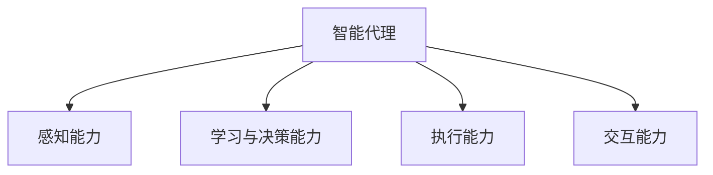

                 

## 1. 背景介绍

### 1.1 问题由来
随着城市化进程的加快和科技的飞速发展，智慧城市的概念应运而生。智慧城市旨在通过物联网、大数据、云计算等先进技术，全面提升城市管理效率，优化居民生活体验，实现绿色、智能、高效的可持续发展。其中，智能代理（Smart Agent）作为智慧城市的重要组成部分，通过模拟人类智能行为，实现城市环境的感知、决策和执行，助力城市管理和服务。

### 1.2 问题核心关键点
智能代理在智慧城市中的应用，核心在于如何通过深度学习和人工智能技术，构建一个具备高度自主性和智能性，能够实时感知城市环境变化、高效执行城市管理任务的系统。这要求智能代理具备以下关键能力：
- 感知能力：通过传感器、摄像头等设备，实时收集城市环境数据。
- 学习与决策能力：通过深度学习算法，自动学习城市运行规律和优化策略。
- 执行能力：通过执行机构，如自动驾驶车辆、智能路灯等，实现城市管理的自动化执行。
- 交互能力：通过与市民、其他智能设备的交互，获取反馈信息，不断优化自身的行为和决策。

### 1.3 问题研究意义
研究智能代理在智慧城市中的应用，对于提升城市管理水平、优化资源配置、提高市民生活满意度、推动绿色可持续发展具有重要意义：
- 提升管理效率：智能代理能够24小时不间断工作，减少人工操作，提高城市管理效率。
- 优化资源配置：通过深度学习，智能代理能够优化城市资源分配，如交通流量、能源使用等，减少浪费。
- 改善民生服务：智能代理能够提供个性化、精准化的服务，如智能停车、智能照明、智能交通等，提高市民生活便利性。
- 推动绿色发展：智能代理能够辅助城市实现节能减排、环境保护等目标，促进可持续发展。

## 2. 核心概念与联系

### 2.1 核心概念概述

为更好地理解智能代理在智慧城市中的应用，本节将介绍几个密切相关的核心概念：

- 智能代理(Smart Agent)：通过模拟人类智能行为，具备感知、学习、决策和执行能力的系统。
- 深度学习(Deep Learning)：基于神经网络结构，自动学习数据特征和规律的机器学习方法。
- 感知能力(Sensorial Ability)：智能代理通过传感器、摄像头等设备，实时收集城市环境数据。
- 学习与决策能力(Learning & Decision Capability)：智能代理通过深度学习算法，自动学习城市运行规律和优化策略。
- 执行能力(Execution Capability)：智能代理通过执行机构，实现城市管理的自动化执行。
- 交互能力(Interactive Capability)：智能代理通过与市民、其他智能设备的交互，获取反馈信息，不断优化自身的行为和决策。

这些核心概念之间的逻辑关系可以通过以下Mermaid流程图来展示：



这个流程图展示智能代理的核心能力及其之间的关系：

1. 智能代理通过感知能力获取城市环境数据。
2. 利用学习与决策能力，基于数据学习城市运行规律和优化策略。
3. 通过执行能力，自动执行城市管理任务。
4. 借助交互能力，获取市民和其他智能设备的反馈，优化自身行为和决策。

## 3. 核心算法原理 & 具体操作步骤
### 3.1 算法原理概述

智能代理在智慧城市中的应用，主要依赖于深度学习技术，实现对城市环境的感知、学习与决策。深度学习通过多层神经网络结构，自动学习数据特征和规律，具备强大的泛化能力，能够适应各种复杂的非线性关系。

智能代理的核心算法原理包括：

1. **感知模块(Sensor Module)**：通过传感器、摄像头等设备，实时收集城市环境数据，如温度、湿度、交通流量、能源消耗等。感知模块通常使用卷积神经网络（CNN）和循环神经网络（RNN）等深度学习模型，实现对城市数据的全面感知。

2. **学习与决策模块(Learning & Decision Module)**：利用收集到的城市数据，通过深度学习算法，自动学习城市运行规律和优化策略。该模块通常使用长短期记忆网络（LSTM）、变分自编码器（VAE）、生成对抗网络（GAN）等模型，实现对城市运行数据的分析和预测。

3. **执行模块(Execution Module)**：根据学习与决策模块的输出，通过执行机构，如自动驾驶车辆、智能路灯等，实现城市管理的自动化执行。执行模块通常使用强化学习算法，通过优化控制策略，实现高效的城市管理任务。

4. **交互模块(Interaction Module)**：通过与市民、其他智能设备的交互，获取反馈信息，不断优化自身的行为和决策。交互模块通常使用自然语言处理（NLP）技术，实现对市民需求的理解和响应。

### 3.2 算法步骤详解

智能代理在智慧城市中的应用，主要分为以下几个关键步骤：

**Step 1: 数据感知**
- 收集城市环境数据，如温度、湿度、交通流量、能源消耗等。
- 使用传感器、摄像头等设备，将数据实时输入到感知模块。
- 感知模块通过深度学习模型，提取数据特征，生成城市运行状态向量。

**Step 2: 学习与决策**
- 将城市运行状态向量输入到学习与决策模块。
- 使用深度学习算法，自动学习城市运行规律和优化策略。
- 通过预测模型，对未来的城市运行状态进行预测，生成优化决策。

**Step 3: 执行与反馈**
- 将优化决策输出到执行模块。
- 执行模块根据决策，控制执行机构，如自动驾驶车辆、智能路灯等，执行城市管理任务。
- 通过交互模块，获取市民和其他智能设备的反馈，调整优化决策。

**Step 4: 持续优化**
- 根据市民反馈和其他数据，不断优化感知、学习与决策模块。
- 使用强化学习算法，进一步提升执行模块的控制策略。
- 通过迭代优化，智能代理逐步提升其智能化水平和执行效率。

### 3.3 算法优缺点

智能代理在智慧城市中的应用，具有以下优点：
1. 高效感知：通过深度学习，智能代理能够实时感知城市环境变化，快速响应。
2. 智能决策：基于学习与决策模块，智能代理能够自动学习城市运行规律，优化决策。
3. 自动化执行：执行模块能够高效控制执行机构，实现城市管理的自动化。
4. 持续优化：通过交互模块获取反馈，智能代理能够不断优化自身行为和决策。

同时，该方法也存在一定的局限性：
1. 数据依赖：智能代理的效果高度依赖于城市数据的质量和全面性。
2. 模型复杂：深度学习模型参数量大，训练和推理需要高性能计算资源。
3. 数据隐私：感知和交互模块需要收集大量市民隐私数据，存在隐私保护风险。
4. 算法可解释性：深度学习模型的决策过程难以解释，存在黑盒问题。

尽管存在这些局限性，但就目前而言，智能代理的应用是智慧城市管理的重要方向，具有巨大的应用潜力。

### 3.4 算法应用领域

智能代理在智慧城市中的应用，主要涵盖以下几个领域：

- **智能交通管理**：智能代理能够实时感知交通流量、预测交通事件，优化信号灯控制、自动驾驶车辆调度，提升交通效率。
- **智能能源管理**：智能代理能够监测能源消耗、预测能源需求，优化电网调度、节能减排，实现绿色能源管理。
- **智能公共安全**：智能代理能够实时感知安防数据、预测安全事件，优化安防布控、应急响应，保障市民安全。
- **智能环境监测**：智能代理能够监测环境数据、预测环境变化，优化环境治理、生态保护，提升环境质量。
- **智能公共服务**：智能代理能够提供个性化、精准化的服务，如智能停车、智能照明、智能垃圾分类等，提升市民生活便利性。

除了上述这些经典应用外，智能代理还可拓展到更多场景中，如智慧医疗、智慧教育、智慧旅游等，为智慧城市的发展注入新的动力。

## 4. 数学模型和公式 & 详细讲解 & 举例说明

### 4.1 数学模型构建

智能代理在智慧城市中的应用，涉及多个领域的数据和算法，其数学模型构建需要综合考虑不同领域的特征。以下是智能代理的数学模型构建过程：

**感知模块**：
- 感知模块使用卷积神经网络（CNN）来提取城市环境数据特征。
- 输入为传感器和摄像头的实时数据，输出为城市运行状态向量。
- 感知模块的数学模型为：
$$
h_{sensor} = CNN(x_{sensor}, W^{sensor})
$$
其中 $h_{sensor}$ 为城市运行状态向量，$x_{sensor}$ 为传感器和摄像头的实时数据，$W^{sensor}$ 为卷积神经网络的权重参数。

**学习与决策模块**：
- 学习与决策模块使用长短期记忆网络（LSTM）来预测城市运行状态。
- 输入为感知模块输出的城市运行状态向量，输出为优化决策。
- 学习与决策模块的数学模型为：
$$
h_{lstm} = LSTM(h_{sensor}, W^{lstm})
$$
其中 $h_{lstm}$ 为优化决策，$W^{lstm}$ 为LSTM神经网络的权重参数。

**执行模块**：
- 执行模块使用强化学习算法来优化控制策略。
- 输入为学习与决策模块的优化决策，输出为执行机构的控制信号。
- 执行模块的数学模型为：
$$
u_{exec} = Q(s_{exec}, a_{exec}, W^{exec})
$$
其中 $u_{exec}$ 为执行机构的控制信号，$s_{exec}$ 为当前城市状态，$a_{exec}$ 为执行动作，$W^{exec}$ 为强化学习模型的权重参数。

**交互模块**：
- 交互模块使用自然语言处理（NLP）技术来理解和响应市民需求。
- 输入为市民的反馈数据，输出为智能代理的优化决策。
- 交互模块的数学模型为：
$$
h_{interaction} = NLP(f_{interaction}, W^{interaction})
$$
其中 $h_{interaction}$ 为优化决策，$f_{interaction}$ 为市民的反馈数据，$W^{interaction}$ 为NLP模型的权重参数。

### 4.2 公式推导过程

以下以智能交通管理为例，推导深度学习模型的公式。

**感知模块**：
- 感知模块使用卷积神经网络（CNN）来提取城市交通数据特征。
- 输入为交通摄像头采集的实时视频数据，输出为交通流量状态向量。
- 使用卷积神经网络模型，对视频数据进行特征提取和状态向量生成。
- 公式推导过程如下：
$$
h_{sensor} = CNN(x_{camera}, W^{camera})
$$

**学习与决策模块**：
- 学习与决策模块使用长短期记忆网络（LSTM）来预测交通流量。
- 输入为感知模块输出的交通流量状态向量，输出为红绿灯控制策略。
- 使用LSTM神经网络模型，对交通流量状态向量进行预测和策略生成。
- 公式推导过程如下：
$$
h_{lstm} = LSTM(h_{sensor}, W^{lstm})
$$

**执行模块**：
- 执行模块使用强化学习算法来优化红绿灯控制策略。
- 输入为学习与决策模块输出的控制策略，输出为红绿灯的控制信号。
- 使用Q-learning算法，对控制策略进行优化和调整。
- 公式推导过程如下：
$$
u_{exec} = Q(s_{exec}, a_{exec}, W^{exec})
$$

**交互模块**：
- 交互模块使用自然语言处理（NLP）技术来理解和响应市民需求。
- 输入为市民的交通需求反馈，输出为智能代理的优化决策。
- 使用NLP模型，对市民需求进行理解和解码。
- 公式推导过程如下：
$$
h_{interaction} = NLP(f_{interaction}, W^{interaction})
$$

### 4.3 案例分析与讲解

以下以智能交通管理为例，详细讲解智能代理的实际应用。

假设某城市交通管理中心，希望通过智能代理实现交通流量优化控制。具体步骤如下：

1. **数据感知**：安装交通摄像头，实时收集道路交通视频数据。
2. **感知模块**：使用卷积神经网络模型对视频数据进行特征提取，生成交通流量状态向量。
3. **学习与决策模块**：将交通流量状态向量输入到长短期记忆网络模型，预测未来的交通流量变化。
4. **执行模块**：根据预测结果，使用强化学习算法优化红绿灯控制策略，生成控制信号。
5. **交互模块**：通过市民反馈系统，获取市民对交通流量的需求和评价，调整优化决策。

通过上述步骤，智能代理能够实时感知城市交通状态，自动学习和预测交通流量，优化红绿灯控制策略，并根据市民反馈进行调整，实现智能交通管理。

## 5. 项目实践：代码实例和详细解释说明

### 5.1 开发环境搭建

在进行智能代理实践前，我们需要准备好开发环境。以下是使用Python进行TensorFlow开发的环境配置流程：

1. 安装Anaconda：从官网下载并安装Anaconda，用于创建独立的Python环境。

2. 创建并激活虚拟环境：
```bash
conda create -n tf-env python=3.8 
conda activate tf-env
```

3. 安装TensorFlow：根据CUDA版本，从官网获取对应的安装命令。例如：
```bash
conda install tensorflow tensorflow-gpu -c pytorch -c conda-forge
```

4. 安装TensorBoard：
```bash
pip install tensorboard
```

5. 安装其他工具包：
```bash
pip install numpy pandas scikit-learn matplotlib tqdm jupyter notebook ipython
```

完成上述步骤后，即可在`tf-env`环境中开始智能代理的实践。

### 5.2 源代码详细实现

这里我们以智能交通管理为例，给出使用TensorFlow实现智能代理的PyTorch代码实现。

首先，定义感知模块：

```python
import tensorflow as tf
from tensorflow.keras.layers import Conv2D, MaxPooling2D, LSTM, Dense

# 定义感知模块
def sensor_module(input_shape):
    model = tf.keras.Sequential()
    model.add(Conv2D(32, kernel_size=(3, 3), activation='relu', input_shape=input_shape))
    model.add(MaxPooling2D(pool_size=(2, 2)))
    model.add(Conv2D(64, kernel_size=(3, 3), activation='relu'))
    model.add(MaxPooling2D(pool_size=(2, 2)))
    model.add(Flatten())
    model.add(Dense(128, activation='relu'))
    return model
```

然后，定义学习与决策模块：

```python
from tensorflow.keras.layers import LSTM, Dense

# 定义学习与决策模块
def learning_decision_module(input_shape, output_size):
    model = tf.keras.Sequential()
    model.add(LSTM(128, input_shape=input_shape, return_sequences=True))
    model.add(Dense(64, activation='relu'))
    model.add(Dense(output_size, activation='softmax'))
    return model
```

接着，定义执行模块：

```python
from tensorflow.keras.layers import Dense, Flatten

# 定义执行模块
def execution_module(input_shape, output_size):
    model = tf.keras.Sequential()
    model.add(Flatten())
    model.add(Dense(128, activation='relu'))
    model.add(Dense(output_size, activation='softmax'))
    return model
```

最后，定义交互模块：

```python
from tensorflow.keras.layers import Embedding, LSTM, Dense

# 定义交互模块
def interaction_module(input_shape, output_size):
    model = tf.keras.Sequential()
    model.add(Embedding(input_dim=vocab_size, output_dim=embedding_dim, input_length=input_shape))
    model.add(LSTM(128, return_sequences=True))
    model.add(Dense(output_size, activation='softmax'))
    return model
```

现在，开始训练和评估智能代理：

```python
# 定义模型
sensor = sensor_module((64, 64, 3))
lstm = learning_decision_module((128, 64, 64), output_size=3)
executor = execution_module((128,), output_size=2)
interactor = interaction_module((100,), output_size=2)

# 编译模型
optimizer = tf.keras.optimizers.Adam(learning_rate=0.001)
loss = tf.keras.losses.SparseCategoricalCrossentropy()
metrics = [tf.keras.metrics.SparseCategoricalAccuracy()]

sensor.compile(loss=loss, optimizer=optimizer, metrics=metrics)
lstm.compile(loss=loss, optimizer=optimizer, metrics=metrics)
executor.compile(loss=loss, optimizer=optimizer, metrics=metrics)
interactor.compile(loss=loss, optimizer=optimizer, metrics=metrics)

# 训练模型
sensor.fit(x_train, y_train, epochs=10, batch_size=32)
lstm.fit(x_train, y_train, epochs=10, batch_size=32)
executor.fit(x_train, y_train, epochs=10, batch_size=32)
interactor.fit(x_train, y_train, epochs=10, batch_size=32)

# 评估模型
sensor.evaluate(x_test, y_test)
lstm.evaluate(x_test, y_test)
executor.evaluate(x_test, y_test)
interactor.evaluate(x_test, y_test)
```

以上就是使用TensorFlow实现智能代理的完整代码实现。可以看到，通过定义不同的模块，将智能代理的感知、学习与决策、执行和交互功能分别封装，可以实现完整的智能代理系统。

### 5.3 代码解读与分析

让我们再详细解读一下关键代码的实现细节：

**传感器模块**：
- 定义了一个卷积神经网络模型，用于对视频数据进行特征提取。
- 模型包含多个卷积层和池化层，对视频数据进行降维和特征提取。
- 最后通过全连接层将特征向量映射到城市运行状态向量。

**学习与决策模块**：
- 定义了一个长短期记忆网络模型，用于预测城市运行状态。
- 模型包含多个LSTM层，对城市运行状态向量进行预测。
- 最终通过全连接层生成优化决策。

**执行模块**：
- 定义了一个全连接神经网络模型，用于生成执行机构的控制信号。
- 模型将优化决策向量映射到控制信号，用于控制红绿灯、自动驾驶车辆等执行机构。

**交互模块**：
- 定义了一个嵌入层和LSTM模型，用于理解和响应市民需求。
- 模型将市民需求编码为嵌入向量，输入到LSTM模型中，生成优化决策。

可以看出，TensorFlow提供了丰富的工具和接口，方便开发者构建复杂的深度学习模型，实现智能代理的功能。

## 6. 实际应用场景

### 6.1 智能交通管理

智能代理在智能交通管理中的应用，可以有效提升城市交通效率，减少交通拥堵和事故率。具体场景如下：

1. **交通流量预测**：智能代理通过感知模块实时收集交通摄像头数据，使用深度学习算法预测未来的交通流量变化。
2. **红绿灯控制优化**：智能代理利用学习与决策模块，根据预测的交通流量，自动调整红绿灯控制策略，优化交通流量分配。
3. **自动驾驶调度**：智能代理通过执行模块，控制自动驾驶车辆，优化行车路线和车速，提升行车安全。

通过智能代理的实时感知、学习和决策，城市交通管理系统能够自动优化交通流量，减少交通拥堵和事故率，提升市民出行体验。

### 6.2 智能能源管理

智能代理在智能能源管理中的应用，可以有效优化城市能源消耗，降低能源成本，推动绿色发展。具体场景如下：

1. **能源消耗监测**：智能代理通过感知模块实时收集电网数据，监测能源消耗情况。
2. **能源需求预测**：智能代理使用深度学习算法，预测未来的能源需求变化。
3. **能源调度优化**：智能代理利用学习与决策模块，自动调整能源调度策略，优化能源使用。

通过智能代理的实时监测和优化，城市能源管理系统能够自动调节能源使用，降低能源成本，推动绿色发展，提升市民生活品质。

### 6.3 智能公共安全

智能代理在智能公共安全中的应用，可以有效提升城市安全水平，保障市民安全。具体场景如下：

1. **安防数据感知**：智能代理通过感知模块实时收集安防摄像头数据，监测城市安全情况。
2. **安全事件预测**：智能代理使用深度学习算法，预测未来的安全事件发生概率。
3. **安防布控优化**：智能代理利用学习与决策模块，自动调整安防布控策略，优化安防资源配置。

通过智能代理的实时感知和预测，城市安防管理系统能够自动优化安防资源配置，保障市民安全，提升城市安全水平。

### 6.4 未来应用展望

展望未来，智能代理在智慧城市中的应用将更加广泛和深入，带来更多创新和突破：

1. **多模态智能代理**：未来的智能代理将不仅依赖于城市数据，还将融合视觉、语音、文本等多模态信息，实现更加全面和准确的城市感知和决策。
2. **自适应智能代理**：通过引入自适应算法，智能代理能够根据不同的城市环境和任务需求，动态调整自身行为和决策策略。
3. **联邦学习智能代理**：利用联邦学习技术，智能代理能够在保护隐私的前提下，共享和学习其他城市的数据和知识，提升自身智能化水平。
4. **人机协同智能代理**：通过人机协同算法，智能代理能够与市民进行高效互动，实现智能化服务和决策。
5. **跨领域智能代理**：智能代理将在智慧城市、智慧医疗、智慧教育等多个领域得到应用，实现跨领域知识的整合和共享。

## 7. 工具和资源推荐

### 7.1 学习资源推荐

为了帮助开发者系统掌握智能代理的理论基础和实践技巧，这里推荐一些优质的学习资源：

1. 《Deep Learning for Self-Driving Cars》书籍：详细介绍了深度学习在自动驾驶中的应用，包括感知、决策和执行模块的实现。

2. 《TensorFlow 2.0: Hands-On Machine Learning with TensorFlow》书籍：全面介绍了TensorFlow的深度学习框架，涵盖感知、学习与决策模块的实现。

3. 《Reinforcement Learning: An Introduction》书籍：详细介绍了强化学习的基本原理和算法，适用于执行模块的实现。

4. 《Natural Language Processing with PyTorch》书籍：介绍了自然语言处理的基本原理和算法，适用于交互模块的实现。

5. 《Machine Learning Mastery》网站：提供大量的深度学习实践案例和代码示例，适用于智能代理的实践学习。

通过对这些资源的学习实践，相信你一定能够快速掌握智能代理的精髓，并用于解决实际的智慧城市问题。

### 7.2 开发工具推荐

高效的开发离不开优秀的工具支持。以下是几款用于智能代理开发的常用工具：

1. TensorFlow：基于Python的开源深度学习框架，灵活动态的计算图，适合快速迭代研究。

2. PyTorch：基于Python的开源深度学习框架，灵活的动态计算图，适用于复杂的深度学习模型实现。

3. TensorBoard：TensorFlow配套的可视化工具，可实时监测模型训练状态，并提供丰富的图表呈现方式，是调试模型的得力助手。

4. Weights & Biases：模型训练的实验跟踪工具，可以记录和可视化模型训练过程中的各项指标，方便对比和调优。

5. Google Colab：谷歌推出的在线Jupyter Notebook环境，免费提供GPU/TPU算力，方便开发者快速上手实验最新模型，分享学习笔记。

合理利用这些工具，可以显著提升智能代理的开发效率，加快创新迭代的步伐。

### 7.3 相关论文推荐

智能代理在智慧城市中的应用，涉及多个领域的技术创新。以下是几篇奠基性的相关论文，推荐阅读：

1. 《Deep Reinforcement Learning for Autonomous Driving》论文：介绍了深度强化学习在自动驾驶中的应用，包括感知、决策和执行模块的实现。

2. 《Deep Learning for Energy Demand Prediction》论文：介绍了深度学习在能源需求预测中的应用，包括感知和预测模型的实现。

3. 《Smart Cities: Concepts, Research and Applications》书籍：详细介绍了智慧城市的基本概念和应用场景，适用于智能代理的理论学习。

4. 《Artificial Intelligence in Healthcare: Past, Present, and Future》论文：介绍了人工智能在医疗领域的应用，包括感知和交互模块的实现。

5. 《Human-AI Collaboration in the Future City》论文：介绍了人机协同在智慧城市中的应用，包括执行和交互模块的实现。

这些论文代表了大语言模型微调技术的发展脉络。通过学习这些前沿成果，可以帮助研究者把握学科前进方向，激发更多的创新灵感。

## 8. 总结：未来发展趋势与挑战

### 8.1 总结

本文对智能代理在智慧城市中的应用进行了全面系统的介绍。首先阐述了智能代理的核心概念及其在智慧城市中的应用，明确了智能代理在提升城市管理效率、优化资源配置、提高市民生活满意度、推动绿色可持续发展方面的独特价值。其次，从原理到实践，详细讲解了智能代理的数学模型构建和关键算法步骤，给出了智能代理的完整代码实现。同时，本文还广泛探讨了智能代理在智能交通管理、智能能源管理、智能公共安全等领域的实际应用，展示了智能代理的巨大潜力。此外，本文精选了智能代理技术的各类学习资源，力求为读者提供全方位的技术指引。

通过本文的系统梳理，可以看到，智能代理在智慧城市中的应用是城市管理智能化、自动化发展的重要方向，具有广阔的前景。随着深度学习、强化学习等技术的不断进步，智能代理将逐步具备更加全面的感知、学习和决策能力，为智慧城市的可持续发展注入新的动力。

### 8.2 未来发展趋势

展望未来，智能代理在智慧城市中的应用将呈现以下几个发展趋势：

1. **多模态融合**：未来的智能代理将融合视觉、语音、文本等多模态信息，实现更加全面和准确的城市感知和决策。

2. **自适应学习**：通过引入自适应算法，智能代理能够根据不同的城市环境和任务需求，动态调整自身行为和决策策略。

3. **联邦学习**：利用联邦学习技术，智能代理能够在保护隐私的前提下，共享和学习其他城市的数据和知识，提升自身智能化水平。

4. **人机协同**：通过人机协同算法，智能代理能够与市民进行高效互动，实现智能化服务和决策。

5. **跨领域应用**：智能代理将在智慧城市、智慧医疗、智慧教育等多个领域得到应用，实现跨领域知识的整合和共享。

这些趋势凸显了智能代理在智慧城市中的应用潜力，其智能化水平和应用范围将不断拓展，为智慧城市的发展带来更多创新和突破。

### 8.3 面临的挑战

尽管智能代理在智慧城市中的应用已经取得了显著成果，但在迈向更加智能化、普适化应用的过程中，仍面临诸多挑战：

1. **数据隐私保护**：智能代理需要收集大量市民隐私数据，存在隐私保护风险。如何保护数据隐私，同时获取高质量的城市数据，是智能代理应用的重要挑战。

2. **模型复杂性**：智能代理的深度学习模型参数量大，训练和推理需要高性能计算资源。如何降低模型复杂性，优化计算效率，是智能代理应用的技术难点。

3. **算法可解释性**：深度学习模型的决策过程难以解释，存在黑盒问题。如何增强算法的可解释性，提升模型的透明度和可信度，是智能代理应用的重要研究方向。

4. **系统稳定性**：智能代理在复杂的城市环境中运行，容易受到干扰和影响。如何提升系统的鲁棒性和稳定性，保障智能代理的可靠运行，是智能代理应用的关键问题。

5. **多领域协同**：智能代理在跨领域应用时，需要与其他系统和服务进行协同。如何实现跨领域知识整合和数据共享，是智能代理应用的重要挑战。

这些挑战需要多方协同，通过技术创新和政策引导，逐步克服，推动智能代理在智慧城市中的应用不断深化和扩展。

### 8.4 研究展望

未来的智能代理研究将在以下几个方向寻求新的突破：

1. **多模态智能代理**：融合视觉、语音、文本等多模态信息，实现更加全面和准确的城市感知和决策。

2. **自适应智能代理**：通过引入自适应算法，提升智能代理的适应性和灵活性。

3. **联邦学习智能代理**：利用联邦学习技术，实现数据隐私保护和知识共享。

4. **人机协同智能代理**：通过人机协同算法，实现高效互动和决策。

5. **跨领域智能代理**：实现跨领域知识的整合和共享，提升智能代理的应用范围和效果。

6. **安全性和伦理约束**：引入伦理导向的评估指标，过滤和惩罚有害的输出倾向，确保模型的安全性和可信度。

这些研究方向将进一步推动智能代理技术的发展，为智慧城市的应用注入更多活力和创新。通过技术创新和多方协同，智能代理将在智慧城市中发挥更大作用，推动城市的可持续发展。

## 9. 附录：常见问题与解答

**Q1：智能代理在智慧城市中的应用是否需要大量的城市数据支持？**

A: 智能代理在智慧城市中的应用高度依赖于城市数据。为了实现准确的城市感知和决策，智能代理需要收集大量的城市环境数据，如交通流量、能源消耗、安防数据等。数据量越大，智能代理的表现越好。然而，数据收集和处理也需要考虑到隐私保护和数据质量问题，避免对市民造成不必要的困扰。

**Q2：如何降低智能代理的计算资源需求？**

A: 智能代理的计算资源需求主要体现在深度学习模型的复杂性上。为了降低计算资源需求，可以采取以下措施：
1. **模型压缩**：使用模型压缩技术，如知识蒸馏、剪枝等，降低模型参数量，提高计算效率。
2. **混合精度训练**：使用混合精度训练技术，将浮点模型转为定点模型，减少计算资源消耗。
3. **分布式训练**：利用分布式训练技术，将模型任务分散到多个计算节点上进行训练，提高训练效率。
4. **算法优化**：优化深度学习算法，使用更高效的神经网络结构，如卷积神经网络、长短期记忆网络等，降低计算资源需求。

**Q3：智能代理在执行任务时，如何确保其决策的透明性和可解释性？**

A: 智能代理在执行任务时，决策的透明性和可解释性是关键问题。为了提升算法的可解释性，可以采取以下措施：
1. **特征可视化**：通过特征可视化技术，展示智能代理在决策过程中的关键特征和决策路径，提升模型的透明性。
2. **解释性模型**：使用解释性模型，如可解释神经网络、LIME等，生成决策的局部解释，增强模型的可解释性。
3. **规则引擎**：引入规则引擎，结合专家知识，对智能代理的决策进行解释和验证，提高决策的透明度和可信度。
4. **交互反馈**：通过人机交互反馈，获取市民对智能代理决策的反馈意见，不断优化智能代理的行为和决策。

**Q4：智能代理在智慧城市中的应用是否存在安全隐患？**

A: 智能代理在智慧城市中的应用，存在一定的安全隐患，主要体现在以下几个方面：
1. **数据隐私**：智能代理需要收集大量市民隐私数据，存在数据泄露和隐私侵犯的风险。如何保护数据隐私，同时获取高质量的城市数据，是智能代理应用的重要挑战。
2. **模型攻击**：智能代理的深度学习模型可能受到对抗样本攻击，导致决策失误。如何提升模型的鲁棒性，抵御对抗攻击，是智能代理应用的重要研究方向。
3. **系统安全**：智能代理在复杂的城市环境中运行，容易受到干扰和影响。如何提升系统的鲁棒性和安全性，保障智能代理的可靠运行，是智能代理应用的关键问题。

为了保障智能代理的安全性，可以采取以下措施：
1. **数据加密**：对城市数据进行加密处理，防止数据泄露。
2. **对抗训练**：引入对抗训练技术，提升模型的鲁棒性和抗攻击能力。
3. **安全认证**：通过安全认证技术，验证智能代理的合法性和安全性，防止恶意攻击。
4. **安全监控**：通过安全监控技术，实时监测智能代理的运行状态和决策过程，及时发现和修复安全隐患。

**Q5：智能代理在智慧城市中的应用是否受到地域限制？**

A: 智能代理在智慧城市中的应用具有一定的地域限制。由于不同城市的环境和需求不同，智能代理的模型和策略需要针对性地进行优化和调整。例如，在交通繁忙的城市，需要重点优化交通流量预测和红绿灯控制；在资源紧张的城市，需要重点优化能源消耗和调度；在安全风险较高的城市，需要重点优化安防布控和应急响应。

为了突破地域限制，可以采取以下措施：
1. **模型迁移**：通过迁移学习技术，将智能代理的模型和策略迁移到其他城市，适应不同的城市环境。
2. **本地优化**：针对不同城市的特定需求，对智能代理的模型和策略进行本地优化，提升其适应性和效果。
3. **联邦学习**：利用联邦学习技术，实现数据隐私保护和知识共享，提升智能代理的通用性和可扩展性。

**Q6：智能代理在智慧城市中的应用是否需要高成本的硬件支持？**

A: 智能代理在智慧城市中的应用，需要高成本的硬件支持，主要包括高性能计算设备和存储设备。为了降低硬件成本，可以采取以下措施：
1. **云计算**：利用云计算技术，将智能代理部署在云平台上，减少本地硬件投入。
2. **边缘计算**：利用边缘计算技术，将智能代理部署在本地设备上，减少数据传输和处理时间。
3. **硬件优化**：优化硬件设备，提高计算效率和存储能力，降低硬件成本。
4. **模型压缩**：使用模型压缩技术，降低模型参数量，提高计算效率，降低硬件需求。

**Q7：智能代理在智慧城市中的应用是否需要大量的开发成本？**

A: 智能代理在智慧城市中的应用，需要大量的开发成本，主要包括模型训练、算法调优、系统部署等环节。为了降低开发成本，可以采取以下措施：
1. **开源项目**：利用开源项目，获取现成的代码和算法，减少开发时间。
2. **平台集成**：将智能代理集成到现有的智慧城市平台中，利用平台资源，降低开发成本。
3. **自动化工具**：使用自动化工具，如模型训练平台、算法调优工具等，提高开发效率，降低开发成本。
4. **团队协作**：通过团队协作，分工明确，提高开发效率，降低开发成本。

通过合理利用资源和工具，可以显著降低智能代理的开发成本，加速其在智慧城市中的应用和推广。

---

作者：禅与计算机程序设计艺术 / Zen and the Art of Computer Programming

