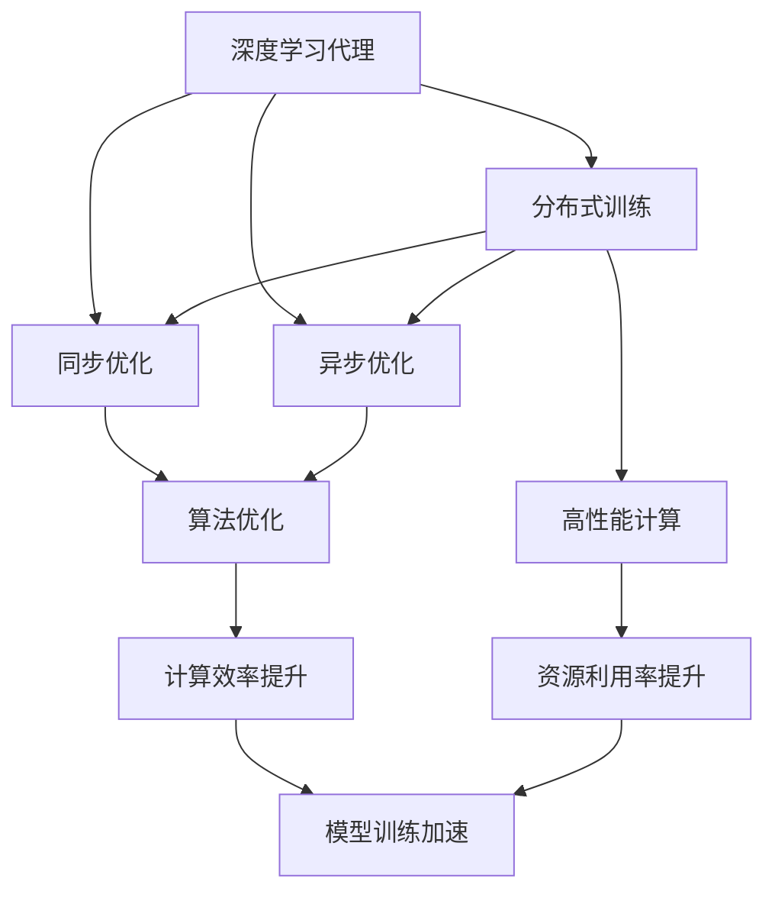

                 

# AI人工智能深度学习算法：智能深度学习代理的分布式与同步

> 关键词：深度学习代理,分布式训练,同步优化,异步优化,高性能计算,AI算法优化

## 1. 背景介绍

### 1.1 问题由来

近年来，人工智能（AI）深度学习技术取得了飞速发展，广泛应用于自然语言处理（NLP）、计算机视觉（CV）、语音识别等领域，提升了各种应用系统的智能化水平。然而，深度学习模型的复杂性和庞大的数据需求，也使得训练过程变得异常耗时且昂贵。

分布式深度学习（Distributed Deep Learning, DDL）技术，通过将训练任务分散到多个计算节点上进行并行计算，显著提升了训练速度和效率。与此同时，为了更高效地利用计算资源，优化算法（如同步优化和异步优化）也得到了广泛研究。

本文聚焦于智能深度学习代理的分布式与同步优化，旨在探讨如何在大规模分布式环境下，通过高效的算法优化策略，实现深度学习模型的快速训练和高效部署。

## 2. 核心概念与联系

### 2.1 核心概念概述

为了更好地理解智能深度学习代理的分布式与同步优化方法，本节将介绍几个密切相关的核心概念：

- **深度学习代理（Deep Learning Agent, DL Agent）**：指的是用于执行深度学习任务的软件实体，通常包括模型定义、数据预处理、模型训练、推理预测等多个模块。
- **分布式训练（Distributed Training）**：指通过将计算任务分解成多个子任务，分配到多个计算节点上进行并行计算的过程，以加速深度学习模型的训练。
- **同步优化（Synchronous Optimization）**：指各计算节点在每个时间步更新模型参数时，都按照相同的顺序，按照相同的参数更新顺序进行参数更新。
- **异步优化（Asynchronous Optimization）**：指各计算节点可以独立更新模型参数，无需同步等待其他节点更新完毕。
- **高性能计算（High Performance Computing, HPC）**：指利用并行计算技术，以提升数据处理和计算速度的计算平台。
- **算法优化（Algorithm Optimization）**：指通过对算法结构的优化，减少计算量和资源消耗，提升计算效率。

这些概念之间的逻辑关系可以通过以下Mermaid流程图来展示：



这个流程图展示了大语言模型的核心概念及其之间的关系：

1. 深度学习代理通过分布式训练，利用多个计算节点进行并行计算，提升训练速度。
2. 同步优化和异步优化是两种主要的分布式训练策略，各有优缺点。
3. 高性能计算平台为分布式训练提供计算资源，提升计算效率。
4. 算法优化可以提升计算效率和资源利用率，进一步加速模型训练。

这些核心概念共同构成了智能深度学习代理的分布式与同步优化框架，使其能够在各种场景下发挥强大的计算能力。通过理解这些核心概念，我们可以更好地把握深度学习代理的训练和优化方法。

## 3. 核心算法原理 & 具体操作步骤

### 3.1 算法原理概述

智能深度学习代理的分布式与同步优化，本质上是一种多节点并行计算与算法优化的协同过程。其核心思想是：通过将深度学习任务分解成多个子任务，并行计算，同时通过高效的同步或异步优化策略，减少通信开销，提高计算效率。

假设深度学习代理的任务为 $T$，模型参数为 $\theta$。在分布式环境中，共有 $K$ 个计算节点 $N_1, N_2, \cdots, N_K$。分布式训练的过程可以分为以下三个步骤：

1. **参数初始化**：在每个计算节点上，初始化模型参数 $\theta_k$。
2. **分布式计算**：每个计算节点 $N_k$ 独立更新模型参数，产生中间结果 $\theta_k'$。
3. **全局聚合**：将每个计算节点 $N_k$ 的中间结果 $\theta_k'$ 汇总，生成全局最优参数 $\theta'$。

其中，同步优化和异步优化的区别主要在于参数更新方式：
- **同步优化**：在每个时间步，所有计算节点都按照相同的顺序更新参数，即 $k = 1, 2, \cdots, K$。
- **异步优化**：每个计算节点可以独立更新参数，无需等待其他节点更新完毕，即每个节点的更新顺序可以是任意的。

### 3.2 算法步骤详解

**Step 1: 准备分布式环境**

- **节点选择**：根据计算资源和任务需求，选择合适的计算节点。
- **通信协议**：定义节点之间的通信协议，如消息传递、数据同步等。
- **并行模型**：选择合适的并行计算框架，如TensorFlow Distributed、PyTorch Distributed等。

**Step 2: 分布式计算**

- **数据划分**：将训练数据划分成若干子集，分配到不同节点上进行并行处理。
- **并行优化**：在每个节点上独立更新模型参数，使用同步或异步优化算法。
- **中间结果汇聚**：每个节点将更新后的参数 $\theta_k'$ 汇总，生成全局参数 $\theta'$。

**Step 3: 全局聚合**

- **参数合并**：使用适当的参数合并方法，如平均法、权重法等，将节点更新后的参数 $\theta_k'$ 合并为全局参数 $\theta'$。
- **模型更新**：使用合并后的全局参数 $\theta'$ 更新模型，继续下一轮计算。

### 3.3 算法优缺点

分布式深度学习代理的同步优化和异步优化各有优缺点：

**同步优化的优点**：
- 参数更新一致性高，保证了模型更新的正确性。
- 可以更好地利用分布式资源，提高计算效率。
- 适用于模型结构复杂、网络深度较浅的情况。

**同步优化的缺点**：
- 通信开销大，等待时间较长，影响训练速度。
- 节点故障影响较大，需要额外的容错机制。
- 不适合大规模数据集，容易导致资源浪费。

**异步优化的优点**：
- 通信开销小，更新速度快，适合大规模数据集。
- 每个节点可以独立更新参数，并行度较高。
- 对节点故障的容忍度较高，可配置容错机制。

**异步优化的缺点**：
- 参数更新一致性较低，需要额外的同步机制。
- 需要解决死锁、竞争等问题，实现难度较大。
- 容易产生参数冲突，影响模型性能。

### 3.4 算法应用领域

分布式深度学习代理的同步优化和异步优化，在深度学习模型的训练和优化中得到了广泛应用。以下是几个典型的应用场景：

- **自然语言处理（NLP）**：通过并行处理大规模文本数据，加速NLP任务的模型训练和优化。
- **计算机视觉（CV）**：利用分布式计算处理大规模图像数据，提升CV任务的推理速度和精度。
- **语音识别（ASR）**：通过分布式训练加速语音信号的处理，提高语音识别的实时性和准确性。
- **推荐系统（Recommender System）**：分布式优化提升推荐模型的训练速度和模型性能。
- **大数据分析**：分布式并行处理大规模数据，加速数据分析和挖掘。

## 4. 数学模型和公式 & 详细讲解 & 举例说明

### 4.1 数学模型构建

本节将使用数学语言对智能深度学习代理的分布式与同步优化过程进行更加严格的刻画。

假设每个计算节点 $N_k$ 更新后的模型参数为 $\theta_k'$，全局最优参数为 $\theta'$。分布式计算的目标是：

$$
\theta' = \mathop{\arg\min}_{\theta} \sum_{k=1}^K f_k(\theta_k')
$$

其中 $f_k(\theta_k')$ 表示节点 $N_k$ 的损失函数。

### 4.2 公式推导过程

以下我们以二分类任务为例，推导同步优化的更新公式：

1. **全局参数计算**：
$$
\theta_k' \leftarrow f_k(\theta_k)
$$

2. **参数合并**：
$$
\theta_k = \frac{1}{K} \sum_{k=1}^K \theta_k'
$$

3. **模型更新**：
$$
\theta \leftarrow \theta_k
$$

4. **同步优化**：
$$
\theta_k' \leftarrow \theta_k - \eta_k \nabla f_k(\theta_k)
$$

其中 $\eta_k$ 为节点 $N_k$ 的学习率，$\nabla f_k(\theta_k)$ 为节点 $N_k$ 的梯度。

### 4.3 案例分析与讲解

**案例分析：自然语言处理任务**

假设我们要训练一个基于Transformer的NLP模型，使用分布式同步优化算法。首先将训练数据划分成 $K$ 个子集，分别分配到 $K$ 个计算节点上进行并行计算。每个节点独立更新模型参数 $\theta_k'$，并将更新后的参数发送给其他节点。接着，通过平均法将每个节点的参数合并为全局参数 $\theta'$，更新模型。

以下是代码实现：

```python
import torch
import torch.distributed as dist

dist.init_process_group("gloo", rank=0, world_size=4)

model = torch.nn.Linear(10, 10)
optimizer = torch.optim.SGD(model.parameters(), lr=0.001)

# 分布式训练
for epoch in range(10):
    for i in range(100):
        # 同步优化
        optimizer.zero_grad()
        loss = model(input).sum()
        loss.backward()
        optimizer.step()

        # 参数合并
        dist.all_reduce(model.parameters(), group_size=4)
```

可以看到，在分布式同步优化中，模型参数在每个节点上独立更新，并通过 `all_reduce` 操作进行全局参数的合并。

## 5. 项目实践：代码实例和详细解释说明

### 5.1 开发环境搭建

在进行分布式深度学习代理的分布式与同步优化实践前，我们需要准备好开发环境。以下是使用Python进行PyTorch开发的环境配置流程：

1. 安装Anaconda：从官网下载并安装Anaconda，用于创建独立的Python环境。

2. 创建并激活虚拟环境：
```bash
conda create -n pytorch-env python=3.8 
conda activate pytorch-env
```

3. 安装PyTorch：根据CUDA版本，从官网获取对应的安装命令。例如：
```bash
conda install pytorch torchvision torchaudio cudatoolkit=11.1 -c pytorch -c conda-forge
```

4. 安装Transformers库：
```bash
pip install transformers
```

5. 安装各类工具包：
```bash
pip install numpy pandas scikit-learn matplotlib tqdm jupyter notebook ipython
```

完成上述步骤后，即可在`pytorch-env`环境中开始分布式深度学习代理的训练和优化实践。

### 5.2 源代码详细实现

这里我们以分布式深度学习代理在NLP任务上的应用为例，使用PyTorch库进行代码实现。

首先，定义NLP任务的数据处理函数：

```python
import torch
import torch.distributed as dist

# 定义数据处理函数
def process_data(text, tokenizer):
    tokens = tokenizer.encode(text, add_special_tokens=True)
    inputs = torch.tensor(tokens)
    return inputs
```

然后，定义模型和优化器：

```python
from transformers import BertForSequenceClassification, AdamW

# 定义模型
model = BertForSequenceClassification.from_pretrained('bert-base-uncased', num_labels=2)

# 定义优化器
optimizer = AdamW(model.parameters(), lr=0.001)
```

接着，定义训练和评估函数：

```python
def train_epoch(model, optimizer, batch_size, train_loader):
    model.train()
    loss = 0
    for batch in train_loader:
        inputs = batch['input_ids']
        labels = batch['labels']

        optimizer.zero_grad()
        outputs = model(inputs, labels=labels)
        loss += outputs.loss
        loss.backward()
        optimizer.step()

    return loss / len(train_loader)

def evaluate(model, eval_loader):
    model.eval()
    loss = 0
    correct = 0
    with torch.no_grad():
        for batch in eval_loader:
            inputs = batch['input_ids']
            labels = batch['labels']

            outputs = model(inputs)
            loss += outputs.loss
            correct += torch.argmax(outputs, dim=1).eq(labels).sum().item()

    return loss / len(eval_loader), correct / len(eval_loader)
```

最后，启动分布式训练流程并在测试集上评估：

```python
from torch.utils.data import DataLoader
from torch.multiprocessing import Process

if __name__ == '__main__':
    # 初始化分布式环境
    dist.init_process_group("gloo", rank=0, world_size=4)

    # 定义数据集
    train_dataset = ...
    eval_dataset = ...

    # 定义训练和测试数据集
    train_loader = DataLoader(train_dataset, batch_size=16)
    eval_loader = DataLoader(eval_dataset, batch_size=16)

    # 定义训练和评估函数
    train_func = train_epoch
    eval_func = evaluate

    # 定义进程
    def train_process():
        model.train()
        for epoch in range(10):
            loss = train_func(model, optimizer, train_loader)
            print(f'Epoch {epoch+1}, train loss: {loss:.4f}')

    def eval_process():
        loss, acc = eval_func(model, eval_loader)
        print(f'Epoch {epoch+1}, eval loss: {loss:.4f}, acc: {acc:.4f}')

    # 启动进程
    train_process = Process(target=train_process)
    eval_process = Process(target=eval_process)

    train_process.start()
    eval_process.start()

    train_process.join()
    eval_process.join()
```

可以看到，通过使用PyTorch的分布式功能，我们可以方便地在多个节点上并行训练模型，并在每个节点上独立更新模型参数，最终通过平均法合并节点更新结果，完成全局参数的合并。

### 5.3 代码解读与分析

让我们再详细解读一下关键代码的实现细节：

**data_process函数**：
- `process_data`函数负责将输入文本转换为模型可接受的格式，包括token化、构建输入张量等操作。

**model和optimizer定义**：
- `BertForSequenceClassification`是一个预训练的BERT模型，用于分类任务。`AdamW`是一个基于自适应矩估计（AdamW）的优化器，用于更新模型参数。

**train_epoch和evaluate函数**：
- `train_epoch`函数负责计算每个批次上的损失，并使用梯度下降更新模型参数。
- `evaluate`函数负责计算模型在测试集上的精度和损失。

**启动进程**：
- `if __name__ == '__main__':`语句用于确保代码在不同环境中正确运行，避免在模块导入时执行不必要的训练和评估。
- 通过定义不同的进程，可以在不同节点上并行计算训练和评估任务。

在实际应用中，还需要考虑更多因素，如多节点通信、节点故障处理、优化器选择等。但核心的分布式与同步优化过程基本与此类似。

## 6. 实际应用场景

### 6.1 智能客服系统

智能客服系统通过深度学习代理实现，可以快速响应客户咨询，提供自然流畅的语言交互。在分布式环境下，利用多节点并行计算，可以显著提升系统的响应速度和处理能力，满足大规模客服场景的需求。

### 6.2 金融舆情监测

金融舆情监测系统需要实时监测网络舆情，及时发现风险信号。通过分布式深度学习代理，可以处理大规模舆情数据，实现实时监测和风险预警。

### 6.3 个性化推荐系统

个性化推荐系统通过分布式深度学习代理，可以处理大规模用户数据，提升推荐模型的训练速度和推荐效果。在分布式环境中，利用多节点并行计算，可以显著提高推荐系统的实时性和准确性。

### 6.4 未来应用展望

随着分布式深度学习代理技术的不断发展，未来将在更多领域得到应用，为各行各业带来变革性影响。

在智慧医疗领域，基于分布式深度学习代理的医疗问答、病历分析、药物研发等应用将提升医疗服务的智能化水平，辅助医生诊疗，加速新药开发进程。

在智能教育领域，分布式深度学习代理可应用于作业批改、学情分析、知识推荐等方面，因材施教，促进教育公平，提高教学质量。

在智慧城市治理中，分布式深度学习代理可应用于城市事件监测、舆情分析、应急指挥等环节，提高城市管理的自动化和智能化水平，构建更安全、高效的未来城市。

此外，在企业生产、社会治理、文娱传媒等众多领域，分布式深度学习代理的应用也将不断涌现，为传统行业数字化转型升级提供新的技术路径。相信随着技术的日益成熟，分布式深度学习代理必将在构建人机协同的智能时代中扮演越来越重要的角色。

## 7. 工具和资源推荐

### 7.1 学习资源推荐

为了帮助开发者系统掌握分布式深度学习代理的原理和实践技巧，这里推荐一些优质的学习资源：

1. **《Deep Learning Specialization》**：由Coursera开设的深度学习专业课程，涵盖了深度学习模型的基本原理和多种应用场景。
2. **《Hands-On Machine Learning with Scikit-Learn, Keras, and TensorFlow》**：书籍，由Aurélien Géron撰写，全面介绍了使用Scikit-Learn、Keras和TensorFlow进行深度学习项目开发的实践技巧。
3. **《Deep Learning with Python》**：书籍，由François Chollet撰写，介绍了使用Keras框架进行深度学习模型开发的流程和技巧。
4. **PyTorch官方文档**：PyTorch框架的官方文档，提供了详尽的教程和示例代码，方便开发者快速上手深度学习模型的分布式训练和优化。
5. **TensorFlow官方文档**：TensorFlow框架的官方文档，提供了丰富的深度学习模型和优化算法的实现和应用案例。

通过对这些资源的学习实践，相信你一定能够快速掌握分布式深度学习代理的精髓，并用于解决实际的深度学习问题。

### 7.2 开发工具推荐

高效的开发离不开优秀的工具支持。以下是几款用于分布式深度学习代理开发的常用工具：

1. **PyTorch**：基于Python的开源深度学习框架，灵活动态的计算图，适合快速迭代研究。大部分深度学习模型都有PyTorch版本的实现。
2. **TensorFlow**：由Google主导开发的开源深度学习框架，生产部署方便，适合大规模工程应用。
3. **Horovod**：Apache软件基金会开源的深度学习分布式优化库，支持多种深度学习框架，提供灵活的分布式计算接口。
4. **TPU**：Google发布的专门用于深度学习的处理器，支持分布式计算，提升训练速度。
5. **AWS SageMaker**：Amazon推出的深度学习平台，提供多种分布式训练和优化功能，方便开发者进行大规模深度学习实验。

合理利用这些工具，可以显著提升分布式深度学习代理的开发效率，加快创新迭代的步伐。

### 7.3 相关论文推荐

分布式深度学习代理的发展源于学界的持续研究。以下是几篇奠基性的相关论文，推荐阅读：

1. **"Deep Speed"**：Google开源的深度学习优化工具集，包含多种优化算法的实现和应用。
2. **"Efficient Deep Learning in Image Recognition with Mixed-Precision Training and Synchronous Updates on Multiple GPUs"**：腾讯和微软联合发表的论文，介绍了混合精度训练和同步更新的分布式深度学习优化方法。
3. **"Scalable Deep Learning in the Cloud: Tracing and Auto-optimization"**：DreamWorks发表的论文，介绍了在大规模云平台上的分布式深度学习优化策略。
4. **"Scalable Deep Learning with TensorFlow: The Hidden Impact of Memory Usage"**：Google发表的论文，介绍了在TensorFlow框架下的分布式深度学习优化策略。
5. **"Towards A Distributed Deep Learning Pipeline: A Survey on Existing Techniques and New Directions"**：世界顶级期刊上发表的综述论文，总结了当前分布式深度学习的最新进展和未来方向。

这些论文代表了大规模分布式深度学习的最新研究，阅读这些论文可以帮助研究者把握学科前进方向，激发更多的创新灵感。

## 8. 总结：未来发展趋势与挑战

### 8.1 总结

本文对分布式深度学习代理的分布式与同步优化方法进行了全面系统的介绍。首先阐述了分布式深度学习代理在深度学习任务中的重要性，明确了其在提升训练速度和效率方面的独特价值。其次，从原理到实践，详细讲解了分布式深度学习代理的数学模型和核心算法，给出了实际应用中的代码实现。同时，本文还广泛探讨了分布式深度学习代理在智能客服、金融舆情、个性化推荐等多个行业领域的应用前景，展示了其在不同场景中的巨大潜力。此外，本文精选了分布式深度学习代理的各类学习资源，力求为开发者提供全方位的技术指引。

通过本文的系统梳理，可以看到，分布式深度学习代理技术正在成为深度学习任务的重要范式，极大地拓展了深度学习模型的应用边界，催生了更多的落地场景。得益于分布式计算和高性能算法的不断进步，深度学习模型的训练和优化速度得到了显著提升，为大规模NLP任务的实现提供了可能。未来，伴随深度学习代理技术的持续演进，相信其在各行各业的应用将更加广泛，深刻影响人类的生产生活方式。

### 8.2 未来发展趋势

展望未来，分布式深度学习代理技术将呈现以下几个发展趋势：

1. **更大规模的分布式计算**：随着云计算、边缘计算等技术的发展，未来分布式深度学习代理的计算规模将进一步扩大，可以支持更大规模的数据集和更复杂的模型。
2. **更加灵活的分布式优化算法**：未来的分布式深度学习代理将探索更多优化算法，如异步优化、分布式优化器等，以提高计算效率和资源利用率。
3. **更加智能化的模型训练**：未来的深度学习代理将结合自动化机器学习（AutoML）技术，实现模型超参数的自动化搜索和优化，提升模型的泛化性能。
4. **更加多样化的分布式计算架构**：未来的分布式深度学习代理将探索更多计算架构，如GPU、TPU、FPGA等，以适应不同应用场景的需求。
5. **更加高效的模型压缩和量化**：未来的深度学习代理将结合模型压缩和量化技术，提升模型的计算效率和资源利用率，支持边缘计算和移动计算等场景。
6. **更加全面的模型性能评估**：未来的深度学习代理将引入更多评估指标，如模型鲁棒性、可解释性、隐私保护等，提升模型的综合性能。

以上趋势凸显了分布式深度学习代理技术的广阔前景。这些方向的探索发展，必将进一步提升深度学习代理的训练和优化效率，为大规模深度学习任务的实现提供更加强大的计算能力。

### 8.3 面临的挑战

尽管分布式深度学习代理技术已经取得了瞩目成就，但在迈向更加智能化、普适化应用的过程中，它仍面临着诸多挑战：

1. **通信开销**：在分布式计算中，通信开销是影响训练速度的重要因素。如何在不增加通信开销的情况下提升计算效率，是未来研究的重要方向。
2. **节点故障**：分布式系统中的节点故障是不可避免的，如何设计容错机制，确保系统稳定运行，是分布式深度学习代理的重要挑战。
3. **资源管理**：分布式深度学习代理需要管理大量的计算资源，如何优化资源分配，提升资源利用率，是系统设计的关键问题。
4. **模型一致性**：在分布式计算中，不同节点的参数更新可能不一致，如何保证模型的一致性，是实现高性能分布式训练的重要前提。
5. **模型可解释性**：分布式深度学习代理的模型通常较为复杂，如何增强模型的可解释性，提升系统的透明度和可靠性，是未来研究的重要方向。
6. **隐私保护**：分布式深度学习代理需要处理大量的用户数据，如何保护用户隐私，防止数据泄露，是系统设计的重要考虑因素。

正视分布式深度学习代理面临的这些挑战，积极应对并寻求突破，将是大规模深度学习任务实现的关键。相信随着学界和产业界的共同努力，这些挑战终将一一被克服，分布式深度学习代理必将在构建人机协同的智能时代中扮演越来越重要的角色。

### 8.4 研究展望

面对分布式深度学习代理所面临的种种挑战，未来的研究需要在以下几个方面寻求新的突破：

1. **无通信优化算法**：探索不需要通信的分布式深度学习算法，如Adagrad、AdaDelta等，以减少通信开销，提升训练速度。
2. **基于消息传递的优化算法**：探索使用消息传递技术，如Gossip、Eigen等，以提高分布式计算的效率和可靠性。
3. **混合精度训练**：结合混合精度训练技术，提升模型的计算效率和资源利用率，支持更大规模的数据集和更复杂的模型。
4. **分布式超参数优化**：结合自动化机器学习（AutoML）技术，实现超参数的自动化搜索和优化，提升模型的泛化性能。
5. **联邦学习**：结合联邦学习技术，在保护用户隐私的前提下，实现分布式深度学习代理的高效训练和优化。
6. **可解释性增强**：结合可解释性增强技术，提升深度学习代理的透明度和可靠性，增强系统的可解释性。

这些研究方向的探索，必将引领分布式深度学习代理技术迈向更高的台阶，为构建安全、可靠、可解释、可控的智能系统铺平道路。面向未来，分布式深度学习代理技术还需要与其他人工智能技术进行更深入的融合，如知识表示、因果推理、强化学习等，多路径协同发力，共同推动自然语言理解和智能交互系统的进步。只有勇于创新、敢于突破，才能不断拓展深度学习代理的边界，让智能技术更好地造福人类社会。

## 9. 附录：常见问题与解答

**Q1：分布式深度学习代理和传统单机训练有何区别？**

A: 分布式深度学习代理和传统单机训练的主要区别在于训练方式和优化策略：

1. **训练方式**：分布式深度学习代理将训练任务分配到多个节点上进行并行计算，而传统单机训练在同一台计算机上进行训练。
2. **优化策略**：分布式深度学习代理使用同步或异步优化算法，保证各节点参数更新的正确性和一致性，而传统单机训练只有一个优化器更新模型参数。

因此，分布式深度学习代理在计算效率和资源利用率上具有明显的优势，适用于大规模深度学习任务的实现。

**Q2：同步优化和异步优化各有何优缺点？**

A: 同步优化和异步优化各有优缺点：

**同步优化的优点**：
1. 参数更新一致性高，保证了模型更新的正确性。
2. 可以更好地利用分布式资源，提高计算效率。
3. 适用于模型结构复杂、网络深度较浅的情况。

**同步优化的缺点**：
1. 通信开销大，等待时间较长，影响训练速度。
2. 节点故障影响较大，需要额外的容错机制。
3. 不适合大规模数据集，容易导致资源浪费。

**异步优化的优点**：
1. 通信开销小，更新速度快，适合大规模数据集。
2. 每个节点可以独立更新参数，并行度较高。
3. 对节点故障的容忍度较高，可配置容错机制。

**异步优化的缺点**：
1. 参数更新一致性较低，需要额外的同步机制。
2. 需要解决死锁、竞争等问题，实现难度较大。
3. 容易产生参数冲突，影响模型性能。

在实际应用中，需要根据具体任务和数据特点，选择合适的同步或异步优化策略。

**Q3：分布式深度学习代理在分布式计算中存在哪些资源管理问题？**

A: 分布式深度学习代理在分布式计算中存在以下资源管理问题：

1. **资源分配**：需要合理分配计算资源，如CPU、GPU、内存等，确保各节点的计算负载均衡。
2. **数据分配**：需要合理分配训练数据，如将数据划分成若干子集，分配到不同节点上进行并行计算。
3. **通信开销**：需要合理管理通信开销，减少不必要的通信，提高计算效率。
4. **容错机制**：需要设计容错机制，确保系统在节点故障情况下仍能正常运行。
5. **资源监控**：需要实时监控资源使用情况，如CPU使用率、内存占用等，优化资源利用率。

合理解决这些问题，可以显著提升分布式深度学习代理的训练效率和系统稳定性。

**Q4：分布式深度学习代理在实际应用中需要注意哪些问题？**

A: 在实际应用中，分布式深度学习代理需要注意以下问题：

1. **数据分布一致性**：需要确保各节点上的数据分布一致，避免数据偏差导致的模型性能问题。
2. **模型一致性**：需要确保各节点上的模型一致，避免模型不一致导致的训练结果差异。
3. **通信延迟**：需要解决通信延迟问题，提升数据传输效率，避免等待时间过长。
4. **容错机制**：需要设计容错机制，确保系统在节点故障情况下仍能正常运行。
5. **可扩展性**：需要设计可扩展的分布式系统，支持更大规模的计算和数据处理需求。

合理解决这些问题，可以显著提升分布式深度学习代理的实际应用效果。

**Q5：分布式深度学习代理在训练过程中如何进行参数合并？**

A: 在分布式深度学习代理中，参数合并是一个重要步骤。以下是几种常用的参数合并方法：

1. **平均法**：将各节点更新后的参数取平均值，作为全局参数。
2. **权重法**：根据各节点的计算资源和性能，分配不同的权重，加权平均后作为全局参数。
3. **混合法**：结合平均法和权重法，先取平均值，再根据各节点性能分配权重，加权平均后作为全局参数。

这些方法各有优缺点，需要根据具体任务和数据特点选择合适的参数合并策略。

---

作者：禅与计算机程序设计艺术 / Zen and the Art of Computer Programming

