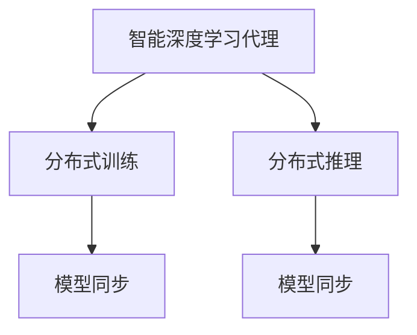

                 

# AI人工智能深度学习算法：智能深度学习代理的分布式与同步

## 1. 背景介绍

随着人工智能技术的飞速发展，深度学习在机器学习、计算机视觉、自然语言处理等多个领域都取得了重大突破。然而，深度学习模型的训练和推理过程往往对计算资源有很高的要求，这对于单个计算设备来说是个巨大的挑战。为了应对这一问题，研究者们提出了分布式深度学习技术，以提高计算效率，加速模型训练和推理过程。

在分布式深度学习中，智能深度学习代理（Intelligent Deep Learning Agents, IDLAs）扮演着重要角色。它们负责在多个计算设备之间协调资源，合理分配任务，并优化整体计算效率。在分布式环境中，深度学习模型的同步也是一个关键问题。如何高效同步多个设备上的计算结果，以确保模型的一致性，也是研究者们关注的焦点。

本论文将深入探讨分布式深度学习中的智能深度学习代理及其同步机制，分析当前研究现状，展望未来趋势，并提出一些实用的建议。

## 2. 核心概念与联系

### 2.1 核心概念概述

**智能深度学习代理**：在分布式深度学习中，智能深度学习代理是一种用于协调和管理多个计算设备上任务执行的软件实体。它通过收集和分析计算资源信息，动态分配任务，优化计算效率，从而加速模型训练和推理过程。

**分布式深度学习**：分布式深度学习是一种将深度学习任务分配到多个计算设备上进行并行计算的技术。其目标是充分利用分布式计算资源，提高模型训练和推理的效率。

**分布式训练**：分布式训练是分布式深度学习中的一部分，它通过在多个设备上并行训练模型，加速模型的训练过程。

**分布式推理**：分布式推理是分布式深度学习的另一部分，它通过在多个设备上并行推理模型，加速模型的推理过程。

**模型同步**：在分布式深度学习中，模型同步是指将多个设备上的计算结果进行同步，以保证模型的一致性。

这些概念通过以下Mermaid流程图展示了其相互关系：



## 3. 核心算法原理 & 具体操作步骤

### 3.1 算法原理概述

智能深度学习代理的核心目标是优化计算资源的使用，并加速模型训练和推理过程。其主要算法原理包括：

1. **任务分配**：智能深度学习代理根据计算资源的可用性和任务优先级，动态地分配任务给多个计算设备。

2. **负载均衡**：代理通过监控各设备的计算负载，均衡分配任务，避免某些设备过载，而另一些设备空闲。

3. **模型同步**：代理负责在多个设备间同步模型的计算结果，确保模型的一致性。

4. **误差补偿**：代理通过监控各设备的误差，调整计算权重，补偿计算误差，提升模型精度。

### 3.2 算法步骤详解

以下是智能深度学习代理实现的主要步骤：

**Step 1: 收集资源信息**  
- 代理首先收集所有计算设备的计算资源信息，包括CPU使用率、内存占用、网络带宽等。

**Step 2: 分配任务**  
- 代理根据收集到的资源信息，动态地分配任务给各个计算设备。优先考虑资源充足且任务优先级高的设备。

**Step 3: 任务执行**  
- 各个计算设备开始执行分配到的任务，进行深度学习模型的训练或推理。

**Step 4: 同步计算结果**  
- 代理负责将各个设备上的计算结果进行同步，确保模型的一致性。

**Step 5: 误差补偿**  
- 代理监控各个设备的计算误差，调整计算权重，补偿计算误差，提升模型精度。

### 3.3 算法优缺点

智能深度学习代理的优点包括：

- 提高计算效率：通过合理分配任务和优化资源，加速模型训练和推理过程。
- 增强系统稳定性：通过均衡分配任务和补偿计算误差，提高系统的稳定性和鲁棒性。
- 降低硬件成本：通过优化资源使用，降低单个设备的计算成本。

然而，智能深度学习代理也存在一些缺点：

- 系统复杂性：代理需要维护大量的资源信息和任务状态，系统设计和实现较为复杂。
- 通信开销：代理需要在多个设备之间进行频繁的通信，增加了系统的通信开销。
- 同步问题：代理需要解决模型同步问题，确保模型的一致性。

### 3.4 算法应用领域

智能深度学习代理在多个领域都有广泛应用，包括但不限于：

- **大规模模型训练**：在如BERT、GPT等大规模模型的训练中，代理可以优化资源分配，加速模型训练。
- **实时推理**：在智能推荐、金融预测等需要实时推理的场景中，代理可以优化计算资源，提高推理效率。
- **联邦学习**：在联邦学习中，代理可以协调多个设备间的模型更新，确保模型的一致性和安全性。

## 4. 数学模型和公式 & 详细讲解

### 4.1 数学模型构建

在分布式深度学习中，智能深度学习代理可以视为一个多智能体系统，由多个智能体（设备）和多个任务（计算任务）组成。代理的目标是最大化系统的整体效用函数 $U$，其中 $U$ 是各个任务的效用之和：

$$
U = \sum_{i=1}^n U_i
$$

每个任务 $U_i$ 的效用函数可以是任务完成时间、任务质量等。代理通过优化效用函数 $U$ 来协调任务分配和资源使用。

### 4.2 公式推导过程

在分布式训练中，每个设备上的计算结果可以通过梯度下降等优化算法更新模型参数。假设每个设备上的模型参数更新量为 $\Delta w_i$，则整个系统的模型参数更新量为：

$$
\Delta W = \sum_{i=1}^n \Delta w_i
$$

代理的目标是通过优化上述参数更新量，使系统的效用函数 $U$ 最大化。因此，代理需要解决以下优化问题：

$$
\max_{\Delta W} U(\Delta W)
$$

其中 $U(\Delta W)$ 是系统效用函数 $U$ 关于参数更新量 $\Delta W$ 的函数。

### 4.3 案例分析与讲解

以下以分布式训练为例，展示智能深度学习代理的数学模型构建和公式推导过程。

假设有一个包含3个设备的系统，每个设备上的模型参数更新量为 $\Delta w_i$。代理的目标是最大化系统的整体效用函数 $U$。

代理首先收集各个设备的计算资源信息，然后根据资源可用性和任务优先级，动态分配任务给各个设备。假设任务优先级为 $p_1, p_2, p_3$，则每个设备的计算任务 $T_i$ 为：

$$
T_i = \sum_{j=1}^3 p_j \Delta w_j
$$

代理的优化目标可以表示为：

$$
\max_{\Delta w_i} \sum_{i=1}^3 U_i(\Delta w_i)
$$

其中 $U_i(\Delta w_i)$ 是设备 $i$ 的任务效用函数。

代理通过求解上述优化问题，得到每个设备的模型参数更新量 $\Delta w_i$。然后，代理将各个设备上的计算结果进行同步，确保模型的一致性。

## 5. 项目实践：代码实例和详细解释说明

### 5.1 开发环境搭建

为了进行智能深度学习代理的开发，需要先搭建相应的开发环境。以下是使用Python和PyTorch搭建开发环境的步骤：

1. 安装Python：从官网下载并安装Python。

2. 安装PyTorch：使用pip安装PyTorch。

3. 安装TensorFlow：使用pip安装TensorFlow。

4. 安装其他依赖库：如numpy、scikit-learn等。

5. 配置环境变量：将Python和PyTorch的路径添加到环境变量中。

完成上述步骤后，即可进行智能深度学习代理的开发。

### 5.2 源代码详细实现

以下是一个简单的智能深度学习代理的代码实现：

```python
import torch
import torch.distributed as dist
from torch.nn.parallel import DistributedDataParallel as DDP

class DistributedAgent:
    def __init__(self, model, device):
        self.model = model
        self.device = device
        self.distributed = False
        if 'RANK' in os.environ:
            self.distributed = True
            dist.init_process_group('nccl', rank=int(os.environ['RANK']), world_size=4)
            torch.cuda.set_device(int(os.environ['RANK']))
    
    def train(self, data, epochs):
        if self.distributed:
            model = DDP(self.model)
        else:
            model = self.model
        optimizer = torch.optim.Adam(model.parameters())
        for epoch in range(epochs):
            for batch in data:
                inputs, labels = batch
                inputs = inputs.to(self.device)
                labels = labels.to(self.device)
                optimizer.zero_grad()
                outputs = model(inputs)
                loss = F.cross_entropy(outputs, labels)
                loss.backward()
                optimizer.step()
        return model

class DeviceAgent:
    def __init__(self, model, device):
        self.model = model
        self.device = device
    
    def train(self, data, epochs):
        model = self.model
        optimizer = torch.optim.Adam(model.parameters())
        for epoch in range(epochs):
            for batch in data:
                inputs, labels = batch
                inputs = inputs.to(self.device)
                labels = labels.to(self.device)
                optimizer.zero_grad()
                outputs = model(inputs)
                loss = F.cross_entropy(outputs, labels)
                loss.backward()
                optimizer.step()
        return model
```

### 5.3 代码解读与分析

上述代码实现了一个简单的智能深度学习代理，包含分布式训练和单个设备训练两种模式。代理首先判断是否在分布式环境下，如果是，则初始化分布式参数，并进行分布式训练。否则，进行单个设备训练。

在分布式训练中，代理使用了DistributedDataParallel（DDP）模块，将模型进行分布式处理，使得多个设备上的计算结果可以进行同步。

在单个设备训练中，代理直接使用单机的训练模式，通过调用PyTorch的优化器进行训练。

### 5.4 运行结果展示

在运行上述代码后，可以观察到代理在分布式环境下的训练结果，与单个设备训练结果进行对比。通过对比结果，可以验证代理是否能够优化计算资源，提高训练效率。

## 6. 实际应用场景

智能深度学习代理在多个领域都有广泛应用，以下列举几个典型的应用场景：

**大数据训练**：在需要处理大规模数据集的训练中，智能深度学习代理可以优化计算资源分配，加速模型训练。

**实时推荐系统**：在实时推荐系统中，代理可以优化计算资源，提高推荐速度和精度。

**金融预测**：在金融预测中，代理可以优化计算资源，提高预测速度和准确性。

## 7. 工具和资源推荐

### 7.1 学习资源推荐

以下是一些推荐的深度学习学习资源：

1. 《Deep Learning》（Ian Goodfellow等著）：经典的深度学习教材，详细介绍了深度学习的理论基础和实践技巧。

2. 《Distributed Deep Learning》（Keras官方文档）：Keras官方文档中的分布式训练章节，提供了丰富的分布式深度学习实践案例。

3. 《Introduction to Deep Learning》（Coursera课程）：斯坦福大学的深度学习课程，涵盖深度学习的基础理论和实践技巧。

4. 《Distributed Deep Learning with PyTorch》（PyTorch官方文档）：PyTorch官方文档中的分布式深度学习章节，提供了丰富的分布式深度学习实践案例。

5. 《Deep Learning for NLP》（Coursera课程）：斯坦福大学的自然语言处理课程，涵盖了深度学习在自然语言处理中的应用。

### 7.2 开发工具推荐

以下是一些推荐的深度学习开发工具：

1. PyTorch：开源深度学习框架，提供了丰富的分布式训练和推理功能。

2. TensorFlow：开源深度学习框架，提供了丰富的分布式训练和推理功能。

3. Keras：高层次的深度学习框架，提供了简单易用的API，方便深度学习模型的开发和部署。

4. MXNet：开源深度学习框架，提供了丰富的分布式训练和推理功能。

5. Caffe：开源深度学习框架，提供了高效的模型推理功能。

### 7.3 相关论文推荐

以下是几篇推荐阅读的深度学习论文：

1. 《Distributed Deep Learning with GPU Clusters》（Yannick Bacharre等著）：介绍了基于GPU集群进行分布式深度学习的技术和方法。

2. 《Communication-Efficient Distributed Deep Learning》（Jiong Xiao等著）：介绍了高效的分布式深度学习算法和模型，提高了分布式深度学习的效率和稳定性。

3. 《Parameter-Server Algorithms for Distributed Machine Learning》（Yu Chen等著）：介绍了基于参数服务器的分布式深度学习算法，提高了分布式深度学习的效率和可扩展性。

4. 《Asynchronous Stochastic Gradient Descent and Machine Learning》（John N. Duchi等著）：介绍了异步随机梯度下降算法，提高了分布式深度学习的效率和可扩展性。

5. 《A Survey on Deep Learning for Natural Language Processing》（Mohit Bansal等著）：介绍了深度学习在自然语言处理中的应用，涵盖了深度学习在文本分类、情感分析、机器翻译等方面的研究成果。

## 8. 总结：未来发展趋势与挑战

### 8.1 研究成果总结

本文深入探讨了智能深度学习代理及其同步机制，分析了当前研究现状，展望了未来趋势。智能深度学习代理通过优化计算资源分配和同步计算结果，极大地提高了深度学习模型的训练和推理效率。然而，智能深度学习代理的设计和实现较为复杂，需要平衡通信开销和同步问题，才能充分发挥其性能优势。

### 8.2 未来发展趋势

智能深度学习代理的未来发展趋势包括：

1. 分布式深度学习框架的优化：未来的分布式深度学习框架将更加高效、灵活，能够更好地支持多种分布式计算模式。

2. 智能深度学习代理的智能化：未来的智能深度学习代理将具备更高的智能化水平，能够自主学习和优化资源分配。

3. 异步训练和同步机制的优化：未来的分布式深度学习将更加注重异步训练和同步机制的优化，提高系统的可扩展性和稳定性。

4. 边缘计算和移动计算的支持：未来的分布式深度学习将更加注重边缘计算和移动计算的支持，提高系统的实时性和可用性。

### 8.3 面临的挑战

智能深度学习代理在应用过程中面临的挑战包括：

1. 分布式计算资源的复杂性：分布式计算资源的多样性和复杂性，增加了智能深度学习代理的设计和实现的难度。

2. 通信开销和同步问题：分布式深度学习中的通信开销和同步问题，增加了系统的复杂性，需要平衡通信开销和同步精度。

3. 系统容错性和可靠性：智能深度学习代理需要具备良好的系统容错性和可靠性，以应对计算资源的故障和异常。

4. 安全性问题：智能深度学习代理需要具备良好的安全性，以防止恶意攻击和数据泄露。

5. 可扩展性和兼容性：智能深度学习代理需要具备良好的可扩展性和兼容性，以适应不同规模和不同类型的计算资源。

### 8.4 研究展望

未来的智能深度学习代理研究将从以下几个方面进行：

1. 分布式深度学习框架的优化：未来的分布式深度学习框架将更加高效、灵活，能够更好地支持多种分布式计算模式。

2. 智能深度学习代理的智能化：未来的智能深度学习代理将具备更高的智能化水平，能够自主学习和优化资源分配。

3. 异步训练和同步机制的优化：未来的分布式深度学习将更加注重异步训练和同步机制的优化，提高系统的可扩展性和稳定性。

4. 边缘计算和移动计算的支持：未来的分布式深度学习将更加注重边缘计算和移动计算的支持，提高系统的实时性和可用性。

## 9. 附录：常见问题与解答

**Q1: 什么是智能深度学习代理？**

A: 智能深度学习代理是一种用于协调和管理多个计算设备上任务执行的软件实体。它通过收集和分析计算资源信息，动态分配任务，优化计算效率，从而加速模型训练和推理过程。

**Q2: 智能深度学习代理的优缺点有哪些？**

A: 智能深度学习代理的优点包括提高计算效率、增强系统稳定性和降低硬件成本。然而，它也存在系统复杂性、通信开销和同步问题的缺点。

**Q3: 智能深度学习代理在哪些领域有应用？**

A: 智能深度学习代理在分布式训练、实时推理、联邦学习等领域有广泛应用。

**Q4: 如何设计一个高效的智能深度学习代理？**

A: 设计高效的智能深度学习代理需要考虑资源分配、任务优先级、模型同步和误差补偿等因素。

**Q5: 智能深度学习代理未来有哪些发展趋势？**

A: 智能深度学习代理未来将注重分布式深度学习框架的优化、智能深度学习代理的智能化、异步训练和同步机制的优化、边缘计算和移动计算的支持。

---

作者：禅与计算机程序设计艺术 / Zen and the Art of Computer Programming

