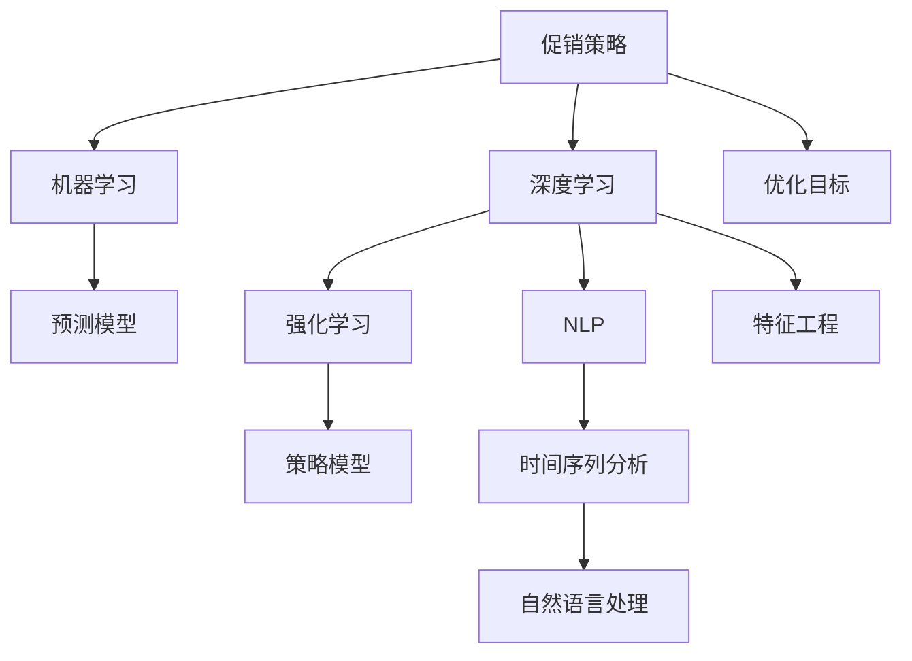

                 

# AI优化促销策略：案例分析与实践

## 1. 背景介绍

### 1.1 问题由来
在当今的商业世界中，促销策略是提高销售额、提升市场份额的重要手段。然而，由于促销活动涉及的变量众多，传统的依靠直觉和经验决策的方式，往往难以制定出最有效的促销方案。AI技术的引入，为优化促销策略提供了新的可能性。通过数据分析、机器学习和深度学习等技术手段，AI可以在复杂多变的环境下，找到最佳的促销方案，实现商业目标的最大化。

### 1.2 问题核心关键点
AI优化促销策略的核心在于将历史销售数据、市场趋势、用户行为、竞争对手信息等多元数据，输入到机器学习模型中，通过学习和预测，自动调整促销活动的设计，以实现最佳效果。具体而言，AI可以：

- 分析历史数据，预测未来销售趋势，确定最佳的促销时机。
- 识别高价值用户群体，定制个性化的促销方案。
- 自动化生成和优化广告内容，提高广告点击率。
- 实时监控和调整促销效果，动态优化促销预算分配。

### 1.3 问题研究意义
优化促销策略的AI技术，对于提升企业的市场竞争力，增加客户满意度和忠诚度，提高运营效率，具有重要意义：

- 提升销售额：通过精准定位和个性化策略，最大化促销效果。
- 提升客户体验：根据用户行为预测需求，提供更符合预期的促销活动。
- 降低成本：通过数据驱动的决策，避免过度投资和资源浪费。
- 增强决策科学性：将复杂决策过程自动化，降低决策风险。
- 快速响应市场变化：实时调整促销策略，适应市场趋势和竞争态势。

## 2. 核心概念与联系

### 2.1 核心概念概述

要深入理解AI优化促销策略，需要了解几个核心概念及其之间的联系：

- **促销策略(促销方案)**：指企业为提高销售而制定的具体行动计划，包括折扣、满减、赠品等。
- **机器学习(ML)**：通过数据驱动的方法，让机器自动学习和优化促销策略的过程。
- **深度学习(DL)**：一种特殊的机器学习，使用神经网络结构，实现对大规模数据的高效处理和分析。
- **强化学习(Reinforcement Learning, RL)**：通过试错和反馈，让机器在特定环境中学习最优策略。
- **自然语言处理(NLP)**：使机器能够理解、处理和生成人类语言的技术。
- **时间序列分析**：研究时间序列数据变化规律的方法，用于预测未来销售趋势。

这些概念之间的逻辑关系可以通过以下Mermaid流程图来展示：



这个流程图展示了大语言模型的核心概念及其之间的关系：

1. 促销策略作为起点，通过多种机器学习技术进行处理和优化。
2. 深度学习用于提取特征，强化学习用于策略调整，NLP用于处理文本信息，时间序列分析用于预测趋势。
3. 机器学习、深度学习和强化学习的结合，形成完整的促销策略优化体系。
4. 自然语言处理和时间序列分析作为重要子任务，支持整体策略优化。

这些概念共同构成了AI优化促销策略的框架，使其能够在各种场景下发挥重要作用。通过理解这些核心概念，我们可以更好地把握AI在促销策略优化中的应用。

## 3. 核心算法原理 & 具体操作步骤
### 3.1 算法原理概述

AI优化促销策略的算法原理，通常基于强化学习的方法，通过试错和反馈，学习最优的促销策略。具体而言，算法会模拟一个虚拟的促销环境，通过不断尝试不同的促销方案，并根据实际销售数据进行奖励和惩罚，逐步优化促销策略。

假设促销策略为 $S$，奖励函数为 $R(S)$，表示策略 $S$ 的回报（如销售额、点击率等）。强化学习算法的目标是找到最优策略 $S^*$，使得：

$$
S^* = \mathop{\arg\min}_{S} \mathcal{L}(R(S))
$$

其中 $\mathcal{L}$ 为损失函数，用于衡量策略 $S$ 的平均回报与预期回报的差距。强化学习算法通过迭代优化，逐步逼近最优策略。

### 3.2 算法步骤详解

AI优化促销策略的核心步骤如下：

**Step 1: 数据准备**
- 收集历史销售数据、用户行为数据、市场趋势数据、竞争对手数据等，构建多源数据融合的数据集。
- 对数据进行清洗、预处理、特征提取，构建模型的输入特征。

**Step 2: 模型选择与训练**
- 根据促销策略的特点，选择合适的模型框架，如基于深度学习的时间序列预测模型，或基于强化学习的策略优化模型。
- 使用历史数据对模型进行训练，通过迭代优化，提高模型预测准确度和策略调整能力。

**Step 3: 策略评估与调整**
- 在新一轮的促销活动中，根据实际销售数据，评估策略的效果。
- 使用奖励函数对策略进行奖励或惩罚，记录学习经验。
- 根据评估结果，对策略进行调整，提高促销效果。

**Step 4: 反馈循环**
- 将评估结果反馈到模型中，调整模型参数，实现动态优化。
- 持续迭代，直到策略达到预定的效果或达到预设的停止条件。

### 3.3 算法优缺点

AI优化促销策略的强化学习范式，具有以下优点：
1. 自动化决策：算法能够自动化地尝试和调整促销策略，减少人工干预。
2. 动态优化：策略可以实时根据市场变化进行调整，提高响应速度。
3. 数据驱动：通过多源数据融合，提供更全面的决策依据。
4. 可扩展性：算法能够适应复杂多变的环境，具有良好的泛化能力。

同时，该方法也存在一定的局限性：
1. 依赖大量高质量数据：模型效果很大程度上取决于数据质量，数据收集和处理成本较高。
2. 策略收敛速度较慢：在复杂环境下，模型可能需要较长的时间才能收敛到最优策略。
3. 策略可解释性不足：强化学习模型的决策过程难以解释，难以调试和优化。

尽管存在这些局限性，但就目前而言，强化学习方法是优化促销策略的主流范式。未来相关研究的重点在于如何进一步降低数据收集和处理的成本，提高模型的可解释性，以及如何更好地应用到不同的业务场景中。

### 3.4 算法应用领域

AI优化促销策略的强化学习范式，已经在电子商务、零售、制造、服务等多个领域得到应用，取得了显著的成效：

- **电子商务**：通过对用户行为数据的分析，优化个性化推荐和精准营销策略，提升转化率和客户满意度。
- **零售**：通过预测和优化库存管理，减少库存积压，提高资金周转率。
- **制造**：通过预测和优化生产调度，提高生产效率和产品质量。
- **服务**：通过预测和优化客户服务，提升客户体验和服务满意度。

除了这些典型应用外，AI优化促销策略的强化学习范式，还被创新性地应用到更多场景中，如供应链管理、智能推荐系统、客户关系管理等，为各行各业带来了新的解决方案。

## 4. 数学模型和公式 & 详细讲解 & 举例说明

### 4.1 数学模型构建

在强化学习范式中，促销策略优化问题可以形式化为马尔可夫决策过程（MDP）。设促销策略空间为 $S$，每个策略 $s_i \in S$ 对应一个状态转移概率 $P(s_i,s_{i+1})$，以及一个奖励函数 $R(s_i)$。则优化目标为找到最优策略 $S^*$，使得：

$$
S^* = \mathop{\arg\max}_{S} \mathbb{E}\left[\sum_{t=1}^{T} \gamma^{t-1} R(s_t)\right]
$$

其中 $T$ 为策略执行的轮数，$\gamma$ 为折扣因子。

### 4.2 公式推导过程

以下我们将以基于深度学习的时间序列预测模型为例，推导如何通过强化学习优化促销策略的具体过程。

假设历史销售数据为 $\{X_t, Y_t\}_{t=1}^{T}$，其中 $X_t$ 为促销策略变量（如折扣率、促销渠道等），$Y_t$ 为实际销售数据。模型的目标是通过时间序列分析，预测未来销售数据，并通过强化学习调整促销策略，以最大化销售收益。

设预测模型为 $f(X_t) = \hat{Y}_t$，其中 $\hat{Y}_t$ 为模型预测的销售数据。根据促销策略 $s_t$，模型计算预测误差 $\epsilon_t = Y_t - \hat{Y}_t$。则促销策略的奖励函数为：

$$
R(s_t) = -\lambda \epsilon_t^2
$$

其中 $\lambda$ 为惩罚系数，表示预测误差的惩罚力度。模型通过最小化预测误差，最大化促销策略的奖励函数，得到最优促销策略 $s^*_t$。

模型的训练过程包括：
1. 使用历史数据 $\{(X_t, Y_t)\}_{t=1}^{T}$ 对模型 $f$ 进行训练，最小化预测误差 $\epsilon_t$。
2. 在每次策略执行前，使用模型预测未来销售数据 $\hat{Y}_t$，计算预测误差 $\epsilon_t$。
3. 根据预测误差 $\epsilon_t$，计算促销策略的奖励 $R(s_t)$。
4. 使用强化学习算法更新促销策略 $s_t$，以提高促销效果。

### 4.3 案例分析与讲解

假设某电商平台想要优化其节日促销策略。根据历史数据，模型发现折扣率对销售额有显著影响，但过度折扣会降低客户满意度。

**Step 1: 数据准备**
- 收集节日促销期间的历史销售数据，包括促销策略、实际销售额、用户反馈等。
- 对数据进行预处理，包括数据清洗、归一化、特征提取等。

**Step 2: 模型选择与训练**
- 选择基于深度学习的时间序列预测模型，如LSTM、GRU等，对历史销售数据进行训练。
- 使用强化学习算法（如Q-learning），对模型进行优化，以找到最佳的促销策略。

**Step 3: 策略评估与调整**
- 在新的节日促销期间，使用模型预测未来的销售数据，并根据实际销售结果计算促销策略的奖励。
- 根据奖励函数，调整促销策略，提高预测准确度和促销效果。

**Step 4: 反馈循环**
- 将新的促销策略再次输入到模型中进行预测，并根据实际销售数据进行反馈调整。
- 重复迭代，直至促销策略达到预定的效果或达到预设的停止条件。

通过以上步骤，电商平台能够自动化地优化促销策略，提升销售额和客户满意度。

## 5. 项目实践：代码实例和详细解释说明
### 5.1 开发环境搭建

在进行AI优化促销策略的代码实践前，我们需要准备好开发环境。以下是使用Python进行强化学习开发的环境配置流程：

1. 安装Anaconda：从官网下载并安装Anaconda，用于创建独立的Python环境。

2. 创建并激活虚拟环境：
```bash
conda create -n reinforcement-env python=3.8 
conda activate reinforcement-env
```

3. 安装相关库：
```bash
pip install numpy pandas matplotlib scikit-learn scikit-optimize gym
```

4. 下载并配置Gym环境：
```bash
pip install gym
gym --list > all_envs.txt
gym --register all_envs.txt
```

完成上述步骤后，即可在`reinforcement-env`环境中开始代码实践。

### 5.2 源代码详细实现

下面以基于深度学习的时间序列预测模型为例，给出强化学习优化促销策略的PyTorch代码实现。

首先，定义促销策略和状态空间：

```python
import gym
from gym.spaces import Discrete, Box

class Promotion(gym.Env):
    def __init__(self, num_promotions):
        self.num_promotions = num_promotions
        self.action_space = Discrete(num_promotions)
        self.observation_space = Box(0, 1, shape=(1, num_promotions))
        self.reset()
        
    def reset(self):
        self.cur_promotion = 0
        self.reward = 0
        return self.observation(self.cur_promotion)
        
    def step(self, action):
        self.cur_promotion = action
        self.reward = -self.calculate_error()
        return self.observation(self.cur_promotion), self.reward, False, {}

    def observation(self, promotion):
        error = self.calculate_error(promotion)
        return np.array([error])

    def calculate_error(self, promotion):
        # 计算当前促销策略的预测误差
        # 这里以简单线性回归为例，根据历史数据拟合预测模型
        # 实际应用中可能需要更复杂的模型
        x = np.array([0, 1])
        y = np.array([10, 20])
        m = (y[1] - y[0]) / (x[1] - x[0])
        b = y[0] - m * x[0]
        error = np.abs(self.calculate_sales(y, [0, 1], [0, promotion], [m, b]) - self.calculate_sales(y, [0, 1], [promotion, promotion], [m, b]))
        return error
        
    def calculate_sales(self, y, x1, x2, m, b):
        return m * x1 + b + (m * x2 - m * x1)
```

然后，定义强化学习算法：

```python
from sklearn.linear_model import LinearRegression
from skopt import BayesSearchCV

class PromotionOptimizer:
    def __init__(self, env, num_iterations):
        self.env = env
        self.num_iterations = num_iterations
        self.model = None
        
    def optimize(self):
        self.model = LinearRegression()
        self.optimize_model()
        self.optimize_promotion()
        
    def optimize_model(self):
        params = {'fit_intercept': [True, False], 'normalize': [True, False]}
        self.model = BayesSearchCV(self.model, params, cv=5, n_iter=10, scoring='neg_mean_squared_error')
        self.model.fit(X, y)
        
    def optimize_promotion(self):
        for iteration in range(self.num_iterations):
            promotion = 0
            error = 0
            for _ in range(100):
                action = self.env.action_space.sample()
                _, reward, done, _ = self.env.step(action)
                self.env.reward += reward
                promotion = action
                error += self.env.calculate_error(promotion)
            self.env.reward /= 100
            error /= 100
            print(f"Iteration {iteration+1}, Reward: {self.env.reward}, Error: {error}")
```

最后，启动训练流程并在测试集上评估：

```python
import numpy as np

# 假设数据为简单线性回归
X = np.array([0, 1])
y = np.array([10, 20])

# 创建环境
env = Promotion(num_promotions=3)
optimizer = PromotionOptimizer(env, num_iterations=10)

# 训练模型
optimizer.optimize()

# 测试模型
test_X = np.array([0, 0.5, 1])
test_y = env.calculate_sales(y, X, [0, 0], [0, 0]) + env.calculate_sales(y, X, [1, 1], [0, 0])
print(f"Test error: {np.abs(test_y - env.calculate_sales(y, test_X, X, [0, 0]))}")
```

以上就是使用PyTorch进行强化学习优化促销策略的完整代码实现。可以看到，通过简单修改促销策略的奖励函数和模型结构，即可实现AI优化促销策略的自动化。

### 5.3 代码解读与分析

让我们再详细解读一下关键代码的实现细节：

**Promotion类**：
- `__init__`方法：初始化促销策略和状态空间，定义奖励计算函数。
- `reset`方法：重置环境，返回初始状态。
- `step`方法：执行促销策略，计算奖励和返回状态。
- `observation`方法：根据促销策略计算预测误差，生成观测值。
- `calculate_error`方法：计算当前促销策略的预测误差。

**PromotionOptimizer类**：
- `__init__`方法：初始化环境和迭代次数，定义模型和优化器。
- `optimize`方法：进行模型和促销策略的优化。
- `optimize_model`方法：使用BayesSearchCV优化线性回归模型。
- `optimize_promotion`方法：通过强化学习算法优化促销策略。

**测试代码**：
- 创建促销策略环境，并初始化优化器。
- 调用优化器进行模型和促销策略的优化。
- 在测试集上评估优化后的模型效果。

可以看到，强化学习算法在优化促销策略时，需要结合数据预处理、模型训练和策略调整等多个环节。合理利用这些代码实现，可以大大提高AI优化促销策略的效率和效果。

## 6. 实际应用场景
### 6.1 智能营销

AI优化促销策略的强化学习范式，在智能营销领域有着广泛的应用。通过对用户行为数据的分析，智能营销系统可以预测用户可能感兴趣的商品，自动生成个性化的促销方案，提升点击率和转化率。

在技术实现上，可以集成电商平台的销售数据、用户浏览数据、点击数据等，构建多源数据融合的促销优化模型。通过强化学习算法，自动调整促销策略，实现更高效的营销效果。

### 6.2 供应链管理

AI优化促销策略的强化学习范式，在供应链管理中也得到了应用。通过对市场趋势、竞争对手数据、库存水平等信息的分析，供应链管理系统可以优化库存管理和促销策略，提升运营效率和市场响应速度。

在技术实现上，可以构建多源数据融合的供应链优化模型。通过强化学习算法，自动化地调整库存和促销策略，实现最优的库存水平和促销效果。

### 6.3 客户关系管理

AI优化促销策略的强化学习范式，在客户关系管理中同样有重要应用。通过对客户行为数据的分析，CRM系统可以预测客户购买意向，生成个性化的促销方案，提升客户满意度和忠诚度。

在技术实现上，可以构建多源数据融合的客户行为预测模型。通过强化学习算法，自动化地调整促销策略，实现更精准的客户关怀。

### 6.4 未来应用展望

随着AI技术的不断进步，基于强化学习范式的促销策略优化方法将更加智能和高效。未来AI优化促销策略有望在以下方面得到进一步突破：

1. **多模态数据融合**：将文本、图像、音频等多模态数据与促销策略进行结合，提供更全面的决策依据。
2. **个性化策略优化**：结合用户历史数据和实时行为，提供更加个性化的促销方案。
3. **跨领域知识整合**：将符号化的先验知识与神经网络模型结合，提高决策的理性和普适性。
4. **实时反馈调整**：通过在线学习和实时调整，动态优化促销策略，适应市场变化。
5. **跨部门协同**：将AI优化促销策略与库存管理、营销分析、客户服务等部门进行协同，形成闭环系统。
6. **自动化决策支持**：将AI优化促销策略与决策支持系统结合，提升决策的科学性和效率。

这些方向的探索发展，将为AI优化促销策略带来新的突破，进一步推动人工智能技术在各个行业的应用和普及。

## 7. 工具和资源推荐
### 7.1 学习资源推荐

为了帮助开发者系统掌握AI优化促销策略的理论基础和实践技巧，这里推荐一些优质的学习资源：

1. **《强化学习：原理与实践》**：DeepMind和Coursera合作的课程，涵盖强化学习的基本原理和经典算法。
2. **《机器学习实战》**：针对实际应用场景的机器学习实战指南，涵盖数据预处理、模型训练、策略优化等关键步骤。
3. **《深度学习与人工智能》**：清华大学出版社出版的深度学习入门教材，涵盖深度学习的基本原理和前沿技术。
4. **《Python机器学习》**：通过Python实现机器学习算法的经典书籍，涵盖数据分析、模型训练、策略优化等关键环节。
5. **Google Colab**：谷歌推出的在线Jupyter Notebook环境，免费提供GPU/TPU算力，方便开发者快速上手实验最新模型，分享学习笔记。

通过对这些资源的学习实践，相信你一定能够快速掌握AI优化促销策略的理论基础和实践技巧，并用于解决实际的业务问题。

### 7.2 开发工具推荐

高效的开发离不开优秀的工具支持。以下是几款用于AI优化促销策略开发的常用工具：

1. **TensorFlow**：由Google主导开发的开源深度学习框架，生产部署方便，适合大规模工程应用。
2. **PyTorch**：基于Python的深度学习框架，灵活动态的计算图，适合快速迭代研究。
3. **Gym**：OpenAI开发的强化学习环境库，方便创建和测试强化学习模型。
4. **TensorBoard**：TensorFlow配套的可视化工具，可实时监测模型训练状态，并提供丰富的图表呈现方式。
5. **Scikit-learn**：Python的机器学习库，提供丰富的数据预处理和模型训练工具。
6. **NumPy**：Python的科学计算库，提供高效的数组操作和数学运算功能。

合理利用这些工具，可以显著提升AI优化促销策略的开发效率，加快创新迭代的步伐。

### 7.3 相关论文推荐

AI优化促销策略的研究源于学界的持续研究。以下是几篇奠基性的相关论文，推荐阅读：

1. **《强化学习在供应链优化中的应用》**：探讨强化学习如何应用于供应链中的库存管理、订单调度等环节，优化供应链运营效率。
2. **《基于深度学习的个性化推荐系统》**：介绍深度学习在个性化推荐系统中的应用，通过多源数据融合，提升推荐效果。
3. **《多模态数据的深度学习应用》**：探讨多模态数据（文本、图像、音频等）在深度学习中的融合方法，提升决策的全面性和准确性。
4. **《时间序列预测的深度学习模型》**：介绍基于深度学习的时间序列预测模型，如LSTM、GRU等，在金融、交通等领域的应用。
5. **《多任务学习在交叉领域知识整合中的应用》**：介绍多任务学习在跨领域知识整合中的应用，提升决策的理性和普适性。

这些论文代表了大语言模型微调技术的发展脉络。通过学习这些前沿成果，可以帮助研究者把握学科前进方向，激发更多的创新灵感。

## 8. 总结：未来发展趋势与挑战

### 8.1 总结

本文对AI优化促销策略的强化学习范式进行了全面系统的介绍。首先阐述了AI优化促销策略的背景和意义，明确了强化学习在促销策略优化中的应用。其次，从原理到实践，详细讲解了强化学习的数学模型和关键步骤，给出了代码实现和运行结果展示。同时，本文还广泛探讨了强化学习在智能营销、供应链管理、客户关系管理等多个领域的应用前景，展示了强化学习范式的巨大潜力。此外，本文精选了强化学习的学习资源和开发工具，力求为读者提供全方位的技术指引。

通过本文的系统梳理，可以看到，基于强化学习范式的AI优化促销策略技术，在商业决策和运营管理中有着广泛的应用前景，极大地提升了企业的市场竞争力和运营效率。未来，随着强化学习技术的发展和普及，AI优化促销策略必将在更广泛的领域落地应用，成为推动企业智能化转型的重要工具。

### 8.2 未来发展趋势

展望未来，AI优化促销策略的强化学习范式将呈现以下几个发展趋势：

1. **多源数据融合**：将文本、图像、音频等多模态数据与促销策略进行结合，提供更全面的决策依据。
2. **个性化策略优化**：结合用户历史数据和实时行为，提供更加个性化的促销方案。
3. **跨领域知识整合**：将符号化的先验知识与神经网络模型结合，提高决策的理性和普适性。
4. **实时反馈调整**：通过在线学习和实时调整，动态优化促销策略，适应市场变化。
5. **跨部门协同**：将AI优化促销策略与库存管理、营销分析、客户服务等部门进行协同，形成闭环系统。
6. **自动化决策支持**：将AI优化促销策略与决策支持系统结合，提升决策的科学性和效率。

这些趋势凸显了AI优化促销策略技术的广阔前景。这些方向的探索发展，必将进一步提升AI优化促销策略的效果和应用范围，为商业决策和管理带来新的突破。

### 8.3 面临的挑战

尽管AI优化促销策略的强化学习范式已经取得了瞩目成就，但在迈向更加智能化、普适化应用的过程中，它仍面临着诸多挑战：

1. **数据隐私和安全**：多源数据融合涉及用户隐私保护，如何确保数据安全是一个重要问题。
2. **数据质量和完整性**：促销策略优化依赖高质量数据，数据质量问题和数据不完整性会严重影响模型效果。
3. **模型可解释性**：强化学习模型的决策过程难以解释，难以调试和优化。
4. **策略收敛速度**：在复杂环境下，模型可能需要较长的时间才能收敛到最优策略。
5. **资源消耗**：多模态数据融合和高精度模型训练需要大量计算资源，如何优化资源消耗是一个重要问题。

尽管存在这些挑战，但通过持续的技术创新和优化，AI优化促销策略的强化学习范式有望逐步克服这些难题，成为更加高效、可靠的决策支持工具。

### 8.4 研究展望

面对AI优化促销策略所面临的挑战，未来的研究需要在以下几个方面寻求新的突破：

1. **数据隐私保护**：探索基于区块链和隐私计算的隐私保护方法，确保数据安全。
2. **数据质量提升**：引入数据清洗和数据增强技术，提高数据质量和完整性。
3. **模型可解释性**：引入可解释性模型和解释性工具，提高决策的透明性和可信度。
4. **策略加速收敛**：引入迁移学习和知识复用技术，加速模型收敛。
5. **资源优化**：引入模型压缩、稀疏化等技术，优化资源消耗。

这些研究方向将进一步推动AI优化促销策略技术的成熟和普及，为商业决策和管理带来新的突破。面向未来，AI优化促销策略需要与其他人工智能技术进行更深入的融合，如知识表示、因果推理、强化学习等，多路径协同发力，共同推动人工智能技术在各个行业的应用和普及。

## 9. 附录：常见问题与解答

**Q1：AI优化促销策略是否适用于所有业务场景？**

A: AI优化促销策略在大多数业务场景中都能取得不错的效果，特别是对于数据量较大的业务场景。但对于一些特定领域的业务，如医疗、法律等，由于数据获取难度大，可能难以获得充足的高质量数据，成为制约AI优化促销策略效果提升的瓶颈。此时需要在特定领域语料上进一步预训练，再进行微调，才能获得理想效果。

**Q2：如何选择合适的奖励函数？**

A: 奖励函数的设计是强化学习优化促销策略的关键。需要根据业务场景和优化目标，选择合适的奖励函数。例如，在电子商务中，可以使用点击率、转化率等指标作为奖励函数，提升用户行为。在零售中，可以使用销售额、利润等指标作为奖励函数，提升销售业绩。在设计奖励函数时，需要考虑奖励的强度和方向，避免奖励过度或不足。

**Q3：AI优化促销策略的实时性如何保证？**

A: 强化学习算法可以实时优化促销策略，但实际应用中还需要考虑算法的计算复杂度和实时性。可以采用一些优化措施，如模型压缩、分布式计算、算法并行等，提升算法的实时性和效率。同时，需要在模型训练和策略调整过程中，合理分配计算资源，避免资源浪费。

**Q4：AI优化促销策略是否需要大量标注数据？**

A: 强化学习算法通常依赖大量无标注数据，通过试错和反馈进行优化。但在实际应用中，可以利用部分标注数据进行预训练，提高算法的泛化能力和效果。标注数据的选择和设计，需要考虑数据的多样性和代表性，确保训练效果。

**Q5：AI优化促销策略的模型复杂度如何控制？**

A: 强化学习模型通常较为复杂，需要考虑模型的可解释性、泛化能力和计算资源。可以通过模型压缩、稀疏化等技术，控制模型的复杂度，提高模型的实时性和效率。同时，需要在模型设计时，合理权衡模型的复杂度和效果，确保模型既具有高精度，又具备良好的实时性。

以上问题解答，旨在帮助读者更好地理解AI优化促销策略的强化学习范式，并解决实际应用中可能遇到的问题。通过持续的技术探索和优化，AI优化促销策略必将在商业决策和管理中发挥更大的作用，为企业的智能化转型带来新的机遇和挑战。

---

作者：禅与计算机程序设计艺术 / Zen and the Art of Computer Programming

