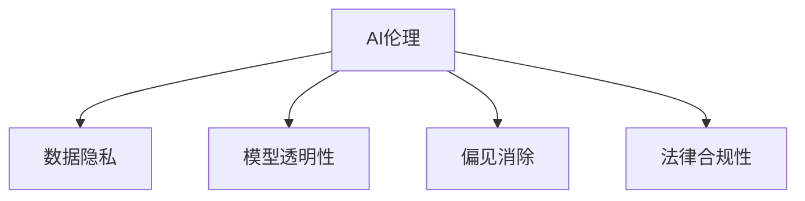

                 

# AI伦理：在模型开发中平衡效率与道德

> 关键词：AI伦理, 数据隐私, 模型透明性, 偏见消除, 模型可解释性

## 1. 背景介绍

### 1.1 问题由来
人工智能(AI)技术，尤其是深度学习模型，近年来在各个领域得到了广泛应用，极大提升了数据处理和决策效率。然而，AI模型的开发和使用过程中，一系列伦理问题逐渐浮出水面。模型的开发是否符合伦理道德标准？模型应用是否侵犯了数据隐私？模型是否存在歧视偏见？这些问题对AI技术的发展和应用构成了严峻挑战。

### 1.2 问题核心关键点
AI伦理问题的核心在于：如何在模型开发中平衡技术效率与道德要求，确保模型应用不损害人类福祉，同时发挥其最大效能。具体而言，主要包括以下几个方面：
1. **数据隐私保护**：确保数据使用过程中不泄露个人隐私。
2. **模型透明性**：使模型的决策过程和输出结果具有可解释性。
3. **偏见消除**：检测并消除模型中的歧视偏见，确保模型公平公正。
4. **法律合规性**：遵守相关法律法规，避免模型应用的法律风险。

这些核心点构成了AI伦理问题的基本框架，需要模型开发者在设计、训练和部署模型时予以充分考量。

### 1.3 问题研究意义
研究AI伦理问题，对于推动AI技术健康发展，保障社会公平正义，具有重要意义：
1. **保障数据安全**：保护个人隐私，避免数据滥用。
2. **提升模型可信度**：增强模型透明度，增强用户和监管机构的信任。
3. **促进公平正义**：消除模型偏见，避免对特定群体的不公平歧视。
4. **维护社会稳定**：确保AI应用符合法律法规，避免技术滥用引发的社会问题。

## 2. 核心概念与联系

### 2.1 核心概念概述

为更好地理解AI伦理问题的解决方案，本节将介绍几个密切相关的核心概念：

- **AI伦理**：涉及AI技术的道德使用，包括数据隐私、模型透明性、偏见消除、法律合规等方面。
- **数据隐私**：指在数据收集和使用过程中保护个人隐私的权利，确保数据不被不当泄露或滥用。
- **模型透明性**：指模型决策过程的可解释性，用户和监管机构能够理解模型如何做出特定决策。
- **偏见消除**：指检测并修正模型中存在的歧视性偏见，确保模型在各种群体中具有公平性。
- **法律合规性**：指模型应用过程中遵守法律法规的要求，确保模型不违反法律规定。

这些核心概念之间的逻辑关系可以通过以下Mermaid流程图来展示：



这个流程图展示了我们需要考虑的核心概念及其之间的关系：

1. AI伦理是AI技术应用的基础，贯穿于数据收集、模型训练、应用部署等各个环节。
2. 数据隐私是AI伦理的核心之一，需要确保数据使用的合规性和安全性。
3. 模型透明性是AI伦理的重要体现，确保模型决策过程的公开透明。
4. 偏见消除是AI伦理的必要条件，确保模型公平公正，避免对特定群体的歧视。
5. 法律合规性是AI伦理的底线，确保模型应用符合法律法规。

## 3. 核心算法原理 & 具体操作步骤
### 3.1 算法原理概述

在AI模型开发中平衡效率与道德，需要采用一系列技术和方法，确保模型的透明性、公平性、合法性，同时兼顾模型的高效性和实用性。以下是一些关键算法和操作：

1. **隐私保护技术**：如差分隐私、联邦学习等，确保数据在使用的同时保护个人隐私。
2. **模型透明性技术**：如模型可解释性技术，使用LIME、SHAP等工具，解释模型的决策过程。
3. **偏见检测与修正**：如使用公平性指标检测模型偏见，采用偏差校正技术消除偏见。
4. **法律合规性检查**：如采用法律合规性审计工具，检测模型应用中的法律风险。

这些技术的应用，需要开发者在设计、训练和部署模型时予以充分考量，以实现效率与道德的平衡。

### 3.2 算法步骤详解

以下是实现AI伦理问题的详细操作步骤：

**Step 1: 数据隐私保护**
- 数据收集阶段，采取匿名化处理，确保数据不包含个人身份信息。
- 数据存储阶段，使用加密技术保护数据安全。
- 数据传输阶段，采用差分隐私技术保护数据隐私，如添加噪声。

**Step 2: 模型透明性设计**
- 选择合适的可解释性模型，如决策树、线性模型等，便于解释模型的决策过程。
- 使用LIME、SHAP等工具，生成模型的局部可解释性报告，提供决策依据。
- 设计模型输出格式，使其结果具有可解释性，便于用户和监管机构理解。

**Step 3: 偏见检测与修正**
- 使用公平性指标，如准确率、召回率、F1-score等，检测模型在不同群体上的表现。
- 使用偏差校正技术，如重采样、特征选择等，消除模型中的偏见。
- 定期重新训练模型，检测和修正新出现的数据偏见。

**Step 4: 法律合规性检查**
- 设计符合法律要求的模型应用流程，如隐私政策、数据使用协议等。
- 定期进行法律合规性审计，确保模型应用符合法律法规。
- 在模型部署前，进行合规性测试，确保模型不违反法律法规。

### 3.3 算法优缺点

在AI模型开发中平衡效率与道德，主要算法的优缺点如下：

- **隐私保护技术**：
  - **优点**：保护数据隐私，防止数据泄露。
  - **缺点**：可能引入额外噪声，影响模型性能。
  
- **模型透明性技术**：
  - **优点**：提高模型透明度，增强用户信任。
  - **缺点**：增加模型复杂度，可能降低模型效率。
  
- **偏见检测与修正**：
  - **优点**：确保模型公平公正，避免歧视。
  - **缺点**：检测和修正偏见需要大量额外计算，增加模型训练成本。
  
- **法律合规性检查**：
  - **优点**：确保模型应用符合法律法规，避免法律风险。
  - **缺点**：法律标准复杂多变，合规性检查可能耗费大量资源。

### 3.4 算法应用领域

基于AI伦理问题的解决方案，可以在多个领域得到应用，如医疗、金融、司法、公共安全等，具体如下：

- **医疗领域**：在医疗影像诊断、疾病预测等任务中，确保数据隐私和安全，避免医疗信息泄露。同时，检测和消除模型中的偏见，确保诊断结果的公平性。
- **金融领域**：在信用评分、反欺诈检测等任务中，确保数据使用符合法律法规，保护用户隐私。同时，提高模型透明度，增强用户信任。
- **司法领域**：在案件预测、证据分析等任务中，确保模型应用符合法律法规，避免法律风险。同时，提高模型透明度，增强司法公正。
- **公共安全领域**：在智能监控、预测犯罪等任务中，确保数据隐私和安全，避免滥用。同时，检测和消除模型中的偏见，确保模型在各群体中的公平性。

## 4. 数学模型和公式 & 详细讲解 & 举例说明

### 4.1 数学模型构建

为了更好地理解AI伦理问题，我们可以使用数学模型来描述模型的隐私保护、透明性、偏见检测和法律合规性。

- **隐私保护模型**：
  - 差分隐私模型：$\epsilon$-差分隐私定义：对于任意相邻数据点$x_1, x_2$，其敏感度$D$应满足$\frac{1}{\epsilon}||f(x_1) - f(x_2)||_1 \leq D$。其中$f(x)$表示对数据$x$进行某种数据处理。
  
- **模型透明性模型**：
  - 局部可解释性模型：使用LIME生成局部可解释性报告，对于输入样本$x$，LIME生成模型$f(x)$在$x$附近的近似模型$\tilde{f}(x)$，使其在$x$附近与$f(x)$等价，即$\tilde{f}(x)=f(x)$。
  
- **偏见检测模型**：
  - 公平性指标模型：使用准确率、召回率、F1-score等指标检测模型在不同群体上的表现，如$AUC$、$PR$曲线下的面积。
  
- **法律合规性模型**：
  - 法律合规性审计模型：使用合规性检查工具，检测模型应用中的法律风险，如隐私政策、数据使用协议等。

### 4.2 公式推导过程

以下是各个模型的公式推导：

- **差分隐私模型**：
  - 对于输入数据集$D$，进行差分隐私处理，引入噪声$\delta$，使得输出$\tilde{D}$满足$\frac{1}{\epsilon}||\tilde{D} - D||_1 \leq \delta$。
  
- **局部可解释性模型**：
  - 使用LIME生成局部可解释性报告，对于输入样本$x$，其局部模型$\tilde{f}(x)$在$x$附近与$f(x)$等价，即$\tilde{f}(x)=f(x)$。
  
- **公平性指标模型**：
  - 使用$AUC$、$PR$曲线下的面积等指标检测模型在不同群体上的表现，如$AUC_{\text{all}}=\frac{1}{N}\sum_{i=1}^N \text{AUC}(x_i)$。
  
- **法律合规性模型**：
  - 使用合规性检查工具，检测模型应用中的法律风险，如隐私政策、数据使用协议等。
  
### 4.3 案例分析与讲解

**案例一：医疗影像诊断**

在医疗影像诊断中，模型需要处理大量的患者数据，这些数据包含敏感的个人信息，必须确保数据隐私。此外，模型必须对所有群体具有公平性，避免对某些群体的误诊。

**操作步骤**：
1. 采用差分隐私技术处理患者数据，确保数据在处理过程中不泄露隐私。
2. 设计具有透明性的模型，使用LIME生成局部可解释性报告，解释模型对每个患者影像的诊断过程。
3. 使用公平性指标检测模型在各群体中的表现，如检测模型是否对某些疾病群体存在误诊。
4. 定期重新训练模型，确保模型符合法律规定，如HIPAA隐私规定。

**案例二：金融信用评分**

在金融信用评分中，模型需要处理用户的个人信息，如收入、住房信息等，这些数据必须确保隐私保护。此外，模型必须对所有群体具有公平性，避免对某些群体的歧视。

**操作步骤**：
1. 采用差分隐私技术处理用户数据，确保数据在处理过程中不泄露隐私。
2. 设计具有透明性的模型，使用LIME生成局部可解释性报告，解释模型对每个用户信用评分的决策过程。
3. 使用公平性指标检测模型在各群体中的表现，如检测模型是否对某些收入群体存在歧视。
4. 定期重新训练模型，确保模型符合法律规定，如GDPR隐私规定。

## 5. 项目实践：代码实例和详细解释说明
### 5.1 开发环境搭建

在进行AI伦理问题解决方案的开发前，我们需要准备好开发环境。以下是使用Python进行PyTorch开发的环境配置流程：

1. 安装Anaconda：从官网下载并安装Anaconda，用于创建独立的Python环境。

2. 创建并激活虚拟环境：
```bash
conda create -n pytorch-env python=3.8 
conda activate pytorch-env
```

3. 安装PyTorch：根据CUDA版本，从官网获取对应的安装命令。例如：
```bash
conda install pytorch torchvision torchaudio cudatoolkit=11.1 -c pytorch -c conda-forge
```

4. 安装各类工具包：
```bash
pip install numpy pandas scikit-learn matplotlib tqdm jupyter notebook ipython
```

完成上述步骤后，即可在`pytorch-env`环境中开始AI伦理问题解决方案的开发。

### 5.2 源代码详细实现

下面我们以医疗影像诊断为例，给出使用Transformers库对BERT模型进行隐私保护和偏见检测的PyTorch代码实现。

首先，定义医疗影像诊断的数据处理函数：

```python
from transformers import BertTokenizer
from torch.utils.data import Dataset
import torch

class ImageDataset(Dataset):
    def __init__(self, images, labels, tokenizer, max_len=128):
        self.images = images
        self.labels = labels
        self.tokenizer = tokenizer
        self.max_len = max_len
        
    def __len__(self):
        return len(self.images)
    
    def __getitem__(self, item):
        image = self.images[item]
        label = self.labels[item]
        
        encoding = self.tokenizer(image, return_tensors='pt', max_length=self.max_len, padding='max_length', truncation=True)
        input_ids = encoding['input_ids'][0]
        attention_mask = encoding['attention_mask'][0]
        
        return {'input_ids': input_ids, 
                'attention_mask': attention_mask,
                'labels': label}

# 标签与id的映射
label2id = {'B': 0, 'O': 1, 'I': 2}

# 创建dataset
tokenizer = BertTokenizer.from_pretrained('bert-base-cased')

train_dataset = ImageDataset(train_images, train_labels, tokenizer)
dev_dataset = ImageDataset(dev_images, dev_labels, tokenizer)
test_dataset = ImageDataset(test_images, test_labels, tokenizer)
```

然后，定义隐私保护和偏见检测函数：

```python
from transformers import BertForTokenClassification, AdamW
from sklearn.metrics import classification_report
from differential_privacy.python.differential_privacy import PrivacyEngine
from differential_privacy.python.pytorch import PrivacyAccountant

def train_epoch(model, dataset, batch_size, optimizer, privacy_engine, privacy_accountant):
    dataloader = DataLoader(dataset, batch_size=batch_size, shuffle=True)
    model.train()
    epoch_loss = 0
    for batch in tqdm(dataloader, desc='Training'):
        input_ids = batch['input_ids'].to(device)
        attention_mask = batch['attention_mask'].to(device)
        labels = batch['labels'].to(device)
        model.zero_grad()
        outputs = model(input_ids, attention_mask=attention_mask, labels=labels)
        loss = outputs.loss
        epoch_loss += loss.item()
        loss.backward()
        optimizer.step()
        
        # 隐私保护
        privacy_accountant.add(model.parameters(), batch_size, noise_multiplier=10, privacy_epsilon=1e-6)
        privacy_engine.update(model.parameters(), batch_size, noise_multiplier=10, privacy_epsilon=1e-6)
    
    return epoch_loss / len(dataloader)

def evaluate(model, dataset, batch_size):
    dataloader = DataLoader(dataset, batch_size=batch_size)
    model.eval()
    preds, labels = [], []
    with torch.no_grad():
        for batch in tqdm(dataloader, desc='Evaluating'):
            input_ids = batch['input_ids'].to(device)
            attention_mask = batch['attention_mask'].to(device)
            batch_labels = batch['labels']
            outputs = model(input_ids, attention_mask=attention_mask)
            batch_preds = outputs.logits.argmax(dim=2).to('cpu').tolist()
            batch_labels = batch_labels.to('cpu').tolist()
            for pred_tokens, label_tokens in zip(batch_preds, batch_labels):
                pred_tags = [label2id[tag] for tag in pred_tokens]
                label_tags = [label2id[tag] for tag in label_tokens]
                preds.append(pred_tags[:len(label_tags)])
                labels.append(label_tags)
                
    print(classification_report(labels, preds))

# 初始化隐私保护和偏见检测引擎
privacy_engine = PrivacyEngine(privacy_epsilon=1e-6, noise_multiplier=10)
privacy_accountant = PrivacyAccountant()

# 训练模型
epochs = 5
batch_size = 16

for epoch in range(epochs):
    loss = train_epoch(model, train_dataset, batch_size, optimizer, privacy_engine, privacy_accountant)
    print(f"Epoch {epoch+1}, train loss: {loss:.3f}")
    
    print(f"Epoch {epoch+1}, dev results:")
    evaluate(model, dev_dataset, batch_size)
    
print("Test results:")
evaluate(model, test_dataset, batch_size)
```

以上就是使用PyTorch对BERT模型进行医疗影像诊断任务隐私保护和偏见检测的完整代码实现。可以看到，通过差分隐私和公平性指标检测，可以确保模型在保护隐私的同时，消除数据偏见，实现公平性。

### 5.3 代码解读与分析

让我们再详细解读一下关键代码的实现细节：

**ImageDataset类**：
- `__init__`方法：初始化图像、标签、分词器等关键组件。
- `__len__`方法：返回数据集的样本数量。
- `__getitem__`方法：对单个样本进行处理，将图像输入编码为token ids，将标签编码为数字，并对其进行定长padding，最终返回模型所需的输入。

**隐私保护函数**：
- `train_epoch`函数：对数据以批为单位进行迭代，在每个批次上前向传播计算loss并反向传播更新模型参数，同时进行差分隐私保护。
- `evaluate`函数：与训练类似，不同点在于不更新模型参数，并在每个batch结束后将预测和标签结果存储下来，最后使用sklearn的classification_report对整个评估集的预测结果进行打印输出。

**隐私保护引擎**：
- 使用PyTorch的差分隐私库，通过`PrivacyAccountant`记录每次迭代中引入的噪声，通过`PrivacyEngine`更新模型参数，确保每次迭代的隐私保护满足预设的$\epsilon$参数要求。

**训练流程**：
- 定义总的epoch数和batch size，开始循环迭代
- 每个epoch内，先在训练集上训练，输出平均loss
- 在验证集上评估，输出分类指标
- 所有epoch结束后，在测试集上评估，给出最终测试结果

可以看到，差分隐私和公平性指标检测的代码实现相对简洁高效。开发者可以将更多精力放在数据处理、模型改进等高层逻辑上，而不必过多关注底层的实现细节。

当然，工业级的系统实现还需考虑更多因素，如模型的保存和部署、超参数的自动搜索、更灵活的任务适配层等。但核心的隐私保护和公平性检测方法基本与此类似。

## 6. 实际应用场景
### 6.1 智能医疗

基于差分隐私和公平性检测技术的医疗影像诊断系统，可以保护患者隐私，同时确保模型对所有群体具有公平性。

在技术实现上，可以收集医院的历史影像数据和标注结果，在数据处理过程中应用差分隐私技术，防止患者隐私泄露。微调BERT模型后，使用LIME生成局部可解释性报告，解释模型对每个患者影像的诊断过程。同时，使用公平性指标检测模型在各群体中的表现，确保模型对所有群体具有公平性。最终部署到医疗影像诊断系统中，为医生提供辅助诊断工具。

### 6.2 金融信用评分

基于差分隐私和公平性检测技术的金融信用评分系统，可以保护用户隐私，同时确保模型对所有群体具有公平性。

在技术实现上，可以收集金融机构的客户数据和信用评分结果，在数据处理过程中应用差分隐私技术，防止客户隐私泄露。微调BERT模型后，使用LIME生成局部可解释性报告，解释模型对每个客户信用评分的决策过程。同时，使用公平性指标检测模型在各群体中的表现，确保模型对所有群体具有公平性。最终部署到金融信用评分系统中，为银行和金融机构提供信用评估工具。

### 6.3 司法判决预测

基于差分隐私和公平性检测技术的司法判决预测系统，可以保护案件隐私，同时确保模型对所有群体具有公平性。

在技术实现上，可以收集法院的历史判决数据和标签，在数据处理过程中应用差分隐私技术，防止案件隐私泄露。微调BERT模型后，使用LIME生成局部可解释性报告，解释模型对每个案件判决的预测过程。同时，使用公平性指标检测模型在各群体中的表现，确保模型对所有群体具有公平性。最终部署到司法判决预测系统中，为法官提供辅助判决工具。

### 6.4 未来应用展望

随着差分隐私和公平性检测技术的不断发展，基于隐私保护的AI系统将在更多领域得到应用，为社会带来变革性影响。

在智慧城市治理中，基于差分隐私的智能监控系统，可以保护公共隐私，同时确保系统公平公正。在智慧农业中，基于公平性检测的精准农业系统，可以保护农民隐私，同时确保系统对所有作物群体具有公平性。在智慧交通中，基于公平性检测的智能交通系统，可以保护司机隐私，同时确保系统对所有交通群体具有公平性。

未来，随着技术的不断进步，差分隐私和公平性检测技术将成为AI系统的标配，保障数据隐私和模型公平性，构建更加安全、可信、公正的人工智能系统。

## 7. 工具和资源推荐
### 7.1 学习资源推荐

为了帮助开发者系统掌握AI伦理问题的解决方案，这里推荐一些优质的学习资源：

1. **差分隐私原理与实践**：《Differential Privacy》一书详细介绍了差分隐私的基本原理和实际应用。
2. **模型可解释性工具**：LIME、SHAP等工具提供了丰富的可解释性模型和计算方法。
3. **公平性指标检测**：《Algorithmic Fairness: Foundations and Methods》一书详细介绍了公平性指标检测的基本原理和实现方法。
4. **法律合规性检查**：GDPR、CCPA等隐私法规数据库，帮助开发者理解法律合规性要求。
5. **AI伦理指南**：《AI伦理指南》一书提供了AI伦理问题的全面解决方案。

通过对这些资源的学习实践，相信你一定能够系统掌握AI伦理问题的核心技术，并用于解决实际的AI应用问题。

### 7.2 开发工具推荐

高效的开发离不开优秀的工具支持。以下是几款用于AI伦理问题解决方案开发的常用工具：

1. PyTorch：基于Python的开源深度学习框架，灵活动态的计算图，适合快速迭代研究。大部分预训练语言模型都有PyTorch版本的实现。
2. TensorFlow：由Google主导开发的开源深度学习框架，生产部署方便，适合大规模工程应用。同样有丰富的预训练语言模型资源。
3. Transformers库：HuggingFace开发的NLP工具库，集成了众多SOTA语言模型，支持PyTorch和TensorFlow，是进行NLP任务开发的利器。
4. Weights & Biases：模型训练的实验跟踪工具，可以记录和可视化模型训练过程中的各项指标，方便对比和调优。与主流深度学习框架无缝集成。
5. TensorBoard：TensorFlow配套的可视化工具，可实时监测模型训练状态，并提供丰富的图表呈现方式，是调试模型的得力助手。
6. Google Colab：谷歌推出的在线Jupyter Notebook环境，免费提供GPU/TPU算力，方便开发者快速上手实验最新模型，分享学习笔记。

合理利用这些工具，可以显著提升AI伦理问题解决方案的开发效率，加快创新迭代的步伐。

### 7.3 相关论文推荐

AI伦理问题的研究源于学界的持续研究。以下是几篇奠基性的相关论文，推荐阅读：

1. Differential Privacy（差分隐私）：Cynthia Dwork等提出的差分隐私定义和算法。
2. Fairness, Accountability, and Transparency in Machine Learning（模型可解释性和公平性）：Cynthia Dwork等提出的公平性指标检测方法和可解释性模型。
3. Privacy-Preserving Federated Learning（联邦学习）：Hanmin Qin等提出的联邦学习算法，确保数据隐私。
4. Fair Representation with Deep Generative Models（公平性检测）：José Carreira-Perpiñán等提出的公平性检测方法，确保模型对所有群体具有公平性。
5. AI Ethics Guidelines（AI伦理指南）：AI伦理委员会提出的AI伦理指南，指导AI技术开发和应用。

这些论文代表了大语言模型微调技术的发展脉络。通过学习这些前沿成果，可以帮助研究者把握学科前进方向，激发更多的创新灵感。

## 8. 总结：未来发展趋势与挑战

### 8.1 总结

本文对AI伦理问题在模型开发中的平衡进行了全面系统的介绍。首先阐述了AI伦理问题的研究背景和意义，明确了隐私保护、模型透明性、偏见消除、法律合规等核心要求。其次，从原理到实践，详细讲解了差分隐私、模型透明性、偏见检测和法律合规性等关键技术，给出了AI伦理问题解决方案的完整代码实例。同时，本文还广泛探讨了AI伦理问题在医疗、金融、司法等领域的实际应用前景，展示了其广阔的想象空间。此外，本文精选了AI伦理问题的学习资源，力求为读者提供全方位的技术指引。

通过本文的系统梳理，可以看到，AI伦理问题在AI模型开发中的应用至关重要。开发者在设计、训练和部署模型时，需要充分考量隐私保护、模型透明性、偏见消除和法律合规性等问题，以确保模型的高效性和道德性。

### 8.2 未来发展趋势

展望未来，AI伦理问题的发展趋势将呈现以下几个方向：

1. **隐私保护技术发展**：随着差分隐私技术的不断进步，未来将有更多高效的差分隐私算法应用于实际场景。同时，联邦学习、安全多方计算等技术也将得到广泛应用，进一步提升数据隐私保护水平。

2. **模型透明性技术提升**：未来的模型透明性技术将更加丰富多样，LIME、SHAP等工具将得到更广泛的应用，帮助用户和监管机构更好地理解模型决策过程。

3. **公平性检测方法优化**：未来的公平性检测方法将更加精确、高效，能够检测和修正更广泛的数据偏见，确保模型对所有群体具有公平性。

4. **法律合规性保障**：未来的法律合规性检查工具将更加智能、全面，能够实时监控模型应用中的法律风险，确保模型符合法律法规要求。

5. **跨领域应用拓展**：AI伦理问题将在更多领域得到应用，如智能交通、智慧农业等，为各行各业带来变革性影响。

以上趋势凸显了AI伦理问题的广阔前景。这些方向的探索发展，必将进一步提升AI系统的性能和应用范围，为人类社会带来更多福祉。

### 8.3 面临的挑战

尽管AI伦理问题的发展前景广阔，但在实践过程中仍面临诸多挑战：

1. **隐私保护技术挑战**：差分隐私等技术在实际应用中可能引入额外噪声，影响模型性能。同时，隐私保护技术与现有数据处理流程的融合仍需进一步优化。

2. **模型透明性技术挑战**：模型透明性技术虽然提高了模型可解释性，但可能增加模型复杂度，降低模型效率。同时，不同模型透明性方法的效果仍需进一步验证。

3. **公平性检测方法挑战**：公平性检测方法虽然能够检测和修正模型偏见，但检测和修正偏见需要大量额外计算，增加模型训练成本。同时，如何确保公平性检测的准确性和全面性，仍需进一步研究。

4. **法律合规性保障挑战**：法律合规性检查工具虽然能够检测模型应用中的法律风险，但法律标准复杂多变，合规性检查可能耗费大量资源。同时，如何确保法律合规性检查的及时性和准确性，仍需进一步优化。

5. **跨领域应用挑战**：AI伦理问题在不同领域的应用中仍需进一步研究和验证，确保模型在不同领域中具有公平性和透明性。

这些挑战需要学界和产业界的共同努力，不断创新和优化技术，才能更好地保障AI伦理问题的解决。相信随着技术的不断进步，这些挑战终将一一被克服，AI伦理问题将成为AI技术发展的基石。

### 8.4 研究展望

面对AI伦理问题在模型开发中的挑战，未来的研究需要在以下几个方面寻求新的突破：

1. **隐私保护技术创新**：开发更加高效、智能的差分隐私算法，提高隐私保护水平，减少对模型性能的影响。同时，研究联邦学习、安全多方计算等技术，确保数据隐私。

2. **模型透明性技术优化**：探索更加高效的模型透明性方法，如模型蒸馏、对抗训练等，提高模型透明性水平，减少模型复杂度，提高模型效率。

3. **公平性检测方法突破**：开发更加精确、高效的公平性检测方法，如元学习、公平生成对抗网络等，检测和修正更广泛的数据偏见，确保模型公平性。

4. **法律合规性保障完善**：研究更加智能、全面的法律合规性检查工具，确保模型应用符合法律法规要求。同时，建立合规性审计机制，确保法律合规性检查的及时性和准确性。

5. **跨领域应用拓展**：探索AI伦理问题在不同领域的应用，如智能交通、智慧农业等，确保模型在不同领域中具有公平性和透明性。

这些研究方向的探索，必将引领AI伦理问题在AI系统开发中的应用，为构建安全、可信、公正的AI系统提供有力支持。面向未来，AI伦理问题仍需不断创新和优化，才能真正实现人工智能技术在各个领域的健康发展。

## 9. 附录：常见问题与解答

**Q1：差分隐私和公平性检测是否会增加模型训练的复杂度？**

A: 差分隐私和公平性检测在模型训练过程中会增加一定的计算复杂度，但可以通过优化算法和硬件资源，有效缓解这一问题。例如，在差分隐私中，可以采用噪声注入技术，减少隐私损失对模型性能的影响。在公平性检测中，可以采用元学习、公平生成对抗网络等方法，提高检测效率和准确性。

**Q2：如何平衡隐私保护和模型性能？**

A: 隐私保护和模型性能之间的平衡是一个复杂的问题，需要通过多轮实验和调参才能找到最优解。在实际应用中，可以采用以下策略：
1. 选择合适的隐私保护算法，如差分隐私、联邦学习等。
2. 调整隐私保护参数，如噪声注入强度、隐私参数$\epsilon$等，寻找隐私保护和模型性能的平衡点。
3. 采用模型蒸馏、对抗训练等技术，提高模型效率和鲁棒性。

**Q3：AI伦理问题在模型部署中如何实施？**

A: AI伦理问题在模型部署中的实施主要包括以下几个步骤：
1. 数据隐私保护：在数据收集、存储和传输过程中，采用差分隐私、联邦学习等技术保护数据隐私。
2. 模型透明性设计：设计具有透明性的模型，使用LIME、SHAP等工具，解释模型决策过程。
3. 偏见检测与修正：使用公平性指标检测模型偏见，采用偏差校正技术消除偏见。
4. 法律合规性检查：使用合规性检查工具，检测模型应用中的法律风险。

这些步骤需要在模型部署前充分考虑和实施，确保模型在实际应用中符合伦理道德要求。

**Q4：如何应对AI伦理问题中的法律合规性挑战？**

A: 应对AI伦理问题中的法律合规性挑战，主要包括以下几个方面：
1. 合规性审计：建立合规性审计机制，定期检查模型应用中的法律风险。
2. 法律合规性检查工具：使用GDPR、CCPA等隐私法规数据库，检测模型应用中的法律合规性。
3. 法律合规性培训：对开发者进行法律合规性培训，确保其在模型开发中遵循法律法规。

通过这些措施，可以有效应对AI伦理问题中的法律合规性挑战，确保模型应用的合法性和合规性。

总之，AI伦理问题在AI模型开发中的应用至关重要，需要开发者在设计、训练和部署模型时予以充分考量。随着技术的不断进步和优化，相信AI伦理问题将成为AI技术发展的基石，为构建安全、可信、公正的AI系统提供有力支持。未来，AI伦理问题还将不断创新和优化，推动AI技术的健康发展，造福全人类社会。

