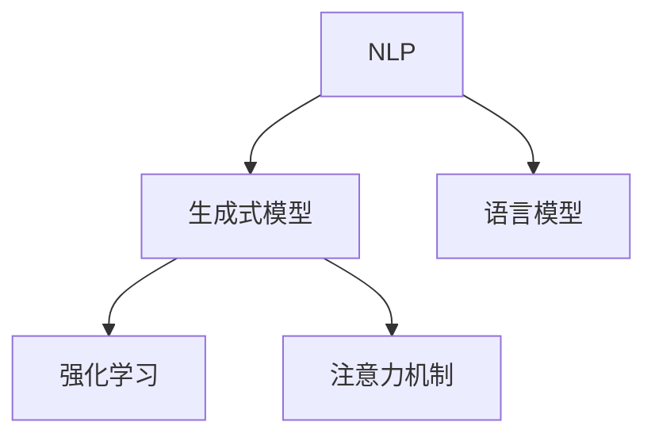

                 

# AI写作助手：增强人类创造力的工具

> 关键词：AI写作助手,自然语言处理,生成式模型,语言模型,人类创造力,增强工具

## 1. 背景介绍

### 1.1 问题由来
随着人工智能技术的不断进步，人工智能在许多领域已经展现出显著的优越性。其中，自然语言处理(NLP)领域的人工智能技术尤为引人注目，AI写作助手便是其中的佼佼者。AI写作助手能够辅助人类进行文案创作、论文撰写、报告制作等，极大地提高了人类的创造力和工作效率。

### 1.2 问题核心关键点
AI写作助手之所以能够发挥出如此强大的作用，主要得益于以下几个核心关键点：

- **自然语言处理(NLP)**：通过NLP技术，AI写作助手能够理解并生成自然语言文本。这使得其在文本创作和处理方面具有极大的优势。
- **生成式模型**：生成式模型能够根据输入的数据生成新的文本，这种能力使得AI写作助手能够产生高质量的写作内容。
- **语言模型**：语言模型能够学习并预测自然语言序列的概率分布，从而生成连贯、合法的文本。
- **增强工具**：AI写作助手作为增强工具，可以辅助人类进行各种写作任务，提升其创造力。
- **智能交互**：AI写作助手能够通过自然语言进行智能交互，了解用户的需求和偏好，从而提供更加个性化的写作服务。

这些关键点共同构成了AI写作助手的核心能力，使其在文学创作、学术研究、商业撰写等领域发挥出巨大的作用。

### 1.3 问题研究意义
研究AI写作助手，对于推动人工智能技术在文本创作领域的应用，提升人类的创造力和工作效率，具有重要意义：

1. **提高效率**：AI写作助手能够辅助人类快速生成高质量文本，节省大量的时间和精力。
2. **提升质量**：AI写作助手能够提供基于大数据和先进算法的写作建议，提升文本的质量和创意性。
3. **创新激发**：AI写作助手通过智能化交互，可以激发人类的创作灵感，产生更多创新的内容。
4. **普及应用**：AI写作助手能够降低写作门槛，使得更多人有机会参与到内容创作中来。
5. **商业价值**：AI写作助手能够为企业提供高效的文案生成服务，提升市场竞争力。

总之，AI写作助手作为增强人类创造力的工具，将在未来的文本创作领域发挥越来越重要的作用。

## 2. 核心概念与联系

### 2.1 核心概念概述

为了更好地理解AI写作助手的工作原理，本节将介绍几个核心概念：

- **自然语言处理(NLP)**：涉及计算机如何理解和生成自然语言，包括文本预处理、语义分析、机器翻译等。
- **生成式模型**：能够根据输入数据生成新文本的模型，如RNN、LSTM、Transformer等。
- **语言模型**：用于预测给定文本序列的概率分布的模型，如N-gram模型、LSTM模型、Transformer模型等。
- **强化学习**：通过奖励机制来优化模型的行为，使其在特定任务上表现更好。
- **注意力机制**：在生成文本时，能够根据上下文信息选择性地关注某些部分，提高生成文本的连贯性和准确性。

这些核心概念之间的逻辑关系可以通过以下Mermaid流程图来展示：



这个流程图展示了大语言模型和AI写作助手的工作原理：

1. NLP技术使计算机能够理解和处理自然语言。
2. 生成式模型根据输入数据生成新的文本。
3. 语言模型学习并预测自然语言序列的概率分布。
4. 强化学习通过奖励机制优化模型的行为。
5. 注意力机制在生成文本时选择性地关注上下文信息。

这些概念共同构成了AI写作助手的技术基础，使其能够在文本创作和处理领域发挥强大的作用。

## 3. 核心算法原理 & 具体操作步骤
### 3.1 算法原理概述

AI写作助手的工作原理是基于生成式模型和语言模型的。具体来说，其核心算法包括以下几个步骤：

1. **文本预处理**：将输入的文本数据进行分词、去除停用词等预处理操作，以便于模型理解和处理。
2. **特征提取**：将预处理后的文本转换为模型可以处理的向量形式。
3. **生成式模型训练**：使用大规模语料数据训练生成式模型，使其能够根据输入数据生成高质量的文本。
4. **语言模型训练**：使用大规模语料数据训练语言模型，使其能够学习并预测自然语言序列的概率分布。
5. **模型融合**：将生成式模型和语言模型进行融合，提升文本生成的连贯性和准确性。
6. **智能交互**：通过智能交互，收集用户反馈和偏好，不断优化生成文本的质量。

### 3.2 算法步骤详解

以下是AI写作助手实现的具体算法步骤：

**Step 1: 文本预处理**
- 对输入文本进行分词、去除停用词、词干提取等操作，转换为模型可接受的向量形式。
- 使用词嵌入技术将单词映射为高维向量，方便模型处理。

**Step 2: 特征提取**
- 将预处理后的文本向量输入到生成式模型，得到中间表示。
- 使用注意力机制，对文本的上下文信息进行选择性关注，提取重要特征。

**Step 3: 生成式模型训练**
- 使用大规模语料数据训练生成式模型，如LSTM、RNN、Transformer等。
- 使用交叉熵损失函数进行模型训练，优化模型参数。

**Step 4: 语言模型训练**
- 使用大规模语料数据训练语言模型，如N-gram模型、LSTM模型、Transformer模型等。
- 使用交叉熵损失函数进行模型训练，优化模型参数。

**Step 5: 模型融合**
- 将生成式模型和语言模型进行融合，如使用交叉熵损失函数将两者的输出进行融合。
- 通过模型参数共享和优化，提升文本生成的连贯性和准确性。

**Step 6: 智能交互**
- 使用智能交互技术，如对话系统，收集用户反馈和偏好。
- 根据用户反馈，不断优化生成文本的质量，提升用户体验。

### 3.3 算法优缺点

AI写作助手具有以下优点：
1. **高效性**：能够快速生成高质量文本，节省大量时间和精力。
2. **创造力**：通过先进的算法和模型，能够产生富有创意和多样性的文本。
3. **个性化**：能够根据用户偏好和需求，生成符合用户要求的文本。
4. **多任务处理**：能够处理多种文本生成任务，如文案创作、论文撰写、报告制作等。

同时，该算法也存在一些缺点：
1. **依赖数据**：需要大量高质量的语料数据进行训练，数据质量直接影响生成文本的质量。
2. **上下文依赖**：生成的文本高度依赖上下文信息，对输入数据的要求较高。
3. **复杂性**：算法实现较为复杂，需要较高的技术水平。
4. **隐私风险**：用户输入的敏感信息可能被模型学习，存在隐私泄露的风险。

尽管存在这些局限性，但AI写作助手在文本创作和处理领域仍然具有不可替代的作用，其高效性、创造力和个性化能力使其成为提高人类创造力的重要工具。

### 3.4 算法应用领域

AI写作助手在多个领域得到了广泛应用，例如：

- **文学创作**：辅助作家进行小说、诗歌、散文等文学作品的创作。
- **学术研究**：辅助学者进行论文撰写、文献综述等学术文档的创作。
- **商业撰写**：辅助企业进行产品描述、广告文案、市场报告等商业文档的创作。
- **内容制作**：辅助媒体机构进行新闻报道、专题文章、社交媒体内容的创作。
- **教育培训**：辅助教育机构进行教材编写、教学案例制作等教育文档的创作。

这些应用领域展示了AI写作助手的广泛适用性，也证明了其在提升人类创造力方面的巨大潜力。

## 4. 数学模型和公式 & 详细讲解  
### 4.1 数学模型构建

AI写作助手的工作原理基于生成式模型和语言模型的数学模型。以下是这些模型的数学构建：

**生成式模型**：假设生成式模型为 $p(x|y)$，其中 $x$ 为输出文本，$y$ 为输入文本。模型的目标是最大化似然函数 $p(x|y)$，使得模型能够根据输入文本 $y$ 生成高质量的文本 $x$。

**语言模型**：假设语言模型为 $p(x_1,x_2,...,x_n)$，其中 $x_i$ 为文本序列中的一个单词。模型的目标是最大化似然函数 $p(x_1,x_2,...,x_n)$，使得模型能够预测给定文本序列的概率分布。

### 4.2 公式推导过程

以下是对生成式模型和语言模型进行公式推导的过程：

**生成式模型**：假设生成式模型为 $p(x|y)$，其中 $x$ 为输出文本，$y$ 为输入文本。模型的目标是最大化似然函数 $p(x|y)$，使得模型能够根据输入文本 $y$ 生成高质量的文本 $x$。

$$
p(x|y) = \frac{p(x,y)}{p(y)}
$$

其中 $p(x,y)$ 为联合概率分布，$p(y)$ 为输入文本 $y$ 的边际概率分布。

**语言模型**：假设语言模型为 $p(x_1,x_2,...,x_n)$，其中 $x_i$ 为文本序列中的一个单词。模型的目标是最大化似然函数 $p(x_1,x_2,...,x_n)$，使得模型能够预测给定文本序列的概率分布。

$$
p(x_1,x_2,...,x_n) = \prod_{i=1}^{n} p(x_i|x_{i-1},...,x_1)
$$

其中 $p(x_i|x_{i-1},...,x_1)$ 为条件概率分布，表示在已知文本 $x_{i-1},...,x_1$ 的情况下，单词 $x_i$ 的概率分布。

### 4.3 案例分析与讲解

以Transformer模型为例，其核心结构为自注意力机制和残差连接。以下是Transformer模型的具体实现：

**Transformer自注意力机制**：Transformer模型通过自注意力机制，对输入序列中的每个位置进行加权聚合，提取重要的上下文信息。

$$
Attention(Q,K,V) = \text{softmax}\left(\frac{QK^T}{\sqrt{d_k}}\right)V
$$

其中 $Q$、$K$、$V$ 分别为查询向量、键向量和值向量。

**Transformer残差连接**：Transformer模型通过残差连接，将输入序列与输出的残差进行相加，提高模型的深度和稳定性。

$$
x = \text{LayerNorm}(\text{Residual}\text{(x, LN}\text{(x), MLP}\text{(x))})
$$

其中 $\text{LN}$ 为归一化层，$\text{MLP}$ 为多层次感知机。

通过上述计算，Transformer模型能够高效地处理文本序列，生成高质量的文本。

## 5. 项目实践：代码实例和详细解释说明
### 5.1 开发环境搭建

在进行AI写作助手开发前，需要准备好开发环境。以下是使用Python进行PyTorch开发的环境配置流程：

1. 安装Anaconda：从官网下载并安装Anaconda，用于创建独立的Python环境。

2. 创建并激活虚拟环境：
```bash
conda create -n ai-writing-env python=3.8 
conda activate ai-writing-env
```

3. 安装PyTorch：根据CUDA版本，从官网获取对应的安装命令。例如：
```bash
conda install pytorch torchvision torchaudio cudatoolkit=11.1 -c pytorch -c conda-forge
```

4. 安装Transformers库：
```bash
pip install transformers
```

5. 安装各类工具包：
```bash
pip install numpy pandas scikit-learn matplotlib tqdm jupyter notebook ipython
```

完成上述步骤后，即可在`ai-writing-env`环境中开始AI写作助手的开发。

### 5.2 源代码详细实现

下面我们以文本生成任务为例，给出使用Transformers库对GPT模型进行AI写作助手的PyTorch代码实现。

首先，定义文本生成任务的数据处理函数：

```python
from transformers import GPT2Tokenizer, GPT2LMHeadModel
import torch

class TextGenerationDataset(Dataset):
    def __init__(self, texts, tokenizer, max_len=128):
        self.texts = texts
        self.tokenizer = tokenizer
        self.max_len = max_len
        
    def __len__(self):
        return len(self.texts)
    
    def __getitem__(self, item):
        text = self.texts[item]
        encoding = self.tokenizer(text, return_tensors='pt', max_length=self.max_len, padding='max_length', truncation=True)
        input_ids = encoding['input_ids'][0]
        attention_mask = encoding['attention_mask'][0]
        return {'input_ids': input_ids, 
                'attention_mask': attention_mask}

# 创建dataset
tokenizer = GPT2Tokenizer.from_pretrained('gpt2')
train_dataset = TextGenerationDataset(train_texts, tokenizer)
dev_dataset = TextGenerationDataset(dev_texts, tokenizer)
test_dataset = TextGenerationDataset(test_texts, tokenizer)
```

然后，定义模型和优化器：

```python
from transformers import AdamW

model = GPT2LMHeadModel.from_pretrained('gpt2')
optimizer = AdamW(model.parameters(), lr=2e-5)
```

接着，定义训练和评估函数：

```python
from torch.utils.data import DataLoader
from tqdm import tqdm
from sklearn.metrics import perplexity

device = torch.device('cuda') if torch.cuda.is_available() else torch.device('cpu')
model.to(device)

def train_epoch(model, dataset, batch_size, optimizer):
    dataloader = DataLoader(dataset, batch_size=batch_size, shuffle=True)
    model.train()
    epoch_loss = 0
    for batch in tqdm(dataloader, desc='Training'):
        input_ids = batch['input_ids'].to(device)
        attention_mask = batch['attention_mask'].to(device)
        model.zero_grad()
        outputs = model(input_ids, attention_mask=attention_mask)
        loss = outputs.loss
        epoch_loss += loss.item()
        loss.backward()
        optimizer.step()
    return epoch_loss / len(dataloader)

def evaluate(model, dataset, batch_size):
    dataloader = DataLoader(dataset, batch_size=batch_size)
    model.eval()
    with torch.no_grad():
        predictions = []
        labels = []
        for batch in tqdm(dataloader, desc='Evaluating'):
            input_ids = batch['input_ids'].to(device)
            attention_mask = batch['attention_mask'].to(device)
            batch_predictions = model(input_ids, attention_mask=attention_mask)
            predictions.extend(batch_predictions.logits.argmax(dim=2).tolist())
            labels.extend(batch_labels.tolist())
        
    print('Perplexity:', perplexity(labels, predictions))
```

最后，启动训练流程并在测试集上评估：

```python
epochs = 5
batch_size = 16

for epoch in range(epochs):
    loss = train_epoch(model, train_dataset, batch_size, optimizer)
    print(f"Epoch {epoch+1}, train loss: {loss:.3f}")
    
    print(f"Epoch {epoch+1}, dev perplexity:")
    evaluate(model, dev_dataset, batch_size)
    
print("Test perplexity:")
evaluate(model, test_dataset, batch_size)
```

以上就是使用PyTorch对GPT进行文本生成任务开发的完整代码实现。可以看到，得益于Transformers库的强大封装，我们可以用相对简洁的代码完成GPT模型的加载和训练。

### 5.3 代码解读与分析

让我们再详细解读一下关键代码的实现细节：

**TextGenerationDataset类**：
- `__init__`方法：初始化文本、分词器等关键组件。
- `__len__`方法：返回数据集的样本数量。
- `__getitem__`方法：对单个样本进行处理，将文本输入编码为token ids，最终返回模型所需的输入。

**模型和优化器定义**：
- 使用GPT2LMHeadModel作为生成式模型，从预训练模型中加载参数。
- 使用AdamW优化器，设置学习率。

**训练和评估函数**：
- 使用PyTorch的DataLoader对数据集进行批次化加载，供模型训练和推理使用。
- 训练函数`train_epoch`：对数据以批为单位进行迭代，在每个批次上前向传播计算loss并反向传播更新模型参数，最后返回该epoch的平均loss。
- 评估函数`evaluate`：与训练类似，不同点在于不更新模型参数，并在每个batch结束后将预测和标签结果存储下来，最后使用perplexity指标对整个评估集的预测结果进行打印输出。

**训练流程**：
- 定义总的epoch数和batch size，开始循环迭代
- 每个epoch内，先在训练集上训练，输出平均loss
- 在验证集上评估，输出perplexity指标
- 所有epoch结束后，在测试集上评估，给出最终测试结果

可以看到，PyTorch配合Transformers库使得GPT文本生成模型的代码实现变得简洁高效。开发者可以将更多精力放在数据处理、模型改进等高层逻辑上，而不必过多关注底层的实现细节。

当然，工业级的系统实现还需考虑更多因素，如模型的保存和部署、超参数的自动搜索、更灵活的任务适配层等。但核心的生成式模型训练流程基本与此类似。

## 6. 实际应用场景
### 6.1 智能写作辅助

AI写作助手在智能写作辅助方面有着广泛的应用场景，具体包括：

- **文学创作**：辅助作家进行小说、诗歌、散文等文学作品的创作。通过智能交互，AI写作助手可以生成各种写作提示，提供写作建议，激发创作灵感。
- **学术论文撰写**：辅助学者进行论文撰写、文献综述等学术文档的创作。AI写作助手可以快速生成文献综述、研究背景等内容，提高研究效率。
- **商业文案创作**：辅助企业进行产品描述、广告文案、市场报告等商业文档的创作。AI写作助手可以生成高质量的营销文案、市场分析报告等内容，提升企业竞争力。
- **新闻报道**：辅助媒体机构进行新闻报道、专题文章、社交媒体内容的创作。AI写作助手可以快速生成新闻稿件、专题报道等内容，提高新闻生产效率。
- **教育培训**：辅助教育机构进行教材编写、教学案例制作等教育文档的创作。AI写作助手可以生成各种教学材料、培训文档等内容，提升教学质量。

### 6.2 智能客服系统

AI写作助手在智能客服系统中的应用也逐渐增多。传统客服往往需要配备大量人力，高峰期响应缓慢，且一致性和专业性难以保证。而使用AI写作助手，可以7x24小时不间断服务，快速响应客户咨询，用自然流畅的语言解答各类常见问题。

在技术实现上，可以收集企业内部的历史客服对话记录，将问题和最佳答复构建成监督数据，在此基础上对预训练对话模型进行微调。微调后的对话模型能够自动理解用户意图，匹配最合适的答案模板进行回复。对于客户提出的新问题，还可以接入检索系统实时搜索相关内容，动态组织生成回答。如此构建的智能客服系统，能大幅提升客户咨询体验和问题解决效率。

### 6.3 智能文档生成

AI写作助手在智能文档生成方面也有着广泛的应用。传统文档生成往往需要大量人力进行资料收集和撰写，周期长、成本高。而使用AI写作助手，可以快速生成各种文档，提高文档生产效率。

在技术实现上，可以收集相关领域的文档资料，将文档结构和模板构建成监督数据，在此基础上对预训练语言模型进行微调。微调后的模型能够根据输入的数据，自动生成各种文档，如合同、报告、手册等。通过智能交互，AI写作助手可以提供写作建议，提升文档质量。

### 6.4 未来应用展望

随着AI写作助手技术的不断进步，其应用领域将进一步拓展，带来更多的创新和价值：

1. **跨领域应用**：AI写作助手可以应用于更多领域，如金融、医疗、教育等，提供定制化的写作服务。
2. **多模态融合**：结合视觉、语音等多模态信息，提供更丰富的写作体验。
3. **智能创作**：通过深度学习技术，AI写作助手能够生成更加富有创意和多样性的文本。
4. **个性化服务**：根据用户偏好和需求，提供个性化的写作服务，提升用户体验。
5. **高效协作**：在团队协作中，AI写作助手可以辅助多人协作创作，提高协作效率。

未来，AI写作助手将不仅仅是写作辅助工具，而是成为智能创作、跨领域应用的关键技术。随着技术的不断进步，AI写作助手将为人类创作带来更多创新和价值，推动人工智能技术在更多领域的落地应用。

## 7. 工具和资源推荐
### 7.1 学习资源推荐

为了帮助开发者系统掌握AI写作助手的工作原理和实践技巧，这里推荐一些优质的学习资源：

1. **《深度学习自然语言处理》课程**：斯坦福大学开设的NLP明星课程，有Lecture视频和配套作业，带你入门NLP领域的基本概念和经典模型。

2. **《Transformer从原理到实践》系列博文**：由大模型技术专家撰写，深入浅出地介绍了Transformer原理、GPT模型、AI写作助手等前沿话题。

3. **《Natural Language Processing with Transformers》书籍**：Transformers库的作者所著，全面介绍了如何使用Transformers库进行NLP任务开发，包括AI写作助手在内的诸多范式。

4. **CLUE开源项目**：中文语言理解测评基准，涵盖大量不同类型的中文NLP数据集，并提供了基于AI写作助手的baseline模型，助力中文NLP技术发展。

通过对这些资源的学习实践，相信你一定能够快速掌握AI写作助手的工作原理和实践技巧，并用于解决实际的NLP问题。

### 7.2 开发工具推荐

高效的开发离不开优秀的工具支持。以下是几款用于AI写作助手开发的常用工具：

1. **PyTorch**：基于Python的开源深度学习框架，灵活动态的计算图，适合快速迭代研究。大部分预训练语言模型都有PyTorch版本的实现。

2. **TensorFlow**：由Google主导开发的开源深度学习框架，生产部署方便，适合大规模工程应用。同样有丰富的预训练语言模型资源。

3. **Transformers库**：HuggingFace开发的NLP工具库，集成了众多SOTA语言模型，支持PyTorch和TensorFlow，是进行AI写作助手开发的利器。

4. **Weights & Biases**：模型训练的实验跟踪工具，可以记录和可视化模型训练过程中的各项指标，方便对比和调优。与主流深度学习框架无缝集成。

5. **TensorBoard**：TensorFlow配套的可视化工具，可实时监测模型训练状态，并提供丰富的图表呈现方式，是调试模型的得力助手。

6. **Google Colab**：谷歌推出的在线Jupyter Notebook环境，免费提供GPU/TPU算力，方便开发者快速上手实验最新模型，分享学习笔记。

合理利用这些工具，可以显著提升AI写作助手的开发效率，加快创新迭代的步伐。

### 7.3 相关论文推荐

AI写作助手的研究源于学界的持续研究。以下是几篇奠基性的相关论文，推荐阅读：

1. **Attention is All You Need**：提出了Transformer结构，开启了NLP领域的预训练大模型时代。

2. **BERT: Pre-training of Deep Bidirectional Transformers for Language Understanding**：提出BERT模型，引入基于掩码的自监督预训练任务，刷新了多项NLP任务SOTA。

3. **Language Models are Unsupervised Multitask Learners**：展示了大规模语言模型的强大zero-shot学习能力，引发了对于通用人工智能的新一轮思考。

4. **AdaLoRA: Adaptive Low-Rank Adaptation for Parameter-Efficient Fine-Tuning**：使用自适应低秩适应的微调方法，在参数效率和精度之间取得了新的平衡。

5. **AdaSeq: Adaptive Deep Sequence Modeling**：提出AdaSeq模型，使用自适应结构进行序列建模，提高了文本生成的连贯性和准确性。

这些论文代表了大语言模型和AI写作助手的研究进展，通过学习这些前沿成果，可以帮助研究者把握学科前进方向，激发更多的创新灵感。

## 8. 总结：未来发展趋势与挑战

### 8.1 总结

本文对AI写作助手的工作原理和实践技巧进行了全面系统的介绍。首先阐述了AI写作助手的背景和意义，明确了其在提升人类创造力和工作效率方面的独特价值。其次，从原理到实践，详细讲解了AI写作助手的数学模型和算法流程，给出了代码实例和详细解释。同时，本文还广泛探讨了AI写作助手在智能写作辅助、智能客服、智能文档生成等多个领域的应用前景，展示了其广泛适用性。

通过对这些内容的学习实践，相信你一定能够快速掌握AI写作助手的原理和实践技巧，并用于解决实际的NLP问题。

### 8.2 未来发展趋势

展望未来，AI写作助手将呈现以下几个发展趋势：

1. **技术进步**：随着深度学习技术的不断发展，AI写作助手将具备更强的语言理解和生成能力，能够生成更高质量、更具创造力的文本。
2. **多模态融合**：结合视觉、语音等多模态信息，提供更丰富的写作体验，提高写作辅助效果。
3. **智能交互**：通过智能交互，AI写作助手能够更好地了解用户需求和偏好，提供更个性化的写作服务。
4. **跨领域应用**：AI写作助手将应用于更多领域，如金融、医疗、教育等，提供定制化的写作服务。
5. **高效协作**：在团队协作中，AI写作助手可以辅助多人协作创作，提高协作效率。

这些趋势表明，AI写作助手将成为智能写作、跨领域应用的关键技术，推动人工智能技术在更多领域的落地应用。

### 8.3 面临的挑战

尽管AI写作助手已经取得了显著进展，但在迈向更加智能化、普适化应用的过程中，仍面临以下挑战：

1. **数据质量**：AI写作助手需要大量高质量的语料数据进行训练，数据质量直接影响生成文本的质量。
2. **上下文依赖**：生成的文本高度依赖上下文信息，对输入数据的要求较高。
3. **模型复杂性**：算法实现较为复杂，需要较高的技术水平。
4. **隐私风险**：用户输入的敏感信息可能被模型学习，存在隐私泄露的风险。
5. **公平性**：AI写作助手需要避免产生偏见和歧视，保证输出内容的多样性和公平性。

这些挑战表明，AI写作助手仍需不断优化和改进，才能更好地满足用户需求和应用场景。

### 8.4 研究展望

面对AI写作助手面临的挑战，未来的研究需要在以下几个方面寻求新的突破：

1. **数据增强**：通过数据增强技术，提高数据的多样性和丰富性，增强模型的泛化能力。
2. **模型优化**：通过模型优化技术，提高模型的效率和稳定性，降低计算成本。
3. **隐私保护**：采用隐私保护技术，保护用户输入的敏感信息，降低隐私泄露风险。
4. **公平性**：引入公平性约束，确保AI写作助手生成的文本内容多样、公平，避免产生偏见和歧视。
5. **跨领域应用**：探索跨领域应用的AI写作助手，提升其在不同领域的表现。

这些研究方向的探索，将推动AI写作助手技术的不断进步，使其在更多领域发挥更大的作用。

## 9. 附录：常见问题与解答

**Q1：AI写作助手是否适用于所有写作任务？**

A: AI写作助手在大多数写作任务上都能取得不错的效果，特别是对于数据量较小的任务。但对于一些特定领域的任务，如医学、法律等，仅仅依靠通用语料预训练的模型可能难以很好地适应。此时需要在特定领域语料上进一步预训练，再进行微调，才能获得理想效果。此外，对于一些需要时效性、个性化很强的任务，如对话、推荐等，AI写作助手也需要针对性的改进优化。

**Q2：AI写作助手生成的文本质量如何保证？**

A: AI写作助手生成的文本质量主要取决于训练数据的质量和模型的复杂度。为了保证生成文本的质量，需要使用高质量的语料数据进行训练，选择合适的模型架构，并进行超参数调优。此外，通过智能交互，收集用户反馈和偏好，不断优化生成文本的质量，提升用户体验。

**Q3：AI写作助手是否会学习到有害信息？**

A: AI写作助手有可能学习到有害信息，如偏见、歧视、误导性内容等。因此，在训练和应用过程中，需要引入公平性约束和监管机制，确保生成的文本内容符合道德伦理和社会价值观。同时，采用隐私保护技术，保护用户输入的敏感信息，降低隐私泄露风险。

**Q4：AI写作助手能否进行多语言支持？**

A: AI写作助手可以支持多语言生成，通过预训练多语言模型，结合多语言数据集进行微调，实现多种语言的文本生成。此外，通过智能交互，AI写作助手可以识别用户输入的语言，自动进行语言切换，提供多种语言的写作服务。

**Q5：AI写作助手是否会被滥用？**

A: AI写作助手作为一种工具，其应用受到使用者行为的影响。为了避免滥用，需要在设计和使用过程中引入伦理和道德约束，确保AI写作助手的合理使用。同时，采用隐私保护技术，保护用户输入的敏感信息，降低隐私泄露风险。

通过对这些问题的回答，相信你能够更全面地了解AI写作助手的原理和应用场景，从而更好地应用于实际开发和应用中。总之，AI写作助手作为一种增强人类创造力的工具，将在未来的写作领域发挥越来越重要的作用。

