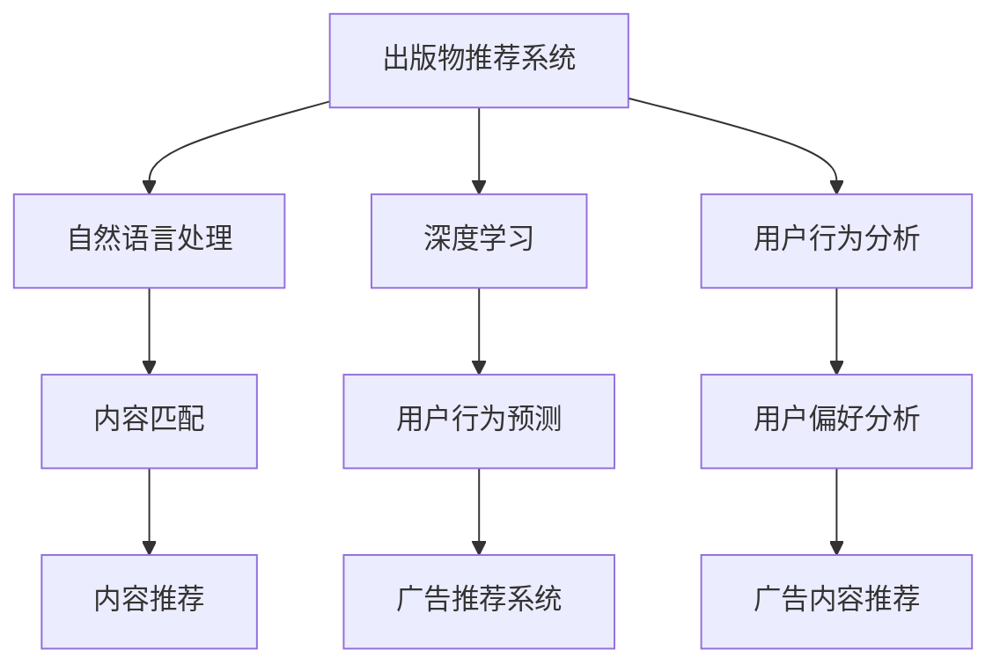

                 

# AI出版业的动态：场景驱动的技术更新

> 关键词：出版物推荐系统，内容个性化推荐，自然语言处理(NLP)，深度学习，用户行为分析，广告推荐系统

## 1. 背景介绍

### 1.1 问题由来

近年来，随着互联网和数字出版的迅速发展，图书出版业面临了前所未有的机遇和挑战。在线平台的兴起，让读者可以更轻松地获取和分享知识，但同时也使得市场竞争更加激烈。出版商需要不断创新，以吸引和留住更多的读者。与此同时，广告商也在积极寻找更有效的渠道来推广他们的产品。在这样的背景下，AI技术特别是自然语言处理(NLP)和深度学习被广泛引入，以帮助出版业实现更精准的内容推荐和广告投放。

### 1.2 问题核心关键点

出版物推荐系统和广告推荐系统在AI出版业中扮演着核心角色。出版物推荐系统根据用户的历史阅读行为，预测用户可能感兴趣的书籍；广告推荐系统则根据用户的兴趣和行为，推荐最适合的广告内容。这些系统在技术上涉及多种AI技术，包括但不限于NLP、深度学习、用户行为分析等。

### 1.3 问题研究意义

通过AI技术，出版商可以更有效地理解读者的需求，提供个性化的内容推荐，提升用户体验和满意度。广告商则可以更精准地投放广告，提高广告效果和投资回报率。AI出版业有助于推动出版物的数字化和个性化，促进数字阅读的普及，同时也为广告商提供了新的市场机遇。

## 2. 核心概念与联系

### 2.1 核心概念概述

为更好地理解基于场景的AI出版业技术更新，本节将介绍几个关键概念及其相互之间的联系：

- **出版物推荐系统**：利用AI技术根据用户的历史阅读行为，预测并推荐用户可能感兴趣的书籍。其目标是提高用户的阅读满意度，促进内容消费。
- **广告推荐系统**：通过分析用户兴趣和行为数据，推荐最相关的广告内容。其目标是提高广告投放的精准度和广告主的投资回报率。
- **自然语言处理(NLP)**：一种AI技术，专注于理解和处理人类语言，包括文本分析、情感分析、文本分类等。NLP在出版物推荐和广告推荐系统中起到了关键作用。
- **深度学习**：一种强大的AI技术，能够学习复杂的数据模式，广泛应用于图像识别、语音识别等领域。在出版物推荐和广告推荐中，深度学习可以用于用户行为预测和内容匹配。
- **用户行为分析**：通过分析用户的点击、阅读、购买等行为数据，了解用户的偏好和需求，指导出版和广告策略。

这些概念之间的逻辑关系可以通过以下Mermaid流程图来展示：



这个流程图展示了几大核心概念及其相互之间的关系：

1. **出版物推荐系统**利用NLP、深度学习、用户行为分析等多项技术，从用户的行为数据中提取特征，预测用户可能感兴趣的内容。
2. **广告推荐系统**同样利用深度学习、用户行为分析等技术，分析用户兴趣和行为，推荐最相关的广告内容。
3. **自然语言处理**提供文本分析等工具，支持出版物推荐和广告推荐中的文本匹配和情感分析。
4. **深度学习**主要用于用户行为预测和内容推荐，通过构建复杂模型，从海量数据中提取有用的信息。
5. **用户行为分析**提供对用户行为和偏好的深入理解，支持推荐系统的个性化推荐和广告系统的内容匹配。

这些概念共同构成了AI出版业的推荐系统框架，使得出版商和广告商能够更精准地理解和满足用户的需求。

## 3. 核心算法原理 & 具体操作步骤
### 3.1 算法原理概述

基于场景的AI出版业推荐系统主要基于监督学习、强化学习、协同过滤等多种技术，通过用户的历史行为数据来预测和推荐内容。

- **监督学习**：利用有标注的数据集，训练模型进行预测。典型的监督学习算法包括决策树、逻辑回归、支持向量机等。
- **强化学习**：通过与环境的交互，最大化某个指标（如用户满意度、广告点击率等）。强化学习算法包括Q-learning、深度强化学习等。
- **协同过滤**：通过分析用户之间的相似性，推荐相似用户可能喜欢的内容。常见的协同过滤算法包括基于用户的协同过滤和基于项目的协同过滤。

这些算法在出版物推荐和广告推荐系统中都有广泛应用，通过不断迭代和优化，提高推荐的精准度和效果。

### 3.2 算法步骤详解

以出版物推荐系统为例，其算法步骤大致如下：

**Step 1: 数据准备**
- 收集用户的历史阅读行为数据，包括书籍的ID、阅读时间、阅读时长等。
- 收集图书的元数据，如书籍的标题、作者、简介等。

**Step 2: 数据预处理**
- 对用户数据进行清洗，去除异常值和噪声。
- 对文本数据进行分词、去停用词、词向量表示等预处理。

**Step 3: 特征提取**
- 根据用户行为数据和图书元数据，提取特征。
- 例如，可以提取用户阅读过的书籍ID、阅读时间分布、书籍类型等特征。

**Step 4: 模型训练**
- 选择适合的模型，如线性回归、随机森林、深度学习等。
- 使用训练集数据对模型进行训练，调整模型参数。

**Step 5: 模型评估**
- 使用验证集数据对模型进行评估，计算准确率、召回率等指标。
- 根据评估结果调整模型参数，优化模型性能。

**Step 6: 推荐生成**
- 使用训练好的模型对新用户的阅读行为进行预测，生成推荐列表。
- 根据推荐列表，向用户推荐最可能感兴趣的书籍。

### 3.3 算法优缺点

基于场景的AI出版业推荐系统具有以下优点：

1. **精准度高**：通过深度学习和用户行为分析，推荐系统能够更准确地预测用户需求。
2. **个性化推荐**：根据用户的历史行为和偏好，提供个性化的推荐内容。
3. **实时性**：基于用户实时行为数据，系统可以迅速调整推荐策略。

同时，该方法也存在以下局限性：

1. **数据依赖**：推荐系统依赖于高质量的数据集，数据的完整性和准确性直接影响推荐效果。
2. **冷启动问题**：对于新用户或新书籍，由于缺乏足够的历史数据，推荐效果可能较差。
3. **计算资源消耗**：深度学习等技术对计算资源的要求较高，尤其是在大规模数据集上训练模型时。

### 3.4 算法应用领域

基于场景的AI出版业推荐系统在多个领域得到了广泛应用：

- **在线图书平台**：亚马逊、当当等在线图书平台，通过推荐系统提升用户体验，增加销售额。
- **内容聚合平台**：今日头条、抖音等，根据用户兴趣推荐新闻、视频等内容。
- **广告投放**：在线广告平台如Google Ads，根据用户行为数据投放相关广告，提高广告点击率。

此外，基于场景的推荐系统还被应用于电子商务、社交网络等领域，助力企业提升运营效率和市场竞争力。

## 4. 数学模型和公式 & 详细讲解 & 举例说明

### 4.1 数学模型构建

出版物推荐系统的核心任务是预测用户对某本书籍的兴趣程度。假设用户对某本书籍的兴趣程度用$P_{ij}$表示，其中$i$为用户，$j$为书籍。预测模型$f_i$可以表示为：

$$
P_{ij} = f_i(x_j)
$$

其中$x_j$为书籍$j$的特征向量，$f_i$为预测模型，如线性回归模型、神经网络等。

### 4.2 公式推导过程

以线性回归模型为例，假设用户特征向量为$x_i=[x_{i1},x_{i2},\cdots,x_{in}]$，书籍特征向量为$x_j=[x_{j1},x_{j2},\cdots,x_{jm}]$，模型参数为$\theta$，则线性回归模型的预测公式为：

$$
P_{ij} = \theta_0 + \theta_1 x_{i1} + \theta_2 x_{i2} + \cdots + \theta_n x_{in}
$$

给定训练集$\{(x_i,y_i)\}_{i=1}^N$，其中$x_i$为用户$i$的特征向量，$y_i$为用户对书籍$j$的评分（如1-5分），则线性回归模型的目标函数为：

$$
L(\theta) = \frac{1}{2N}\sum_{i=1}^N \sum_{j=1}^M (y_{ij} - f_i(x_j))^2
$$

其中$y_{ij}$为用户$i$对书籍$j$的真实评分，$M$为书籍总数。目标函数最小化误差平方和，求解$\theta$。

### 4.3 案例分析与讲解

以一个简单的书籍推荐案例为例，假设某用户A阅读了书籍1和2，并对书籍1给出4分，对书籍2给出5分。根据线性回归模型，用户A对书籍3的兴趣度预测公式为：

$$
P_{A3} = \theta_0 + \theta_1 x_{A1} + \theta_2 x_{A2} + \theta_3 x_{31} + \theta_4 x_{32} + \cdots + \theta_n x_{3n}
$$

其中$x_{A1}$和$x_{A2}$为用户A阅读书籍1和2的特征向量，$x_{31},x_{32},\cdots,x_{3n}$为书籍3的特征向量。通过求解目标函数最小值，可以得到$\theta_0,\theta_1,\cdots,\theta_n$的值，从而预测用户A对书籍3的兴趣度。

## 5. 项目实践：代码实例和详细解释说明
### 5.1 开发环境搭建

在进行出版物推荐系统开发前，我们需要准备好开发环境。以下是使用Python进行TensorFlow开发的环境配置流程：

1. 安装Anaconda：从官网下载并安装Anaconda，用于创建独立的Python环境。

2. 创建并激活虚拟环境：
```bash
conda create -n tf-env python=3.8 
conda activate tf-env
```

3. 安装TensorFlow：根据CUDA版本，从官网获取对应的安装命令。例如：
```bash
conda install tensorflow
```

4. 安装Pandas、Numpy、Scikit-learn、Matplotlib等各类工具包：
```bash
pip install pandas numpy scikit-learn matplotlib tqdm jupyter notebook ipython
```

完成上述步骤后，即可在`tf-env`环境中开始推荐系统开发。

### 5.2 源代码详细实现

这里我们以线性回归模型为例，给出使用TensorFlow进行出版物推荐系统的Python代码实现。

首先，定义数据集：

```python
import pandas as pd
import tensorflow as tf

# 定义数据集
df = pd.read_csv('book_data.csv')
X = df.drop(['user_id', 'book_id', 'rating'], axis=1).values
y = df['rating'].values
```

然后，定义模型：

```python
# 定义线性回归模型
model = tf.keras.Sequential([
    tf.keras.layers.Dense(units=10, activation='relu', input_shape=(X.shape[1],)),
    tf.keras.layers.Dense(units=1)
])

# 编译模型
model.compile(optimizer='adam', loss='mean_squared_error', metrics=['accuracy'])
```

接着，训练模型：

```python
# 训练模型
model.fit(X, y, epochs=50, batch_size=32, validation_split=0.2)
```

最后，进行推荐：

```python
# 预测用户对某本书籍的兴趣度
def predict_interest(user_id, book_id):
    user_data = df[df['user_id'] == user_id]
    book_data = df[df['book_id'] == book_id]
    user_features = user_data.drop(['book_id', 'rating'], axis=1).values
    book_features = book_data.drop(['user_id', 'rating'], axis=1).values
    return model.predict([user_features, book_features])[0]

# 推荐用户可能感兴趣的书籍
recommended_books = []
for user_id in df['user_id'].unique():
    recommendations = []
    for book_id in df['book_id'].unique():
        if book_id != user_id:
            rating = predict_interest(user_id, book_id)
            recommendations.append((book_id, rating))
    recommended_books.append(recommendations)
```

以上就是使用TensorFlow进行出版物推荐系统的完整代码实现。可以看到，TensorFlow提供了强大的深度学习框架，使得推荐系统开发变得简洁高效。

### 5.3 代码解读与分析

让我们再详细解读一下关键代码的实现细节：

**数据集定义**：
- 使用Pandas库加载数据集，定义输入特征`X`和输出标签`y`。
- `X`包含用户特征和书籍特征，`y`为用户对书籍的评分。

**模型定义**：
- 使用TensorFlow的Sequential模型，定义包含两个全连接层的神经网络。
- 第一层有10个神经元，使用ReLU激活函数。
- 第二层只有一个神经元，输出预测值。
- 编译模型，使用Adam优化器，均方误差损失函数，并监控准确率。

**模型训练**：
- 使用训练集数据`X`和`y`，设定迭代轮数为50，批量大小为32，在训练集和验证集上评估模型性能。

**推荐生成**：
- 定义预测函数`predict_interest`，根据用户和书籍的特征向量，预测用户对书籍的评分。
- 根据预测评分排序，选择评分最高的书籍推荐给用户。

可以看出，TensorFlow提供了简单易用的API，使得深度学习模型的构建和训练变得非常便捷。通过不断调整模型结构和超参数，可以得到更好的推荐效果。

## 6. 实际应用场景
### 6.1 在线图书平台

在线图书平台如亚马逊、当当等，通过推荐系统提升用户体验和销售额。具体应用如下：

- **首页推荐**：根据用户的历史浏览和购买记录，动态更新首页的书籍推荐。
- **个性化搜索**：根据用户输入的关键词，推荐相关的书籍，提高搜索的精准度和用户满意度。
- **广告投放**：通过分析用户行为数据，投放广告到用户可能感兴趣的书籍页面。

### 6.2 内容聚合平台

内容聚合平台如今日头条、抖音等，根据用户兴趣推荐新闻、视频等内容。具体应用如下：

- **个性化新闻推荐**：根据用户的历史阅读记录和兴趣标签，推荐用户可能感兴趣的新闻。
- **视频推荐**：根据用户观看记录和点赞评论，推荐用户可能感兴趣的视频。
- **广告投放**：通过分析用户行为数据，投放广告到相关内容页面。

### 6.3 广告投放平台

广告投放平台如Google Ads，通过推荐系统提高广告点击率和转化率。具体应用如下：

- **广告投放策略优化**：根据用户行为数据，优化广告投放策略，提高广告效果。
- **实时广告推荐**：根据用户实时行为数据，动态推荐相关广告。
- **跨设备推荐**：在不同设备上（如PC、移动端），提供一致的推荐服务。

## 7. 工具和资源推荐
### 7.1 学习资源推荐

为了帮助开发者系统掌握出版物推荐系统的原理和实践，这里推荐一些优质的学习资源：

1. 《推荐系统实践》系列博文：由推荐系统专家撰写，涵盖推荐系统的基本概念、算法实现和案例分析。

2. CS392《推荐系统》课程：斯坦福大学开设的推荐系统课程，详细讲解了推荐系统的基本原理和算法。

3. 《深度学习》书籍：Ian Goodfellow等人著，全面介绍了深度学习的原理和应用，推荐系统是其重要章节之一。

4. Weights & Biases：推荐系统训练的实验跟踪工具，可以记录和可视化模型训练过程中的各项指标，方便对比和调优。

5. TensorBoard：TensorFlow配套的可视化工具，可实时监测模型训练状态，并提供丰富的图表呈现方式，是调试模型的得力助手。

通过对这些资源的学习实践，相信你一定能够快速掌握出版物推荐系统的精髓，并用于解决实际的推荐问题。

### 7.2 开发工具推荐

高效的开发离不开优秀的工具支持。以下是几款用于出版物推荐系统开发的常用工具：

1. TensorFlow：由Google主导开发的开源深度学习框架，生产部署方便，适合大规模工程应用。

2. PyTorch：基于Python的开源深度学习框架，灵活动态的计算图，适合快速迭代研究。

3. Pandas：用于数据处理和分析的Python库，提供强大的数据结构和工具，支持快速数据预处理。

4. NumPy：用于科学计算的Python库，提供高效的数组和矩阵操作，支持复杂的数据处理。

5. Scikit-learn：用于机器学习和数据挖掘的Python库，提供丰富的算法和工具，支持快速模型构建和调优。

6. Weights & Biases：推荐系统训练的实验跟踪工具，可以记录和可视化模型训练过程中的各项指标，方便对比和调优。

7. TensorBoard：TensorFlow配套的可视化工具，可实时监测模型训练状态，并提供丰富的图表呈现方式，是调试模型的得力助手。

合理利用这些工具，可以显著提升出版物推荐系统的开发效率，加快创新迭代的步伐。

### 7.3 相关论文推荐

出版物推荐系统的发展离不开学界的持续研究。以下是几篇奠基性的相关论文，推荐阅读：

1. "Item-Based Collaborative Filtering Recommendation Algorithms"（协同过滤推荐算法）：Tan和Konstan在2006年提出，成为协同过滤算法的经典之作。

2. "Hybrid Recommendation System"（混合推荐系统）：Shaw和Croft在2006年提出，将协同过滤和基于内容的推荐方法相结合，提高了推荐系统的效果。

3. "Matrix Factorization Techniques for Recommender Systems"（矩阵分解技术）：Zhang等人提出，通过矩阵分解技术，提高了协同过滤推荐系统的精度和效率。

4. "Deep Learning with Personalized Neural Collaborative Filtering"（个性化神经协同过滤的深度学习）：Liu等人提出，将深度学习应用于协同过滤推荐系统，提高了推荐系统的个性化程度。

5. "Attention Mechanism for Recommendation Systems"（推荐系统中的注意力机制）：Wang等人提出，通过引入注意力机制，提高了推荐系统的效果和公平性。

这些论文代表了大规模推荐系统的发展脉络。通过学习这些前沿成果，可以帮助研究者把握学科前进方向，激发更多的创新灵感。

## 8. 总结：未来发展趋势与挑战
### 8.1 总结

本文对基于场景的AI出版业推荐系统进行了全面系统的介绍。首先阐述了出版物推荐系统和广告推荐系统在AI出版业中的核心地位，明确了推荐系统在提升用户体验和广告效果方面的重要价值。其次，从原理到实践，详细讲解了推荐系统的数学模型和算法实现，给出了推荐系统开发的全流程代码实现。同时，本文还探讨了推荐系统在在线图书平台、内容聚合平台、广告投放平台等多个场景中的应用前景，展示了推荐系统的广泛应用。

通过本文的系统梳理，可以看到，基于场景的AI出版业推荐系统正在成为出版商和广告商的重要工具，极大地提升了用户体验和广告效果。未来，伴随深度学习等技术的发展，推荐系统将具有更强的智能化和个性化，进一步拓展其应用范围。

### 8.2 未来发展趋势

展望未来，出版物推荐系统将呈现以下几个发展趋势：

1. **深度学习与强化学习的结合**：结合深度学习和强化学习，提高推荐系统的个性化和动态性，适应用户的实时需求。
2. **多模态推荐**：结合文本、图像、视频等多模态数据，提高推荐系统的综合表现力。
3. **联邦推荐**：通过联邦学习技术，保护用户隐私的同时，提高推荐系统的泛化能力。
4. **实时推荐**：利用流数据处理技术，实现实时推荐，提高推荐系统的时效性。
5. **可解释性推荐**：引入可解释性技术，提高推荐系统的透明度和用户信任度。

以上趋势凸显了出版物推荐系统的发展潜力和应用前景。这些方向的探索发展，必将进一步提升推荐系统的性能和应用范围，为出版业带来新的机遇。

### 8.3 面临的挑战

尽管出版物推荐系统已经取得了显著成就，但在迈向更加智能化、个性化推荐的过程中，它仍面临诸多挑战：

1. **数据隐私与安全**：推荐系统需要大量用户数据进行训练，如何在保护用户隐私的同时，保证推荐系统的效果，是一大难题。
2. **冷启动问题**：对于新用户或新书籍，推荐系统需要更多数据才能取得较好的效果，如何解决冷启动问题，是一个重要研究方向。
3. **模型鲁棒性**：推荐系统容易受到数据噪声和恶意攻击的影响，如何提高模型的鲁棒性，保证推荐结果的可靠性，是一大挑战。
4. **计算资源消耗**：深度学习和强化学习等技术对计算资源的要求较高，如何在有限的资源条件下，优化推荐系统性能，是一大挑战。
5. **公平性问题**：推荐系统可能存在偏见，导致某些用户或物品被不公平地对待，如何实现公平推荐，是一大挑战。

### 8.4 研究展望

面对出版物推荐系统所面临的挑战，未来的研究需要在以下几个方面寻求新的突破：

1. **隐私保护技术**：开发隐私保护技术，如差分隐私、联邦学习等，保护用户隐私的同时，提高推荐系统的效果。
2. **冷启动解决方案**：开发冷启动解决方案，如基于内容的推荐、迁移学习等，帮助新用户和物品快速融入推荐系统。
3. **鲁棒性优化方法**：开发鲁棒性优化方法，如对抗训练、鲁棒性损失函数等，提高推荐系统的鲁棒性。
4. **计算资源优化技术**：开发计算资源优化技术，如模型压缩、混合精度训练等，在有限的资源条件下，提高推荐系统的性能。
5. **公平推荐算法**：开发公平推荐算法，如公平回归、公平对抗训练等，实现公平推荐，减少推荐系统中的偏见。

这些研究方向的探索，必将引领出版物推荐系统走向更高的台阶，为出版业带来新的机遇和挑战。总之，出版物推荐系统需要在数据隐私、冷启动、鲁棒性、计算资源和公平性等方面不断优化，方能满足用户的实时需求，推动出版业的数字化转型。

## 9. 附录：常见问题与解答

**Q1：如何选择合适的推荐算法？**

A: 选择推荐算法需要考虑多个因素，包括数据规模、模型复杂度、推荐效果等。常用的推荐算法包括协同过滤、内容推荐、深度学习等。对于数据规模较小、模型复杂度要求不高的场景，可以选择协同过滤或内容推荐。对于数据规模较大、模型复杂度要求较高的场景，可以选择深度学习等复杂算法。

**Q2：如何提高推荐系统的个性化程度？**

A: 提高推荐系统的个性化程度可以从多个方面入手，包括：
1. 收集更多用户行为数据，丰富用户画像。
2. 引入用户反馈机制，动态调整推荐策略。
3. 结合个性化推荐和多样化推荐，提供更多样化的推荐结果。
4. 引入多模态数据，结合文本、图像、视频等多模态数据，提高推荐系统的综合表现力。

**Q3：如何提高推荐系统的实时性？**

A: 提高推荐系统的实时性可以从多个方面入手，包括：
1. 使用流数据处理技术，实现实时推荐。
2. 引入缓存机制，减少推荐系统的计算负担。
3. 采用分布式系统架构，提高推荐系统的处理能力。

**Q4：推荐系统如何保护用户隐私？**

A: 推荐系统需要保护用户隐私，可以使用以下技术：
1. 数据匿名化：对用户数据进行匿名化处理，保护用户隐私。
2. 差分隐私：在推荐系统训练过程中，引入差分隐私机制，保护用户隐私。
3. 联邦学习：通过联邦学习技术，在保护用户隐私的同时，提高推荐系统的泛化能力。

**Q5：推荐系统如何应对冷启动问题？**

A: 推荐系统应对冷启动问题，可以采用以下方法：
1. 基于内容的推荐：利用物品的元数据（如标签、描述等）进行推荐。
2. 迁移学习：将已有模型的知识迁移到新用户或物品上。
3. 多臂老虎机算法：通过多臂老虎机算法，优化新用户或物品的推荐效果。

这些技术方法的应用，可以显著提升推荐系统的效果，满足用户的实时需求，推动出版业的数字化转型。

---

作者：禅与计算机程序设计艺术 / Zen and the Art of Computer Programming

