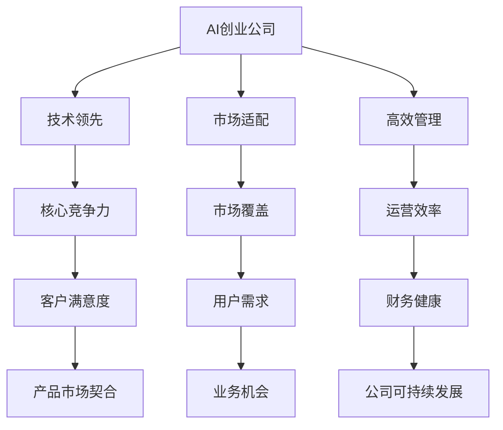

                 

# AI创业公司如何实现快速增长?

在当前的科技发展浪潮中，人工智能（AI）已经成为一个炙手可热的领域，吸引了大量创业公司竞相布局。然而，成功并非易事。本篇文章将详细探讨AI创业公司如何通过技术、市场、管理等维度，实现快速增长。

## 1. 背景介绍

### 1.1 问题由来

近年来，人工智能技术快速发展，尤其是深度学习和机器学习的兴起，使得AI成为各行各业的核心驱动力。AI创业公司如雨后春笋般涌现，但成功者并不多。如何使AI创业公司保持长期持续发展，成为创业者们亟需解决的难题。

### 1.2 问题核心关键点

AI创业公司实现快速增长，关键在于技术的先进性、市场的需求匹配性、高效的管理和运营。具体来说，要实现快速增长，需解决以下问题：

- **技术领先**：如何持续在核心技术上保持领先，打破技术壁垒。
- **市场适配**：如何将AI技术准确地应用到目标市场，满足用户需求。
- **管理运营**：如何高效管理团队、运营资金，确保公司的可持续发展。

## 2. 核心概念与联系

### 2.1 核心概念概述

为更好地理解AI创业公司的快速增长路径，本节将介绍几个关键概念：

- **AI创业公司**：以人工智能技术为基础，致力于解决实际问题的初创企业。
- **技术领先**：在核心算法、模型架构、数据处理等方面保持前沿技术优势。
- **市场适配**：通过精准的定位，将AI技术应用到最需要的地方，实现技术价值最大化。
- **高效管理**：通过科学的管理机制和高效的运营模式，最大化公司资源的利用效率。

这些核心概念通过如下的Mermaid流程图来展示其联系：



这个流程图展示了AI创业公司的各个关键维度及其之间的内在联系：

1. 技术领先使得公司在竞争中占据优势。
2. 市场适配决定了公司的市场覆盖和用户需求满足。
3. 高效管理保障了公司的运营效率和财务健康。
4. 技术领先和市场适配共同作用于产品市场契合，提升客户满意度。
5. 高效管理与财务健康相结合，确保公司可持续发展和用户需求满足。

## 3. 核心算法原理 & 具体操作步骤

### 3.1 算法原理概述

AI创业公司实现快速增长的核心算法原理主要包括以下几个方面：

- **深度学习**：通过大规模神经网络，使AI系统具备强大的学习和推理能力，解决复杂问题。
- **强化学习**：使AI系统能够在与环境的交互中逐步优化策略，提升决策能力。
- **迁移学习**：利用预训练模型的知识，加速新任务上的学习，提升模型泛化能力。
- **对抗学习**：通过对抗样本训练，提升模型鲁棒性，抵御攻击和误判。

### 3.2 算法步骤详解

AI创业公司实现快速增长的算法步骤如下：

1. **数据收集与预处理**：获取目标市场的相关数据，并进行清洗、标注，准备模型训练。
2. **模型构建与训练**：设计适合目标任务的模型架构，利用深度学习、强化学习等算法进行模型训练。
3. **模型评估与优化**：通过评估指标（如准确率、召回率、F1分数等）对模型进行评估，并进行参数调优。
4. **部署与应用**：将训练好的模型部署到实际应用场景中，并不断收集反馈进行迭代优化。
5. **市场推广与反馈**：通过市场推广活动，收集用户反馈，评估模型效果，调整市场策略。

### 3.3 算法优缺点

**优点**：

- **技术优势**：深度学习、强化学习等先进算法使AI系统具备强大的学习和推理能力，能够处理复杂任务。
- **市场适应性强**：迁移学习、对抗学习等方法可以快速适应不同应用场景，提升模型泛化能力。

**缺点**：

- **数据依赖**：AI系统依赖大量高质量的数据进行训练，数据获取和处理成本高。
- **计算资源需求高**：大规模神经网络训练和推理需要高性能计算资源，如GPU、TPU等。
- **技术复杂度高**：算法设计、模型训练、调优等环节复杂度高，需要专业知识。

### 3.4 算法应用领域

AI创业公司实现快速增长的算法在多个领域都有应用，包括但不限于：

- **医疗健康**：通过AI诊断、治疗方案推荐等，提升医疗服务质量。
- **金融服务**：利用AI进行风险评估、欺诈检测、投资策略优化等，提高金融效率。
- **智能制造**：通过AI优化生产流程、预测设备故障、提升产品质量，推动制造业升级。
- **智慧城市**：通过AI实现城市管理智能化、精细化，提升城市运行效率。

## 4. 数学模型和公式 & 详细讲解 & 举例说明

### 4.1 数学模型构建

以医疗健康领域的AI应用为例，构建深度学习模型解决医疗影像诊断问题。

**输入**：医疗影像数据，如X光片、CT扫描等。
**输出**：诊断结果，如肿瘤、炎症等。

**模型**：卷积神经网络（CNN）。

**损失函数**：常用的损失函数包括交叉熵损失、均方误差损失等。

### 4.2 公式推导过程

以交叉熵损失函数为例进行推导：

设模型输出为 $\hat{y}$，真实标签为 $y$，则交叉熵损失函数为：

$$
L(y, \hat{y}) = -y\log(\hat{y}) - (1-y)\log(1-\hat{y})
$$

在训练过程中，通过反向传播算法更新模型参数 $\theta$，最小化损失函数 $L$。

### 4.3 案例分析与讲解

假设我们有一个二分类任务，即判断一个CT扫描是否存在肺部结节。

- **数据准备**：收集大量标注的CT扫描数据，每个扫描的标签为“存在”或“不存在”。
- **模型构建**：使用卷积神经网络，设计合适的卷积层、池化层和全连接层。
- **训练**：将数据划分为训练集、验证集和测试集，设置合适的学习率、批量大小和迭代轮数。
- **评估**：在测试集上评估模型性能，如准确率、召回率等。

## 5. 项目实践：代码实例和详细解释说明

### 5.1 开发环境搭建

要构建和部署AI模型，首先需要搭建好开发环境。以下是Python开发环境搭建步骤：

1. 安装Python：从官网下载Python最新版本，并确保其版本为3.7或以上。
2. 安装PyTorch：使用pip安装PyTorch。
3. 安装TensorFlow：使用pip安装TensorFlow。
4. 安装Keras：使用pip安装Keras，方便模型构建和训练。
5. 安装其他依赖库：如numpy、scipy、scikit-learn等。

### 5.2 源代码详细实现

以下是一个简单的医疗影像分类模型的Python代码实现：

```python
import torch
import torch.nn as nn
import torch.optim as optim
from torch.utils.data import DataLoader
from torchvision import datasets, transforms

# 定义模型
class CNNModel(nn.Module):
    def __init__(self):
        super(CNNModel, self).__init__()
        self.conv1 = nn.Conv2d(1, 16, 3, 1)
        self.conv2 = nn.Conv2d(16, 32, 3, 1)
        self.fc1 = nn.Linear(32*14*14, 128)
        self.fc2 = nn.Linear(128, 2)

    def forward(self, x):
        x = torch.relu(self.conv1(x))
        x = torch.max_pool2d(x, 2)
        x = torch.relu(self.conv2(x))
        x = torch.max_pool2d(x, 2)
        x = x.view(-1, 32*14*14)
        x = torch.relu(self.fc1(x))
        x = self.fc2(x)
        return x

# 加载数据集
train_dataset = datasets.MNIST(root='data', train=True, transform=transforms.ToTensor(), download=True)
test_dataset = datasets.MNIST(root='data', train=False, transform=transforms.ToTensor(), download=True)

# 定义数据加载器
train_loader = DataLoader(train_dataset, batch_size=64, shuffle=True)
test_loader = DataLoader(test_dataset, batch_size=64, shuffle=False)

# 初始化模型和优化器
model = CNNModel()
criterion = nn.CrossEntropyLoss()
optimizer = optim.Adam(model.parameters(), lr=0.001)

# 训练模型
for epoch in range(10):
    running_loss = 0.0
    for i, data in enumerate(train_loader, 0):
        inputs, labels = data
        optimizer.zero_grad()
        outputs = model(inputs)
        loss = criterion(outputs, labels)
        loss.backward()
        optimizer.step()
        running_loss += loss.item()
        if i % 100 == 99:
            print('[%d, %5d] loss: %.3f' %
                  (epoch + 1, i + 1, running_loss / 100))
            running_loss = 0.0

# 评估模型
correct = 0
total = 0
with torch.no_grad():
    for data in test_loader:
        images, labels = data
        outputs = model(images)
        _, predicted = torch.max(outputs.data, 1)
        total += labels.size(0)
        correct += (predicted == labels).sum().item()

print('Accuracy of the network on the 10000 test images: %d %%' % (
    100 * correct / total))
```

### 5.3 代码解读与分析

这段代码实现了一个简单的卷积神经网络（CNN）模型，用于手写数字分类任务。具体分析如下：

- **模型定义**：使用PyTorch的nn.Module定义CNN模型，包含卷积层、池化层和全连接层。
- **数据加载器**：使用torch.utils.data.DataLoader加载数据集，并进行批处理和打乱。
- **模型训练**：通过循环迭代，使用Adam优化器更新模型参数，并输出每轮的损失值。
- **模型评估**：在测试集上评估模型准确率。

## 6. 实际应用场景

### 6.4 未来应用展望

AI创业公司实现快速增长不仅局限于医疗健康和金融服务领域，未来还有更多应用场景：

- **智慧零售**：通过AI分析消费者行为，进行个性化推荐和库存管理，提升零售效率。
- **自动驾驶**：利用AI进行环境感知、路径规划、决策控制等，推动自动驾驶技术的发展。
- **智能家居**：通过AI实现家庭设备互联、语音控制等功能，提升家居智能化水平。
- **教育培训**：利用AI进行学生学习分析、个性化教学、考试自动批改等，提升教育质量。

## 7. 工具和资源推荐

### 7.1 学习资源推荐

为了帮助AI创业者系统掌握AI技术，这里推荐一些优质学习资源：

1. Coursera的《深度学习专项课程》：由斯坦福大学Andrew Ng教授主讲，系统介绍深度学习的基础理论和应用实践。
2. TensorFlow官方文档：提供详尽的TensorFlow教程和API文档，适合深入学习。
3. PyTorch官方文档：提供PyTorch的使用指南和示例代码，适合快速上手。
4. Keras官方文档：提供Keras的教程和API文档，适合快速构建模型。
5. 《Deep Learning》书籍：由Ian Goodfellow等作者合著，是深度学习领域的经典著作。

### 7.2 开发工具推荐

以下是几个常用的开发工具：

1. Jupyter Notebook：轻量级Python开发环境，支持代码编写和数据可视化。
2. Google Colab：免费的云开发环境，支持GPU计算和自动保存。
3. Visual Studio Code：功能强大的IDE，支持多种编程语言和扩展插件。
4. Docker：容器化开发工具，方便构建和管理开发环境。
5. Kubernetes：容器编排工具，支持分布式部署和资源管理。

### 7.3 相关论文推荐

以下是几篇关于AI创业公司快速增长的相关论文：

1. "Scalable Deep Learning for AI Startups"：探讨如何通过深度学习实现AI创业公司的快速增长。
2. "AI Venture Capital Investments in Startups: Why They Fail and How to Succeed"：分析AI创业公司融资失败的原因和成功案例。
3. "The AI-Driven Startup Ecosystem: Opportunities, Challenges, and Strategies"：讨论AI创业公司的生态系统、挑战和策略。
4. "Accelerating AI Adoption in Enterprise Environments"：介绍如何加速AI技术在企业中的部署和应用。
5. "Building a Data-Driven AI Startup"：分享构建数据驱动型AI创业公司的经验和教训。

## 8. 总结：未来发展趋势与挑战

### 8.1 总结

本文详细探讨了AI创业公司如何通过技术、市场、管理等维度实现快速增长。首先阐述了AI创业公司的背景和问题，明确了技术领先、市场适配和管理运营的重要性。其次，通过数学模型和代码实例，系统讲解了AI模型的构建和训练过程。最后，展望了AI创业公司的未来应用场景，并推荐了相关的学习资源和开发工具。

通过本文的系统梳理，可以看出，AI创业公司实现快速增长需要多方面的努力和协作。唯有技术、市场、管理齐头并进，才能在激烈的市场竞争中脱颖而出。

### 8.2 未来发展趋势

展望未来，AI创业公司实现快速增长将呈现以下几个趋势：

1. **技术革新**：AI创业公司将持续在深度学习、强化学习等领域进行技术创新，推动AI技术的边界不断扩展。
2. **应用扩展**：AI技术将加速向更多垂直行业渗透，如智能制造、智慧零售等，创造新的业务机会。
3. **数据驱动**：AI创业公司将更加依赖数据驱动，通过大数据分析和挖掘，提升AI系统的精准性和效率。
4. **行业整合**：AI创业公司将加强与行业巨头的合作，形成生态系统，实现资源共享和优势互补。
5. **用户中心**：AI创业公司将更加注重用户体验，通过个性化服务和精准推荐，提升用户满意度和忠诚度。

### 8.3 面临的挑战

尽管AI创业公司实现了快速增长，但在未来发展过程中，仍面临以下挑战：

1. **数据获取难度**：获取高质量、高量级的数据难度较大，需要大规模的资金投入和技术积累。
2. **技术壁垒高**：AI技术复杂度高，需要强大的技术团队和长期的技术积累。
3. **市场竞争激烈**：AI创业公司面临传统企业和新兴企业的双重竞争，市场份额难以扩大。
4. **监管政策不确定**：AI技术的快速应用可能引发政策监管问题，影响公司的稳定运营。
5. **人才短缺**：AI领域的人才供不应求，优秀人才的获取和培养成本高。

### 8.4 研究展望

未来，AI创业公司实现快速增长需要在以下几个方面进行深入研究：

1. **数据驱动**：探索如何通过数据挖掘和分析，提升AI系统的精准性和泛化能力。
2. **模型优化**：研究高效、轻量级的模型结构，提高模型的推理速度和资源利用效率。
3. **算法创新**：开发新的算法和模型架构，提升AI系统的性能和鲁棒性。
4. **跨领域应用**：探索AI技术在其他领域的跨领域应用，如自动驾驶、智慧城市等。
5. **人才培养**：建立人才培训机制，吸引和培养AI领域的优秀人才。

总之，AI创业公司实现快速增长需要技术、市场和管理多方面的协同努力，才能在激烈的市场竞争中占据一席之地。未来，只有不断创新、勇于突破，才能在AI领域取得更大的成功。

## 9. 附录：常见问题与解答

**Q1: AI创业公司如何选择合适的市场定位？**

A: AI创业公司需要综合考虑自身的技术优势和市场需求，选择合适的市场定位。可以从以下几个方面考虑：

1. **市场规模**：选择市场规模大、增长潜力高的行业，如医疗健康、智能制造等。
2. **技术契合度**：选择与自身技术优势契合度高的领域，如AI在医疗影像诊断中的应用。
3. **竞争格局**：分析目标市场的竞争格局，选择市场空间大、竞争相对较少的领域。
4. **客户需求**：深入了解目标市场的客户需求，确保产品能够满足用户痛点。

**Q2: 如何平衡技术领先与市场适配？**

A: 平衡技术领先与市场适配可以从以下几个方面入手：

1. **市场调研**：深入了解目标市场的客户需求和行业现状，确保技术应用能够满足实际需求。
2. **快速迭代**：根据市场反馈不断优化产品，快速迭代技术方案，提升用户体验。
3. **业务融合**：将AI技术深度融入业务流程，与行业经验结合，提升系统效果。
4. **跨部门协作**：加强技术团队与市场团队、销售团队的协作，确保技术方向与市场需求一致。

**Q3: 如何高效管理AI创业公司？**

A: 高效管理AI创业公司可以从以下几个方面入手：

1. **团队建设**：组建具有跨学科背景、技术优势的团队，确保团队的多样性和互补性。
2. **流程优化**：建立高效的开发流程和项目管理流程，提升工作效率和资源利用效率。
3. **资金管理**：合理分配资金资源，确保研发投入和市场推广的平衡。
4. **绩效考核**：建立科学合理的绩效考核机制，激励团队成员的积极性。
5. **风险管理**：建立风险管理机制，及时发现和应对潜在风险，保障公司稳定运营。

总之，高效管理是AI创业公司实现快速增长的重要保障，需要从团队建设、流程优化、资金管理、绩效考核等多个维度进行全面提升。只有建立科学的治理机制，才能确保公司的可持续发展。

**Q4: 如何应对AI创业公司面临的挑战？**

A: AI创业公司面临的挑战需要从技术、市场、管理等多个维度进行综合应对：

1. **技术突破**：持续在核心技术上投入研发，提升技术领先优势，突破技术壁垒。
2. **市场推广**：加强市场推广活动，提升品牌知名度和用户认知度，拓展市场覆盖。
3. **资金筹集**：积极寻找投资和融资机会，确保公司的资金流动性。
4. **政策应对**：关注政策变化，积极应对政策监管风险，确保合规运营。
5. **人才培养**：加强人才培养和引进，建立人才储备机制，提升团队实力。

通过这些综合应对措施，AI创业公司可以有效应对各种挑战，实现持续快速增长。

---

作者：禅与计算机程序设计艺术 / Zen and the Art of Computer Programming

