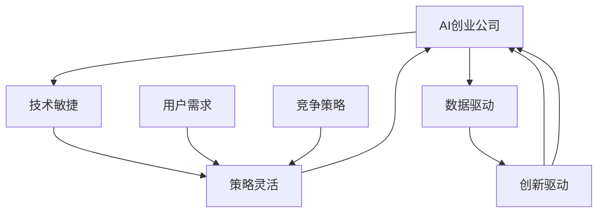

                 

# AI创业公司如何应对市场变化?

> 关键词：AI创业,市场变化,技术敏捷,策略灵活,创新驱动,用户需求,竞争策略,数据驱动

## 1. 背景介绍

在快速发展的技术时代，AI创业公司面临的市场环境日益复杂多变。新技术的不断涌现、用户需求的多样化和市场竞争的日益激烈，都对AI创业公司的运营提出了更高的要求。如何有效应对市场变化，保持公司的持续创新和竞争力，成为每个创业团队必须深入思考的课题。本文将从技术敏捷、策略灵活和创新驱动三个关键维度，探讨AI创业公司应对市场变化的有效策略。

## 2. 核心概念与联系

### 2.1 核心概念概述

为更好地理解AI创业公司如何应对市场变化，本节将介绍几个核心概念：

- **AI创业公司**：专注于人工智能技术和应用的创业公司，旨在通过AI技术解决特定行业问题，提升业务效率或改善用户体验。

- **技术敏捷**：指的是在技术开发和产品迭代过程中，快速响应市场需求变化的能力，包括快速开发、迭代和部署新功能，提升产品竞争力。

- **策略灵活**：指在市场和竞争环境中，能迅速调整业务战略和战术，以适应外部环境变化，最大化商业机会。

- **创新驱动**：指以创新为核心驱动力，持续研发新技术、新产品和新业务模式，保持公司在技术领域的领先地位。

- **用户需求**：AI创业公司应时刻关注用户的真实需求，通过用户反馈不断优化产品和服务，提升用户体验和满意度。

- **竞争策略**：指在激烈的市场竞争中，制定合理的市场定位、差异化竞争和价格策略，以获取市场份额和用户认可。

- **数据驱动**：利用数据进行精准决策，通过对用户行为、市场趋势等数据的深度分析，指导产品开发和市场策略调整。

这些核心概念之间存在紧密的联系，共同构成了AI创业公司应对市场变化的能力框架。技术敏捷保证了公司能够快速响应市场需求，策略灵活使得公司在变化多端的市场环境中保持竞争力，创新驱动则推动公司持续进步和领先，而数据驱动则为这些策略的实施提供了有力的支撑。

### 2.2 核心概念原理和架构的 Mermaid 流程图



这个流程图展示了大语言模型的核心概念及其之间的关系：

1. **AI创业公司**通过**技术敏捷**快速迭代产品，响应市场需求；
2. **策略灵活**帮助公司在多变的市场环境中做出及时调整；
3. **创新驱动**保持公司的持续创新和领先；
4. **用户需求**和**竞争策略**是公司战略制定的重要依据；
5. **数据驱动**为所有策略提供数据支撑，确保决策的科学性和准确性。

## 3. 核心算法原理 & 具体操作步骤

### 3.1 算法原理概述

AI创业公司应对市场变化的核心算法原理在于敏捷开发和持续创新的技术手段。这包括但不限于敏捷开发框架、自动化测试、持续集成和部署等技术。

- **敏捷开发框架**：如Scrum、Kanban等，通过短周期迭代和每日站会，快速交付产品功能和改进。
- **自动化测试**：包括单元测试、集成测试和性能测试等，保证代码质量和系统稳定性。
- **持续集成和部署**：使用CI/CD工具如Jenkins、GitLab CI等，实现代码的自动构建、测试和部署，提高开发效率和发布频率。
- **微服务架构**：采用微服务架构，将大系统拆分成多个独立服务，提高系统的灵活性和扩展性。

### 3.2 算法步骤详解

以下是AI创业公司应对市场变化的详细步骤：

1. **需求分析**：
   - 通过市场调研和用户反馈，识别出核心需求和潜在机会。
   - 使用数据驱动的方法，进行用户行为和市场趋势分析，确保需求的准确性和可行性。

2. **敏捷开发**：
   - 采用敏捷开发框架，如Scrum，进行迭代开发，以短周期（如2-4周）为单位，完成特定功能模块的开发和测试。
   - 使用看板（Kanban）工具进行任务管理，确保任务按照优先级和依赖关系顺利进行。
   - 每日站会保持团队沟通，确保信息透明和进度一致。

3. **持续集成与部署**：
   - 使用CI/CD工具自动化构建和测试代码，减少手工错误和节省时间。
   - 在测试通过后，自动化部署到生产环境，快速上线新功能或修复bug。
   - 实现新版本与旧版本的无缝切换，保证用户体验的连续性和稳定性。

4. **数据驱动决策**：
   - 收集和分析用户数据、市场数据、竞品数据等，进行数据可视化，辅助决策。
   - 使用机器学习和大数据技术，进行趋势分析和预测，指导产品迭代。
   - 定期评估和调整策略，确保公司方向与市场需求一致。

5. **反馈与迭代**：
   - 收集用户反馈，进行功能优化和改进。
   - 持续迭代产品，保持产品与市场的同步更新。

### 3.3 算法优缺点

敏捷开发和持续集成具有以下优点：
- **快速响应市场**：能够快速迭代产品，快速交付功能，缩短上市时间。
- **降低风险**：通过频繁的反馈和迭代，及时发现和修复问题，减少后期修复成本。
- **提升质量**：自动化测试和持续集成，确保代码质量和系统稳定性。
- **灵活适应**：微服务架构和敏捷开发，提高了系统的灵活性和扩展性。

同时，这些方法也存在一些局限性：
- **资源消耗**：频繁的迭代和发布，需要较高的开发和运维资源投入。
- **协调难度**：多团队合作和跨部门沟通，协调难度较大，容易导致进度不一致。
- **维护成本**：代码和系统的复杂度增加，维护成本和难度也随之上升。

### 3.4 算法应用领域

敏捷开发和持续集成的方法不仅适用于AI创业公司，还可以广泛应用于软件开发、金融科技、互联网服务等各类领域。其主要应用场景包括：

- **软件开发**：如软件开发生命周期管理、代码版本控制、自动化测试等。
- **金融科技**：如高频交易、风险管理、客户服务等。
- **互联网服务**：如电商平台、社交媒体、内容服务等领域的产品迭代和运营管理。

## 4. 数学模型和公式 & 详细讲解

### 4.1 数学模型构建

为更好地解释敏捷开发和持续集成，这里构建一个简单的数学模型，描述其核心流程。

设$T$为迭代周期，每个周期包含$N$个功能模块，每个模块的开发和测试时间为$T_m$，部署时间为$T_d$，反馈和迭代时间为$T_f$。则整个周期所需时间为：

$$
T_{total} = T + (N-1)T_f + N(T_m + T_d)
$$

其中$T_f$可以忽略不计，简化为：

$$
T_{total} \approx N(T_m + T_d) + T
$$

可以看出，敏捷开发和持续集成通过缩短迭代周期$T$和优化模块开发时间$T_m$、部署时间$T_d$，显著降低了总开发时间。

### 4.2 公式推导过程

进一步，我们可以通过优化$N$和$T$，得到最优的敏捷开发周期：

$$
\min_{N,T} T_{total}
$$

通过拉格朗日乘子法，我们可以得到：

$$
\frac{\partial T_{total}}{\partial N} = T_m + T_d - \lambda \frac{\partial T}{\partial N} = 0
$$

解得$N$和$T$的关系式为：

$$
N = \frac{T_m + T_d}{T}
$$

这意味着，迭代周期$T$越短，每个周期能完成的功能模块$N$越多，总体开发时间$T_{total}$也越短。

### 4.3 案例分析与讲解

以下是一个具体的案例分析：

假设一个AI创业公司采用敏捷开发，每个迭代周期为2周，模块开发时间为1周，部署时间为1天，反馈和迭代时间为1天。则：

$$
T_{total} = 2(N-1) + 2(N + 1) = 2N + 4
$$

最优的迭代周期为2周，每个周期完成的功能模块数为$N = 4$。

## 5. 项目实践：代码实例和详细解释说明

### 5.1 开发环境搭建

在实践中，需要搭建一个完善的开发环境。以下是具体的配置步骤：

1. **版本控制工具**：安装Git，配置远程仓库，如GitHub。
2. **构建工具**：安装Maven、Gradle等构建工具，自动构建和打包项目。
3. **CI/CD工具**：安装Jenkins、GitLab CI等CI/CD工具，实现自动化构建和部署。
4. **项目管理工具**：使用Jira、Trello等项目管理工具，进行任务分配和进度跟踪。

### 5.2 源代码详细实现

下面以Jenkins为例，给出CI/CD的配置步骤：

1. **Jenkins安装**：在服务器上安装Jenkins，配置Web接口和数据库。
2. **插件配置**：安装必要的插件，如Maven、Gradle、Git等。
3. **构建脚本编写**：编写构建脚本，如Maven pom.xml文件。
4. **CI配置**：在Jenkins上配置构建步骤，包括代码拉取、构建、测试、部署等。
5. **环境配置**：配置构建环境和运行环境，确保构建和部署的顺利进行。

### 5.3 代码解读与分析

以下是关键代码的解读与分析：

```yaml
# Jenkinsfile
pipeline {
    agent any
    stages {
        stage('Build') {
            steps {
                sh 'mvn clean install'
            }
        }
        stage('Test') {
            steps {
                sh 'mvn test'
            }
        }
        stage('Deploy') {
            steps {
                sh 'mvn spring-boot:run'
            }
        }
    }
}
```

- **Jenkinsfile**：Jenkins的构建脚本，定义了构建、测试和部署三个阶段。
- **Maven**：使用Maven进行项目构建和依赖管理，自动构建和打包。
- **Spring Boot**：使用Spring Boot进行Web应用部署，自动启动服务。

### 5.4 运行结果展示

运行结果可以通过Jenkins的Web界面进行展示，具体包括：

1. **构建结果**：显示构建进度和成功与否。
2. **测试结果**：展示测试覆盖率和失败用例。
3. **部署结果**：展示部署的服务器状态和日志。

## 6. 实际应用场景

### 6.1 智能推荐系统

AI创业公司可以利用敏捷开发和持续集成的方法，快速构建智能推荐系统，满足用户的多样化需求。

具体而言，可以采用敏捷开发方法，以短周期为单位，持续收集用户行为数据和反馈，迭代优化推荐算法。通过持续集成和部署，确保新功能的快速上线和稳定运行。数据驱动的策略指导，则通过分析用户数据和市场趋势，调整推荐算法和推荐内容，提升用户体验和满意度。

### 6.2 智能客服系统

智能客服系统需要快速响应市场需求，及时更新问答库和对话策略，提升用户满意度。通过敏捷开发和持续集成的方法，可以快速迭代问答库，更新对话策略，优化系统功能。数据驱动的策略指导，则通过分析用户对话数据和反馈，调整问答策略和对话逻辑，提升系统的智能水平。

### 6.3 金融科技应用

金融科技领域竞争激烈，市场变化快速，需要敏捷开发和持续集成的方法，快速推出新产品和新功能。通过敏捷开发和持续集成，金融科技公司可以快速迭代产品功能，上线新业务，快速响应用户需求。数据驱动的策略指导，则通过分析用户行为数据和市场趋势，调整业务策略和产品设计，确保公司在市场竞争中的领先地位。

## 7. 工具和资源推荐

### 7.1 学习资源推荐

为帮助AI创业者掌握敏捷开发和持续集成的知识和技能，这里推荐一些优质的学习资源：

1. **《敏捷软件开发：原则、模式与实践》**：Eric F. Ritchie等人著作，全面介绍了敏捷开发的原则和实践，适合初学者入门。
2. **《CI/CD最佳实践》**：Jenkins官方文档，详细介绍了CI/CD的配置和最佳实践，适合实际操作者参考。
3. **《持续集成与持续交付：构建可靠的软件交付链》**：Jez Humble和David Farley合著，介绍了持续集成和持续交付的核心理念和方法，适合深入学习。
4. **《Jenkins官方指南》**：Jenkins官方文档，详细介绍了Jenkins的安装、配置和使用，适合实际部署。
5. **《Maven实战》**：David terms等合著，介绍了Maven的安装、配置和实际应用，适合Maven项目开发。

### 7.2 开发工具推荐

优秀的开发工具是敏捷开发和持续集成的重要保障，以下是几款推荐的开发工具：

1. **Jenkins**：开源的CI/CD工具，易于配置和扩展，适合中小规模项目。
2. **GitLab CI/CD**：GitLab集成的CI/CD工具，易于集成和扩展，适合企业级项目。
3. **Jira**：敏捷开发项目管理工具，适合团队协作和任务跟踪。
4. **Trello**：简单易用的项目管理工具，适合快速创建任务和跟踪进度。
5. **Maven**：开源的构建工具，支持多语言和框架，适合项目构建和管理。

### 7.3 相关论文推荐

为了深入理解敏捷开发和持续集成的理论和实践，以下是几篇相关论文，推荐阅读：

1. **《敏捷软件开发：原则、模式与实践》**：Eric F. Ritchie等人著作，介绍了敏捷开发的原则和实践，是敏捷开发的经典著作。
2. **《持续集成与持续交付：构建可靠的软件交付链》**：Jez Humble和David Farley合著，介绍了持续集成和持续交付的核心理念和方法。
3. **《Agile Software Development》**：Robert C. Martin著作，介绍了敏捷开发的核心思想和实践。
4. **《Continuous Delivery: Reliable Software Releases through Build, Test, and Deploy Automation》**：Jez Humble和David Farley合著，介绍了持续交付的理念和方法。

## 8. 总结：未来发展趋势与挑战

### 8.1 总结

本文对AI创业公司如何应对市场变化进行了系统介绍。首先阐述了技术敏捷、策略灵活和创新驱动三个关键维度，明确了敏捷开发和持续集成在应对市场变化中的核心作用。其次，通过数学模型和公式，深入分析了敏捷开发和持续集成的原理和操作方法。最后，通过项目实践和实际应用场景，展示了敏捷开发和持续集成在AI创业公司中的应用效果。

通过本文的系统梳理，可以看到，敏捷开发和持续集成是AI创业公司应对市场变化的重要手段。这些方法不仅能够快速响应市场需求，提升产品竞争力，还能在变化多端的市场环境中保持策略灵活，持续创新，保持领先。未来，随着AI技术的发展，敏捷开发和持续集成将变得更加高效和智能化，为AI创业公司提供更有力的技术支持。

### 8.2 未来发展趋势

展望未来，敏捷开发和持续集成技术将呈现以下几个发展趋势：

1. **自动化与智能化**：随着AI技术的进步，未来的CI/CD工具将具备更高的自动化和智能化水平，如自动测试、自动部署、自动优化等，提高开发和部署效率。
2. **云化与微服务**：云平台和微服务架构的普及，将进一步推动敏捷开发和持续集成的应用。云平台提供即用即得的资源和服务，微服务架构提高了系统的灵活性和扩展性。
3. **DevOps文化**：DevOps理念的普及，将促使开发和运维团队更加紧密协作，实现持续集成和持续交付。
4. **数据驱动与可视化**：数据驱动的决策方法将更加广泛应用，数据可视化工具将帮助团队更好地理解数据，做出更科学的决策。
5. **AI与机器学习**：AI技术将进一步融入CI/CD流程，实现自动化的任务分配、优先级优化和自动化测试等。

### 8.3 面临的挑战

尽管敏捷开发和持续集成技术已经取得了显著成效，但在实际应用中也面临诸多挑战：

1. **复杂度增加**：随着系统规模的扩大，敏捷开发和持续集成的复杂度也在增加，可能导致管理难度上升。
2. **资源投入高**：敏捷开发和持续集成需要较高的开发和运维资源投入，特别是对于初创公司而言，可能面临资源不足的问题。
3. **团队协作难**：敏捷开发和持续集成需要跨部门协作，可能导致沟通和协调困难。
4. **变更风险高**：快速迭代可能导致系统不稳定，增加变更风险。

### 8.4 研究展望

未来，敏捷开发和持续集成技术需要在以下几个方面寻求新的突破：

1. **自动化工具的优化**：开发更加高效、智能的自动化工具，降低开发和部署的复杂度。
2. **微服务架构的优化**：提高微服务架构的灵活性和可扩展性，降低变更风险。
3. **持续学习与改进**：通过机器学习和大数据技术，优化敏捷开发和持续集成流程，提高开发效率。
4. **团队协作的优化**：建立更加高效的团队协作机制，降低沟通成本。
5. **持续集成与持续交付的融合**：将持续集成与持续交付融合，实现端到端自动化，提升系统稳定性。

这些研究方向的探索，将进一步提升敏捷开发和持续集成的应用效果，为AI创业公司提供更有力的技术支持。

## 9. 附录：常见问题与解答

**Q1：敏捷开发和持续集成有哪些优点和缺点？**

A: 敏捷开发和持续集成具有以下优点：
- **快速响应市场**：能够快速迭代产品，快速交付功能，缩短上市时间。
- **降低风险**：通过频繁的反馈和迭代，及时发现和修复问题，减少后期修复成本。
- **提升质量**：自动化测试和持续集成，确保代码质量和系统稳定性。

同时，这些方法也存在一些局限性：
- **资源消耗**：频繁的迭代和发布，需要较高的开发和运维资源投入。
- **协调难度**：多团队合作和跨部门沟通，协调难度较大，容易导致进度不一致。
- **维护成本**：代码和系统的复杂度增加，维护成本和难度也随之上升。

**Q2：如何选择合适的CI/CD工具？**

A: 选择合适的CI/CD工具需要考虑以下几个方面：
- **适用性**：根据项目规模和复杂度，选择适合的CI/CD工具，如Jenkins适合中小规模项目，GitLab CI适合企业级项目。
- **易用性**：选择易用性高的工具，降低学习成本和配置难度。
- **扩展性**：选择具备良好扩展性的工具，满足未来的需求变化。
- **社区支持**：选择有活跃社区支持的工具，便于解决问题和获取帮助。

**Q3：如何管理敏捷开发和持续集成的复杂度？**

A: 管理敏捷开发和持续集成的复杂度，可以从以下几个方面入手：
- **模块拆分**：将大系统拆分成多个独立模块，降低复杂度。
- **自动化测试**：通过自动化测试，减少手工错误，提高测试效率。
- **持续集成**：使用持续集成工具，实现自动化构建和部署，降低手工操作。
- **DevOps文化**：建立DevOps团队，促进开发和运维团队的紧密协作。

**Q4：如何提高敏捷开发和持续集成的效率？**

A: 提高敏捷开发和持续集成的效率，可以从以下几个方面入手：
- **自动化工具**：使用自动化工具，如CI/CD工具、自动化测试工具等，减少手工操作。
- **持续集成与持续交付**：将持续集成与持续交付融合，实现端到端自动化，提升系统稳定性。
- **持续学习与改进**：通过机器学习和大数据技术，优化敏捷开发和持续集成流程，提高开发效率。
- **数据驱动与可视化**：通过数据驱动的决策方法，帮助团队更好地理解数据，做出更科学的决策。

通过这些措施，可以显著提升敏捷开发和持续集成的效率，降低复杂度，提高系统稳定性和用户体验。

**Q5：敏捷开发和持续集成如何应用于AI创业公司？**

A: 敏捷开发和持续集成可以应用于AI创业公司的各个环节，包括产品开发、模型训练、数据管理等。具体而言：
- **产品开发**：通过敏捷开发方法，快速迭代产品功能，满足用户需求。
- **模型训练**：通过持续集成和部署，快速上线新模型，优化模型性能。
- **数据管理**：通过数据驱动的决策方法，优化数据管理和使用，提高模型训练效果。

总之，敏捷开发和持续集成是AI创业公司应对市场变化的重要手段，通过系统化的管理，可以提升产品竞争力，快速响应市场需求，保持公司在激烈的市场竞争中领先。

